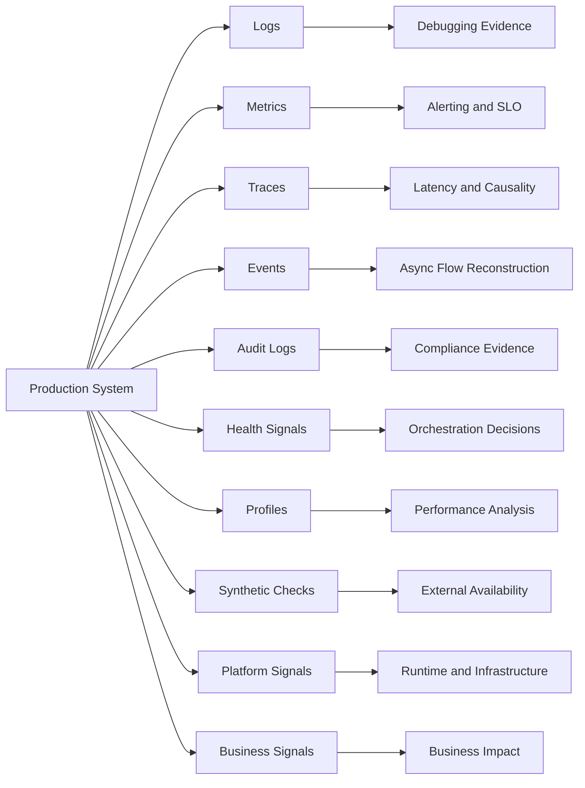

# Cheatsheet Observability Part 003 — Telemetry Signals

## Tujuan Part Ini

Part ini membahas **jenis-jenis telemetry signal** yang dipakai untuk membangun observability di sistem enterprise Java/JAX-RS. Fokusnya bukan memilih vendor, bukan memasang agent, dan bukan menghafal istilah. Fokusnya adalah memahami **signal mana yang menjawab pertanyaan apa**, kapan signal tersebut kuat, kapan lemah, apa biayanya, dan siapa yang harus memilikinya.

Setelah membaca part ini, Anda harus mampu membedakan dan menggunakan:

- log signal
- metric signal
- trace signal
- event signal
- audit signal
- profile signal
- health signal
- synthetic signal
- business signal
- platform signal

Part ini menjadi jembatan antara fondasi observability dan pembahasan detail tentang logging, metrics, tracing, OpenTelemetry, dashboard, alerting, SLO, dan production debugging di part berikutnya.

---

## Ringkasan Mental Model

Telemetry signal adalah **bukti yang dikeluarkan sistem** untuk menjelaskan behavior production.

Observability yang matang tidak berarti semua signal harus sebanyak mungkin. Observability yang matang berarti setiap signal memiliki:

- tujuan yang jelas
- pertanyaan production yang ingin dijawab
- owner yang jelas
- schema atau naming yang konsisten
- correlation field yang benar
- timestamp yang benar
- retention yang sesuai kebutuhan
- batas privacy/security
- biaya ingestion/storage/query yang disadari
- cara digunakan saat incident

Signal yang baik harus bisa membantu engineer menjawab pertanyaan seperti:

```text
Apa yang terjadi?
Seberapa sering terjadi?
Di mana terjadi?
Siapa atau entity apa yang terdampak?
Sejak kapan terjadi?
Apakah terjadi setelah deployment/config change?
Apakah failure berasal dari service sendiri atau dependency?
Apakah impact-nya global, per tenant, per region, per endpoint, atau per workflow?
Apakah behavior ini normal, degraded, broken, duplicate, stale, atau unauthorized?
```

Signal yang buruk biasanya hanya menambah noise:

```text
Log banyak tetapi tidak punya correlation ID.
Metric banyak tetapi label-nya tidak bisa di-aggregate.
Trace ada tetapi putus di Kafka consumer.
Audit event ada tetapi tidak mencatat actor dan before/after value.
Dashboard ramai tetapi tidak menjawab health atau impact.
Alert berbunyi tetapi tidak jelas tindakan apa yang harus dilakukan.
```

---

## Konsep Inti: Signal Bukan Data Mentah Saja

Telemetry sering diperlakukan sebagai data mentah. Ini berbahaya.

Data mentah belum tentu berguna. Signal berguna ketika ia membawa **semantics**.

Contoh log mentah:

```text
Pricing failed
```

Ini kurang berguna karena tidak menjawab:

- pricing untuk quote apa?
- tenant apa?
- request ID apa?
- error code apa?
- dependency mana yang gagal?
- retry keberapa?
- apakah failure expected atau unexpected?
- apakah quote masih bisa diproses ulang?

Contoh signal yang lebih kuat:

```json
{
  "timestamp": "2026-07-11T13:45:20.184Z",
  "level": "WARN",
  "service": "quote-service",
  "event": "quote.pricing.failed",
  "trace_id": "4f8c...",
  "correlation_id": "corr-...",
  "tenant_id": "tenant-123",
  "quote_id": "Q-88421",
  "pricing_request_id": "PR-9921",
  "dependency": "pricing-engine",
  "error_code": "PRICING_TIMEOUT",
  "retryable": true,
  "attempt": 2,
  "latency_ms": 5000
}
```

Yang berubah bukan hanya format. Yang berubah adalah **kemampuan menjawab pertanyaan**.

---

## Peta Signal Observability



Signal tidak berdiri sendiri. Dalam incident nyata, Anda biasanya membutuhkan kombinasi:

- metric untuk melihat **gejala dan skala**
- trace untuk melihat **path dan latency breakdown**
- log untuk melihat **detail event dan error**
- audit untuk melihat **aksi manusia atau business change**
- deployment marker untuk melihat **perubahan terbaru**
- platform signal untuk melihat **runtime/container/cloud condition**
- business metric untuk melihat **customer impact**

---

## 1. Log Signal

Log signal adalah event textual atau structured yang menjelaskan sesuatu yang terjadi di aplikasi.

Log kuat untuk menjawab:

- apa yang terjadi pada request tertentu?
- exception apa yang muncul?
- state transition apa yang dilakukan?
- dependency call mana yang gagal?
- business key mana yang terdampak?
- actor atau tenant mana yang terlibat?
- retry keberapa yang gagal?

Log lemah untuk menjawab:

- trend sistemik jangka panjang
- percentile latency
- rate error global
- saturation resource
- alert yang stabil tanpa noise
- agregasi high-volume jika schema buruk

Dalam Java/JAX-RS service, log biasanya muncul dari:

- request filter
- response filter
- resource method
- service layer
- repository layer
- transaction boundary
- HTTP client wrapper
- Kafka/RabbitMQ producer/consumer
- Redis client wrapper
- scheduler/background job
- ExceptionMapper
- security/auth layer

Log signal yang baik harus structured, correlated, contextual, dan aman dari PII leakage.

### Contoh pertanyaan yang dijawab log

```text
Apakah request quote pricing gagal karena validation, timeout, dependency error, atau invalid lifecycle state?
```

Log idealnya menyediakan:

- endpoint template
- status code
- error code
- exception class
- retryable flag
- quote ID/order ID
- tenant ID
- trace ID
- correlation ID
- dependency name
- duration

### Failure mode log signal

- log tidak muncul karena level salah
- log muncul tetapi tidak punya context
- log terlalu banyak sehingga query mahal
- log plain text sulit dicari
- log menyimpan token/password/body sensitif
- log menulis exception berulang di banyak layer
- log tidak punya timestamp yang konsisten
- log tidak bisa dikorelasikan dengan trace

---

## 2. Metric Signal

Metric signal adalah data numerik yang direkam sebagai time series.

Metric kuat untuk menjawab:

- berapa request per detik?
- berapa error rate?
- berapa p95/p99 latency?
- apakah consumer lag naik?
- apakah queue depth bertambah?
- apakah heap usage naik terus?
- apakah DB pool exhausted?
- apakah Redis hit ratio turun?
- apakah workflow failed job meningkat?

Metric lemah untuk menjawab:

- detail satu request spesifik
- stack trace
- business reason individual
- exact payload
- causal chain yang kompleks

Metric biasanya menjadi basis:

- dashboard
- alert
- SLI/SLO
- capacity planning
- trend analysis
- regression detection
- release comparison

Dalam Java/JAX-RS service, metric penting meliputi:

- request count
- request duration histogram
- error count
- status code distribution
- active request
- thread pool usage
- connection pool active/idle/pending
- JVM heap/non-heap
- GC pause
- CPU
- Kafka consumer lag
- RabbitMQ queue depth
- Redis latency/hit ratio
- Camunda failed jobs

### Contoh metric yang baik

```text
http.server.request.duration
labels: service, environment, method, route, status_code
unit: milliseconds
aggregation: histogram
```

Route harus berupa template seperti:

```text
/quotes/{quoteId}/price
```

Bukan raw path seperti:

```text
/quotes/Q-88421/price
```

Raw path dapat menyebabkan cardinality explosion.

### Failure mode metric signal

- metric type salah, misalnya gauge untuk counter event
- unit tidak jelas
- label terlalu high-cardinality
- label tidak konsisten antar service
- route memakai raw path
- error label memakai raw exception message
- metric tidak punya owner
- metric tidak digunakan dashboard/alert mana pun
- metric berubah nama tanpa migration
- histogram bucket tidak cocok dengan latency SLO

---

## 3. Trace Signal

Trace signal merekam causal path sebuah execution flow.

Trace kuat untuk menjawab:

- request melewati service mana saja?
- latency habis di span mana?
- dependency call mana yang lambat?
- apakah DB query atau downstream HTTP yang dominan?
- apakah trace putus saat masuk Kafka/RabbitMQ?
- apakah retry menyebabkan latency total membesar?
- apakah error terjadi di root span atau child span?

Trace lemah untuk menjawab:

- agregasi jangka panjang tanpa metric
- audit compliance
- semua detail domain jika span attributes miskin
- semua request jika sampling tinggi

Trace biasanya terdiri dari:

- trace ID
- span ID
- parent span ID
- span name
- span attributes
- span events
- span status
- start/end time
- resource attributes

Dalam Java/JAX-RS, trace biasanya dimulai dari:

```text
HTTP ingress -> Servlet/JAX-RS filter -> resource method -> service layer -> DB/Redis/HTTP/messaging -> response
```

Untuk async flow:

```text
HTTP request -> Kafka produce -> Kafka consume -> processing -> DB update -> downstream call
```

Trace hanya berguna jika context propagation berjalan benar.

### Failure mode trace signal

- trace tidak muncul karena instrumentation tidak aktif
- trace putus di executor/thread pool
- trace putus di Kafka/RabbitMQ header
- span name terlalu generic
- span attributes tidak mengikuti convention
- span menyimpan data sensitif
- sampling menyembunyikan request penting
- error span status tidak diset
- logs tidak mencantumkan trace ID

---

## 4. Event Signal

Event signal adalah record bahwa sesuatu terjadi. Event bisa berupa domain event, integration event, operational event, atau lifecycle event.

Event kuat untuk menjawab:

- quote dibuat kapan?
- pricing selesai kapan?
- approval diminta kapan?
- order dikirim ke fulfillment kapan?
- fallout dibuat karena apa?
- cancellation/amendment dimulai oleh siapa?
- event dikirim tetapi belum dikonsumsi?
- event duplicate atau out-of-order?

Event berbeda dari log.

Log biasanya untuk observability/debugging. Event biasanya bagian dari business/integration behavior.

Namun event dapat menjadi signal observability jika:

- punya event ID
- punya causation ID
- punya correlation ID
- punya timestamp producer
- punya schema version
- punya business key
- punya producer identity
- punya consumer processing status

Dalam Kafka/RabbitMQ, event signal sering menjadi bukti lifecycle async.

### Failure mode event signal

- event tidak punya correlation ID
- event tidak punya causation ID
- event ID tidak stabil
- timestamp producer/consumer membingungkan
- schema version tidak dicatat
- event duplicate tidak bisa dideteksi
- event age tidak diukur
- event masuk DLQ tanpa business context
- event payload menyimpan data sensitif yang tidak perlu

---

## 5. Audit Signal

Audit signal adalah bukti aksi yang penting untuk business, security, atau compliance.

Audit kuat untuk menjawab:

- siapa melakukan aksi?
- aksi apa yang dilakukan?
- terhadap entity apa?
- kapan dilakukan?
- dari mana dilakukan?
- sebelum dan sesudahnya apa?
- atas alasan apa?
- apakah actor melakukan impersonation/delegation?
- apakah aksi authorized?

Audit berbeda dari application log.

Application log boleh berubah format, boleh sampling dalam beberapa kasus, dan fokus pada debugging. Audit log harus lebih stabil, lengkap, terlindungi, dan sesuai kebijakan retention/compliance.

Dalam CPQ/order management, audit signal penting untuk:

- quote approval
- price override
- discount change
- order submission
- cancellation
- amendment
- manual fallout resolution
- user permission change
- security-sensitive access

### Failure mode audit signal

- audit event tidak dibuat untuk aksi penting
- audit tidak mencatat actor
- audit tidak mencatat target entity
- audit tidak mencatat before/after
- audit tidak immutable
- audit bisa dihapus tanpa kontrol
- audit bercampur dengan log biasa
- audit retention tidak sesuai compliance
- audit menyimpan terlalu banyak PII tanpa kebutuhan

---

## 6. Profile Signal

Profile signal merekam sample runtime untuk memahami performance behavior.

Profile kuat untuk menjawab:

- CPU habis di method mana?
- allocation paling besar berasal dari mana?
- thread blocked di mana?
- lock contention terjadi di mana?
- GC pressure disebabkan allocation pattern apa?
- request lambat karena compute, I/O, lock, atau GC?

Profile lemah untuk:

- business audit
- request-level causal chain jika tidak dikorelasikan
- long-term SLO tanpa metric

Untuk Java production, profile signal bisa berasal dari:

- Java Flight Recorder
- thread dump
- heap dump
- allocation profile
- CPU flame graph
- continuous profiler

Profile harus diperlakukan hati-hati karena dump dapat berisi data sensitif.

### Failure mode profile signal

- profiling terlalu berat di production
- heap dump menyimpan PII
- thread dump tidak punya context request
- profile diambil setelah incident selesai
- profile tidak dikorelasikan dengan deployment atau traffic spike
- continuous profiling tidak punya retention yang cukup

---

## 7. Health Signal

Health signal memberi tahu apakah komponen dianggap sehat untuk tujuan tertentu.

Health signal biasanya dipakai oleh:

- Kubernetes liveness probe
- Kubernetes readiness probe
- startup probe
- load balancer health check
- deployment rollout
- synthetic monitor

Health signal kuat untuk menjawab:

- apakah pod boleh menerima traffic?
- apakah container perlu direstart?
- apakah service endpoint reachable?
- apakah startup selesai?

Health signal lemah untuk menjawab:

- mengapa service degrade?
- request mana yang gagal?
- dependency mana yang lambat?
- apakah tenant tertentu terdampak?

Health check bukan pengganti observability.

### Failure mode health signal

- liveness terlalu deep dan menyebabkan restart loop
- readiness terlalu shallow dan service menerima traffic sebelum siap
- health check dependency terlalu agresif
- timeout terlalu pendek
- health check memakai DB query berat
- false healthy karena hanya cek process alive
- false unhealthy karena dependency transient

---

## 8. Synthetic Signal

Synthetic signal berasal dari request buatan yang mensimulasikan user/client journey.

Synthetic kuat untuk menjawab:

- apakah API benar-benar bisa diakses dari region tertentu?
- apakah authenticated flow masih berhasil?
- apakah quote creation smoke test berhasil?
- apakah private endpoint reachable?
- apakah load balancer/gateway path sehat?

Synthetic berbeda dari health check internal karena melihat sistem dari luar atau dari perspektif consumer.

### Failure mode synthetic signal

- synthetic test terlalu shallow
- test account expired
- test data kotor
- false positive karena dependency test environment
- frequency terlalu tinggi dan menambah load
- synthetic tidak mencakup auth/tenant/region penting
- synthetic alert tidak punya runbook

---

## 9. Business Signal

Business signal menjelaskan health dari proses bisnis, bukan hanya health teknis.

Dalam CPQ/order management, business signal bisa berupa:

- quote created count
- quote priced count
- quote approval requested count
- quote approval aging
- quote rejected count
- order submitted count
- order validation failure count
- order fulfillment started count
- fulfillment fallout count
- cancellation requested count
- amendment requested count
- stuck order count
- reconciliation mismatch count

Business signal kuat untuk menjawab:

- apakah customer journey berjalan?
- apakah quote/order funnel drop di state tertentu?
- apakah approval aging meningkat?
- apakah fallout meningkat setelah release?
- apakah technical incident berdampak ke business KPI?

Business signal tidak selalu cocok untuk paging engineer secara langsung, tetapi sangat penting untuk impact analysis.

### Failure mode business signal

- business metric tidak punya definisi jelas
- state transition metric double count
- event duplicate menyebabkan overcount
- tenant/customer dimension terlalu sensitif atau high-cardinality
- dashboard business tidak sinkron dengan domain lifecycle
- metric tidak membedakan created vs completed vs failed

---

## 10. Platform Signal

Platform signal berasal dari infrastructure, runtime, container, orchestrator, cloud, network, dan managed service.

Contoh platform signal:

- Kubernetes pod restart
- container OOMKilled
- CPU throttling
- node pressure
- HPA scaling event
- ingress 5xx
- NGINX upstream response time
- load balancer target health
- AWS CloudWatch metrics
- Azure Monitor metrics
- managed database CPU/storage/connections
- managed broker queue depth
- cloud service health

Platform signal kuat untuk menjawab:

- apakah failure berasal dari aplikasi atau platform?
- apakah pod restart bertepatan dengan error spike?
- apakah CPU throttling membuat latency naik?
- apakah ingress/gateway menghasilkan 502/504?
- apakah managed DB mengalami resource pressure?

### Failure mode platform signal

- platform metric tidak dikorelasikan dengan service/version
- pod labels tidak konsisten
- deployment marker tidak ada
- cloud logs tidak dikirim ke tempat yang sama
- on-prem dan cloud dashboard terpisah tanpa common identity
- platform alert tidak punya service owner mapping

---

## Signal vs Question Matrix

| Pertanyaan Production | Signal Utama | Signal Pendukung |
|---|---|---|
| Apakah service sedang error? | Metrics | Logs, traces |
| Request tertentu gagal di mana? | Traces | Logs, metrics |
| Kenapa latency p95 naik? | Metrics | Traces, profiles, platform metrics |
| Apakah issue hanya tenant tertentu? | Logs, business metrics | Metrics dengan label aman, traces |
| Apakah order stuck? | Business metrics | Logs, audit, workflow metrics |
| Apakah Kafka consumer tertinggal? | Messaging metrics | Logs, traces, platform metrics |
| Apakah Redis cache degrade? | Redis metrics | Logs, traces |
| Siapa mengubah price override? | Audit | Logs, business events |
| Apakah deployment menyebabkan error spike? | Deployment marker, metrics | Logs, traces |
| Apakah CPU habis karena code path tertentu? | Profiles | Metrics, traces |
| Apakah pod restart karena memory? | Kubernetes metrics/events | JVM metrics, logs |
| Apakah alert actionable? | Alert metadata | Dashboard, runbook, owner |

---

## Signal Lifecycle

Signal yang matang memiliki lifecycle.

```text
Design -> Instrument -> Emit -> Collect -> Transform -> Store -> Query -> Visualize -> Alert -> Review -> Retire
```

### 1. Design

Sebelum menambah signal, jawab:

- pertanyaan apa yang akan dijawab?
- siapa pengguna signal?
- apakah signal dipakai saat incident, dashboard, alert, audit, atau compliance?
- apakah ada signal lain yang sudah menjawab hal yang sama?
- apakah label/field aman?
- apakah cardinality terkendali?
- apakah biayanya masuk akal?

### 2. Instrument

Instrumentation harus ditempatkan di boundary yang tepat:

- HTTP ingress
- resource method
- service layer critical path
- DB access
- Redis access
- HTTP client
- Kafka/RabbitMQ produce/consume
- workflow task
- background job
- state transition
- audit-sensitive action

Instrumentation yang terlalu dalam bisa mahal. Instrumentation yang terlalu dangkal tidak membantu diagnosis.

### 3. Emit

Signal harus dikeluarkan dengan:

- timestamp benar
- context lengkap
- schema stabil
- unit jelas
- severity/status jelas
- privacy filtering
- correlation IDs

### 4. Collect

Signal harus dikumpulkan oleh log agent, metrics scraper, OpenTelemetry collector, cloud agent, atau platform pipeline.

Risiko umum:

- agent crash
- collector bottleneck
- dropped telemetry
- backpressure
- misconfigured endpoint
- network policy blocking exporter

### 5. Transform

Transformasi bisa meliputi:

- masking
- enrichment
- resource attribute injection
- sampling
- batching
- label normalization
- field rename
- routing per environment

Transformasi harus hati-hati. Transformasi yang salah bisa menghapus evidence penting.

### 6. Store

Storage terkait:

- retention
- query speed
- cost
- access control
- compliance
- hot/cold archive

### 7. Query

Signal harus bisa dicari dengan pola yang realistis:

```text
trace_id = ...
correlation_id = ...
quote_id = ...
order_id = ...
service = ... AND level = ERROR
route = ... AND status_code >= 500
consumer_group = ... AND topic = ...
```

### 8. Visualize

Dashboard harus menjawab pertanyaan, bukan hanya menampilkan data.

### 9. Alert

Alert hanya layak jika:

- actionable
- punya owner
- punya severity
- punya runbook
- punya threshold/window yang masuk akal
- tidak noisy
- mengarah ke user/customer/business impact atau reliability risk

### 10. Review and Retire

Signal harus direview. Signal usang harus dihapus atau diperbaiki.

---

## Signal Ownership

Signal tanpa owner akan membusuk.

Owner bertanggung jawab atas:

- definisi signal
- schema/naming
- correctness
- cost
- dashboard usage
- alert usage
- retention need
- privacy/security review
- documentation
- change management

Ownership dapat berada pada:

- service team
- backend team
- SRE/platform team
- security team
- compliance team
- domain/product team

Contoh ownership yang sehat:

| Signal | Owner Utama | Reviewer Pendukung |
|---|---|---|
| Application logs | Service team | Platform/SRE, Security |
| HTTP RED metrics | Service team | SRE |
| Kubernetes metrics | Platform/SRE | Service team |
| Audit logs | Service team | Security/Compliance |
| Business lifecycle metrics | Domain/service team | Product/Operations |
| SLO alerts | Service owner | SRE/Operations |
| Collector pipeline | Platform/SRE | Service team |

---

## Signal Quality Dimensions

Gunakan dimensi berikut untuk menilai kualitas signal.

### 1. Correctness

Signal benar secara semantics.

Contoh masalah correctness:

- metric `order_completed_total` bertambah sebelum order benar-benar terminal
- error count menghitung validation failure sebagai system error
- latency metric tidak mencakup retry
- audit event dibuat sebelum transaksi DB commit
- trace span status tetap OK walaupun response 500

### 2. Completeness

Signal cukup lengkap untuk diagnosis.

Contoh masalah completeness:

- log error tanpa error code
- metric tanpa route
- trace tanpa dependency span
- audit tanpa actor
- business event tanpa order ID

### 3. Consistency

Signal konsisten antar service.

Contoh masalah consistency:

- satu service memakai `tenant`, service lain memakai `tenantId`
- route label kadang raw path, kadang template
- status code label string di satu service dan number di service lain
- error code format berbeda-beda

### 4. Correlatability

Signal bisa dikorelasikan dengan signal lain.

Field penting:

- trace ID
- span ID
- correlation ID
- request ID
- causation ID
- message ID
- event ID
- business key
- tenant ID
- service name
- environment
- version

### 5. Timeliness

Signal tersedia cukup cepat untuk incident response.

Masalah umum:

- log delay beberapa menit
- metric scrape interval terlalu lama
- trace export tertunda
- collector batching terlalu agresif
- cloud log ingestion delay

### 6. Queryability

Signal bisa dicari tanpa query yang absurd.

Masalah umum:

- field nested tidak konsisten
- message text harus di-parse manual
- business key tidak di-index
- timestamp timezone tidak jelas
- cardinality membuat query lambat

### 7. Safety

Signal aman secara privacy/security.

Masalah umum:

- Authorization header masuk log
- request body mengandung PII
- SQL parameter berisi customer data
- Redis key berisi email/user ID
- trace attributes menyimpan token

### 8. Cost Efficiency

Signal memberi nilai lebih besar dari biayanya.

Masalah umum:

- DEBUG log aktif terus di production
- metric label memakai request ID
- trace sampling 100% di endpoint high-throughput tanpa alasan
- dashboard query mahal untuk panel yang jarang dipakai

---

## Telemetry Signal di Java/JAX-RS Request Lifecycle

Contoh request lifecycle:

```text
Client
  -> NGINX / Ingress / API Gateway
  -> Java Servlet Container
  -> JAX-RS Filter
  -> Resource Method
  -> Service Layer
  -> PostgreSQL via JDBC/MyBatis/JPA
  -> Redis
  -> Kafka/RabbitMQ Producer
  -> Downstream HTTP Service
  -> Response
```

Signal yang ideal:

| Layer | Signal Penting |
|---|---|
| Edge/Ingress | access log, request time, upstream status, client IP policy |
| JAX-RS filter | request start/end log, route, status, latency, correlation ID |
| Resource method | domain action log, validation result, error mapping |
| Service layer | business event, state transition, audit intent |
| DB layer | query span, pool metric, slow query, transaction duration |
| Redis layer | command span, hit/miss, latency, key masking |
| Messaging producer | publish span, event ID, topic/queue, header propagation |
| HTTP client | downstream span, status, timeout, retry, circuit breaker |
| Response | status code, latency, error code, response size |

---

## Telemetry Signal untuk Async Flow

Contoh async flow:

```text
Quote Accepted
  -> order-created event published
  -> Kafka topic
  -> order-service consumer
  -> validation
  -> DB update
  -> fulfillment command published
  -> Camunda workflow started
```

Signal penting:

- event ID
- correlation ID
- causation ID
- traceparent header
- producer timestamp
- consumer receive timestamp
- event age
- consumer lag
- processing duration
- retry count
- DLQ count
- business state transition
- audit event untuk action penting

Async observability sering gagal karena engineer hanya menginstrument HTTP. Padahal banyak production issue terjadi setelah request HTTP selesai.

---

## Telemetry Signal untuk PostgreSQL/MyBatis/JPA/JDBC

Untuk database, signal harus menjawab:

- apakah endpoint lambat karena query?
- apakah connection pool penuh?
- apakah transaction terlalu lama?
- apakah lock wait atau deadlock terjadi?
- apakah rows affected sesuai expectation?
- apakah ORM menghasilkan query yang tidak terduga?

Signal penting:

- connection pool active/idle/pending
- query duration histogram
- slow query logs
- DB span attributes
- transaction duration
- lock/deadlock metrics/logs
- statement sanitization
- rows affected log untuk operasi penting

Privacy concern:

- jangan log SQL parameter sensitif sembarangan
- jangan jadikan raw SQL high-cardinality metric label
- jangan simpan customer data di span attribute

---

## Telemetry Signal untuk Kafka/RabbitMQ

Untuk messaging, signal harus menjawab:

- event sudah dipublish atau belum?
- consumer menerima atau belum?
- event tertunda berapa lama?
- consumer lag naik?
- retry meningkat?
- DLQ bertambah?
- redelivery loop terjadi?
- message duplicate atau out-of-order?

Signal penting:

- producer send count/error/latency
- consumer processing count/error/latency
- consumer lag
- queue depth
- unacked messages
- redelivery count
- DLQ count
- event age
- event ID
- message ID
- correlation/causation ID
- trace context headers

---

## Telemetry Signal untuk Redis

Untuk Redis, signal harus menjawab:

- apakah cache membantu atau malah degrade?
- apakah hit ratio turun?
- apakah Redis latency naik?
- apakah eviction terjadi?
- apakah memory penuh?
- apakah lock/idempotency key bermasalah?
- apakah stream pending entries menumpuk?

Signal penting:

- cache hit/miss
- command latency
- command error
- slowlog
- memory usage
- eviction count
- keyspace size
- connected/blocked clients
- replication lag
- lock acquisition success/failure
- idempotency hit/miss

Privacy concern:

- key Redis sering mengandung business/user identifier
- key harus dimasking atau dikategorikan, bukan direkam mentah sebagai label

---

## Telemetry Signal untuk Camunda/Workflow

Untuk workflow, signal harus menjawab:

- process instance stuck di step mana?
- failed job meningkat?
- timer backlog terjadi?
- human task aging melewati SLA?
- message correlation gagal?
- worker latency naik?
- variable size terlalu besar?

Signal penting:

- process instance count
- active process count
- failed job count
- incident count
- task aging
- worker duration
- worker failure rate
- timer backlog
- message correlation failure
- state transition audit

---

## Telemetry Signal untuk Kubernetes/AWS/Azure/On-Prem

Platform signal harus menjawab:

- apakah aplikasi mati karena code atau container?
- apakah pod restart?
- apakah OOMKilled?
- apakah CPU throttling?
- apakah node pressure?
- apakah ingress gagal ke upstream?
- apakah managed DB/broker bermasalah?
- apakah cloud service incident?

Signal penting:

- pod status
- restart count
- CPU/memory usage
- CPU throttling
- OOMKilled
- readiness/liveness failure
- deployment availability
- HPA status
- ingress 5xx
- load balancer target health
- managed service metrics
- cloud audit logs

---

## Signal Trade-Offs

### Correctness Trade-Off

Signal yang salah lebih berbahaya daripada signal yang tidak ada karena bisa mengarahkan incident response ke diagnosis yang salah.

Contoh:

- metric `success_total` bertambah sebelum transaksi commit
- audit log dibuat walaupun rollback
- span status OK padahal response error
- business state metric double-count karena retry

### Performance Trade-Off

Instrumentation memiliki overhead.

Risiko:

- synchronous logging blocking request
- terlalu banyak span manual di hot path
- metric label construction mahal
- body logging memperbesar memory pressure
- profiling berat saat traffic tinggi

### Security/Privacy Trade-Off

Signal sering berisi context production. Context yang terlalu detail bisa membocorkan data.

Risiko:

- token di log
- PII di trace attribute
- SQL parameter di log
- Redis key mentah
- audit log terlalu terbuka

### Cost Trade-Off

Signal membutuhkan ingestion, storage, index, query, dan retention.

Risiko:

- high-cardinality metric
- excessive INFO logs
- DEBUG logs aktif di production
- full trace sampling tanpa batas
- dashboard query mahal

### Operational Trade-Off

Signal harus membantu operasi, bukan membebani.

Risiko:

- terlalu banyak dashboard
- terlalu banyak alert
- signal tidak punya owner
- runbook tidak sinkron dengan alert
- telemetry berubah tanpa komunikasi

---

## Anti-Pattern Telemetry Signals

### 1. Everything Is Logged

Semua hal dilog, tetapi tidak ada structure, context, atau level discipline.

Dampaknya:

- query mahal
- engineer sulit menemukan bukti
- alert noise
- PII leakage risk

### 2. Metrics Without Semantics

Metric dibuat hanya karena mudah, bukan karena ada pertanyaan.

Dampaknya:

- dashboard penuh chart tidak berguna
- alert threshold arbitrary
- metric owner tidak jelas

### 3. Traces Without Context

Trace ada tetapi span miskin attribute dan tidak terkoneksi ke log.

Dampaknya:

- latency path terlihat, tetapi business impact tidak jelas
- request customer tertentu sulit dilacak

### 4. Audit as Normal Log

Audit event dicampur dengan application log biasa.

Dampaknya:

- retention tidak sesuai
- access control lemah
- compliance evidence tidak kuat

### 5. Platform Metrics Detached from Application

Kubernetes/cloud metric ada, tetapi tidak bisa dikaitkan dengan service version, deployment, atau request impact.

Dampaknya:

- sulit membedakan platform issue dari application regression

### 6. Business Metrics Detached from Technical Signals

Business dashboard menunjukkan order stuck, tetapi tidak bisa drilldown ke trace/log/workflow failure.

Dampaknya:

- business impact diketahui tetapi root cause sulit ditemukan

---

## Production Debugging dengan Multi-Signal Reasoning

Contoh incident:

```text
Order submission error rate naik setelah release.
```

Jangan langsung membaca log acak. Gunakan signal secara berurutan.

### Langkah 1: Metrics untuk ukuran gejala

Pertanyaan:

- error rate naik berapa besar?
- endpoint mana?
- status code apa?
- tenant/region tertentu atau global?
- latency juga naik atau hanya error?

### Langkah 2: Deployment marker untuk perubahan

Pertanyaan:

- mulai kapan?
- ada deployment/config change?
- ada migration?
- ada feature flag change?

### Langkah 3: Traces untuk causal path

Pertanyaan:

- span mana yang error?
- dependency mana yang lambat/gagal?
- apakah error terjadi sebelum atau sesudah DB commit?
- apakah retry terjadi?

### Langkah 4: Logs untuk detail

Pertanyaan:

- error code apa?
- exception class apa?
- business key mana?
- retryable atau permanent?
- validation, auth, dependency, atau state error?

### Langkah 5: Platform signals

Pertanyaan:

- pod restart?
- CPU throttling?
- DB pool penuh?
- Kafka/RabbitMQ backlog?
- managed service degraded?

### Langkah 6: Business signals

Pertanyaan:

- berapa order terdampak?
- stuck di state mana?
- apakah fulfillment/fallout meningkat?
- apakah ada reconciliation mismatch?

### Langkah 7: Audit/events

Pertanyaan:

- ada config/business change?
- ada manual action?
- ada approval/policy change?

---

## Internal Verification Checklist

Gunakan checklist ini untuk memetakan kondisi nyata di codebase/team.

### Signal Inventory

- Signal apa saja yang tersedia untuk service utama?
- Apakah ada log, metric, trace, audit, health, synthetic, profile, platform, dan business signal?
- Signal mana yang wajib untuk setiap service?
- Signal mana yang optional?
- Signal mana yang belum ada tetapi sering dibutuhkan saat incident?

### Ownership

- Siapa owner application logs?
- Siapa owner service metrics?
- Siapa owner tracing instrumentation?
- Siapa owner audit logging?
- Siapa owner dashboard?
- Siapa owner alert rules?
- Siapa owner SLO?
- Siapa owner collector/agent/platform pipeline?

### Logging

- Apakah logs structured JSON?
- Apakah logs punya timestamp, level, service, environment, version?
- Apakah logs punya trace ID/correlation ID/request ID?
- Apakah logs punya tenant ID dan business key saat relevan?
- Apakah logs aman dari PII/token leakage?

### Metrics

- Apakah service punya RED metrics?
- Apakah JVM metrics tersedia?
- Apakah connection pool metrics tersedia?
- Apakah dependency metrics tersedia?
- Apakah metric labels mengikuti convention?
- Apakah ada high-cardinality label?

### Tracing

- Apakah OpenTelemetry digunakan?
- Apakah auto-instrumentation atau manual instrumentation?
- Apakah trace context tersambung HTTP -> DB -> Redis -> Kafka/RabbitMQ -> downstream?
- Apakah logs mencantumkan trace ID?
- Apakah sampling policy diketahui?

### Audit

- Aksi bisnis apa yang wajib diaudit?
- Aksi security apa yang wajib diaudit?
- Apakah audit event immutable?
- Apakah audit retention diketahui?
- Apakah audit access dikontrol?

### Dashboard and Alert

- Dashboard utama apa yang dipakai saat incident?
- Apakah dashboard punya owner?
- Apakah alert punya runbook?
- Apakah alert actionable?
- Apakah alert noisy?
- Apakah alert terhubung ke SLO?

### Cost and Retention

- Berapa retention log/metric/trace?
- Signal mana paling mahal?
- Apakah ada log sampling atau trace sampling?
- Apakah ada cardinality report?
- Apakah audit retention berbeda dari application logs?

### Internal CSG Verification

- Platform observability internal apa yang digunakan?
- Apakah ada standard log schema internal?
- Apakah ada correlation ID convention internal?
- Apakah ada OpenTelemetry standard internal?
- Apakah ada dashboard template internal?
- Apakah ada alert severity model internal?
- Apakah ada SLO/SLA/error budget process internal?
- Apakah ada security/privacy logging policy internal?
- Apakah ada incident/RCA template internal?

---

## PR Review Checklist

Saat mereview PR yang menambah atau mengubah telemetry signal, tanyakan:

### Purpose

- Pertanyaan production apa yang dijawab signal ini?
- Apakah signal ini untuk debugging, alerting, SLO, audit, dashboard, atau compliance?
- Apakah signal ini benar-benar diperlukan?

### Correctness

- Apakah signal emitted pada lifecycle point yang benar?
- Apakah metric bertambah setelah aksi benar-benar sukses?
- Apakah audit event dibuat setelah commit atau dengan outbox pattern?
- Apakah span status sesuai result?

### Context

- Apakah trace ID/correlation ID tersedia?
- Apakah tenant/business key tersedia saat relevan?
- Apakah request ID/causation ID/event ID tersedia untuk async flow?

### Cardinality and Cost

- Apakah label aman dari cardinality explosion?
- Apakah log volume masuk akal?
- Apakah trace sampling perlu disesuaikan?
- Apakah field baru akan di-index dan menambah biaya?

### Privacy and Security

- Apakah ada PII?
- Apakah ada token/password/cookie/header sensitif?
- Apakah SQL parameter atau request body aman?
- Apakah audit access sesuai policy?

### Operational Usefulness

- Apakah signal muncul di dashboard?
- Apakah alert perlu diperbarui?
- Apakah runbook perlu diperbarui?
- Apakah SLO terpengaruh?
- Apakah incident debugging menjadi lebih mudah?

---

## Kesalahan Berpikir yang Harus Dihindari

### “Kalau ada log, berarti observable.”

Tidak benar. Log tanpa correlation, schema, dan context sering tidak cukup.

### “Metric harus punya semua dimension agar fleksibel.”

Tidak benar. Terlalu banyak dimension bisa menghancurkan metric backend.

### “Trace 100% selalu terbaik.”

Tidak selalu. Trace volume mahal. Sampling harus disesuaikan dengan risk dan traffic.

### “Audit log sama dengan application log.”

Tidak benar. Audit log punya requirement evidence, retention, immutability, dan access control yang berbeda.

### “Dashboard banyak berarti observability bagus.”

Tidak benar. Dashboard yang baik menjawab pertanyaan penting dengan cepat.

### “Alert semua error agar aman.”

Tidak benar. Alert noise membuat engineer mengabaikan alert penting.

---

## Mini Case Study: Quote Pricing Latency Spike

Gejala:

```text
p95 latency endpoint quote pricing naik dari 400ms ke 6s.
```

Signal yang digunakan:

1. **Metric** menunjukkan latency spike hanya pada route `/quotes/{quoteId}/price`.
2. **Trace** menunjukkan child span `pricing-engine.call` mengambil 5.5s.
3. **HTTP client metric** menunjukkan timeout dan retry naik.
4. **Log** menunjukkan `PRICING_TIMEOUT` dengan `attempt=2`.
5. **Deployment marker** menunjukkan release quote-service 15 menit sebelum spike.
6. **Platform signal** menunjukkan tidak ada pod restart atau CPU throttling.
7. **Business signal** menunjukkan quote priced count turun dan approval aging naik.
8. **Audit signal** menunjukkan perubahan pricing rule config di tenant tertentu.

Kesimpulan awal:

```text
Issue kemungkinan bukan JVM atau Kubernetes.
Issue terkait dependency pricing-engine atau config pricing rule untuk subset tenant.
```

Tanpa multi-signal reasoning, engineer mungkin hanya melihat log error dan menyalahkan downstream tanpa bukti impact dan timeline.

---

## Expected Mastery Setelah Part Ini

Anda harus mampu:

- membedakan log, metric, trace, event, audit, profile, health, synthetic, business, dan platform signal
- memilih signal yang tepat untuk pertanyaan production tertentu
- menjelaskan kekuatan dan kelemahan tiap signal
- memahami signal lifecycle dari design sampai retirement
- menilai signal dari correctness, completeness, consistency, correlatability, safety, cost, dan operational usefulness
- memetakan signal ke Java/JAX-RS request lifecycle
- memetakan signal ke PostgreSQL, Redis, Kafka, RabbitMQ, Camunda, Kubernetes, AWS/Azure, dan hybrid deployment
- melakukan PR review awal untuk telemetry signal
- membuat internal verification checklist tanpa mengarang detail stack internal

---

## Penutup

Observability bukan tentang mengumpulkan semua data. Observability adalah tentang menghasilkan signal yang benar, cukup, aman, bisa dikorelasikan, dan bisa digunakan saat production sedang bermasalah.

Part berikutnya akan masuk ke fondasi logging: apa itu log event, structured log, JSON log, log level, timestamp, thread, logger, exception stack trace, dan context field sebelum membahas ekosistem logging Java secara lebih spesifik.
