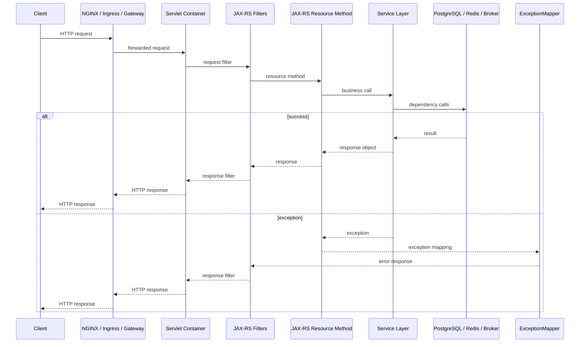

# Part 010 — Logging in JAX-RS/Jakarta REST

## 1. Core Idea

A Java/JAX-RS service is often the first application-level boundary where a customer operation becomes visible to backend code.
If this boundary is poorly logged, every downstream investigation becomes harder.

Request/response logging in JAX-RS should answer:

- What endpoint was called?
- Who or what called it?
- Which tenant/account/business entity was affected?
- Which request ID and correlation ID belong to it?
- What was the outcome?
- How long did it take?
- Was failure expected or unexpected?
- Was the error caused by validation, authorization, dependency failure, timeout, or application bug?
- Which trace/span can show the execution graph?
- What must not be logged because of privacy/security risk?

This part focuses on logging at the REST boundary, especially for Java 17+ systems using JAX-RS/Jakarta RESTful Web Services, Jersey-style filters, Servlet containers, structured JSON logs, MDC, and OpenTelemetry correlation.

---

## 2. What JAX-RS Boundary Logging Is For

JAX-RS boundary logging is not meant to print every request detail.
It is meant to create stable operational evidence.

A good request log helps answer:

- Did the request reach the application?
- Which route handled it?
- What was the status code?
- What was the latency?
- Was the request authenticated?
- Which tenant or actor was involved?
- Was the operation business-significant?
- Did the application reject it or did a dependency fail?
- Which trace/log/audit records should be inspected next?

A poor request log often has one of these problems:

- logs raw URLs with sensitive query parameters
- logs request/response body without masking
- misses endpoint template
- misses request/correlation ID
- logs every 4xx as ERROR
- logs stack traces twice
- does not log latency
- cannot distinguish validation failure from system failure
- logs after MDC cleanup
- does not handle exceptions consistently
- does not align with edge access logs

---

## 3. Request Lifecycle in JAX-RS

A simplified request lifecycle:



Logging can happen at multiple points:

- edge access log
- servlet filter
- JAX-RS request filter
- resource method
- service layer
- repository/client layer
- exception mapper
- JAX-RS response filter

The key is to avoid duplicate, contradictory, or noisy logs.

---

## 4. What to Log at the REST Boundary

At minimum, request completion logs should include:

```json
{
  "event.name": "http.server.request.completed",
  "service.name": "quote-service",
  "environment": "prod",
  "request.id": "req_01JABC...",
  "correlation.id": "corr_01JABC...",
  "trace.id": "4bf92f3577b34da6a3ce929d0e0e4736",
  "span.id": "00f067aa0ba902b7",
  "http.method": "POST",
  "http.route": "/quotes/{quoteId}/submit",
  "http.status_code": 202,
  "duration.ms": 87,
  "outcome": "success",
  "tenant.id": "tenant_abc",
  "actor.id": "user_123",
  "quote.id": "Q-2026-000123"
}
```

For errors:

```json
{
  "event.name": "http.server.request.failed",
  "request.id": "req_01JABC...",
  "correlation.id": "corr_01JABC...",
  "trace.id": "4bf92f3577b34da6a3ce929d0e0e4736",
  "http.method": "POST",
  "http.route": "/quotes/{quoteId}/submit",
  "http.status_code": 503,
  "duration.ms": 3010,
  "outcome": "failure",
  "error.type": "DependencyTimeoutException",
  "error.code": "ORDER_SERVICE_TIMEOUT",
  "error.category": "dependency_timeout",
  "dependency.name": "order-service",
  "quote.id": "Q-2026-000123"
}
```

---

## 5. Request Start Log vs Request End Log

### Request Start Log

A request start log proves the application began handling a request.

Useful fields:

- request ID
- correlation ID
- method
- route/path
- tenant/actor if known early
- trace ID
- client metadata if allowed

Example:

```json
{
  "event.name": "http.server.request.started",
  "level": "INFO",
  "http.method": "POST",
  "http.path": "/quotes/Q-2026-000123/submit",
  "request.id": "req_01JABC...",
  "correlation.id": "corr_01JABC..."
}
```

Use request start logs carefully.
At high traffic, logging both start and end for every request doubles log volume.
Some systems log only completion and error logs.

### Request End Log

A request end/completion log is usually more valuable.
It contains:

- final status code
- latency
- outcome
- endpoint template
- error category if failed

Example:

```json
{
  "event.name": "http.server.request.completed",
  "level": "INFO",
  "http.method": "POST",
  "http.route": "/quotes/{quoteId}/submit",
  "http.status_code": 202,
  "duration.ms": 87,
  "outcome": "success"
}
```

Recommended baseline:

- completion log for important APIs
- error log for failures
- optional start log for long-running or high-risk operations
- sampling for high-volume low-risk endpoints
- separate audit log for business-significant actions

---

## 6. Endpoint Template vs Raw Path

Always prefer endpoint template for aggregation.

Good:

```text
http.route = /quotes/{quoteId}/submit
```

Risky:

```text
http.path = /quotes/Q-2026-000123/submit
```

Raw paths can:

- leak business identifiers
- create high cardinality metrics
- make dashboards noisy
- make endpoint aggregation difficult

Raw path may still be useful in logs if allowed by policy, but metrics and dashboards should use route template.

For JAX-RS, route template extraction may require framework-specific handling.
Verify how your implementation exposes matched resource templates.

---

## 7. Status Code Logging Strategy

HTTP status code alone is not enough.

Classify outcome:

| Status | Typical Meaning | Logging Guidance |
|---|---|---|
| 2xx | Success | INFO or sampled INFO |
| 3xx | Redirect/cache semantics | Usually INFO/DEBUG depending on service |
| 400 | Client validation error | INFO or WARN depending on noise and business impact |
| 401 | Authentication failure | INFO/WARN, security-aware, avoid token data |
| 403 | Authorization failure | WARN if suspicious, INFO if expected policy denial |
| 404 | Missing resource | INFO unless unusual spike |
| 409 | Conflict/state violation | INFO/WARN depending on domain significance |
| 422 | Semantic validation failure | INFO/WARN depending on business impact |
| 429 | Rate limit | WARN if service impact; INFO if expected throttling |
| 500 | Application error | ERROR |
| 502/503/504 | Dependency/platform failure | ERROR or WARN depending on ownership and retry behavior |

Do not log all 4xx as ERROR.
Many 4xx responses are expected client or business validation outcomes.

A better field model:

```text
http.status_code = 409
error.category = business_conflict
error.code = QUOTE_ALREADY_APPROVED
outcome = rejected
```

This is more useful than:

```text
ERROR Request failed with status 409
```

---

## 8. JAX-RS Filters

JAX-RS provides filters that can observe requests and responses.

Important interfaces:

- `ContainerRequestFilter`
- `ContainerResponseFilter`
- `DynamicFeature`
- `NameBinding`
- framework-specific request properties

A request filter can:

- generate/extract request ID
- generate/extract correlation ID
- attach MDC fields
- capture start time
- normalize inbound headers
- attach context to request properties

A response filter can:

- calculate duration
- log completion
- add response headers
- clean up MDC

---

## 9. Basic Request/Response Logging Filter

Example skeleton:

```java
package com.example.observability;

import jakarta.annotation.Priority;
import jakarta.ws.rs.Priorities;
import jakarta.ws.rs.container.ContainerRequestContext;
import jakarta.ws.rs.container.ContainerRequestFilter;
import jakarta.ws.rs.container.ContainerResponseContext;
import jakarta.ws.rs.container.ContainerResponseFilter;
import jakarta.ws.rs.ext.Provider;
import org.slf4j.Logger;
import org.slf4j.LoggerFactory;
import org.slf4j.MDC;

import java.io.IOException;
import java.time.Duration;
import java.time.Instant;
import java.util.UUID;

@Provider
@Priority(Priorities.AUTHENTICATION)
public class RequestLoggingFilter implements ContainerRequestFilter, ContainerResponseFilter {

    private static final Logger log = LoggerFactory.getLogger(RequestLoggingFilter.class);

    private static final String START_TIME = "observability.startTime";
    private static final String REQUEST_ID = "request.id";
    private static final String CORRELATION_ID = "correlation.id";

    @Override
    public void filter(ContainerRequestContext requestContext) throws IOException {
        String requestId = valueOrGenerate(requestContext.getHeaderString("X-Request-ID"), "req");
        String correlationId = valueOrGenerate(requestContext.getHeaderString("X-Correlation-ID"), "corr");

        requestContext.setProperty(START_TIME, Instant.now());
        requestContext.setProperty(REQUEST_ID, requestId);
        requestContext.setProperty(CORRELATION_ID, correlationId);

        MDC.put(REQUEST_ID, requestId);
        MDC.put(CORRELATION_ID, correlationId);
        MDC.put("http.method", requestContext.getMethod());
        MDC.put("http.path", safePath(requestContext));
    }

    @Override
    public void filter(ContainerRequestContext requestContext, ContainerResponseContext responseContext)
            throws IOException {
        Instant start = (Instant) requestContext.getProperty(START_TIME);
        long durationMs = start == null ? -1 : Duration.between(start, Instant.now()).toMillis();

        int status = responseContext.getStatus();
        String method = requestContext.getMethod();
        String path = safePath(requestContext);
        String requestId = (String) requestContext.getProperty(REQUEST_ID);
        String correlationId = (String) requestContext.getProperty(CORRELATION_ID);

        responseContext.getHeaders().putSingle("X-Request-ID", requestId);
        responseContext.getHeaders().putSingle("X-Correlation-ID", correlationId);

        if (status >= 500) {
            log.error("http_request_completed method={} path={} status={} duration_ms={} outcome=failure",
                    method, path, status, durationMs);
        } else if (status >= 400) {
            log.warn("http_request_completed method={} path={} status={} duration_ms={} outcome=rejected",
                    method, path, status, durationMs);
        } else {
            log.info("http_request_completed method={} path={} status={} duration_ms={} outcome=success",
                    method, path, status, durationMs);
        }

        clearMdc();
    }

    private String valueOrGenerate(String raw, String prefix) {
        if (raw == null || raw.isBlank() || raw.length() > 128 || !raw.matches("[A-Za-z0-9._:-]+")) {
            return prefix + "_" + UUID.randomUUID();
        }
        return raw;
    }

    private String safePath(ContainerRequestContext requestContext) {
        return requestContext.getUriInfo().getPath(false);
    }

    private void clearMdc() {
        MDC.remove(REQUEST_ID);
        MDC.remove(CORRELATION_ID);
        MDC.remove("http.method");
        MDC.remove("http.path");
    }
}
```

This example is intentionally basic.
Production code should use structured logging fields rather than relying only on message formatting.
It should also use route template extraction, OpenTelemetry context, authentication context, and exception mapping.

---

## 10. Structured Logging with Key-Value Arguments

Depending on your logging stack, prefer structured fields over string parsing.

Example style:

```java
log.info("http.server.request.completed",
        kv("http.method", method),
        kv("http.route", route),
        kv("http.status_code", status),
        kv("duration.ms", durationMs),
        kv("outcome", outcome),
        kv("request.id", requestId),
        kv("correlation.id", correlationId));
```

The exact API depends on Logback encoder, Log4j2 layout, SLF4J version, or internal logging wrapper.

The principle is stable:

- do not force log parsers to extract important fields from free text
- emit machine-readable fields
- keep event name stable
- keep message short
- include context from MDC automatically where appropriate

---

## 11. ExceptionMapper Logging

JAX-RS `ExceptionMapper` centralizes exception-to-response mapping.
It is one of the most important places for error observability.

Example:

```java
package com.example.api;

import jakarta.ws.rs.WebApplicationException;
import jakarta.ws.rs.core.Response;
import jakarta.ws.rs.ext.ExceptionMapper;
import jakarta.ws.rs.ext.Provider;
import org.slf4j.Logger;
import org.slf4j.LoggerFactory;

@Provider
public class GlobalExceptionMapper implements ExceptionMapper<Throwable> {

    private static final Logger log = LoggerFactory.getLogger(GlobalExceptionMapper.class);

    @Override
    public Response toResponse(Throwable exception) {
        ErrorResponse error = classify(exception);

        if (error.status() >= 500) {
            log.error("http_request_failed error_code={} error_category={} status={}",
                    error.code(), error.category(), error.status(), exception);
        } else if (error.status() == 401 || error.status() == 403) {
            log.warn("http_request_rejected error_code={} error_category={} status={}",
                    error.code(), error.category(), error.status());
        } else {
            log.info("http_request_rejected error_code={} error_category={} status={}",
                    error.code(), error.category(), error.status());
        }

        return Response.status(error.status())
                .entity(error.publicBody())
                .build();
    }

    private ErrorResponse classify(Throwable exception) {
        if (exception instanceof WebApplicationException web) {
            return new ErrorResponse(web.getResponse().getStatus(), "WEB_APPLICATION_EXCEPTION", "http_error");
        }
        if (exception instanceof IllegalArgumentException) {
            return new ErrorResponse(400, "INVALID_ARGUMENT", "validation");
        }
        return new ErrorResponse(500, "INTERNAL_ERROR", "unexpected");
    }

    record ErrorResponse(int status, String code, String category) {
        Object publicBody() {
            return java.util.Map.of("code", code, "message", "Request failed");
        }
    }
}
```

Important rules:

- log unexpected 5xx with stack trace
- avoid stack trace for expected validation errors
- do not expose internal exception message to clients
- include stable error code
- include error category
- do not duplicate stack traces in both mapper and service layer unless needed
- set OpenTelemetry span status if not handled automatically

---

## 12. Error Category Design

Instead of only logging exception class, classify failures operationally.

Suggested categories:

```text
validation
business_rule_violation
authentication
authorization
not_found
conflict
rate_limited
dependency_timeout
dependency_error
database_error
cache_error
messaging_error
workflow_error
unexpected
```

This helps with:

- dashboard grouping
- alert routing
- incident triage
- support explanation
- RCA evidence

Example:

```json
{
  "error.type": "PSQLException",
  "error.category": "database_error",
  "error.code": "QUOTE_SAVE_FAILED",
  "http.status_code": 500
}
```

---

## 13. Header Logging

Headers are useful but risky.

Safe or usually useful headers:

- request ID header
- correlation ID header
- traceparent/tracestate, if policy allows
- user-agent
- content-type
- accept
- forwarded host/proto if sanitized

Dangerous headers:

- Authorization
- Cookie
- Set-Cookie
- X-API-Key
- tokens
- session identifiers
- custom auth headers
- signed URLs
- headers carrying customer data

Recommended approach:

- use allowlist, not blocklist
- never log all headers by default
- mask or hash where required
- validate header length
- separate edge logs from application logs

Bad:

```java
log.info("headers={}", requestContext.getHeaders());
```

Better:

```java
log.info("request_metadata user_agent={} content_type={} correlation_id={}",
        safeHeader(requestContext, "User-Agent"),
        safeHeader(requestContext, "Content-Type"),
        safeHeader(requestContext, "X-Correlation-ID"));
```

---

## 14. Body Logging Risk

Request/response body logging is one of the fastest ways to leak sensitive data.

Bodies may contain:

- personal data
- commercial data
- pricing details
- quote configuration
- payment-like details
- customer identifiers
- addresses
- tokens
- credentials
- internal state

Default rule:

> Do not log request or response bodies in production unless there is an explicit, reviewed, masked, sampled, access-controlled reason.

If body logging is allowed for specific endpoints:

- use allowlist endpoint policy
- redact sensitive fields
- cap body size
- sample heavily
- disable by default
- enforce retention
- restrict access
- add emergency kill switch

Prefer logging semantic summaries:

```json
{
  "quote.id": "Q-2026-000123",
  "operation": "submit_quote",
  "line_item.count": 12,
  "payload.size.bytes": 48291,
  "pricing.mode": "standard"
}
```

instead of raw payload.

---

## 15. Query Parameter Logging

Query parameters are often overlooked.

Risks:

- search terms containing personal data
- tokens in query strings
- signed URLs
- customer references
- email/phone numbers
- raw filters with commercial information

Recommended approach:

- log route template
- log selected safe query parameter names
- mask sensitive values
- log parameter presence/count rather than values when possible

Example:

```json
{
  "http.route": "/orders",
  "query.parameter.names": ["status", "createdAfter"],
  "query.parameter.count": 2
}
```

Avoid:

```json
{
  "http.url": "/orders?customerEmail=person@example.com&token=abc123"
}
```

---

## 16. Client IP and Forwarded Headers

Client IP matters for security, rate limiting, and debugging.
But it is easy to get wrong behind proxies.

Possible fields:

```text
client.ip
source.ip
http.request.header.x_forwarded_for
network.peer.address
```

Rules:

- trust forwarded headers only from trusted proxies
- know the ingress/load balancer chain
- avoid blindly using the leftmost X-Forwarded-For value
- consider privacy policy for IP address logging
- distinguish external client IP from internal proxy IP

For most application logs, a normalized `client.ip` is preferable to raw forwarded header dumps.

---

## 17. Authentication and Actor Context

JAX-RS logging often starts before authentication is fully resolved.
Therefore actor context may be added later.

Possible fields:

```text
actor.id
actor.type
actor.role
tenant.id
account.id
auth.scheme
```

Be careful:

- do not log JWT contents
- do not log access tokens
- do not log full security principal if it contains sensitive attributes
- do not assume actor exists for machine-to-machine requests
- distinguish human actor, service actor, delegated actor, and impersonation

Example actor model:

```json
{
  "actor.id": "user_123",
  "actor.type": "human",
  "tenant.id": "tenant_abc",
  "auth.scheme": "bearer"
}
```

For service calls:

```json
{
  "actor.id": "svc_order_orchestrator",
  "actor.type": "service",
  "tenant.id": "tenant_abc"
}
```

---

## 18. Business Operation Logging

REST boundary logs should not replace domain logs or audit logs.

For business-significant operations, emit a business operation log or audit event after domain decision is made.

Example request completion log:

```json
{
  "event.name": "http.server.request.completed",
  "http.route": "/quotes/{quoteId}/approve",
  "http.status_code": 200,
  "duration.ms": 141
}
```

Example business operation log:

```json
{
  "event.name": "quote.approved",
  "quote.id": "Q-2026-000123",
  "quote.version": 7,
  "actor.id": "user_123",
  "correlation.id": "corr_01JABC...",
  "outcome": "success"
}
```

Example audit event:

```json
{
  "audit.event.id": "aud_01JABC...",
  "action": "QUOTE_APPROVED",
  "actor.id": "user_123",
  "target.type": "quote",
  "target.id": "Q-2026-000123",
  "before.status": "SUBMITTED",
  "after.status": "APPROVED"
}
```

Each signal has a different purpose.
Do not make one log event carry every responsibility.

---

## 19. Latency Logging

Every completion log should include duration.

Useful fields:

```text
duration.ms
server.duration.ms
request.size.bytes
response.size.bytes
```

However, endpoint latency alone is not enough.
To debug latency, connect request log to traces and dependency metrics:

- DB query latency
- connection pool wait
- Redis latency
- Kafka publish latency
- downstream HTTP latency
- thread pool queue time
- CPU throttling
- GC pause

Completion log answers: "This request was slow."
Trace and dependency metrics answer: "Why was it slow?"

---

## 20. Logging Long-Running Requests

For long-running REST operations:

- log request start
- log important phase transitions
- log completion
- log timeout/cancellation
- include correlation ID and business key
- consider async job or workflow instead of holding HTTP open

Example phase logs:

```text
quote.submit.validation.started
quote.submit.validation.completed
quote.submit.pricing.started
quote.submit.pricing.completed
quote.submit.event_publish.started
quote.submit.event_publish.completed
```

Do not overdo phase logs for every method call.
Only log phases that help incident debugging.

---

## 21. Logging Dependency Failures at REST Boundary

When a dependency fails, the REST boundary should expose the operational category, not just a generic 500.

Example:

```json
{
  "event.name": "http.server.request.failed",
  "http.route": "/quotes/{quoteId}/submit",
  "http.status_code": 503,
  "error.category": "dependency_timeout",
  "error.code": "ORDER_SERVICE_TIMEOUT",
  "dependency.name": "order-service",
  "duration.ms": 3004,
  "quote.id": "Q-2026-000123"
}
```

Avoid:

```text
ERROR failed
```

or:

```text
ERROR java.net.SocketTimeoutException
```

without dependency name, route, duration, and correlation ID.

---

## 22. Log Deduplication

A common anti-pattern:

```text
Repository logs exception with stack trace
Service logs same exception with stack trace
Resource logs same exception with stack trace
ExceptionMapper logs same exception with stack trace
```

This creates noise and cost.

Better pattern:

- lower layer adds context or wraps exception if needed
- central mapper logs final error once
- expected errors are not stack-traced
- dependency boundary logs dependency-specific context
- trace spans capture operation details

Guideline:

> Log the exception where you can add useful operational context or where it is finally classified. Do not log and rethrow blindly.

---

## 23. OpenTelemetry Integration

When OpenTelemetry is enabled:

- inbound HTTP request should create server span
- logs should include trace ID and span ID
- exception mapper should mark span status/error if not automatic
- route template should be set correctly
- status code should be recorded
- attributes should follow semantic conventions where possible

Example enrichment:

```java
import io.opentelemetry.api.trace.Span;
import io.opentelemetry.api.trace.StatusCode;

public final class TraceErrorMarker {
    public static void markError(Throwable throwable, String errorCode, String category) {
        Span span = Span.current();
        span.setStatus(StatusCode.ERROR, errorCode);
        span.recordException(throwable);
        span.setAttribute("error.code", errorCode);
        span.setAttribute("error.category", category);
    }
}
```

Be careful not to record expected validation errors as trace errors unless internal convention says so.
A 400 validation response is usually not a system error.

---

## 24. Metrics Relationship

JAX-RS logging should align with HTTP server metrics.

Typical metrics:

```text
http.server.request.count
http.server.request.duration
http.server.error.count
http.server.active_requests
```

Recommended labels:

```text
service
http.method
http.route
http.status_code or status_class
outcome
error.category
```

Avoid labels:

```text
request_id
correlation_id
trace_id
quote_id
order_id
raw_path
user_id
error_message
```

The request completion log may include IDs.
The metric should not.

---

## 25. Access Logs vs Application Logs

Edge/access logs and application logs answer different questions.

Access logs answer:

- Did the request reach edge/ingress?
- What did the client see?
- Did upstream time out?
- Was there a 499/502/503/504 at proxy layer?
- How long did upstream response take?

Application logs answer:

- Did the application handle it?
- Which resource method was invoked?
- Which business operation happened?
- What exception occurred?
- Which dependency failed?

Both need common IDs.

Recommended correlation:

```text
edge request id -> application request id -> correlation id -> trace id
```

Internal standards may differ.
Verify actual header propagation and log formats.

---

## 26. Production Failure Modes

### 26.1 Request End Log Missing

Symptoms:

- request appears started but never completed
- latency cannot be calculated
- error path bypasses response filter

Likely causes:

- exception thrown before response filter
- async request handling not covered
- container-level failure
- MDC cleanup before logging

### 26.2 All Errors Logged as 500

Symptoms:

- validation errors look like system failures
- dashboards overstate error rate
- alert noise increases

Fix:

- classify exceptions
- map expected errors to correct status codes
- distinguish rejected vs failed outcomes

### 26.3 Sensitive Data in URL/Body Logs

Symptoms:

- tokens, PII, customer data, pricing data appear in log search

Fix:

- stop raw URL/body logging
- implement allowlist and masking
- review retention and access control
- trigger security incident process if required

### 26.4 Missing Route Template

Symptoms:

- dashboard has thousands of paths
- metric cardinality explodes
- endpoint latency cannot be aggregated

Fix:

- extract route template from JAX-RS/Jersey metadata
- ensure instrumentation uses template, not raw path

### 26.5 MDC Leak Across Requests

Symptoms:

- logs show wrong tenant/user/request ID
- one request appears mixed with another

Likely causes:

- thread reuse without MDC cleanup
- exception path skips cleanup
- async executor propagation bug

Fix:

- clean up in finally/response filter
- use try-with-context helpers
- test MDC cleanup

---

## 27. Debugging Playbook for a REST Failure

When debugging a failed JAX-RS request:

1. Start from client evidence:
   - timestamp
   - endpoint
   - status code
   - request ID/correlation ID if returned
   - quote/order ID if known

2. Check edge/access log:
   - did request reach ingress?
   - status code at edge
   - upstream response time
   - 499/502/503/504 indicators

3. Search application logs by request ID or correlation ID.

4. Find request completion log:
   - route
   - status
   - duration
   - outcome
   - error category

5. If 4xx:
   - check validation/business/auth/authz reason
   - confirm if expected or abnormal spike

6. If 5xx:
   - check exception mapper log
   - inspect stack trace
   - identify dependency name
   - open trace by trace ID

7. Check trace:
   - slow spans
   - failed spans
   - DB/Redis/HTTP/broker calls

8. Check metrics:
   - endpoint error rate
   - latency percentile
   - dependency metrics
   - JVM/Kubernetes resource pressure

9. Check audit/business logs if action was business-significant.

10. Build incident timeline:
    - request started
    - domain decision
    - dependency failure
    - response returned
    - retry/message/workflow continuation if any

---

## 28. PR Review Checklist

When reviewing REST logging changes:

- Is there a request completion log?
- Does it include request ID and correlation ID?
- Does it include trace ID/span ID through MDC/log integration?
- Does it use endpoint template instead of raw path for aggregation?
- Does it include method, status code, duration, and outcome?
- Are expected 4xx errors not logged as ERROR?
- Are unexpected 5xx errors logged with stack trace once?
- Are errors classified with stable error code/category?
- Is body logging disabled by default?
- Are headers logged using allowlist?
- Are query parameters masked or summarized?
- Is MDC cleaned up reliably?
- Are async request paths covered?
- Are auth/tenant/actor fields populated safely?
- Does logging align with metrics and traces?
- Does audit logging exist separately for business-significant actions?
- Are privacy/security rules respected?

---

## 29. Internal Verification Checklist

Verify internally before standardizing JAX-RS logging:

### JAX-RS and Servlet Stack

- Which JAX-RS implementation is used?
- Is the runtime Jersey, RESTEasy, CXF, or another implementation?
- Is there a Servlet filter before JAX-RS filters?
- Where is authentication performed?
- Where is tenant context resolved?
- Where is actor context resolved?

### Logging Implementation

- Which logging framework is used?
- Is structured JSON logging enabled?
- Are MDC fields automatically included?
- Are trace/span IDs injected into logs?
- Is request completion logging already implemented?
- Is there duplicate access logging at application level?

### Request Identity

- Which header carries request ID?
- Which header carries correlation ID?
- Are IDs generated at gateway or application?
- Are IDs returned to clients?
- Are external IDs trusted or regenerated?

### Route and Status

- Is endpoint template available in logs?
- Are raw paths logged?
- Are query parameters logged?
- Are status codes mapped consistently?
- Are 4xx/5xx classified correctly?

### Error Handling

- Is there a global ExceptionMapper?
- Are domain exceptions mapped to stable error codes?
- Are dependency errors classified?
- Are stack traces logged once?
- Are expected errors excluded from noisy ERROR logs?

### Security and Privacy

- Is body logging disabled by default?
- Is there header allowlist?
- Are Authorization/Cookie/API key headers removed?
- Are query params masked?
- Are tenant/customer/user identifiers approved for logs?
- Who can access production logs?

### OpenTelemetry and Metrics

- Is inbound HTTP auto-instrumented?
- Are route templates used by tracing and metrics?
- Are logs correlated with trace/span IDs?
- Are request duration metrics aligned with request logs?
- Are status code and error category labels bounded?

### Operations

- Are request logs linked from dashboards?
- Are alerts based on metrics, logs, or both?
- Are runbooks referencing request/correlation IDs?
- Are support teams given request IDs or correlation IDs?
- Are 499/502/503/504 edge cases documented?

---

## 30. Practical Design Rules

Use these rules as a baseline:

1. Log request completion with method, route, status, duration, outcome, request ID, correlation ID, and trace ID.
2. Use endpoint template for aggregation.
3. Do not log raw body by default.
4. Do not log all headers.
5. Treat query parameters as sensitive until proven otherwise.
6. Do not log all 4xx as ERROR.
7. Log unexpected 5xx with stack trace once.
8. Separate request logs, business logs, and audit logs.
9. Keep metrics low-cardinality.
10. Align request logs with traces and dashboards.
11. Clean MDC/context reliably.
12. Verify internal standards before inventing header names or field names.

---

## 31. Summary

JAX-RS logging is the first application-level evidence layer for many backend operations.
Good REST boundary logging does not mean logging everything.
It means logging the right facts at the right lifecycle point with the right identity, classification, and privacy discipline.

You should now be able to:

- design request completion logs for Java/JAX-RS services
- use JAX-RS request/response filters for context and latency
- use ExceptionMapper for consistent error classification
- distinguish request logs from business logs and audit logs
- avoid unsafe body/header/query logging
- use route template instead of raw path for aggregation
- align logs with metrics, traces, edge access logs, and dashboards
- review JAX-RS logging PRs for production-debugging readiness

The next part continues outward from application-level request logs into HTTP access logs and edge logs, including NGINX, ingress, gateway, load balancer, and 499/502/503/504 analysis.
