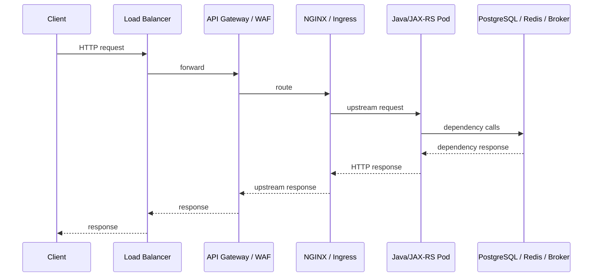

# Part 011 — HTTP Access Logging and Edge Logs

## 1. Core Idea

Application logs tell you what the service did after the request reached application code.
Edge logs tell you whether the request reached the platform boundary, how the proxy handled it, whether the upstream responded, and whether the client disappeared before the service completed.

In production incidents, this distinction matters.

A Java/JAX-RS service may log nothing for a failed request because the failure happened before the request entered the JVM.
A customer may see timeout while the application completed successfully because the connection was terminated at an edge layer.
An API may appear slow from the client side while the application latency looks normal because the delay happened in gateway routing, TLS, network, proxy buffering, or upstream queueing.

HTTP access logs and edge logs are therefore part of the evidence chain.
They are not just web server noise.

For enterprise Java/JAX-RS systems, edge/access logs should help answer:

- Did the request reach the load balancer, gateway, ingress, NGINX, or application container?
- Which layer returned the status code?
- Did the upstream application respond or did the proxy synthesize the error?
- Was latency spent at the edge, upstream, or client connection?
- Was the client IP trustworthy?
- Were request ID, correlation ID, and trace context forwarded?
- Did a proxy timeout, upstream reset, TLS/network issue, or deployment routing problem occur?
- Can the edge event be linked to Java/JAX-RS logs, metrics, traces, and audit events?

---

## 2. Access Logs vs Application Logs

Access logs are usually emitted by infrastructure or runtime boundary components:

- load balancer
- API gateway
- WAF
- NGINX
- Kubernetes ingress controller
- service mesh proxy
- servlet container
- embedded server
- application-level request completion logger

Application logs are emitted by application code:

- JAX-RS filters
- resource methods
- service layer
- repository layer
- Kafka/RabbitMQ consumers
- background jobs
- ExceptionMapper
- audit logging module

The boundary is important because each layer sees different truth.

| Layer | What it can prove | What it cannot prove |
|---|---|---|
| Load balancer | Client reached public/private entrypoint, TLS/listener behavior, target status | Internal application logic |
| API gateway | Route policy, auth/gateway rejection, quota, request transformation | Deep service execution |
| NGINX/Ingress | Upstream routing, upstream status, proxy timeout, 499/502/503/504 | Business outcome |
| Servlet/JAX-RS access log | Request reached JVM/container | External proxy delay before JVM |
| Application log | Business/action/dependency execution | Client disconnect before proxy |

A complete investigation often needs several layers, not one.

---

## 3. Typical Request Path



Each hop can produce a different log event.

Good observability preserves enough identity across these hops:

- request ID
- correlation ID
- trace ID
- upstream address
- route/service name
- status code
- duration
- error category
- client metadata
- deployment version if available

Without shared identity, production debugging becomes timestamp guessing.

---

## 4. Why Edge Logs Matter

Edge logs help detect failures that application logs may miss:

- requests rejected before reaching service
- gateway authentication failure
- WAF blocking
- ingress route mismatch
- DNS or upstream target failure
- pod not ready
- upstream connection refused
- upstream read timeout
- upstream reset
- client disconnect
- large request rejected by proxy
- payload buffering issue
- TLS handshake or protocol issue
- wrong virtual host or path rewrite
- sticky session or routing imbalance
- canary routing issue

If you only inspect Java logs, these failures look like silence.
That silence is evidence too: the request likely failed before application code.

---

## 5. Canonical Access Log Fields

A production-grade access log should generally include:

| Field | Purpose |
|---|---|
| `timestamp` | Event time |
| `request_id` | Unique request identity at edge/application boundary |
| `correlation_id` | Cross-request/business transaction identity |
| `trace_id` | Distributed tracing identity |
| `client_ip` | Caller network source after trust policy |
| `xff` | Original `X-Forwarded-For` chain if allowed |
| `method` | HTTP method |
| `path` | Raw path, carefully controlled |
| `route` or `path_template` | Aggregation-safe route identity |
| `query_present` | Whether query string existed without logging sensitive values |
| `status` | Response status sent to caller |
| `upstream_status` | Status returned by upstream app, if any |
| `request_time_ms` | Total edge request duration |
| `upstream_time_ms` | Time waiting on upstream app |
| `bytes_in` | Request size |
| `bytes_out` | Response size |
| `user_agent` | Client library/browser hint |
| `host` | Virtual host / authority |
| `upstream_addr` | Target upstream/pod/service |
| `protocol` | HTTP version / scheme |
| `tls` | TLS/protocol details where relevant |
| `service` | Target service name |
| `environment` | env/region/cluster |

Not every platform supports every field.
The goal is not maximal logging.
The goal is enough evidence to reconstruct what happened.

---

## 6. Latency Semantics

Latency fields are often misunderstood.

Common edge timing fields:

- total request time
- upstream connect time
- upstream header time
- upstream response time
- gateway processing time
- application duration
- client round-trip time

These are not always equivalent.

Example interpretation:

| Observation | Likely meaning |
|---|---|
| High edge request time, normal upstream time | client slow read, proxy buffering, gateway overhead, network issue |
| High upstream time, high app duration | application or dependency latency |
| High upstream connect time | pod/service/network/connection issue |
| No upstream time, 4xx at gateway | gateway rejected request before application |
| No application log, edge 502/503 | route/upstream availability issue |
| Application completed, edge 499 | client disconnected before response completed |

For Java/JAX-RS debugging, compare:

- edge `request_time`
- edge `upstream_response_time`
- application request completion duration
- server span duration
- downstream dependency spans
- request latency metric histogram

If these disagree, the disagreement is diagnostic.

---

## 7. Status Code Ownership

A status code has an owner.
Do not assume every HTTP status came from application code.

| Status family | Possible owner |
|---|---|
| 2xx | application, gateway synthetic success, health endpoint |
| 3xx | gateway, app redirect, auth redirect |
| 4xx | client, gateway policy, auth layer, validation, rate limiting, WAF |
| 5xx | app failure, upstream unavailable, proxy timeout, gateway error, dependency cascade |

Important production question:

> Did the application produce this status, or did an intermediate layer produce it?

If edge status is `502` and application has no matching request log, application code may not have executed.
If edge status is `504` and application later logs success, proxy timeout may be shorter than service processing time.
If application logs `200` but client reports failure, the client or edge connection may have terminated after the app responded.

---

## 8. Interpreting 499, 502, 503, and 504

### 499 — Client Closed Request

Common with NGINX-style logs.
It usually means the client closed the connection before the server responded.

Possible causes:

- client timeout shorter than server processing time
- user cancelled request
- mobile/network interruption
- gateway/proxy closed downstream connection
- frontend timeout
- long-running endpoint
- slow downstream dependency

Debugging questions:

- Did the application continue processing after the client disconnected?
- Was any mutation committed despite client seeing failure?
- Is there an idempotency key?
- Did the client retry?
- Did duplicate business action occur?

For CPQ/order flows, this is dangerous when the endpoint mutates state.
A client timeout does not guarantee the backend operation failed.

### 502 — Bad Gateway

Usually means the proxy could not get a valid response from upstream.

Possible causes:

- upstream connection refused
- pod crashed/restarted
- invalid upstream response
- TLS/protocol mismatch
- upstream reset connection
- service route mismatch
- deployment not ready

Debugging questions:

- Was the pod ready?
- Did container restart around the same timestamp?
- Is there a matching application log?
- Did upstream accept connection?
- Did ingress route to the correct service/port?

### 503 — Service Unavailable

Usually means no healthy upstream or service temporarily unavailable.

Possible causes:

- no ready pods
- readiness probe failing
- load balancer target unhealthy
- maintenance mode
- capacity protection
- circuit breaker open at gateway
- HPA lag during traffic spike

Debugging questions:

- How many ready pods existed?
- Did deployment rollout reduce availability?
- Did readiness fail because dependency was slow?
- Is 503 generated by gateway, ingress, or app?

### 504 — Gateway Timeout

Usually means proxy/gateway waited too long for upstream response.

Possible causes:

- application slow
- dependency slow
- DB lock/slow query
- queue/blocking/thread starvation
- timeout mismatch
- large response generation
- downstream service timeout

Debugging questions:

- Did the app finish after proxy timeout?
- Is application timeout longer than proxy timeout?
- Which dependency span dominated latency?
- Is there a transaction still running after client failure?

---

## 9. Client IP and Forwarded Headers

Client IP is security-sensitive and often misinterpreted.

Common headers:

- `X-Forwarded-For`
- `X-Forwarded-Proto`
- `X-Forwarded-Host`
- `Forwarded`
- `X-Real-IP`

Key rule:

> Treat forwarded headers as untrusted unless they are set or sanitized by a trusted proxy boundary.

A malicious external client can send fake `X-Forwarded-For` unless the edge overwrites or validates it.

Internal verification should answer:

- Which component is the trust boundary?
- Does the edge overwrite or append forwarded headers?
- Does the application trust forwarded headers directly?
- Are client IP fields used for audit/security decisions?
- Are private/internal IPs expected in logs?

For observability, client IP is useful.
For authorization or fraud/security controls, it must be governed carefully.

---

## 10. Raw Path vs Route Template

Raw paths can create observability problems.

Example raw paths:

```text
/api/quotes/Q-1000001/items
/api/quotes/Q-1000002/items
/api/quotes/Q-1000003/items
```

If used as a metric label, this causes cardinality explosion.
If logged without review, it may leak business identifiers.

Route template is safer for aggregation:

```text
/api/quotes/{quoteId}/items
```

Recommended pattern:

- Use route template for metrics and dashboards.
- Use raw path only in logs if approved and masked where needed.
- Avoid raw path as metric label.
- Avoid query string in logs unless explicitly allowlisted/masked.
- Keep quote/order IDs as structured business keys only when policy allows it.

---

## 11. Edge Log Correlation

Access logs should be linkable to application logs and traces.

Minimum correlation fields:

```json
{
  "request_id": "req-...",
  "correlation_id": "corr-...",
  "trace_id": "4bf92f3577b34da6a3ce929d0e0e4736",
  "method": "POST",
  "route": "/api/quotes/{quoteId}/submit",
  "status": 504,
  "upstream_status": 200,
  "request_time_ms": 30000,
  "upstream_time_ms": 30000,
  "service": "quote-order-service"
}
```

Interpretation:

- Edge returned 504 to client.
- Upstream may have eventually returned 200 or connection completed too late depending on platform semantics.
- Application logs/traces must be checked for actual business result.
- Client may retry.
- Idempotency and audit become important.

Do not assume HTTP client outcome equals business transaction outcome.

---

## 12. Edge Logs and OpenTelemetry

Edge infrastructure may or may not participate in distributed tracing.

Possible setups:

- gateway generates trace context
- gateway forwards incoming trace context
- application generates trace context
- ingress logs trace ID but does not create spans
- service mesh creates proxy spans
- collector enriches telemetry with resource attributes

Important consistency checks:

- Does `traceparent` reach the Java/JAX-RS service?
- Do edge logs include trace ID?
- Do application logs include the same trace ID?
- Are gateway-generated IDs compatible with application tracing?
- Are external trace IDs trusted or regenerated at boundary?
- Are sampling decisions hiding important edge/app correlation?

Trace continuity matters most during cross-service and timeout incidents.

---

## 13. Privacy and Security Concerns

Access logs frequently contain risky data:

- raw path with customer/order identifiers
- query string with search terms or tokens
- authorization header
- cookie
- session ID
- API key
- client IP
- user agent fingerprinting data
- request body if enabled
- upstream URL containing credentials

Baseline rules:

1. Do not log `Authorization`.
2. Do not log `Cookie`.
3. Do not log API keys.
4. Avoid logging query strings by default.
5. Avoid request/response body logging at edge.
6. Treat client IP as personal/security data depending on policy.
7. Mask business identifiers if required.
8. Restrict access to edge logs.
9. Align retention with privacy/compliance policy.

Security review is not optional for access log design.

---

## 14. Failure Mode: Request Missing from Application Logs

Symptoms:

- client reports error
- edge log exists
- Java/JAX-RS request log missing
- no trace in application

Likely causes:

- rejected by gateway/WAF
- invalid route
- no healthy upstream
- connection refused
- ingress misconfiguration
- request too large
- TLS/protocol mismatch
- proxy timeout before upstream connection
- app log sampling or logging failure

Debugging steps:

1. Search by request ID/correlation ID at edge.
2. Inspect status and upstream status.
3. Check route/service/upstream address.
4. Check Kubernetes pod readiness and restarts.
5. Check gateway/WAF policy logs.
6. Check whether app received any trace/span/log.
7. Verify log ingestion delay or drop.

---

## 15. Failure Mode: Edge Latency Higher than Application Latency

Symptoms:

- edge `request_time_ms` high
- application duration normal
- client reports slow response

Likely causes:

- client slow read
- response buffering
- large payload
- gateway processing overhead
- TLS/network issue
- queueing at proxy
- connection reuse issue
- rate limiting or policy evaluation

Debugging steps:

1. Compare edge total time vs upstream time.
2. Compare app completion log duration.
3. Check bytes out and response size.
4. Check gateway/ingress saturation.
5. Check network errors/retransmits if available.
6. Check whether only specific clients/regions are affected.

---

## 16. Failure Mode: Application Latency Higher than Edge Timeout

Symptoms:

- edge 504
- application later logs completion
- business mutation may have succeeded

Likely causes:

- proxy timeout shorter than app timeout
- long DB transaction
- slow downstream dependency
- blocking thread pool
- lock contention
- retry storm
- endpoint performing synchronous long-running work

Debugging steps:

1. Find application log by request/correlation ID.
2. Inspect trace waterfall.
3. Check DB/Redis/Kafka/RabbitMQ spans and metrics.
4. Check whether transaction committed.
5. Check audit/business event outcome.
6. Check idempotency key and client retry behavior.
7. Align timeout budgets across client, gateway, app, and dependencies.

---

## 17. Dashboard Implications

A useful edge/service dashboard should show:

- request rate by route/status
- 4xx/5xx split by owner if possible
- 499/502/503/504 counts
- edge latency vs upstream latency
- app latency vs edge latency
- upstream connection errors
- target/pod health
- route-specific error rate
- gateway rejection rate
- WAF block rate if relevant
- recent deployment markers
- request volume by client/app if approved

Avoid dashboards that only show application metrics.
They miss pre-application failures.

---

## 18. Alerting Implications

Edge alerts should be symptom-based and actionable.

Good examples:

- elevated 5xx at edge for customer-facing route
- 504 burn rate for critical API
- no healthy upstream for service
- sudden 499 spike on mutation endpoint
- 502 spike after deployment
- gateway rejection spike after auth/policy change
- upstream latency exceeding SLO window

Weak examples:

- alert on every isolated 404
- page on all 499 without route/action context
- alert on raw total request count without SLO/customer impact
- duplicate alerts from gateway, ingress, and application for the same symptom

Alert ownership must be clear:

- app team
- platform team
- network team
- security/gateway team
- SRE/on-call

---

## 19. Java/JAX-RS Integration Pattern

Application-level request logs should complement edge logs.

Example application completion log:

```json
{
  "event": "http_request_completed",
  "service": "quote-order-service",
  "method": "POST",
  "route": "/api/quotes/{quoteId}/submit",
  "status": 200,
  "duration_ms": 1240,
  "request_id": "req-123",
  "correlation_id": "corr-456",
  "trace_id": "4bf92f3577b34da6a3ce929d0e0e4736",
  "actor_type": "user",
  "tenant_id": "tenant-a",
  "business_key_type": "quote_id"
}
```

This should align with edge log fields:

- same request ID
- same correlation ID
- same trace ID
- same route template if possible
- comparable duration fields
- consistent status classification

If the edge route and application route disagree, that may reveal rewrite, gateway mapping, or endpoint template problems.

---

## 20. CPQ/Order Management Specific Concerns

For quote/order systems, edge failures can have business consequences.

High-risk cases:

- submit quote returns timeout but quote was submitted
- approve order returns 499 but approval was committed
- price calculation times out and client retries
- cancellation request gets 504 but workflow starts
- amendment endpoint is slow and duplicate request occurs
- order creation returns 502 during deployment but downstream event was published

Production debugging must separate:

- client-observed HTTP outcome
- application execution outcome
- database transaction outcome
- event publication outcome
- workflow/audit outcome
- user-visible business state

Access logs alone cannot prove business state.
They tell you what happened at the HTTP boundary.

---

## 21. PR Review Checklist

When reviewing changes that affect access logs or edge behavior, ask:

- Are request/correlation/trace IDs propagated?
- Is route template available and stable?
- Are raw path and query string handled safely?
- Are sensitive headers excluded?
- Are edge status and upstream status distinguishable?
- Are latency fields documented?
- Are 499/502/503/504 cases understood?
- Are timeout budgets aligned?
- Are gateway/ingress changes visible in dashboards?
- Are alerts deduplicated with application alerts?
- Are logs accessible to the right responders?
- Is retention appropriate?
- Is client IP handling governed by trust boundary policy?

---

## 22. Internal Verification Checklist

Verify internally before relying on access logs for incident debugging.

### Edge and Routing Stack

- Which components sit before Java/JAX-RS services?
- Is traffic routed through load balancer, API gateway, WAF, NGINX, ingress, service mesh, or multiple layers?
- Which layer produces canonical access logs?
- Are logs centralized?
- Are logs delayed, sampled, or filtered?

### Log Format

- Is the access log structured JSON or text?
- Which fields are guaranteed?
- Are request ID, correlation ID, and trace ID included?
- Are status and upstream status both available?
- Are request time and upstream response time both available?
- Is upstream address or service name available?

### Header and Identity

- Which header carries request ID?
- Which header carries correlation ID?
- Is W3C `traceparent` forwarded?
- Are external IDs trusted or regenerated?
- Are forwarded headers sanitized at the trust boundary?
- Is client IP reliable?

### Route and Path

- Are route templates available at edge?
- Are raw paths logged?
- Are query strings logged?
- Are quote/order/customer identifiers present in URLs?
- Is masking/redaction applied?

### Status and Timeout Semantics

- What does 499 mean in the platform?
- What does 502 mean in the platform?
- What does 503 mean in the platform?
- What does 504 mean in the platform?
- What are gateway, ingress, app, DB, and downstream timeout values?
- Are timeout values documented?

### Dashboards and Alerts

- Is there an edge traffic dashboard?
- Is there per-route 5xx/4xx visibility?
- Are 499/502/503/504 charted separately?
- Are gateway errors correlated with deployment markers?
- Are edge alerts deduplicated with app alerts?
- Are runbooks linked?

### Security and Privacy

- Are sensitive headers excluded?
- Are query params masked?
- Is body logging disabled?
- Is client IP considered sensitive under policy?
- Who can access access logs?
- What is the retention policy?

---

## 23. Summary

HTTP access logs and edge logs are the evidence layer outside the Java/JAX-RS application.
They explain failures that application logs cannot see: gateway rejection, ingress routing issue, upstream timeout, client disconnect, unavailable pod, proxy error, and timeout mismatch.

You should now be able to:

- distinguish edge logs from application logs
- interpret key access log fields
- compare edge latency, upstream latency, and application latency
- analyze 499, 502, 503, and 504 failures
- reason about client IP and forwarded header trust boundaries
- avoid raw path/query/header privacy leaks
- correlate edge logs with Java/JAX-RS logs, metrics, and traces
- review access logging changes for production-debugging readiness

The next part moves back into application code and focuses on error logging and exception observability.
