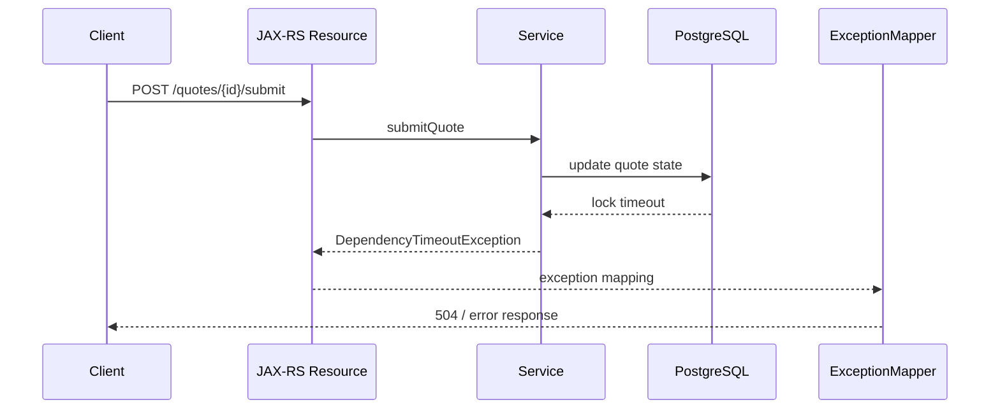

# Part 012 — Error Logging and Exception Observability

## 1. Core Idea

An error log is not a place to dump panic.
It is production evidence.

Good error logging helps answer:

- What failed?
- Where did it fail?
- Was the failure expected or unexpected?
- Was it caused by user input, authorization, business rule, dependency failure, timeout, data inconsistency, infrastructure, or bug?
- Is it retryable?
- Did it affect a business entity?
- Was state mutated before the error?
- What response did the client receive?
- Which trace/span shows the failure path?
- Which logs/events/audit records should be inspected next?

Poor error logging creates noise, false alerts, duplicated stack traces, missing root cause, hidden business impact, or privacy leaks.

For Java/JAX-RS enterprise systems, exception observability is the discipline of converting runtime failures into structured, classified, correlated, and safe evidence.

---

## 2. Error Logging Is Not the Same as Exception Handling

Exception handling decides what the application does after failure.
Error logging records evidence for humans and machines.

These are related but separate concerns.

| Concern | Primary question |
|---|---|
| Exception handling | How should the application recover or respond? |
| Error mapping | What HTTP/status/error code should the caller receive? |
| Error logging | What evidence should operators and engineers see? |
| Metrics | How often and how severely is this happening? |
| Tracing | Where in the execution path did it happen? |
| Audit | Did a business/security-significant action occur or fail? |
| Alerting | Does this require action now? |

A service can handle an exception correctly but log it badly.
It can also log a scary stack trace for a perfectly expected validation failure.
Both are operational defects.

---

## 3. Exception Taxonomy

A useful taxonomy is the foundation of good error logging.

Common categories:

- validation error
- domain/business rule error
- authentication error
- authorization error
- not found error
- conflict/concurrency error
- idempotency error
- dependency error
- timeout error
- rate limit/capacity error
- data integrity error
- serialization/deserialization error
- configuration error
- infrastructure/platform error
- programming bug
- unknown/unclassified error

Classification should be stable enough to drive:

- log level
- error code
- HTTP status
- metric label
- span status
- alert policy
- runbook route
- customer/support explanation

Do not use raw exception class names as the only classification.
They are often too implementation-specific.

---

## 4. Expected vs Unexpected Errors

Expected errors are part of normal system behavior.
Unexpected errors indicate a defect, dependency failure, or abnormal condition.

Examples of expected errors:

- invalid request payload
- missing required field
- unauthorized request
- forbidden operation
- quote not found
- invalid state transition rejected
- duplicate idempotency key handled safely
- optimistic lock conflict returned to caller

Examples of unexpected errors:

- null pointer exception
- SQL connection pool exhaustion
- deadlock not handled by retry policy
- Redis timeout affecting critical path
- Kafka publish failure after DB commit
- malformed internal state
- missing required configuration
- serialization failure for valid domain object

Expected errors should usually not be logged as noisy `ERROR` events.
Unexpected errors usually deserve `ERROR`, structured context, stack trace, trace correlation, and possibly alerting depending on rate/impact.

---

## 5. Log Level by Error Category

Suggested baseline:

| Error category | Typical HTTP | Typical log level | Notes |
|---|---:|---|---|
| Validation error | 400 | DEBUG/INFO | Avoid noisy ERROR for bad input |
| Authentication failure | 401 | INFO/WARN | Security policy dependent |
| Authorization failure | 403 | WARN | Include safe actor/action context |
| Not found | 404 | DEBUG/INFO | Usually not ERROR |
| Business rule rejection | 409/422 | INFO | Useful as business event if significant |
| Optimistic lock conflict | 409 | INFO/WARN | WARN if high rate or unexpected contention |
| Dependency timeout | 502/503/504 | WARN/ERROR | Depends on fallback and impact |
| Dependency unavailable | 503 | ERROR | Often actionable if affecting SLO |
| Data corruption/invariant breach | 500 | ERROR | High severity |
| Programming bug | 500 | ERROR | Stack trace needed |
| Unknown exception | 500 | ERROR | Must classify later |

This table is a starting point.
Internal policy may differ.
Verify with team standards.

---

## 6. Error Code Strategy

Error codes make failures stable and searchable.

A useful error code should be:

- stable across releases
- documented
- safe to expose when appropriate
- mapped to category
- mapped to HTTP status
- included in logs
- included in metrics as a bounded label if cardinality is controlled
- included in support/customer-facing response when approved

Example error response:

```json
{
  "errorCode": "QUOTE_INVALID_STATE_TRANSITION",
  "message": "Quote cannot be submitted from the current state.",
  "requestId": "req-123",
  "correlationId": "corr-456"
}
```

Example corresponding log:

```json
{
  "event": "request_failed",
  "error_code": "QUOTE_INVALID_STATE_TRANSITION",
  "error_category": "domain_rule",
  "http_status": 409,
  "request_id": "req-123",
  "correlation_id": "corr-456",
  "trace_id": "4bf92f3577b34da6a3ce929d0e0e4736",
  "business_key_type": "quote_id",
  "operation": "submit_quote",
  "outcome": "rejected"
}
```

Avoid using raw exception messages as error codes.

---

## 7. Stack Trace Discipline

Stack traces are useful but expensive and noisy.

Use stack traces when:

- exception is unexpected
- root cause is not otherwise visible
- stack location matters
- failure is rare or severe
- incident debugging needs call path
- bug triage needs source location

Avoid stack traces when:

- validation error is expected
- auth failure is routine
- business rule rejection is normal
- same exception is repeatedly logged at multiple layers
- exception contains sensitive data
- high-volume failure would flood logs

Key rule:

> Log the stack trace once at the boundary where the exception is classified and response/outcome is known.

In JAX-RS systems, this often means a global `ExceptionMapper` or equivalent boundary handler.

---

## 8. ExceptionMapper as Observability Boundary

In JAX-RS/Jakarta REST, `ExceptionMapper` is a natural place to standardize:

- error classification
- HTTP status mapping
- error code mapping
- response body shape
- log level
- stack trace policy
- metric increment
- trace/span status
- request ID in response

Simplified pattern:

```java
@Provider
public final class GlobalExceptionMapper implements ExceptionMapper<Throwable> {
    @Override
    public Response toResponse(Throwable error) {
        ErrorDescriptor descriptor = ErrorClassifier.classify(error);

        ErrorLogEvent event = ErrorLogEvent.from(descriptor)
            .withRequestContext(RequestContext.current())
            .withTraceContext(TraceContext.current())
            .withSafeBusinessContext(BusinessContext.current());

        ErrorLogger.log(event, error);

        return Response.status(descriptor.httpStatus())
            .entity(ErrorResponse.from(descriptor, RequestContext.current()))
            .build();
    }
}
```

This code is conceptual, not a required implementation.
The point is that classification should happen before logging.

---

## 9. Do Not Log the Same Exception Everywhere

A common anti-pattern:

```java
try {
    service.submitQuote(command);
} catch (Exception e) {
    log.error("Failed in resource", e);
    throw e;
}
```

Then service layer logs it again.
Repository logs it again.
ExceptionMapper logs it again.
The result is four stack traces for one failure.

Better approach:

- lower layers add context or wrap with typed exception when useful
- boundary layer logs the classified failure once
- metrics count the failure once
- trace marks the failing span
- audit records business-significant failure separately if required

Use wrapping carefully.
Do not destroy the root cause.

---

## 10. Root Cause Preservation

Bad wrapping:

```java
throw new RuntimeException("Failed to submit quote");
```

This loses original cause.

Better:

```java
throw new QuoteSubmissionException("Failed to submit quote", cause);
```

But do not expose sensitive cause messages to clients.

Root cause should be preserved for logs/traces, while external responses remain safe and stable.

---

## 11. Dependency Error Observability

Dependency errors need context beyond the exception class.

For PostgreSQL/JDBC/MyBatis/JPA:

- query operation name, not raw unsafe SQL parameters
- connection pool wait time
- transaction context
- lock/deadlock classification
- timeout vs constraint violation
- affected table/entity if safe

For Redis:

- command type
- cache/lock/idempotency use case
- timeout vs connection failure
- key pattern, not full key if sensitive

For Kafka/RabbitMQ:

- topic/exchange/queue
- publish vs consume
- offset/delivery tag if safe
- retry count
- DLQ result
- message age

For downstream HTTP:

- target service
- route/template
- status code
- timeout/retry count
- circuit breaker state

A dependency error without dependency identity is hard to debug.

---

## 12. Timeout Errors

Timeouts need special attention because they create ambiguity.

Questions to answer:

- Which timeout fired?
- Client timeout?
- Gateway timeout?
- Application timeout?
- DB query timeout?
- HTTP client timeout?
- Kafka/RabbitMQ publish timeout?
- Redis command timeout?
- Workflow worker timeout?

A timeout log should include:

- timeout type
- timeout value
- elapsed duration
- target dependency
- operation name
- retry attempt
- final outcome
- whether state may have changed
- request/correlation/trace IDs

Timeouts around mutation endpoints require idempotency and audit checks.

---

## 13. Retryable vs Non-Retryable Errors

Retryability should be explicit.

Retryable examples:

- transient network timeout
- temporary dependency unavailable
- optimistic lock conflict in controlled flow
- rate limit when caller has backoff
- deadlock if operation is safe to retry

Non-retryable examples:

- validation failure
- authorization failure
- invalid state transition
- missing required business data
- permanent not found
- duplicate command that already succeeded

Log fields should make retry behavior visible:

```json
{
  "event": "dependency_call_failed",
  "dependency": "pricing-service",
  "operation": "calculate_quote_price",
  "error_category": "timeout",
  "retryable": true,
  "attempt": 3,
  "max_attempts": 3,
  "final_attempt": true,
  "outcome": "failed"
}
```

Without attempt fields, retry storms are hard to detect.

---

## 14. Error Metrics

Logs explain individual failures.
Metrics explain scale.

Useful error metrics:

- request error count by route/status/error category
- dependency error count by dependency/operation/category
- timeout count by dependency/timeout type
- retry count by dependency/operation
- DLQ count by topic/queue/error category
- workflow incident count by process/error type
- validation rejection rate by route/error code if bounded
- invariant breach count

Metric label warning:

- Do not use raw exception message as label.
- Do not use request ID as label.
- Do not use order/quote ID as label.
- Use bounded error category/code.

---

## 15. Tracing Error Semantics

When an error occurs, traces should show:

- failing span
- span status
- exception event if safe
- dependency target
- status code
- retry attempts
- latency contribution
- parent operation
- business operation if approved

For a JAX-RS request:



Logs, metrics, and traces should agree on the category:

- `error_category=dependency_timeout`
- HTTP status `504` or internal mapping
- span status error
- dependency span shows timeout
- request log shows failed outcome

---

## 16. Audit vs Error Log

Some failures need audit records.
Many do not.

Audit-worthy cases may include:

- failed login/security action
- forbidden access attempt
- approval rejected
- quote submission rejected by business rule
- order cancellation requested but failed after partial processing
- administrative override failure
- impersonation/delegation action
- state transition attempted and denied

Error logs are operational evidence.
Audit logs are business/security/compliance evidence.
Do not assume one replaces the other.

---

## 17. Security and Privacy Risks

Exception messages can contain sensitive data.

Common leakage paths:

- SQL exception includes parameter values
- validation exception prints request body
- downstream error includes token/header
- URI includes query parameter secrets
- Redis key contains customer/order/user data
- message payload included in consumer exception
- stack trace exposes filesystem path or config values

Rules:

1. Never log credentials, tokens, cookies, or authorization headers.
2. Avoid raw request body in exception logs.
3. Sanitize SQL and message payloads.
4. Use safe error codes externally.
5. Restrict production log access.
6. Review exception message content from third-party libraries.
7. Treat stack traces as sensitive operational data.

---

## 18. Async and Messaging Error Logging

HTTP exception patterns do not fully apply to async consumers.

Kafka/RabbitMQ consumer failures should log:

- consumer name
- topic/queue
- partition/offset or delivery tag if safe
- message ID/event ID
- correlation ID/causation ID
- attempt/retry count
- error category
- retry decision
- DLQ decision
- processing duration
- message age
- idempotency outcome

Important distinction:

- consumer failed and will retry
- consumer failed and message sent to DLQ
- consumer failed but acked/skipped
- consumer failed after partial side effect
- consumer failed because duplicate was detected

Each has different operational meaning.

---

## 19. Background Job Error Logging

Background jobs should log failure with:

- job name
- job instance ID
- schedule time
- actual start time
- duration
- lock owner
- batch size
- processed count
- failed count
- retry attempt
- checkpoint
- reconciliation result
- final status

A job failure log without checkpoint or processed count is weak evidence.
For reconciliation jobs, include mismatched counts and safe aggregate identifiers.

---

## 20. Deduplication and Noise Control

High-volume errors can destroy log usability and cost control.

Noise sources:

- repeated stack trace per retry attempt
- same validation error logged at ERROR
- retry loop logs every attempt with full stack trace
- consumer poison message logged forever
- dependency outage causes every request to emit huge stack trace
- alerting based on raw error log count

Controls:

- log full stack trace on final attempt or sampled attempts
- log compact WARN for intermediate retries
- aggregate repeated errors with metrics
- use bounded error categories
- use DLQ for poison messages
- rate-limit noisy loggers if platform supports it
- alert on symptom/SLO, not raw exception volume alone

Do not suppress errors so aggressively that incident evidence disappears.

---

## 21. Example Error Log Event

```json
{
  "timestamp": "2026-07-11T13:10:00.123Z",
  "level": "ERROR",
  "event": "request_failed",
  "service": "quote-order-service",
  "environment": "prod",
  "version": "2026.07.11-abc123",
  "operation": "submit_quote",
  "method": "POST",
  "route": "/api/quotes/{quoteId}/submit",
  "http_status": 504,
  "error_code": "PRICING_SERVICE_TIMEOUT",
  "error_category": "dependency_timeout",
  "retryable": true,
  "request_id": "req-123",
  "correlation_id": "corr-456",
  "trace_id": "4bf92f3577b34da6a3ce929d0e0e4736",
  "span_id": "00f067aa0ba902b7",
  "tenant_id": "tenant-a",
  "actor_type": "user",
  "business_key_type": "quote_id",
  "dependency": "pricing-service",
  "dependency_operation": "calculate_quote_price",
  "duration_ms": 30000,
  "timeout_ms": 30000,
  "attempt": 3,
  "max_attempts": 3,
  "final_attempt": true,
  "outcome": "failed"
}
```

The actual stack trace may be attached as structured exception fields depending on logging backend.
The point is that the event is queryable before reading the stack trace.

---

## 22. Dashboard and Alerting Implications

Dashboards should show errors by:

- route
- service
- dependency
- error category
- error code
- status code
- deployment version
- tenant segment if approved
- retry outcome
- DLQ outcome
- workflow/process type

Alerts should avoid paging on every exception.
Prefer:

- SLO burn rate
- elevated 5xx on critical route
- dependency timeout spike
- DLQ spike
- workflow incident spike
- invariant breach occurrence
- auth/security anomaly rate
- error after deployment marker

An error log is evidence.
An alert is a call to action.
Do not confuse them.

---

## 23. PR Review Checklist

When reviewing error logging and exception handling, ask:

- Is the exception classified?
- Is the error expected or unexpected?
- Is the log level correct?
- Is stack trace logged only where useful?
- Is the root cause preserved?
- Is there a stable error code?
- Is HTTP status mapping correct?
- Is request/correlation/trace context included?
- Is business context included safely?
- Are sensitive fields excluded?
- Are dependency errors identified by dependency/operation?
- Is retryability explicit?
- Are retry attempts observable?
- Are metrics emitted with bounded labels?
- Is span status set correctly?
- Is audit logging separate where required?
- Are alerts based on actionable symptoms?

---

## 24. Internal Verification Checklist

Verify internally before standardizing error logging.

### Exception Model

- Is there a shared exception taxonomy?
- Are domain exceptions distinct from infrastructure exceptions?
- Are validation/auth/authz errors classified consistently?
- Are dependency timeout/unavailable errors represented clearly?
- Is retryability encoded or inferred?

### Error Mapping

- Is there a global JAX-RS `ExceptionMapper` or equivalent?
- Are error codes stable and documented?
- Are HTTP statuses mapped consistently?
- Are client-facing messages safe?
- Is request ID returned in error responses?

### Logging Behavior

- Where are exceptions logged?
- Are stack traces duplicated across layers?
- Are expected 4xx errors logged as ERROR?
- Are retry attempts logged appropriately?
- Are final failures distinguishable from intermediate failures?
- Are async consumer failures logged with message context?

### Context and Correlation

- Are request ID, correlation ID, trace ID, and span ID included?
- Are tenant, actor, and business key fields included safely?
- Are quote/order identifiers allowed in logs?
- Are dependency names and operations captured?

### Metrics and Tracing

- Are error metrics emitted?
- Are labels bounded?
- Are raw exception messages avoided as labels?
- Is span status set on failure?
- Are exception events attached to spans safely?
- Are dependency spans correlated with error logs?

### Security and Privacy

- Are request bodies excluded from error logs?
- Are sensitive headers excluded?
- Are SQL parameters sanitized?
- Are message payloads sanitized?
- Are third-party exception messages reviewed?
- Who can access production error logs?

### Operations

- Are error dashboards useful?
- Are alerts tied to SLO/customer impact?
- Are runbooks linked from alerts?
- Are common error codes documented for support?
- Are incident notes mapped back to missing error telemetry?

---

## 25. Practical Design Rules

Use these rules as baseline:

1. Classify before logging.
2. Log expected errors differently from unexpected errors.
3. Do not log all 4xx as ERROR.
4. Preserve root cause.
5. Log stack trace once at the right boundary.
6. Use stable error codes.
7. Include request/correlation/trace context.
8. Include safe business context for domain operations.
9. Identify dependency and operation for dependency errors.
10. Make retryability and attempt count visible.
11. Keep metric labels bounded.
12. Do not leak PII, tokens, headers, SQL parameters, or payloads.
13. Separate operational error logs from audit logs.
14. Align logs, metrics, traces, dashboards, alerts, and runbooks.

---

## 26. Summary

Error logging is production evidence design.
The goal is not to print every exception.
The goal is to create safe, structured, classified, correlated, and actionable failure evidence.

You should now be able to:

- distinguish exception handling from error logging
- classify validation, domain, auth, dependency, timeout, data, and bug errors
- choose correct log levels for expected and unexpected failures
- design stable error codes and safe error responses
- avoid duplicate stack traces
- preserve root cause
- expose retryability and attempt count
- connect error logs with metrics and traces
- handle async consumer and background job errors
- review error logging for privacy, cost, and operational readiness

The next part focuses on audit logging: business, security, and compliance evidence beyond normal application logs.
