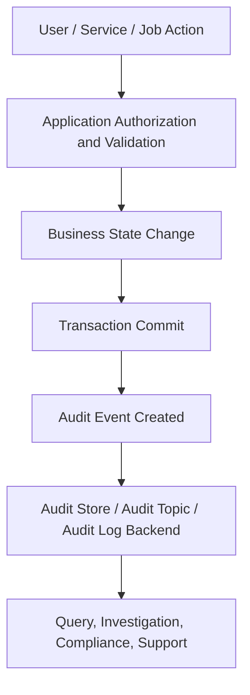
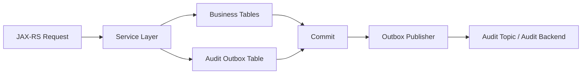

# Part 013 — Audit Logging

## 1. Core Idea

Audit logging is evidence logging.

Normal application logs answer operational questions:

- why did this request fail?
- which dependency was slow?
- which exception happened?
- which pod processed this request?
- which trace contains the failure path?

Audit logs answer accountability questions:

- who did what?
- to which business object?
- when did it happen?
- from where did it happen?
- why was it allowed?
- what changed?
- what was the previous value?
- what was the new value?
- was the action successful or rejected?
- was the action performed directly, by delegation, by impersonation, by a system actor, or by a background job?

For CPQ and order-management systems, audit logging is not decoration.
It is part of production defensibility.

When a quote price changes, an approval is overridden, an order is cancelled, or a fulfillment fallout is manually resolved, the system must preserve a durable explanation of the action.

The rule is simple:

> Operational logs explain runtime behavior. Audit logs preserve accountable business and security facts.

---

## 2. Audit Log vs Application Log

Audit logs and application logs may share fields such as timestamp, request ID, trace ID, tenant, actor, and service name.
But they are not the same signal.

| Dimension | Application log | Audit log |
|---|---|---|
| Main purpose | Debugging and operations | Accountability and evidence |
| Audience | Engineers, SRE, support | Engineering, support, security, compliance, business operations |
| Typical retention | Shorter, cost-sensitive | Longer, policy-driven |
| Mutability | Often append-only in log backend, but not always controlled as evidence | Should be append-only, access-controlled, and tamper-resistant |
| Content | Runtime event, error, state, dependency, latency | Actor, action, target, before/after, reason, outcome |
| Failure question | Why did the system fail? | Who changed what and under what authority? |
| Query pattern | Correlation ID, trace ID, error code, service, pod | Actor, target entity, business key, action, timestamp, tenant |
| Privacy risk | High | Very high because audit often references business actions and actors |
| Alerting use | Operational alerting | Security/compliance anomaly detection, sometimes operational escalation |

A common mistake is treating audit as `logger.info("user updated quote")`.
That is not sufficient.

An audit event must be structured, durable, queryable, and semantically stable.

---

## 3. What Makes an Event Auditable

A useful audit event needs enough information to reconstruct accountability.

The minimum model is:

```text
actor + action + target + outcome + time + context
```

A stronger model is:

```text
who + did what + to what + when + where + why + before + after + outcome + correlation
```

Audit events should usually include:

| Field | Purpose |
|---|---|
| `audit_event_id` | Unique ID of the audit event |
| `timestamp` | When the event was recorded |
| `occurred_at` | When the business action occurred, if different |
| `service.name` | Service producing the audit event |
| `environment` | dev/test/stage/prod |
| `tenant.id` | Tenant/account boundary, if applicable |
| `actor.type` | user, service, system, batch, support, delegated user |
| `actor.id` | Stable actor identifier |
| `actor.display_name` | Optional, if allowed by policy |
| `actor.roles` | Optional; can be sensitive and high-volume |
| `action` | Stable action name |
| `target.type` | quote, order, approval, user, entitlement, config |
| `target.id` | Stable target identifier |
| `business_key` | quote ID, order ID, external order reference, process ID |
| `outcome` | success, failure, rejected, no-op, partial |
| `reason_code` | Why action was allowed/rejected, when applicable |
| `before` | Previous value or safe diff |
| `after` | New value or safe diff |
| `source.ip` | Client IP, if allowed and normalized |
| `user_agent` | Optional; may be noisy but useful for security audit |
| `request.id` | Request ID |
| `correlation.id` | End-to-end correlation |
| `trace.id` | Distributed trace ID |
| `span.id` | Span ID, if available |
| `process_instance_id` | Workflow/process context |
| `message.id` | Async message context |
| `integrity_hash` | Optional tamper-evidence field |

Do not blindly include all fields.
Audit design must respect privacy, policy, retention, cost, and query needs.

---

## 4. Business Audit, Security Audit, and Compliance Audit

Audit logging has different purposes.
Do not mix them into one vague event type.

### Business Audit

Business audit captures accountable business actions.

Examples:

- quote created
- quote priced
- discount overridden
- approval requested
- approval approved
- approval rejected
- order submitted
- order decomposed
- fulfillment fallout assigned
- cancellation requested
- amendment accepted
- order manually corrected
- reconciliation mismatch resolved

Business audit explains lifecycle decisions.

### Security Audit

Security audit captures security-sensitive actions.

Examples:

- login success/failure
- token refresh
- password reset
- permission changed
- role assigned
- access denied
- privileged action attempted
- support impersonation started
- support impersonation ended
- API key created
- secret accessed
- sensitive export downloaded

Security audit explains access and authority.

### Compliance Audit

Compliance audit captures evidence required by regulation, contract, internal policy, or customer commitment.

Examples:

- customer data export
- commercial terms changed
- price override justification recorded
- contract-related field changed
- regulated workflow approved
- retention policy applied
- deletion/anonymization requested
- data access reviewed

Compliance audit explains defensibility.

Internal CSG/team policy decides which events are formally required.
Do not invent internal compliance requirements.
Mark unknown requirements as internal verification items.

---

## 5. Audit Logging in CPQ and Order Management

In CPQ/order systems, not every technical event is audit-worthy.
Audit-worthy events are usually actions that affect business state, security, commercial terms, customer commitments, or operational accountability.

Examples:

| Domain area | Audit-worthy action |
|---|---|
| Quote lifecycle | create, update, price, submit, approve, reject, expire, accept |
| Pricing | override price, change discount, apply promotion, recalculate price |
| Approval | request approval, approve, reject, delegate, escalate, override |
| Order lifecycle | create, validate, submit, amend, cancel, complete |
| Fulfillment | decompose order, send fulfillment request, mark fallout, resolve fallout |
| Reconciliation | detect mismatch, acknowledge mismatch, resolve mismatch |
| Account/customer | change customer reference, contact, billing/account mapping |
| Configuration | change rules, catalog version, eligibility policy, pricing rule |
| Support operations | impersonate user, force transition, replay message, manually retry |

Audit logs should preserve business intent, not only technical method names.

Bad:

```json
{
  "message": "updateQuote called",
  "quoteId": "Q-10001"
}
```

Better:

```json
{
  "audit_event_id": "aud-9f5b8d",
  "event_type": "business_audit",
  "action": "quote.discount_override.applied",
  "outcome": "success",
  "actor": {
    "type": "user",
    "id": "u-12345"
  },
  "target": {
    "type": "quote",
    "id": "Q-10001"
  },
  "business_key": {
    "quote_id": "Q-10001",
    "account_id": "A-7788"
  },
  "change": {
    "field": "discount_percent",
    "before": 10,
    "after": 15
  },
  "reason_code": "MANAGER_APPROVAL",
  "request": {
    "id": "req-7a31"
  },
  "trace": {
    "id": "4bf92f3577b34da6a3ce929d0e0e4736"
  },
  "timestamp": "2026-07-11T13:45:21.442Z"
}
```

The better event says what happened, to what, by whom, under what reason, and how to correlate it.

---

## 6. Audit Action Naming

Audit action names should be stable and business-readable.

Recommended pattern:

```text
<entity>.<business_action>.<result_or_variant>
```

Examples:

```text
quote.created
quote.priced
quote.discount_override.applied
quote.approval.requested
quote.approval.approved
quote.approval.rejected
order.created
order.submitted
order.cancelled
order.amendment.requested
order.fallout.created
order.fallout.resolved
security.role.assigned
security.access.denied
support.impersonation.started
support.impersonation.ended
```

Avoid action names tied to implementation details:

```text
QuoteService.update
OrderController.post
saveQuote
executeCommand
handleMessage
```

Those names may be useful in application logs, but audit events should remain stable even if code is refactored.

---

## 7. Actor Model

The actor is the accountable initiator.

Common actor types:

| Actor type | Meaning |
|---|---|
| `user` | Human end user |
| `service` | Another service acting through integration |
| `system` | Automated internal system behavior |
| `batch` | Scheduled/background job |
| `support` | Support/admin user |
| `delegated_user` | User acting on behalf of another user |
| `impersonated_user` | Support/admin impersonating a user, if allowed |

Do not assume `user_id` is always available.
A Kafka consumer, scheduler, reconciliation job, or Camunda worker may not have a human actor.

In those cases, model the actor explicitly:

```json
{
  "actor": {
    "type": "batch",
    "id": "order-reconciliation-job",
    "run_id": "jobrun-20260711-0200"
  }
}
```

For delegated or impersonated actions, record both parties if policy allows:

```json
{
  "actor": {
    "type": "support",
    "id": "support-42"
  },
  "on_behalf_of": {
    "type": "user",
    "id": "u-12345"
  },
  "delegation_reason": "CUSTOMER_SUPPORT_CASE"
}
```

Impersonation/delegation is high-risk.
Verify internal policy before logging display names, emails, roles, or support case IDs.

---

## 8. Target Entity Model

The target is the thing being acted on.

Examples:

```json
{
  "target": {
    "type": "order",
    "id": "O-88001"
  }
}
```

For nested targets:

```json
{
  "target": {
    "type": "quote_line_item",
    "id": "QLI-44",
    "parent": {
      "type": "quote",
      "id": "Q-10001"
    }
  }
}
```

For configuration changes:

```json
{
  "target": {
    "type": "pricing_rule",
    "id": "PRICING-RULE-ENTERPRISE-DISCOUNT"
  }
}
```

Be careful with IDs.
Some IDs are safe business identifiers.
Some IDs may reveal customer information or commercial structure.
Internal policy decides what can be stored long-term.

---

## 9. Before and After Values

Before/after values are powerful evidence.
They are also high risk.

Use them when they are necessary to explain accountability.
Do not dump entire objects.

Bad:

```json
{
  "before": { "entireQuoteObject": "...huge payload..." },
  "after": { "entireQuoteObject": "...huge payload..." }
}
```

Better:

```json
{
  "change": {
    "field": "quote.status",
    "before": "DRAFT",
    "after": "SUBMITTED"
  }
}
```

For multiple changes:

```json
{
  "changes": [
    { "field": "quote.status", "before": "DRAFT", "after": "SUBMITTED" },
    { "field": "approval.required", "before": false, "after": true }
  ]
}
```

Use redaction or classification for sensitive fields:

```json
{
  "changes": [
    {
      "field": "customer.contact_email",
      "before": "[REDACTED]",
      "after": "[REDACTED]",
      "classification": "personal_data"
    }
  ]
}
```

Never assume before/after is safe merely because it is useful.

---

## 10. Outcome and Failure Audit

Audit logs should not only record successful actions.
Rejected or failed attempts may be important evidence.

Examples:

- approval rejected
- access denied
- invalid transition attempted
- price override rejected
- cancellation rejected due to fulfillment status
- user attempted privileged action without permission
- support impersonation denied
- message replay rejected because idempotency key already consumed

Represent outcome explicitly:

```json
{
  "action": "order.cancel.requested",
  "outcome": "rejected",
  "reason_code": "ORDER_ALREADY_IN_FULFILLMENT",
  "target": {
    "type": "order",
    "id": "O-88001"
  }
}
```

Do not hide rejected actions inside generic error logs.
A rejected action can be a valid business outcome and still be audit-worthy.

---

## 11. Audit Logging Lifecycle

A typical audit pipeline:



The hard question is when to write the audit event.

Options:

| Strategy | Benefit | Risk |
|---|---|---|
| Write before business commit | Captures attempt early | May audit action that never committed |
| Write after business commit | Matches durable state | Audit write may fail after business success |
| Write inside same DB transaction | Strong consistency with state | Couples audit storage to application DB |
| Transactional outbox | Durable and decoupled | More moving parts |
| Emit to message broker only | Scalable and decoupled | Risk of lost evidence unless delivery is guaranteed and monitored |

For business-critical audit, the audit event and business state must have a clear consistency model.

If business state commits but audit event is lost, accountability is broken.
If audit says success but business state rolled back, evidence is misleading.

---

## 12. Audit Consistency Pattern: Transactional Outbox

A common production pattern is writing audit events into an outbox table in the same transaction as the business change.
A separate publisher then exports the event to a log/audit/event platform.



Benefits:

- audit event is committed with business state
- publisher can retry safely
- failed exports are observable
- audit loss risk is reduced

Failure modes:

- outbox publisher down
- outbox backlog growing
- duplicate publish
- poison audit event
- audit backend unavailable
- missing idempotency in audit consumer
- retention mismatch between DB outbox and audit backend

Metrics to consider:

- audit outbox pending count
- audit outbox oldest event age
- audit publish success/failure count
- audit publish retry count
- audit publish latency
- audit consumer duplicate count

---

## 13. Java/JAX-RS Placement

Do not put all audit logic in a generic request filter.

A JAX-RS filter can capture request metadata:

- request ID
- correlation ID
- trace ID
- actor context
- source IP
- user agent
- endpoint

But it cannot reliably know business meaning:

- quote approved
- discount overridden
- order cancellation rejected
- workflow task completed
- fulfillment fallout resolved

Audit should usually be emitted from the service/application layer where business intent is known.

Recommended layering:

| Layer | Audit role |
|---|---|
| JAX-RS filter | Extract request/security/correlation context |
| Authentication/authorization | Provide actor and authority context |
| Resource method | Avoid detailed audit unless action is simple |
| Application service | Best place for business audit event construction |
| Domain service/state machine | Best place for transition audit semantics |
| Repository/DB layer | Usually not enough business context |
| Async consumer | Emits audit for message-driven actions |
| Scheduler/job | Emits audit for automated actions |

---

## 14. Example Java Audit Event Model

```java
public record AuditEvent(
    String auditEventId,
    Instant timestamp,
    String eventType,
    String action,
    String outcome,
    Actor actor,
    Target target,
    Map<String, Object> businessKey,
    List<Change> changes,
    String reasonCode,
    AuditContext context
) {}

public record Actor(
    String type,
    String id
) {}

public record Target(
    String type,
    String id
) {}

public record Change(
    String field,
    Object before,
    Object after,
    String classification
) {}

public record AuditContext(
    String requestId,
    String correlationId,
    String traceId,
    String spanId,
    String tenantId,
    String sourceIp,
    String userAgent
) {}
```

This is not a required implementation.
It is a shape to reason about.
Internal standards may require different field names.

---

## 15. Example Service-Layer Audit Emission

```java
public Quote approveQuote(ApproveQuoteCommand command, RequestContext ctx) {
    Quote quote = quoteRepository.findForUpdate(command.quoteId())
        .orElseThrow(() -> new QuoteNotFoundException(command.quoteId()));

    QuoteStatus beforeStatus = quote.status();

    quote.approve(command.approvalReason(), ctx.actorId());
    quoteRepository.save(quote);

    auditService.record(AuditEvent.builder()
        .eventType("business_audit")
        .action("quote.approval.approved")
        .outcome("success")
        .actor(Actor.user(ctx.actorId()))
        .target(Target.of("quote", quote.id()))
        .businessKey(Map.of("quote_id", quote.id()))
        .change("quote.status", beforeStatus, quote.status(), "business_state")
        .reasonCode(command.approvalReason())
        .context(ctx.auditContext())
        .build());

    return quote;
}
```

Important concerns:

- emit only after the domain operation has succeeded
- ensure event commit semantics are clear
- avoid raw command payload logging
- sanitize reason fields if user-entered
- include actor and business key
- include correlation/trace context

---

## 16. Audit Logging for State Transitions

For lifecycle-heavy systems, every important transition should be auditable.

Example:

```json
{
  "event_type": "business_audit",
  "action": "order.state.transitioned",
  "outcome": "success",
  "target": {
    "type": "order",
    "id": "O-88001"
  },
  "transition": {
    "from": "VALIDATED",
    "to": "SUBMITTED",
    "trigger": "USER_SUBMIT",
    "guard": "ORDER_VALIDATION_PASSED"
  },
  "actor": {
    "type": "user",
    "id": "u-12345"
  },
  "correlation_id": "corr-123"
}
```

Invalid transition attempts may also be audit-worthy:

```json
{
  "event_type": "business_audit",
  "action": "order.state.transition_attempted",
  "outcome": "rejected",
  "target": {
    "type": "order",
    "id": "O-88001"
  },
  "transition": {
    "from": "COMPLETED",
    "to": "CANCELLED",
    "trigger": "USER_CANCEL"
  },
  "reason_code": "TERMINAL_STATE_CANNOT_CANCEL"
}
```

This matters in regulated or contract-sensitive workflows.

---

## 17. Audit Logging for Async Consumers

Async consumers perform actions too.

A Kafka/RabbitMQ consumer may:

- receive order submitted event
- validate downstream state
- create fulfillment request
- update order state
- mark fallout
- retry failed action
- publish downstream event

Audit context for async flow should include:

- message ID
- event ID
- causation ID
- correlation ID
- trace ID
- producer service
- topic/queue/exchange
- consumer group / consumer service
- business key
- processing outcome

Example:

```json
{
  "event_type": "business_audit",
  "action": "order.fulfillment.requested",
  "outcome": "success",
  "actor": {
    "type": "service",
    "id": "order-orchestration-service"
  },
  "target": {
    "type": "order",
    "id": "O-88001"
  },
  "message": {
    "id": "msg-445",
    "event_id": "evt-991",
    "causation_id": "evt-990"
  },
  "correlation_id": "corr-123"
}
```

Do not require a human actor for automated business actions.
Represent automation honestly.

---

## 18. Audit Logging for Camunda / Workflow

Workflow engines need auditability because they often model business process state.

Audit-worthy workflow actions:

- process instance started
- process instance cancelled
- user task claimed
- user task completed
- user task delegated
- timer fired
- message correlated
- escalation triggered
- incident created
- incident resolved
- manual retry executed
- process variable changed, if sensitive to business meaning

Example:

```json
{
  "event_type": "business_audit",
  "action": "approval.task.completed",
  "outcome": "success",
  "actor": {
    "type": "user",
    "id": "u-approver-1"
  },
  "target": {
    "type": "approval_task",
    "id": "task-77"
  },
  "workflow": {
    "process_instance_id": "proc-123",
    "process_definition_key": "quoteApproval",
    "activity_id": "managerApproval"
  },
  "business_key": {
    "quote_id": "Q-10001"
  }
}
```

Verify whether the workflow engine already emits history/audit data.
Do not duplicate blindly.
But also do not assume engine history equals business audit.

---

## 19. Audit Immutability and Tamper Evidence

Audit logs lose value if they can be silently modified or deleted.

Possible controls:

- append-only storage
- restricted write access
- restricted read access
- write-once archive
- signed events
- hash chaining
- separate audit database/schema
- separate audit topic
- retention lock
- immutable object storage
- access logging for audit reads
- alerting on audit pipeline failure

Example integrity fields:

```json
{
  "audit_event_id": "aud-9f5b8d",
  "previous_hash": "...",
  "integrity_hash": "...",
  "signature_key_id": "audit-signing-key-v3"
}
```

Not every system needs cryptographic audit chains.
But every production system should know its audit integrity requirement.

Internal verification is mandatory here.
Do not invent compliance controls.

---

## 20. Audit Storage and Query Design

Audit storage must support investigation.

Common query dimensions:

- timestamp range
- tenant/account
- actor ID
- actor type
- target type
- target ID
- business key
- action
- outcome
- reason code
- request ID
- correlation ID
- trace ID
- process instance ID
- source IP

Query examples:

```text
show all changes to quote Q-10001
show all actions by user u-12345 yesterday
show all rejected discount overrides this week
show all support impersonation actions for account A-7788
show all order cancellations after fulfillment started
show all audit events correlated with incident INC-2026-0711
```

Design audit schema around investigation questions, not only write convenience.

---

## 21. Metrics for Audit Pipeline Health

Audit events themselves are data.
The audit pipeline also needs observability.

Useful metrics:

- audit events emitted count
- audit events emitted by action/outcome
- audit event write failure count
- audit outbox pending count
- audit outbox oldest age
- audit publish latency
- audit publish retry count
- audit backend rejection count
- audit consumer duplicate count
- audit schema validation failure count
- audit storage write latency
- audit read/query latency

Avoid high-cardinality labels:

Bad metric label:

```text
audit_events_total{actor_id="u-12345", target_id="Q-10001"}
```

Better:

```text
audit_events_total{action="quote.approval.approved", outcome="success", actor_type="user"}
```

Use logs/audit store for actor and target IDs.
Use metrics for bounded aggregation.

---

## 22. Tracing and Audit Logs

Audit logs should correlate with traces, but audit logs should not depend on traces for existence.

Trace sampling may drop a trace.
Audit evidence must still exist.

Good practice:

- include `trace.id` and `span.id` in audit event when available
- include `request.id` and `correlation.id`
- do not store full trace payload in audit event
- do not put sensitive audit details into span attributes without review
- keep audit retention independent from trace retention

Trace is diagnostic evidence.
Audit is accountability evidence.
They should link, not replace each other.

---

## 23. Audit Logging Failure Modes

Common failure modes:

| Failure mode | Consequence |
|---|---|
| Audit event missing | No accountability evidence |
| Audit event duplicated | Investigation confusion |
| Audit event emitted before rollback | Evidence contradicts durable state |
| Audit event emitted after business commit but write failed | Business state changed without audit |
| Actor missing | Cannot prove who acted |
| Target missing | Cannot prove what changed |
| Before/after missing | Cannot explain change |
| Sensitive data included | Privacy/security incident |
| Action name unstable | Queries break over time |
| Audit stored only in short-retention log backend | Evidence disappears too soon |
| Async audit publisher backlog invisible | Silent evidence delay/loss |
| Audit read access too broad | Sensitive evidence exposure |
| Audit read access too narrow | Support/compliance cannot investigate |

Audit logging itself needs production readiness.

---

## 24. Security and Privacy Concerns

Audit logs often contain sensitive metadata.

Risks:

- actor identity leakage
- customer/account data leakage
- commercial terms leakage
- reason text containing PII
- before/after values containing personal data
- source IP considered personal data in some contexts
- support impersonation records exposing sensitive cases
- long retention increasing breach impact
- broad audit-reader access

Control ideas:

- use stable IDs instead of display names where possible
- redact or classify sensitive fields
- store sensitive diffs separately if required
- restrict audit access
- log audit reads
- define retention per event type
- avoid free-text reason fields where controlled reason codes are enough
- sanitize user-provided reason/comment fields

Audit evidence must be useful, but not careless.

---

## 25. Performance and Cost Concerns

Audit logging can add latency and storage cost.

Performance concerns:

- synchronous audit writes on critical path
- large before/after diffs
- serializing huge objects
- remote audit backend calls during request handling
- audit DB contention
- outbox table growth
- slow audit queries on hot database

Cost concerns:

- long retention
- high-volume low-value events
- repeated full-object snapshots
- duplicate audit in app logs + audit store + events
- indexing every field
- storing sensitive data that requires expensive controls

Design principles:

- audit only meaningful actions
- keep event schema compact
- store diffs, not full payloads
- use bounded vocabularies
- prefer durable async publishing via outbox for heavy pipelines
- monitor backlog and failures
- define retention by event class

---

## 26. Internal Verification Checklist

Use this checklist in the codebase and team context.

### Audit Requirements

- Which actions are formally audit-required?
- Which events are business audit vs security audit vs compliance audit?
- Are requirements documented by product, security, compliance, or customer contracts?
- Are quote/order/approval/fulfillment/fallout actions covered?
- Are rejected/failed attempts covered where needed?

### Audit Schema

- Is there a standard audit event schema?
- Are action names stable and documented?
- Are actor, target, outcome, reason, timestamp, and correlation fields mandatory?
- Are before/after values allowed?
- Are sensitive fields classified?
- Are free-text fields sanitized?

### Java/JAX-RS Implementation

- Where is actor context created?
- Where is audit context propagated?
- Is audit emitted at resource, service, domain, repository, consumer, or job layer?
- Are transaction boundaries clear?
- Does audit emission happen before or after commit?
- Is there an outbox pattern?
- Are audit failures visible?

### Database / Messaging / Workflow

- Is audit stored in DB, log backend, event topic, or dedicated audit system?
- If using outbox, is backlog monitored?
- Are duplicate audit events deduplicated?
- Are Kafka/RabbitMQ consumer actions audited?
- Are Camunda workflow actions audited?
- Are process instance IDs and business keys included?

### Security / Privacy / Retention

- Who can read audit logs?
- Are audit reads logged?
- What is the retention policy?
- Are audit events immutable or tamper-evident?
- Are PII/commercial data rules documented?
- Are source IP, user agent, actor names, and before/after values allowed?
- Are support impersonation/delegation events covered?

### Operations

- Is audit pipeline health monitored?
- Are audit write failures alerted?
- Are audit outbox backlog and oldest age visible?
- Are audit query dashboards/tools documented?
- Are audit gaps included in RCA actions?

---

## 27. PR Review Checklist

When reviewing a PR that changes business state, security permissions, workflow state, or support/admin actions, ask:

- Does this change introduce an audit-worthy action?
- Is the action name stable and business-readable?
- Is actor captured correctly?
- Is target entity captured correctly?
- Is outcome captured explicitly?
- Are rejected attempts audit-worthy?
- Are before/after values necessary and safe?
- Is request/correlation/trace context included?
- Does the audit event commit consistently with business state?
- Can async actions be traced back to original causation?
- Are user-provided reason/comment fields sanitized?
- Is sensitive data excluded or redacted?
- Are metric labels bounded?
- Is audit pipeline failure observable?
- Is retention/access policy respected?
- Does this require an ADR or internal security/compliance review?

---

## 28. Practical Design Rules

Use these rules as baseline:

1. Treat audit logs as evidence, not debug text.
2. Emit audit from the layer that knows business intent.
3. Use stable business action names.
4. Always capture actor, action, target, outcome, timestamp, and correlation.
5. Capture before/after only when necessary and safe.
6. Model system, service, batch, delegated, and impersonated actors explicitly.
7. Audit important rejected attempts, not only successes.
8. Do not rely on trace retention for audit evidence.
9. Do not put full payloads into audit logs.
10. Use transactionally safe patterns for critical audit events.
11. Monitor the audit pipeline itself.
12. Restrict audit read/write access.
13. Verify retention, immutability, and privacy requirements internally.
14. Review audit changes like production architecture changes.

---

## 29. Summary

Audit logging is the discipline of preserving accountable business, security, and compliance evidence.

You should now be able to:

- distinguish audit logs from application logs
- identify business, security, and compliance audit events
- design actor/action/target/outcome audit schema
- model before/after changes safely
- reason about audit consistency and transaction boundaries
- use outbox-style patterns for durable audit publishing
- audit HTTP, async, job, and workflow actions
- connect audit events with request/correlation/trace context
- identify audit logging failure modes
- review audit logging for privacy, retention, immutability, cost, and operational readiness

The next part focuses on security and privacy in logging: how to prevent observability from becoming a source of data leakage.
