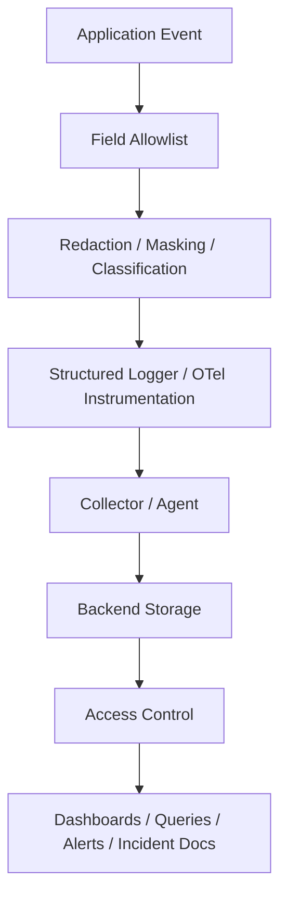

# Part 014 — Security and Privacy in Logging

## 1. Core Idea

Observability can become a security incident.

Logs, traces, metrics, audit events, dumps, and dashboards are created to improve production visibility.
But they can also leak:

- personal data
- access tokens
- passwords
- cookies
- API keys
- authorization headers
- session IDs
- customer identifiers
- commercial terms
- quote/order payloads
- internal topology
- SQL parameters
- message payloads
- support/admin actions

The goal is not to stop logging.
The goal is to design safe telemetry.

Secure logging means:

> Capture enough evidence to debug production without exposing data that should not be stored, retained, queried, indexed, or broadly accessed.

---

## 2. The Dangerous Assumption

A common weak assumption is:

> "It is only logs. Only engineers see it."

In real production systems, logs may be:

- aggregated into central platforms
- replicated across regions
- retained longer than expected
- indexed for search
- exported to vendors
- attached to incidents
- pasted into tickets
- copied into chat
- shown on dashboards
- accessed by support teams
- included in RCA documents
- archived for compliance

Once sensitive data enters telemetry, it becomes hard to remove everywhere.

Structured logging can make leakage worse because sensitive fields become easy to query.
Tracing can make leakage worse because attributes propagate across services.
Metrics can make leakage expensive because labels create long-lived time series.
Audit logs can make leakage long-lived because retention is often longer.

---

## 3. Sensitive Data Taxonomy

Before designing secure logging, classify sensitive data.

| Category | Examples | Logging stance |
|---|---|---|
| Secrets | passwords, API keys, private keys, client secrets | Never log |
| Tokens | access tokens, refresh tokens, ID tokens, JWTs, OAuth codes | Never log |
| Auth headers | `Authorization`, `Proxy-Authorization` | Never log raw |
| Cookies | session cookies, auth cookies, tracking cookies | Never log raw |
| Session identifiers | session ID, CSRF token, SSO state | Usually never log raw |
| Personal data | name, email, phone, address, IP, national ID | Redact/mask/minimize based on policy |
| Customer data | account details, customer profile, contacts | Minimize and classify |
| Commercial data | discounts, prices, contract terms, quote details | Audit carefully; operational logs should minimize |
| Payment data | card data, bank details, payment tokens | Strongly restricted; usually never log |
| Health/regulatory data | regulated personal or business data | Follow strict policy |
| Internal topology | hostnames, private IPs, cluster names, secrets paths | Limit exposure |
| Message payloads | Kafka/RabbitMQ events, commands | Avoid raw logging |
| SQL parameters | names, identifiers, values | Sanitize or omit |
| Redis keys/values | keys may contain user/order/account data | Hash/template keys; never log values by default |

The exact policy must be verified internally.
This part gives engineering principles, not a substitute for CSG/team policy.

---

## 4. Secure Logging Is Signal Design

Security and privacy should be built into signal design.

For each field, ask:

- Why do we need this field?
- Who will query it?
- How long will it be retained?
- Is it needed in logs, metrics, traces, audit, or only one of them?
- Can we store a stable opaque ID instead of raw value?
- Can we store a classification instead of content?
- Can we store a count or enum instead of payload?
- Can we mask or hash it?
- Can it become a metric label?
- Can it create cardinality explosion?
- Could it appear in support tickets or screenshots?
- Would we be comfortable seeing it in an incident report?

A field that is useful during debugging is not automatically safe for production telemetry.

---

## 5. Secure Telemetry Pipeline

A safe logging pipeline has controls before data leaves the application.



Important principle:

> Redact as close to the source as possible.

Backend redaction is useful but should not be the only defense.
If raw secrets leave the application, there is already risk in transit, buffering, sidecars, collectors, failed exports, debug dumps, and vendor ingestion.

---

## 6. Allowlist Beats Denylist

Denylist approach:

```text
log everything except password, token, secret, cookie, authorization
```

This fails when a new sensitive field appears:

```json
{
  "customerNationalId": "...",
  "refreshCredential": "...",
  "billingContact": "..."
}
```

Allowlist approach:

```text
only log fields explicitly approved for telemetry
```

This is safer for structured logs.

Example approved HTTP request log fields:

```json
{
  "timestamp": "2026-07-11T13:45:21.442Z",
  "level": "INFO",
  "event": "http.request.completed",
  "service.name": "quote-service",
  "http.method": "POST",
  "http.route": "/quotes/{quoteId}/submit",
  "http.status_code": 202,
  "duration_ms": 83,
  "request.id": "req-7a31",
  "correlation.id": "corr-123",
  "trace.id": "4bf92f3577b34da6a3ce929d0e0e4736",
  "tenant.id": "tenant-7",
  "actor.id": "u-12345"
}
```

Excluded:

- raw path if it contains IDs that are not allowed
- request body
- response body
- Authorization header
- Cookie header
- raw query string
- token-bearing headers
- user-entered notes

---

## 7. Redaction, Masking, Hashing, and Tokenization

These terms are often confused.

| Technique | Meaning | Example | Use case |
|---|---|---|---|
| Redaction | Remove value entirely | `[REDACTED]` | Secrets, tokens, passwords |
| Masking | Show partial value | `u***@example.com` | Human support workflows, if allowed |
| Hashing | One-way transform | `sha256(value + salt)` | Correlation without raw value |
| Tokenization | Replace with controlled surrogate | `tok_customer_123` | Systems with token service |
| Classification | Store sensitivity label | `personal_data` | Audit and policy awareness |
| Generalization | Store broader bucket | `price_band=high` | Analytics without raw commercial data |

Hashing is not automatically safe.
Low-entropy values can be guessed.
Unsalted hashes may be reversible through dictionary attacks.
Do not hash tokens and assume they are safe.

For secrets and tokens, redact completely.

---

## 8. JAX-RS Request Logging Risks

JAX-RS services commonly log request metadata.
This is useful but risky.

Risky fields:

- raw URI path
- raw query string
- all headers
- request body
- response body
- form parameters
- multipart filenames and metadata
- client certificate subject
- authorization claims
- cookies
- user agent if used for fingerprinting-sensitive contexts

Safer fields:

- HTTP method
- route template
- status code
- duration
- request ID
- correlation ID
- trace ID
- service name
- environment
- sanitized tenant ID
- sanitized actor ID
- bounded error code

Bad:

```java
log.info("request method={} uri={} headers={} body={}",
    request.getMethod(),
    request.getUriInfo().getRequestUri(),
    request.getHeaders(),
    requestBody);
```

Better:

```java
log.info("http request completed method={} route={} status={} duration_ms={} request_id={} trace_id={}",
    method,
    routeTemplate,
    status,
    durationMs,
    requestId,
    traceId);
```

Best in structured logging:

```json
{
  "event": "http.request.completed",
  "http.method": "POST",
  "http.route": "/quotes/{quoteId}/submit",
  "http.status_code": 202,
  "duration_ms": 83,
  "request.id": "req-7a31",
  "trace.id": "4bf92f3577b34da6a3ce929d0e0e4736"
}
```

---

## 9. Header Logging Policy

Never log all headers by default.

Headers that are usually unsafe:

```text
Authorization
Proxy-Authorization
Cookie
Set-Cookie
X-Api-Key
X-Auth-Token
X-Access-Token
X-Refresh-Token
X-CSRF-Token
X-Forwarded-Authorization
```

Headers that may be safe if policy allows:

```text
X-Request-ID
X-Correlation-ID
traceparent
tracestate
User-Agent
X-Forwarded-For
Forwarded
Content-Type
Accept
```

Even "safe" headers need review.
For example, `X-Forwarded-For` may contain personal data.
`tracestate` can contain vendor-specific data.
`User-Agent` can be useful for debugging but may increase fingerprinting sensitivity.

Recommended approach:

- allowlist headers
- normalize names
- redact unknown sensitive patterns
- avoid storing header maps
- document allowed headers
- test the sanitizer

---

## 10. Body Logging Policy

Production body logging should be exceptional, not default.

Request and response bodies may contain:

- personal data
- commercial terms
- credentials
- order details
- quote line items
- customer notes
- billing data
- tokens
- workflow variables
- attachment metadata

Do not enable raw body logging in production unless there is a formally approved, time-limited, access-controlled, redacted debug process.

Safer alternatives:

- log payload size
- log schema/version
- log validation error code
- log field path without value
- log hash of payload for duplicate detection, if approved
- log business key only if allowed
- log bounded reason code
- log count of line items, not line-item details

Example:

```json
{
  "event": "quote.submit.validation_failed",
  "error.code": "QUOTE_MISSING_REQUIRED_FIELD",
  "field_path": "quote.customer.accountId",
  "payload_size_bytes": 4812,
  "line_item_count": 12
}
```

This gives useful debugging evidence without dumping the quote payload.

---

## 11. Query Parameter Logging

Raw query strings are risky.

Example risky URL:

```text
/search?email=alice@example.com&token=abc123&account=ACME
```

Safer strategy:

- log route template
- log allowed query parameter names
- log bounded values only for approved params
- redact unknown values
- never log token-like params

Example:

```json
{
  "http.route": "/orders/search",
  "query.params.present": ["status", "created_after"],
  "query.params.redacted": ["email"]
}
```

If query values are needed for debugging, review and approve each one.

---

## 12. Exception Logging Risks

Exception messages can leak sensitive data.

Examples:

- SQL constraint error exposing values
- HTTP client exception including URL with query string
- validation exception including raw field value
- JSON parse exception including payload snippet
- third-party SDK exception including token or endpoint
- message broker exception including message body

Bad:

```java
log.error("Failed to submit quote: {}", exception.getMessage(), exception);
```

This may duplicate unsafe message content.

Safer:

```java
log.error("quote submission failed error_code={} error_category={} retryable={} request_id={} trace_id={}",
    errorCode,
    errorCategory,
    retryable,
    requestId,
    traceId,
    exception);
```

But even stack traces can include sensitive values if exception messages are unsafe.
Sanitize exception construction at source where possible.

---

## 13. SQL and Database Logging Risks

SQL observability is essential for debugging slow queries and database failures.
But SQL logs can leak parameters.

Risky:

```text
select * from customer where email = 'alice@example.com'
```

Safer:

```text
select * from customer where email = ?
```

For spans and logs:

- prefer sanitized statement templates
- avoid parameter values
- avoid full result rows
- avoid logging entity snapshots
- classify table names if they reveal sensitive domains
- be careful with constraint violation messages
- avoid using raw SQL as metric label

For MyBatis/JPA/Hibernate:

- verify SQL logging settings
- verify bind parameter logging is disabled in production
- verify slow-query logging does not include sensitive binds
- verify ORM exception messages are sanitized before structured logs

---

## 14. Kafka/RabbitMQ Logging Risks

Message payloads often contain business data.

Avoid logging:

- full event payload
- command payload
- message headers without allowlist
- message key if it contains customer/user/order data and policy disallows it
- DLQ payloads in normal logs
- stack traces with embedded payload snippets

Safer fields:

- topic/queue/exchange
- consumer group
- partition/offset, if Kafka
- delivery tag, if RabbitMQ
- event type
- schema version
- event ID
- correlation ID
- causation ID
- business key if allowed
- payload size
- processing latency
- retry attempt
- DLQ reason code

Example:

```json
{
  "event": "message.processing.failed",
  "broker": "kafka",
  "topic": "order-events",
  "partition": 4,
  "offset": 998812,
  "event_type": "order.submitted",
  "event_id": "evt-991",
  "correlation.id": "corr-123",
  "error.code": "DOWNSTREAM_TIMEOUT",
  "retry.attempt": 3,
  "payload_size_bytes": 2841
}
```

---

## 15. Redis Logging Risks

Redis keys can leak data.

Risky keys:

```text
customer:alice@example.com:profile
quote:ACME:discount:enterprise-contract
session:jwt:eyJhbGciOi...
```

Safer approaches:

- avoid raw key logging
- use key templates
- hash keys only if approved
- log command type and latency
- log cache namespace
- log hit/miss
- log TTL bucket, not exact sensitive key

Example:

```json
{
  "event": "redis.command.completed",
  "redis.command": "GET",
  "redis.key_template": "quote:{quote_id}:pricing_result",
  "cache.namespace": "quote-pricing",
  "cache.hit": true,
  "duration_ms": 2
}
```

Do not log Redis values by default.

---

## 16. MDC and Context Risks

MDC fields are copied into many logs.
A bad MDC field becomes widespread leakage.

Dangerous MDC fields:

- email
- username if considered personal data
- raw token subject with sensitive claims
- full JWT claims
- customer name
- full order/quote payload
- raw tenant display name
- session ID
- authorization scopes if sensitive

Safer MDC fields:

- request ID
- correlation ID
- trace ID
- span ID
- service name
- environment
- tenant ID if policy allows
- actor ID if policy allows
- bounded actor type
- route template

Rule:

> MDC should contain stable correlation context, not payload data.

Also ensure MDC cleanup.
Leaked MDC from one request to another can become both privacy leak and debugging defect.

---

## 17. Trace Attributes and Baggage Risks

Traces can carry attributes across services.
Baggage can propagate even further.

Never put sensitive data in baggage unless there is a very explicit internal standard and control.

Risky baggage:

```text
user.email=alice@example.com
customer.name=Acme Corp
jwt=...
quote.totalPrice=...
```

Safer:

```text
tenant.tier=enterprise
request.source=external
traffic.class=business-critical
```

Span attributes should also be reviewed.
Avoid:

- raw URL with query params
- raw SQL parameters
- full messaging payload
- Redis raw key
- user email
- token claims
- order/quote details unless approved

Tracing is often sampled, exported, and viewed broadly.
Treat it as production telemetry, not private debug memory.

---

## 18. Metrics Label Privacy

Metrics labels are dangerous because they create persistent time series.

Never use these as metric labels:

- request ID
- trace ID
- span ID
- user ID
- email
- session ID
- token
- order ID
- quote ID
- raw path
- raw error message
- raw SQL statement
- raw Redis key
- raw message key

Usually safe labels:

- service name
- endpoint route template
- HTTP method
- status code class or code
- dependency name
- operation name
- error code
- retryable true/false
- actor type, if bounded
- tenant tier, if approved

Bad:

```text
http_requests_total{path="/quotes/Q-10001/submit", user="alice@example.com"}
```

Better:

```text
http_requests_total{route="/quotes/{quoteId}/submit", method="POST", status="202"}
```

Metric privacy and cardinality governance are inseparable.

---

## 19. Audit Log Privacy

Audit logs need more detail than application logs, but they still need privacy discipline.

Audit may legitimately require:

- actor ID
- target ID
- action
- before/after values
- source IP
- reason code
- delegation/impersonation details

But this does not mean everything is safe.

Audit design should define:

- which actor fields are stored
- whether display names/emails are allowed
- which target identifiers are safe
- which fields can appear in before/after
- which values must be redacted
- retention by event type
- who can read audit events
- whether audit reads are logged

Audit logs often have longer retention.
The privacy risk is therefore higher, not lower.

---

## 20. Access Control for Telemetry

Secure logging is not only about what is written.
It is also about who can read it.

Questions to verify:

- Who can query production logs?
- Who can query traces?
- Who can query audit logs?
- Who can view dashboards?
- Are access levels separated by environment?
- Are logs segmented by tenant/customer?
- Are support users restricted from engineering-only logs?
- Are audit reads themselves logged?
- Are exports/downloads controlled?
- Are screenshots/ticket attachments governed?
- Are vendors involved?

A redacted log with broad access may still be acceptable.
A rich audit log with broad access may not be.

---

## 21. Retention and Deletion

Retention increases usefulness and risk.

Long retention helps:

- incident analysis
- trend analysis
- customer support
- audit/compliance
- RCA
- security investigation

Long retention increases:

- breach impact
- storage cost
- privacy exposure
- deletion complexity
- access control burden

Questions:

- How long are application logs retained?
- How long are traces retained?
- How long are metrics retained?
- How long are audit logs retained?
- Are retention policies different by environment?
- Can data be deleted or anonymized when required?
- Are backups and archives included?
- Are third-party backends covered?

Do not assume telemetry retention matches database retention.

---

## 22. Secure Logging in Kubernetes and Cloud

Kubernetes and cloud platforms add additional leakage paths.

Check:

- container stdout/stderr logs
- sidecar logs
- init container logs
- ingress logs
- service mesh logs
- Kubernetes events
- pod annotations
- environment variables
- config maps
- secret mounts
- crash dumps
- cloud load balancer logs
- WAF logs
- API gateway/APIM logs
- managed database logs
- cloud audit logs

Common mistakes:

- app prints environment variables on startup
- failed config logs include secret values
- exception logs include connection strings
- readiness checks expose internal details
- ingress logs record raw URLs with sensitive query params
- debug sidecar logs payloads
- cloud gateway logs capture headers unexpectedly

Secure logging must include platform logging paths, not only application code.

---

## 23. Debug Logging in Production

Runtime log level changes are useful.
They are also risky.

Risks:

- DEBUG logs may include payloads
- third-party libraries may log headers or SQL params
- high volume can increase cost quickly
- sensitive values may appear only under debug
- debug logging may degrade performance
- temporary debug may be forgotten

Safe process:

- require approval for production debug logging
- scope debug to service/class/package if possible
- time-limit debug logging
- avoid enabling debug for HTTP clients/auth libraries broadly
- monitor log volume during debug
- review debug logs for leakage risk
- revert immediately after investigation

Debug logging should be an operational procedure, not an impulse.

---

## 24. Testing Secure Logging

Secure logging can and should be tested.

Test cases:

- Authorization header is redacted
- Cookie header is redacted
- token-like query parameter is redacted
- request body is not logged
- validation error does not log rejected raw value
- SQL parameters are not logged
- Kafka/RabbitMQ payload is not logged
- Redis raw key is not logged if disallowed
- MDC is cleaned after request
- exception log includes error code, not sensitive message content
- audit before/after redacts classified fields

Example test idea:

```java
@Test
void requestLogsMustNotContainAuthorizationHeader() {
    var response = client.target("/quotes/Q-1/submit")
        .request()
        .header("Authorization", "Bearer very-secret-token")
        .post(Entity.json(validPayload));

    assertThat(logCapture.events())
        .noneMatch(event -> event.formattedMessage().contains("very-secret-token"));
}
```

Use test log appenders, structured log assertions, and integration tests around filters/interceptors.

---

## 25. Leakage Detection

Controls can fail.
Detect leakage patterns.

Possible detection techniques:

- secret scanning in log samples
- regex detection for tokens/keys
- detection for Authorization/Cookie headers
- high-risk field name scanning
- DLP tooling, if available
- periodic log sampling review
- query for suspicious patterns
- alert on known leaked marker patterns in non-production
- CI tests for logging sanitizer

Be careful with scanning production logs because scanning itself may expose sensitive data to more systems.
Follow internal security process.

---

## 26. Incident Response for Telemetry Leakage

If sensitive data appears in logs:

1. Stop the source.
2. Identify affected fields and time range.
3. Identify affected services/environments.
4. Identify where telemetry was exported.
5. Restrict access if needed.
6. Notify security/privacy according to internal process.
7. Rotate exposed credentials or tokens if applicable.
8. Purge/delete from log backends if policy and platform allow.
9. Check archives, downstream exports, tickets, dashboards, and screenshots.
10. Add regression tests and sanitizer improvements.
11. Record corrective and preventive actions.

Do not quietly fix and ignore.
Telemetry leakage can have compliance, customer, and security impact.

---

## 27. Example Sanitizer Pattern

A simple sanitizer should be centralized and tested.

```java
public final class LogSanitizer {
    private static final Set<String> SENSITIVE_HEADER_NAMES = Set.of(
        "authorization",
        "proxy-authorization",
        "cookie",
        "set-cookie",
        "x-api-key",
        "x-auth-token",
        "x-access-token",
        "x-refresh-token",
        "x-csrf-token"
    );

    private LogSanitizer() {}

    public static Map<String, String> sanitizeHeaders(Map<String, String> headers) {
        Map<String, String> sanitized = new LinkedHashMap<>();

        headers.forEach((name, value) -> {
            String normalized = name.toLowerCase(Locale.ROOT);
            if (SENSITIVE_HEADER_NAMES.contains(normalized)) {
                sanitized.put(name, "[REDACTED]");
            } else if (isAllowedHeader(normalized)) {
                sanitized.put(name, safeTruncate(value));
            }
        });

        return sanitized;
    }

    private static boolean isAllowedHeader(String name) {
        return Set.of(
            "x-request-id",
            "x-correlation-id",
            "traceparent",
            "content-type",
            "accept",
            "user-agent"
        ).contains(name);
    }

    private static String safeTruncate(String value) {
        if (value == null) return null;
        return value.length() <= 256 ? value : value.substring(0, 256) + "...[TRUNCATED]";
    }
}
```

This example is intentionally conservative.
Internal implementation should match team policy and libraries.

---

## 28. Internal Verification Checklist

Use this checklist in the codebase and team context.

### Policy and Ownership

- Is there a secure logging policy?
- Who owns telemetry privacy standards?
- Who approves production body/header logging?
- What data classifications exist?
- Which fields are forbidden in logs/traces/metrics/audit?
- Are audit logs governed differently from application logs?

### Application Logging

- Are request/response bodies logged anywhere?
- Are headers logged anywhere?
- Are query strings logged raw?
- Are exception messages sanitized?
- Are validation errors logging rejected values?
- Are SQL bind parameters logged in production?
- Are Redis keys/values logged?
- Are Kafka/RabbitMQ payloads logged?
- Are third-party libraries logging sensitive data?

### Context and Instrumentation

- What fields are placed in MDC?
- Is MDC cleaned after requests?
- Are trace attributes reviewed for sensitive data?
- Is baggage used?
- Are metric labels bounded and privacy-safe?
- Are route templates used instead of raw paths?
- Are tenant/actor/business IDs allowed in logs?

### Platform and Cloud

- Do NGINX/ingress/API gateway/load balancer logs include sensitive query/header data?
- Do Kubernetes events or pod logs expose secrets/config values?
- Do startup logs print environment variables?
- Do cloud logs capture headers or payloads?
- Are log collectors/agents configured with redaction?

### Access, Retention, and Export

- Who can read production logs?
- Who can read audit logs?
- Are log exports controlled?
- Are dashboards exposing sensitive fields?
- Are incident tickets/screenshots governed?
- What is retention per telemetry type?
- Can leaked telemetry be deleted/purged?
- Are vendors/subprocessors involved?

### Testing and Detection

- Are sanitizers unit-tested?
- Are structured log assertions used?
- Are secret-scanning checks applied to telemetry samples?
- Are leakage incidents tracked?
- Are RCA actions converted into tests or guardrails?

---

## 29. PR Review Checklist

When reviewing logging, tracing, metrics, audit, or instrumentation changes, ask:

- Does this log include raw request/response body?
- Does it log headers or query strings?
- Are sensitive headers redacted?
- Could exception messages contain sensitive values?
- Are user-entered values logged?
- Are SQL parameters logged?
- Are message payloads logged?
- Are Redis keys/values logged?
- Are IDs safe for long-term retention?
- Are metric labels bounded and privacy-safe?
- Are trace attributes safe?
- Is baggage used safely?
- Are audit before/after fields classified and redacted?
- Is MDC limited to safe correlation fields?
- Are debug logs safe if enabled in production?
- Are log volume and retention implications understood?
- Does this require security/privacy review?

---

## 30. Practical Design Rules

Use these rules as baseline:

1. Never log secrets, passwords, tokens, cookies, or raw authorization headers.
2. Do not log request or response bodies by default.
3. Prefer allowlists over denylists.
4. Redact as close to the application source as possible.
5. Use route templates instead of raw paths.
6. Avoid raw query strings.
7. Avoid SQL bind values.
8. Avoid Kafka/RabbitMQ payloads in normal logs.
9. Avoid Redis raw keys and values unless explicitly approved.
10. Keep MDC limited to safe correlation context.
11. Do not put personal or commercial data in metric labels.
12. Treat trace attributes and baggage as production telemetry.
13. Treat audit logs as high-sensitivity evidence.
14. Restrict access and define retention.
15. Test sanitization and logging behavior.
16. Have a response process for telemetry leakage.

---

## 31. Summary

Secure logging is the discipline of preserving production evidence without creating unnecessary data exposure.

You should now be able to:

- identify sensitive data classes in telemetry
- distinguish redaction, masking, hashing, tokenization, classification, and generalization
- design safer JAX-RS request/response logging
- avoid unsafe header, body, query, SQL, Redis, and message payload logging
- understand MDC, trace attribute, baggage, and metric label privacy risks
- evaluate audit log privacy separately from application logs
- review access control and retention risks
- test secure logging behavior
- respond to telemetry leakage incidents
- review PRs for secure logging and privacy-safe observability

The next part starts the metrics section: counters, gauges, histograms, timers, labels, cardinality, and metric lifecycle.
