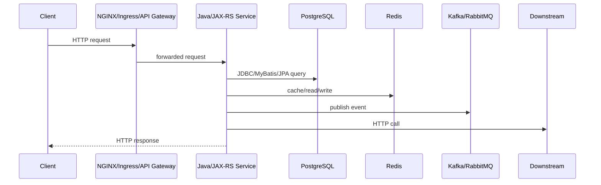

# Metrics Foundation

Metrics adalah signal numerik berbasis waktu yang menjawab pertanyaan seperti:

- Apakah service sehat?
- Apakah traffic naik?
- Apakah error rate meningkat?
- Apakah latency memburuk?
- Apakah database pool mulai penuh?
- Apakah Kafka consumer tertinggal?
- Apakah Redis cache menjadi tidak efektif?
- Apakah workflow approval mulai menumpuk?
- Apakah sistem masih memenuhi SLO?

Dalam observability, metrics berbeda dari logs dan traces. Logs menjelaskan event individual. Traces menjelaskan perjalanan request atau unit kerja. Metrics menjelaskan pola, tren, rasio, distribusi, dan kondisi agregat dari sistem.

Untuk senior backend engineer, metrics bukan sekadar angka di dashboard. Metrics adalah kontrak operasional antara code, runtime, platform, dan manusia yang menjaga production.

---

## 1. Apa Itu Metric?

Metric adalah pengukuran numerik yang dicatat secara berkala atau saat event tertentu terjadi, lalu disimpan sebagai time series.

Contoh metric:

```text
http.server.requests.count{service="quote-api", method="POST", route="/quotes", status="201"} 12345
http.server.request.duration{service="quote-api", route="/quotes", percentile="p95"} 350ms
jdbc.connections.active{service="quote-api", datasource="primary"} 18
kafka.consumer.lag{service="order-worker", topic="order-events", consumer_group="order-fulfillment"} 932
redis.cache.hit.ratio{service="catalog-api", cache="product-offering"} 0.91
```

Metric harus memiliki:

1. **Nama** yang jelas.
2. **Nilai numerik**.
3. **Unit**.
4. **Timestamp**.
5. **Dimensi/label/tag** yang aman dan terkendali.
6. **Makna operasional**.

Metric yang baik bukan hanya bisa dikumpulkan. Metric yang baik bisa dipakai untuk mengambil keputusan.

---

## 2. Metric vs Log vs Trace

| Signal | Kekuatan utama | Cocok untuk | Risiko utama |
|---|---|---|---|
| Metric | Tren, agregasi, alert, SLO | Health, capacity, rate, latency, saturation | Label cardinality explosion, salah agregasi |
| Log | Detail event individual | Error detail, audit clue, state transition, debugging context | Volume besar, privacy leak, sulit agregasi |
| Trace | Causal path request/job | Latency breakdown, dependency chain, context propagation | Sampling, incomplete instrumentation, cost |

Contoh pertanyaan yang dijawab metrics:

```text
Apakah error rate endpoint quote submission naik sejak deployment terakhir?
```

Contoh pertanyaan yang dijawab logs:

```text
Quote ID mana yang gagal validasi dan error code apa yang dikembalikan?
```

Contoh pertanyaan yang dijawab traces:

```text
Di dependency mana request quote pricing menghabiskan waktu paling lama?
```

Metric memberikan gambaran sistemik. Logs dan traces memberikan bukti spesifik.

---

## 3. Mental Model: Metric Sebagai Time Series

Metric biasanya disimpan sebagai rangkaian nilai dari waktu ke waktu.

```text
metric_name{label_a="x", label_b="y"} @ timestamp_1 = value_1
metric_name{label_a="x", label_b="y"} @ timestamp_2 = value_2
metric_name{label_a="x", label_b="y"} @ timestamp_3 = value_3
```

Setiap kombinasi nama metric dan label menghasilkan satu time series.

Contoh:

```text
http.server.requests.count{route="/quotes", method="POST", status="201"}
http.server.requests.count{route="/quotes", method="POST", status="400"}
http.server.requests.count{route="/quotes", method="POST", status="500"}
```

Tiga kombinasi label di atas adalah tiga time series berbeda.

Inilah alasan label harus dirancang hati-hati. Satu label yang nilainya tidak terbatas seperti `request_id`, `user_id`, atau `order_id` bisa menciptakan jutaan time series.

---

## 4. Metric Lifecycle

Metric memiliki lifecycle seperti komponen production lain.

```mermaid
flowchart LR
    A[Define question] --> B[Choose metric type]
    B --> C[Choose name and unit]
    C --> D[Choose labels]
    D --> E[Instrument code/runtime]
    E --> F[Collect/export]
    F --> G[Store as time series]
    G --> H[Query/dashboard]
    H --> I[Alert/SLO/capacity decision]
    I --> J[Review and retire]
```



Lifecycle ini penting karena banyak metric dibuat saat development, tetapi tidak pernah digunakan saat incident.

Metric yang tidak punya owner, tidak muncul di dashboard, tidak dipakai alert, tidak dipakai SLO, dan tidak membantu debugging sebaiknya dipertanyakan.

---

## 5. Core Metric Types

Metric type menentukan bagaimana nilai diinterpretasikan.

Jenis utama:

1. Counter
2. Gauge
3. Histogram
4. Summary
5. Timer
6. Rate
7. Percentile

Sebagian library atau backend memberi nama berbeda, tetapi konsepnya tetap sama.

---

## 6. Counter

Counter adalah nilai yang hanya bertambah.

Cocok untuk menghitung event:

- Total request.
- Total error.
- Total message published.
- Total message consumed.
- Total retry.
- Total DLQ.
- Total audit event.
- Total failed login.
- Total invalid state transition.

Contoh:

```text
quote.created.total
quote.pricing.failed.total
http.server.requests.total
kafka.messages.consumed.total
rabbitmq.messages.redelivered.total
```

Counter tidak cocok untuk nilai yang bisa naik turun.

Buruk:

```text
active_requests_total
```

Karena active requests bisa naik dan turun. Gunakan gauge.

---

## 7. Counter dan Rate

Counter mentah biasanya kurang berguna jika dibaca langsung.

Contoh:

```text
http.server.requests.total = 9000000
```

Angka ini tidak menjawab apakah sistem sehat sekarang.

Yang lebih berguna adalah rate:

```text
request per second
error per minute
retry per 5 minutes
DLQ messages per hour
```

Contoh pertanyaan:

```text
Berapa request per second endpoint /quotes dalam 5 menit terakhir?
```

```text
Berapa error rate HTTP 5xx dibanding total request?
```

Counter biasanya dipakai dengan fungsi rate/increase di backend metric.

---

## 8. Gauge

Gauge adalah nilai yang bisa naik dan turun.

Cocok untuk kondisi saat ini:

- Active requests.
- Active database connections.
- Idle database connections.
- Queue depth.
- Consumer lag.
- JVM heap used.
- CPU usage.
- Thread count.
- Pod count.
- Redis connected clients.
- Number of active workflow instances.

Contoh:

```text
http.server.active_requests
jdbc.connections.active
rabbitmq.queue.messages_ready
jvm.memory.used
camunda.process.instances.active
```

Gauge berbahaya jika dipakai untuk event count. Untuk jumlah event, gunakan counter.

---

## 9. Histogram

Histogram mengukur distribusi nilai.

Cocok untuk:

- Request latency.
- Database query latency.
- Downstream HTTP latency.
- Message processing duration.
- Workflow transition duration.
- Payload size.
- Queue waiting time.

Histogram membagi nilai ke bucket.

Contoh bucket latency:

```text
<= 50ms
<= 100ms
<= 250ms
<= 500ms
<= 1s
<= 2.5s
<= 5s
<= 10s
+Inf
```

Dengan histogram, kita bisa menghitung percentile seperti p50, p95, p99 di sisi backend metric.

---

## 10. Bucket

Bucket menentukan resolusi distribusi.

Bucket yang buruk menghasilkan insight buruk.

Contoh buruk untuk API latency:

```text
<= 1s
<= 10s
<= 60s
+Inf
```

Jika SLO latency adalah 500ms, bucket di atas terlalu kasar.

Contoh lebih baik:

```text
<= 50ms
<= 100ms
<= 250ms
<= 500ms
<= 1s
<= 2.5s
<= 5s
<= 10s
+Inf
```

Prinsip bucket:

- Bucket harus mencerminkan SLO dan user experience.
- Bucket harus cukup detail di area keputusan penting.
- Terlalu banyak bucket meningkatkan cardinality dan storage.
- Bucket harus konsisten antar service jika ingin dibandingkan.

---

## 11. Summary

Summary juga mengukur distribusi, tetapi percentile sering dihitung di client/library side.

Summary bisa berguna, tetapi memiliki trade-off:

- Percentile bisa sulit diagregasi antar instance.
- Tidak selalu cocok untuk global p95/p99 across pods.
- Bisa lebih sulit dipakai untuk SLO agregat.

Dalam banyak sistem modern, histogram lebih sering dipilih untuk latency yang perlu diagregasi.

Tetap verifikasi standar internal team/platform sebelum memilih histogram atau summary.

---

## 12. Timer

Timer biasanya abstraction library untuk mengukur duration.

Dalam praktik Java, timer sering menghasilkan beberapa metric sekaligus:

- Count.
- Total duration.
- Max duration.
- Histogram buckets.
- Percentile jika diaktifkan.

Timer cocok untuk:

- HTTP request duration.
- DB query duration.
- Redis command duration.
- Kafka message processing duration.
- Business operation duration.

Contoh operation:

```text
quote.pricing.duration
order.validation.duration
approval.workflow.transition.duration
```

Pastikan unit jelas: milliseconds, seconds, atau nanoseconds.

---

## 13. Percentile

Percentile menjawab: sekian persen request lebih cepat dari nilai tertentu.

Contoh:

- p50: median.
- p90: 90% request lebih cepat dari nilai ini.
- p95: 95% request lebih cepat dari nilai ini.
- p99: 99% request lebih cepat dari nilai ini.

p95 dan p99 penting karena average latency sering menipu.

Contoh:

```text
Average latency = 120ms
p95 latency = 900ms
p99 latency = 4s
```

Average terlihat sehat, tetapi tail latency buruk.

Untuk enterprise systems, tail latency sering lebih penting daripada average karena user tertentu, tenant tertentu, atau transaction tertentu bisa terdampak parah meskipun average bagus.

---

## 14. Rate

Rate adalah perubahan counter per unit waktu.

Contoh:

```text
requests per second
errors per minute
messages consumed per second
retries per 5 minutes
DLQ messages per hour
```

Rate berguna untuk:

- Traffic.
- Error spikes.
- Throughput.
- Retry storms.
- DLQ growth.
- Event ingestion.

Counter tanpa rate biasanya tidak cukup untuk operasi harian.

---

## 15. Unit

Metric tanpa unit adalah sumber kebingungan.

Buruk:

```text
request_duration = 500
```

Tidak jelas apakah 500 ms, microseconds, atau seconds.

Lebih baik:

```text
http.server.request.duration.seconds
```

atau metadata unit yang eksplisit:

```text
unit = seconds
```

Unit umum:

| Kategori | Unit umum |
|---|---|
| Duration | seconds, milliseconds |
| Size | bytes |
| Count | items, requests, messages |
| Ratio | 0..1 atau percentage |
| Rate | per second, per minute |
| Utilization | percentage atau 0..1 |

Prinsip: jangan campur unit dalam metric yang sama.

---

## 16. Label, Tag, dan Dimension

Label/tag/dimension adalah metadata yang memecah metric menjadi beberapa series.

Contoh:

```text
http.server.requests.total{
  service="quote-api",
  environment="prod",
  method="POST",
  route="/quotes/{quoteId}/submit",
  status="500"
}
```

Label yang baik:

- Low cardinality.
- Stabil.
- Bisa digunakan untuk filtering/aggregation.
- Tidak mengandung PII.
- Tidak mengandung ID unik per request.
- Tidak mengandung raw error message.

Label umum:

```text
service
environment
region
cluster
namespace
pod
version
method
route
status_code
dependency
topic
queue
operation
outcome
error_type
```

---

## 17. Cardinality

Cardinality adalah jumlah kombinasi unik label values.

Contoh:

```text
http.server.requests.total{route="/quotes/{id}", status="200"}
```

Jika route hanya punya 50 nilai dan status punya 10 nilai, kombinasi masih terkendali.

Contoh berbahaya:

```text
http.server.requests.total{path="/quotes/QUO-984193/submit", user_id="u-123", request_id="req-abc"}
```

Jika `request_id` unik untuk setiap request, metric menciptakan series baru untuk setiap request.

Dampak high cardinality:

- Storage cost naik.
- Query lambat.
- Backend metric overload.
- Dashboard lambat.
- Alert tidak stabil.
- Engineer kehilangan trust terhadap metric.

Rule praktis:

> Jangan gunakan ID unik sebagai metric label kecuali ada alasan platform yang sangat kuat dan sudah disetujui.

---

## 18. Path Template vs Raw Path

Untuk HTTP metrics, gunakan route template, bukan raw path.

Buruk:

```text
path="/quotes/QUO-12345/items/ITEM-999"
```

Baik:

```text
route="/quotes/{quoteId}/items/{itemId}"
```

Raw path menciptakan cardinality explosion dan bisa membocorkan business ID.

Route template membuat agregasi aman:

```text
p95 latency endpoint submit quote
error rate endpoint update quote item
request rate endpoint create order
```

Internal verification penting: pastikan JAX-RS instrumentation mengambil route template, bukan raw URI.

---

## 19. Metric Naming

Metric naming harus konsisten.

Prinsip:

- Nama menjelaskan domain pengukuran.
- Nama tidak terlalu generic.
- Unit jelas.
- Suffix konsisten.
- Tidak memasukkan label ke nama metric jika seharusnya menjadi label.

Buruk:

```text
count
latency
error
quoteError500
```

Lebih baik:

```text
http.server.requests.total
http.server.request.duration.seconds
quote.pricing.requests.total
quote.pricing.duration.seconds
quote.pricing.failures.total
```

Jangan membuat metric terpisah untuk status code jika status code bisa menjadi label.

Buruk:

```text
http_200_count
http_400_count
http_500_count
```

Lebih baik:

```text
http.server.requests.total{status_code="200"}
http.server.requests.total{status_code="400"}
http.server.requests.total{status_code="500"}
```

---

## 20. Metric Ownership

Setiap metric penting harus punya owner.

Owner bertanggung jawab atas:

- Definisi metric.
- Unit.
- Label policy.
- Dashboard usage.
- Alert usage.
- SLO usage.
- Retention need.
- Deprecation.

Metric tanpa owner sering menjadi telemetry debt.

Dalam enterprise system, ownership bisa berada di:

- Service team.
- Platform/SRE team.
- Database team.
- Security team.
- Product/domain team.
- Compliance/audit team.

---

## 21. Scrape vs Push

Ada dua pola umum pengumpulan metrics.

### Scrape model

Collector/backend menarik metrics dari endpoint service.

Contoh mental model:

```text
metric backend / collector --> GET /metrics --> service
```

Kelebihan:

- Service sederhana.
- Discovery bisa otomatis di Kubernetes.
- Cocok untuk Prometheus-style monitoring.
- Backend mengontrol interval scrape.

Kekurangan:

- Service harus reachable.
- Short-lived jobs bisa hilang jika selesai sebelum scrape.
- Membutuhkan endpoint metrics yang aman.

### Push model

Service mengirim metrics ke collector/backend.

Contoh mental model:

```text
service --> exporter/collector --> metric backend
```

Kelebihan:

- Cocok untuk short-lived jobs.
- Bisa bekerja di environment tertentu yang tidak mudah di-scrape.
- Lebih fleksibel untuk pipeline telemetry.

Kekurangan:

- Risiko backpressure ke aplikasi.
- Perlu retry/buffering.
- Lebih sulit mengontrol cardinality dari pusat.

Internal stack harus diverifikasi. Jangan mengasumsikan CSG memakai model tertentu.

---

## 22. Metric Endpoint

Dalam Java service, metric sering diekspos lewat endpoint seperti:

```text
/metrics
/actuator/prometheus
/internal/metrics
```

Untuk JAX-RS/Jakarta REST, endpoint bisa disediakan oleh framework, runtime, sidecar, agent, atau library instrumentation.

Hal penting:

- Endpoint tidak boleh terbuka publik tanpa kontrol.
- Endpoint harus reachable oleh collector.
- Endpoint harus tidak mahal dieksekusi.
- Endpoint harus tidak mengandung data sensitif.
- Endpoint harus konsisten dengan service labels.

---

## 23. Java Metrics Instrumentation Awareness

Di Java ecosystem, metrics bisa berasal dari beberapa sumber:

- Application code.
- Framework instrumentation.
- JVM runtime.
- HTTP server/servlet/JAX-RS layer.
- JDBC/DataSource/connection pool.
- Kafka/RabbitMQ client.
- Redis client.
- Kubernetes/container runtime.
- OpenTelemetry SDK/agent.
- Micrometer-style facade.
- Vendor agent.

Jangan hanya mencari metric di code. Banyak metric berasal dari auto-instrumentation atau platform.

Internal verification checklist harus mencari sumber metric sebenarnya.

---

## 24. Manual Metric Instrumentation Example

Contoh pseudo-code Java:

```java
public QuotePriceResult priceQuote(Quote quote) {
    Timer.Sample sample = Timer.start(meterRegistry);

    try {
        QuotePriceResult result = pricingEngine.price(quote);

        meterRegistry.counter(
            "quote.pricing.requests.total",
            "outcome", "success"
        ).increment();

        return result;
    } catch (PricingException ex) {
        meterRegistry.counter(
            "quote.pricing.requests.total",
            "outcome", "failure",
            "error_type", "pricing_error"
        ).increment();
        throw ex;
    } finally {
        sample.stop(meterRegistry.timer(
            "quote.pricing.duration.seconds"
        ));
    }
}
```

Catatan:

- `quoteId` tidak dijadikan label.
- `error_type` harus low-cardinality.
- Duration dicatat sebagai timer/histogram.
- Outcome dipakai untuk success/failure ratio.

---

## 25. Metric yang Aman untuk Business Operation

Untuk business operation, hindari label ID unik.

Baik:

```text
quote.pricing.requests.total{outcome="success"}
quote.pricing.requests.total{outcome="failure", error_type="catalog_missing"}
quote.pricing.duration.seconds{operation="price_quote"}
quote.lifecycle.transitions.total{from_state="draft", to_state="priced"}
```

Berbahaya:

```text
quote.pricing.duration.seconds{quote_id="QUO-123"}
quote.lifecycle.transitions.total{order_id="ORD-999"}
```

Gunakan logs/traces/audit untuk ID spesifik. Gunakan metrics untuk agregasi.

---

## 26. Metrics for Java/JAX-RS Request Flow

Request Java/JAX-RS umumnya perlu metric di beberapa boundary:



Metric candidates:

| Boundary | Metric examples |
|---|---|
| Edge | request rate, upstream latency, 4xx/5xx, 499/502/503/504 |
| JAX-RS | request count, latency, status code, active request |
| DB | pool active/idle/pending, query duration, transaction duration |
| Redis | hit/miss ratio, command latency, eviction, blocked clients |
| Kafka/RabbitMQ | publish rate, consume rate, lag/depth, DLQ, redelivery |
| Downstream | latency, timeout rate, error rate, retry rate |
| JVM | heap, GC, threads, CPU, direct memory |
| Kubernetes | pod restart, CPU throttling, OOMKilled, readiness failure |

---

## 27. Metric Correctness Concerns

Metric bisa salah walaupun sistemnya benar.

Common correctness issues:

1. Counter di-reset dan query tidak menangani reset.
2. Gauge tidak di-update saat error path.
3. Timer tidak berhenti di exception path.
4. Label terlalu banyak atau tidak konsisten.
5. Unit campur antara ms dan seconds.
6. Status code label tidak tercatat untuk exception.
7. Endpoint raw path dipakai sebagai label.
8. Background job metric hanya emit saat success.
9. Retry dihitung sebagai success tanpa failure counter.
10. Consumer lag tidak dipisah per consumer group.
11. Business metric double-count karena duplicate event.
12. Histogram bucket tidak sesuai SLO.

Metric harus diuji dan direview seperti logic production.

---

## 28. Performance Concerns

Instrumentation metric tidak gratis.

Risiko:

- Hot path overhead.
- Label value allocation berlebihan.
- High-cardinality memory pressure.
- Exporter backpressure.
- Lock contention di registry.
- Expensive gauge callback.
- Metric endpoint terlalu berat.

Prinsip:

- Jangan membuat label value dari object besar.
- Jangan melakukan query database untuk menghitung gauge setiap scrape tanpa kontrol.
- Jangan emit metric per item jika batch besar tanpa aggregation strategy.
- Jangan menaruh ID unik sebagai label.
- Jangan membuat metric baru secara dinamis berdasarkan input user.

---

## 29. Security and Privacy Concerns

Metric bisa membocorkan data walaupun tidak berisi log body.

Contoh risiko:

```text
http.server.requests.total{path="/customers/123456789/orders"}
quote.operation.total{customer_name="Acme Secret Deal"}
auth.failure.total{username="john@example.com"}
```

Jangan gunakan label yang mengandung:

- PII.
- Email.
- Username.
- Token.
- Raw path dengan ID.
- Customer name.
- Quote/order ID jika dianggap sensitive.
- Error message mentah.
- SQL statement mentah.

Gunakan kategori aman:

```text
error_type="validation_error"
route="/customers/{customerId}/orders"
outcome="failure"
tenant_tier="enterprise"
```

Tenant ID adalah trade-off: bisa berguna untuk enterprise support, tetapi juga bisa menciptakan cardinality dan privacy concern. Harus diverifikasi internal.

---

## 30. Cost Concerns

Metric cost dipengaruhi oleh:

- Jumlah metric names.
- Jumlah label keys.
- Jumlah label values.
- Jumlah time series.
- Scrape interval.
- Retention.
- Histogram bucket count.
- Query/dashboard frequency.
- Alert evaluation frequency.

High-cardinality label adalah sumber cost terbesar.

Contoh sederhana:

```text
100 services
x 50 endpoints
x 10 status codes
x 6 methods
= 300,000 series untuk satu metric family
```

Jika ditambah `user_id`, jumlah bisa menjadi jutaan atau miliaran.

---

## 31. Operational Concerns

Metric harus bisa dipakai saat incident.

Pertanyaan operasional:

- Apakah metric muncul di dashboard utama?
- Apakah metric punya owner?
- Apakah metric dipakai alert?
- Apakah metric dipakai SLO?
- Apakah ada runbook untuk metric abnormal?
- Apakah engineer tahu interpretasinya?
- Apakah metric tetap tersedia saat service degrade?
- Apakah metric bisa dibandingkan sebelum/sesudah deploy?
- Apakah metric punya label version/build/deployment?

Metric yang tidak bisa ditafsirkan saat incident bisa menjadi noise.

---

## 32. Metrics for Incident Debugging

Saat incident, metrics membantu menjawab:

1. Kapan mulai?
2. Apakah ada traffic spike?
3. Apakah error spike?
4. Endpoint mana terdampak?
5. Dependency mana degrade?
6. Apakah latency tail naik?
7. Apakah saturation terjadi?
8. Apakah deployment/config change terkait?
9. Apakah backlog/lag tumbuh?
10. Apakah blast radius terbatas ke service, tenant, region, atau dependency tertentu?

Metric tidak memberi semua jawaban, tetapi memberi peta arah investigasi.

---

## 33. Metrics and SLO

SLO membutuhkan metric yang stabil dan benar.

Contoh SLI:

```text
Availability SLI = successful requests / total valid requests
Latency SLI = percentage of requests below 500ms
Freshness SLI = percentage of events processed within 2 minutes
Workflow SLI = percentage of orders completed within target duration
```

Jika metric request count salah, SLO availability juga salah.

Jika latency bucket tidak mendukung threshold SLO, SLO latency sulit dihitung.

Jika event timestamp tidak tersedia, freshness SLO sulit dibuat.

Metric design harus mempertimbangkan SLO sejak awal.

---

## 34. Common Metrics Anti-Patterns

### Anti-pattern 1: Metric tanpa pertanyaan

```text
Kita expose semua yang bisa diexpose.
```

Masalah: dashboard penuh noise, cost naik, signal penting tenggelam.

### Anti-pattern 2: Label berisi ID unik

```text
order_id, request_id, user_id sebagai label
```

Masalah: cardinality explosion.

### Anti-pattern 3: Average latency sebagai satu-satunya latency metric

Masalah: tail latency tersembunyi.

### Anti-pattern 4: Error metric tanpa error type

Masalah: tidak bisa membedakan validation error, dependency timeout, auth error, atau system error.

### Anti-pattern 5: Metric hanya di success path

Masalah: failure path menjadi blind spot.

### Anti-pattern 6: Business metric double-count

Masalah: duplicate event/retry membuat angka bisnis salah.

### Anti-pattern 7: Metric berbeda antar service tanpa standar

Masalah: sulit membangun dashboard dan alert konsisten.

---

## 35. Minimal Metrics per Java/JAX-RS Service

Minimal service metrics:

```text
http.server.requests.total
http.server.request.duration.seconds
http.server.active_requests
http.server.request.errors.total
jvm.memory.used
jvm.gc.pause.seconds
jvm.threads.live
process.cpu.usage
jdbc.connections.active
jdbc.connections.pending
```

Jika service memakai dependency:

```text
http.client.requests.total
http.client.request.duration.seconds
redis.command.duration.seconds
redis.cache.hits.total
redis.cache.misses.total
kafka.producer.records.sent.total
kafka.consumer.records.consumed.total
kafka.consumer.lag
rabbitmq.messages.published.total
rabbitmq.messages.consumed.total
rabbitmq.queue.depth
```

Jika service punya business lifecycle:

```text
quote.lifecycle.transitions.total
quote.lifecycle.state.age.seconds
order.fulfillment.duration.seconds
order.fallout.created.total
approval.task.age.seconds
```

---

## 36. Internal Verification Checklist

Gunakan checklist ini untuk memetakan metrics di codebase dan platform internal.

### Metric platform

- Metric backend apa yang digunakan?
- Apakah model collection scrape, push, atau hybrid?
- Apakah ada OpenTelemetry Collector?
- Apakah ada Prometheus-style scrape?
- Apakah ada vendor agent?
- Apa retention default metric?
- Apakah ada cost dashboard untuk metric cardinality?

### Java/JAX-RS application

- Library metrics apa yang digunakan?
- Apakah request count dan latency otomatis tercatat?
- Apakah route template digunakan, bukan raw path?
- Apakah status code tercatat untuk success dan error?
- Apakah exception path tetap mencatat metric?
- Apakah active request gauge tersedia?

### JVM/runtime

- Apakah JVM metrics tersedia?
- Apakah GC pause dipantau?
- Apakah heap/non-heap/direct memory dipantau?
- Apakah thread count dipantau?
- Apakah CPU/container throttling bisa dikorelasikan?

### Database

- Apakah connection pool metrics tersedia?
- Apakah active/idle/pending connections dipantau?
- Apakah query latency terlihat?
- Apakah transaction duration terlihat?
- Apakah slow query bisa dikorelasikan dengan endpoint?

### Messaging

- Apakah Kafka consumer lag tersedia?
- Apakah RabbitMQ queue depth tersedia?
- Apakah retry dan DLQ metrics tersedia?
- Apakah event age atau processing latency tersedia?
- Apakah duplicate event count tersedia untuk business-critical flows?

### Redis

- Apakah cache hit/miss ratio tersedia?
- Apakah command latency tersedia?
- Apakah eviction dan memory usage terlihat?
- Apakah replication lag atau stream pending entries relevan?

### Dashboard/alert/SLO

- Metric mana yang dipakai dashboard utama?
- Metric mana yang dipakai alert?
- Metric mana yang dipakai SLO?
- Apakah ada metric yang dikumpulkan tetapi tidak pernah dipakai?
- Apakah ada alert yang bergantung pada metric yang definisinya ambigu?

### Governance

- Apakah ada naming convention?
- Apakah ada label convention?
- Apakah ada banned labels?
- Apakah ada review untuk high-cardinality metric?
- Apakah ada owner untuk metric penting?
- Apakah ada process deprecate metric lama?

---

## 37. PR Review Checklist

Saat mereview PR yang menambah metrics, tanyakan:

1. Pertanyaan production apa yang dijawab metric ini?
2. Apakah tipe metric benar?
3. Apakah unit jelas?
4. Apakah nama konsisten dengan standar?
5. Apakah labels low-cardinality?
6. Apakah labels bebas PII/secrets/business ID sensitif?
7. Apakah metric tercatat di success dan failure path?
8. Apakah exception path tetap aman?
9. Apakah histogram bucket sesuai SLO?
10. Apakah metric bisa diagregasi antar pods/service?
11. Apakah metric akan dipakai dashboard, alert, SLO, atau debugging?
12. Apakah ada test atau local verification?
13. Apakah ada cost/cardinality risk?
14. Apakah ada runbook atau dashboard update jika metric untuk alert?

---

## 38. Senior Engineer Takeaways

- Metrics adalah signal agregat untuk health, trends, capacity, alerting, dan SLO.
- Metric type menentukan correctness.
- Counter untuk event yang bertambah.
- Gauge untuk kondisi yang naik-turun.
- Histogram untuk distribusi latency/size/duration.
- Percentile lebih berguna daripada average untuk tail latency.
- Labels adalah kekuatan sekaligus risiko terbesar metrics.
- High cardinality adalah production risk dan cost risk.
- Route template lebih aman daripada raw path.
- ID unik biasanya milik logs/traces/audit, bukan metric labels.
- Metric harus punya purpose, owner, unit, labels, retention, dan usage.
- Metrics yang baik mempercepat incident triage; metrics yang buruk menciptakan noise.

---

## 39. Where This Leads Next

Part berikutnya membahas **Metric Design Discipline**.

Fokusnya bukan lagi definisi counter/gauge/histogram, tetapi bagaimana merancang metric yang benar secara semantic, aman secara cardinality/privacy, murah secara cost, dan berguna untuk dashboard, alert, SLO, serta production debugging.
