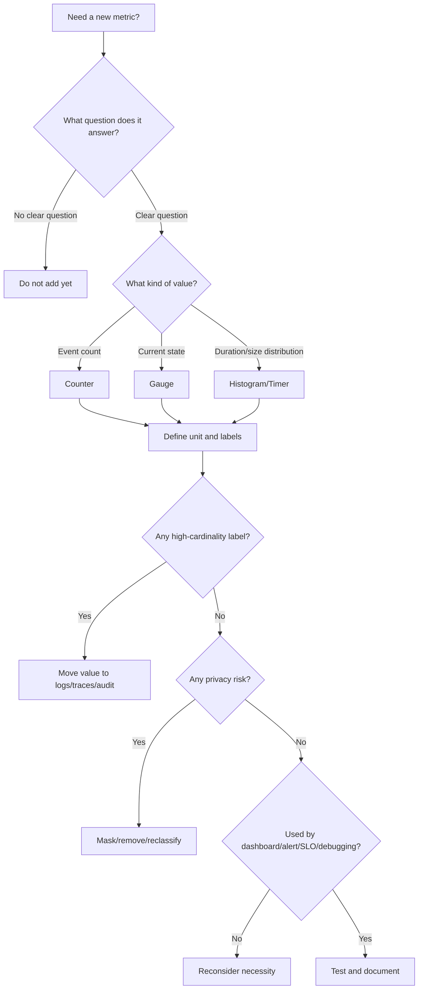

# Metric Design Discipline

Metric design discipline adalah kemampuan merancang metric yang benar, stabil, berguna, murah, dan aman.

Banyak system punya metrics. Lebih sedikit system punya metrics yang bisa dipercaya saat incident.

Metric yang buruk bisa lebih berbahaya daripada tidak ada metric, karena memberi ilusi visibility. Dashboard terlihat ramai, tetapi saat production incident terjadi, engineer tetap tidak bisa menjawab:

- Apa yang rusak?
- Sejak kapan?
- Siapa terdampak?
- Dependency mana yang degrade?
- Apakah deployment terakhir penyebabnya?
- Apakah sistem melanggar SLO?
- Apakah backlog akan pulih sendiri atau makin buruk?

Part ini membahas discipline untuk mendesain metrics di enterprise Java/JAX-RS systems, terutama untuk service yang berinteraksi dengan PostgreSQL, MyBatis/JPA/JDBC, Kafka, RabbitMQ, Redis, Camunda, NGINX, Kubernetes, AWS/Azure, dan deployment hybrid/cloud/on-prem.

---

## 1. Metric Design Starts from a Question

Metric tidak seharusnya dimulai dari:

```text
Apa yang mudah diexpose dari library?
```

Metric harus dimulai dari:

```text
Pertanyaan production apa yang harus bisa kita jawab?
```

Contoh pertanyaan yang baik:

```text
Apakah endpoint submit quote mengalami peningkatan error setelah deployment terakhir?
```

```text
Apakah order fulfillment tertunda karena Kafka consumer lag atau dependency fulfillment API latency?
```

```text
Apakah pricing failure disebabkan catalog missing, rule engine timeout, atau database pool exhaustion?
```

```text
Apakah approval workflow melanggar business SLA karena human task aging atau worker failure?
```

Setelah pertanyaan jelas, baru desain metric.

---

## 2. Metric Design Contract

Setiap metric penting harus punya kontrak.

Kontrak minimal:

```yaml
metric_name: quote.pricing.requests.total
purpose: Count quote pricing attempts by outcome and error category.
owner: quote-api team
unit: requests
type: counter
labels:
  - outcome
  - error_type
  - pricing_mode
cardinality_expectation: low
used_by:
  - service dashboard
  - pricing failure alert
  - business operations dashboard
retention_need: standard operational retention
privacy_classification: no PII, no quote ID
```

Tanpa kontrak, metric mudah berubah menjadi telemetry debt.

---

## 3. Metric Purpose

Purpose menjelaskan alasan metric ada.

Purpose yang buruk:

```text
Track pricing.
```

Purpose yang baik:

```text
Measure quote pricing attempts by outcome so engineers can detect pricing degradation, separate validation failures from dependency failures, and support SLO/error-rate analysis.
```

Purpose harus menjawab:

- Pertanyaan apa yang dijawab?
- Siapa yang akan memakai metric?
- Saat kondisi abnormal, action apa yang diambil?
- Apakah metric dipakai dashboard, alert, SLO, capacity planning, atau business reporting?

Jika tidak ada action atau decision, metric mungkin tidak perlu dibuat.

---

## 4. Metric Owner

Metric owner bertanggung jawab menjaga semantic metric tetap benar.

Owner biasanya bukan platform team semata. Untuk application/business metric, owner harus service/domain team.

Contoh ownership:

| Metric | Owner utama |
|---|---|
| `http.server.request.duration` | service team + platform convention |
| `jdbc.connections.active` | service team + database/platform team |
| `kafka.consumer.lag` | consuming service team |
| `quote.lifecycle.transitions.total` | domain/service team |
| `audit.events.persisted.total` | service team + security/compliance |
| `pod.restart.count` | service/platform team |

Owner harus tahu:

- Definisi metric.
- Label meaning.
- Dashboard dependency.
- Alert dependency.
- Cost/cardinality risk.
- Deprecation plan.

---

## 5. Metric Type Selection

Metric type harus sesuai semantic.

| Pertanyaan | Type yang cocok |
|---|---|
| Berapa kali event terjadi? | Counter |
| Berapa kondisi saat ini? | Gauge |
| Berapa distribusi latency/duration/size? | Histogram/timer |
| Berapa rate per waktu? | Rate dari counter |
| Berapa tail latency? | Histogram percentile |
| Berapa backlog saat ini? | Gauge |
| Berapa processing delay? | Histogram atau gauge tergantung model |

Contoh salah:

```text
quote.active.count as counter
```

Jika quote active bisa naik-turun, gunakan gauge.

Contoh benar:

```text
quote.active.current as gauge
quote.created.total as counter
quote.lifecycle.transition.duration.seconds as histogram
```

---

## 6. Metric Unit Discipline

Unit harus eksplisit dan konsisten.

Buruk:

```text
order_processing_time
```

Lebih baik:

```text
order.processing.duration.seconds
```

Unit yang umum:

```text
seconds
bytes
requests
messages
connections
ratio
percent
items
```

Kesalahan umum:

- Beberapa service emit milliseconds, service lain emit seconds untuk metric serupa.
- Nama metric tidak menyebut unit.
- Dashboard menampilkan unit salah.
- Alert threshold memakai asumsi unit berbeda.
- SLO latency gagal karena unit tidak konsisten.

Metric unit error adalah correctness bug.

---

## 7. Metric Name Discipline

Nama metric harus menjawab:

```text
Apa yang diukur?
```

Bukan:

```text
Bagaimana cara menghitungnya di code?
```

Prinsip naming:

- Gunakan domain yang jelas.
- Gunakan noun yang stabil.
- Gunakan suffix konsisten.
- Jangan memasukkan label value ke nama metric.
- Jangan membuat nama terlalu generic.
- Jangan mencampur metric teknis dan bisnis dalam satu nama.

Contoh buruk:

```text
count
latency
error_count
quote_error_500
process_time
```

Contoh lebih baik:

```text
http.server.requests.total
http.server.request.duration.seconds
quote.pricing.requests.total
quote.pricing.duration.seconds
quote.lifecycle.transitions.total
order.fulfillment.failures.total
```

---

## 8. Labels Are Part of the Metric Contract

Labels bukan dekorasi. Labels menentukan:

- Bagaimana metric difilter.
- Bagaimana metric diagregasi.
- Berapa banyak time series dibuat.
- Apakah metric bisa dipakai dashboard/alert.
- Apakah metric membocorkan data.
- Apakah metric terlalu mahal.

Label harus dirancang lebih ketat daripada nama metric.

Contoh label baik untuk HTTP metric:

```text
service
environment
method
route
status_code
outcome
```

Contoh label berbahaya:

```text
request_id
user_id
quote_id
order_id
raw_path
email
customer_name
error_message
sql
```

---

## 9. Label Cardinality Budget

Setiap metric harus punya cardinality budget.

Contoh estimasi:

```text
service: 1
route: 80
method: 6
status_code: 12
environment: 3
```

Total kemungkinan:

```text
1 x 80 x 6 x 12 x 3 = 17,280 series
```

Untuk satu metric family, ini mungkin masih bisa diterima tergantung backend dan retention.

Jika tambah `tenant_id` dengan 10,000 nilai:

```text
17,280 x 10,000 = 172,800,000 series
```

Ini biasanya tidak bisa diterima.

Cardinality budget harus dipikirkan sebelum PR merge.

---

## 10. Low-Cardinality Labels

Low-cardinality labels punya jumlah nilai terbatas dan stabil.

Contoh:

```text
environment = prod | staging | dev
method = GET | POST | PUT | PATCH | DELETE
outcome = success | failure
error_type = validation | auth | dependency | timeout | system
region = ap-southeast-1 | eastus | ...
dependency = postgres | redis | kafka | rabbitmq | catalog-api
```

Low-cardinality bukan berarti selalu aman. Label tetap harus punya purpose.

Contoh label `region` aman jika service memang multi-region. Jika tidak, label itu hanya noise.

---

## 11. High-Cardinality Labels

High-cardinality labels punya banyak nilai unik atau tidak terbatas.

Contoh:

```text
request_id
trace_id
span_id
user_id
session_id
quote_id
order_id
message_id
event_id
raw_path
email
customer_name
error_message
sql_statement
exception_message
```

Sebagian nilai ini penting untuk debugging, tetapi tempatnya biasanya di:

- Logs.
- Traces.
- Audit logs.
- Event payload inspection.

Bukan metric labels.

Rule praktis:

> Jika value hampir selalu berbeda per request, jangan jadikan label metric.

---

## 12. Business Dimension vs Business ID

Business dimension berbeda dari business ID.

Aman sebagai dimension:

```text
quote_type = new | amendment | renewal
order_type = new_install | modify | cancel
customer_segment = enterprise | mid_market | smb
channel = api | ui | batch
pricing_mode = automatic | manual_override
```

Berbahaya sebagai metric label:

```text
quote_id = QUO-123
order_id = ORD-456
customer_id = CUST-789
account_id = ACC-999
```

Business dimension membantu agregasi.
Business ID membantu investigasi individual.

Gunakan metric untuk agregasi. Gunakan log/trace/audit untuk individual entity.

---

## 13. Technical Dimension

Technical dimension membantu memecah health sistem.

Contoh:

```text
service
environment
region
cluster
namespace
pod
version
endpoint route
method
status_code
dependency
operation
consumer_group
topic
queue
cache_name
```

Risiko technical dimension:

- `pod` bisa menambah cardinality, tetapi sering diperlukan untuk debugging rollout/resource issue.
- `version` berguna untuk release debugging, tetapi bisa menambah series jika deployment sangat sering.
- `topic` aman jika jumlah topic terkendali.
- `queue` aman jika queue topology terkendali.
- `operation` aman jika enum dikontrol.

Technical labels harus dikendalikan oleh convention.

---

## 14. Aggregation Safety

Metric harus bisa diagregasi tanpa mengubah makna.

Contoh aman:

```text
sum(rate(http.server.requests.total{service="quote-api"}[5m])) by (route, status_code)
```

Contoh raw average yang berbahaya:

```text
avg(http.server.request.duration.avg) across pods
```

Average dari average bisa misleading jika traffic antar pod tidak sama.

Histogram lebih baik untuk global percentile jika backend mendukung agregasi bucket.

Pertanyaan aggregation safety:

- Apakah metric bisa di-sum?
- Apakah metric bisa di-average?
- Apakah percentile bisa diagregasi antar instance?
- Apakah label cukup untuk drilldown tanpa terlalu granular?
- Apakah business metric double-count akibat retry atau duplicate event?

---

## 15. Counter Aggregation

Counter biasanya diagregasi dengan rate/increase.

Contoh mental query:

```text
sum(rate(http.server.requests.total[5m])) by (route, status_code)
```

Yang ingin dicari:

- Request rate per route.
- Error rate per status.
- Retry rate per dependency.
- Message consumption rate per consumer group.

Jangan membandingkan raw counter antar service tanpa rate/time window.

---

## 16. Gauge Aggregation

Gauge harus diagregasi sesuai makna.

Contoh:

```text
sum(jdbc.connections.active) by (service)
```

Masuk akal untuk total active connections across pods.

```text
avg(jvm.memory.used) by (service)
```

Bisa misleading jika ingin tahu pod yang hampir OOM. Gunakan max atau per-pod view.

Untuk saturation, sering gunakan:

```text
max
p95
per-pod panel
```

bukan hanya average.

---

## 17. Histogram Aggregation

Histogram cocok untuk latency SLO jika bucket konsisten.

Contoh penggunaan:

- p95 request latency per route.
- p99 dependency latency per downstream.
- Percentage request under SLO threshold.
- Distribution of message processing duration.

Bucket harus sama antar instance agar bisa diagregasi.

Jika setiap service memilih bucket sendiri, dashboard platform sulit dibuat.

---

## 18. Metric Retention

Retention harus sesuai use case.

| Use case | Retention need |
|---|---|
| Live incident | minutes to days |
| Weekly trend | weeks |
| Capacity planning | months |
| SLO reporting | SLO window, often 28/30/90 days depending internal policy |
| Audit/compliance metric | depends on policy |
| Business KPI | longer, often warehouse/reporting path |

Operational metrics dan business reporting metrics kadang perlu storage berbeda.

Jangan memaksa high-volume operational metrics menjadi long-retention business warehouse tanpa desain.

---

## 19. Metric Cost Model

Cost metric dipengaruhi oleh:

```text
number of metric names
x label combinations
x scrape frequency
x retention duration
x histogram buckets
x replicas/pods
x environments
```

Cost bukan hanya storage.

Cost juga mencakup:

- Ingestion.
- Query execution.
- Dashboard rendering.
- Alert evaluation.
- Backend memory/index.
- Engineer time akibat noise.

Metric design harus memasukkan cost sebagai first-class concern.

---

## 20. Metric Privacy Model

Metric bisa dianggap aman karena numerik, tetapi label dapat membocorkan informasi.

Contoh leakage:

```text
login.failures.total{email="user@example.com"}
api.requests.total{authorization_header="Bearer ..."}
quote.errors.total{customer_name="Confidential Deal"}
sql.query.duration{statement="select * from customer where email='...'"}
```

Metric privacy rules:

- Jangan label PII.
- Jangan label secrets/tokens.
- Jangan label raw path.
- Jangan label raw SQL.
- Jangan label raw error message.
- Jangan label business entity ID tanpa policy.
- Jangan label tenant ID tanpa cardinality dan privacy decision.

---

## 21. Outcome Label Design

`outcome` adalah label berguna jika distandardisasi.

Contoh:

```text
outcome="success"
outcome="failure"
```

Atau lebih detail:

```text
outcome="success"
outcome="client_error"
outcome="server_error"
outcome="timeout"
outcome="cancelled"
```

Jangan terlalu detail hingga menjadi error-message replacement.

Baik:

```text
error_type="dependency_timeout"
```

Buruk:

```text
error_type="Pricing failed because offer ABCD-123 was not found for tenant XYZ"
```

---

## 22. Error Type Label Design

`error_type` harus berupa kategori stabil.

Contoh baik:

```text
validation_error
authentication_error
authorization_error
dependency_timeout
dependency_5xx
database_error
optimistic_lock_conflict
invalid_state_transition
rate_limited
serialization_error
unknown_error
```

Contoh buruk:

```text
NullPointerException at line 217
Connection refused to host 10.10.2.17
Quote QUO-123 cannot transition from APPROVED to DRAFT
```

Detail spesifik masuk log/trace, bukan metric label.

---

## 23. Status Code Labels

HTTP status code label biasanya aman karena bounded.

Contoh:

```text
status_code="200"
status_code="201"
status_code="400"
status_code="409"
status_code="500"
status_code="503"
```

Kadang juga berguna membuat grouped status:

```text
status_class="2xx"
status_class="4xx"
status_class="5xx"
```

Status code membantu membedakan:

- Client error.
- Validation issue.
- Conflict/idempotency issue.
- Server error.
- Dependency failure.

Tetapi status code saja tidak cukup. Tambahkan `error_type` untuk application/domain failure jika perlu.

---

## 24. Route Label Design

Gunakan route template.

Baik:

```text
route="/quotes/{quoteId}/submit"
route="/orders/{orderId}/cancel"
```

Buruk:

```text
path="/quotes/QUO-123/submit"
path="/orders/ORD-999/cancel"
```

Untuk JAX-RS, route template bisa tricky jika framework instrumentation tidak otomatis tahu final matched resource method.

Internal verification:

- Apakah metric memakai raw URI?
- Apakah route template tersedia di request end?
- Apakah sub-resource locator mempengaruhi route name?
- Apakah exception sebelum route matching memiliki label fallback aman?

Fallback route harus bounded, misalnya:

```text
route="UNKNOWN"
route="NOT_FOUND"
```

bukan raw path.

---

## 25. Dependency Label Design

Untuk outbound calls, label dependency harus stabil.

Baik:

```text
dependency="catalog-api"
dependency="pricing-engine"
dependency="postgres-primary"
dependency="redis-cache"
dependency="kafka-order-events"
```

Berbahaya:

```text
dependency="https://catalog-api.prod.svc.cluster.local/offers/123"
dependency="10.20.1.13:5432"
```

Detail host/URL mungkin berguna di trace/log, tetapi metric label harus mengarah ke dependency logical name.

---

## 26. Metric Design for PostgreSQL/JDBC/MyBatis/JPA

Pertanyaan utama:

- Apakah pool penuh?
- Apakah query latency naik?
- Apakah transaction terlalu lama?
- Apakah lock wait/deadlock terjadi?
- Apakah ORM/MyBatis menghasilkan query terlalu banyak?

Metric candidates:

```text
jdbc.connections.active
jdbc.connections.idle
jdbc.connections.pending
jdbc.connections.max
jdbc.connection.acquire.duration.seconds
database.query.duration.seconds
database.transactions.active
database.transaction.duration.seconds
database.deadlocks.total
database.lock_wait.duration.seconds
```

Label aman:

```text
datasource
operation
statement_type
outcome
error_type
```

Label berbahaya:

```text
raw_sql
sql_parameters
customer_id
quote_id
order_id
```

SQL detail harus disanitasi dan biasanya lebih cocok di trace/log terbatas.

---

## 27. Metric Design for Kafka/RabbitMQ

Pertanyaan utama:

- Apakah producer publish berhasil?
- Apakah consumer tertinggal?
- Apakah queue depth naik?
- Apakah retry/DLQ meningkat?
- Apakah message processing latency memburuk?
- Apakah event age melewati batas freshness?

Metric candidates:

```text
messaging.messages.published.total
messaging.messages.consumed.total
messaging.message.processing.duration.seconds
messaging.message.age.seconds
kafka.consumer.lag
rabbitmq.queue.depth
rabbitmq.messages.unacked
messaging.retries.total
messaging.dlq.messages.total
```

Label aman:

```text
broker
topic
queue
consumer_group
message_type
outcome
error_type
```

Label berbahaya:

```text
message_id
event_id
message_key raw
payload field
order_id
quote_id
```

---

## 28. Metric Design for Redis

Pertanyaan utama:

- Apakah cache efektif?
- Apakah Redis latency naik?
- Apakah eviction terjadi?
- Apakah memory hampir penuh?
- Apakah lock/idempotency/rate limiter bekerja?

Metric candidates:

```text
redis.commands.total
redis.command.duration.seconds
redis.cache.hits.total
redis.cache.misses.total
redis.cache.hit.ratio
redis.memory.used.bytes
redis.evictions.total
redis.connected_clients
redis.blocked_clients
redis.stream.pending_entries
```

Label aman:

```text
cache_name
command
operation
outcome
```

Label berbahaya:

```text
redis_key
session_id
token
user_id
quote_id
order_id
```

Redis keys sering mengandung business IDs atau sensitive values. Jangan jadikan label.

---

## 29. Metric Design for Camunda/Workflow

Pertanyaan utama:

- Berapa process aktif?
- Berapa failed jobs?
- Berapa incident?
- Task mana aging?
- Apakah timer backlog?
- Apakah message correlation gagal?
- Apakah workflow completion melewati SLA?

Metric candidates:

```text
workflow.process.instances.active
workflow.process.instances.completed.total
workflow.incidents.total
workflow.failed_jobs.total
workflow.task.age.seconds
workflow.timer.backlog
workflow.message_correlation.failures.total
workflow.completion.duration.seconds
```

Label aman:

```text
process_definition
activity_type
job_type
outcome
error_type
priority
```

Label berbahaya:

```text
process_instance_id
business_key raw
customer_id
order_id
quote_id
variable_value
```

Business key untuk debugging individual lebih cocok di logs/audit/traces.

---

## 30. Metric Design for Kubernetes

Pertanyaan utama:

- Apakah pod restart?
- Apakah container OOMKilled?
- Apakah CPU throttling?
- Apakah readiness/liveness gagal?
- Apakah HPA scaling cukup?
- Apakah node pressure?

Metric candidates:

```text
kube_pod_container_status_restarts_total
container_cpu_usage_seconds_total
container_cpu_cfs_throttled_seconds_total
container_memory_working_set_bytes
kube_pod_status_phase
kube_deployment_status_replicas_available
kube_horizontalpodautoscaler_status_current_replicas
kube_event_count
```

Labels yang umum:

```text
namespace
pod
container
deployment
node
cluster
environment
```

Pod label memang cardinality lebih tinggi, tetapi penting untuk Kubernetes debugging. Governance-nya berbeda dari application business labels.

---

## 31. Metric Design for Cloud AWS/Azure

Pertanyaan utama:

- Apakah managed service degrade?
- Apakah load balancer 5xx naik?
- Apakah APIM/API Gateway throttling?
- Apakah database managed service resource saturated?
- Apakah broker managed service queue/lag naik?
- Apakah cloud provider service health bermasalah?

Metric candidates bergantung cloud/platform internal.

Internal verification required:

- CloudWatch metrics/logs/alarms jika AWS.
- Azure Monitor/Log Analytics/Application Insights jika Azure.
- Load balancer metrics.
- APIM/API Gateway metrics.
- Managed database metrics.
- Managed broker metrics.
- WAF/private endpoint logs.
- Cloud audit logs.

Jangan mengarang cloud stack internal. Verifikasi deployment environment aktual.

---

## 32. Business Metrics vs Operational Metrics

Business metrics dan operational metrics sering mirip tetapi punya tujuan berbeda.

Operational metric:

```text
quote.pricing.requests.total{outcome="failure", error_type="dependency_timeout"}
```

Dipakai untuk incident/debugging.

Business metric:

```text
quotes.approved.total
orders.completed.total
orders.fallout.total
approval.tasks.overdue.current
```

Dipakai untuk business operations dan lifecycle monitoring.

Risiko:

- Business metric double-count karena retry.
- Operational metric dipakai sebagai KPI tanpa semantic yang benar.
- Business dashboard memakai event stream yang belum deduplicated.
- Metric tidak cocok untuk financial/commercial reporting.

Untuk KPI bisnis resmi, sering perlu pipeline data/reporting yang lebih ketat daripada runtime metric.

---

## 33. Metric and Idempotency

Dalam event-driven systems, metric bisa salah akibat duplicate processing.

Contoh:

```text
order.created.total incremented setiap message diterima
```

Jika message redelivered, metric naik dua kali.

Lebih benar:

- Counter processing attempts.
- Counter business accepted events.
- Counter duplicate ignored events.

Contoh:

```text
order.event.processing.attempts.total
order.event.accepted.total
order.event.duplicates.total
```

Metric harus membedakan attempt vs committed business effect.

---

## 34. Metric and Retry

Retry bisa membuat metric menipu.

Contoh:

```text
payment.call.success.total = 1000
```

Tampak sehat, tetapi jika retry count tinggi, user latency dan dependency pressure buruk.

Tambahkan:

```text
dependency.call.attempts.total
dependency.call.retries.total
dependency.call.final_failures.total
dependency.call.duration.seconds
```

Dengan ini engineer bisa melihat:

- First-attempt failure.
- Retry amplification.
- Final outcome.
- Latency impact.

---

## 35. Metric and SLO Design

SLO membutuhkan metric yang memenuhi beberapa syarat:

- Numerator dan denominator jelas.
- Unit jelas.
- Time window jelas.
- Labels tidak mengubah semantic.
- Exclusion rule jelas.
- Error classification jelas.
- Histogram bucket mendukung threshold.
- Data retention cukup untuk SLO window.

Contoh availability SLI:

```text
successful_valid_requests / total_valid_requests
```

Butuh definisi:

- Apakah 4xx dihitung failure?
- Apakah validation error dihitung failure?
- Apakah client cancellation dihitung?
- Apakah health check traffic dikeluarkan?
- Apakah retry dihitung sebagai request baru?

Metric design harus menjawab ini sebelum alert burn rate dibuat.

---

## 36. Metric and Alert Design

Metric yang dipakai alert harus lebih ketat daripada metric eksplorasi.

Alert metric harus:

- Stabil.
- Low noise.
- Actionable.
- Punya owner.
- Punya runbook.
- Tidak terlalu sensitif terhadap traffic rendah.
- Tidak menggunakan label high-cardinality.
- Tidak bergantung pada metric yang sering hilang.

Contoh alert buruk:

```text
Alert jika ada satu HTTP 500.
```

Contoh lebih baik:

```text
Alert jika 5xx error rate untuk valid traffic > threshold selama window tertentu dan burn rate melewati batas.
```

---

## 37. Metric and Dashboard Design

Metric dashboard harus menjawab pertanyaan.

Service dashboard:

- Traffic.
- Error rate.
- Latency percentile.
- Saturation.
- Dependency health.
- Deployment version.

Dependency dashboard:

- DB pool.
- Query latency.
- Redis latency/hit ratio.
- Kafka/RabbitMQ lag/depth.
- Downstream error/latency.

Business dashboard:

- Quote lifecycle.
- Order lifecycle.
- Approval aging.
- Fallout count.
- Stuck state.

Dashboard tanpa metric design discipline akan menjadi wall of charts.

---

## 38. Metric and Logs/Traces Relationship

Metric memberi indikasi masalah.

Logs dan traces memberi detail.

Contoh flow debugging:

```text
Metric: p95 latency endpoint /quotes/{id}/submit naik
Trace: latency dominan di catalog-api call
Log: dependency timeout dengan correlation ID tertentu
Metric: catalog-api 5xx naik setelah deployment
Audit/event: quote submission affected for specific business transactions
```

Metric design harus memastikan drilldown memungkinkan:

- Dari dashboard ke trace.
- Dari alert ke dashboard.
- Dari trace ke logs.
- Dari business metric ke audit/event evidence.

---

## 39. Metric Versioning and Deprecation

Metric bisa berubah. Perubahan semantic harus dikelola.

Perubahan berbahaya:

- Mengubah unit tanpa rename.
- Mengubah label meaning.
- Menghapus label yang dipakai alert.
- Mengubah route naming.
- Mengubah error_type taxonomy.
- Mengganti histogram bucket tanpa koordinasi.
- Menghapus metric yang dipakai SLO.

Prinsip:

- Jangan silently change semantic.
- Tambah metric baru jika perubahan breaking.
- Deprecate dengan periode transisi.
- Update dashboard/alert/runbook.
- Dokumentasikan di release note/ADR jika penting.

---

## 40. Metric Testing

Metric perlu diuji.

Test ideas:

- Counter increment saat success.
- Counter increment saat expected failure.
- Error type label benar.
- Timer tetap stop saat exception.
- Route template label benar.
- No raw ID in labels.
- Audit/business metric tidak double-count duplicate event.
- OTel/Micrometer registry menerima metric.
- Integration test memastikan metric muncul di endpoint.

Pseudo-test:

```java
@Test
void shouldRecordPricingFailureMetricWithoutQuoteIdLabel() {
    assertThrows(PricingException.class, () -> service.priceQuote(testQuote));

    Counter counter = meterRegistry.find("quote.pricing.requests.total")
        .tag("outcome", "failure")
        .tag("error_type", "pricing_error")
        .counter();

    assertThat(counter.count()).isEqualTo(1.0);

    assertThat(meterRegistry.getMeters())
        .noneMatch(meter -> meter.getId().getTags().stream()
            .anyMatch(tag -> tag.getKey().equals("quote_id")));
}
```

---

## 41. Metric Design Review Template

Gunakan template ini sebelum menambah metric baru.

```yaml
metric_name:
metric_type:
unit:
purpose:
owner:
primary_question:
used_for:
  - dashboard
  - alert
  - SLO
  - debugging
  - capacity
  - business monitoring
labels:
  - name:
    allowed_values:
    cardinality_estimate:
    privacy_risk:
aggregation:
  sum_safe:
  avg_safe:
  percentile_safe:
retention_need:
expected_volume:
cardinality_risk:
privacy_classification:
failure_paths_covered:
tests:
dashboard_link:
alert_link:
runbook_link:
internal_notes:
```

---

## 42. Example: Designing HTTP Request Metrics

Question:

```text
Can we detect endpoint-level latency and error degradation after deployment?
```

Metric:

```text
http.server.requests.total
http.server.request.duration.seconds
```

Labels:

```text
service
environment
method
route
status_code
outcome
version
```

Avoid:

```text
request_id
trace_id
user_id
raw_path
query_string
```

Dashboard:

- Request rate by route.
- Error rate by route/status.
- p95/p99 latency by route.
- Comparison by version/deployment.

Alert:

- High 5xx rate for valid traffic.
- SLO burn rate.
- Latency SLO breach.

Internal verification:

- Route template available.
- Exception path emits status/outcome.
- Version label propagated.
- Health check traffic excluded or separately labeled.

---

## 43. Example: Designing Quote Pricing Metrics

Question:

```text
Can we detect pricing degradation and separate domain failures from dependency failures?
```

Metrics:

```text
quote.pricing.requests.total
quote.pricing.duration.seconds
quote.pricing.failures.total
```

Labels:

```text
outcome = success | failure
error_type = validation | catalog_missing | rule_timeout | database_error | unknown
pricing_mode = automatic | manual_override
channel = api | ui | batch
```

Avoid:

```text
quote_id
customer_id
user_id
raw_error_message
```

Additional signals:

- Logs include quote ID if allowed.
- Trace includes pricing span and dependency spans.
- Audit records business decision where applicable.

---

## 44. Example: Designing Order Workflow Metrics

Question:

```text
Can we detect stuck orders, workflow aging, and SLA breach before customer escalation?
```

Metrics:

```text
order.lifecycle.transitions.total
order.state.age.seconds
order.workflow.completion.duration.seconds
order.fallout.created.total
approval.task.age.seconds
```

Labels:

```text
from_state
to_state
order_type
channel
outcome
fallout_type
priority
```

Avoid:

```text
order_id
process_instance_id
customer_name
raw_variable_value
```

Important distinction:

- `transitions.total` measures movement.
- `state.age.seconds` measures stuck/aging risk.
- `completion.duration.seconds` measures end-to-end workflow time.

---

## 45. Internal Verification Checklist

### Metric standards

- Apakah ada internal naming convention?
- Apakah ada label/tag standard?
- Apakah ada banned labels?
- Apakah ada unit convention?
- Apakah ada histogram bucket standard?
- Apakah ada metric owner policy?

### Application code

- Metric library apa yang digunakan?
- Apakah metric manual punya purpose jelas?
- Apakah success dan failure path tercakup?
- Apakah exception path tetap menghentikan timer?
- Apakah metric names konsisten antar service?
- Apakah label values berasal dari enum/bounded source?

### Java/JAX-RS

- Apakah HTTP metrics memakai route template?
- Apakah status code/outcome benar saat ExceptionMapper dipakai?
- Apakah async request dan streaming response tercatat benar?
- Apakah health check traffic dipisahkan?
- Apakah version/deployment labels tersedia?

### PostgreSQL/JDBC/MyBatis/JPA

- Apakah pool metrics tersedia?
- Apakah query duration metric tersedia?
- Apakah raw SQL tidak menjadi label?
- Apakah operation label bounded?
- Apakah transaction duration terlihat?

### Kafka/RabbitMQ

- Apakah producer/consumer metrics tersedia?
- Apakah lag/depth metric tersedia?
- Apakah retry/DLQ metrics tersedia?
- Apakah message type label bounded?
- Apakah message ID/key tidak menjadi label?

### Redis

- Apakah cache hit/miss metric tersedia?
- Apakah Redis key tidak menjadi label?
- Apakah command latency tersedia?
- Apakah lock/rate-limit/idempotency metric memiliki label aman?

### Camunda/workflow

- Apakah process/workflow metric tersedia?
- Apakah process instance ID tidak menjadi label?
- Apakah task aging dan failed jobs terlihat?
- Apakah SLA workflow bisa dihitung?

### Dashboard/alert/SLO

- Apakah metric baru dipakai di dashboard?
- Apakah metric baru dipakai alert?
- Apakah metric baru mempengaruhi SLO?
- Apakah runbook menjelaskan metric abnormal?
- Apakah alert threshold memakai unit yang benar?

### Cost/privacy

- Apakah cardinality diestimasi?
- Apakah ada PII/secrets/business ID di label?
- Apakah retention sesuai kebutuhan?
- Apakah histogram bucket count wajar?
- Apakah scrape interval wajar?

---

## 46. PR Review Checklist

Saat PR menambah/mengubah metric, review dengan pertanyaan berikut:

1. Apa pertanyaan production yang dijawab?
2. Siapa owner metric?
3. Apakah tipe metric benar?
4. Apakah unit eksplisit dan konsisten?
5. Apakah nama sesuai convention?
6. Apakah labels bounded dan low-cardinality?
7. Apakah ada label yang mengandung PII, token, raw path, ID unik, SQL, atau error message?
8. Apakah cardinality sudah diestimasi?
9. Apakah metric aman diagregasi?
10. Apakah success path tercatat?
11. Apakah failure path tercatat?
12. Apakah retry/duplicate/idempotency semantic jelas?
13. Apakah histogram bucket sesuai SLO?
14. Apakah metric dipakai dashboard/alert/SLO/runbook?
15. Apakah cost impact masuk akal?
16. Apakah perubahan breaking terhadap dashboard/alert existing?
17. Apakah ada test atau local verification?
18. Apakah perlu ADR jika metric menjadi standard lintas service?

---

## 47. Failure Modes in Metric Design

| Failure mode | Dampak | Pencegahan |
|---|---|---|
| Wrong metric type | Alert/dashboard salah | Type review |
| Unit ambiguity | Threshold salah | Unit convention |
| High-cardinality labels | Cost/backpressure | Label governance |
| Raw path label | Cardinality + privacy leak | Route template |
| ID label | Series explosion | Use logs/traces |
| Error message label | Infinite values | Error taxonomy |
| Success-only metric | Failure blind spot | Failure path test |
| Retry double-count | Business metric salah | Attempts vs committed effect |
| Average-only latency | Tail latency hidden | Histogram/p95/p99 |
| No owner | Telemetry debt | Ownership metadata |
| No dashboard usage | Dead metric | Usage review |
| Silent semantic change | Broken alert/SLO | Version/deprecate |

---

## 48. Senior Engineer Heuristics

Gunakan heuristik ini saat mendesain metric:

1. Metrics are for aggregation; logs/traces/audit are for individual evidence.
2. Every metric should answer a production question.
3. Every important metric needs an owner.
4. Unit ambiguity is a bug.
5. Labels are the dangerous part.
6. Route template is acceptable; raw path is not.
7. Error type should be taxonomy, not message.
8. Retry metrics must distinguish attempt and final outcome.
9. Business metrics must handle duplicate events.
10. Histograms should be aligned with SLO thresholds.
11. Average latency is not enough.
12. Metric cost is a design constraint.
13. Privacy applies to labels, not only log bodies.
14. Metric semantic changes require migration.
15. A metric that cannot drive dashboard, alert, SLO, or debugging is suspect.

---

## 49. Compact Metric Design Decision Tree



---

## 50. Final Takeaways

Metric design discipline is the difference between having charts and having operational truth.

A senior engineer should be able to look at a metric and ask:

- Is this semantically correct?
- Can this be aggregated safely?
- Will this explode cardinality?
- Does this leak sensitive information?
- Does this support dashboard, alert, SLO, or debugging?
- Does this distinguish success, failure, retry, duplicate, and final business effect?
- Does this help during incident, or only make the system look instrumented?

Good metrics reduce incident confusion.
Bad metrics add noise, cost, and false confidence.

---

## 51. Where This Leads Next

Part berikutnya membahas **RED, USE, and Golden Signals**.

Setelah memahami metric type dan design discipline, kita akan memakai framework operasional untuk menentukan metric minimum yang harus ada pada service, dependency, runtime, dan platform.
