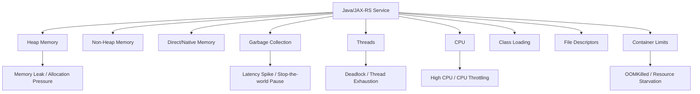
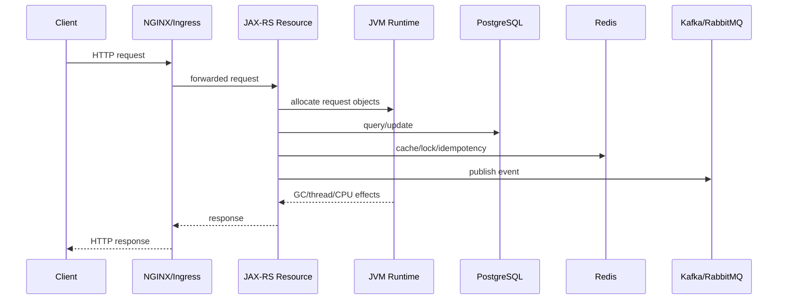

# JVM Metrics

JVM metrics menjelaskan kondisi runtime tempat aplikasi Java berjalan.

Untuk service Java/JAX-RS, banyak incident yang terlihat seperti masalah aplikasi sebenarnya berasal dari runtime pressure:

- Heap penuh.
- GC pause tinggi.
- Direct memory bocor.
- Thread pool saturated.
- Deadlock.
- CPU throttling di container.
- Memory limit Kubernetes terlalu kecil.
- Allocation rate naik setelah deployment.
- Class loading/metaspace growth tidak normal.
- File descriptor atau native memory habis.

Target mental model:

```text
Can the JVM explain whether the service is slow, failing, or unstable because of runtime pressure?
```

JVM metric bukan pengganti application metric.

JVM metric menjawab:

```text
Is the runtime healthy enough to serve traffic?
```

Application metric menjawab:

```text
Is the service behavior healthy for users and business flows?
```

Keduanya harus dibaca bersama.

---

## 1. Why JVM Metrics Matter

Java service bisa terlihat sehat dari luar sampai tiba-tiba latency naik, pod restart, atau request timeout.

Tanpa JVM metrics, engineer sering hanya melihat gejala:

- HTTP 504 dari gateway.
- Request latency naik.
- Consumer lag naik.
- Pod restart.
- Thread dump sulit diambil karena service sudah mati.
- Log berhenti sebelum error jelas muncul.

JVM metrics memberi bukti runtime sebelum service gagal total.

Contoh pertanyaan production:

- Apakah heap usage naik terus?
- Apakah GC pause menyebabkan latency spike?
- Apakah allocation rate naik setelah release?
- Apakah thread count melonjak karena leak?
- Apakah request blocked menunggu connection pool?
- Apakah CPU usage tinggi karena actual work atau karena throttling?
- Apakah container memory limit terlalu dekat dengan JVM max heap?
- Apakah pod mati karena OOMKilled atau JVM OutOfMemoryError?

Untuk CPQ/order management, runtime pressure bisa berdampak langsung ke:

- Pricing latency.
- Quote validation timeout.
- Approval action lambat.
- Order submission gagal.
- Consumer processing tertunda.
- Camunda worker timeout.
- Reconciliation job tidak selesai.

---

## 2. JVM Metrics in the Observability Stack

JVM metrics biasanya dikumpulkan melalui:

- Micrometer.
- MicroProfile Metrics.
- Prometheus Java client.
- OpenTelemetry Java agent.
- JMX exporter.
- Vendor agent.
- Application server metric integration.
- Cloud/container runtime integration.

Contoh signal:

```text
jvm.memory.used
jvm.memory.max
jvm.gc.pause
jvm.gc.memory.allocated
jvm.threads.live
jvm.threads.daemon
jvm.threads.states
jvm.classes.loaded
process.cpu.usage
system.cpu.usage
process.files.open
```

Nama metric bisa berbeda antar framework.

Yang penting bukan nama spesifiknya, tetapi semantics:

- Apa yang diukur?
- Unit apa?
- Dimensi apa?
- Aggregation-nya benar?
- Apakah bisa dibandingkan dengan container limit?
- Apakah bisa dikorelasikan dengan deployment, log, trace, dan dashboard service?

---

## 3. Runtime Signal Map

JVM health bisa dipetakan seperti ini:



Dalam incident, jangan membaca JVM metrics secara terpisah.

Selalu korelasikan dengan:

- Request rate.
- Error rate.
- Request latency.
- Dependency latency.
- Queue lag.
- Pod restart.
- Deployment marker.
- Log error.
- Trace latency breakdown.

---

## 4. Heap Usage

Heap adalah area memory utama untuk object Java.

Metric penting:

- Heap used.
- Heap committed.
- Heap max.
- Heap usage percentage.
- Old generation usage.
- Eden/survivor usage, jika tersedia.

Pertanyaan debugging:

- Apakah heap used naik terus setelah GC?
- Apakah old generation tidak turun setelah full GC?
- Apakah heap max terlalu kecil untuk workload?
- Apakah traffic spike menyebabkan allocation pressure?
- Apakah deployment baru membuat object allocation naik?

Pola umum:

```text
Healthy-ish:
heap naik -> GC -> heap turun -> naik lagi

Leak suspicion:
heap naik -> GC -> heap tidak turun signifikan -> naik lagi -> OOM

Pressure suspicion:
heap naik cepat -> GC sering -> pause naik -> latency naik
```

---

## 5. Heap Usage Failure Modes

Failure mode heap:

- Memory leak.
- Object retention terlalu lama.
- Cache tanpa bound.
- Large response/object graph.
- ORM loading terlalu banyak entity.
- Batch job memuat semua data ke memory.
- JSON serialization/deserialization besar.
- Unbounded queue.
- In-memory aggregation berlebihan.
- Retry buffer tidak dibatasi.

Dalam Java/JAX-RS:

- Request besar bisa menghasilkan object graph besar.
- Response serialization bisa meningkatkan allocation.
- Exception stack trace massal bisa meningkatkan memory/log pressure.
- Request body logging bisa menggandakan memory usage.

Dalam CPQ/order system:

- Pricing calculation bisa membuat intermediate object besar.
- Product catalog expansion bisa berat.
- Order decomposition bisa menghasilkan graph besar.
- Reconciliation job bisa memuat batch terlalu besar.

---

## 6. Heap Debugging Checklist

Saat heap terlihat bermasalah:

1. Cek deployment marker.
2. Cek traffic/request rate.
3. Cek endpoint latency dan payload size.
4. Cek old generation after GC.
5. Cek GC frequency dan pause.
6. Cek error `OutOfMemoryError` di log.
7. Cek pod restart dan OOMKilled event.
8. Cek batch job yang berjalan.
9. Cek cache size dan eviction behavior.
10. Cek heap dump policy sebelum mengambil dump.

Jangan langsung menaikkan heap tanpa memahami pattern.

Menaikkan heap bisa:

- Menunda OOM.
- Memperpanjang GC pause.
- Menutup memory leak sementara.
- Memperbesar blast radius saat full GC.
- Membuat container memory pressure lebih buruk.

---

## 7. Non-Heap Memory

Non-heap mencakup memory yang tidak berada di heap utama.

Area penting:

- Metaspace.
- Code cache.
- Compressed class space.
- JVM internal structures.

Metric penting:

- Non-heap used.
- Non-heap committed.
- Metaspace used.
- Metaspace max, jika dibatasi.
- Code cache usage.

Failure mode:

- Classloader leak.
- Dynamic proxy/class generation berlebihan.
- Hot reload/dev tooling accidentally active.
- Banyak deployment dalam app server dengan classloader tidak dibersihkan.
- Framework menghasilkan class terlalu banyak.

Dalam microservice containerized Java, metaspace issue lebih jarang daripada heap issue, tetapi tetap penting untuk service yang:

- Menggunakan banyak reflection.
- Memuat banyak plugin/module.
- Menggunakan dynamic proxy-heavy framework.
- Berjalan di application server shared runtime.

---

## 8. Metaspace Observability

Metaspace naik terus bisa mengindikasikan classloader retention.

Tanda-tanda:

- `jvm.memory.used{area="nonheap",id="Metaspace"}` naik terus.
- Class loaded count naik terus.
- Class unloaded count rendah.
- Memory tidak turun setelah workload selesai.
- Service restart menyelesaikan masalah sementara.

Pertanyaan internal:

- Apakah service berjalan sebagai fat jar, WAR di app server, atau runtime lain?
- Apakah ada dynamic scripting/rules engine?
- Apakah ada plugin mechanism?
- Apakah ada bytecode generation heavy usage?
- Apakah deployment model bisa menyebabkan classloader leak?

---

## 9. Direct Memory and Native Memory

Direct memory digunakan oleh buffer off-heap, networking, NIO, compression, dan beberapa client library.

Metric direct memory kadang tidak sejelas heap.

Sumber pressure:

- Netty/direct buffer.
- HTTP client connection buffers.
- Kafka client buffers.
- PostgreSQL driver/native buffer behavior.
- Compression/decompression.
- Large file or stream handling.
- TLS/native library overhead.

Failure mode:

```text
java.lang.OutOfMemoryError: Direct buffer memory
```

Atau container OOMKilled tanpa heap terlihat penuh.

Ini penting: pod bisa OOMKilled walaupun heap usage terlihat aman, karena container memory mencakup:

- Heap.
- Metaspace.
- Direct memory.
- Thread stacks.
- Native memory.
- Code cache.
- JVM overhead.
- OS/process overhead.

---

## 10. Container Memory vs JVM Memory

Dalam Kubernetes, memory limit bukan hanya heap.

Contoh salah kaprah:

```text
container memory limit = 1024Mi
-Xmx = 1024m
```

Ini berbahaya karena JVM masih butuh memory untuk non-heap, thread stack, direct memory, native memory, dan runtime overhead.

Lebih aman:

```text
container memory limit > heap max + non-heap + direct memory + thread stack + overhead
```

Jika menggunakan container-aware JVM ergonomics, pastikan:

- MaxRAMPercentage sesuai.
- InitialRAMPercentage sesuai.
- Direct memory behavior dipahami.
- Thread count tidak membuat stack memory berlebihan.
- Kubernetes requests/limits masuk akal.

Metric yang harus dikorelasikan:

- JVM heap used.
- JVM non-heap used.
- Process memory RSS.
- Container memory working set.
- Container memory limit.
- Kubernetes OOMKilled event.

---

## 11. Garbage Collection Metrics

GC metrics menjelaskan cost memory management.

Metric penting:

- GC pause duration.
- GC pause count.
- GC pause max/p95/p99.
- GC memory allocated.
- GC memory promoted.
- GC live data size.
- GC overhead.
- Young GC count.
- Old/full GC count.

Pertanyaan debugging:

- Apakah latency spike sejajar dengan GC pause?
- Apakah GC frequency naik setelah deployment?
- Apakah allocation rate naik?
- Apakah old GC/full GC terjadi terlalu sering?
- Apakah GC pause menyebabkan timeout downstream/client?

Dalam dashboard, GC pause harus dibandingkan dengan:

- HTTP latency p95/p99.
- Kafka consumer processing latency.
- RabbitMQ ack latency.
- Camunda worker latency.
- DB query latency.
- CPU usage.
- Heap usage.

---

## 12. GC Pause and User Latency

GC pause dapat menghentikan thread aplikasi dalam periode tertentu, tergantung collector dan workload.

Dampaknya:

- Request latency naik.
- Timeout ke downstream.
- Consumer heartbeat terganggu.
- Kafka rebalance bisa terjadi jika pause parah.
- RabbitMQ message ack tertunda.
- Lock Redis bisa expire sebelum proses selesai.
- Camunda job worker bisa dianggap lambat/failing.

Contoh incident pattern:

```text
12:00 deploy version B
12:05 allocation rate naik
12:08 GC pause p99 naik
12:10 HTTP p99 naik
12:12 gateway 504 naik
12:15 consumer lag naik
```

Tanpa GC metric, engineer mungkin salah menyalahkan database atau downstream.

---

## 13. Allocation Rate

Allocation rate menunjukkan seberapa cepat aplikasi membuat object baru.

Metric ini penting karena heap usage saja tidak cukup.

Aplikasi bisa punya heap stabil tetapi allocation rate sangat tinggi, menyebabkan GC sering.

Sumber allocation tinggi:

- JSON serialization/deserialization.
- Mapping DTO/entity berlebihan.
- Stream API tidak efisien.
- Logging string construction tanpa guard.
- Large collection copy.
- ORM hydration.
- Kafka message batch decoding.
- Redis payload parsing.
- Pricing calculation object churn.

Pertanyaan debugging:

- Apakah allocation rate berubah setelah deployment?
- Endpoint mana yang memicu allocation tertinggi?
- Apakah batch job tertentu menyebabkan spike?
- Apakah log debug/string concatenation membuat object churn?

---

## 14. GC Collector Awareness

Jangan membaca GC metric tanpa tahu collector yang digunakan.

Collector umum:

- G1GC.
- ZGC.
- Shenandoah.
- Parallel GC.
- Serial GC.

Hal yang perlu diverifikasi:

- Collector apa yang dipakai di production?
- Apakah default JVM sesuai Java version dan container environment?
- Apakah service latency-sensitive?
- Apakah heap size besar?
- Apakah pause target dikonfigurasi?
- Apakah GC logs aktif saat perlu debugging?

Untuk Java 17+, default collector biasanya layak untuk banyak service, tetapi production system tetap perlu bukti melalui metrics, bukan asumsi.

---

## 15. Thread Metrics

Thread metrics menjelaskan concurrency runtime.

Metric penting:

- Live thread count.
- Daemon thread count.
- Peak thread count.
- Thread state count:
  - RUNNABLE.
  - BLOCKED.
  - WAITING.
  - TIMED_WAITING.
  - NEW.
  - TERMINATED.
- Deadlocked thread count, jika tersedia.

Failure mode:

- Thread leak.
- Thread pool exhaustion.
- Blocking call menumpuk.
- Deadlock.
- Lock contention.
- Too many threads causing memory overhead.
- Request threads blocked waiting DB/Redis/downstream.

Application metrics memberi tahu request lambat.

Thread metrics membantu menjawab apakah aplikasi sedang kehabisan execution capacity.

---

## 16. Thread State Interpretation

Interpretasi sederhana:

```text
RUNNABLE tinggi:
CPU-bound work atau busy loop possible

BLOCKED tinggi:
lock contention possible

WAITING/TIMED_WAITING tinggi:
thread menunggu IO, queue, lock, sleep, pool resource, atau timeout

Thread count naik terus:
thread leak atau unbounded executor possible
```

Jangan mengambil kesimpulan dari satu snapshot.

Gunakan:

- Time series thread metrics.
- Thread dump saat incident.
- CPU metrics.
- Request latency.
- Dependency latency.
- Pool metrics.
- Trace breakdown.

---

## 17. Deadlock Detection

Deadlock bisa membuat bagian aplikasi berhenti tanpa seluruh JVM mati.

Gejala:

- Request tertentu hang.
- Thread count stabil tetapi throughput turun.
- Latency p99 tinggi.
- CPU bisa rendah.
- Error tidak selalu naik cepat.
- Thread dump menunjukkan cycle lock.

Metric deadlock tidak selalu tersedia by default.

Internal verification:

- Apakah deadlock detection metric diekspos?
- Apakah thread dump bisa diambil aman di production?
- Apakah runbook menjelaskan cara mengambil thread dump?
- Apakah akses dump dikontrol?
- Apakah dump bisa mengandung PII atau payload sensitif?

---

## 18. Executor and Thread Pool Metrics

JVM thread metrics terlalu umum.

Untuk service Java/JAX-RS, perlu metric per executor/pool:

- Active threads.
- Pool size.
- Queue size.
- Completed tasks.
- Rejected tasks.
- Task duration.
- Queue wait time.

Sumber executor:

- Servlet container request pool.
- Application executor.
- Async task executor.
- Scheduled executor.
- Kafka consumer processing executor.
- RabbitMQ listener executor.
- HTTP client callback executor.
- DB connection pool worker, jika relevan.
- Camunda worker executor.

Failure mode:

- Queue size naik.
- Active threads selalu max.
- Rejected task naik.
- Task duration naik.
- Queue wait time lebih tinggi daripada processing time.

---

## 19. CPU Usage

CPU metric harus dibaca dari beberapa level:

- JVM/process CPU usage.
- Container CPU usage.
- Node CPU usage.
- CPU request/limit.
- CPU throttling.

Pertanyaan debugging:

- Apakah process CPU tinggi?
- Apakah node CPU saturated?
- Apakah container di-throttle?
- Apakah CPU tinggi sejalan dengan traffic?
- Apakah CPU tinggi sejalan dengan GC?
- Apakah CPU tinggi sejalan dengan serialization, encryption, compression, pricing computation, atau regex-heavy validation?

CPU tinggi tidak selalu buruk.

CPU tinggi buruk jika:

- Latency naik.
- Error naik.
- Queue lag naik.
- Saturation terus-menerus.
- CPU throttling terjadi.
- GC overhead naik.

---

## 20. CPU Throttling in Kubernetes

CPU throttling adalah salah satu penyebab latency yang sering salah didiagnosis.

Gejala:

- Application latency naik.
- CPU usage terlihat tidak terlalu tinggi.
- Request p99 memburuk.
- GC pause bisa terlihat lebih lama.
- Throughput tidak naik walaupun traffic naik.
- Pod tidak crash.

Metric penting:

- Container CPU throttled seconds.
- Container CPU throttled periods.
- CPU usage vs limit.
- CPU request/limit config.

Jika CPU limit terlalu ketat, service bisa lambat walaupun tidak terlihat menggunakan CPU tinggi dalam dashboard sederhana.

Internal verification:

- Apakah production pods memakai CPU limit?
- Apakah limit terlalu dekat dengan normal peak?
- Apakah dashboard menampilkan throttling?
- Apakah alert memperhitungkan throttling?
- Apakah latency incident pernah disebabkan CPU throttling?

---

## 21. Safepoint Awareness

Safepoint adalah titik ketika thread JVM bisa dihentikan untuk operasi tertentu.

Safepoint issue dapat memengaruhi latency.

Signal yang mungkin relevan:

- Safepoint time.
- Time to safepoint.
- GC pause.
- JVM internal pauses.

Tidak semua stack expose safepoint metric dengan mudah.

Namun senior engineer perlu tahu bahwa latency spike tidak selalu berasal dari:

- Code bisnis.
- Database.
- Network.
- Downstream.

Kadang berasal dari runtime pause.

Internal verification:

- Apakah JVM logs bisa mengaktifkan safepoint logging saat investigasi?
- Apakah profiling/JFR tersedia?
- Apakah p99 latency spike pernah tidak terjelaskan oleh trace dependency?

---

## 22. Class Loading Metrics

Metric penting:

- Classes loaded.
- Classes unloaded.
- Total loaded classes.

Biasanya bukan dashboard utama, tetapi berguna untuk:

- Metaspace issue.
- Dynamic class generation.
- Classloader leak.
- Plugin/module loading behavior.

Failure pattern:

```text
loaded class count naik terus
unloaded rendah
metaspace naik terus
service akhirnya restart/OOM
```

Dalam standard stateless microservice, class loading harus relatif stabil setelah warm-up.

---

## 23. File Descriptor Metrics

File descriptor bukan JVM-only concept, tetapi process-level metric penting.

Sumber FD usage:

- HTTP server sockets.
- HTTP client connections.
- PostgreSQL connections.
- Redis connections.
- Kafka sockets.
- RabbitMQ sockets.
- Log files.
- Open files.
- TLS sockets.

Failure mode:

```text
Too many open files
```

Dampaknya:

- New connection gagal.
- DB connection gagal.
- HTTP client error.
- Log writing terganggu.
- Service bisa terlihat random gagal.

Internal verification:

- Apakah process open file metric tersedia?
- Apakah ulimit diketahui?
- Apakah connection pool leak pernah terjadi?
- Apakah dashboard menampilkan FD usage?

---

## 24. JVM Metrics and JAX-RS Request Lifecycle

JAX-RS request lifecycle dipengaruhi JVM runtime.



JVM pressure bisa muncul di semua fase:

- Request parsing.
- Validation.
- DTO mapping.
- Domain computation.
- DB result mapping.
- JSON response serialization.
- Event serialization.
- Logging.

Karena itu, JVM metrics harus berada dekat dengan API latency dashboard.

---

## 25. JVM Metrics and PostgreSQL/MyBatis/JPA/JDBC

Database issue dan JVM issue sering saling menutupi.

Contoh:

- Slow query membuat request thread blocked.
- Blocked thread menaikkan active request.
- Active request menahan object lebih lama.
- Heap pressure naik.
- GC pause naik.
- Latency makin buruk.

Atau sebaliknya:

- GC pause tinggi membuat DB connection dipakai lebih lama.
- Connection pool active naik.
- Pool pending naik.
- Query terlihat lambat dari aplikasi.
- Database sebenarnya tidak lambat.

Observability harus bisa membedakan:

```text
DB slow because database is slow
vs
DB appears slow because JVM/application paused or saturated
```

Metric yang perlu dibaca bersama:

- Query latency.
- Connection pool active/idle/pending.
- Transaction duration.
- JVM GC pause.
- Thread state.
- CPU throttling.
- Request latency.
- Trace span duration.

---

## 26. JVM Metrics and Kafka/RabbitMQ

JVM pressure memengaruhi messaging.

Kafka:

- GC pause bisa mengganggu consumer heartbeat.
- Processing latency naik.
- Consumer lag naik.
- Rebalance bisa terjadi.
- Producer send latency naik.

RabbitMQ:

- Ack tertunda.
- Unacked messages naik.
- Redelivery bisa meningkat jika consumer gagal.
- Queue depth naik.

Metric yang perlu dikorelasikan:

- GC pause.
- Consumer processing duration.
- Consumer lag / queue depth.
- Thread pool active/queue size.
- Message age.
- Error/retry count.
- Pod restart.

---

## 27. JVM Metrics and Redis

Redis sering dipakai untuk cache, lock, idempotency, rate limiter, dan session-like state.

JVM pressure dapat membuat Redis terlihat bermasalah:

- GC pause membuat Redis command duration dari sisi aplikasi naik.
- Thread starvation membuat cache lookup lambat.
- CPU throttling membuat lock renewal terlambat.
- Memory pressure membuat serialization/deserialization lambat.

Sebaliknya, Redis issue bisa memicu JVM pressure:

- Redis timeout membuat thread menunggu.
- Retry storm membuat allocation naik.
- Cache miss storm membuat DB load naik dan object allocation meningkat.

Baca bersama:

- Redis command latency.
- Cache hit/miss ratio.
- JVM GC pause.
- Thread pool metrics.
- Request latency.
- DB query latency.
- Retry metrics.

---

## 28. JVM Metrics and Camunda/Workflow

Workflow worker sangat sensitif terhadap runtime stability.

JVM pressure bisa menyebabkan:

- Job processing latency naik.
- Worker timeout.
- Failed job meningkat.
- Incident count naik.
- Task aging meningkat.
- Message correlation terlambat.
- Timer backlog.

Untuk Camunda/job workers, korelasikan:

- JVM memory/GC.
- Worker thread pool.
- Job duration.
- Failed job count.
- Retry count.
- Queue/backlog.
- DB latency.
- Deployment marker.

---

## 29. JVM Metrics and NGINX/Ingress

Dari sisi NGINX/ingress, JVM pressure terlihat sebagai:

- Upstream response time naik.
- 499 jika client timeout/cancel.
- 502 jika upstream connection gagal.
- 503 jika service unavailable.
- 504 jika upstream timeout.

Untuk debugging:

```text
NGINX 504 spike
-> cek upstream response time
-> cek JAX-RS request latency
-> cek JVM GC pause/thread pool/CPU throttling
-> cek dependency latency
-> cek pod restart/readiness
```

Jangan hanya melihat HTTP status.

Status 504 bisa berasal dari:

- Service code lambat.
- DB lambat.
- JVM paused.
- Thread pool penuh.
- CPU throttling.
- Downstream timeout.
- Network issue.

---

## 30. JVM Metrics in Docker/Kubernetes

Dalam container, JVM harus dipahami bersama cgroup limits.

Metric penting:

- Container memory usage.
- Container memory limit.
- JVM heap max.
- JVM heap used.
- JVM non-heap used.
- Container CPU usage.
- CPU throttling.
- Pod restart count.
- OOMKilled events.
- Readiness/liveness failure.

Failure mode Kubernetes:

- OOMKilled tanpa Java stack trace.
- Restart loop karena memory leak.
- Readiness timeout karena GC pause.
- Liveness kill memperburuk incident.
- CPU throttling menyebabkan p99 latency tinggi.
- HPA scale out terlambat karena metric salah.

---

## 31. JVM Metrics in AWS/Azure/On-Prem

Cloud/on-prem environment menambah lapisan runtime evidence.

AWS/Azure:

- Container insights/node metrics.
- Managed Kubernetes metrics.
- VM/container CPU/memory.
- Load balancer response time.
- Platform restart/event logs.
- Cloud alerting.

On-prem:

- Host CPU/memory.
- VM pressure.
- Disk/network saturation.
- Log forwarder pressure.
- Monitoring agent health.

Hybrid:

- Clock/time sync matters.
- Metric naming can differ.
- Dashboard normalization matters.
- Cloud-specific and app-specific metrics must be joined by service/env/version labels.

Internal verification:

- Apakah JVM metrics dikirim ke platform yang sama dengan Kubernetes/cloud metrics?
- Apakah labels service/environment/version konsisten?
- Apakah dashboard bisa melihat app + runtime + platform dalam satu view?

---

## 32. JVM Metrics Dashboard Design

Dashboard JVM yang baik tidak berdiri sendiri.

Minimal panels:

- Heap used/max percentage.
- Old generation usage.
- Non-heap/metaspace usage.
- GC pause p95/p99/max.
- GC count/rate.
- Allocation rate.
- Live thread count.
- Thread states.
- Process/container CPU.
- CPU throttling.
- Process/container memory.
- Pod restart/OOMKilled.
- Deployment marker.

Tambahkan correlation panels:

- Request latency p95/p99.
- Error rate.
- Request rate.
- Connection pool pending.
- Kafka lag/RabbitMQ queue depth.
- Redis latency.
- DB latency.

---

## 33. JVM Metrics Alerting

JVM alert harus actionable.

Contoh alert yang cenderung lemah:

```text
Heap usage > 80%
```

Kenapa lemah?

- Heap memang bisa naik sebelum GC.
- Tidak semua high heap berarti user impact.
- Bisa false positive.

Lebih baik:

```text
Old generation usage remains high after GC AND GC pause p99 is high AND request latency/error rate degrades.
```

Atau:

```text
Pod OOMKilled detected for production service.
```

Atau:

```text
CPU throttling high AND request latency p99 breaches SLO.
```

JVM alert perlu mengutamakan symptom dan impact.

---

## 34. Common JVM Metric Anti-Patterns

Anti-pattern:

- Alert hanya berdasarkan heap percentage.
- Tidak menampilkan container memory limit.
- Tidak menghubungkan GC pause dengan HTTP latency.
- Tidak ada deployment marker.
- Tidak ada CPU throttling panel.
- Menganggap pod OOMKilled sama dengan Java OutOfMemoryError.
- Tidak ada thread pool metrics.
- Tidak ada connection pool correlation.
- Tidak tahu GC collector yang dipakai.
- Dashboard JVM terpisah dari service health dashboard.
- Tidak ada runbook untuk heap/thread dump.

---

## 35. Production-Safe JVM Debugging

Saat JVM issue terjadi, debugging harus aman.

Hati-hati dengan:

- Heap dump bisa sangat besar.
- Heap dump bisa mengandung PII, token, payload customer, quote/order data.
- Thread dump bisa mengandung query, path, lock name, stack context.
- JFR/profile bisa mengandung class/method/package sensitif.
- Mengaktifkan debug logging bisa memperparah load.

Production-safe steps:

1. Gunakan dashboard metrics dulu.
2. Korelasikan dengan deployment dan traffic.
3. Cek pod events dan restart reason.
4. Ambil thread dump hanya jika diperlukan dan sesuai policy.
5. Ambil heap dump hanya dengan approval/policy yang jelas.
6. Simpan dump di lokasi access-controlled.
7. Hapus dump sesuai retention/security policy.
8. Dokumentasikan evidence di incident notes.

---

## 36. JVM Metrics and Correctness Concerns

Runtime pressure bisa menyebabkan correctness issue, bukan hanya latency.

Contoh:

- Timeout membuat client retry.
- Retry menciptakan duplicate command/event.
- Lock expire karena GC pause.
- Consumer heartbeat terganggu dan message diproses ulang.
- Transaction durasi panjang memicu lock wait.
- Partial batch job gagal setelah sebagian data berubah.

Untuk CPQ/order system, ini bisa berdampak pada:

- Quote repricing duplicate.
- Order submission duplicate.
- Approval action timeout tetapi state berubah.
- Fulfillment event terkirim dua kali.
- Reconciliation mismatch.

JVM metrics harus dilihat sebagai bagian dari correctness observability.

---

## 37. JVM Metrics and Performance Concerns

Performance concern utama:

- Allocation rate tinggi.
- GC pause tinggi.
- CPU saturated.
- CPU throttling.
- Thread contention.
- Blocking IO menumpuk.
- Pool exhaustion.
- Serialization overhead.
- Large object graph.

Pertanyaan PR review:

- Apakah perubahan ini meningkatkan allocation secara signifikan?
- Apakah query baru memuat object graph besar?
- Apakah cache baru punya bound?
- Apakah batch size aman?
- Apakah logging baru membuat object allocation/log volume tinggi?
- Apakah async executor bounded?
- Apakah timeout/retry bisa membuat thread buildup?

---

## 38. JVM Metrics and Security/Privacy Concerns

JVM metrics umumnya tidak mengandung PII.

Namun tooling debugging JVM bisa mengandung data sensitif:

- Heap dump.
- Thread dump.
- JFR recording.
- Profiling output.
- Stack trace with request data.
- Log context in thread names.

Policy perlu jelas:

- Siapa boleh mengambil dump?
- Di mana dump disimpan?
- Berapa lama retention?
- Bagaimana dump dihapus?
- Apakah dump boleh keluar dari production environment?
- Apakah dump perlu encryption?
- Apakah customer data bisa muncul?

---

## 39. JVM Metrics and Cost Concerns

JVM metrics biasanya lebih murah daripada logs/traces karena cardinality relatif rendah.

Namun cost tetap bisa naik jika:

- Metric terlalu detail per thread name.
- Executor labels tidak bounded.
- Class/method label dimasukkan ke metric.
- Per-tenant runtime metric dibuat tanpa governance.
- Scrape interval terlalu agresif.
- Retention terlalu panjang untuk high-frequency runtime metrics.

Prinsip:

- Keep JVM metric labels low-cardinality.
- Jangan label berdasarkan request/user/order/quote ID.
- Gunakan service/env/pod/version labels yang standar.
- Sesuaikan retention dengan kebutuhan debugging.

---

## 40. Internal Verification Checklist

Cek di internal CSG/team:

- Framework metric yang digunakan untuk JVM metrics.
- Apakah JVM metrics diekspos via Micrometer, MicroProfile, JMX exporter, OpenTelemetry agent, atau vendor agent.
- Nama metric standar untuk heap, non-heap, GC, threads, CPU, file descriptor.
- GC collector yang dipakai di production.
- JVM flags production.
- Container memory request/limit.
- Container CPU request/limit.
- Max heap/MaxRAMPercentage setting.
- Dashboard JVM per service.
- Dashboard yang menggabungkan JVM + HTTP + dependency + Kubernetes.
- Alert untuk OOMKilled, GC pause, CPU throttling, pod restart.
- Whether heap dump is allowed in production.
- Whether thread dump is allowed in production.
- Runbook mengambil thread dump/heap dump/JFR.
- Access control untuk dump/profiling output.
- Incident lama terkait memory leak, GC pause, CPU throttling, thread starvation.
- Whether deployment marker appears on JVM dashboard.
- Whether service version/build/commit labels attach to runtime metrics.

---

## 41. JVM Metric Review Checklist

Use this checklist when reviewing PRs, dashboards, or production readiness:

- Are heap, non-heap, metaspace metrics available?
- Are GC pause, count, and allocation metrics available?
- Are thread count and thread state metrics available?
- Are process/container CPU metrics available?
- Is CPU throttling visible?
- Is container memory limit visible near JVM memory?
- Are pod restart and OOMKilled events visible?
- Are executor/thread pool metrics available?
- Are connection pool metrics correlated with JVM metrics?
- Are request latency and error rate displayed beside GC/CPU/memory?
- Are deployment markers available?
- Are runtime labels consistent: service, environment, version, pod?
- Are high-cardinality runtime labels avoided?
- Is there a thread/heap dump runbook?
- Is dump access controlled?
- Are JVM alerts impact-aware and not pure noisy thresholds?
- Are JVM metrics part of incident debugging workflow?

---

## 42. Senior Engineer Mental Model

JVM metrics answer this question:

```text
Is the runtime becoming the bottleneck or destabilizer of the service?
```

A senior backend engineer should not treat JVM as a black box.

When a Java/JAX-RS service degrades, inspect:

```text
traffic -> request latency/error -> dependency latency -> pools -> JVM memory/GC/thread/CPU -> container/platform
```

JVM metrics are especially important when traces show large unexplained gaps or when dependency spans do not explain latency.

---

## 43. Key Takeaways

- JVM metrics explain runtime health: heap, non-heap, GC, threads, CPU, file descriptors, and container resource pressure.
- Heap usage alone is not enough; old generation, GC pause, and allocation rate matter.
- Container OOMKilled is not the same as Java `OutOfMemoryError`.
- CPU throttling can cause latency without obvious high CPU usage.
- Thread metrics and executor metrics are essential for diagnosing saturation and blocking.
- JVM pressure can cause correctness issues through timeout, retry, duplicate processing, and expired locks.
- JVM dashboards must be correlated with request, dependency, deployment, and Kubernetes metrics.
- Heap/thread dump and profiling are powerful but privacy-sensitive production actions.
