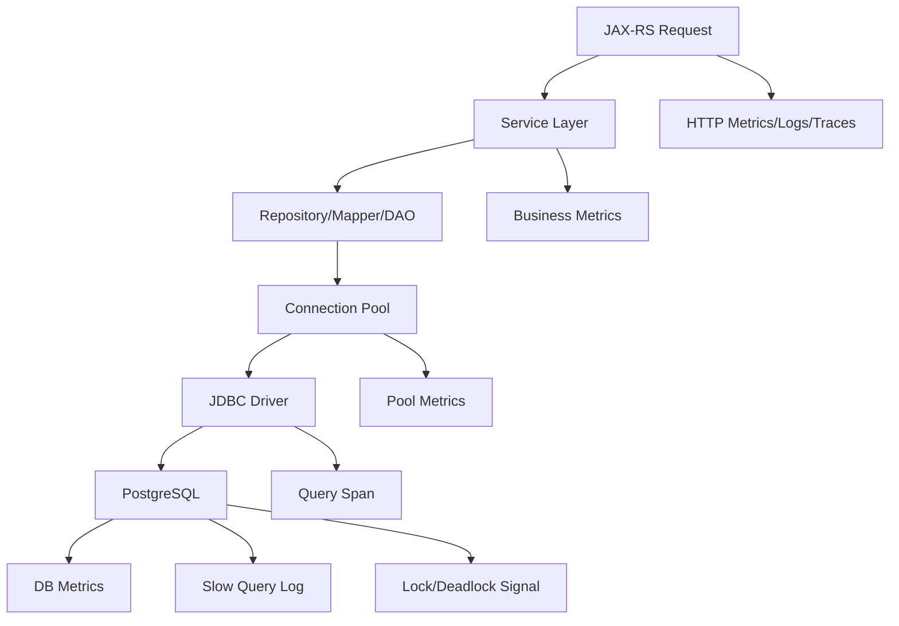

# Database Observability

Database observability adalah kemampuan menjawab pertanyaan production tentang behavior aplikasi saat membaca, menulis, mengunci, menunggu, dan bertransaksi dengan database.

Untuk Java/JAX-RS service yang memakai PostgreSQL melalui JDBC, MyBatis, JPA, atau Hibernate, database sering menjadi dependency paling kritis.

Target mental model:

```text
Can we explain whether a request is slow or failing because of application code, connection pool, SQL query, transaction behavior, lock contention, database saturation, or data correctness issue?
```

Database observability bukan hanya melihat CPU database atau slow query log.

Ia harus menghubungkan:

- HTTP request.
- Resource method JAX-RS.
- Service/domain operation.
- Repository/mapper/DAO call.
- JDBC connection pool.
- SQL execution.
- Transaction boundary.
- Lock behavior.
- PostgreSQL runtime.
- Trace/log/metric correlation.
- Business entity lifecycle seperti quote/order/approval/fulfillment.

---

## 1. Why Database Observability Matters

Dalam enterprise backend, banyak incident terlihat sebagai API error tetapi akar masalahnya ada di database path.

Contoh:

- Request timeout karena query lambat.
- Pool exhausted karena connection tidak dikembalikan.
- Deadlock karena urutan update tidak konsisten.
- Lock wait karena long transaction.
- CPU database tinggi karena missing index.
- Disk IO tinggi karena sequential scan besar.
- JPA lazy loading memicu N+1 query.
- MyBatis mapper melakukan query terlalu lebar.
- Batch job mengunci tabel penting.
- Migration membuat query plan berubah.
- Read-after-write behavior tidak sesuai expectation.

Untuk CPQ/order management, dampaknya bisa serius:

- Quote search lambat.
- Pricing request timeout.
- Order submission gagal.
- Approval state stuck.
- Fulfillment status tidak update.
- Reconciliation job tertinggal.
- Duplicate atau inconsistent state karena retry setelah timeout.

---

## 2. Database Observability Signal Map

Database observability membutuhkan beberapa signal sekaligus:



Tidak ada satu signal yang cukup.

- Metrics menunjukkan trend dan saturation.
- Logs menunjukkan discrete event dan error evidence.
- Traces menunjukkan latency breakdown dan causal path.
- PostgreSQL views/logs menunjukkan database-side behavior.
- Audit/business events menunjukkan impact ke entity lifecycle.

---

## 3. The Database Path in Java/JAX-RS

Typical path:

```text
HTTP request
  -> JAX-RS resource
  -> service/domain layer
  -> repository/mapper/DAO
  -> transaction boundary
  -> connection pool checkout
  -> JDBC driver
  -> PostgreSQL query execution
  -> result mapping
  -> domain state update
  -> response/event/audit
```

Each phase can fail or slow down.

Observability must distinguish:

- Time waiting for a connection.
- Time executing SQL.
- Time waiting on locks.
- Time transferring result set.
- Time mapping rows into objects.
- Time inside transaction but outside query execution.
- Time after database work but before response.

If all of that is collapsed into one generic "database slow" label, incident debugging becomes guesswork.

---

## 4. Connection Pool Metrics

Connection pool is the first database bottleneck visible from application side.

Common metric dimensions:

- Active connections.
- Idle connections.
- Pending/waiting threads.
- Max pool size.
- Min idle.
- Connection acquisition time.
- Connection usage time.
- Timeout count.
- Creation count.
- Closure count.

Typical Java pool:

- HikariCP.
- Agroal.
- Application server datasource pool.
- Vendor-specific datasource.

Important question:

```text
Is the request slow because SQL is slow, or because it is waiting to acquire a database connection?
```

---

## 5. Active, Idle, Pending Connections

Interpretation:

```text
active high, idle low, pending high:
pool saturation or database slow/long transaction

active low, idle high, pending low:
pool likely not the bottleneck

active high, DB CPU low:
possible lock wait, network wait, long app-held transactions, or connection leak

pending spikes during traffic spikes:
pool may be undersized or DB latency too high
```

Connection pool dashboard should show:

- Active connections.
- Idle connections.
- Pending requests.
- Max pool size.
- Acquisition latency.
- Timeout count.

And should be displayed near:

- HTTP request rate.
- HTTP latency.
- DB query latency.
- Transaction duration.
- PostgreSQL connection count.
- JVM thread state.

---

## 6. Pool Exhaustion

Pool exhaustion happens when requests cannot acquire a connection in time.

Symptoms:

- HTTP latency rises.
- Error rate rises.
- `connection timeout` errors.
- Pending connection count rises.
- Active connection count near max.
- Thread count may rise or block.
- DB connection count may be high.

Root causes:

- Slow queries.
- Long transactions.
- Connection leak.
- Pool too small for traffic.
- Pool too large and overwhelms DB.
- Downstream transaction waits.
- Lock contention.
- Batch job consumes connections.
- Missing timeout.
- Retry storm.

Do not automatically increase pool size.

Increasing pool size can:

- Increase database load.
- Increase lock contention.
- Hide connection leak temporarily.
- Increase context switching.
- Make incident worse.

---

## 7. Connection Leak Detection

Connection leak means application checks out a connection and does not return it promptly.

Possible causes:

- Manual JDBC code missing close.
- Transaction boundary misconfiguration.
- Streaming result set held too long.
- Exception path bypasses cleanup.
- Async code using connection outside safe scope.
- Long-running transaction treated as normal.

Signals:

- Active connections never return to baseline.
- Pending grows slowly over time.
- Connection acquisition timeout appears.
- Database sees idle-in-transaction connections.
- Thread dump shows blocked waiting on pool.

Internal verification:

- Is leak detection enabled in pool config?
- What threshold is configured?
- Are leak logs structured and correlated?
- Are manual JDBC resources always try-with-resources?
- Are transaction boundaries clear?

---

## 8. Query Latency Metrics

Query latency answers:

```text
How long do database operations take from application perspective?
```

Metric design:

- Use histogram/timer.
- Label by bounded operation name, not raw SQL.
- Include datasource/database role if needed.
- Include result status/error class if bounded.
- Avoid user/order/quote IDs as labels.

Good labels:

```text
operation="quote.lookupById"
operation="order.insert"
operation="approval.findPending"
datasource="primary"
status="success|error|timeout"
```

Dangerous labels:

```text
sql="select * from quote where id = 'Q-123'"
quote_id="Q-123"
order_id="O-456"
error_message="duplicate key value violates..."
```

---

## 9. Query Span vs Query Metric

Metric:

```text
quote.lookupById latency p95 is 200ms
```

Trace span:

```text
this specific request spent 190ms in quote.lookupById
```

Both are needed.

Metrics show:

- trend.
- alert.
- aggregate behavior.
- SLO impact.

Traces show:

- exact request path.
- query sequence.
- waterfall latency.
- dependency contribution.

Logs show:

- error details.
- SQL state.
- sanitized exception.
- correlation ID.

---

## 10. Slow Query Observability

Slow query can be detected from:

- Application query latency metrics.
- Trace database spans.
- PostgreSQL slow query log.
- `pg_stat_statements`, if enabled.
- Database performance dashboard.
- Lock wait views.

Important distinction:

```text
Application-side slow query duration != pure database execution time always
```

It may include:

- Pool wait.
- Network latency.
- Driver overhead.
- Result transfer.
- Row mapping.
- Transaction wait.

PostgreSQL-side slow query helps isolate database execution.

Trace/application metric helps isolate request impact.

---

## 11. SQL Statement Visibility

SQL visibility depends on stack:

- JDBC raw SQL.
- MyBatis mapped statement.
- JPA/Hibernate generated SQL.
- Stored procedure call.
- Native query.
- Batch statement.

Observability challenge:

- Raw SQL may expose sensitive data.
- Parameterized SQL may be safe but less precise.
- ORM-generated SQL may be hard to map to repository method.
- MyBatis mapper ID may be more useful than raw SQL.

Recommended semantic fields:

```text
db.system="postgresql"
db.operation="SELECT|INSERT|UPDATE|DELETE"
db.statement="sanitized or omitted based on policy"
db.name="..."
db.sql.table="bounded table name if policy allows"
app.db.operation="quote.findById"
app.repository="QuoteMapper"
```

Internal policy decides how much SQL can be captured.

---

## 12. SQL Sanitization and Privacy

Never assume SQL is safe to log.

Sensitive values may include:

- Customer identifiers.
- Account numbers.
- Quote/order IDs, depending policy.
- Product/pricing terms.
- Commercial discounts.
- Personal data.
- Email/phone/address.
- Token/session data.
- Free-text notes.

Safer approaches:

- Log operation name instead of raw SQL.
- Capture parameterized SQL without values.
- Mask sensitive bind variables.
- Use query fingerprint/hash.
- Use bounded mapper/repository ID.
- Keep full query visibility restricted to database tools with proper access.

---

## 13. Rows Affected and Result Size

Rows affected/result size are important correctness and performance signals.

Examples:

- Update expected 1 row but affected 0.
- Delete affected too many rows.
- Query returns unexpectedly large result set.
- Batch update affects fewer rows than expected.
- Search endpoint returns massive result set without pagination.

Metric/log examples:

```text
operation="order.updateState"
rows_affected=0
expected_rows=1
state="SUBMITTED"
```

Correctness concern:

- `rows_affected=0` can reveal optimistic locking conflict.
- High rows returned can reveal missing filter.
- Unexpected rows affected can indicate data corruption risk.

---

## 14. Transaction Duration

Transaction duration is not the same as query duration.

A transaction may include:

- Multiple queries.
- Domain validation.
- Lock acquisition.
- External call, if design is flawed.
- Event outbox write.
- Audit write.
- ORM flush.
- Commit wait.

Long transaction risks:

- Lock contention.
- Deadlock probability.
- Connection held too long.
- Pool exhaustion.
- Vacuum impact in PostgreSQL.
- Stale reads for other transactions.
- Larger rollback cost.

Metric/log useful fields:

```text
transaction.name="submitOrder"
transaction.duration_ms=...
query_count=...
rows_changed=...
status="committed|rolled_back"
```

---

## 15. Transaction Boundary Observability

In Java systems, transaction boundary may be defined by:

- Jakarta Transactions/JTA.
- Spring `@Transactional`, if stack uses Spring.
- CDI interceptor.
- Manual transaction management.
- Application server datasource transaction.
- MyBatis SqlSession scope.
- JPA EntityManager scope.

Internal verification:

- Where does transaction start and end?
- Is transaction boundary visible in trace?
- Are long transactions measured?
- Are rollbacks counted?
- Are optimistic locking conflicts counted?
- Are retries around transactions visible?
- Are external calls inside transactions prohibited?

---

## 16. Lock Wait Observability

Lock wait means a transaction is blocked waiting for another transaction.

Symptoms:

- Query latency rises.
- DB CPU may not be high.
- Active DB connections rise.
- Application connection pool active rises.
- Request latency rises.
- Queue/job processing slows.

Common causes:

- Long transaction.
- Batch update.
- Inconsistent update order.
- Missing index causing wider locks or scans.
- High contention entity.
- Approval/order state transition collisions.
- Reconciliation job competing with online traffic.

Signals:

- PostgreSQL lock views.
- Slow query log.
- DB wait event metrics.
- Application query span duration.
- Transaction duration metrics.
- Logs with operation/business key.

---

## 17. Deadlock Observability

Deadlock occurs when transactions wait on each other cyclically.

PostgreSQL detects and aborts one transaction.

Application symptoms:

- Error spikes with SQL state related to deadlock.
- Transaction rollback.
- Retriable error path triggered.
- User may see transient failure.
- Consumer/job may retry.

Observability fields:

- SQL state.
- Operation name.
- Transaction name.
- Entity type.
- Business key, if allowed in logs.
- Retry count.
- Correlation ID.
- Trace ID.

Design response:

- Define deadlock as retryable only if operation is idempotent or guarded.
- Log once at appropriate level.
- Count retry attempts.
- Avoid unbounded retry loops.
- Review update ordering.

---

## 18. PostgreSQL Metrics

PostgreSQL metrics often include:

- Active connections.
- Idle connections.
- Idle in transaction.
- Transactions per second.
- Commit/rollback rate.
- Query duration.
- Lock wait.
- Deadlocks.
- Tuples read/inserted/updated/deleted.
- Cache hit ratio.
- Index usage.
- Sequential scans.
- Replication lag.
- Disk usage.
- WAL generation.
- Autovacuum activity.
- Checkpoint activity.
- CPU/memory/disk IO, depending platform.

Senior engineer does not need to be DBA, but must know enough to ask the right questions during incident.

---

## 19. PostgreSQL Wait and Saturation Signals

Database saturation can appear as:

- CPU high.
- Disk IO high.
- Connection count high.
- Lock wait high.
- Long-running queries.
- Autovacuum lag.
- WAL/checkpoint pressure.
- Replication lag.
- Buffer/cache miss increase.

App-side symptom may be:

- Request latency high.
- Pool pending high.
- DB span duration high.
- Timeout errors.
- Queue consumer lag.
- Batch job duration high.

Incident debugging needs both app-side and DB-side views.

---

## 20. MyBatis Observability

MyBatis gives more explicit mapper-level control than ORM-heavy approaches.

Useful observability dimensions:

- Mapper ID.
- SQL operation type.
- Query latency.
- Rows returned.
- Rows affected.
- Batch size.
- Error SQL state.
- Timeout count.

Risks:

- Logging raw SQL with parameters.
- Mapper method hides expensive dynamic SQL.
- Dynamic SQL creates query shape explosion.
- Result mapping loads too much data.
- Missing pagination.
- N+1 manually implemented across mapper calls.

Internal verification:

- Are mapper IDs available in logs/traces?
- Is SQL sanitized?
- Are slow mapper calls visible?
- Are rows returned/affected visible where useful?
- Are dynamic SQL patterns reviewed?

---

## 21. JPA/Hibernate Observability

JPA/Hibernate can hide database behavior behind entity lifecycle.

Observability risks:

- N+1 query.
- Lazy loading outside expected boundary.
- Unexpected flush.
- Large entity graph loading.
- Dirty checking cost.
- Long persistence context.
- Batch insert/update misconfiguration.
- Query generated differently than expected.

Useful signals:

- Query count per request.
- Query latency.
- Flush count/duration, if available.
- Entity load count.
- Collection fetch count.
- Second-level cache hit/miss, if used.
- Transaction duration.

PR review should ask:

- Does this endpoint trigger predictable query count?
- Is pagination enforced?
- Are joins/fetches intentional?
- Is lazy loading visible in trace/query metrics?

---

## 22. JDBC Observability

Raw JDBC gives control but increases responsibility.

Watch for:

- Missing try-with-resources.
- Manual transaction cleanup bug.
- Unbounded result set.
- PreparedStatement parameter logging risk.
- Batch execution partial failure.
- Query timeout missing.
- Fetch size misconfigured.

Useful observability:

- Operation name around JDBC call.
- Query timeout count.
- Rows affected.
- Batch size.
- SQL state.
- Connection acquisition latency.
- Transaction duration.

---

## 23. Query Timeout and Statement Timeout

Timeouts exist at multiple levels:

- HTTP client timeout.
- JAX-RS request timeout.
- Application operation timeout.
- JDBC query timeout.
- PostgreSQL statement timeout.
- Transaction timeout.
- Connection acquisition timeout.
- Kubernetes/proxy timeout.

Failure mode:

```text
Gateway times out before DB statement timeout
```

Then database may keep working after client has already failed.

Better alignment:

- DB statement timeout should be lower than upstream request timeout when appropriate.
- Application timeout should produce clear error log/metric.
- Long-running async jobs should not reuse interactive request timeouts blindly.
- Timeout errors should be classified.

---

## 24. Retry and Database Correctness

Retrying database operations can be safe or dangerous.

Retryable examples:

- Deadlock victim, if transaction is idempotent.
- Serialization failure, if operation can retry safely.
- Temporary connection acquisition error, if no side effect happened.

Dangerous retries:

- Non-idempotent insert without unique key.
- State transition without compare-and-set guard.
- External side effect inside transaction boundary.
- Duplicate event publish without outbox/idempotency.
- Retrying after unknown commit outcome.

Observability must capture:

- Retry count.
- Attempt number.
- SQL state/error class.
- Operation name.
- Idempotency key.
- Business key, if policy allows.
- Final outcome.

---

## 25. Database Errors and SQL State

Database errors should be classified.

Categories:

- Constraint violation.
- Unique violation.
- Foreign key violation.
- Deadlock detected.
- Serialization failure.
- Lock timeout.
- Statement timeout.
- Connection error.
- Authentication/authorization error.
- Syntax/config error.
- Data truncation.

Useful log fields:

```text
error.kind="database"
db.system="postgresql"
sql.state="23505"
db.operation="order.insert"
retryable=false
```

Avoid logging raw full exception repeatedly at every layer.

Log once at boundary with context.

---

## 26. Database Observability and Tracing

Database spans should answer:

- Which operation was executed?
- Which service called it?
- How long did it take?
- Did it fail?
- Was it part of a larger transaction?
- Was it near a slow HTTP request?
- Was it repeated many times in one trace?

Trace anti-pattern:

- Every query span named `SELECT` only.
- Raw SQL with sensitive values.
- Missing parent span.
- No status on SQL error.
- No operation/mapper/repository attribute.
- N+1 not visible because DB instrumentation disabled.

---

## 27. Database Observability and Logs

Logs are useful for discrete events:

- Query timeout.
- Pool exhaustion.
- Deadlock victim.
- Constraint violation.
- Unexpected rows affected.
- Transaction rollback.
- Migration failure.
- Connection leak detection.

But logs should not become query audit trail for every successful query.

For successful normal queries, metrics/traces are usually better.

Use logs for:

- Errors.
- Warnings.
- Unusual state.
- Correctness violation.
- Operational event.
- Business-significant database transition.

---

## 28. Database Observability and Audit

Audit log is not the same as database log.

Database log says:

```text
UPDATE order SET status = 'APPROVED' WHERE id = ?
```

Audit log should say:

```text
actor approved order O-123 from PENDING_APPROVAL to APPROVED at time T using channel C
```

Audit should capture business meaning:

- Actor.
- Action.
- Target entity.
- Before/after state.
- Reason, if applicable.
- Delegation/impersonation.
- Source/channel.
- Correlation ID.

Do not rely on SQL logs as compliance audit.

---

## 29. Database Observability and Kafka/RabbitMQ

Database and messaging often interact through:

- Transactional outbox.
- Inbox/idempotency table.
- Event state table.
- Retry/DLQ metadata.
- Saga/process state.

Failure modes:

- DB commit succeeds but event publish fails.
- Event publish succeeds but DB update fails.
- Outbox backlog grows.
- Consumer writes duplicate state.
- Idempotency check fails.
- DLQ replay causes DB contention.

Metrics/logs needed:

- Outbox pending count.
- Outbox age.
- Outbox publish failures.
- Inbox duplicate count.
- Idempotency conflict count.
- Consumer DB write latency.
- DB deadlock during event processing.

---

## 30. Database Observability and Redis

Redis often reduces database load, but can also hide database risk.

Patterns:

- Cache hit reduces DB read traffic.
- Cache miss storm increases DB load.
- Redis outage shifts load to PostgreSQL.
- Lock stored in Redis protects DB operation.
- Idempotency key in Redis protects duplicate DB writes.

Observability correlation:

```text
Redis hit ratio drops
-> DB query rate rises
-> DB latency rises
-> pool pending rises
-> HTTP p99 rises
```

For critical flows, dashboard should show Redis and DB side by side.

---

## 31. Database Observability and Camunda/Workflow

Workflow engines often store state in database and interact with application DB.

Common issues:

- Failed job due to DB timeout.
- Timer backlog due to DB contention.
- Process instance stuck because state update failed.
- Message correlation fails due to missing/late DB state.
- Human task aging because query slow.

Observability needs:

- Workflow job DB latency.
- Failed job SQL errors.
- Process state transition latency.
- Task aging.
- Incident count.
- DB lock contention near workflow tables.

---

## 32. Database Observability in Kubernetes

Kubernetes can affect database behavior from application side.

Examples:

- Pod restart drops connections.
- Rolling deployment creates connection storm.
- HPA scales replicas and exceeds DB connection capacity.
- CPU throttling in app makes connection held longer.
- Network policy/DNS issue causes connection errors.
- Readiness probe routes traffic before DB pool is ready.

Need correlate:

- Deployment replica count.
- Pod restarts.
- HPA scaling event.
- Connection pool active per pod.
- Total DB connections.
- DB max connections.
- DB error rate.

---

## 33. Database Observability in AWS/Azure/On-Prem

Cloud/managed database observability may include:

- CPU utilization.
- Memory.
- IOPS.
- Storage latency.
- Connection count.
- Replication lag.
- Backup/maintenance windows.
- Failover events.
- Parameter changes.
- Network errors.

On-prem adds:

- Host saturation.
- Disk array/storage latency.
- VM noisy neighbor.
- Manual maintenance windows.
- Monitoring agent gaps.

Internal verification:

- Where are managed database metrics visible?
- Are maintenance/failover events visible in incident timeline?
- Are DB parameter changes logged?
- Can application engineers access enough DB telemetry?

---

## 34. Database Dashboard Design

A useful database dashboard for service owners should include:

Application side:

- Request latency.
- Error rate.
- DB operation latency.
- Connection pool active/idle/pending.
- Pool acquisition timeout.
- Transaction duration.
- Query timeout count.

Database side:

- Active connections.
- Long-running queries.
- Lock waits.
- Deadlocks.
- CPU/disk IO.
- Cache hit ratio.
- Slow query top list, if available.
- Replication lag, if relevant.

Context:

- Deployment marker.
- Traffic volume.
- Batch/job schedule.
- Migration marker.
- Incident annotation.

---

## 35. Database Alerting

Database-related alerts should be impact-aware.

Weak alert:

```text
DB CPU > 80%
```

Better alerts:

```text
DB query latency p95 high AND API latency/error rate degraded
```

```text
Connection pool pending > 0 for sustained window AND acquisition timeout increasing
```

```text
Deadlock count increased for order submission operation
```

```text
Outbox age exceeds threshold for business-critical event publishing
```

Alert should answer:

- What is impacted?
- Which service/operation?
- Is it user-facing?
- What dashboard to open?
- What runbook step first?

---

## 36. Common Database Observability Anti-Patterns

Anti-pattern:

- Only database team has DB dashboard.
- Application dashboard has no pool metrics.
- Slow query logs not correlated to request traces.
- Raw SQL logged with sensitive values.
- Metric labels use raw SQL or business IDs.
- No transaction duration metric.
- No lock/deadlock visibility.
- Pool exhaustion handled by increasing pool size blindly.
- N+1 query invisible.
- No deployment/migration marker.
- No query timeout classification.
- Retrying DB errors without idempotency evidence.
- SQL logs mistaken for audit logs.

---

## 37. Production Debugging Flow: Slow API

When API is slow and database is suspected:

```text
1. Check API latency by endpoint template.
2. Check error rate and status code distribution.
3. Open traces for slow requests.
4. Identify DB span duration and count.
5. Check connection acquisition/pending metrics.
6. Check query latency by operation/mapper.
7. Check PostgreSQL slow queries and lock waits.
8. Check transaction duration.
9. Check deployment/migration marker.
10. Check JVM GC/thread/CPU throttling.
11. Check Redis/cache hit ratio if DB load changed.
12. Check batch/job activity.
13. Determine user/business impact.
```

Do not jump directly from "API slow" to "database is slow".

Prove where time is spent.

---

## 38. Production Debugging Flow: Pool Exhaustion

When pool exhaustion occurs:

```text
1. Confirm active connections near max.
2. Confirm pending/waiting connections increasing.
3. Confirm acquisition timeout errors.
4. Check DB query latency.
5. Check transaction duration.
6. Check long-running queries.
7. Check lock waits/deadlocks.
8. Check connection leak logs.
9. Check thread dumps if safe.
10. Check recent deployment/config/pool size changes.
11. Check traffic spike/retry storm.
12. Check batch jobs consuming connections.
```

Mitigation options depend on root cause:

- Kill long query.
- Disable/slow batch job.
- Roll back deployment.
- Reduce traffic.
- Fix retry storm.
- Increase pool only if DB capacity supports it.

---

## 39. Production Debugging Flow: Deadlock Spike

When deadlock count rises:

```text
1. Identify affected operation.
2. Capture SQL state/error class.
3. Identify transaction pair or entity type.
4. Check recent code/deployment/migration.
5. Check update order across code paths.
6. Check batch jobs and concurrent consumers.
7. Check retry behavior.
8. Verify idempotency safety.
9. Check business impact.
10. Add corrective action: ordering, index, lock strategy, transaction scope, retry guard.
```

Deadlocks are not solved by logging more.

They require design correction, transaction review, or concurrency control.

---

## 40. Correctness Concerns

Database observability must detect correctness failure, not just latency.

Examples:

- Update affected 0 rows unexpectedly.
- Duplicate insert rejected by unique constraint.
- Foreign key violation indicates invalid lifecycle sequence.
- Optimistic lock conflict not handled.
- Transaction committed but event not published.
- Retry after unknown commit creates duplicate business action.
- Read model stale beyond freshness expectation.
- Manual correction bypasses audit.

For CPQ/order systems, correctness metrics can include:

- Invalid state transition count.
- Optimistic lock conflict count.
- Duplicate order submission prevented.
- Outbox pending/age.
- Reconciliation mismatch count.
- Stuck state count.

---

## 41. Performance Concerns

Performance problems often come from query shape and transaction scope.

Review:

- Is pagination enforced?
- Are indexes aligned with filters/sorts?
- Are joins bounded?
- Are batch sizes safe?
- Is result set size measured?
- Is query count per request bounded?
- Is transaction scope minimal?
- Are external calls avoided inside transaction?
- Are retry loops bounded?
- Are DB calls visible in trace?

Performance is not only database tuning.

It is also application data access design.

---

## 42. Security and Privacy Concerns

Database observability can leak sensitive data if careless.

Avoid:

- Raw SQL with literal values.
- Bind parameter values in logs/traces.
- Customer data in error messages.
- Full row payloads in logs.
- Sensitive quote/pricing/order details in telemetry.
- Database credentials in connection errors.

Apply:

- SQL sanitization.
- Operation names.
- Query fingerprint.
- Bounded labels.
- Restricted access to DB logs.
- Redaction for exception messages if needed.
- Audit log separation.

---

## 43. Cost Concerns

Database telemetry can become expensive if high-cardinality.

Dangerous labels:

- Raw SQL.
- Full table+where dynamic combinations.
- Customer ID.
- Quote/order ID.
- Error message.
- Query parameter values.
- Thread/request ID.

Cost-aware strategy:

- Use operation names.
- Use query fingerprint.
- Sample traces where appropriate.
- Keep metrics aggregate.
- Keep detailed SQL visibility in restricted DB tooling.
- Retain slow/error query evidence longer than every successful query detail.

---

## 44. Operational Concerns

Operationally, database observability must support incident response.

Need clarity on:

- Who owns application-side DB metrics?
- Who owns DB server/managed DB metrics?
- Who can inspect slow queries?
- Who can kill queries?
- Who can change indexes?
- Who can change pool config?
- Who approves DB migration rollback?
- Who owns runbook for lock/deadlock/pool exhaustion?

Without ownership, telemetry exists but action is slow.

---

## 45. Internal Verification Checklist

Cek di internal CSG/team:

- Database engine/version and deployment model.
- Whether PostgreSQL is self-managed, managed cloud, on-prem, or hybrid.
- Connection pool library and config.
- Pool metrics exposed: active, idle, pending, max, acquisition time, timeout.
- JDBC/MyBatis/JPA instrumentation approach.
- Whether raw SQL is logged, sanitized, or disabled.
- Whether mapper/repository operation names are attached to metrics/traces.
- Slow query log availability.
- `pg_stat_statements` or equivalent availability.
- Lock/deadlock monitoring.
- Transaction timeout and statement timeout standards.
- Query timeout standards.
- Pool size standard per service/replica.
- DB max connection constraints.
- Migration/deployment markers.
- Database dashboard access for backend engineers.
- Runbook for pool exhaustion.
- Runbook for slow query.
- Runbook for lock/deadlock.
- Security/privacy policy for SQL telemetry.
- Audit policy separation from database logs.
- Incident history involving DB latency, deadlock, pool exhaustion, migration, or connection leak.

---

## 46. Database Observability Review Checklist

Use this checklist for PR/design review:

- Are DB operations named with bounded operation names?
- Are query latency metrics available?
- Are connection pool metrics available?
- Are pool wait/acquisition time visible?
- Are transaction durations measured?
- Are slow queries discoverable?
- Are lock waits and deadlocks visible?
- Are query timeouts classified?
- Are SQL states logged safely?
- Are raw SQL values excluded from logs/traces?
- Are high-cardinality labels avoided?
- Are rows affected/result size captured for correctness-critical operations?
- Are retries bounded and idempotency-safe?
- Are external calls avoided inside transactions?
- Are MyBatis/JPA query counts visible enough?
- Are migration markers available on dashboards?
- Are DB metrics correlated with HTTP, JVM, Redis, Kafka/RabbitMQ, and Kubernetes metrics?
- Are dashboards and runbooks connected to alerts?
- Is audit logging separate from database logging?

---

## 47. Senior Engineer Mental Model

Database observability answers this question:

```text
Is the database path slow, saturated, blocked, incorrect, or invisible?
```

A senior engineer should reason in layers:

```text
request latency
  -> trace database spans
  -> connection pool wait
  -> query execution
  -> transaction duration
  -> lock/deadlock/wait events
  -> database saturation
  -> correctness impact
```

Do not accept "database slow" as a root cause.

Ask:

- Which operation?
- Which query shape?
- Which transaction?
- Which lock?
- Which pool?
- Which deployment or migration?
- Which business flow?
- Which customer impact?

---

## 48. Key Takeaways

- Database observability must connect application behavior, connection pool, SQL execution, transaction boundary, PostgreSQL metrics, and business impact.
- Connection pool metrics are mandatory for Java/JAX-RS services.
- Slow API does not automatically mean slow database; prove whether time is spent waiting for pool, executing SQL, waiting on locks, mapping results, or paused in JVM.
- Query metrics should use bounded operation names, not raw SQL or business IDs.
- SQL telemetry must be privacy-aware and cost-aware.
- Transaction duration, lock wait, deadlock, rows affected, and result size are correctness signals as much as performance signals.
- MyBatis/JPA/JDBC each have different observability blind spots.
- Database alerts should be tied to service impact, not isolated resource thresholds.
- Audit logs are not SQL logs; audit must express business meaning.
