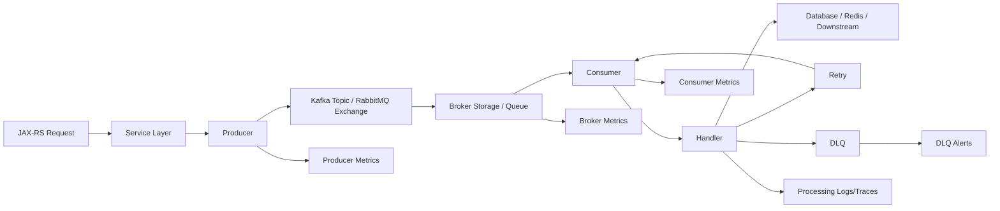

# Messaging Observability

Messaging observability adalah kemampuan menjawab pertanyaan production tentang apa yang terjadi pada event, command, message, task, atau notification setelah keluar dari request synchronous.

Dalam Java/JAX-RS enterprise system, messaging sering menjadi batas antara:

- HTTP request dan asynchronous processing.
- Quote/order transaction dan fulfillment pipeline.
- Domain event dan downstream integration.
- Retryable work dan DLQ/manual intervention.
- System-to-system propagation dan eventual consistency.

Target mental model:

```text
Can we explain whether a business operation is delayed, duplicated, lost, retried, dead-lettered, reordered, blocked, or processed by the wrong consumer version?
```

Messaging observability bukan hanya melihat apakah Kafka/RabbitMQ hidup.

Ia harus menjawab:

- Message apa yang dipublish?
- Kapan dipublish?
- Dari business action apa?
- Consumer mana yang memproses?
- Berapa umur message saat diproses?
- Berapa lama processing berlangsung?
- Apakah message di-retry?
- Apakah masuk DLQ?
- Apakah duplicate?
- Apakah lag/backlog berdampak ke customer?
- Apakah ordering atau idempotency terjaga?

---

## 1. Why Messaging Observability Matters

Synchronous API biasanya mudah terlihat: request masuk, response keluar.

Messaging lebih sulit karena work berpindah ke jalur async.

Contoh incident:

- Quote accepted tetapi order creation terlambat.
- Order submitted tetapi fulfillment event belum diproses.
- Pricing completed tetapi downstream service belum menerima event.
- Approval event dipublish dua kali dan menyebabkan duplicate action.
- Consumer stuck karena poison message.
- Kafka consumer lag meningkat tetapi API tetap terlihat sehat.
- RabbitMQ queue depth naik karena worker tidak cukup.
- DLQ bertambah tetapi tidak ada alert.
- Retry storm membuat dependency downstream makin overload.
- Message age tinggi tetapi throughput terlihat normal.

Dalam CPQ/order management, messaging gap dapat terlihat sebagai business inconsistency:

```text
API says success, but downstream business state never catches up.
```

Itulah mengapa messaging observability harus menggabungkan technical signal dan business signal.

---

## 2. Messaging Signal Map

Messaging observability membutuhkan signal dari producer, broker, consumer, business handler, retry mechanism, dan DLQ.



Signal categories:

- Producer metrics.
- Broker metrics.
- Consumer metrics.
- Handler metrics.
- Retry metrics.
- DLQ metrics.
- Message age metrics.
- Business event metrics.
- Logs with correlation/business keys.
- Traces across publish and consume.
- Audit logs for business-critical actions.

---

## 3. Core Messaging Questions

Good messaging observability starts from questions.

### Is the producer publishing?

Evidence:

- Publish attempt count.
- Publish success count.
- Publish failure count.
- Publish latency.
- Serialization failure log.
- Broker ack/confirm latency.
- Topic/exchange/routing key label.

### Is the broker accepting and storing messages?

Evidence:

- Topic partition health.
- Queue depth.
- Broker error.
- Replication/cluster health.
- Disk/memory pressure.
- Unroutable messages.

### Are consumers keeping up?

Evidence:

- Consumer lag.
- Queue depth.
- Consume rate.
- Processing rate.
- Processing latency.
- Consumer error rate.
- Rebalance count.
- Unacked messages.

### Are messages failing repeatedly?

Evidence:

- Retry count.
- Redelivery count.
- DLQ count.
- Error type distribution.
- Poison message signature.
- Handler exception logs.

### Is business state catching up?

Evidence:

- Event age.
- State transition latency.
- Order/quote aging.
- Pending fulfillment count.
- Reconciliation mismatch count.
- Stuck lifecycle metric.

---

## 4. Kafka Observability Mental Model

Kafka is a partitioned, durable, append-only log.

The main observability object is not only "message". It is:

```text
topic + partition + offset + consumer group + timestamp + processing result
```

Kafka debugging usually asks:

- Was the record produced?
- Which topic?
- Which partition?
- Which offset?
- Which key?
- Which consumer group should process it?
- Has the group consumed that offset?
- Is lag growing?
- Was processing committed?
- Was the record retried or sent to DLQ?

Important Kafka signals:

- Producer send rate.
- Producer error rate.
- Producer latency.
- Record serialization failures.
- Broker ack latency.
- Consumer poll rate.
- Consumer processing latency.
- Consumer commit latency.
- Consumer lag.
- Rebalance count.
- Partition assignment.
- DLQ publish count.
- Event age.

---

## 5. Kafka Producer Metrics

Producer-side metrics explain whether application can publish events reliably.

Important metrics:

| Metric | Meaning | Failure indicated |
|---|---|---|
| `kafka_producer_records_sent_total` | Count of successfully sent records | Producer throughput |
| `kafka_producer_send_errors_total` | Send failures | Broker/network/serialization/config issue |
| `kafka_producer_send_duration_seconds` | Publish latency | Broker ack delay or network issue |
| `kafka_producer_record_size_bytes` | Payload size | Oversized event or schema bloat |
| `kafka_producer_retries_total` | Producer retries | Transient broker/network issue |
| `kafka_producer_buffer_available_bytes` | Producer buffer capacity | Backpressure risk |

Recommended labels:

- `service`
- `environment`
- `topic`
- `result`
- `error_type`

Avoid labels:

- `message_id`
- `event_id`
- `order_id`
- `quote_id`
- raw exception message
- raw payload field

Business keys belong in logs/traces, not metric labels.

---

## 6. Kafka Consumer Metrics

Consumer-side metrics explain whether async work is being processed.

Important metrics:

| Metric | Meaning | Failure indicated |
|---|---|---|
| `kafka_consumer_records_consumed_total` | Records consumed | Consume throughput |
| `kafka_consumer_processing_duration_seconds` | Handler duration | Slow processing/dependency issue |
| `kafka_consumer_errors_total` | Processing errors | Handler or data issue |
| `kafka_consumer_lag` | Records behind latest offset | Backlog/delay |
| `kafka_consumer_commits_total` | Offset commits | Progress evidence |
| `kafka_consumer_rebalances_total` | Consumer group rebalances | Instability/scaling/deployment issue |
| `kafka_consumer_dlq_total` | Records sent to DLQ | Permanent failures |

Recommended labels:

- `service`
- `consumer_group`
- `topic`
- `partition`
- `handler`
- `result`
- `error_type`

Use `partition` carefully. It can be useful, but too many topic/partition combinations across many services may become noisy.

---

## 7. Kafka Consumer Lag

Consumer lag is the distance between latest produced offset and consumed/committed offset.

Simplified:

```text
lag = latest broker offset - consumer committed offset
```

Lag means work exists but has not yet been processed by the consumer group.

Important interpretation:

```text
lag high + consume rate high:
consumer may be catching up after spike

lag high + consume rate low:
consumer is stuck, underprovisioned, or failing

lag increasing steadily:
production rate exceeds processing capacity

lag zero + business stale:
wrong consumer group, wrong topic, lost event, or downstream state issue
```

Consumer lag is useful, but not sufficient.

You also need event age.

---

## 8. Event Age

Event age measures how old a message is when it is processed.

```text
event_age = processing_time - event_created_time
```

This is more business-relevant than raw lag.

Example:

- Lag of 10,000 may be acceptable for high-throughput non-critical telemetry.
- Lag of 20 may be critical for order fulfillment if events are 30 minutes old.

Recommended metrics:

```text
messaging_event_age_seconds{topic, consumer_group, handler}
messaging_processing_duration_seconds{topic, consumer_group, handler}
```

Event age is essential for:

- Order fulfillment delay.
- Approval notification delay.
- Reconciliation delay.
- Fallout creation delay.
- Quote state propagation delay.

---

## 9. Kafka Retry and DLQ Observability

Retries are not automatically good.

They can either recover transient failures or hide permanent poison messages.

Observe:

- Retry attempt count.
- Retry delay.
- Retry reason.
- Retry exhaustion count.
- DLQ publish count.
- DLQ age.
- DLQ drain count.
- DLQ replay success/failure.

Good retry log fields:

```json
{
  "event": "message.retry_scheduled",
  "topic": "order.events",
  "consumerGroup": "fulfillment-worker",
  "handler": "OrderFulfillmentEventHandler",
  "attempt": 3,
  "maxAttempts": 5,
  "retryDelayMs": 30000,
  "errorType": "DOWNSTREAM_TIMEOUT",
  "correlationId": "...",
  "causationId": "...",
  "businessKey": "order:ORD-12345"
}
```

Good DLQ log fields:

```json
{
  "event": "message.dead_lettered",
  "topic": "order.events",
  "dlqTopic": "order.events.dlq",
  "consumerGroup": "fulfillment-worker",
  "handler": "OrderFulfillmentEventHandler",
  "attempt": 5,
  "errorType": "VALIDATION_FAILED",
  "messageId": "...",
  "correlationId": "...",
  "businessKey": "order:ORD-12345"
}
```

Do not log full payload unless explicitly allowed and sanitized.

---

## 10. RabbitMQ Observability Mental Model

RabbitMQ is usually modeled around exchanges, queues, bindings, routing keys, deliveries, acknowledgements, and consumers.

The main observability object is:

```text
exchange + routing key + queue + delivery + ack/nack + redelivery + consumer
```

RabbitMQ debugging asks:

- Was the message published to the exchange?
- Was it routed to the expected queue?
- Is the queue growing?
- Are consumers connected?
- Are messages unacked?
- Are messages being redelivered?
- Are messages dead-lettered?
- Is prefetch too high or too low?
- Is a consumer stuck while holding unacked messages?

---

## 11. RabbitMQ Queue Depth

Queue depth is the number of messages waiting in a queue.

Interpretation:

```text
queue depth high + consume rate high:
consumer may be catching up

queue depth high + consume rate low:
consumer down, stuck, or insufficient

queue depth stable but unacked high:
consumers received messages but are slow/stuck before ack

queue depth zero + business stale:
message may be unroutable, consumed by wrong handler, or failed after ack
```

Queue depth should be paired with:

- Publish rate.
- Consume rate.
- Ack rate.
- Nack rate.
- Redelivery rate.
- Unacked count.
- Consumer count.
- Message age.

---

## 12. RabbitMQ Unacked Messages

Unacked messages are messages delivered to consumers but not yet acknowledged.

High unacked count can mean:

- Consumer handler is slow.
- Consumer is blocked on DB/downstream.
- Prefetch is too high.
- Consumer crashed but connection not closed yet.
- Ack is missing due to bug.
- Long-running work should not be done under a message ack window.

Observable evidence:

- `rabbitmq_queue_messages_unacked`.
- Handler processing duration.
- Consumer error logs.
- DB/downstream latency.
- Thread pool saturation.
- JVM GC pause.
- Consumer connection state.

---

## 13. RabbitMQ Redelivery Count

Redelivery means a message was delivered before and is being delivered again.

Causes:

- Consumer nacked message.
- Consumer crashed before ack.
- Connection dropped before ack.
- Handler timed out.
- Broker requeued message.

Redelivery is important because handlers must be idempotent.

Recommended metrics:

```text
rabbitmq_message_redeliveries_total{queue, consumer, handler}
rabbitmq_message_nacks_total{queue, consumer, handler, reason}
rabbitmq_message_dead_lettered_total{queue, dlq, reason}
```

Recommended logs:

```json
{
  "event": "message.redelivered",
  "queue": "order.fulfillment.queue",
  "handler": "FulfillmentCommandHandler",
  "deliveryTag": "...",
  "redelivered": true,
  "messageId": "...",
  "correlationId": "...",
  "businessKey": "order:ORD-12345"
}
```

---

## 14. Publish Rate and Consume Rate

Publish and consume rates must be viewed together.

```text
publish_rate > consume_rate over time => backlog grows
consume_rate > publish_rate over time => backlog drains
publish_rate = 0 unexpectedly => producer issue or traffic issue
consume_rate = 0 unexpectedly => consumer issue or routing issue
```

For Kafka:

- Publish rate per topic.
- Consume rate per consumer group.
- Processing rate per handler.

For RabbitMQ:

- Publish rate per exchange/routing key.
- Deliver/get rate per queue.
- Ack rate per queue/consumer.

Business interpretation:

```text
Throughput is only meaningful if paired with freshness and success rate.
```

A consumer can process many messages quickly while failing the business operation and sending everything to DLQ.

---

## 15. Message Processing Latency

Message processing latency measures time inside the consumer handler.

It should start after message receive/poll and end after processing result is known.

Potential phases:

```text
poll/receive
  -> deserialize
  -> validate
  -> load state
  -> process business rule
  -> call dependency
  -> write DB
  -> publish next event
  -> ack/commit
```

Useful latency breakdown:

- Deserialization latency.
- Handler processing latency.
- DB latency.
- Downstream HTTP latency.
- Redis latency.
- Publish-next-event latency.
- Ack/commit latency.

At minimum:

```text
message_processing_duration_seconds{broker, topic_or_queue, consumer_group_or_queue, handler, result}
```

---

## 16. Duplicate Event Count

Duplicate messages are normal in at-least-once systems.

The question is not:

```text
Can duplicates happen?
```

The question is:

```text
Can we detect, suppress, and prove duplicates did not corrupt business state?
```

Signals:

- Duplicate detection count.
- Idempotency key conflict count.
- Already-processed message count.
- Replayed event count.
- Redelivery count.
- Duplicate business command count.

Example metric:

```text
messaging_duplicate_events_total{handler, source, result}
```

Do not label by event ID or order ID.

Use logs for specific IDs:

```json
{
  "event": "message.duplicate_detected",
  "handler": "OrderSubmittedHandler",
  "idempotencyKey": "hash:...",
  "messageId": "...",
  "businessKey": "order:ORD-12345",
  "result": "ignored"
}
```

---

## 17. Correlation Across Messaging

A message must carry enough identity to connect producer and consumer work.

Important IDs:

- `trace_id`
- `span_id`
- `correlation_id`
- `causation_id`
- `message_id`
- `event_id`
- `idempotency_key`
- `quote_id`
- `order_id`
- `process_instance_id`
- `tenant_id`

Common problem:

```text
HTTP request logs have correlationId, but consumer logs do not.
```

That means async boundary destroyed the investigation chain.

For Kafka/RabbitMQ, correlation context usually belongs in headers, not only payload.

Producer must set context.
Consumer must extract context.
Handler logs must include context.
Traces must continue across boundaries where supported.

---

## 18. Messaging Logs

Messaging logs should capture discrete lifecycle events:

- Publish attempted.
- Publish succeeded.
- Publish failed.
- Message received.
- Message validation failed.
- Processing started.
- Processing succeeded.
- Processing failed.
- Retry scheduled.
- Message redelivered.
- Message dead-lettered.
- Message replayed.
- Duplicate ignored.

But avoid logging every high-volume success at INFO unless business-critical or sampled.

Possible log level rule:

| Event | Suggested level |
|---|---|
| Business-critical publish success | INFO |
| High-volume technical publish success | DEBUG or metric only |
| Retry scheduled | WARN if user-visible delay or repeated; INFO otherwise |
| DLQ | ERROR or WARN depending severity policy |
| Duplicate ignored safely | INFO or DEBUG depending volume |
| Poison message | ERROR |
| Serialization failure | ERROR |
| Expected validation failure | WARN or INFO depending business meaning |

---

## 19. Messaging Trace Design

Distributed trace should show:

```text
HTTP request span
  -> service operation span
  -> producer send span
  -> broker/message boundary
  -> consumer receive/process span
  -> DB/Redis/downstream spans
  -> publish next event span
```

Trace limitation:

- Async processing may happen long after the original request.
- Sampling may drop either producer or consumer side.
- Some backends represent messaging spans differently.
- Business correlation may be more reliable than trace continuity for long-running workflows.

Therefore use both:

- Trace IDs for technical path.
- Business keys for lifecycle path.
- Event IDs for message path.
- Audit records for critical state changes.

---

## 20. Messaging Dashboard Design

A useful messaging dashboard should answer:

1. Are producers publishing?
2. Are brokers healthy?
3. Are consumers keeping up?
4. Are messages old?
5. Are retries increasing?
6. Are DLQs growing?
7. Is business state delayed?
8. Which service/version changed recently?

Recommended panels:

- Publish rate by topic/exchange.
- Publish error rate.
- Consumer lag by group/topic.
- Queue depth by queue.
- Unacked messages by queue.
- Processing latency by handler.
- Processing error rate.
- Retry count.
- DLQ count.
- Oldest message age.
- Consumer instance count.
- Rebalance count for Kafka.
- Redelivery count for RabbitMQ.
- Deployment marker.
- Business lifecycle lag.

---

## 21. Alerting for Messaging

Messaging alerts should be actionable and business-aware.

Bad alerts:

```text
Kafka lag > 1000
Queue depth > 500
```

Better alerts:

```text
Order fulfillment consumer group has lag increasing for 15 minutes and event age p95 > 10 minutes.
```

```text
RabbitMQ order.fulfillment.queue unacked messages > 80% of prefetch capacity for 10 minutes and ack rate near zero.
```

```text
DLQ count for quote.pricing.events increased by > 20 in 5 minutes.
```

Important alert dimensions:

- Business criticality.
- Event age.
- Sustained backlog growth.
- Processing error rate.
- DLQ growth.
- Consumer absence.
- Retry storm.
- Customer-visible delay.

---

## 22. Failure Modes

Messaging failure modes:

| Failure mode | Observable signal |
|---|---|
| Producer cannot publish | publish failures, send latency, serialization errors |
| Wrong topic/exchange/routing key | publish success but consumer sees nothing |
| Consumer down | lag/queue depth increases, consumer count drops |
| Consumer slow | processing latency high, lag/queue depth grows |
| Poison message | repeated failure, retry loop, DLQ |
| Duplicate event | duplicate/idempotency metric/log |
| Lost correlation | consumer logs lack correlation ID/trace ID |
| DLQ ignored | DLQ count/age grows without owner action |
| Retry storm | retry count spike, downstream overload |
| Rebalance storm | Kafka rebalance count spike, throughput dip |
| Unacked buildup | RabbitMQ unacked high, ack rate low |
| Event stale | event age high, business state delayed |
| Silent partial failure | API success but downstream state missing |

---

## 23. Correctness Concerns

Messaging observability must support correctness, not only performance.

Key correctness questions:

- Did every accepted business action produce the required event?
- Was the event published transactionally with state change?
- Can duplicate delivery corrupt state?
- Is the handler idempotent?
- Are retries safe?
- Are events processed in required order?
- Is DLQ replay safe?
- Is poison message isolated?
- Can partial processing be detected?
- Does reconciliation detect missing downstream state?

Common gap:

```text
We can see consumer lag, but we cannot prove which order is stuck.
```

That requires business observability, not just broker metrics.

---

## 24. Performance Concerns

Messaging performance problems often come from:

- Slow handler logic.
- Slow database writes.
- Downstream HTTP latency.
- Redis latency.
- Serialization overhead.
- Large payloads.
- Too few consumers.
- Too many partitions with poor assignment.
- RabbitMQ prefetch mismatch.
- Kafka rebalance instability.
- JVM GC pauses.
- Thread pool starvation.
- Batch size misconfiguration.

Important principle:

```text
Broker lag is often a symptom. Handler latency and dependency saturation are often the cause.
```

---

## 25. Security and Privacy Concerns

Messaging observability can leak sensitive data if payloads, headers, or keys are logged carelessly.

Do not log:

- Full payload by default.
- Customer PII.
- Commercial pricing details.
- Contract terms.
- Tokens or credentials.
- Authorization headers.
- Raw message key if it contains business-sensitive ID.
- Raw error message containing payload fragments.

Safer patterns:

- Log message ID and business key only if allowed.
- Hash sensitive message key.
- Redact payload fields.
- Store payload sample only in controlled debug path.
- Separate audit event from debug log.
- Restrict DLQ payload access.

DLQ is often sensitive because it contains failed business payloads.

---

## 26. Cost Concerns

Messaging systems can be high-volume.

Cost risks:

- INFO log per message in high-volume topics.
- Metric label by message ID/event ID/order ID.
- Trace every message without sampling.
- DLQ payload copied into logs.
- Large span attributes containing payload.
- Dashboard querying high-cardinality labels.
- Long retention for verbose technical logs.

Cost-aware design:

```text
Use metrics for aggregate flow.
Use logs for exceptional or business-critical discrete events.
Use traces for sampled causal paths.
Use audit for regulated business actions.
```

---

## 27. Java/JAX-RS Integration Pattern

A common flow:

```text
POST /orders
  -> JAX-RS resource
  -> service validates command
  -> DB transaction writes order
  -> event outbox records OrderSubmitted
  -> publisher sends Kafka/RabbitMQ message
  -> consumer processes fulfillment
  -> consumer updates DB
  -> consumer emits next event
```

Observability points:

- Request log includes correlation/business key.
- DB transaction metric/log if slow.
- Outbox insert success/failure.
- Publish success/failure.
- Consumer receives message with same correlation.
- Handler processing metric.
- Retry/DLQ metric.
- State transition audit.
- Business lifecycle metric.

For production systems, outbox observability is often critical:

- Outbox pending count.
- Outbox oldest event age.
- Outbox publish failure count.
- Outbox retry count.
- Outbox cleanup lag.

---

## 28. Production Debugging Flow

When an async business flow is delayed:

1. Start with business key: quote ID, order ID, process instance ID.
2. Find originating HTTP request log/audit event.
3. Confirm event publish attempt and success.
4. Confirm topic/exchange/routing key.
5. Check broker backlog and message age.
6. Check consumer group/queue health.
7. Check consumer processing logs/traces.
8. Check retry/DLQ status.
9. Check downstream dependencies used by consumer.
10. Check state transition/audit record.
11. Check deployment/config changes around incident time.
12. Determine customer impact and mitigation.

Do not stop at:

```text
Kafka lag is high.
```

Translate it to:

```text
Which business operation is delayed, for which customers/tenants, and by how long?
```

---

## 29. PR Review Checklist

When reviewing messaging changes, ask:

- What topic/exchange/queue is used?
- Is correlation context propagated?
- Is causation ID set correctly?
- Is message ID/event ID available?
- Is idempotency defined?
- Are duplicate messages safe?
- Are retry rules explicit?
- Is DLQ behavior defined?
- Is DLQ observable and owned?
- Are producer metrics emitted?
- Are consumer metrics emitted?
- Is event age measured?
- Are business keys logged safely?
- Are payloads redacted or not logged?
- Are metric labels low-cardinality?
- Are alerts tied to business impact?
- Is replay behavior safe?
- Is outbox/inbox pattern observable if used?

---

## 30. Internal Verification Checklist

Verify internally:

- Kafka topics used by Quote & Order services.
- RabbitMQ exchanges, queues, bindings, and routing keys.
- Producer libraries and instrumentation.
- Consumer libraries and instrumentation.
- Consumer group naming convention.
- Queue naming convention.
- Message header convention.
- Correlation ID propagation across Kafka/RabbitMQ.
- Trace propagation across messaging.
- Message ID and event ID convention.
- Idempotency key convention.
- Retry policy per consumer.
- DLQ topology and owner.
- DLQ alert rules.
- Consumer lag dashboard.
- RabbitMQ queue depth dashboard.
- Event age metrics.
- Message processing latency metrics.
- Duplicate event metrics.
- Outbox/inbox usage and observability.
- Replay process and audit trail.
- Message payload logging policy.
- DLQ payload access control.
- Runbook for lag/backlog/DLQ incidents.
- Recent messaging-related incident notes.

---

## 31. Part Summary

Messaging observability is about preserving visibility after work leaves the synchronous request path.

The core production questions are:

- Was the message produced?
- Was it routed correctly?
- Is it waiting?
- Is it old?
- Is it being processed?
- Is it failing?
- Is it duplicated?
- Is it dead-lettered?
- Did business state catch up?

For Kafka, focus on topic, partition, offset, consumer group, lag, processing latency, retry, DLQ, and event age.

For RabbitMQ, focus on exchange, routing key, queue depth, unacked messages, redelivery, ack/nack, DLQ, and message age.

For enterprise CPQ/order systems, always connect technical messaging signals to business lifecycle impact.

If the API says success but async state never catches up, messaging observability is where the truth should be reconstructed.
