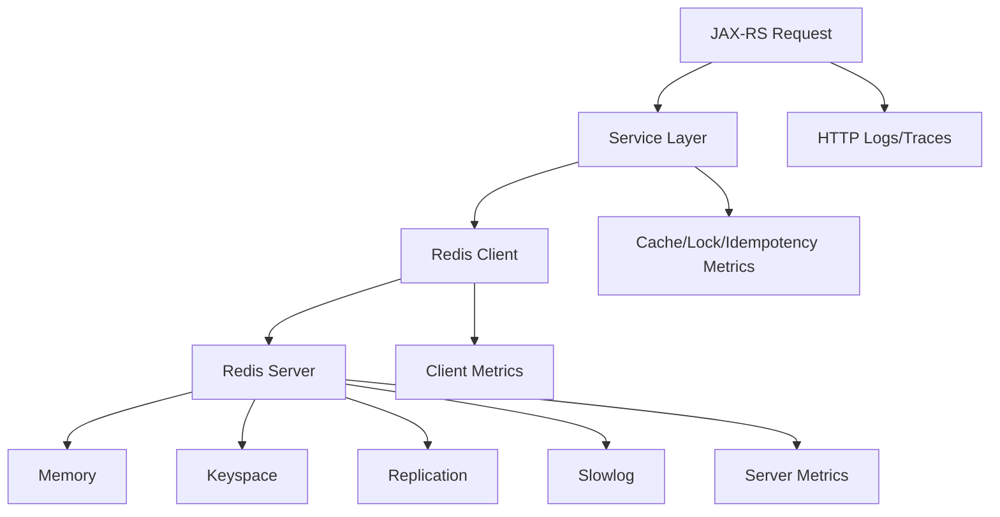

# Redis Observability

Redis observability adalah kemampuan menjawab pertanyaan production tentang behavior Redis sebagai cache, low-latency store, lock store, rate limiter, idempotency store, session/context store, queue/stream mechanism, atau coordination component.

Dalam Java/JAX-RS enterprise backend, Redis sering terlihat sederhana karena API-nya cepat dan mudah digunakan. Tetapi ketika Redis bermasalah, dampaknya bisa menyebar ke request latency, database load, duplicate processing, stale data, rate limiting, session behavior, dan distributed coordination.

Target mental model:

```text
Can we explain whether Redis is improving system performance, hiding correctness risk, or becoming a production bottleneck?
```

Redis observability bukan hanya melihat `PING` berhasil.

Ia harus menjawab:

- Apakah cache efektif?
- Apakah latency Redis naik?
- Apakah ada hot key?
- Apakah memory mendekati limit?
- Apakah eviction terjadi?
- Apakah expiration sesuai expectation?
- Apakah slow command muncul?
- Apakah client connection menumpuk?
- Apakah blocked client meningkat?
- Apakah lock/idempotency key bekerja benar?
- Apakah stream consumer tertinggal?
- Apakah Redis failure menyebabkan database overload?

---

## 1. Why Redis Observability Matters

Redis sering berada di jalur kritis request.

Contoh penggunaan:

- Cache quote summary.
- Cache catalog/config/rule lookup.
- Cache pricing reference data.
- Store idempotency key untuk order submission.
- Store distributed lock untuk reconciliation/job processing.
- Rate limiter untuk API atau integration flow.
- Session/token metadata.
- Temporary workflow state.
- Redis Streams untuk lightweight async processing.

Redis incident dapat muncul sebagai:

- API latency spike.
- PostgreSQL traffic spike karena cache miss storm.
- Wrong response karena stale cache.
- Duplicate order submission karena idempotency key expired terlalu cepat.
- Reconciliation job stuck karena lock tidak release.
- Consumer backlog di Redis Streams.
- Eviction menghapus key penting.
- Command latency tinggi karena slow command atau network issue.
- Memory full.
- Client connection exhaustion.

---

## 2. Redis Signal Map

Redis observability membutuhkan signal dari aplikasi, Redis client, Redis server, platform, dan business behavior.



Signal categories:

- Cache hit/miss metrics.
- Command latency metrics.
- Command rate metrics.
- Redis server CPU/memory metrics.
- Keyspace metrics.
- Eviction/expiration metrics.
- Slowlog events.
- Client connection metrics.
- Blocked client metrics.
- Replication metrics.
- Stream pending metrics.
- Application logs/traces with safe key identification.
- Business metrics showing stale/missing data impact.

---

## 3. Redis Usage Pattern First

Before observing Redis, identify how the service uses it.

Different usage patterns require different signals.

| Usage pattern | Primary concern | Key signal |
|---|---|---|
| Cache | Hit rate, stale data, eviction | hit/miss, TTL, eviction |
| Idempotency store | Duplicate prevention | duplicate detected, key conflict, TTL |
| Distributed lock | Mutual exclusion, stuck lock | lock acquire/release/failure/duration |
| Rate limiter | Correct throttling | allowed/blocked count, key cardinality |
| Session/context store | Availability, expiration | key TTL, get/set latency, missing key |
| Redis Streams | Backlog and consumer health | pending entries, lag, processing latency |
| Temporary state | Data lifetime correctness | TTL, expiration, missing key |

Bad observability begins when all Redis calls are treated the same.

A `GET` for cache and a `SET NX` for idempotency have very different correctness meanings.

---

## 4. Cache Hit Ratio and Miss Ratio

Cache hit ratio:

```text
cache_hit_ratio = cache_hits / (cache_hits + cache_misses)
```

Miss ratio:

```text
cache_miss_ratio = cache_misses / (cache_hits + cache_misses)
```

Useful metric names:

```text
cache_requests_total{cache_name, operation, result}
cache_hit_ratio{cache_name}
cache_load_duration_seconds{cache_name, result}
```

Recommended labels:

- `cache_name`
- `operation`
- `result`
- `service`

Avoid labels:

- raw Redis key
- user ID
- quote ID
- order ID
- request ID
- full catalog ID if high-cardinality

Use logical cache name instead of raw key.

Example:

```text
cache_name="quote-summary"
cache_name="catalog-rule"
cache_name="pricing-reference"
```

---

## 5. Interpreting Cache Hit/Miss

Hit/miss ratio must be interpreted with workload context.

```text
high hit ratio + low latency:
cache likely useful

low hit ratio + high DB load:
cache not effective or key design poor

sudden miss spike:
cache flush, deployment, key prefix change, TTL expiry wave, Redis eviction, or serialization change

high hit ratio + wrong data:
stale cache or invalidation bug

miss ratio acceptable but miss latency high:
loader/database dependency is slow
```

Hit ratio is not always the goal.

For correctness-sensitive data, shorter TTL and lower hit ratio may be acceptable.

For expensive reference data, high hit ratio may be essential.

---

## 6. Redis Latency

Redis is expected to be low-latency. Latency spikes are often visible at API level.

Observe:

- Client-side command latency.
- Server-side latency.
- Network latency.
- Pool acquisition latency if client pooling exists.
- Serialization/deserialization time.
- Retry latency.
- Timeout count.

Recommended metrics:

```text
redis_command_duration_seconds{command, operation_name, result}
redis_command_errors_total{command, operation_name, error_type}
redis_timeouts_total{operation_name}
```

Use logical `operation_name`, for example:

- `quote_summary_cache_get`
- `pricing_reference_cache_load`
- `order_idempotency_set`
- `reconciliation_lock_acquire`

Avoid raw key label.

---

## 7. Command Rate

Command rate shows how much traffic Redis receives.

Useful questions:

- Did Redis traffic spike with API traffic?
- Did command mix change after deployment?
- Are there unexpected expensive commands?
- Is a loop issuing too many Redis calls?
- Is cache miss storm increasing DB and Redis traffic together?

Common metric:

```text
redis_commands_total{command, operation_name, result}
```

Important commands to watch:

- `GET`
- `SET`
- `SETNX`
- `DEL`
- `EXPIRE`
- `MGET`
- `HGET/HSET`
- `ZADD/ZRANGE`
- `XADD/XREADGROUP/XACK`
- `EVAL`
- `SCAN`
- `KEYS`

`KEYS` in production should usually be treated as dangerous unless tightly controlled.

---

## 8. Redis Slowlog

Redis slowlog records commands that exceed configured execution time threshold.

Slowlog helps identify server-side command slowness.

But be careful:

```text
Client-side latency can be high even when Redis slowlog is empty.
```

That can happen due to:

- Network latency.
- Client pool wait.
- JVM GC pause.
- Application thread starvation.
- TLS overhead.
- Redis server queueing not reflected as command execution time.

Use slowlog with:

- Client latency metrics.
- Redis CPU metrics.
- Command rate metrics.
- Network metrics.
- Application traces.

Internal checklist:

- Is slowlog enabled?
- What is the threshold?
- Who reviews it?
- Are slow commands alertable?
- Are raw keys/payloads exposed in slowlog access?

---

## 9. Memory Usage

Redis is memory-centric. Memory behavior is a first-class observability concern.

Important metrics:

- Used memory.
- Used memory percentage.
- Memory fragmentation ratio.
- Max memory.
- Evicted keys.
- Expired keys.
- Keyspace size.
- Dataset size.
- Replication backlog size.

Interpretation:

```text
used memory approaching maxmemory:
eviction or write failure risk

memory increasing steadily:
possible key leak, TTL missing, larger payload, or new cache pattern

fragmentation high:
memory allocator behavior may affect capacity

evictions increasing:
keys are being removed under memory pressure
```

For production debugging, memory should be shown next to:

- Command rate.
- Key count.
- Eviction count.
- Cache miss ratio.
- API latency.
- DB load.

---

## 10. Eviction

Eviction occurs when Redis removes keys to stay within memory policy.

Eviction is not always harmless.

For pure cache, eviction may be acceptable.

For idempotency keys, locks, session metadata, or temporary workflow state, eviction can be correctness-critical.

Questions:

- Which Redis database/namespace is evicting?
- What maxmemory policy is configured?
- Are critical keys stored in same Redis as cache keys?
- Did eviction cause duplicate processing or stale reads?
- Did cache eviction cause DB overload?

Key metric:

```text
redis_evicted_keys_total
```

Application-level complement:

```text
cache_misses_total{cache_name, reason="evicted_or_missing"}
idempotency_missing_total{operation}
lock_missing_total{lock_name}
```

---

## 11. Expiration and TTL

Expiration is expected key removal based on TTL.

Problems:

- TTL too short: data disappears before business flow finishes.
- TTL too long: stale data or memory growth.
- No TTL: key leak.
- Same TTL for many keys: expiration wave.
- TTL reset unexpectedly: stale behavior.

Useful metrics/logs:

- Key count by logical namespace.
- Expired keys count.
- Cache load count.
- Missing key count by operation.
- TTL value in debug logs for critical operations.

Do not label metrics by raw key.

For critical keys, logs can include sanitized logical key:

```json
{
  "event": "idempotency.key_created",
  "operation": "order_submit",
  "ttlSeconds": 86400,
  "idempotencyKeyHash": "sha256:...",
  "businessKey": "order:ORD-12345"
}
```

---

## 12. Keyspace Size

Keyspace size helps detect growth, leaks, or unexpected flushes.

Important views:

- Total keys by database.
- Approximate keys by namespace/prefix.
- Keys with TTL vs without TTL.
- Memory usage by key type or namespace if available.
- Top key patterns by volume.

Operational questions:

- Did key count drop suddenly?
- Did key count grow after release?
- Are keys missing TTL?
- Are temporary keys accumulating?
- Are business-critical keys colocated with volatile cache keys?

In many systems, keyspace analysis is ad hoc and risky.

Avoid running expensive key scans in production without internal runbook.

---

## 13. Connected Clients

Connected clients indicate connection usage.

Problems:

- Too many clients after deployment.
- Connection leak.
- Misconfigured client pool.
- Too many application instances.
- Client reconnect loop.
- Redis maxclients reached.

Signals:

- Connected clients.
- Client connection errors.
- Reconnect count.
- Pool active/idle/pending metrics.
- Redis timeout count.
- Application instance count.

For Java clients such as Lettuce or Jedis, observe client pool/event-loop behavior if available.

---

## 14. Blocked Clients

Blocked clients are clients waiting on blocking commands.

Relevant commands:

- `BLPOP`
- `BRPOP`
- `XREAD BLOCK`
- blocking stream operations

High blocked clients may be normal for blocking consumers, but unexpected growth is suspicious.

Questions:

- Are blocked clients expected?
- Which operation uses blocking command?
- Are consumers stuck?
- Are connection pools exhausted by blocking commands?
- Are blocking and non-blocking operations sharing the same client pool?

Metric:

```text
redis_blocked_clients
```

Pair with:

- Consumer count.
- Stream pending entries.
- Command latency.
- Client pool usage.
- Application thread pool usage.

---

## 15. Replication Lag

If Redis uses replicas, replication lag matters for reads and failover.

Signals:

- Master/replica link status.
- Replication offset lag.
- Replica delay.
- Failover events.
- Read errors from replica.
- Stale read indicators.

Correctness concern:

```text
If application reads from replica immediately after writing to primary, stale reads may happen.
```

For CPQ/order management, stale reads can affect:

- Quote display.
- Order status display.
- Approval decision visibility.
- Fulfillment progress.
- Idempotency checks if misconfigured.

Internal verification:

- Are reads sent to replica?
- Which operations require read-your-writes?
- Is Redis used for correctness-critical state?
- Is failover behavior tested?

---

## 16. Redis Streams Observability

Redis Streams can be used for lightweight messaging.

Important concepts:

- Stream length.
- Consumer group.
- Pending entries list.
- Last delivered ID.
- Acknowledgement.
- Claimed messages.
- Consumer idle time.

Important metrics:

```text
redis_stream_length{stream}
redis_stream_pending_entries{stream, consumer_group}
redis_stream_oldest_pending_age_seconds{stream, consumer_group}
redis_stream_consumed_total{stream, consumer_group, consumer}
redis_stream_acked_total{stream, consumer_group, consumer}
redis_stream_claimed_total{stream, consumer_group}
```

Failure modes:

- Pending entries grow.
- Consumer dies before ack.
- Old messages remain pending.
- Claim/retry logic broken.
- Stream grows without trimming.
- Duplicate processing after claim.

---

## 17. Cache Stampede and Miss Storm

Cache stampede happens when many requests miss the same cache key and hit the backing dependency simultaneously.

Observable signs:

- Sudden cache miss spike.
- DB query rate spike.
- DB latency spike.
- API latency spike.
- Redis command rate spike.
- Many concurrent cache load operations.

Prevention/mitigation patterns:

- Request coalescing.
- Single-flight loading.
- Lock around cache rebuild.
- Stale-while-revalidate.
- TTL jitter.
- Pre-warming.
- Backpressure.

Observability should show:

```text
cache_load_inflight{cache_name}
cache_load_duration_seconds{cache_name}
cache_load_errors_total{cache_name}
cache_stampede_prevented_total{cache_name}
```

---

## 18. Hot Key Detection

Hot key means one key or small key set receives disproportionate traffic.

Symptoms:

- Redis CPU high.
- Latency high for specific operation.
- Network throughput high.
- Single shard/node hot in clustered Redis.
- API latency spike for specific tenant/catalog/product/quote type.

Challenge:

```text
You should not expose raw keys as metric labels, but you still need a way to debug hot keys.
```

Safer approaches:

- Log sampled hashed key.
- Use Redis-native hot key tools if available and approved.
- Use logical cache name metric.
- Use controlled debug mode with redaction.
- Use tenant/product/category dimension only if approved and bounded.

---

## 19. Distributed Lock Observability

Redis is often used for distributed locks.

Observe lock lifecycle:

- Lock acquire attempted.
- Lock acquired.
- Lock acquire failed.
- Lock wait duration.
- Lock held duration.
- Lock release succeeded.
- Lock release failed.
- Lock expired while work still running.
- Lock contention count.

Example metrics:

```text
redis_lock_acquire_total{lock_name, result}
redis_lock_wait_duration_seconds{lock_name}
redis_lock_held_duration_seconds{lock_name, result}
redis_lock_expired_total{lock_name}
```

Correctness questions:

- Is lock TTL longer than worst-case work duration?
- What happens if lock expires during work?
- Is release token-safe?
- Can another worker release someone else's lock?
- Is lock used to protect business correctness or only reduce duplicate work?

---

## 20. Idempotency Store Observability

Redis is commonly used for idempotency keys.

Observe:

- Idempotency key create count.
- Idempotency key conflict count.
- Duplicate request detected count.
- Idempotency lookup latency.
- Missing key count.
- TTL duration.
- Expired-before-completion count if detectable.

Example metric:

```text
idempotency_requests_total{operation, result}
```

Possible results:

- `created`
- `duplicate_detected`
- `completed_reused`
- `conflict`
- `expired`
- `error`

For order submission, idempotency is correctness-critical.

If Redis evicts or expires idempotency keys too early, duplicate business operations may occur.

---

## 21. Rate Limiter Observability

Redis-backed rate limiters need observability because incorrect throttling can become customer-visible.

Observe:

- Allowed count.
- Blocked count.
- Remaining quota distribution.
- Redis latency for limiter operation.
- Fallback behavior when Redis unavailable.
- Key cardinality.
- Tenant/user/API dimension if approved.

Example metric:

```text
rate_limiter_decisions_total{limiter_name, decision}
```

Avoid high-cardinality user labels unless explicitly approved.

Important question:

```text
If Redis is unavailable, does the limiter fail open or fail closed?
```

Both choices have operational and security implications.

---

## 22. Redis Tracing

Redis spans should show Redis dependency latency without leaking sensitive keys.

Useful span attributes:

- Redis command.
- Logical operation name.
- Database index if relevant.
- Network peer.
- Result status.
- Error type.

Risky attributes:

- Full Redis key.
- Full command arguments.
- Token/session data.
- Serialized payload.
- Customer-specific data.

Better:

```text
redis.command = GET
app.redis.operation = quote_summary_cache_get
app.cache.name = quote-summary
app.redis.key_hash = sha256:...       # only if approved
```

Trace should connect:

```text
JAX-RS request span
  -> service operation span
  -> Redis GET/SET span
  -> DB fallback span if cache miss
```

This makes cache miss cost visible.

---

## 23. Redis Logging

Redis logs at application level should be selective.

Do not log every successful `GET` at INFO.

Good logging targets:

- Redis timeout.
- Redis unavailable.
- Serialization/deserialization failure.
- Cache load failure.
- Cache stampede guard activated.
- Lock acquire failed for business-critical job.
- Lock expired before work completed.
- Idempotency duplicate detected.
- Idempotency conflict.
- Stream message moved to retry/DLQ equivalent.

Example safe log:

```json
{
  "event": "redis.operation_failed",
  "operation": "order_idempotency_set",
  "command": "SET",
  "errorType": "TIMEOUT",
  "durationMs": 250,
  "correlationId": "...",
  "businessKey": "order:ORD-12345"
}
```

Avoid:

```json
{
  "key": "customer:john@example.com:token:...",
  "value": "..."
}
```

---

## 24. Dashboard Design for Redis

A good Redis dashboard should show both Redis server health and application usage.

Server panels:

- CPU.
- Used memory.
- Max memory.
- Fragmentation ratio.
- Evicted keys.
- Expired keys.
- Connected clients.
- Blocked clients.
- Command rate.
- Error count.
- Replication lag.
- Keyspace size.
- Slowlog count.

Application panels:

- Cache hit/miss by cache name.
- Redis command latency by operation.
- Redis timeout/error count.
- Cache load duration.
- Lock acquire failure.
- Idempotency duplicate/conflict count.
- Rate limiter decisions.
- Stream pending entries.
- Oldest pending stream age.

Context panels:

- HTTP latency.
- DB query rate/latency.
- JVM memory/GC.
- Deployment marker.
- Pod restart/OOMKilled.

---

## 25. Alerting for Redis

Redis alerts should be tied to service impact.

Useful alerts:

- Redis unavailable for production service.
- Redis command latency p95/p99 sustained high.
- Redis timeout rate high.
- Memory near max.
- Evictions increasing for critical Redis instance.
- Replication lag high if replicas are used for reads/failover.
- Connected clients near max.
- Blocked clients unexpectedly high.
- Stream pending age exceeds business threshold.
- Cache miss storm causing DB load spike.
- Idempotency errors for order submission.
- Lock expiration during critical job.

Avoid noisy alerts:

```text
Any cache miss > 0
Any expired key > 0
Any connected client change
```

---

## 26. Failure Modes

Redis failure modes:

| Failure mode | Observable signal |
|---|---|
| Redis unavailable | timeout/error count, connection failure, health check fail |
| Redis slow | command latency high, API latency high |
| Cache ineffective | miss ratio high, DB load high |
| Cache stale | business correctness issue, invalidation gap, old value served |
| Eviction storm | evicted keys spike, miss ratio spike, memory near max |
| Missing TTL | keyspace grows, memory grows |
| TTL too short | missing key, duplicate processing, reload spike |
| Hot key | operation latency/CPU spike, uneven shard load |
| Client leak | connected clients grow, maxclients risk |
| Blocked clients | blocked_clients high, pool/thread starvation |
| Replication lag | stale reads, failover risk |
| Stream backlog | pending entries/oldest age high |
| Lock stuck | lock held too long, job blocked |
| Idempotency broken | duplicate detected/error/conflict signals |

---

## 27. Correctness Concerns

Redis is often used in ways that affect correctness even when engineers call it "just cache".

Ask:

- Is Redis storing derived data or source-of-truth-like state?
- What happens if a key is evicted?
- What happens if TTL expires early?
- What happens if Redis is unavailable?
- Can stale cache produce wrong business decision?
- Is cache invalidation tied to transaction commit?
- Is idempotency key durable enough?
- Is lock release token-safe?
- Can read replica lag produce stale behavior?
- Can Redis stream redelivery duplicate work?

Correctness-sensitive Redis usage needs audit/log/metric support beyond basic cache metrics.

---

## 28. Performance Concerns

Redis performance issues can come from:

- Expensive commands.
- Large payloads.
- Hot keys.
- Too many small calls instead of batching.
- Misused `KEYS` or broad scans.
- Serialization overhead in Java.
- Network latency.
- TLS overhead.
- Client pool exhaustion.
- Redis CPU saturation.
- Memory fragmentation.
- Eviction pressure.
- JVM GC pauses near Redis calls.

Trace can reveal whether Redis is the bottleneck or whether the application is slow before/after Redis call.

---

## 29. Security and Privacy Concerns

Redis data and observability can expose sensitive information.

Risks:

- PII embedded in keys.
- Tokens stored as values.
- Session identifiers logged.
- Pricing/commercial data in cached payloads.
- Raw keys emitted as labels.
- Slowlog exposing command arguments.
- Debug dumps exposing values.
- Broad Redis access in production.

Practices:

- Avoid sensitive raw keys.
- Hash or tokenize key identifiers when needed.
- Do not log values.
- Do not use raw key as metric label.
- Restrict Redis CLI access.
- Review slowlog visibility.
- Separate critical/security-sensitive Redis usage from volatile cache if needed.

---

## 30. Cost Concerns

Redis observability cost risks:

- Per-key metrics.
- Per-user/per-order/per-quote labels.
- High-volume logs per command.
- Tracing every Redis call in high-throughput hot path.
- Large span attributes.
- Excessive keyspace scans.
- Expensive dashboard queries.

Cost-aware design:

- Metrics by logical operation/cache name.
- Logs only for failures, critical events, and sampled diagnostics.
- Traces sampled or aggregated according to service criticality.
- Key analysis through controlled tooling, not permanent labels.

---

## 31. Java Client Considerations

Common Java Redis clients include Lettuce and Jedis, plus framework wrappers.

Verify:

- Sync vs async API usage.
- Connection pool behavior.
- Timeout configuration.
- Retry behavior.
- Command latency metrics.
- Serialization configuration.
- Cluster topology refresh.
- TLS configuration.
- Thread/event-loop usage.
- Tracing integration.
- Error handling strategy.

Important Java-specific failure:

```text
Redis appears slow, but the actual delay is waiting for a client connection or blocked application thread.
```

So observe both Redis server and Java client.

---

## 32. Production Debugging Flow

When API latency rises and Redis is suspected:

1. Check service latency and error rate.
2. Check Redis command latency by operation.
3. Check Redis timeout/error count.
4. Check cache hit/miss ratio.
5. Check DB query rate/latency for miss storm.
6. Check Redis memory and eviction.
7. Check connected and blocked clients.
8. Check slowlog.
9. Check deployment/config changes.
10. Check whether issue affects one cache/operation or all Redis operations.
11. Check business correctness symptoms: stale data, duplicate operation, stuck lock, stream backlog.
12. Mitigate: bypass cache, increase capacity, reduce traffic, fix TTL, roll back, drain stream, or disable risky path depending on runbook.

Do not conclude Redis is healthy only because `PING` works.

---

## 33. PR Review Checklist

When reviewing Redis-related changes, ask:

- What is Redis used for: cache, lock, idempotency, stream, rate limiter, session, temporary state?
- Is Redis on critical request path?
- What happens if Redis is unavailable?
- What is timeout policy?
- What is retry policy?
- What is TTL?
- Can keys be evicted safely?
- Are keys privacy-safe?
- Are values ever logged?
- Are raw keys used as metric labels?
- Is cache hit/miss measured?
- Is command latency measured?
- Are lock acquire/release/failure metrics present?
- Are idempotency conflicts observable?
- Are stream pending entries observable?
- Is stale data risk documented?
- Is cache invalidation correct?
- Is dashboard/alert updated?
- Is cost/cardinality acceptable?

---

## 34. Internal Verification Checklist

Verify internally:

- Redis deployment model: standalone, cluster, managed service, sentinel, primary/replica.
- Redis ownership: app team, platform team, shared infra, managed cloud.
- Redis usage by each Quote & Order service.
- Cache names and key namespaces.
- TTL standards.
- Eviction policy.
- Max memory policy.
- Whether critical keys share Redis with volatile cache.
- Java Redis client used: Lettuce, Jedis, framework wrapper, custom abstraction.
- Client timeout and retry config.
- Connection pool config.
- Command latency metrics.
- Cache hit/miss metrics.
- Redis server dashboard.
- Slowlog config and review process.
- Memory/eviction alerts.
- Replication lag alerts.
- Stream pending dashboards if Redis Streams are used.
- Lock/idempotency/rate limiter instrumentation.
- Key privacy policy.
- Redis value logging policy.
- Access control for Redis CLI, dumps, slowlog, and managed console.
- Runbook for Redis outage/latency/eviction/miss storm.
- Recent Redis-related incident notes.

---

## 35. Part Summary

Redis observability must be designed around usage pattern.

Cache requires hit/miss, TTL, latency, miss storm, and invalidation visibility.

Idempotency requires duplicate/conflict/missing-key visibility.

Locking requires acquire/release/hold-duration/expiration visibility.

Rate limiting requires allowed/blocked/fallback visibility.

Redis Streams require pending entries, oldest age, ack, claim, and consumer health visibility.

Server-level metrics such as memory, eviction, connected clients, blocked clients, command rate, slowlog, and replication lag must be connected to application-level behavior.

The key discipline is simple:

```text
Do not observe Redis as a black box.
Observe each Redis usage pattern as a production contract.
```

For enterprise Java/JAX-RS systems, Redis can improve latency dramatically, but without observability it can also hide stale data, duplicate operation risk, cache stampede, and correctness failure.
