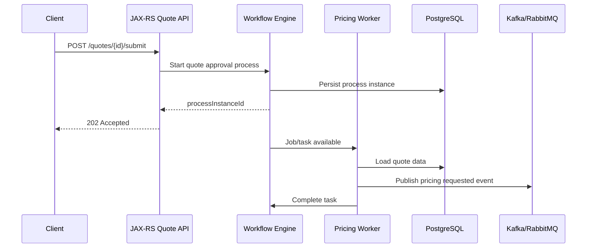

# Part 023 — Workflow/Camunda Observability

## 1. Core Idea

Workflow observability adalah kemampuan untuk menjawab pertanyaan production tentang **proses bisnis yang berjalan lama**, bukan hanya request HTTP yang selesai dalam ratusan milidetik.

Dalam aplikasi enterprise seperti CPQ, quote management, order management, approval, fulfillment, fallout, cancellation, amendment, dan reconciliation, banyak failure tidak terlihat sebagai satu exception sederhana. Failure sering muncul sebagai:

- process instance stuck di state tertentu,
- job retry terus sampai exhausted,
- external worker lambat,
- timer event backlog,
- message correlation gagal,
- human task aging terlalu lama,
- approval tidak bergerak,
- order tidak lanjut ke fulfillment,
- process variable terlalu besar,
- event sudah terkirim tetapi process tidak menerima,
- proses berhasil secara teknis tetapi salah secara bisnis.

Logging biasa menjawab “apa yang terjadi di thread ini”. Metrics biasa menjawab “berapa banyak dan seberapa cepat”. Tracing menjawab “request ini melewati apa saja”. Workflow observability harus menjawab pertanyaan yang lebih panjang:

> “Business process ini berada di mana, mengapa berhenti di sana, siapa/apa yang harus bergerak berikutnya, berapa lama sudah aging, dan apa dampaknya ke customer atau downstream operation?”

Untuk sistem Java/JAX-RS, Camunda atau workflow engine biasanya menjadi boundary antara request synchronous dan proses asynchronous yang panjang. Endpoint JAX-RS mungkin hanya membuat quote, submit approval, menerima callback fulfillment, atau mengirim event. Namun business outcome-nya bergantung pada workflow lifecycle.

Observability yang buruk membuat incident workflow berubah menjadi pencarian manual di database, log, message broker, dan UI admin. Observability yang baik membuat engineer dapat membangun timeline proses dari signal yang konsisten.

---

## 2. What Workflow Observability Is Not

Workflow observability bukan sekadar:

- melihat dashboard jumlah process instance,
- membuka UI Camunda dan mencari instance manual,
- logging setiap step tanpa correlation ID,
- menambah metric `workflow_failed_total` tanpa label yang berguna,
- menganggap “job retry masih ada” berarti sistem sehat,
- menganggap “tidak ada exception di service” berarti process berhasil,
- mencampur operational log dengan audit log,
- membuat dashboard yang hanya berguna untuk platform team, tetapi tidak berguna untuk engineer yang debug customer issue.

Workflow observability harus menjembatani tiga level:

1. **Technical execution** — job, worker, message, timer, retry, DB transaction.
2. **Workflow lifecycle** — process instance, activity, incident, task, state, transition.
3. **Business outcome** — quote approved, order fulfilled, fallout created, SLA breached, manual intervention required.

---

## 3. Why Workflow Observability Exists

Workflow engine dipakai karena business process enterprise sering memiliki sifat berikut:

- berjalan lama,
- memiliki banyak step,
- melibatkan manusia,
- menunggu external system,
- perlu retry,
- perlu timer,
- perlu kompensasi,
- perlu audit trail,
- perlu korelasi dengan business entity,
- perlu state yang tahan restart,
- perlu visibility untuk operation/support.

Konsekuensinya, failure juga berubah bentuk. Request HTTP bisa sukses `202 Accepted`, tetapi process gagal 10 menit kemudian. Message bisa diterima, tetapi correlation key salah. Worker bisa sehat, tetapi backlog meningkat. Human task bisa assigned, tetapi tidak pernah diselesaikan. Timer bisa ada, tetapi executor tidak mengejar backlog.

Karena itu, observability workflow harus fokus pada **progress**, **aging**, **backlog**, **failure**, **correlation**, dan **business impact**.

---

## 4. Workflow Signal Map

Workflow observability membutuhkan kombinasi signal berikut.

| Signal | Pertanyaan yang dijawab | Contoh |
|---|---|---|
| Process metric | Berapa instance aktif, selesai, gagal, stuck? | `workflow_process_instances_active` |
| Activity metric | Step mana yang lambat atau banyak gagal? | `workflow_activity_duration_seconds` |
| Job metric | Apakah job executor/worker sehat? | `workflow_failed_jobs_total` |
| Incident metric | Berapa incident terbuka dan di activity mana? | `workflow_incidents_open` |
| Task metric | Apakah human task aging? | `workflow_user_task_age_seconds` |
| Timer metric | Apakah timer backlog? | `workflow_timer_due_total` |
| Message correlation metric | Apakah event/callback gagal menemukan process? | `workflow_message_correlation_failures_total` |
| Log | Apa event operasional detail? | `workflow.job.failed` |
| Audit log | Siapa melakukan aksi bisnis apa? | `approval.approved` |
| Trace | Request/event/job ini melewati dependency apa? | root span HTTP → process start → publish event |
| Business metric | Berapa quote/order stuck, fallout, breached? | `orders_stuck_total` |

Signal-signal ini tidak boleh berdiri sendiri. Minimal harus memiliki correlation antara:

- process instance ID,
- business key,
- quote ID/order ID,
- correlation ID,
- trace ID,
- worker/job ID,
- activity ID/name,
- tenant/environment/service/version.

---

## 5. Core Workflow Entities to Observe

### 5.1 Process Definition

Process definition adalah model workflow yang dideploy. Dari perspektif observability, process definition menjawab:

- versi workflow mana yang sedang berjalan,
- apakah incident terjadi hanya di versi tertentu,
- apakah deployment baru mengubah failure rate,
- apakah process lama masih aktif setelah versi baru dideploy.

Recommended fields:

```json
{
  "workflow.engine": "camunda",
  "workflow.definition.key": "quote-approval",
  "workflow.definition.version": "17",
  "workflow.definition.id": "quote-approval:17:abc123"
}
```

### 5.2 Process Instance

Process instance adalah execution nyata dari workflow. Ini harus bisa dikaitkan dengan business key.

Recommended fields:

```json
{
  "workflow.process.instance_id": "...",
  "workflow.business_key": "QUOTE-12345",
  "quote.id": "QUOTE-12345",
  "tenant.id": "tenant-a",
  "correlation.id": "...",
  "trace.id": "..."
}
```

Business key sangat penting. Tanpa business key, engineer harus mencari process instance dengan query internal atau manual DB lookup.

### 5.3 Activity

Activity adalah step dalam workflow: service task, user task, receive task, timer event, gateway, call activity, atau script task.

Observable attributes:

- activity ID,
- activity name,
- activity type,
- start time,
- end time,
- duration,
- failure count,
- retry count,
- owner/worker,
- external system dependency,
- business operation name.

### 5.4 Job

Job adalah unit eksekusi asynchronous. Dalam Camunda, job failure sering menjadi tanda bahwa process tidak bisa maju.

Observe:

- created time,
- due date,
- retries remaining,
- exception message class,
- activity ID,
- process instance ID,
- job handler type,
- lock owner,
- lock expiration,
- retry schedule.

### 5.5 External Worker / Job Worker

Jika workflow menggunakan external task/job worker, worker observability harus mencakup:

- polling rate,
- lock success/failure,
- processing duration,
- completion count,
- failure count,
- BPMN error count,
- technical error count,
- timeout/lock expiration,
- queue/backlog per topic/type,
- worker version.

### 5.6 Human Task

Human task observability harus menjawab:

- siapa owner/group candidate,
- kapan task dibuat,
- berapa lama task aging,
- apakah task unassigned,
- apakah overdue,
- apakah task blocking fulfillment/order progression,
- apakah escalation dibutuhkan.

Human task bukan hanya technical state. Ia adalah operational work queue.

---

## 6. Minimum Metrics for Workflow Observability

### 6.1 Process Instance Count

Metric yang perlu ada:

```text
workflow_process_instances_started_total
workflow_process_instances_completed_total
workflow_process_instances_cancelled_total
workflow_process_instances_failed_total
workflow_process_instances_active
```

Recommended labels:

- `service`
- `environment`
- `workflow_definition_key`
- `workflow_definition_version`
- `tenant_class` jika aman dan low-cardinality
- `outcome`

Avoid labels:

- raw `process_instance_id`,
- raw `quote_id`,
- raw `order_id`,
- raw `user_id`,
- raw exception message.

Gunakan business ID di logs/traces/audit, bukan sebagai high-cardinality metric label.

### 6.2 Active Process

Active process penting untuk capacity dan stuck detection.

Pertanyaan:

- Apakah active process meningkat terus?
- Apakah process selesai dengan rate normal?
- Apakah active process menumpuk setelah deployment?
- Apakah hanya process definition tertentu yang menumpuk?

Metric:

```text
workflow_process_instances_active{workflow_definition_key="order-fulfillment"}
```

### 6.3 Failed Job

Failed job adalah salah satu signal workflow paling penting.

Metric:

```text
workflow_failed_jobs_total
workflow_failed_jobs_open
workflow_job_retries_remaining
```

Useful labels:

- workflow definition key,
- activity ID,
- job type/topic,
- error class,
- retriable flag,
- service/worker.

Do not label by full exception message.

### 6.4 Incident Count

Incident count harus dipisah antara:

- open incident,
- newly created incident,
- resolved incident,
- recurring incident,
- incident by activity,
- incident by process definition.

Metric:

```text
workflow_incidents_open
workflow_incidents_created_total
workflow_incidents_resolved_total
```

### 6.5 Worker Latency

Worker latency adalah waktu worker memproses task/job.

Metric:

```text
workflow_worker_duration_seconds_bucket
workflow_worker_duration_seconds_count
workflow_worker_duration_seconds_sum
```

Gunakan histogram. Jangan hanya average.

Important labels:

- worker name,
- task type/topic,
- workflow definition key,
- outcome,
- error class.

### 6.6 Worker Failure Rate

Metric:

```text
workflow_worker_executions_total{outcome="success|failure|bpmn_error|timeout"}
```

Failure rate harus dilihat bersama volume. Failure 10 per minute berbeda makna jika total execution 10 per minute vs 10,000 per minute.

### 6.7 Task Aging

Task aging menjawab “berapa lama task tertahan”. Untuk human task atau operational queue, aging sering lebih penting daripada count.

Metric:

```text
workflow_user_task_age_seconds
workflow_user_tasks_overdue
workflow_user_tasks_unassigned
```

Dashboard harus menampilkan percentile atau bucket aging:

- 0–15 menit,
- 15–60 menit,
- 1–4 jam,
- 4–24 jam,
- >24 jam.

### 6.8 SLA Breach

Workflow SLA bisa berupa:

- approval harus selesai dalam N jam,
- order decomposition harus selesai dalam N menit,
- fallout harus ditangani dalam N jam,
- cancellation request harus diproses dalam N jam,
- reconciliation harus selesai sebelum cut-off.

Metric:

```text
workflow_sla_breaches_total
workflow_sla_breaching_instances
workflow_lifecycle_duration_seconds
```

### 6.9 Timer Backlog

Timer backlog terjadi ketika timer sudah due tetapi belum dieksekusi.

Metric:

```text
workflow_timers_due
workflow_timers_overdue
workflow_timer_execution_delay_seconds
```

Timer backlog dapat menyebabkan cascade delay di approval timeout, retry, escalation, expiry, dan reconciliation.

### 6.10 Message Correlation Failure

Message correlation failure berarti sistem menerima event/callback tetapi tidak menemukan process/activity yang cocok.

Metric:

```text
workflow_message_correlation_attempts_total
workflow_message_correlation_failures_total
workflow_message_correlation_duration_seconds
```

Useful labels:

- message name/type,
- source system,
- outcome,
- reason class,
- workflow definition key jika diketahui.

Sensitive business key tidak perlu menjadi metric label, tetapi harus ada di structured log/audit dengan policy yang sesuai.

### 6.11 Variable Size

Process variable yang terlalu besar dapat menyebabkan DB bloat, serialization issue, query lambat, atau incident saat worker membaca variable.

Metric:

```text
workflow_variable_payload_size_bytes
workflow_variable_serialization_failures_total
```

Log event penting:

```json
{
  "event.name": "workflow.variable.size_exceeded",
  "workflow.definition.key": "order-fulfillment",
  "workflow.activity.id": "prepareFulfillmentPayload",
  "workflow.variable.name": "fulfillmentPayload",
  "payload.size.bytes": 872000,
  "limit.bytes": 512000
}
```

---

## 7. Workflow Logs That Matter

Workflow logs harus event-oriented. Hindari log seperti:

```text
Starting workflow
Done
Error happened
```

Gunakan event name yang stabil:

```json
{
  "event.name": "workflow.process.started",
  "service.name": "quote-service",
  "workflow.engine": "camunda",
  "workflow.definition.key": "quote-approval",
  "workflow.process.instance_id": "...",
  "workflow.business_key": "QUOTE-12345",
  "quote.id": "QUOTE-12345",
  "tenant.id": "tenant-a",
  "correlation.id": "...",
  "trace.id": "..."
}
```

Recommended workflow event names:

- `workflow.process.started`
- `workflow.process.completed`
- `workflow.process.cancelled`
- `workflow.activity.started`
- `workflow.activity.completed`
- `workflow.activity.failed`
- `workflow.job.acquired`
- `workflow.job.completed`
- `workflow.job.failed`
- `workflow.job.retry_scheduled`
- `workflow.incident.created`
- `workflow.incident.resolved`
- `workflow.message.correlation_attempted`
- `workflow.message.correlation_failed`
- `workflow.timer.due`
- `workflow.timer.executed`
- `workflow.user_task.created`
- `workflow.user_task.assigned`
- `workflow.user_task.completed`
- `workflow.sla.breached`

---

## 8. Trace Design for Workflow Execution

Tracing workflow memiliki tantangan: process bisa berjalan lintas menit, jam, bahkan hari. Tidak semua workflow lifecycle cocok berada dalam satu trace panjang.

Gunakan prinsip berikut:

1. **HTTP request trace** menjelaskan request synchronous.
2. **Worker/job trace** menjelaskan satu eksekusi job.
3. **Message trace** menjelaskan publish/consume event.
4. **Business key dan process instance ID** menjahit timeline lintas trace.
5. **Audit log** menyimpan evidence aksi bisnis penting.

Contoh flow:



Trace tidak harus menjadi satu garis panjang dari awal sampai akhir process. Yang wajib adalah correlation identity konsisten.

---

## 9. Java/JAX-RS Integration Points

Dalam aplikasi Java/JAX-RS, workflow observability biasanya muncul di beberapa titik.

### 9.1 Start Process from REST Endpoint

Ketika endpoint memulai workflow:

- log request accepted,
- log process started,
- emit process started metric,
- attach business key,
- attach correlation ID,
- attach trace ID,
- return process tracking reference jika sesuai API contract.

Bad pattern:

```java
runtimeService.startProcessInstanceByKey("quoteApproval");
```

Better conceptual pattern:

```java
start process with:
- stable process definition key
- business key
- sanitized variables
- correlation context
- audit event
- metric emission
```

### 9.2 Complete User/Service Task from REST Endpoint

Endpoint yang menyelesaikan task harus menghasilkan:

- audit log siapa menyelesaikan task,
- workflow task completed log,
- task duration metric,
- failure log jika completion ditolak,
- domain event jika state berubah.

### 9.3 Receive Callback/Event

Callback dari downstream system perlu:

- validate idempotency,
- correlate to process,
- log correlation attempt,
- emit correlation success/failure metric,
- handle duplicate callback,
- avoid leaking payload.

### 9.4 Worker Execution

Worker harus mengobservasi:

- job acquired,
- job started,
- dependency calls,
- job completed,
- BPMN/business error,
- technical failure,
- retry scheduled,
- dead-letter/fallout path.

---

## 10. PostgreSQL and Workflow Persistence Observability

Workflow engine biasanya memakai database untuk menyimpan state, jobs, variables, history, locks, incidents, dan tasks. Dalam konteks PostgreSQL, failure workflow bisa berasal dari:

- lock contention,
- long transaction,
- slow query history/process tables,
- bloated variable table,
- job acquisition query lambat,
- connection pool exhaustion,
- deadlock,
- vacuum/autovacuum pressure,
- index missing,
- large payload serialization.

Workflow dashboard harus dikorelasikan dengan DB dashboard.

Pertanyaan debugging:

- Apakah failed job spike bersamaan dengan DB latency spike?
- Apakah timer backlog muncul bersamaan dengan pool exhaustion?
- Apakah worker latency naik karena query lambat?
- Apakah process variable terlalu besar?
- Apakah incident count naik setelah migration?
- Apakah job acquisition worker lambat karena DB pressure?

---

## 11. Kafka/RabbitMQ/Redis/Camunda Interaction

Workflow engine jarang berdiri sendiri. Ia sering berinteraksi dengan broker/cache.

### Kafka/RabbitMQ

Workflow mungkin:

- memulai process dari event,
- publish event dari activity,
- wait for external callback/event,
- correlate message ke process instance,
- masuk retry/DLQ jika worker gagal.

Observability requirement:

- message ID,
- event ID,
- correlation ID,
- causation ID,
- process instance ID,
- business key,
- topic/queue/exchange/routing key,
- publish latency,
- consume latency,
- event age,
- DLQ reason.

### Redis

Redis mungkin dipakai untuk:

- idempotency key,
- distributed lock,
- temporary state,
- rate limiter,
- cache reference data,
- worker coordination.

Observability requirement:

- lock acquisition failure,
- idempotency conflict,
- cache miss spike,
- Redis latency spike,
- TTL expiry behavior,
- key privacy.

---

## 12. Stuck Process Detection

Stuck process bukan sekadar process aktif. Process aktif bisa normal jika memang menunggu approval. Stuck berarti process berada pada activity/state lebih lama dari expected lifecycle.

Detection strategy:

1. Define expected duration per activity.
2. Track state/activity entry timestamp.
3. Emit aging metric or query aging periodically.
4. Separate normal waiting from abnormal waiting.
5. Attach business impact.
6. Alert only when actionable.

Example classification:

| State/activity | Normal? | Suspicious condition |
|---|---:|---|
| Waiting for customer acceptance | Yes | aging > commercial SLA |
| Waiting for approval | Yes | unassigned > threshold |
| Pricing calculation | Usually short | duration > p95 threshold |
| Fulfillment callback | Depends | event age > SLA |
| Retry service task | Temporary | retries exhausted or retry age too high |
| Manual fallout | Yes | aging > operational SLA |

---

## 13. Human Task Aging

Human task observability harus menghindari blind spot “sistem sehat tetapi pekerjaan manusia macet”.

Useful metrics:

```text
workflow_user_tasks_open
workflow_user_tasks_unassigned
workflow_user_tasks_overdue
workflow_user_task_age_seconds_bucket
workflow_user_task_completion_duration_seconds_bucket
```

Useful dimensions:

- task type,
- queue/group,
- priority,
- region/market if low-cardinality and allowed,
- SLA class,
- workflow definition.

Privacy warning: jangan label metric dengan assignee individual jika tidak disetujui policy. Untuk audit/security, identity bisa tersimpan di audit log dengan access control.

---

## 14. SLA and Business Impact

Workflow incident tidak selalu berarti customer impact. Sebaliknya, customer impact bisa terjadi tanpa technical exception.

SLA-oriented observability harus menjawab:

- berapa quote/order yang mendekati breach,
- berapa yang sudah breach,
- workflow step mana penyebab breach,
- apakah breach berasal dari dependency, worker, human queue, atau upstream event,
- tenant/customer/market mana terdampak sesuai policy,
- apakah breach bisa dimitigasi manual.

Business impact metric harus dipisahkan dari technical metric.

Technical:

```text
workflow_incidents_open{activity="sendOrderToFulfillment"}
```

Business:

```text
orders_fulfillment_sla_breached_total
orders_stuck_in_fulfillment
quotes_waiting_approval_over_sla
```

---

## 15. Failure Modes

### 15.1 Process Started Without Business Key

Impact:

- sulit dicari dari customer issue,
- trace/log tidak cukup untuk reconnect ke domain entity,
- audit gap.

Detection:

- metric/log validation for missing business key,
- PR review,
- process start wrapper.

### 15.2 Broken Message Correlation

Impact:

- callback/event diterima tetapi process tidak lanjut,
- duplicate manual action,
- order stuck.

Detection:

- correlation failure metric,
- structured log with message type and sanitized business key,
- DLQ/callback error dashboard.

### 15.3 Worker Retry Storm

Impact:

- dependency overload,
- broker backlog,
- job executor saturation,
- duplicate side effect risk.

Detection:

- retry count spike,
- worker failure rate,
- downstream error rate,
- DLQ growth,
- trace showing repeated dependency failure.

### 15.4 Timer Backlog

Impact:

- SLA breach,
- delayed escalation,
- delayed retry,
- delayed expiry/cancellation.

Detection:

- overdue timer count,
- timer execution delay histogram,
- job acquisition latency,
- DB pressure correlation.

### 15.5 Human Task Aging

Impact:

- operational backlog,
- customer delay,
- SLA breach.

Detection:

- task age histogram,
- overdue task metric,
- queue/group dashboard.

### 15.6 Variable Payload Bloat

Impact:

- DB bloat,
- serialization failure,
- slow history queries,
- memory pressure.

Detection:

- variable size metric,
- serialization failure log,
- DB table growth dashboard,
- slow query correlation.

### 15.7 Audit/Operational Log Confusion

Impact:

- compliance evidence incomplete,
- production debugging log polluted,
- sensitive data exposure.

Detection:

- log schema review,
- audit event coverage review,
- security review.

---

## 16. Debugging Playbook: Stuck Order Workflow

Use this sequence.

### Step 1 — Identify Business Entity

Find:

- order ID,
- quote ID,
- tenant/customer context if allowed,
- process instance ID,
- correlation ID,
- latest known state.

### Step 2 — Check Lifecycle State

Ask:

- What state/activity is the process in?
- Since when?
- Is that state expected to wait?
- What is expected next event/action?

### Step 3 — Check Workflow Incident

Look for:

- open incident,
- failed job,
- retries remaining,
- exception class,
- activity ID,
- worker name,
- last failure timestamp.

### Step 4 — Check Worker and Dependency

Correlate with:

- worker logs,
- worker latency,
- downstream HTTP errors,
- DB latency,
- Redis latency,
- Kafka/RabbitMQ lag/DLQ.

### Step 5 — Check Message Correlation

If waiting for event/callback:

- was event published?
- was event consumed?
- did correlation key match?
- was message duplicate?
- did event go to DLQ?
- is event age above SLA?

### Step 6 — Check Human Task

If waiting for user action:

- assigned or unassigned?
- queue/group?
- age?
- SLA?
- escalation path?

### Step 7 — Build Timeline

Build a timeline using:

- audit events,
- workflow logs,
- process history,
- traces,
- broker events,
- deployment/config changes.

### Step 8 — Determine Mitigation

Possible mitigation:

- retry job,
- fix correlation data,
- replay event,
- move to fallout/manual intervention,
- rollback release,
- scale worker,
- fix downstream dependency,
- escalate human task.

Never mutate workflow state manually without approved internal process.

---

## 17. Dashboard Design for Workflow

Minimum workflow dashboard sections:

1. **Overview**
   - active instances,
   - started/completed rate,
   - open incidents,
   - failed jobs,
   - SLA breaches.

2. **Process Definition Breakdown**
   - by workflow definition key,
   - by version,
   - by environment,
   - by tenant class if allowed.

3. **Activity Hotspots**
   - slowest activities,
   - most failed activities,
   - retry-heavy activities,
   - stuck activities.

4. **Worker Health**
   - worker execution rate,
   - latency p50/p95/p99,
   - failure rate,
   - lock timeout,
   - backlog.

5. **Timer and Job Executor**
   - due timers,
   - overdue timers,
   - job acquisition delay,
   - retries remaining.

6. **Human Task Queue**
   - open tasks,
   - unassigned tasks,
   - overdue tasks,
   - aging distribution.

7. **Business Impact**
   - stuck orders,
   - approval aging,
   - fulfillment failure,
   - fallout created,
   - SLA breaches.

8. **Recent Changes**
   - deployment marker,
   - workflow definition deployment,
   - config changes,
   - worker version.

---

## 18. Alert Design for Workflow

Good workflow alerts are actionable.

Page-worthy examples:

- open incidents above threshold for critical workflow,
- failed job retries exhausted for order fulfillment,
- timer backlog causing SLA risk,
- worker failure rate high for critical task,
- message correlation failure spike,
- business SLA breach burn rate.

Ticket-worthy examples:

- human task aging trending upward,
- process variable size above warning threshold,
- specific workflow version has elevated retry rate,
- non-critical process has recurring incidents.

Bad alerts:

- alert on every single failed job that retries successfully,
- alert on raw process count without baseline,
- alert with no workflow definition/activity/business impact,
- alert that requires manual DB queries before triage can start.

Alert message should include:

- workflow definition key,
- activity ID/name,
- affected count,
- since when,
- severity,
- likely impact,
- dashboard link,
- runbook link,
- owner/escalation path.

---

## 19. Correctness Concerns

Workflow observability has correctness risk:

- metrics double-count retries,
- success counted before transaction commits,
- process started metric emitted but process start rolled back,
- job failure counted as business failure even if retry succeeds,
- message consumed metric emitted but correlation failed,
- audit log missing because transaction failed,
- business SLA metric uses wrong clock/timezone,
- state aging computed from wrong timestamp,
- process version not captured,
- tenant/customer dimension violates privacy policy.

Rule of thumb:

> A workflow signal must represent a well-defined lifecycle moment.

Example:

- `process_started_total` should mean process instance was actually created/persisted.
- `activity_completed_total` should mean engine state advanced successfully.
- `worker_success_total` should mean side effects and task completion semantics are clear.
- `sla_breached_total` should use the same SLA definition as business operation.

---

## 20. Performance Concerns

Workflow observability can add overhead if careless:

- logging huge variables,
- adding high-cardinality labels,
- tracing every internal engine query,
- exporting too many span events,
- querying engine DB aggressively for dashboard,
- running expensive stuck-process queries too often,
- serializing large payloads into logs,
- storing full request/response bodies.

Mitigation:

- use aggregated metrics,
- use scheduled lightweight probes,
- avoid raw business IDs as metric labels,
- log sanitized references not payloads,
- sample noisy traces carefully,
- design DB indexes for operational queries,
- separate audit retention from debug log retention.

---

## 21. Security and Privacy Concerns

Workflow often carries sensitive data:

- quote commercial terms,
- pricing details,
- customer identifiers,
- personal data,
- approval comments,
- contract/order details,
- authentication context,
- delegated actor identity,
- process variables from external systems.

Do not log full variables by default.

Recommended safe fields:

- workflow definition key,
- process instance ID,
- sanitized business key if policy allows,
- activity ID,
- error class,
- outcome,
- duration,
- retry count.

Fields requiring policy review:

- tenant/customer ID,
- actor/user ID,
- quote/order ID,
- approval comments,
- payload/body,
- process variables,
- external system response.

Audit logs may store sensitive evidence, but must have stricter access control and retention governance.

---

## 22. Cost Concerns

Workflow observability cost comes from:

- high-volume job logs,
- verbose variable logs,
- high-cardinality metrics,
- long trace storage,
- span events per activity,
- retention for audit/history,
- expensive dashboard queries,
- large process history tables.

Cost-aware design:

- use log levels carefully,
- aggregate metrics by definition/activity/outcome,
- keep business IDs out of metric labels,
- use trace sampling for non-critical high-volume flows,
- preserve errors and high-latency traces,
- archive audit/history according to compliance,
- review top noisy workflow events regularly.

---

## 23. PR Review Checklist

Use this when reviewing code that touches workflow/Camunda.

### Process Start

- Is business key set?
- Is correlation ID propagated?
- Are process variables sanitized/minimized?
- Is process definition key stable?
- Is audit event emitted for business action?
- Is process start metric emitted at correct lifecycle point?

### Worker/Task Execution

- Are job start/end/failure logs structured?
- Is duration measured?
- Are retries observable?
- Is BPMN/business error separated from technical exception?
- Are dependency calls traced?
- Is idempotency handled?
- Are side effects safe under retry?

### Message Correlation

- Is correlation key explicit?
- Are correlation failures logged and metered?
- Are duplicate messages handled?
- Are headers propagated?
- Is DLQ/retry path observable?

### Human Task

- Is task creation/completion audit logged?
- Is task aging observable?
- Is assignee/group handled according to privacy policy?
- Is escalation/SLA visible?

### Metrics and Labels

- Are labels low-cardinality?
- Are business IDs avoided as metric labels?
- Are metric names stable?
- Is unit clear?
- Is outcome label well-defined?

### Security/Privacy

- Are variables/body/payload not logged raw?
- Are approval comments handled safely?
- Are actor IDs governed?
- Is audit storage/access controlled?

### Operational Readiness

- Is there a dashboard panel?
- Is alert/runbook needed?
- Is replay/retry/manual mitigation documented?
- Is workflow version/deployment observable?

---

## 24. Internal Verification Checklist

Verify with senior engineer, SRE/platform, backend team, security team, and codebase.

### Camunda / Workflow Engine

- Which Camunda/workflow engine version is used?
- Is it Camunda 7, Camunda 8, or another engine?
- Are workers embedded, external, or separate services?
- Where are process definitions stored and deployed?
- How are process definition versions tracked?
- How is process history retained?
- What UI/admin tool is used for support?

### Process Identity

- Is business key mandatory?
- Which field maps quote/order ID to process instance?
- Is correlation ID stored as process variable or metadata?
- Is trace ID stored anywhere, or only in logs/traces?
- Are process instance IDs visible in application logs?

### Metrics

- Are process instance counts exported?
- Are failed jobs exported?
- Are incidents exported?
- Are worker duration/failure metrics exported?
- Are timer backlog metrics exported?
- Are human task aging metrics exported?
- Are workflow SLA metrics defined?

### Logging

- Are workflow logs structured JSON?
- Do workflow logs include business key/process instance/activity ID?
- Are job failures logged once with complete context?
- Are retry logs noisy or useful?
- Are message correlation failures logged?

### Tracing

- Are workflow workers traced?
- Are HTTP-triggered process starts linked to traces?
- Are Kafka/RabbitMQ-triggered process updates linked to traces?
- Is process instance ID attached as span attribute where safe?
- Is trace continuity expected across long-running workflow or stitched by business key?

### Dashboard and Alerting

- Is there a workflow dashboard?
- Are critical workflows represented separately?
- Are failed jobs/incidents/timer backlog/human task aging visible?
- Are alerts actionable?
- Do alerts include workflow definition/activity/business impact?
- Is there a runbook for retry/replay/manual recovery?

### Security and Privacy

- Are process variables sensitive?
- Are approval comments logged?
- Are quote/order/customer identifiers allowed in logs?
- Who can access workflow history/audit logs?
- What is audit retention policy?

### Operations

- Who owns workflow incidents?
- Who can retry failed jobs?
- Who can modify process state manually?
- Is manual state mutation allowed?
- Is there an approval process for recovery scripts?
- Are common incident patterns documented?

---

## 25. Senior Engineer Takeaways

Workflow observability is where backend engineering meets business operation.

A senior engineer should not only ask:

> “Did the service throw an error?”

But also:

> “Did the business process progress correctly, within expected time, with enough evidence to explain what happened?”

The strongest workflow observability has these properties:

- process instance linked to business key,
- workflow version visible,
- activity/job/human task aging visible,
- failures separated by technical/business/retryable/non-retryable,
- message correlation failures explicit,
- timer backlog measurable,
- worker latency and failure rate tracked,
- audit logs capture business actions,
- dashboard shows process health and business impact,
- alerts are actionable and tied to runbooks,
- sensitive variables are not leaked,
- high-cardinality identifiers are kept out of metric labels,
- incident debugging can reconstruct the lifecycle without database archaeology.

