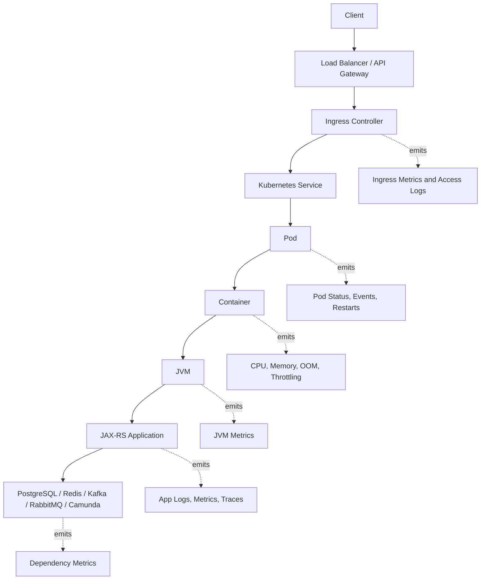

# Part 024 — Kubernetes Observability

## 1. Core Idea

Kubernetes observability adalah kemampuan untuk memahami apakah masalah production berasal dari:

- aplikasi Java/JAX-RS,
- JVM runtime,
- container resource limit,
- pod lifecycle,
- deployment rollout,
- readiness/liveness probe,
- ingress/networking,
- node pressure,
- autoscaling,
- platform configuration,
- atau dependency eksternal.

Banyak incident backend terlihat seperti “API lambat” atau “error 5xx”. Namun root cause-nya bisa berada di Kubernetes:

- pod restart terus,
- container OOMKilled,
- CPU throttling parah,
- readiness probe gagal,
- deployment rollout tidak complete,
- HPA tidak scale cukup cepat,
- node memory pressure,
- ingress timeout,
- service endpoint kosong,
- config/secret salah,
- image baru crash,
- pod scheduled ke node bermasalah.

Untuk senior backend engineer, Kubernetes observability bukan berarti harus menjadi cluster administrator. Tetapi engineer harus mampu membaca signal platform agar tidak salah menyimpulkan bahwa masalah ada di code ketika masalah sebenarnya ada di runtime/deployment/resource/network.

---

## 2. Kubernetes Observability Is Not Just `kubectl get pods`

`kubectl get pods` hanya snapshot. Ia tidak menjawab:

- restart terjadi kapan?
- restart karena OOM, crash, probe failure, atau eviction?
- apakah latency naik karena CPU throttling?
- apakah pod menerima traffic sebelum siap?
- apakah rollout membuat sebagian pod menjalankan versi berbeda?
- apakah HPA terlambat scale?
- apakah node pressure menyebabkan pod unstable?
- apakah ingress 504 berasal dari app timeout atau upstream connectivity?
- apakah readiness failure benar atau probe terlalu agresif?

Kubernetes observability harus menggabungkan:

- Kubernetes object state,
- pod/container metrics,
- kube events,
- application logs,
- JVM metrics,
- request metrics,
- ingress/access logs,
- deployment metadata,
- traces,
- cloud/node metrics.

---

## 3. Signal Layers in Kubernetes



A production symptom must be located across these layers.

Example:

- Client sees 504.
- Ingress logs show upstream timeout.
- Service dashboard shows latency spike.
- Pod metrics show CPU throttling.
- JVM metrics show GC pause increased.
- Deployment marker shows new version.
- Root cause may be new allocation-heavy code under too-low CPU limit.

Without Kubernetes signal, engineer might only see “JAX-RS endpoint slow”.

---

## 4. Core Kubernetes Objects to Observe

### 4.1 Pod

Pod is the scheduling and lifecycle unit. For Java services, pod-level observability answers:

- Is the pod running?
- How long has it been running?
- Did it restart?
- Is it ready?
- Is it receiving traffic?
- Which version/image is running?
- Which node is it on?
- Is it affected by node pressure?

Important signals:

```text
kube_pod_status_phase
kube_pod_status_ready
kube_pod_container_status_restarts_total
kube_pod_container_status_waiting_reason
kube_pod_container_status_terminated_reason
```

### 4.2 Container

Container-level signal answers:

- CPU usage,
- memory usage,
- CPU throttling,
- memory limit pressure,
- OOMKilled,
- filesystem usage,
- container start/stop.

Important signals:

```text
container_cpu_usage_seconds_total
container_cpu_cfs_throttled_seconds_total
container_cpu_cfs_periods_total
container_memory_working_set_bytes
container_memory_usage_bytes
container_memory_rss
container_fs_usage_bytes
```

### 4.3 Deployment

Deployment-level signal answers:

- is rollout complete?
- are desired replicas available?
- are old and new versions mixed?
- did rollout introduce errors?
- did rollback happen?

Important signals:

```text
kube_deployment_status_replicas
kube_deployment_status_replicas_available
kube_deployment_status_replicas_unavailable
kube_deployment_status_observed_generation
kube_deployment_metadata_generation
```

### 4.4 ReplicaSet

ReplicaSet helps debug rollout history and version split.

Important when:

- rollout stuck,
- multiple versions serve traffic,
- old pods not terminating,
- new pods crash loop,
- deployment scaling mismatch.

### 4.5 Service and Endpoints

Service-level observability answers:

- are there ready endpoints?
- are pods selected by service labels?
- did label mismatch remove all endpoints?
- are requests routed to expected pods?

Critical failure:

> Application is healthy, but Service has zero endpoints due to label mismatch or readiness failure.

### 4.6 Ingress

Ingress observability answers:

- request rate,
- response status,
- upstream latency,
- ingress latency,
- 499/502/503/504 patterns,
- TLS errors,
- routing mismatch,
- path rewrite issue,
- upstream endpoint availability.

### 4.7 Node

Node-level observability matters when many pods degrade together.

Signals:

- CPU pressure,
- memory pressure,
- disk pressure,
- network errors,
- kubelet health,
- node readiness,
- eviction events,
- noisy neighbor symptoms.

### 4.8 HPA

Horizontal Pod Autoscaler observability answers:

- did service need scale?
- did HPA scale fast enough?
- did metrics server provide data?
- did max replicas cap scaling?
- did CPU/memory metric reflect real bottleneck?

---

## 5. Pod Status

Pod status is a state summary, but not enough alone.

Common phases:

| Phase | Meaning | Debug angle |
|---|---|---|
| Pending | Pod not scheduled or image not ready | capacity, node selector, PVC, image pull |
| Running | Pod has running containers | still check readiness/restarts |
| Succeeded | completed normally | expected for jobs only |
| Failed | terminated with failure | check container state/reason |
| Unknown | node communication issue | check node/kubelet/network |

For long-running Java/JAX-RS service, `Running` is not equal to healthy. A pod can be running but:

- not ready,
- CPU throttled,
- memory pressured,
- failing requests,
- stuck in GC,
- connected to wrong config,
- receiving no traffic.

---

## 6. Pod and Container Restarts

Restarts are high-signal events. Always ask:

- when did restart start?
- which container restarted?
- what was previous termination reason?
- did restart correlate with deployment?
- did restart correlate with traffic spike?
- did restart correlate with memory usage?
- did restart correlate with liveness probe?

Important reasons:

| Reason | Meaning | Likely investigation |
|---|---|---|
| OOMKilled | Container exceeded memory limit | heap/direct memory/native memory, memory limit |
| Error | Process exited non-zero | startup exception, fatal error |
| Completed | Process exited zero | wrong command for long-running app |
| CrashLoopBackOff | Repeated crash after start | logs, config, secret, dependency, migration |
| ImagePullBackOff | Cannot pull image | registry, tag, credentials |
| Evicted | Node resource pressure | node memory/disk pressure |

Useful command during debugging:

```bash
kubectl describe pod <pod-name> -n <namespace>
kubectl logs <pod-name> -n <namespace> --previous
```

The `--previous` log is often crucial after container restart.

---

## 7. CPU Usage vs CPU Throttling

Java services can have acceptable CPU usage but still experience latency because of CPU throttling.

CPU throttling happens when container wants more CPU than its limit allows. Symptoms:

- request latency spike,
- GC pause appears worse,
- thread pools back up,
- Kafka/RabbitMQ consumers slow,
- readiness probe timeout,
- CPU usage graph looks “not too high” relative to node capacity,
- p99 latency degrades before average CPU looks alarming.

Important signals:

```text
container_cpu_usage_seconds_total
container_cpu_cfs_throttled_seconds_total
container_cpu_cfs_periods_total
```

Approximate throttling ratio:

```text
rate(container_cpu_cfs_throttled_periods_total[5m])
/
rate(container_cpu_cfs_periods_total[5m])
```

Debug questions:

- Is CPU limit too low for JVM workload?
- Did recent deployment increase CPU per request?
- Did traffic increase?
- Are GC threads throttled?
- Are worker threads starved?
- Is HPA using CPU average but max replicas too low?

For Java/JAX-RS services, CPU throttling can masquerade as dependency latency because outbound calls start later or response processing is delayed.

---

## 8. Memory Usage and OOMKilled

OOMKilled means the container exceeded memory limit. For Java, memory is not only heap.

Memory contributors:

- Java heap,
- metaspace,
- direct buffers,
- thread stacks,
- JIT/code cache,
- native memory,
- mmap/file buffers,
- agent overhead,
- TLS/network buffers,
- large request/response payload,
- large serialization/deserialization objects,
- observability agent memory.

Important correlation:

- container memory working set,
- JVM heap usage,
- JVM non-heap usage,
- direct memory if available,
- thread count,
- request volume,
- payload size,
- GC behavior,
- OOMKilled event.

Kubernetes may only tell you `OOMKilled`. JVM logs/metrics tell whether heap was full. If heap was not full, suspect direct/native/thread/agent memory.

Useful checks:

```bash
kubectl describe pod <pod-name> -n <namespace>
kubectl logs <pod-name> -n <namespace> --previous
```

Look for:

- previous termination reason,
- exit code 137,
- last logs before kill,
- GC logs if enabled,
- memory spike timing.

---

## 9. Readiness, Liveness, and Startup Probes

Probe design is one of the most common sources of Kubernetes production failure.

### 9.1 Readiness Probe

Readiness controls whether pod receives traffic.

Use readiness for:

- app has started,
- HTTP server accepts request,
- required local initialization complete,
- service is ready to serve.

Be careful with deep dependency checks. If readiness fails because PostgreSQL has a transient blip, Kubernetes may remove all pods from service endpoints and amplify outage.

### 9.2 Liveness Probe

Liveness controls whether Kubernetes restarts container.

Use liveness for:

- process deadlock/hard failure,
- app cannot recover without restart.

Do not use liveness for ordinary dependency failure. Restarting all pods because DB is slow creates more damage.

### 9.3 Startup Probe

Startup probe protects slow-starting applications from premature liveness failure.

Java apps may need startup probe because of:

- class loading,
- JIT warmup,
- schema migration checks,
- cache initialization,
- large dependency graph,
- observability agent initialization.

### 9.4 Probe Failure Observability

Track:

```text
kube_pod_container_status_waiting_reason
kube_pod_container_status_restarts_total
probe_success_rate
probe_duration_seconds
```

Also inspect Kubernetes events:

```bash
kubectl describe pod <pod-name> -n <namespace>
```

Probe failure must be visible in dashboard because it directly affects traffic routing and restarts.

---

## 10. Deployment Availability and Rollout Observability

Deployment rollout is a frequent incident trigger.

Observe:

- desired replicas,
- updated replicas,
- available replicas,
- unavailable replicas,
- rollout duration,
- old/new version split,
- error rate by version,
- latency by version,
- restart count by version,
- readiness failure by version.

Recommended labels/attributes:

```text
service.name
service.version
deployment.environment
k8s.namespace.name
k8s.deployment.name
k8s.pod.name
container.image.name
container.image.tag
container.image.digest
git.commit.sha
build.id
```

Without version labels, debugging release regression becomes guesswork.

Useful command:

```bash
kubectl rollout status deployment/<deployment-name> -n <namespace>
kubectl rollout history deployment/<deployment-name> -n <namespace>
```

---

## 11. HPA Observability

HPA can hide or create production issues.

Signals to monitor:

- current replicas,
- desired replicas,
- min/max replicas,
- scaling events,
- CPU/memory utilization target,
- custom metric availability,
- time to scale,
- pending pods,
- unschedulable pods,
- application latency during scale.

Failure modes:

- HPA metric missing,
- max replicas too low,
- scaling too slow for burst,
- CPU target does not reflect bottleneck,
- pod startup too slow,
- readiness delay too high,
- node capacity insufficient,
- consumers scaled but partition count limits parallelism.

For Java services, startup time matters. Scaling from 2 to 10 replicas is not useful if new pods take 4 minutes to become ready while traffic spike lasts 2 minutes.

---

## 12. Kubernetes Events

Kubernetes events are high-value operational evidence. They explain what the control plane did.

Examples:

- `Killing container` due to failed liveness probe,
- `Back-off restarting failed container`,
- `FailedScheduling`,
- `FailedMount`,
- `Pulling image`,
- `Failed to pull image`,
- `Unhealthy` readiness/liveness probe,
- `Evicted`,
- `ScalingReplicaSet`,
- `SuccessfulRescale`.

During incident, always check events around the incident window.

Useful command:

```bash
kubectl get events -n <namespace> --sort-by=.lastTimestamp
```

Events have limited retention in many clusters. Do not rely on them as long-term incident record unless your platform exports them to logging/monitoring backend.

---

## 13. Ingress Metrics and Edge Symptoms

Ingress sits between client and service. It can reveal issues before app logs do.

Track:

- request rate,
- status code distribution,
- upstream response time,
- request duration,
- 499/502/503/504,
- upstream connect error,
- TLS handshake issue,
- request body size,
- path/route,
- ingress controller errors,
- backend endpoint availability.

Interpretation:

| Status | Possible meaning |
|---|---|
| 499 | Client closed request before response, often timeout/client impatience |
| 502 | Bad gateway, upstream connection/protocol failure |
| 503 | No available upstream, readiness/endpoints issue, overload |
| 504 | Upstream timeout, app/dependency latency, network issue |

Kubernetes debugging requires joining ingress logs with:

- app request metrics,
- pod readiness,
- endpoint count,
- CPU throttling,
- deployment markers,
- downstream dependency latency.

---

## 14. Java/JAX-RS Specific Kubernetes Concerns

### 14.1 JVM Container Awareness

Modern JVMs are container-aware, but configuration still matters.

Verify:

- heap sizing relative to memory limit,
- direct memory usage,
- metaspace,
- thread stack count,
- GC selection,
- CPU limit impact,
- Java version behavior,
- observability agent overhead.

### 14.2 Thread Pools and Kubernetes Resource Limits

JAX-RS service may have:

- HTTP worker thread pool,
- DB connection pool,
- async executor,
- Kafka/RabbitMQ consumer threads,
- scheduler threads,
- OTel exporter threads,
- GC threads.

If CPU limit is low, too many threads can increase context switching and latency.

If DB pool is larger than effective CPU capacity, service may amplify DB load during spike.

### 14.3 Graceful Shutdown

Kubernetes termination must align with Java service shutdown.

Observe:

- SIGTERM handling,
- readiness set to false before shutdown,
- in-flight request draining,
- Kafka/RabbitMQ consumer stop,
- worker lock release,
- DB transaction completion,
- `terminationGracePeriodSeconds`,
- preStop hook if used.

Bad shutdown can cause:

- request failure during rollout,
- duplicate message processing,
- lost in-flight work,
- stuck workflow job,
- false error spike.

---

## 15. PostgreSQL, Redis, Kafka, RabbitMQ, Camunda from Kubernetes Perspective

A Java service deployed in Kubernetes can fail because its dependency path is degraded.

### PostgreSQL

Kubernetes symptoms:

- pod CPU looks low but request latency high,
- DB connection pool pending rises,
- readiness fails if deep check includes DB,
- HPA scales app and overloads DB further.

### Redis

Symptoms:

- cache latency causes endpoint p99 spike,
- Redis timeout triggers liveness if health check is poorly designed,
- cache miss storm increases DB load.

### Kafka/RabbitMQ

Symptoms:

- consumer pod restarts cause rebalance/redelivery,
- HPA scales consumers but partitions limit throughput,
- CPU throttling increases consumer lag,
- graceful shutdown missing causes duplicate processing.

### Camunda/Workflow

Symptoms:

- worker pods restart and jobs retry,
- timer/job backlog grows,
- workflow incidents spike after deployment,
- rollout mixes worker versions with different behavior.

Kubernetes metrics must be read together with dependency-specific metrics.

---

## 16. Platform Failure Modes

### 16.1 CrashLoopBackOff

Likely causes:

- startup exception,
- missing config,
- missing secret,
- bad image,
- migration failure,
- incompatible Java options,
- agent startup failure,
- dependency required at startup unavailable.

Debug:

```bash
kubectl logs <pod-name> -n <namespace> --previous
kubectl describe pod <pod-name> -n <namespace>
```

Check deployment/config changes.

### 16.2 OOMKilled

Likely causes:

- heap too high for container limit,
- memory leak,
- direct memory leak,
- too many threads,
- large payload,
- cache growth,
- observability agent overhead,
- off-heap/native growth.

Debug:

- compare JVM heap vs container memory,
- check GC logs/metrics,
- check thread count,
- check request payload spike,
- check deployment marker.

### 16.3 Readiness Failure

Likely causes:

- app not started,
- probe path broken,
- probe timeout too low,
- dependency deep check failing,
- CPU throttling,
- GC pause,
- thread starvation.

Impact:

- pod removed from endpoints,
- service capacity reduced,
- ingress may return 503.

### 16.4 Liveness Restart Loop

Likely causes:

- liveness too aggressive,
- app slow under load,
- dependency failure included in liveness,
- GC pause longer than timeout,
- CPU throttling.

Impact:

- Kubernetes restarts app during load,
- incident worsens,
- logs/traces fragmented.

### 16.5 CPU Throttling

Likely causes:

- CPU limit too low,
- traffic spike,
- inefficient code,
- high GC CPU,
- too many threads,
- crypto/compression/serialization cost.

Impact:

- latency spike,
- timeouts,
- readiness/liveness failures,
- consumer lag.

### 16.6 Node Pressure

Likely causes:

- noisy neighbor,
- insufficient node capacity,
- disk pressure,
- memory pressure,
- kubelet issue.

Impact:

- pod eviction,
- scheduling delay,
- intermittent latency,
- unknown pod status.

### 16.7 Service Has No Endpoints

Likely causes:

- readiness false for all pods,
- label selector mismatch,
- pods not scheduled,
- rollout failure,
- namespace/config mistake.

Impact:

- ingress/gateway returns 503,
- application logs may show nothing because traffic never reaches app.

---

## 17. Dashboard Design for Kubernetes Observability

Minimum dashboard sections for Java/JAX-RS service in Kubernetes:

### 17.1 Service Overview

- request rate,
- error rate,
- p50/p95/p99 latency,
- active pods,
- ready pods,
- unavailable pods,
- deployment version.

### 17.2 Pod Health

- pod phase,
- readiness status,
- restart count,
- restart reason,
- pod age,
- pod by node,
- pod by version.

### 17.3 Container Resources

- CPU usage,
- CPU throttling ratio,
- memory working set,
- memory limit percentage,
- OOMKilled count,
- filesystem usage.

### 17.4 JVM Overlay

- heap usage,
- non-heap usage,
- GC pause,
- thread count,
- allocation rate,
- JVM CPU.

### 17.5 Rollout

- desired replicas,
- available replicas,
- unavailable replicas,
- version split,
- deployment marker,
- error/latency by version.

### 17.6 Ingress

- status code distribution,
- upstream latency,
- 499/502/503/504,
- route/path template,
- upstream endpoint errors.

### 17.7 HPA

- current replicas,
- desired replicas,
- min/max replicas,
- scaling events,
- metric availability,
- pending pods.

### 17.8 Node/Platform

- node readiness,
- node CPU/memory pressure,
- pod eviction,
- scheduling failures,
- cluster events.

---

## 18. Alert Design

Good Kubernetes alerts should be symptom-oriented and actionable.

Page-worthy examples:

- service availability SLO burn,
- all pods not ready,
- deployment unavailable for critical service,
- CrashLoopBackOff for majority of replicas,
- OOMKilled repeated for critical service,
- ingress 5xx spike with no ready endpoints,
- CPU throttling causing latency SLO burn,
- HPA at max replicas with high error/latency.

Ticket-worthy examples:

- occasional pod restart,
- CPU throttling above warning but no SLO impact,
- memory usage steadily increasing,
- rollout duration increasing,
- readiness flaps,
- HPA scale events too frequent.

Avoid noisy alerts:

- alert on any single pod restart in large deployment,
- alert on CPU usage alone without saturation/latency,
- alert on memory usage without trend/limit context,
- alert on one failed readiness probe,
- alert with no namespace/service/version labels.

Alert must include:

- namespace,
- service/deployment,
- environment,
- affected replicas,
- version/image,
- symptom,
- likely impact,
- dashboard link,
- runbook link.

---

## 19. Debugging Playbook: API 503/504 in Kubernetes

### Step 1 — Start from Symptom

Identify:

- endpoint,
- status code,
- time window,
- affected tenant/customer if allowed,
- deployment version,
- region/environment.

### Step 2 — Check Ingress

Look at:

- 503 vs 504,
- upstream response time,
- route/path,
- backend endpoint errors,
- ingress controller errors.

Interpretation:

- 503 often suggests no upstream/ready endpoints or overload.
- 504 suggests upstream timeout or app/dependency latency.

### Step 3 — Check Service Endpoints

Ask:

- are there ready endpoints?
- did readiness fail?
- did selector match pods?
- did rollout reduce available replicas?

Commands:

```bash
kubectl get endpoints <service-name> -n <namespace>
kubectl get pods -n <namespace> -l app=<app-label>
```

### Step 4 — Check Pod Restarts and Readiness

Commands:

```bash
kubectl describe pod <pod-name> -n <namespace>
kubectl logs <pod-name> -n <namespace> --previous
```

Look for:

- restart reason,
- probe failures,
- OOMKilled,
- CrashLoopBackOff,
- recent events.

### Step 5 — Check Resource Saturation

Look at:

- CPU usage,
- CPU throttling,
- memory pressure,
- OOMKilled,
- JVM GC,
- thread pool saturation,
- connection pool saturation.

### Step 6 — Check Recent Change

Look at:

- deployment marker,
- image tag/digest,
- config version,
- secret/configmap update,
- HPA changes,
- resource request/limit changes,
- ingress rule changes.

### Step 7 — Check Dependency Health

Look at:

- PostgreSQL latency/pool wait,
- Redis latency,
- Kafka/RabbitMQ lag,
- Camunda failed jobs,
- downstream HTTP dependency latency/error.

### Step 8 — Decide Mitigation

Possible mitigations:

- rollback deployment,
- scale replicas,
- raise resource limits carefully,
- disable bad feature flag,
- adjust readiness/liveness if incorrectly configured,
- restart only affected pods if safe,
- drain traffic,
- fix dependency issue,
- reduce traffic or enable fallback.

---

## 20. Correctness Concerns

Kubernetes metrics can mislead if interpreted incorrectly.

Examples:

- CPU usage average hides throttling.
- Pod `Running` hides readiness false.
- Deployment available hides high error rate in app.
- HPA scaled but new pods not ready.
- Memory graph excludes JVM heap interpretation.
- Service has endpoints but ingress routes wrong path.
- Restart count accumulates since pod start, not per incident window.
- Events may expire before RCA.
- Request success metric at ingress may differ from app status due to retry/proxy behavior.
- Error rate by pod may be skewed if traffic distribution uneven.

Use multiple signals before conclusion.

---

## 21. Performance Concerns

Kubernetes observability must account for measurement overhead:

- too frequent scraping,
- expensive metric cardinality from pod/container labels,
- verbose container logs,
- sidecar/agent CPU and memory overhead,
- OTel collector saturation,
- logging driver bottleneck,
- app blocked by stdout/stderr backpressure in extreme cases,
- dashboard queries across high-cardinality pod labels.

Design principle:

> Use pod/container labels for operational breakdown, but avoid exploding dashboards and alerts by ephemeral pod names unless drilling down.

Dashboards should aggregate by deployment/service/version first, then drill down to pod.

---

## 22. Security and Privacy Concerns

Kubernetes observability can expose sensitive data through:

- environment variables in diagnostics,
- ConfigMap/Secret names,
- command args,
- pod annotations,
- logs with tokens,
- debug endpoints,
- heap/thread dumps,
- ingress headers,
- access logs,
- service account metadata.

Guidelines:

- do not log secrets or env dumps,
- restrict access to pod logs and exec,
- avoid exposing sensitive headers in ingress logs,
- treat heap dumps/thread dumps as sensitive,
- ensure observability agents do not export secrets,
- restrict Kubernetes events/log access according to role.

---

## 23. Cost Concerns

Kubernetes observability cost can grow from:

- per-pod high-cardinality metrics,
- container logs volume,
- ingress access logs,
- Kubernetes events export,
- trace/log enrichment with pod labels,
- short-lived pods creating series churn,
- debug-level logs during incident left enabled,
- verbose sidecar logs,
- long retention for platform logs.

Cost controls:

- aggregate dashboards at service/deployment level,
- retain pod-level detail for shorter windows,
- avoid raw pod UID as long-retention metric dimension unless required,
- sample or filter noisy platform logs,
- review top log emitters,
- monitor OTel collector and logging pipeline cost,
- set retention based on incident/RCA/compliance needs.

---

## 24. PR Review Checklist

Use this when reviewing Kubernetes manifests, Helm charts, deployment config, or application changes affecting runtime behavior.

### Metadata

- Are service/deployment/pod labels consistent?
- Is service version included?
- Is commit SHA/build ID/image digest available?
- Are ownership/team labels present?
- Are environment/namespace labels consistent?

### Probes

- Is startup probe needed for Java startup?
- Is readiness shallow and appropriate?
- Is liveness not dependent on external dependencies?
- Are timeout/failure thresholds realistic?
- Could probes fail during GC pause or CPU throttling?

### Resources

- Are CPU/memory requests set?
- Are CPU/memory limits appropriate?
- Is JVM heap sized below container limit?
- Is direct/native/thread memory considered?
- Could CPU throttling affect latency?

### Deployment Strategy

- Is rolling update configured safely?
- Is maxUnavailable/maxSurge appropriate?
- Is graceful shutdown handled?
- Is terminationGracePeriodSeconds sufficient?
- Are consumers/workers drained safely?

### Observability

- Are metrics scraped?
- Are logs structured?
- Are traces enriched with Kubernetes resource attributes?
- Are deployment markers emitted?
- Are dashboards updated?
- Are alerts/runbooks updated?

### Security

- Are secrets not exposed through env/logs?
- Is service account minimal?
- Is exec/log access restricted?
- Are debug endpoints protected?

### Operational Readiness

- Is rollback possible?
- Are HPA limits reasonable?
- Are node scheduling constraints understood?
- Are dependency failures handled without restart storm?
- Is there a runbook for CrashLoop/OOM/readiness failure?

---

## 25. Internal Verification Checklist

Verify with codebase, manifests, platform/SRE team, senior backend engineers, and security team.

### Cluster and Monitoring Stack

- Which Kubernetes distribution is used?
- Which metric stack collects pod/container metrics?
- Are kube-state-metrics available?
- Are Kubernetes events exported to log backend?
- Which dashboards are official?
- Which alerts are owned by app team vs platform team?

### Labels and Metadata

- What are mandatory labels for service/deployment/pod?
- Is `service.name` standardized?
- Is `service.version` available in logs/metrics/traces?
- Is Git commit SHA/build ID/image digest exposed?
- Are Argo CD/Helm/GitOps labels available?

### Java Runtime

- How is JVM heap sized relative to container memory?
- Are JVM metrics exported?
- Are GC metrics visible?
- Are GC logs enabled or accessible?
- Is CPU throttling tracked on service dashboards?
- Is OOMKilled correlated with JVM memory metrics?

### Probes

- What endpoint backs readiness?
- What endpoint backs liveness?
- Is startup probe used?
- Do probes check dependencies?
- Have probe failures caused incidents?
- Are probe thresholds reviewed for Java startup/GC behavior?

### Rollout and Deployment

- How are deployments marked on dashboards?
- Can error/latency be split by version?
- Is rollback automated or manual?
- Are config/secret changes visible?
- Are migration versions observable?
- Does CI/CD annotate deployments?

### Ingress and Networking

- Which ingress controller/API gateway/load balancer is used?
- Are ingress access logs available?
- Are upstream response times visible?
- Are 499/502/503/504 dashboards available?
- Is X-Forwarded-For policy known?
- Are service endpoints monitored?

### Autoscaling

- Is HPA used?
- Which metrics drive HPA?
- Are min/max replicas reviewed?
- Is startup time considered?
- Are Kafka/RabbitMQ consumers scaled differently from HTTP APIs?
- Are custom metrics used?

### Incident and Runbook

- Is there a runbook for CrashLoopBackOff?
- Is there a runbook for OOMKilled?
- Is there a runbook for readiness failure?
- Is there a runbook for ingress 503/504?
- Is there a runbook for CPU throttling?
- Are Kubernetes events captured in incident timeline?

### Security

- Who can view pod logs?
- Who can exec into pods?
- Are secrets exposed as env vars?
- Are debug endpoints disabled/protected?
- Are heap/thread dumps controlled?
- Are service accounts least privilege?

---

## 26. Senior Engineer Takeaways

Kubernetes observability is not separate from application observability. It is the runtime context that explains why application signals changed.

A senior backend engineer should be able to answer:

- Is the service failing, or is Kubernetes not routing traffic to it?
- Is latency caused by code, GC, CPU throttling, dependency, or ingress timeout?
- Did deployment introduce a version-specific regression?
- Are pods restarting because of app crash, OOM, probe, or node pressure?
- Are readiness/liveness probes helping recovery or amplifying failure?
- Is HPA scaling fast enough and for the right bottleneck?
- Is the dashboard aggregating at the right level?
- Are alerts actionable and tied to runbooks?
- Are Kubernetes labels and deployment metadata sufficient for debugging?

The most useful Kubernetes observability pattern is layered diagnosis:

1. Start from user/API symptom.
2. Check ingress and service endpoints.
3. Check deployment and pod readiness.
4. Check restarts, events, and resource saturation.
5. Overlay JVM and application metrics.
6. Correlate with dependency metrics.
7. Check recent deployment/config changes.
8. Decide mitigation based on evidence.

When Kubernetes observability is strong, production debugging becomes evidence-driven instead of guess-driven.

