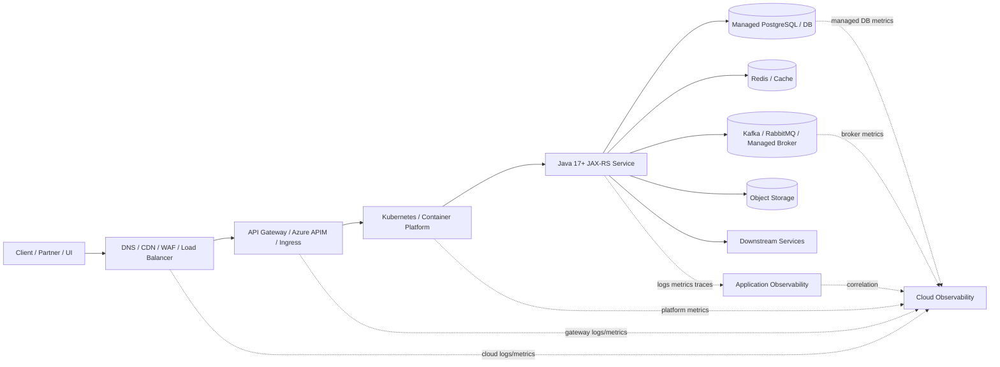

# Cheatsheet Observability Part 025 — Cloud Observability: AWS and Azure

> Fokus part ini: memahami cloud observability sebagai **platform evidence layer** yang melengkapi log, metric, trace, dan audit dari aplikasi Java/JAX-RS. Tujuannya bukan menghafal nama layanan cloud, tetapi mampu menghubungkan gejala production di aplikasi dengan signal compute, network, managed service, identity, gateway, storage, database, broker, dan cloud provider health.

---

## 1. Core Mental Model

Cloud observability adalah kemampuan menjawab pertanyaan seperti:

- Apakah service Java/JAX-RS bermasalah karena bug aplikasi atau karena cloud/platform dependency?
- Apakah latency berasal dari aplikasi, load balancer, ingress, API gateway, database managed service, network, DNS, TLS, private endpoint, atau cloud regional issue?
- Apakah spike error berhubungan dengan deployment, scaling event, node pressure, gateway throttling, secret rotation, certificate expiry, managed broker degradation, atau cloud service health event?
- Apakah customer impact hanya terjadi di region tertentu, tenant tertentu, cluster tertentu, subscription/account tertentu, atau seluruh platform?

Cloud observability bukan pengganti application observability. Ia adalah lapisan bukti tambahan.



Prinsipnya:

- **Application signal** menjawab apa yang terjadi di code path.
- **Platform signal** menjawab apakah runtime dan infrastructure mendukung code path tersebut.
- **Cloud signal** menjawab apakah managed service, network, gateway, region, identity, quota, atau control plane ikut berkontribusi.
- **Audit/control-plane signal** menjawab siapa/apa yang mengubah konfigurasi, permission, network rule, secret, policy, atau deployment.

---

## 2. AWS/Azure Observability Surface

### AWS-oriented surface

Dalam AWS, observability biasanya tersebar di beberapa lapisan:

- **CloudWatch Metrics** untuk metric AWS managed services.
- **CloudWatch Logs** untuk log aplikasi/platform/cloud service.
- **CloudWatch Alarms** untuk threshold, composite alarm, atau anomaly detection sederhana.
- **Container Insights** untuk container/Kubernetes/EKS-oriented signal.
- **AWS X-Ray** jika digunakan sebagai tracing backend atau integrated trace view.
- **CloudTrail** untuk audit/control-plane event.
- **VPC Flow Logs** untuk network-level visibility.
- **ELB/ALB/NLB access logs** untuk edge/load-balancer evidence.
- **WAF logs** untuk blocked/throttled/security-filtered traffic.
- **RDS/Aurora metrics and logs** untuk managed database evidence.
- **MSK/RabbitMQ/ElastiCache metrics** jika managed services digunakan.

### Azure-oriented surface

Dalam Azure, observability biasanya tersebar di:

- **Azure Monitor Metrics** untuk resource metrics.
- **Azure Monitor Logs / Log Analytics Workspace** untuk query log berbasis KQL.
- **Application Insights** untuk APM, request/dependency telemetry, traces, exceptions, dan availability tests jika digunakan.
- **Container Insights** untuk AKS/container workloads.
- **Azure Activity Log** untuk control-plane audit.
- **Diagnostic Settings** untuk mengirim resource logs ke Log Analytics/Event Hub/Storage.
- **Azure Load Balancer / Application Gateway / Front Door logs** untuk edge evidence.
- **Azure API Management metrics/logs** untuk API gateway evidence.
- **NSG Flow Logs / Network Watcher** untuk network visibility.
- **Azure Database for PostgreSQL metrics/logs** untuk managed PostgreSQL evidence.
- **Azure Cache for Redis / Event Hubs / Service Bus metrics** jika relevan.

### Hybrid/on-prem implication

Dalam enterprise hybrid/on-prem, cloud observability sering tidak lengkap jika hanya melihat cloud-native dashboard. Ada boundary seperti:

- traffic dari on-prem ke cloud lewat VPN/ExpressRoute/Direct Connect;
- private endpoint/private link;
- corporate proxy;
- on-prem DNS;
- firewall rule;
- identity federation;
- internal load balancer;
- self-managed Kubernetes;
- log forwarder/collector yang berjalan di network terbatas.

**Production debugging harus sadar boundary.** Banyak incident terlihat seperti aplikasi lambat, padahal root-nya ada di gateway, firewall, DNS, cert, IAM, private endpoint, quota, atau routing.

---

## 3. Cloud Observability vs Application Observability

| Area | Application Observability | Cloud Observability |
|---|---|---|
| Fokus | Code path, request handler, dependency call, exception, business state | Runtime, managed service, network, gateway, account/subscription, quota, region |
| Signal utama | Logs, metrics, traces, audit, business events | Cloud metrics, resource logs, gateway logs, audit logs, service health |
| Pertanyaan | Mengapa endpoint `/quotes/{id}/price` lambat? | Apakah load balancer, APIM, DB managed service, Redis, atau network degrade? |
| Owner umum | Backend team / service owner | Platform/SRE/cloud infra/security/network team |
| Risiko jika hilang | Tidak tahu failure path di aplikasi | Salah menyalahkan aplikasi saat platform/dependency bermasalah |

Keduanya harus dikorelasikan dengan:

- timestamp konsisten;
- environment/region/cluster/service labels;
- deployment version;
- request ID/correlation ID/trace ID jika tersedia;
- resource ID/account/subscription/project;
- tenant/customer/business key bila aman dan diizinkan;
- incident timeline.

---

## 4. Signal Penting di Cloud Layer

### 4.1 Load balancer and gateway metrics

Signal yang penting:

- request count;
- status code distribution;
- 4xx/5xx rate;
- target response time;
- upstream/backend connection error;
- TLS handshake error;
- rejected connection;
- healthy/unhealthy backend target;
- gateway timeout;
- throttling;
- WAF block count;
- request size/response size;
- regional distribution.

Gejala yang bisa dideteksi:

- 502/503/504 sebelum request sampai aplikasi;
- backend target dianggap unhealthy;
- API gateway throttling;
- WAF false positive;
- TLS/certificate issue;
- route/path misconfiguration;
- sudden traffic spike.

### 4.2 Managed database metrics

Untuk PostgreSQL managed service, cloud signal biasanya mencakup:

- CPU utilization;
- memory pressure;
- storage used/free;
- IOPS;
- disk queue depth;
- active connections;
- max connections;
- replication lag;
- deadlock count;
- lock wait indicators jika tersedia;
- slow query logs;
- backup/maintenance event;
- failover event.

Hubungkan dengan application signal:

- connection pool pending tinggi;
- query latency naik;
- transaction duration naik;
- HTTP latency naik;
- retry/timeouts ke DB;
- DB lock/deadlock error logs.

### 4.3 Managed cache metrics

Untuk Redis/cache service:

- cache hit/miss;
- command latency;
- CPU;
- memory usage;
- eviction;
- connected clients;
- blocked clients;
- replication lag;
- network bytes in/out;
- server-side errors;
- failover event.

Gejala umum:

- cache hit ratio turun menyebabkan DB load naik;
- eviction storm menyebabkan latency aplikasi naik;
- Redis timeout menyebabkan fallback path aktif;
- memory pressure menyebabkan key churn;
- failover menyebabkan spike transient errors.

### 4.4 Managed broker metrics

Untuk Kafka/RabbitMQ/Event Hubs/Service Bus/MSK/broker lain:

- produce/publish rate;
- consume rate;
- queue depth / consumer lag;
- unacked messages;
- redelivery;
- dead-letter count;
- broker CPU/memory/disk;
- partition health;
- connection count;
- throttling;
- message age;
- broker maintenance/failover event.

Gejala umum:

- consumer lag naik setelah deployment;
- queue depth naik karena downstream DB lambat;
- redelivery loop karena poison message;
- DLQ spike karena schema/config change;
- broker throttling karena quota atau partition imbalance.

### 4.5 Object storage and artifact storage metrics

Untuk object storage atau blob storage:

- request count;
- error count;
- 4xx/5xx;
- latency;
- throttling;
- storage usage;
- lifecycle rule behavior;
- access denied events;
- encryption/key-management errors.

Relevansi untuk backend enterprise:

- generated quote document gagal diambil;
- order attachment gagal di-upload;
- export/import batch gagal;
- reconciliation file terlambat;
- signed URL expired;
- permission policy berubah.

### 4.6 Secret/config service metrics

Untuk secret manager/config store/key vault:

- request latency;
- error rate;
- access denied;
- throttling;
- secret rotation event;
- certificate expiry;
- key disabled/deleted;
- identity permission failure.

Gejala umum:

- aplikasi gagal start karena secret tidak bisa diambil;
- runtime refresh config gagal;
- TLS/mTLS/cert issue;
- token signing/validation gagal;
- sudden 401/403 ke dependency.

### 4.7 Cloud audit and control-plane logs

Cloud audit/control-plane logs menjawab:

- siapa mengubah security group/network security group;
- siapa mengubah route table/private endpoint;
- siapa mengubah IAM/role/policy;
- siapa rotate/delete secret;
- siapa scale DB/broker/cache;
- siapa deploy/change gateway route;
- siapa disable alarm/logging;
- kapan maintenance/failover terjadi.

Dalam RCA, audit signal sering menjadi pembeda antara:

- application regression;
- infrastructure change;
- security policy change;
- cloud provider maintenance;
- manual hotfix;
- GitOps drift;
- unauthorized or accidental change.

---

## 5. Java/JAX-RS Service Perspective

Dari sudut pandang Java/JAX-RS service, cloud observability harus membantu menjawab:

1. Apakah request sampai ke resource method?
2. Jika tidak, berhenti di mana: WAF, load balancer, API gateway, ingress, service mesh, network policy, DNS, TLS?
3. Jika sampai, apakah latency berasal dari code, DB, Redis, broker, downstream HTTP, thread pool, GC, CPU throttling, atau cloud dependency?
4. Apakah error response dari aplikasi atau dari edge/gateway?
5. Apakah error hanya terjadi untuk region/cluster/account tertentu?
6. Apakah ada recent cloud config change?
7. Apakah ada quota/throttle limit tercapai?
8. Apakah managed service mengalami maintenance/failover/degradation?

### 5.1 Request path correlation

Request path yang ideal secara observability:

```text
Client
  -> DNS/CDN/WAF
  -> Load Balancer
  -> API Gateway/APIM/Ingress
  -> Kubernetes Service
  -> Pod / Java JAX-RS app
  -> DB / Redis / Kafka / RabbitMQ / downstream
```

Setiap boundary minimal harus punya:

- timestamp;
- status code/result;
- latency/duration;
- resource identity;
- environment/region;
- request/correlation/trace ID bila memungkinkan;
- backend target identity;
- error reason/status.

### 5.2 JAX-RS-specific implication

Di aplikasi JAX-RS:

- request log di `ContainerRequestFilter` hanya muncul jika request sudah masuk aplikasi;
- access log gateway/load balancer bisa muncul walaupun aplikasi tidak menerima request;
- `ExceptionMapper` hanya terlihat jika exception terjadi setelah masuk JAX-RS pipeline;
- timeout di gateway bisa terjadi meskipun aplikasi akhirnya selesai memproses request;
- client disconnect bisa terlihat sebagai 499/connection reset di edge, tetapi aplikasi mungkin tidak sadar dengan jelas;
- async response/streaming response bisa membuat durasi edge dan durasi application tidak sama.

### 5.3 Recommended fields for cloud-aware application logs

Aplikasi sebaiknya mengeluarkan field yang membantu cloud correlation:

```json
{
  "timestamp": "2026-07-11T12:01:03.456Z",
  "level": "INFO",
  "service.name": "quote-service",
  "service.version": "1.42.7",
  "deployment.environment": "prod",
  "cloud.provider": "aws-or-azure",
  "cloud.region": "internal-verify",
  "k8s.cluster.name": "internal-verify",
  "k8s.namespace.name": "quote-order",
  "k8s.pod.name": "quote-service-abc123",
  "http.request.method": "POST",
  "http.route": "/quotes/{quoteId}/price",
  "http.response.status_code": 200,
  "trace_id": "...",
  "correlation_id": "...",
  "quote_id": "masked-or-policy-approved"
}
```

Catatan: field cloud/k8s harus mengikuti standard internal atau OpenTelemetry semantic conventions bila digunakan. Jangan mengarang nama field internal tanpa verifikasi.

---

## 6. Debugging Pattern: Is It App, Platform, Cloud, or Dependency?

Gunakan urutan berikut saat incident.

### Step 1 — Confirm customer symptom

Tentukan:

- endpoint/business flow terdampak;
- tenant/customer/region terdampak;
- time window;
- error message/status yang terlihat user;
- apakah issue intermittent atau total outage.

### Step 2 — Check edge/gateway signal

Cari:

- request count berubah?
- 4xx/5xx naik?
- 502/503/504 naik?
- WAF block naik?
- gateway throttling?
- backend target unhealthy?
- request latency naik sebelum aplikasi?

Jika edge error naik tetapi aplikasi log tidak naik, kemungkinan masalah sebelum aplikasi.

### Step 3 — Check application signal

Cari:

- request count di service;
- error count/status code;
- exception logs;
- p95/p99 latency;
- thread pool saturation;
- JVM/GC pressure;
- connection pool wait;
- trace breakdown.

Jika aplikasi menerima request dan latency naik di span dependency, lanjut ke dependency/cloud signal.

### Step 4 — Check managed dependency signal

Cari:

- DB CPU/connection/lock/IOPS;
- Redis latency/memory/eviction;
- Kafka/RabbitMQ lag/queue depth/unacked/DLQ;
- downstream API status/latency;
- cloud quota/throttle.

### Step 5 — Check platform signal

Cari:

- pod restart;
- OOMKilled;
- CPU throttling;
- node pressure;
- HPA scaling;
- rollout event;
- readiness/liveness failure;
- collector/log forwarder issue.

### Step 6 — Check change and audit signal

Cari:

- recent deployment;
- config change;
- feature flag change;
- gateway route change;
- security/network policy change;
- secret rotation;
- managed service failover/maintenance;
- cloud provider health event.

---

## 7. Common Cloud Failure Modes

| Failure mode | Symptom | Signal to inspect |
|---|---|---|
| Load balancer target unhealthy | 502/503, no app log | LB target health, readiness, pod status |
| Gateway timeout | 504, app may still run | Gateway latency, app duration, trace, downstream spans |
| WAF false positive | sudden 403 | WAF logs, rule ID, request pattern |
| API throttling | 429 or gateway-specific error | Gateway/APIM metrics, quota policy, traffic spike |
| DB managed service pressure | high latency, timeouts | DB CPU/IOPS/connections/locks, app pool wait |
| Redis failover/eviction | cache errors, latency spike | Redis failover event, memory, eviction, command latency |
| Broker backlog | delayed processing | consumer lag, queue depth, message age, consumer errors |
| Secret rotation failure | startup/runtime auth failures | key vault/secret manager logs, IAM/managed identity errors |
| Network route/firewall change | dependency timeout | VPC/NSG flow logs, route table, private endpoint, DNS |
| Cloud regional degradation | multi-service symptoms | cloud service health, region-specific dashboards |
| Quota exhaustion | throttling, provisioning failure | quota metrics, cloud activity logs, service-specific errors |
| Log pipeline failure | missing logs | collector/log forwarder health, ingestion errors |

---

## 8. Dashboard Design for Cloud Observability

A useful cloud observability dashboard should not be a random resource inventory. It should answer operational questions.

### 8.1 Service-cloud overview dashboard

Include:

- service request rate/error/latency;
- load balancer/gateway request rate/error/latency;
- pod health/restarts;
- DB health summary;
- Redis health summary;
- broker/queue health summary;
- downstream dependency health;
- deployment marker;
- cloud region/account/subscription;
- known service health events.

### 8.2 Edge/gateway dashboard

Include:

- total requests;
- status code breakdown;
- 4xx/5xx;
- 429/throttling;
- 502/503/504;
- WAF blocks;
- upstream latency;
- backend target health;
- top routes/templates;
- client geography/source if allowed;
- error by route.

### 8.3 Managed dependency dashboard

Include:

- DB CPU/connections/IO/locks/latency;
- Redis memory/latency/eviction/hit ratio;
- broker lag/queue depth/DLQ/message age;
- object storage errors/latency;
- secret/config service errors;
- downstream service health.

### 8.4 Cloud change/audit dashboard

Include:

- recent control-plane changes;
- deployment/config changes;
- security/network changes;
- secret/certificate changes;
- scaling/failover/maintenance events;
- alarm changes;
- logging/diagnostic setting changes.

---

## 9. Alerting Guidance

Cloud alerts should be actionable and mapped to ownership.

### Good cloud alerts

- Load balancer backend unhealthy for service X.
- Gateway 5xx above SLO burn threshold.
- API throttling affecting production traffic.
- DB connection utilization near max and app pool wait rising.
- Redis eviction spike with cache miss spike.
- Kafka/RabbitMQ lag/message age above business threshold.
- Secret/certificate close to expiry.
- Cloud diagnostic/log ingestion failure.
- Managed service failover detected.
- Cloud provider health event affecting region used by production.

### Weak cloud alerts

- CPU above 70% without impact context.
- Any 4xx count above arbitrary threshold.
- Every single platform warning as page.
- DB metric alert with no service/customer impact hint.
- Duplicate cloud + application alerts with no deduplication.

### Severity mapping

Use this heuristic:

- **Page:** customer-facing availability/latency/error impact, SLO burn, data integrity risk, security risk.
- **Ticket:** capacity trend, non-urgent quota, noisy dependency, dashboard gap, non-critical diagnostic failure.
- **Info:** expected scaling, low-risk maintenance, known transient cloud events.

---

## 10. Correctness, Performance, Security, Cost, and Operational Concerns

### Correctness concerns

- Cloud metrics may be delayed or aggregated differently than application metrics.
- Gateway 5xx may not equal application 5xx.
- Application sees route template; edge may see raw path.
- Timezone/timestamp mismatch can break timeline reconstruction.
- Sampling may hide traces during incident.
- Multi-region dashboards can hide one-region degradation.

### Performance concerns

- Excessive diagnostic logging can increase cost and ingestion latency.
- Synchronous telemetry export from app can add latency.
- Overly deep health checks can overload dependencies.
- Cloud log queries over huge retention windows can be slow and expensive.

### Security/privacy concerns

- Gateway logs may contain query strings or headers.
- WAF logs may capture payload snippets.
- API gateway tracing may contain sensitive headers.
- Object storage logs may expose object key naming patterns.
- Cloud audit logs need access control.
- Cross-team dashboards must avoid exposing tenant/customer-sensitive data.

### Cost concerns

- High-volume access logs can dominate observability cost.
- WAF/gateway logs may be expensive at high traffic.
- Long retention for all logs is often unnecessary.
- High-cardinality resource labels can increase metric cost.
- Trace export from every request can be expensive without sampling.

### Operational concerns

- Alerts need clear owner: app team, platform, SRE, cloud infra, network, security.
- Cloud dashboards should link to application dashboards and runbooks.
- Cloud control-plane changes need audit visibility during incident.
- Hybrid/on-prem dependencies need explicit runbooks.
- Diagnostic settings must be monitored; missing logs during incident is itself an incident risk.

---

## 11. Internal Verification Checklist

Gunakan checklist ini di CSG/team tanpa mengasumsikan stack internal.

### Cloud platform inventory

- Cloud provider yang digunakan: AWS, Azure, keduanya, on-prem, atau hybrid?
- Apakah service berjalan di Kubernetes managed, self-managed, VM, atau platform internal?
- Region/account/subscription/resource group mana yang relevan?
- Apakah ada multi-region, active-active, active-passive, atau DR setup?

### Observability tools

- Platform log backend apa yang dipakai?
- Metric backend apa yang dipakai?
- Trace backend apa yang dipakai?
- Apakah CloudWatch/Azure Monitor langsung dipakai atau dikirim ke tool observability lain?
- Apakah Application Insights, X-Ray, Grafana, Prometheus, Datadog, Splunk, Elastic, New Relic, atau vendor lain digunakan?
- Apakah OpenTelemetry Collector digunakan sebagai pipeline?

### Edge/gateway

- Load balancer apa yang melayani traffic production?
- API gateway/APIM/ingress apa yang digunakan?
- Apakah WAF aktif?
- Apakah access log enabled?
- Apakah request ID/correlation ID diteruskan ke aplikasi?
- Bagaimana membaca 499/502/503/504 di stack internal?

### Managed services

- PostgreSQL managed/self-managed?
- Redis managed/self-managed?
- Kafka/RabbitMQ managed/self-managed?
- Object storage apa yang digunakan?
- Secret/config service apa yang digunakan?
- Metrics/logs apa yang sudah enabled untuk tiap dependency?

### Audit/change visibility

- Di mana melihat deployment history?
- Di mana melihat config changes?
- Di mana melihat cloud control-plane changes?
- Siapa boleh mengubah gateway/network/security policy?
- Apakah perubahan manual di cloud dicegah atau minimal diaudit?
- Apakah GitOps drift terdeteksi?

### Alert/runbook

- Alert cloud apa yang page app team?
- Alert cloud apa yang page platform/SRE?
- Alert apa yang hanya ticket?
- Apakah alert cloud punya runbook?
- Apakah cloud alert deduplicated dengan app alert?
- Apakah incident lama menunjukkan missing cloud signal?

---

## 12. PR Review Checklist

Saat PR/ADR menyentuh cloud/platform integration, tanyakan:

- Apakah service/resource baru punya metric/log/trace visibility?
- Apakah dashboard diperbarui?
- Apakah alert diperlukan?
- Apakah diagnostic setting/log export sudah disiapkan?
- Apakah resource labels/tags sesuai standard?
- Apakah deployment version/commit/config metadata terlihat?
- Apakah gateway/load balancer route baru observable?
- Apakah cloud dependency timeout/retry/circuit breaker observable?
- Apakah secret/certificate/config dependency punya failure signal?
- Apakah ada PII/token/header leakage di cloud logs?
- Apakah log volume dan retention masuk akal?
- Apakah runbook diperbarui?

---

## 13. Practical Debugging Questions

Saat incident, gunakan pertanyaan cepat ini:

1. Apakah request muncul di edge/gateway log?
2. Apakah request muncul di application log?
3. Apakah trace menunjukkan waktu habis di app atau dependency?
4. Apakah platform menunjukkan restart/OOM/CPU throttling?
5. Apakah DB/Redis/broker menunjukkan pressure?
6. Apakah ada gateway/WAF/throttling error?
7. Apakah ada recent deployment/config/cloud change?
8. Apakah issue region/account/cluster-specific?
9. Apakah cloud provider health menunjukkan degradation?
10. Apakah semua signal memakai timestamp dan timezone yang bisa dikorelasikan?

---

## 14. Summary

Cloud observability adalah lapisan bukti yang menjelaskan kondisi platform, managed services, gateway, network, cloud resource, audit/control-plane, dan provider health. Untuk senior backend engineer, kemampuan utamanya bukan sekadar membuka CloudWatch atau Azure Monitor, tetapi menghubungkan cloud signal dengan application logs, metrics, traces, deployment markers, dan business impact.

Prinsip final:

- Jangan menyalahkan aplikasi sebelum mengecek edge, platform, dependency, dan cloud change.
- Jangan menyalahkan cloud sebelum mengecek application trace, error logs, deployment, dan resource usage.
- Semua signal harus bisa membentuk timeline yang sama.
- Cloud observability yang baik mempercepat triage, memperkecil blame game, dan meningkatkan kualitas RCA.

