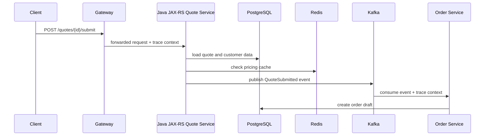

# Cheatsheet Observability Part 026 — Distributed Tracing Foundation

> Fokus part ini: memahami distributed tracing sebagai model untuk merekonstruksi **causal execution path** di sistem microservices. Tracing bukan sekadar diagram cantik; tracing adalah alat untuk menjawab: request berjalan lewat service mana, dependency mana yang lambat, error terjadi di mana, context putus di mana, dan bagaimana satu aksi bisnis menyebar ke HTTP, database, Redis, Kafka/RabbitMQ, workflow, dan background job.

---

## 1. Core Mental Model

Distributed tracing memodelkan satu perjalanan kerja sebagai **trace**.

Trace terdiri dari banyak **span**.

Setiap span merepresentasikan satu unit kerja:

- menerima HTTP request;
- menjalankan JAX-RS resource method;
- memanggil service layer;
- menjalankan query database;
- memanggil Redis;
- publish event ke Kafka/RabbitMQ;
- consume event;
- menjalankan background job;
- memanggil downstream HTTP service;
- menjalankan workflow task.



Dalam trace view, sequence di atas idealnya terlihat sebagai satu trace tree:

```text
Trace: quote-submit-flow
└── Span: HTTP POST /quotes/{quoteId}/submit           [Quote Service]
    ├── Span: DB SELECT quote                          [PostgreSQL]
    ├── Span: Redis GET pricing-cache                  [Redis]
    ├── Span: Kafka PRODUCE quote-submitted            [Kafka]
    └── Span: async boundary / event consumed later
        └── Span: Kafka CONSUME quote-submitted        [Order Service]
            └── Span: DB INSERT order_draft            [PostgreSQL]
```

Trace membantu menjawab:

- Apakah request masuk service?
- Service mana yang dipanggil?
- Dependency mana yang paling lambat?
- Apakah error berasal dari endpoint, DB, Redis, broker, atau downstream?
- Apakah retry terjadi?
- Apakah context trace putus di async boundary?
- Apakah trace ini mewakili customer/business transaction penting?

---

## 2. Tracing vs Logging vs Metrics

| Signal | Kekuatan | Kelemahan |
|---|---|---|
| Logs | Detail event, error, context, human-readable evidence | Sulit melihat end-to-end latency tanpa correlation |
| Metrics | Trend, aggregate health, alerting, SLO | Tidak menjelaskan satu request spesifik |
| Traces | End-to-end causal path dan latency breakdown | Sampling bisa menyembunyikan kasus, detail bisnis terbatas |

Gunakan ketiganya bersama:

- Metric mengatakan: `p99 latency endpoint naik`.
- Trace menunjukkan: `80% waktu habis di PostgreSQL query`.
- Log menjelaskan: `query memakai fallback path karena pricing rule missing`.
- Audit menunjukkan: `pricing rule diubah 12 menit sebelum incident`.

---

## 3. Core Concepts

### 3.1 Trace

Trace adalah representasi satu execution flow end-to-end.

Contoh:

- satu HTTP request dari gateway ke quote service;
- satu quote submit flow yang mem-publish event;
- satu order fulfillment flow across services;
- satu scheduled reconciliation job;
- satu message consumption flow;
- satu workflow task execution.

Trace punya `trace_id`.

`trace_id` harus stabil sepanjang flow agar log, span, dan event dapat dikorelasikan.

### 3.2 Span

Span adalah satu unit kerja dalam trace.

Span biasanya punya:

- `span_id`;
- `parent_span_id`;
- `trace_id`;
- name;
- start time;
- end time;
- duration;
- attributes;
- events;
- status;
- error info jika terjadi error.

Contoh span name:

```text
HTTP POST /quotes/{quoteId}/price
JDBC SELECT quote
Redis GET pricing-cache
Kafka PRODUCE quote-priced
RabbitMQ CONSUME fulfillment-request
HTTP GET /customer/{customerId}
```

### 3.3 Root span

Root span adalah span paling atas dalam trace.

Biasanya:

- inbound HTTP request;
- message consumption jika trace dimulai dari event;
- scheduled job execution;
- workflow worker execution.

Root span menjawab: flow ini dimulai dari mana?

### 3.4 Parent and child span

Child span merepresentasikan pekerjaan yang terjadi di dalam parent span.

Contoh:

```text
Parent: HTTP POST /quotes/{id}/price
  Child: validate quote
  Child: DB SELECT quote_items
  Child: HTTP POST pricing-engine/calculate
  Child: DB UPDATE quote_price
```

Parent-child relationship membantu melihat causal chain dan latency breakdown.

### 3.5 Span context

Span context adalah identitas tracing yang perlu dipropagasikan antar boundary.

Biasanya mencakup:

- trace ID;
- span ID;
- trace flags;
- trace state;
- baggage jika digunakan.

Span context dikirim melalui:

- HTTP headers;
- Kafka message headers;
- RabbitMQ message headers;
- async executor context;
- workflow/job metadata;
- internal context object.

### 3.6 Trace ID

Trace ID adalah identitas global untuk satu trace.

Gunanya:

- mencari semua span dalam trace;
- menghubungkan logs dengan trace;
- menghubungkan incident evidence across services;
- melihat end-to-end latency.

Trace ID berbeda dari request ID/correlation ID, walaupun sering dikorelasikan.

### 3.7 Span ID

Span ID adalah identitas satu span.

Gunanya:

- membangun tree parent-child;
- menghubungkan log event dengan span aktif;
- menemukan unit kerja spesifik yang error/lambat.

### 3.8 Span attributes

Attributes adalah metadata pada span.

Contoh:

```text
http.request.method=POST
http.route=/quotes/{quoteId}/price
http.response.status_code=200
db.system=postgresql
db.operation=SELECT
messaging.system=kafka
messaging.destination.name=quote-events
server.address=pricing-service
error.type=TimeoutException
```

Attributes harus:

- queryable;
- low-cardinality jika dipakai untuk agregasi;
- tidak mengandung PII/secrets;
- mengikuti semantic convention bila tersedia;
- cukup spesifik untuk debugging.

### 3.9 Span events

Span event adalah titik kejadian di dalam span.

Contoh:

- retry started;
- fallback path selected;
- validation failed;
- circuit breaker open;
- cache miss;
- message redelivered;
- workflow incident created.

Gunakan span event untuk kejadian penting yang menjelaskan perubahan path, bukan untuk mengganti log detail.

### 3.10 Span status

Span status menunjukkan hasil span.

Umumnya:

- unset/ok untuk sukses;
- error untuk failure.

Penting: tidak semua HTTP 4xx harus dianggap tracing error.

Contoh:

- `400 validation error` mungkin expected client/domain error;
- `401/403` bisa expected security rejection;
- `404` bisa expected untuk lookup tertentu;
- `500/502/503/504` lebih sering error operational.

Status span harus konsisten dengan error taxonomy internal.

### 3.11 Baggage

Baggage adalah context key-value yang ikut dipropagasikan bersama trace.

Gunakan sangat hati-hati.

Potensi penggunaan:

- tenant tier;
- business flow name;
- safe routing hint;
- feature flag cohort.

Hindari:

- user ID mentah;
- email;
- token;
- secret;
- quote/order ID jika policy melarang;
- data high-cardinality yang memperbesar cost;
- data yang tidak boleh dipercaya dari external caller.

Baggage bisa menyebar lintas service. Salah isi baggage bisa menjadi leakage sistemik.

---

## 4. Context Propagation

Distributed tracing hanya bekerja jika context ikut bergerak antar boundary.

### 4.1 HTTP propagation

Untuk HTTP, context biasanya dikirim via header, misalnya W3C Trace Context:

```text
traceparent: 00-<trace-id>-<span-id>-<flags>
tracestate: <vendor/internal state>
```

Aplikasi JAX-RS harus:

- menerima incoming trace context dari gateway/service upstream;
- membuat server span;
- membuat child span untuk dependency calls;
- mengirim context ke downstream HTTP client;
- memasukkan trace ID/span ID ke logs melalui MDC jika standard internal mendukung.

### 4.2 Messaging propagation

Untuk Kafka/RabbitMQ:

- producer harus inject trace context ke message headers;
- consumer harus extract trace context dari message headers;
- consumer span sebaiknya terhubung ke producer span atau setidaknya linked dengan trace/event asal;
- retry/DLQ harus mempertahankan context bila aman dan sesuai standard.

Async boundary membuat tracing lebih rumit karena producer dan consumer tidak berada dalam call stack yang sama.

### 4.3 Executor/thread propagation

Dalam Java:

- ThreadLocal/MDC tidak otomatis ikut ke thread pool;
- `CompletableFuture`, executor, scheduler, virtual thread, dan async callbacks perlu strategi propagation;
- context harus dibersihkan setelah task selesai;
- context leak bisa membuat log/trace salah milik request lain.

### 4.4 Workflow/job propagation

Untuk Camunda/background job:

- process instance ID bisa menjadi business correlation key;
- trace context mungkin perlu disimpan sebagai process variable/header metadata jika sesuai policy;
- job execution span harus punya relation ke business process;
- scheduled job root span harus punya job name, trigger time, batch ID, dan result.

---

## 5. Trace Design for Java/JAX-RS Backend

### 5.1 Inbound HTTP span

Inbound span harus menjawab:

- service apa yang menerima request?
- endpoint template apa?
- method HTTP apa?
- status code apa?
- durasi berapa?
- error apa jika gagal?
- deployment version apa?
- environment/region/cluster apa?

Contoh span attributes:

```text
service.name=quote-service
service.version=1.42.7
deployment.environment=prod
http.request.method=POST
http.route=/quotes/{quoteId}/price
http.response.status_code=200
server.address=quote-service
url.scheme=https
```

Hindari raw URL path jika mengandung ID/customer data dan bisa menyebabkan cardinality explosion.

### 5.2 Resource method span

Auto-instrumentation sering membuat server span di servlet/JAX-RS boundary. Manual span tambahan di resource method hanya perlu jika:

- resource method punya beberapa logical phase;
- ada domain operation penting;
- perlu membedakan validation, pricing, approval, persistence, event publish;
- trace default terlalu dangkal.

Jangan membuat span terlalu granular untuk setiap method kecil. Trace noise memperlambat debugging.

### 5.3 Service layer span

Manual service layer span berguna untuk domain operation:

```text
quote.validate
quote.price
quote.submit
order.decompose
fulfillment.dispatch
fallout.create
```

Gunakan saat span tersebut menjawab pertanyaan production:

- phase mana yang lambat?
- rule apa yang menyebabkan fallback?
- domain transition mana yang gagal?
- apakah retry terjadi?

### 5.4 Dependency span

Dependency span penting untuk:

- PostgreSQL/JDBC;
- Redis;
- Kafka/RabbitMQ;
- downstream HTTP;
- cloud SDK;
- external integration;
- file/object storage;
- secret/config service.

Dependency span harus cukup menjelaskan:

- dependency name;
- operation;
- duration;
- status/error;
- retry/fallback behavior;
- sanitized attributes.

---

## 6. Sampling

Tracing hampir selalu membutuhkan sampling di production karena volume bisa sangat besar.

### 6.1 Head sampling

Keputusan sampling dibuat di awal trace.

Kelebihan:

- sederhana;
- murah;
- mudah diprediksi.

Kelemahan:

- bisa melewatkan trace error/slow request karena keputusan dibuat sebelum tahu hasil.

### 6.2 Tail sampling

Keputusan sampling dibuat setelah trace selesai atau cukup diketahui.

Kelebihan:

- bisa menyimpan error traces;
- bisa menyimpan slow traces;
- bisa menyimpan business-critical traces;
- lebih cocok untuk debugging incident.

Kelemahan:

- butuh collector/pipeline lebih kompleks;
- memerlukan buffering;
- lebih mahal;
- ada risiko dropped trace jika collector pressure.

### 6.3 Sampling policy yang baik

Pertimbangkan rule:

- simpan semua trace dengan error 5xx;
- simpan trace di atas latency threshold;
- simpan trace untuk endpoint critical;
- simpan trace untuk business-critical flow seperti quote submit/order submit;
- sample normal traffic dengan rate rendah;
- naikkan sampling sementara saat incident dengan proses jelas;
- jangan sample audit evidence jika audit memerlukan completeness; audit log berbeda dari trace.

### 6.4 Sampling risk

Sampling bisa menyebabkan:

- trace untuk customer complaint tidak tersedia;
- rare race condition hilang;
- event consumer failure tidak terlihat;
- root span tersedia tetapi child span missing;
- log punya trace ID tetapi trace tidak ditemukan;
- RCA lemah karena evidence tidak lengkap.

Karena itu, log dan metric tetap wajib. Trace bukan satu-satunya evidence.

---

## 7. Trace Reasoning Patterns

### 7.1 Latency breakdown

Pertanyaan:

> Endpoint lambat karena apa?

Trace reasoning:

1. Lihat root span duration.
2. Cari child span terlama.
3. Bandingkan DB, Redis, downstream HTTP, broker publish, service layer span.
4. Cari gap antara child spans; gap bisa berarti CPU work, lock, serialization, thread wait, or missing instrumentation.
5. Cocokkan dengan JVM/thread/CPU metrics.

### 7.2 Error origin

Pertanyaan:

> Error berasal dari service ini atau dependency?

Trace reasoning:

1. Cari span pertama yang status error.
2. Lihat exception/error attributes.
3. Lihat apakah parent span hanya propagate error.
4. Cek log dengan trace ID.
5. Cek dependency dashboard.

### 7.3 Context break

Pertanyaan:

> Mengapa trace berhenti di Kafka producer dan tidak lanjut ke consumer?

Trace reasoning:

- Apakah producer inject header?
- Apakah consumer extract header?
- Apakah retry/DLQ mempertahankan header?
- Apakah consumer library auto-instrumented?
- Apakah batch consumer membuat span per message atau per batch?
- Apakah header dihapus oleh middleware?
- Apakah sampling membuat consumer span tidak tersimpan?

### 7.4 Hidden work / missing span

Pertanyaan:

> Root span 5 detik, tapi child spans hanya total 500ms. Sisanya ke mana?

Kemungkinan:

- CPU-bound work tanpa span;
- thread pool wait;
- lock contention;
- serialization/deserialization;
- template rendering/file generation;
- large payload processing;
- GC pause;
- missing instrumentation;
- blocking call yang tidak di-instrument.

### 7.5 Async causality

Pertanyaan:

> Quote submit cepat, tapi order baru muncul 10 menit kemudian. Di mana delay?

Trace alone mungkin tidak cukup. Kombinasikan:

- producer span;
- broker publish metric;
- consumer lag/message age;
- consumer span;
- DLQ/retry log;
- workflow/job metrics;
- business state aging metric.

---

## 8. Trace Attributes: Good vs Bad

### Good attributes

```text
http.route=/orders/{orderId}/submit
http.request.method=POST
http.response.status_code=202
service.name=order-service
db.system=postgresql
db.operation=SELECT
messaging.system=kafka
messaging.destination.name=order-events
error.type=TimeoutException
business.flow=quote-to-order
```

Good attributes are:

- stable;
- low-cardinality;
- queryable;
- privacy-safe;
- semantically meaningful;
- useful for grouping.

### Risky attributes

```text
http.url=/orders/ORD-123456789/customer/john@example.com
user.email=john@example.com
authorization=Bearer abc.def.ghi
order.id=ORD-123456789
sql.statement=SELECT * FROM customer WHERE email = 'john@example.com'
error.message=Full message containing dynamic IDs and PII
```

Risk:

- PII leakage;
- secret leakage;
- high cardinality;
- query cost;
- compliance breach;
- unsafe cross-team visibility.

Business keys may be useful, but must follow internal policy. For CPQ/order systems, quote ID/order ID can be powerful correlation keys, but they may also be sensitive commercial identifiers.

---

## 9. Tracing Across Common Components

### 9.1 PostgreSQL/JDBC

Trace should show:

- DB operation;
- sanitized statement or operation name;
- latency;
- error;
- connection/pool wait if instrumented;
- transaction boundary if relevant.

Avoid raw SQL parameters if sensitive.

### 9.2 MyBatis/JPA/Hibernate

Challenges:

- generated SQL may be verbose;
- lazy loading can create hidden queries;
- N+1 query problem appears as many child spans;
- transaction spans may be missing;
- SQL parameter logging may leak data.

Trace can reveal:

- too many queries per request;
- slow query phase;
- unexpected lazy load;
- flush/commit latency;
- lock wait symptoms.

### 9.3 Redis

Trace should show:

- command type;
- latency;
- cache hit/miss event if application knows it;
- pipeline/script operation;
- error/timeout.

Avoid raw Redis key if key contains user/order/tenant data. Use key prefix or logical cache name.

### 9.4 Kafka/RabbitMQ

Trace should show:

- producer span;
- consumer span;
- topic/exchange/queue;
- publish/consume duration;
- event age if available;
- retry/DLQ path;
- redelivery flag;
- processing error.

Async messaging often needs trace links or explicit propagation strategy.

### 9.5 Camunda/workflow

Trace should show:

- worker/task execution;
- process instance correlation if allowed;
- activity name;
- job failure;
- external task latency;
- message correlation failure;
- incident creation.

But workflow history/audit remains separate from trace. Trace is not a compliance record.

### 9.6 Cloud SDK calls

Trace should show:

- cloud service name;
- operation;
- latency;
- status/error;
- throttle/retry if possible.

Examples:

- object storage upload/download;
- secret manager fetch;
- key vault call;
- queue/event service call;
- identity/token call.

---

## 10. Failure Modes in Distributed Tracing

| Failure mode | Symptom | Likely cause |
|---|---|---|
| No trace for request | Logs exist, trace missing | sampling, instrumentation disabled, exporter failure |
| Trace starts at service not gateway | upstream not propagating context | gateway/ingress config missing propagation |
| Trace breaks at HTTP client | downstream starts new trace | client not injecting headers or server not extracting |
| Trace breaks at Kafka/RabbitMQ | producer/consumer disconnected | header propagation missing |
| Logs have trace ID but trace not found | trace sampled out or export failed | sampling/export pipeline issue |
| Too many spans | trace noisy and expensive | over-instrumentation |
| Too few spans | latency unexplained | missing dependency/manual instrumentation |
| Sensitive data in span | privacy risk | raw URL, SQL params, baggage misuse |
| Wrong parent-child relation | confusing trace tree | context leak or async propagation bug |
| High ingestion cost | trace volume too high | sampling/config/cardinality issue |

---

## 11. Correctness, Performance, Security, Cost, and Operational Concerns

### Correctness concerns

- Trace context must not leak across requests.
- Parent-child relationship must reflect real causality.
- Span status must match error semantics.
- Route template should be used instead of raw path.
- Async boundaries need explicit propagation or linking.
- Sampling means trace evidence is partial by design.

### Performance concerns

- Excessive spans add overhead.
- Synchronous exporters can increase request latency.
- High attribute volume increases serialization/export cost.
- Tail sampling needs collector resources.
- Tracing every high-throughput message can be expensive.

### Security/privacy concerns

- Do not put secrets/tokens/PII in attributes, events, baggage, or span names.
- Do not trust incoming trace/baggage headers from untrusted external clients without boundary policy.
- Baggage can spread sensitive data across services.
- Trace backend access must be controlled.
- SQL statements and URLs need sanitization.

### Cost concerns

- Trace volume grows with request rate and span count.
- High-cardinality attributes make querying/storage expensive.
- Long retention for all traces may be unnecessary.
- Tail sampling improves usefulness but increases pipeline complexity/cost.

### Operational concerns

- Trace backend must be reliable during incident.
- Collector/exporter failure should be observable.
- Runbooks should explain how to search by trace ID/correlation ID.
- Dashboards should link to representative traces.
- Logs should include trace ID/span ID where standard allows.

---

## 12. Internal Verification Checklist

Gunakan checklist ini di CSG/team tanpa mengasumsikan stack internal.

### Tracing availability

- Apakah distributed tracing sudah digunakan di production?
- Backend tracing apa yang dipakai?
- Apakah OpenTelemetry digunakan?
- Apakah Java agent auto-instrumentation dipakai?
- Apakah manual instrumentation ada di codebase?
- Apakah trace ID muncul di logs?

### Propagation standard

- Header propagation standard apa yang dipakai?
- Apakah W3C `traceparent`/`tracestate` digunakan?
- Apakah B3/vendor-specific propagation masih ada?
- Apakah gateway/ingress meneruskan trace headers?
- Apakah service menerima trusted/untrusted trace headers dengan policy jelas?
- Apakah correlation ID dan trace ID dipisahkan atau diselaraskan?

### Java/JAX-RS instrumentation

- Apakah inbound JAX-RS/Servlet span otomatis tercipta?
- Apakah route template muncul, bukan raw path?
- Apakah status code tercatat?
- Apakah ExceptionMapper mengatur span status dengan benar?
- Apakah async request/streaming response ditangani?
- Apakah trace context masuk MDC?

### Dependency instrumentation

- Apakah JDBC/DataSource/PostgreSQL calls terlihat?
- Apakah MyBatis/JPA/Hibernate behavior terlihat cukup?
- Apakah Redis calls terlihat?
- Apakah Kafka producer/consumer terlihat?
- Apakah RabbitMQ publish/consume terlihat?
- Apakah downstream HTTP client terlihat?
- Apakah cloud SDK calls terlihat?

### Sampling and retention

- Sampling rate berapa?
- Apakah error traces selalu disimpan?
- Apakah slow traces disimpan?
- Apakah business-critical flow punya policy khusus?
- Berapa retention trace?
- Apakah trace untuk incident lama masih tersedia saat RCA?

### Privacy and cost

- Apakah span attributes mengandung PII?
- Apakah SQL sanitized?
- Apakah URL path templated?
- Apakah baggage digunakan? Untuk apa?
- Apakah ada high-cardinality attributes?
- Apakah trace ingestion cost dimonitor?

---

## 13. PR Review Checklist

Saat PR menambahkan atau mengubah instrumentation/tracing, tanyakan:

- Apakah span baru menjawab pertanyaan production yang jelas?
- Apakah span name stabil dan tidak mengandung ID dinamis?
- Apakah attributes low-cardinality dan privacy-safe?
- Apakah error status benar?
- Apakah exception tercatat tanpa leaking data?
- Apakah context propagated ke downstream HTTP/messaging/job?
- Apakah MDC/log correlation tetap bekerja?
- Apakah instrumentation tidak terlalu granular?
- Apakah sampling policy masih cukup untuk flow ini?
- Apakah dashboard/alert/runbook perlu diperbarui?
- Apakah trace membantu RCA jika flow ini gagal?

---

## 14. Practical Debugging Checklist

Saat memakai trace untuk incident:

1. Mulai dari symptom: endpoint, tenant/customer, business flow, time window.
2. Cari metric spike: latency/error/traffic.
3. Ambil representative trace dari spike tersebut.
4. Lihat root span duration dan status.
5. Cari child span paling lambat atau pertama error.
6. Buka logs dengan trace ID.
7. Cocokkan dengan deployment/config/audit change.
8. Cocokkan dengan dependency dashboard.
9. Cek apakah ada missing span/gap besar.
10. Cek apakah trace sampled/partial.
11. Jangan menyimpulkan root cause dari satu trace saja; cari pola.

---

## 15. Summary

Distributed tracing adalah alat untuk memahami causal path di sistem terdistribusi. Untuk Java/JAX-RS enterprise service, tracing membantu melihat request dari HTTP ingress ke resource method, service layer, PostgreSQL, Redis, Kafka/RabbitMQ, downstream service, workflow, dan background job.

Namun tracing bukan silver bullet.

Gunakan trace bersama:

- logs untuk detail event dan error;
- metrics untuk trend dan alerting;
- audit logs untuk evidence perubahan dan aksi bisnis/security;
- dashboards untuk situational awareness;
- runbooks untuk action.

Prinsip final:

- Trace harus menjawab pertanyaan production, bukan sekadar menambah span.
- Context propagation adalah correctness requirement.
- Sampling adalah cost-control sekaligus evidence-risk.
- Attributes harus stabil, aman, dan useful.
- Broken trace adalah observability bug.

