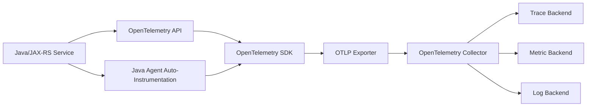
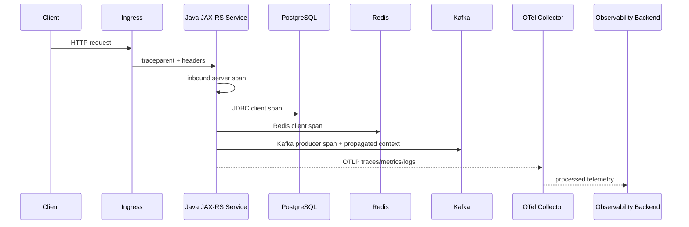

# Cheatsheet Observability Part 027 — OpenTelemetry Foundation

> Fokus part ini: memahami OpenTelemetry sebagai **standard instrumentation layer** untuk logs, metrics, traces, dan resource metadata. Tujuannya bukan sekadar memasang Java agent, tetapi memahami apa yang sedang dihasilkan aplikasi, siapa yang mengontrolnya, bagaimana context berjalan, bagaimana data diekspor, dan bagaimana telemetry tetap benar, aman, dan cost-aware di production.

---

## 1. Core Mental Model

OpenTelemetry adalah standard dan ecosystem untuk menghasilkan, mengumpulkan, memproses, dan mengekspor telemetry dari aplikasi dan platform.

Dalam konteks Java/JAX-RS enterprise service, OpenTelemetry membantu menjawab:

- request masuk endpoint mana;
- route mana yang lambat;
- dependency mana yang gagal;
- query database mana yang mendominasi latency;
- Redis/Kafka/RabbitMQ call mana yang menjadi bottleneck;
- error terjadi di span mana;
- service version mana yang memunculkan regression;
- apakah log bisa dicari berdasarkan trace ID;
- apakah metric, trace, dan log punya metadata service/environment yang sama;
- apakah telemetry aman dari PII dan high-cardinality data.

Mental model paling sederhana:

```text
Application code / runtime
    ↓
OpenTelemetry API / auto-instrumentation / manual instrumentation
    ↓
OpenTelemetry SDK
    ↓
Exporter
    ↓
OpenTelemetry Collector
    ↓
Observability backend
```

Untuk service Java/JAX-RS:



OpenTelemetry bukan backend observability.

Ia bukan pengganti dashboard, alert, log search, incident process, atau SLO.

OpenTelemetry adalah cara membuat telemetry lebih portable, consistent, dan vendor-neutral.

---

## 2. Why OpenTelemetry Exists

Tanpa standard instrumentation, setiap service cenderung membuat telemetry dengan cara berbeda:

- field log berbeda;
- metric naming berbeda;
- trace context tidak kompatibel;
- agent berbeda per vendor;
- dashboard tidak bisa reusable;
- migration observability backend menjadi mahal;
- instrumentation library saling tumpang tindih;
- metadata service/environment tidak konsisten;
- incident debugging tergantung pengetahuan tribal.

OpenTelemetry mencoba menyelesaikan masalah ini dengan:

- API standard untuk menghasilkan telemetry;
- SDK untuk mengontrol processing/export;
- semantic conventions untuk nama attribute yang umum;
- propagator untuk trace/context propagation;
- collector untuk menerima, memproses, dan mengekspor telemetry;
- auto-instrumentation untuk library umum;
- manual instrumentation untuk business/domain-specific insight.

Dalam enterprise system, nilai terbesarnya bukan hanya vendor-neutrality.

Nilai utamanya adalah **instrumentation discipline**.

---

## 3. Key Concepts

### 3.1 API

OpenTelemetry API adalah interface yang digunakan oleh application code atau instrumentation library untuk membuat telemetry.

Contoh konseptual:

```java
Span span = tracer.spanBuilder("quote.validation")
    .setAttribute("quote.validation.type", "eligibility")
    .startSpan();

try (Scope scope = span.makeCurrent()) {
    validateQuote(quote);
} catch (Exception e) {
    span.recordException(e);
    span.setStatus(StatusCode.ERROR);
    throw e;
} finally {
    span.end();
}
```

API harus relatif stabil dan ringan.

Application code sebaiknya bergantung pada API, bukan langsung pada backend vendor.

### 3.2 SDK

SDK adalah implementasi runtime yang mengatur:

- tracer provider;
- meter provider;
- logger provider jika log signal digunakan;
- span processor;
- metric reader;
- sampler;
- resource detector;
- exporter;
- propagator.

API adalah kontrak.

SDK adalah mesin yang menjalankan kontrak itu.

### 3.3 Instrumentation library

Instrumentation library adalah kode yang mengobservasi framework/library tertentu.

Contoh:

- Servlet/JAX-RS/Jersey instrumentation;
- JDBC instrumentation;
- HTTP client instrumentation;
- Kafka client instrumentation;
- RabbitMQ client instrumentation;
- Redis client instrumentation;
- executor/thread instrumentation.

Instrumentation library bisa berasal dari:

- OpenTelemetry Java instrumentation;
- framework integration;
- internal team;
- vendor-specific bridge.

### 3.4 Auto-instrumentation

Auto-instrumentation mencoba menghasilkan telemetry tanpa perubahan code aplikasi.

Untuk Java, biasanya melalui Java agent yang melakukan bytecode instrumentation pada library yang didukung.

Kelebihan:

- cepat diterapkan;
- coverage awal luas;
- cocok untuk inbound HTTP, outbound HTTP, JDBC, common clients;
- bagus untuk onboarding observability.

Risiko:

- tidak memahami domain business;
- bisa menghasilkan span terlalu banyak;
- attribute mungkin belum sesuai standard internal;
- library tertentu mungkin tidak ter-cover;
- upgrade agent bisa mengubah behavior telemetry;
- performance/cost harus diamati;
- konflik dengan vendor agent atau instrumentation lama mungkin terjadi.

### 3.5 Manual instrumentation

Manual instrumentation adalah instrumentation eksplisit di code aplikasi.

Dipakai saat auto-instrumentation tidak cukup, misalnya:

- quote pricing step;
- order decomposition step;
- approval evaluation;
- fulfillment orchestration;
- reconciliation job;
- business rule execution;
- custom retry loop;
- idempotency check;
- manual workflow transition;
- fallback path;
- high-value business transaction.

Manual instrumentation harus dipakai dengan disiplin.

Terlalu sedikit membuat blind spot.

Terlalu banyak membuat noise dan cost.

---

## 4. OpenTelemetry in Java/JAX-RS Request Lifecycle

Flow konseptual:



OpenTelemetry harus mengikat beberapa layer:

| Layer | Signal penting |
|---|---|
| HTTP ingress | server span, route, status, latency, trace context |
| JAX-RS resource | route template, exception status, business context |
| Service layer | domain span, business attributes terbatas |
| JDBC/PostgreSQL | query span, connection/pool metrics, sanitized statement |
| Redis | command span, cache hit/miss metric, key privacy |
| Kafka/RabbitMQ | producer/consumer span, message propagation, lag metrics |
| Background job | root span job, duration, status, retry, batch size |
| Kubernetes | resource attributes, pod labels, namespace, deployment |
| Logs | trace_id/span_id correlation, service metadata |

---

## 5. API vs SDK vs Agent vs Collector

Banyak kebingungan observability terjadi karena empat hal ini dicampur.

| Komponen | Lokasi | Tugas | Contoh keputusan |
|---|---|---|---|
| API | application/library code | membuat telemetry | kapan buat span manual |
| SDK | application process | sampling, processing, export | sampler, exporter, resource |
| Agent | JVM startup/runtime | auto-instrumentation | library coverage, enabled instrumentation |
| Collector | sidecar/daemon/gateway | receive/process/export telemetry | batching, sampling, filtering, routing |

Rule sederhana:

- Application code memakai API.
- SDK mengontrol runtime telemetry di process.
- Agent menambah instrumentation tanpa code change.
- Collector mengontrol pipeline di luar application process.

Jika ada masalah telemetry, tanyakan dulu: masalahnya di API, SDK, agent, exporter, collector, atau backend?

---

## 6. Resource Attributes

Resource attributes menjelaskan **siapa yang menghasilkan telemetry**.

Contoh resource attributes:

```text
service.name=quote-service
service.namespace=csg-quote-order
service.version=2026.07.11-abc123
deployment.environment=prod
k8s.namespace.name=quote-prod
k8s.pod.name=quote-service-7d9f...
k8s.container.name=app
cloud.provider=aws|azure
cloud.region=...
```

Resource attributes penting karena dashboard dan query sering dimulai dari:

- service apa;
- environment apa;
- version apa;
- namespace apa;
- region apa;
- pod apa;
- deployment apa.

Tanpa resource attributes yang benar, telemetry bisa ada tetapi tidak bisa dipakai dengan cepat.

### Failure mode resource attributes

| Failure mode | Dampak |
|---|---|
| `service.name` salah | dashboard/alert tidak menemukan service |
| environment kosong | prod/non-prod tercampur |
| version tidak ada | regression deployment sulit dibuktikan |
| namespace tidak ada | multi-tenant/platform debugging sulit |
| pod metadata tidak konsisten | log/metric/trace correlation lemah |
| attribute terlalu dinamis | query dan storage cost naik |

---

## 7. Traces in OpenTelemetry

Trace signal di OpenTelemetry terdiri dari:

- trace;
- span;
- span context;
- attributes;
- events;
- links;
- status;
- resource;
- instrumentation scope.

### Span naming discipline

Span name harus stabil.

Gunakan:

```text
HTTP POST /quotes/{quoteId}/submit
quote.validation
quote.pricing
order.decomposition
JDBC SELECT quote
Kafka PRODUCE quote-submitted
```

Hindari:

```text
HTTP POST /quotes/123456/submit
validate quote 123456 for customer 998877
SQL SELECT * FROM quote WHERE quote_id = '123456'
```

Alasannya:

- dynamic name meningkatkan cardinality;
- dashboard grouping menjadi rusak;
- backend trace storage menjadi mahal;
- query incident menjadi sulit.

### Span attributes discipline

Attribute harus:

- low-cardinality;
- privacy-safe;
- queryable;
- mengikuti semantic convention bila ada;
- tidak membawa payload besar;
- tidak membawa token/secret/PII;
- tidak memakai request ID sebagai metric label.

Contoh aman:

```text
http.request.method=POST
http.route=/quotes/{quoteId}/submit
http.response.status_code=202
db.system.name=postgresql
messaging.system=kafka
messaging.destination.name=quote-events
quote.operation=submit
```

Contoh berisiko:

```text
customer.email=alice@example.com
authorization=Bearer eyJ...
quote.raw.payload={...}
order.id=ORD-123456 as high-cardinality metric label
sql.params.customerName=...
```

---

## 8. Metrics in OpenTelemetry

OpenTelemetry metrics menyediakan instrument seperti:

- counter;
- up-down counter;
- histogram;
- gauge/observable gauge;
- duration/latency measurement melalui histogram;
- runtime metrics melalui instrumentation library.

Untuk Java/JAX-RS service, metrics umum:

- request count;
- request duration;
- error count;
- active request;
- JVM memory;
- GC pause;
- thread count;
- connection pool usage;
- Kafka producer/consumer metrics;
- Redis command latency;
- job duration;
- business lifecycle counters.

### Metric design with OTel

Metric di OTel tetap harus mengikuti discipline yang sudah dibahas:

- type benar;
- unit jelas;
- label terbatas;
- cardinality terkendali;
- aggregation aman;
- retention dipahami;
- ownership jelas.

OpenTelemetry tidak otomatis membuat metric menjadi benar.

Ia hanya menyediakan mekanisme.

Correctness tetap tanggung jawab engineer.

---

## 9. Logs and Log Correlation

OpenTelemetry dapat membawa log signal, tetapi di banyak enterprise system log pipeline sudah ada lebih dulu.

Yang paling penting untuk Java service:

- log memiliki `trace_id`;
- log memiliki `span_id` jika tersedia;
- log memiliki `service.name`;
- log memiliki `deployment.environment`;
- log memiliki `service.version`;
- MDC sinkron dengan current span context;
- structured log fields konsisten dengan telemetry attributes.

Contoh structured log:

```json
{
  "timestamp": "2026-07-11T10:20:30.123Z",
  "level": "INFO",
  "service.name": "quote-service",
  "deployment.environment": "prod",
  "trace_id": "4bf92f3577b34da6a3ce929d0e0e4736",
  "span_id": "00f067aa0ba902b7",
  "correlation_id": "corr-8f2c",
  "tenant_id": "tenant-a",
  "business_key_type": "quote_id",
  "business_key_hash": "sha256:...",
  "event": "quote.submit.accepted"
}
```

Catatan penting:

- trace ID bukan pengganti correlation ID;
- correlation ID bukan pengganti audit event;
- business key sebaiknya dipertimbangkan privacy dan cardinality-nya;
- log bridge tidak boleh membuat double logging.

---

## 10. Propagators and Context Propagation

Propagator mengatur bagaimana context dikirim antar boundary.

Boundary umum:

- inbound HTTP;
- outbound HTTP;
- Kafka headers;
- RabbitMQ headers;
- executor/thread pool;
- scheduled jobs;
- workflow workers;
- async callbacks.

Context yang umum:

- trace context;
- baggage;
- correlation ID jika dipakai internal;
- tenant context jika policy mengizinkan;
- actor context jika aman;
- business transaction ID jika aman.

### W3C trace context

Header yang sering ditemui:

```text
traceparent: 00-<trace-id>-<span-id>-<trace-flags>
tracestate: vendor-specific-state
```

Engineering concern:

- Jangan percaya semua inbound trace headers dari public internet tanpa policy.
- Gateway/ingress boundary harus jelas: continue, sanitize, atau regenerate?
- Trace context tidak boleh dipakai sebagai authorization context.
- Baggage jangan dipakai untuk membawa data sensitif.

---

## 11. Semantic Conventions

Semantic conventions memberi nama attribute yang konsisten untuk operasi umum.

Contoh area:

- HTTP;
- database;
- messaging;
- RPC;
- exception;
- JVM/runtime;
- Kubernetes/resource;
- cloud;
- logs/events.

Manfaat:

- query lebih konsisten;
- dashboard bisa reusable;
- backend/vendor bisa memahami data;
- instrumentation antar service tidak liar;
- engineer baru lebih cepat membaca telemetry.

Tetapi semantic convention tidak menggantikan domain naming.

Untuk CPQ/order management, Anda tetap butuh domain attributes yang internal-reviewed, misalnya:

```text
quote.operation=price|submit|approve|cancel
order.operation=decompose|validate|fulfill|amend
workflow.type=approval|fulfillment|fallout
business.flow=quote-to-order
```

Gunakan domain attributes secara hati-hati:

- jangan masukkan customer name/email;
- jangan gunakan raw quote/order ID sebagai metric label;
- pastikan label tidak meledakkan cardinality;
- pastikan field bisa dipakai untuk debugging;
- pastikan konsisten antar service.

---

## 12. Auto-Instrumentation Strategy

Auto-instrumentation cocok sebagai baseline.

Untuk Java/JAX-RS service, baseline yang diharapkan:

- inbound HTTP server spans;
- route template jika didukung;
- HTTP status code;
- exception capture;
- outbound HTTP client spans;
- JDBC spans;
- Redis spans;
- Kafka/RabbitMQ spans jika library didukung;
- executor context propagation jika didukung;
- JVM/runtime metrics;
- trace ID correlation ke logs jika dikonfigurasi.

### Auto-instrumentation review questions

- Library apa saja yang otomatis terinstrumentasi?
- Versi Java agent apa yang dipakai?
- Apakah route template benar untuk JAX-RS/Jersey?
- Apakah SQL statement disanitasi?
- Apakah messaging headers membawa trace context?
- Apakah context hilang saat async executor?
- Apakah ada duplicate span dari manual instrumentation?
- Apakah overhead CPU/memory/latency terukur?
- Apakah telemetry volume meningkat drastis?
- Apakah upgrade agent punya regression test?

---

## 13. Manual Instrumentation Strategy

Manual instrumentation harus menjawab production question spesifik.

Jangan membuat span manual hanya karena "ingin detail".

Gunakan manual instrumentation untuk:

- business-critical step;
- domain decision point;
- expensive computation;
- fallback branch;
- retry loop;
- idempotency check;
- reconciliation outcome;
- workflow transition;
- integration boundary yang tidak ter-cover auto-instrumentation;
- area yang sering muncul di incident.

### Good manual span examples

```text
quote.pricing.evaluate
quote.approval.route
order.decomposition.generate-lines
fulfillment.command.dispatch
reconciliation.compare-source-target
idempotency.check
fallback.pricing-cache-miss
```

### Bad manual span examples

```text
loop.item.1
loop.item.2
validate.field.customerName
map.dto.to.entity
private.method.call
```

Span manual sebaiknya bukan profiler.

Jika butuh level method terlalu detail, gunakan profiling/JFR, bukan trace span explosion.

---

## 14. Exporters

Exporter mengirim telemetry dari SDK ke destination.

Contoh pola:

```text
Application SDK → OTLP exporter → Collector
```

Hindari langsung ke banyak backend dari aplikasi kecuali ada alasan kuat.

Alasan collector lebih sehat:

- central batching;
- central retry;
- central filtering;
- central attribute processing;
- central sampling;
- lebih mudah mengganti backend;
- mengurangi vendor coupling di aplikasi;
- lebih mudah mengontrol privacy/cost.

### Exporter failure mode

| Failure mode | Dampak | Mitigasi |
|---|---|---|
| Collector unreachable | telemetry hilang atau buffer penuh | retry/backoff, queue, health alert |
| exporter timeout | overhead di app | timeout pendek, batch async |
| exporter blocking | latency aplikasi naik | non-blocking export, bounded queue |
| wrong endpoint | telemetry tidak muncul | startup validation, smoke test |
| TLS/auth misconfig | export gagal | secret/config review |
| payload terlalu besar | drop/retry storm | batch size limit, filtering |

Telemetry export tidak boleh membuat application availability jatuh.

---

## 15. Sampling in OTel SDK

Sampling menentukan trace mana yang disimpan.

Sampling bukan hanya cost control.

Sampling adalah decision yang mempengaruhi evidence.

Jenis umum:

- always on;
- always off;
- probability/head sampling;
- parent-based sampling;
- tail sampling di collector;
- error-biased sampling;
- latency-biased sampling;
- business-critical sampling.

Untuk Java service production:

- jangan sampling semua error penting;
- jangan hilangkan trace high latency;
- pastikan parent-child sampling konsisten;
- pastikan async consumer trace tidak hilang semua;
- pastikan debug incident punya cara menaikkan sampling sementara;
- pastikan cost impact dihitung.

---

## 16. Baggage

Baggage adalah context key-value yang ikut dipropagasikan across services.

Gunakan dengan sangat hati-hati.

Baggage bisa berguna untuk:

- routing observability internal;
- tenant category low-cardinality;
- experiment group low-cardinality;
- business flow type;
- support/debug flag terbatas.

Baggage buruk untuk:

- PII;
- token;
- customer name;
- email;
- raw order ID;
- large values;
- authorization decision;
- anything user-controlled tanpa sanitization.

Rule:

> Baggage is propagation context, not business payload.

---

## 17. OpenTelemetry and Auditability

OpenTelemetry membantu observability, tetapi bukan audit system.

Trace dapat menunjukkan:

- request path;
- service timing;
- dependency call;
- error location;
- context propagation.

Audit log harus menunjukkan:

- who;
- did what;
- when;
- where;
- why;
- target entity;
- before/after value;
- business action;
- security action;
- compliance evidence.

Jangan mengganti audit log dengan span.

Gunakan trace ID sebagai bridge:

```text
audit_event.trace_id = current_trace_id
structured_log.trace_id = current_trace_id
span.trace_id = current_trace_id
```

Dengan begitu audit event bisa dikorelasikan ke technical trace tanpa mengorbankan audit integrity.

---

## 18. Java/JAX-RS Implementation Pattern

Pola umum:

```text
1. Java agent creates inbound HTTP span.
2. JAX-RS filter extracts/sets correlation context.
3. MDC receives trace_id, span_id, correlation_id, tenant_id if allowed.
4. Resource method runs under current span.
5. Service layer adds manual span only for meaningful domain step.
6. JDBC/Redis/HTTP/Kafka/RabbitMQ auto instrumentation creates dependency spans.
7. ExceptionMapper sets consistent error response and logs one structured error.
8. SDK exports telemetry via OTLP exporter.
9. Collector processes and routes telemetry.
10. Backend stores traces/metrics/logs.
```

Example conceptual JAX-RS filter:

```java
@Provider
public class RequestContextFilter implements ContainerRequestFilter, ContainerResponseFilter {
    @Override
    public void filter(ContainerRequestContext requestContext) {
        String correlationId = resolveOrCreateCorrelationId(requestContext);
        MDC.put("correlation_id", correlationId);
        MDC.put("http_method", requestContext.getMethod());
    }

    @Override
    public void filter(ContainerRequestContext requestContext, ContainerResponseContext responseContext) {
        try {
            responseContext.getHeaders().putSingle("X-Correlation-ID", MDC.get("correlation_id"));
        } finally {
            MDC.clear();
        }
    }
}
```

Catatan:

- Jangan membuat trace context sendiri jika OTel sudah mengelolanya.
- Correlation ID dapat coexist dengan trace ID.
- MDC cleanup wajib.
- Async execution membutuhkan context propagation tambahan.

---

## 19. Production Failure Modes

| Failure mode | Symptom | Likely cause |
|---|---|---|
| No traces | trace backend kosong | agent tidak attach, exporter salah, collector unreachable |
| Missing child spans | dependency tidak terlihat | instrumentation library tidak aktif/unsupported |
| Broken trace | trace terpisah antar service | propagation header hilang |
| Duplicate spans | trace terlalu ramai | auto + manual overlap |
| Wrong service name | telemetry muncul di service lain | resource attribute salah |
| No logs linked to trace | log search tidak bisa by trace ID | MDC/log correlation belum dikonfigurasi |
| High telemetry cost | ingestion spike | terlalu banyak spans/attributes/cardinality |
| PII in spans | privacy incident | attributes tidak direview |
| Route cardinality high | banyak unique span names | raw path dipakai, bukan route template |
| Sampling hides incident | trace tidak tersedia saat RCA | sampling strategy terlalu agresif |

---

## 20. Performance and Reliability Concern

OpenTelemetry tidak gratis.

Overhead bisa berasal dari:

- span creation;
- attribute allocation;
- stack trace recording;
- exporter batching;
- queue memory;
- context propagation;
- agent bytecode instrumentation;
- metric cardinality;
- log enrichment;
- collector retry/backpressure.

Prinsip:

- instrumentation harus async/non-blocking sejauh mungkin;
- exporter queue harus bounded;
- telemetry loss lebih baik daripada service outage untuk sebagian besar operational telemetry;
- audit event berbeda: audit durability bisa punya requirement khusus;
- high-cardinality data harus dicegah di source;
- performance overhead harus dimonitor setelah agent/SDK upgrade.

---

## 21. Security and Privacy Concern

Review semua telemetry sebagai data production.

Telemetry bisa mengandung:

- URL path dengan ID;
- query parameter;
- SQL statement;
- message headers;
- exception message;
- stack trace;
- user/tenant metadata;
- business key;
- internal topology;
- cloud resource identity.

Checklist singkat:

- Authorization header tidak diekspor.
- Cookie tidak diekspor.
- Token tidak masuk baggage.
- SQL parameters tidak diekspor mentah.
- Message payload tidak menjadi span attribute.
- Raw order/quote/customer ID tidak menjadi high-cardinality metric label.
- Trace access control sesuai sensitivity.
- Non-prod/prod telemetry tidak tercampur.

---

## 22. Internal Verification Checklist

Gunakan checklist ini di CSG/team tanpa mengasumsikan stack internal.

### OpenTelemetry usage

- Apakah OpenTelemetry digunakan di service Java/JAX-RS?
- Apakah menggunakan Java agent, SDK manual, vendor agent, atau kombinasi?
- Versi OTel Java agent/SDK apa yang dipakai?
- Apakah ada standard internal untuk OTel config?
- Apakah semua service memakai `service.name` yang konsisten?

### API/SDK/agent

- Apakah application code memakai OTel API langsung?
- Apakah manual spans ada? Untuk apa?
- Apakah auto-instrumentation aktif?
- Library apa saja yang ter-cover?
- Apakah ada duplicate instrumentation?
- Apakah agent upgrade pernah menyebabkan telemetry regression?

### Resource attributes

- Apakah `service.name`, `service.version`, `deployment.environment` tersedia?
- Apakah Kubernetes metadata tersedia?
- Apakah cloud region/provider tersedia jika relevan?
- Apakah commit SHA/build ID/image digest tersedia?
- Apakah environment prod/non-prod terpisah jelas?

### Propagation

- Apakah W3C trace context digunakan?
- Apakah gateway/ingress meneruskan trace context?
- Apakah outbound HTTP meneruskan context?
- Apakah Kafka/RabbitMQ headers membawa context?
- Apakah executor/background job mempertahankan context?
- Apakah baggage digunakan? Untuk apa?

### Logs and metrics

- Apakah trace ID/span ID masuk structured logs?
- Apakah metric names mengikuti standard internal?
- Apakah metric labels low-cardinality?
- Apakah dashboard memakai resource attributes yang benar?
- Apakah logs/metrics/traces bisa dikorelasikan dari incident timeline?

### Privacy/cost

- Apakah span attributes direview untuk PII?
- Apakah SQL sanitized?
- Apakah path templated?
- Apakah sampling policy diketahui?
- Apakah telemetry volume/cost dimonitor?
- Apakah ada policy untuk debug-level instrumentation sementara?

---

## 23. PR Review Checklist

Saat PR menyentuh OTel/instrumentation, tanyakan:

- Apakah instrumentation menjawab production question yang jelas?
- Apakah span name stabil?
- Apakah attribute low-cardinality dan privacy-safe?
- Apakah semantic convention dipakai jika tersedia?
- Apakah manual span overlap dengan auto span?
- Apakah error status dan exception recording benar?
- Apakah context propagation tetap bekerja?
- Apakah trace ID masuk log?
- Apakah metric label tidak meledakkan cardinality?
- Apakah exporter/collector config berubah?
- Apakah sampling/cost impact dipertimbangkan?
- Apakah dashboard/alert/runbook perlu diperbarui?

---

## 24. Debugging Checklist

Saat telemetry OTel bermasalah:

1. Cek apakah service menghasilkan trace lokal.
2. Cek resource attributes.
3. Cek exporter endpoint.
4. Cek collector health.
5. Cek collector logs.
6. Cek backend ingestion.
7. Cek sampling.
8. Cek route/span naming.
9. Cek propagation headers.
10. Cek MDC/log correlation.
11. Cek agent/SDK version.
12. Cek recent deployment/config change.

---

## 25. Summary

OpenTelemetry adalah fondasi instrumentation modern untuk Java/JAX-RS production systems, tetapi bukan magic.

Ia membantu membuat traces, metrics, logs, resource metadata, propagation, dan export pipeline lebih standar.

Namun kualitas observability tetap bergantung pada engineering discipline:

- span yang benar;
- metric yang benar;
- attributes yang aman;
- context propagation yang stabil;
- resource metadata yang konsisten;
- sampling yang tidak menyembunyikan incident;
- collector pipeline yang reliable;
- privacy dan cost yang direview;
- dashboard dan alert yang memakai signal dengan benar.

Prinsip final:

> OpenTelemetry gives you a standard telemetry language. Senior engineers still decide what deserves to be said.
