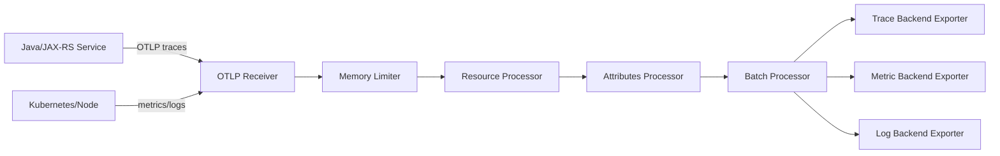
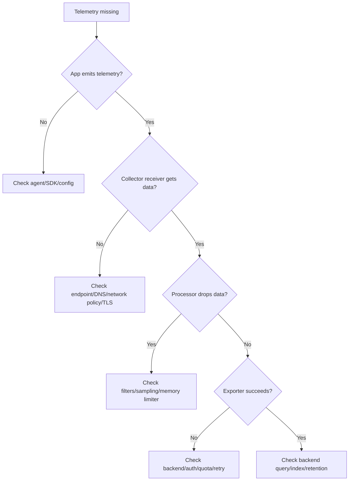

# Cheatsheet Observability Part 028 — OpenTelemetry Collector

> Fokus part ini: memahami OpenTelemetry Collector sebagai **control plane telemetry pipeline**. Collector bukan sekadar forwarder. Collector adalah titik tempat telemetry diterima, dibatasi, diproses, diperkaya, disampling, difilter, dibatch, dirutekan, dan diekspor ke observability backend.

---

## 1. Core Mental Model

OpenTelemetry Collector menerima telemetry dari aplikasi/platform, memprosesnya, lalu mengirimkannya ke satu atau lebih backend.

Mental model:

```text
Receivers → Processors → Exporters
```

Dalam config collector, alurnya disebut pipeline.



Collector menjawab pertanyaan:

- telemetry masuk dari mana;
- telemetry diproses bagaimana;
- attribute apa yang ditambah/dihapus;
- sampling terjadi di mana;
- data apa yang dikirim ke backend mana;
- apakah pipeline drop data;
- apakah telemetry backend sedang down;
- apakah aplikasi terdampak backpressure;
- apakah data sensitif disaring sebelum keluar environment.

---

## 2. Why Collector Exists

Tanpa collector, setiap aplikasi harus tahu cara mengirim telemetry ke backend tertentu.

Masalahnya:

- aplikasi menjadi vendor-coupled;
- setiap service punya exporter config sendiri;
- retry/batching tersebar di semua aplikasi;
- privacy filtering sulit dikontrol pusat;
- sampling tidak konsisten;
- multi-backend export sulit;
- observability migration mahal;
- telemetry failure dapat memengaruhi aplikasi;
- metadata platform sulit diseragamkan.

Collector mengurangi masalah tersebut dengan memindahkan banyak concern ke pipeline terpisah.

Collector membuat aplikasi cukup mengirim telemetry ke endpoint standard, biasanya OTLP.

---

## 3. Collector Components

Collector memiliki beberapa jenis komponen utama:

| Component | Fungsi |
|---|---|
| Receiver | menerima telemetry |
| Processor | mengubah, membatasi, memperkaya, menyaring telemetry |
| Exporter | mengirim telemetry ke backend |
| Connector | menghubungkan pipeline satu ke pipeline lain |
| Extension | fungsi tambahan seperti health check, auth, pprof, zpages |
| Service pipeline | wiring receiver → processor → exporter |

Untuk senior backend engineer, fokus awal cukup pada:

- receivers;
- processors;
- exporters;
- pipelines;
- deployment mode;
- failure modes.

---

## 4. Receivers

Receiver adalah pintu masuk telemetry.

Contoh receiver umum:

- OTLP receiver;
- Prometheus receiver;
- Jaeger receiver;
- Zipkin receiver;
- Kafka receiver;
- file/log receiver;
- host metrics receiver;
- Kubernetes-related receivers.

Untuk aplikasi Java/JAX-RS modern, receiver paling umum:

```yaml
receivers:
  otlp:
    protocols:
      grpc:
      http:
```

Aplikasi mengirim traces/metrics/logs ke collector melalui OTLP.

### Receiver design concern

- Protocol apa yang dipakai: gRPC atau HTTP?
- Port apa yang expose?
- Siapa yang boleh mengirim telemetry?
- Apakah TLS/mTLS digunakan?
- Apakah receiver exposed hanya internal cluster?
- Apakah ada rate limit di depan collector?
- Apakah collector menerima telemetry dari prod dan non-prod secara terpisah?

---

## 5. Processors

Processor mengubah telemetry di antara receiver dan exporter.

Processor umum:

- memory limiter;
- batch;
- attributes;
- resource;
- filter;
- transform;
- probabilistic sampler;
- tail sampling;
- span metrics;
- k8s attributes;
- routing;
- redaction/custom processors jika tersedia.

Processor order penting.

Contoh order umum:

```text
memory_limiter → resource/k8sattributes → attributes/filter → sampling → batch → exporter
```

Jangan asal copy config.

Processor order bisa mempengaruhi:

- data yang disampling;
- attribute yang tersedia untuk routing;
- memory usage;
- privacy filtering;
- cost;
- debugging visibility.

---

## 6. Exporters

Exporter mengirim telemetry ke backend.

Contoh exporter:

- OTLP exporter;
- Prometheus exporter/remote write;
- logging/debug exporter;
- vendor-specific exporter;
- Kafka exporter;
- file exporter untuk test;
- load balancing exporter.

Contoh konseptual:

```yaml
exporters:
  otlp/traces:
    endpoint: trace-backend:4317

  otlp/metrics:
    endpoint: metric-backend:4317
```

Exporter concern:

- endpoint benar;
- TLS/auth benar;
- timeout sesuai;
- retry policy aman;
- queue tidak unlimited;
- batch size tidak terlalu besar;
- failure tidak menyebabkan collector crash loop;
- backend quota diketahui.

---

## 7. Pipelines

Pipeline menghubungkan receiver, processor, dan exporter.

Contoh:

```yaml
service:
  pipelines:
    traces:
      receivers: [otlp]
      processors: [memory_limiter, resource, attributes, batch]
      exporters: [otlp/traces]

    metrics:
      receivers: [otlp]
      processors: [memory_limiter, resource, batch]
      exporters: [otlp/metrics]

    logs:
      receivers: [otlp]
      processors: [memory_limiter, resource, attributes, batch]
      exporters: [otlp/logs]
```

Pipeline dipisah per signal karena traces, metrics, dan logs punya kebutuhan berbeda.

| Signal | Pipeline concern utama |
|---|---|
| Traces | sampling, span attributes, trace completeness |
| Metrics | label/cardinality, aggregation, scrape/export format |
| Logs | volume, redaction, retention, routing, PII risk |

---

## 8. Batch Processor

Batch processor mengumpulkan telemetry sebelum export.

Tujuannya:

- mengurangi network overhead;
- meningkatkan throughput;
- mengurangi request kecil ke backend;
- membantu exporter bekerja lebih efisien.

Risiko:

- batch terlalu besar meningkatkan memory;
- timeout terlalu lama membuat telemetry delayed;
- backend limit bisa terlampaui;
- saat collector crash, batch in-memory bisa hilang.

Design question:

- Berapa batch size?
- Berapa timeout?
- Apakah latency telemetry acceptable?
- Apakah backend punya max payload?
- Apakah collector memory cukup?

---

## 9. Memory Limiter

Memory limiter mencegah collector menghabiskan memory.

Collector juga bisa menjadi production risk.

Jika telemetry spike terjadi saat incident, collector bisa:

- OOMKilled;
- drop data;
- retry storm;
- crash loop;
- memperparah blind spot incident.

Memory limiter membantu memberi batas.

Namun memory limiter juga bisa drop telemetry.

Jadi perlu observability untuk collector itu sendiri.

### Collector memory signals

- process memory usage;
- dropped spans/logs/metrics;
- exporter queue size;
- receiver accepted/refused data;
- processor errors;
- export failures;
- restart count;
- OOMKilled events.

---

## 10. Resource Processor

Resource processor memodifikasi resource attributes.

Contoh penggunaan:

- menambah deployment environment;
- menormalisasi service namespace;
- menghapus attribute yang tidak boleh keluar;
- menambah cluster name;
- menambah organization/team jika standard internal ada;
- memperbaiki attribute yang kurang konsisten.

Contoh konseptual:

```yaml
processors:
  resource:
    attributes:
      - key: deployment.environment
        value: prod
        action: upsert
      - key: service.namespace
        value: quote-order
        action: upsert
```

Hati-hati:

- Jangan menimpa service name sembarangan.
- Jangan mencampur prod/non-prod.
- Jangan menambah high-cardinality resource attributes.
- Jangan menyembunyikan bug aplikasi dengan rewrite permanen tanpa issue tracking.

---

## 11. Attributes Processor

Attributes processor memodifikasi span/log/metric attributes.

Contoh penggunaan:

- hapus sensitive header;
- hash/mask field tertentu;
- normalize attribute name;
- drop noisy attributes;
- add static low-cardinality attribute;
- remove high-cardinality field.

Contoh konseptual:

```yaml
processors:
  attributes/sanitize:
    actions:
      - key: http.request.header.authorization
        action: delete
      - key: http.request.header.cookie
        action: delete
      - key: user.email
        action: delete
```

Privacy filtering sebaiknya dilakukan sedekat mungkin dengan source.

Collector filtering adalah guardrail tambahan, bukan alasan untuk membiarkan aplikasi mengirim data sensitif.

---

## 12. Kubernetes Attributes Processor

Di Kubernetes, collector bisa memperkaya telemetry dengan metadata pod.

Contoh metadata berguna:

- namespace;
- pod name;
- deployment name;
- node name;
- container name;
- labels;
- annotations tertentu;
- workload identity.

Manfaat:

- log/trace/metric bisa dikaitkan ke pod/deployment;
- incident bisa dihubungkan ke rollout;
- dashboard bisa filter namespace/workload;
- query bisa membedakan pod yang restart;
- GitOps/deployment metadata bisa muncul di telemetry.

Risiko:

- label terlalu banyak meningkatkan cardinality;
- annotation bisa mengandung data sensitif;
- metadata enrichment butuh RBAC yang benar;
- pod association bisa salah jika network/IP mapping bermasalah.

---

## 13. Sampling in Collector

Collector bisa melakukan sampling, terutama untuk traces.

### Head sampling vs tail sampling

Head sampling memutuskan di awal trace.

Kelebihan:

- murah;
- sederhana;
- keputusan cepat.

Kelemahan:

- belum tahu trace error/lambat atau tidak;
- bisa membuang trace penting.

Tail sampling memutuskan setelah melihat lebih banyak span dalam trace.

Kelebihan:

- bisa simpan trace error;
- bisa simpan slow trace;
- bisa simpan business-critical trace;
- lebih baik untuk incident evidence.

Kelemahan:

- butuh memory lebih besar;
- butuh buffering;
- latency export lebih tinggi;
- config lebih kompleks;
- bisa drop saat traffic spike.

### Sampling policy examples

Policy yang sering masuk akal:

```text
Keep all ERROR traces.
Keep traces above latency threshold.
Keep business-critical route traces.
Sample normal successful traffic by probability.
Drop health check traces or sample very low.
```

Pertanyaan wajib:

- Apakah sampling menyembunyikan incident?
- Apakah trace untuk RCA tersedia setelah incident?
- Apakah sampling konsisten across services?
- Apakah high-value business transaction lebih dilindungi?
- Apakah cost saving sebanding dengan evidence loss?

---

## 14. Filtering

Filtering dipakai untuk membuang telemetry yang tidak berguna atau berisiko.

Contoh yang sering difilter:

- health check traces;
- liveness/readiness probe logs;
- noisy debug logs;
- metrics dengan label berbahaya;
- sensitive attributes;
- duplicate telemetry;
- low-value successful traces pada traffic tinggi.

Namun filtering harus hati-hati.

Jangan memfilter:

- error traces;
- retry/fallback signals;
- DLQ-related telemetry;
- audit-related evidence;
- security events;
- business-critical lifecycle events;
- deployment/regression signals.

Filtering salah bisa membuat observability terlihat lebih sehat daripada production sebenarnya.

---

## 15. Routing

Routing memutuskan telemetry dikirim ke backend mana.

Contoh routing:

- prod traces ke backend prod;
- non-prod traces ke backend non-prod;
- security logs ke security backend;
- audit logs ke audit/compliance storage;
- high-volume debug logs ke short-retention storage;
- metrics ke Prometheus-compatible backend;
- traces ke tracing backend;
- selected telemetry ke vendor backend untuk APM.

Routing concern:

- environment separation;
- data residency;
- privacy;
- compliance;
- retention;
- cost;
- access control;
- backend outage behavior.

---

## 16. Collector Deployment Modes

### 16.1 Agent mode

Collector berjalan dekat dengan workload.

Contoh:

- sidecar per pod;
- DaemonSet per node;
- local collector per host.

Kelebihan:

- latency rendah;
- dapat enrich node/pod local metadata;
- mengurangi network hop;
- failure lebih terisolasi.

Kelemahan:

- lebih banyak collector instance;
- config rollout lebih kompleks;
- resource overhead di setiap node/pod;
- sidecar menambah kompleksitas manifest.

### 16.2 Gateway mode

Collector berjalan sebagai deployment/service terpusat di cluster/environment.

Kelebihan:

- config lebih terpusat;
- routing/sampling lebih mudah;
- multi-backend export lebih mudah;
- cocok untuk tail sampling;
- governance lebih kuat.

Kelemahan:

- bisa menjadi bottleneck;
- perlu scaling;
- perlu high availability;
- jika down, banyak service terdampak telemetry loss;
- network path lebih panjang.

### 16.3 Hybrid mode

Agent menerima local telemetry dan gateway melakukan processing lanjut.

```text
Application → Local Agent Collector → Gateway Collector → Backend
```

Pola ini sering paling matang untuk production besar.

---

## 17. Collector in Kubernetes

Kubernetes deployment concern:

- Deployment vs DaemonSet vs sidecar;
- resource requests/limits;
- HPA/scaling;
- readiness/liveness probes;
- config management;
- secret management;
- network policy;
- service account/RBAC;
- pod disruption budget;
- rolling update strategy;
- collector self-observability;
- GitOps drift detection.

Collector harus diperlakukan sebagai production component.

Jika collector down, service mungkin tetap berjalan, tetapi incident evidence bisa hilang.

---

## 18. Collector Configuration as Production Code

Collector config harus direview seperti application code.

Ia mempengaruhi:

- privacy;
- cost;
- incident evidence;
- dashboard correctness;
- alert correctness;
- backend load;
- environment isolation;
- compliance retention;
- operational debugging.

Config harus punya:

- version control;
- review process;
- environment overlay;
- rollback path;
- validation in CI;
- test deployment;
- change log;
- owner jelas.

Jangan treat collector YAML sebagai copy-paste infra detail.

Ia adalah observability architecture.

---

## 19. Collector Self-Observability

Collector sendiri harus observable.

Minimum signals:

- collector uptime;
- process CPU/memory;
- receiver accepted/refused items;
- processor dropped items;
- exporter send failures;
- exporter queue size;
- retry count;
- batch size;
- latency export;
- collector restarts;
- OOMKilled;
- config reload errors;
- backend connectivity errors.

Dashboard collector harus menjawab:

- Apakah collector menerima telemetry?
- Apakah collector drop telemetry?
- Apakah backend export berhasil?
- Apakah queue/backpressure terjadi?
- Apakah collector menjadi bottleneck?
- Apakah collector restart saat incident?

---

## 20. Failure Modes

| Failure mode | Symptom | Impact | Debug path |
|---|---|---|---|
| Receiver unreachable | aplikasi tidak mengirim telemetry | traces/metrics/logs hilang | cek endpoint, DNS, service, network policy |
| Collector OOMKilled | telemetry gap | incident evidence hilang | cek memory limiter, batch, traffic spike |
| Exporter failure | telemetry masuk tapi tidak muncul backend | backend blind spot | cek exporter logs, auth, TLS, backend health |
| Processor drops data | missing spans/logs/metrics | false negative | cek filter/sampling/memory limiter |
| Wrong routing | prod data ke backend salah | security/compliance risk | cek routing attributes/environment |
| Bad enrichment | service metadata salah | dashboard misleading | cek resource/k8s attributes processor |
| Tail sampling overloaded | traces incomplete/dropped | RCA lemah | cek sampling buffer, memory, traffic |
| Config typo | pipeline gagal start | telemetry outage | config validation/rollback |
| Backend quota exceeded | export errors/drop | data loss/cost issue | cek backend limits dan volume |
| Sensitive data exported | privacy incident | compliance/security risk | cek attributes processor/source instrumentation |

---

## 21. Collector and Application Reliability

Telemetry pipeline tidak boleh menjatuhkan aplikasi.

Aplikasi harus tetap melayani traffic meskipun collector down, kecuali ada requirement khusus untuk audit/security event yang berbeda.

Prinsip:

- application exporter timeout pendek;
- bounded queue;
- async export;
- collector endpoint local/gateway stable;
- retry tidak unlimited;
- failure tidak blocking request path;
- audit event durability dipisahkan dari generic telemetry;
- alert collector outage tetap ada.

Jika telemetry export blocking request path, observability bisa menjadi penyebab incident.

---

## 22. Privacy and Security

Collector adalah tempat sensitif karena melihat telemetry lintas service.

Security concern:

- receiver exposure;
- authentication;
- TLS/mTLS;
- network policy;
- RBAC;
- secret management;
- backend credentials;
- log leakage from collector logs;
- tenant/environment isolation;
- access to raw telemetry;
- data residency.

Privacy concern:

- PII in attributes;
- secrets in headers;
- tokens in logs;
- raw SQL parameters;
- message payload leakage;
- stack trace containing sensitive values;
- annotations/labels containing sensitive data.

Collector can redact/filter, but source instrumentation should still avoid sending sensitive data.

Defense in depth:

```text
Application sanitization → Collector filtering → Backend access control → Retention policy → Audit access
```

---

## 23. Cost Management

Collector bisa menjadi cost-control layer.

Cost drivers:

- log volume;
- trace volume;
- high span count per request;
- high-cardinality attributes;
- metric label explosion;
- health check noise;
- debug logs;
- long retention;
- multi-backend export;
- retry storm after backend outage.

Collector mitigations:

- drop low-value telemetry;
- sample traces;
- filter health check spans/logs;
- delete high-cardinality attributes;
- batch export;
- route different data to different retention tiers;
- keep error/slow/business-critical traces;
- monitor top noisy services.

Cost reduction must not remove incident evidence blindly.

---

## 24. Example Collector Config Skeleton

Contoh ini konseptual, bukan config final untuk CSG.

```yaml
receivers:
  otlp:
    protocols:
      grpc:
      http:

processors:
  memory_limiter:
    check_interval: 1s
    limit_percentage: 80
    spike_limit_percentage: 20

  resource/defaults:
    attributes:
      - key: service.namespace
        value: quote-order
        action: upsert

  attributes/sanitize:
    actions:
      - key: http.request.header.authorization
        action: delete
      - key: http.request.header.cookie
        action: delete
      - key: user.email
        action: delete

  batch:
    timeout: 5s
    send_batch_size: 1024

exporters:
  otlp/traces:
    endpoint: trace-backend.internal:4317

  otlp/metrics:
    endpoint: metric-backend.internal:4317

  otlp/logs:
    endpoint: log-backend.internal:4317

service:
  pipelines:
    traces:
      receivers: [otlp]
      processors: [memory_limiter, resource/defaults, attributes/sanitize, batch]
      exporters: [otlp/traces]

    metrics:
      receivers: [otlp]
      processors: [memory_limiter, resource/defaults, batch]
      exporters: [otlp/metrics]

    logs:
      receivers: [otlp]
      processors: [memory_limiter, resource/defaults, attributes/sanitize, batch]
      exporters: [otlp/logs]
```

Review config ini dengan senior/platform/SRE/security team sebelum production.

---

## 25. Collector Debugging Workflow

Saat telemetry tidak muncul:



Debug steps:

1. Confirm application has agent/SDK active.
2. Confirm exporter endpoint points to collector.
3. Confirm collector receiver metrics increase.
4. Confirm pipeline config includes correct receiver.
5. Confirm processors are not filtering data.
6. Confirm sampling policy does not drop expected trace.
7. Confirm exporter success metric.
8. Confirm backend ingestion.
9. Confirm query uses correct `service.name` and environment.
10. Confirm retention/time range.

---

## 26. Internal Verification Checklist

Gunakan checklist ini di CSG/team tanpa mengasumsikan stack internal.

### Collector ownership

- Siapa owner collector config?
- Apakah collector dikelola app team, platform team, SRE, atau vendor?
- Di repo mana config disimpan?
- Apakah perubahan collector melalui PR review?
- Apakah ada rollback process?

### Deployment mode

- Collector berjalan sebagai sidecar, DaemonSet, gateway, atau hybrid?
- Apakah mode berbeda antara dev/test/prod?
- Apakah collector HA?
- Apakah collector autoscaling?
- Apakah resource requests/limits cukup?
- Apakah PDB digunakan?

### Pipelines

- Receiver apa yang aktif?
- Protocol apa yang dipakai aplikasi?
- Processor apa yang aktif per signal?
- Exporter ke backend mana?
- Apakah traces, metrics, logs diproses berbeda?
- Apakah environment prod/non-prod dipisah?

### Processing

- Apakah memory limiter aktif?
- Apakah batch processor aktif?
- Apakah attributes processor menghapus sensitive fields?
- Apakah resource processor menambah metadata yang benar?
- Apakah k8s attributes enrichment aktif?
- Apakah filtering rules terdokumentasi?

### Sampling

- Apakah head sampling atau tail sampling digunakan?
- Apakah error traces disimpan?
- Apakah slow traces disimpan?
- Apakah business-critical traces disimpan?
- Apakah health check traces difilter/disample?
- Apakah sampling policy pernah menyembunyikan incident?

### Security/privacy

- Apakah receiver protected by network policy/TLS/auth?
- Apakah backend credentials disimpan aman?
- Apakah PII/token/header sensitive difilter?
- Apakah collector logs tidak membocorkan payload?
- Apakah access to collector config dibatasi?
- Apakah data residency/compliance requirement dipenuhi?

### Self-observability

- Apakah ada dashboard collector?
- Apakah ada alert collector down?
- Apakah ada alert exporter failure?
- Apakah ada alert telemetry drop?
- Apakah collector restarts/OOMKilled dipantau?
- Apakah backend quota/export failure dipantau?

---

## 27. PR Review Checklist

Saat PR mengubah collector/config observability pipeline, tanyakan:

- Apakah perubahan mempengaruhi traces, metrics, logs, atau semuanya?
- Apakah ada risk telemetry drop?
- Apakah filtering rule menghapus evidence penting?
- Apakah sampling rule menjaga error/slow/business-critical traces?
- Apakah attribute baru low-cardinality dan privacy-safe?
- Apakah resource attributes tetap konsisten?
- Apakah prod/non-prod routing aman?
- Apakah exporter endpoint/credentials benar?
- Apakah retry/backoff/queue bounded?
- Apakah collector resource limit cukup?
- Apakah dashboard/alert collector perlu diupdate?
- Apakah rollback path jelas?
- Apakah security/privacy team perlu review?

---

## 28. Production Readiness Checklist

Collector production-ready jika:

- config version-controlled;
- deployment HA/scalable;
- resource limits tested;
- memory limiter configured;
- batch processor configured;
- retry/export failure visible;
- receiver protected;
- sensitive attributes filtered;
- sampling policy documented;
- self-observability dashboard exists;
- alerts exist for collector health/drop/export failure;
- rollback process exists;
- owners clear;
- incident runbook exists;
- cost monitored;
- environment routing safe.

---

## 29. Summary

OpenTelemetry Collector adalah komponen penting dalam observability architecture.

Ia memisahkan aplikasi dari backend observability dan memberi tempat untuk:

- receive telemetry;
- enrich metadata;
- filter sensitive/noisy data;
- sample traces;
- batch export;
- route signals;
- control cost;
- support vendor migration;
- protect production systems from telemetry pipeline failure.

Namun collector juga bisa menjadi blind spot baru jika tidak diamati.

Prinsip final:

- Treat collector config as production code.
- Keep telemetry pipeline observable.
- Filter privacy risk early.
- Preserve incident evidence intentionally.
- Never let observability pipeline become a production outage amplifier.
