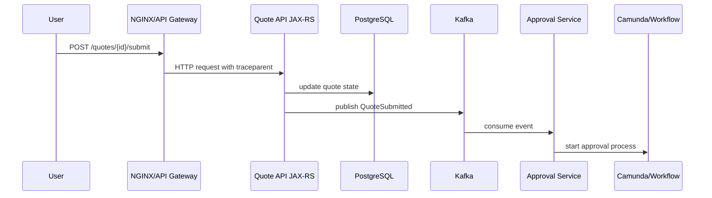
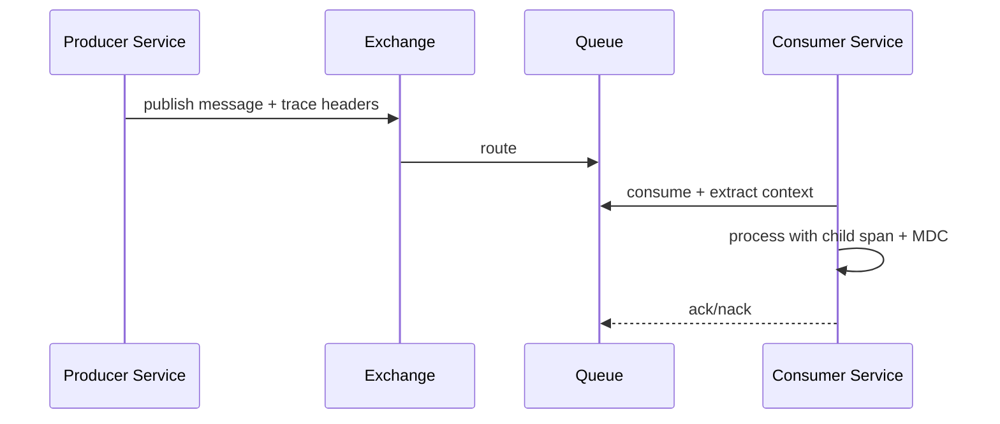
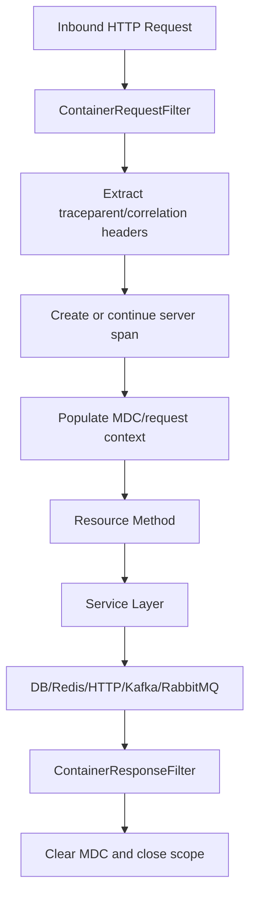

# Cheatsheet Observability Part 029 — Context Propagation

> Fokus part ini: memahami bagaimana **context observability** bergerak dari request masuk, melewati thread, executor, HTTP client, database, Kafka/RabbitMQ, Redis, job, workflow, sampai downstream service. Tanpa context propagation yang benar, log terlihat terpisah, trace terputus, metric sulit dikaitkan, dan incident timeline menjadi spekulatif.

---

## 1. Core Mental Model

Context propagation adalah mekanisme membawa identitas eksekusi dari satu boundary ke boundary lain.

Dalam observability, context menjawab:

- request ini bagian dari trace apa;
- span saat ini anak dari span mana;
- log ini milik request mana;
- event Kafka/RabbitMQ ini disebabkan oleh request atau job apa;
- retry ini masih bagian dari business transaction yang sama atau tidak;
- order/quote mana yang sedang diproses;
- tenant dan actor mana yang terlibat;
- apakah correlation terputus di service, thread pool, queue, atau gateway.

Mental model sederhana:

```text
incoming context
  ↓
extract from carrier
  ↓
attach to current execution
  ↓
use in logs/metrics/traces/audit
  ↓
inject into outbound carrier
  ↓
downstream extracts and continues
```

Carrier dapat berupa:

- HTTP headers;
- Kafka record headers;
- RabbitMQ message properties/headers;
- in-memory context;
- ThreadLocal/MDC;
- job metadata;
- workflow variables;
- database outbox row metadata.

Context bukan hanya trace ID. Trace ID penting, tetapi enterprise debugging sering membutuhkan gabungan trace ID, correlation ID, causation ID, tenant ID, actor ID, request ID, message ID, process instance ID, dan business key.

---

## 2. Why Context Propagation Exists

Distributed system memecah satu user/business action menjadi banyak operasi kecil.

Contoh quote approval:



Tanpa context propagation:

- edge log punya request ID berbeda;
- application log tidak punya trace ID;
- Kafka consumer trace dimulai sebagai root trace baru;
- workflow process tidak bisa dikaitkan ke quote submission;
- incident responder harus menebak hubungan antar signal.

Dengan context propagation:

- semua span berada dalam trace yang sama atau causal chain yang jelas;
- log bisa dicari berdasarkan trace ID/correlation ID/business key;
- event dapat ditelusuri dari producer ke consumer;
- retry, DLQ, dan replay tetap punya causal metadata;
- timeline incident bisa direkonstruksi lebih cepat.

---

## 3. Context Identity Layers

Tidak semua ID punya fungsi yang sama.

| Identity | Fungsi | Scope | Cocok untuk |
|---|---|---|---|
| `trace_id` | Mengikat span dalam satu distributed trace | Technical execution | Trace viewer, log correlation |
| `span_id` | Mengidentifikasi operasi spesifik dalam trace | Single operation | Latency breakdown |
| `request_id` | Mengidentifikasi satu HTTP request | Edge/app request | Access log, support debugging |
| `correlation_id` | Mengikat beberapa request/event dalam satu business interaction | Cross-boundary | Incident timeline, support case |
| `causation_id` | Menunjukkan event/action penyebab event berikutnya | Causal chain | Event-driven debugging |
| `message_id` | Mengidentifikasi satu message | Messaging | Duplicate detection, retry/DLQ |
| `event_id` | Mengidentifikasi satu domain event | Domain event | Idempotency, audit, replay |
| `idempotency_key` | Mencegah double processing | Command/request | Payment/order mutation safety |
| `tenant_id` | Memisahkan customer/tenant | Business/security | Blast radius, access boundary |
| `actor_id` | Menunjukkan user/service principal | Business/security | Audit, security investigation |
| `business_key` | Entity utama, misalnya quote/order ID | Domain lifecycle | Case debugging, business dashboard |
| `process_instance_id` | Workflow execution ID | Workflow | Camunda/process debugging |

Rule penting:

- Jangan memakai `trace_id` sebagai business ID.
- Jangan memakai `order_id` sebagai metric label high-cardinality.
- Jangan mengandalkan `request_id` untuk async workflow panjang.
- Jangan memasukkan PII ke baggage, headers, log fields, atau metric labels.
- Jangan menerima context eksternal tanpa boundary trust policy.

---

## 4. W3C `traceparent`

`traceparent` adalah header standar untuk propagation trace context.

Format umum:

```text
traceparent: 00-<trace-id>-<parent-span-id>-<trace-flags>
```

Contoh:

```text
traceparent: 00-4bf92f3577b34da6a3ce929d0e0e4736-00f067aa0ba902b7-01
```

Komponen:

| Bagian | Makna |
|---|---|
| `00` | version |
| `4bf92f...` | trace ID |
| `00f067...` | parent span ID |
| `01` | trace flags, misalnya sampled |

Dalam Java/JAX-RS:

- inbound filter/server instrumentation mengekstrak `traceparent`;
- current span dibuat sebagai child dari parent context;
- outbound HTTP client menginjeksikan `traceparent` baru;
- Kafka/RabbitMQ producer menginjeksikan context ke message headers;
- consumer mengekstrak context dan membuat consumer/processing span.

Production concern:

- `traceparent` dari public internet tidak boleh otomatis dipercaya untuk tenant/security decision;
- trace ID bukan authentication token;
- malformed `traceparent` harus ditangani aman;
- gateway/proxy sebaiknya tidak menghapus trace header tanpa alasan;
- service internal perlu konsisten memakai propagator yang sama.

---

## 5. `tracestate`

`tracestate` membawa vendor-specific trace metadata.

Contoh:

```text
tracestate: vendor1=value1,vendor2=value2
```

Gunakan `tracestate` untuk interoperability antar backend/vendor tracing, bukan untuk business payload.

Yang tidak boleh dilakukan:

- menyimpan user email;
- menyimpan token;
- menyimpan full tenant name jika sensitif;
- menyimpan quote/order payload;
- menyimpan SQL parameter;
- menjadikan `tracestate` sebagai source of truth bisnis.

Checklist review:

- apakah `tracestate` diteruskan antar service;
- apakah gateway menghapusnya;
- apakah ada vendor migration yang membutuhkan compatibility;
- apakah ada sensitive data di dalamnya;
- apakah ukuran header aman.

---

## 6. Baggage

Baggage adalah context key-value yang ikut bergerak bersama trace.

Baggage berguna untuk metadata low-cardinality dan non-sensitive seperti:

- environment hint;
- product area;
- workflow type;
- safe tenant category;
- sampling hint;
- debug flag yang dikontrol internal.

Baggage berbahaya jika dipakai untuk:

- PII;
- secrets;
- authorization decision;
- large payload;
- high-cardinality IDs;
- mutable business state;
- data yang tidak boleh keluar service boundary.

Contoh baggage yang buruk:

```text
baggage: user.email=jane@example.com,authorization=Bearer abc...,order.payload={...}
```

Contoh baggage yang lebih aman:

```text
baggage: workflow.type=quote-approval,traffic.class=internal
```

Prinsip:

> Baggage adalah propagation metadata, bukan data transport layer.

Untuk tenant, actor, dan business key, sering lebih aman menyimpannya sebagai span attributes/log fields di boundary internal, bukan selalu di baggage lintas semua service.

---

## 7. HTTP Header Propagation

Untuk HTTP, carrier utama adalah request/response headers.

Header yang umum:

```text
traceparent: ...
tracestate: ...
baggage: ...
x-request-id: ...
x-correlation-id: ...
x-causation-id: ...
idempotency-key: ...
```

Inbound JAX-RS service perlu:

1. extract trace context;
2. normalize request/correlation ID;
3. validate allowed headers;
4. attach context ke current request;
5. populate MDC;
6. log request start/end;
7. inject context ke outbound calls.

Outbound HTTP client perlu:

1. mengambil current context;
2. inject `traceparent`, `tracestate`, dan baggage jika sesuai;
3. propagate correlation ID;
4. tidak meneruskan sensitive inbound headers sembarangan;
5. mencatat downstream service/route/status/latency.

Anti-pattern:

```text
Client -> Gateway -> Service A -> Service B

Service A creates new trace ID for Service B
```

Akibat:

- trace Service B terlihat root baru;
- dependency latency tidak muncul di trace Service A;
- incident debugging terputus di outbound boundary.

Pattern yang benar:

```text
Service A current span
  ↓ inject traceparent
Service B extracts parent context
  ↓ creates child server span
```

---

## 8. Kafka Header Propagation

Kafka tidak otomatis membawa HTTP headers. Producer harus menginjeksikan context ke record headers.

Header yang sering dipakai:

```text
traceparent
tracestate
baggage
x-correlation-id
x-causation-id
x-event-id
x-message-id
x-idempotency-key
x-produced-at
```

Producer pattern:

```text
HTTP request span
  ↓
Service logic
  ↓
Kafka producer span
  ↓ inject context into record headers
Kafka topic
```

Consumer pattern:

```text
Kafka record headers
  ↓ extract context
consumer receive span
  ↓
message processing span
  ↓
DB/Redis/HTTP downstream spans
```

Important distinction:

- producer span measures publish/send operation;
- consumer span measures receive/process operation;
- processing span may be separate if message processing is long;
- batch consumer needs careful per-record vs batch context strategy.

Kafka-specific concerns:

- topic/partition/offset useful as span attributes;
- message key may be sensitive or high-cardinality;
- raw key should not become metric label;
- consumer lag metric is not trace context;
- retry topic/DLQ should preserve original causation metadata;
- replay should preserve original event ID but may create new processing trace.

---

## 9. RabbitMQ Header Propagation

RabbitMQ propagation memakai message properties/headers.

Header yang relevan:

```text
traceparent
tracestate
baggage
x-correlation-id
x-causation-id
x-message-id
x-event-id
x-retry-count
x-original-exchange
x-original-routing-key
x-produced-at
```

RabbitMQ-specific concerns:

- exchange, routing key, dan queue dapat menjadi span attributes;
- routing key dapat mengandung informasi domain, jangan otomatis dianggap aman;
- delivery tag bukan stable business identity;
- redelivery flag penting untuk debugging retry loop;
- ack/nack behavior harus terlihat di logs/metrics;
- DLQ message harus mempertahankan original context dan failure reason.

Pattern:



Failure yang sering muncul:

- producer tidak inject headers;
- consumer tidak extract headers;
- retry wrapper membuat trace baru;
- DLQ republisher menghapus headers;
- manual ack failure tidak dilog;
- redelivery storm tidak punya correlation ID.

---

## 10. Executor, ThreadLocal, and MDC Propagation

Di Java, banyak context observability disimpan di current execution context.

Masalah muncul saat berpindah thread:

```text
request thread
  ↓ submit task
worker thread
```

ThreadLocal/MDC tidak otomatis ikut ke thread lain.

Akibat:

- log di worker thread kehilangan trace ID;
- async task membuat span root baru;
- correlation ID hilang;
- tenant/actor/business key tidak muncul;
- cleanup buruk menyebabkan context bocor ke request berikutnya.

Contoh anti-pattern:

```java
executor.submit(() -> {
    log.info("Processing async task"); // MDC mungkin kosong
});
```

Pattern konseptual:

```java
Context captured = Context.current();
Map<String, String> mdc = MDC.getCopyOfContextMap();

executor.submit(() -> {
    try (Scope scope = captured.makeCurrent()) {
        if (mdc != null) {
            MDC.setContextMap(mdc);
        }
        log.info("Processing async task");
    } finally {
        MDC.clear();
    }
});
```

Production concern:

- wrapper executor harus standard, bukan copy-paste per service;
- cleanup wajib di `finally`;
- scheduled job perlu context baru yang jelas;
- background processing dari message harus extract context dari message, bukan memakai stale ThreadLocal;
- virtual thread tetap perlu memahami lifecycle context walau model thread berbeda.

---

## 11. MDC Propagation vs Trace Context Propagation

MDC dan trace context bukan hal yang sama.

| Aspek | MDC | Trace Context |
|---|---|---|
| Tujuan | Field log | Span hierarchy |
| Storage umum | ThreadLocal map | OTel context |
| Output utama | Logs | Traces, logs correlation |
| Propagasi keluar service | Tidak otomatis | Via propagator/carrier |
| Risiko | leakage across thread | broken trace/spoofing |

MDC harus sinkron dengan trace context.

Contoh fields MDC:

```text
trace_id
span_id
request_id
correlation_id
tenant_id
actor_id
business_key
```

Namun jangan membuat MDC menjadi tempat semua payload bisnis.

MDC yang terlalu besar:

- memperbesar log volume;
- meningkatkan risiko PII leakage;
- membuat log sulit dibaca;
- menambah overhead per log event;
- menyulitkan governance field.

---

## 12. Java/JAX-RS Request Lifecycle Propagation

Di JAX-RS service, propagation biasanya dimulai dari filter.



Responsibility split:

| Layer | Propagation responsibility |
|---|---|
| Edge/gateway | preserve/normalize trusted headers |
| JAX-RS request filter | extract context, normalize IDs, populate request context |
| Resource method | avoid losing context, add domain attributes when useful |
| Service layer | pass business context intentionally |
| Repository/client layer | rely on instrumentation and safe attributes |
| Messaging producer | inject context into headers |
| Messaging consumer | extract context from headers |
| Response filter | finalize status/latency/log fields |
| Cleanup | clear MDC/ThreadLocal/scope |

Do not scatter propagation rules across random business methods. Propagation should be infrastructure concern with explicit hooks for domain metadata.

---

## 13. Cross-Service Trace Continuity

Trace continuity berarti span antar service membentuk causal tree yang masuk akal.

Good trace:

```text
HTTP POST /quotes/{id}/submit
  ├── DB update quote
  ├── Redis get pricing-cache
  ├── Kafka publish QuoteSubmitted
  └── HTTP POST /approval/start
        └── DB insert approval task
```

Broken trace:

```text
Trace A:
HTTP POST /quotes/{id}/submit
  └── Kafka publish QuoteSubmitted

Trace B:
Kafka consume QuoteSubmitted
  └── DB insert approval task
```

Broken trace tidak selalu salah. Untuk long-running async workflow, kadang trace dipisahkan secara sengaja karena durasi terlalu panjang. Namun hubungan causal tetap harus ada melalui:

- correlation ID;
- causation ID;
- event ID;
- business key;
- process instance ID;
- audit event.

Rule:

> Jika trace tidak bisa menyatukan seluruh flow, correlation dan causation metadata harus bisa menyatukannya.

---

## 14. Context Loss Failure Modes

Common failure modes:

1. Gateway strips trace headers.
2. Service creates new trace ID for every inbound request.
3. HTTP client instrumentation disabled.
4. Kafka producer does not inject headers.
5. Kafka consumer does not extract headers.
6. RabbitMQ retry wrapper removes headers.
7. Executor loses ThreadLocal/MDC.
8. Async callback runs without current context.
9. Scheduled job reuses stale MDC.
10. ExceptionMapper clears context too early.
11. Response filter logs after MDC cleanup.
12. Batch consumer uses first record context for all records incorrectly.
13. Baggage exceeds header size or is dropped.
14. Proxy only allows whitelisted headers and removes trace headers.
15. Different services use incompatible propagators.

Detection strategy:

- compare access log request ID with app log request ID;
- search logs by trace ID across services;
- inspect trace tree for root span fragmentation;
- inspect message headers in lower environment;
- add temporary safe debug log for propagation fields;
- run integration test across service boundaries;
- check collector/backend for dropped spans.

---

## 15. Context Spoofing and Trust Boundaries

Context headers can be supplied by clients.

That means external clients can send:

```text
traceparent: fake
x-correlation-id: fake
baggage: fake
```

Risks:

- log pollution;
- trace collision attempt;
- confusing support investigation;
- header injection;
- excessive baggage size;
- sensitive data entering telemetry pipeline;
- tenant spoofing if application trusts propagated tenant.

Trust boundary rules:

- trace context may be continued for observability, but not for authorization;
- tenant ID must come from authenticated claims or trusted service context;
- actor ID must come from verified identity, not arbitrary header;
- correlation ID from external request should be validated, normalized, or regenerated if invalid;
- baggage from public boundary should be filtered;
- internal-only debug baggage should not be accepted from external traffic;
- proxy/gateway should sanitize headers at boundary.

Safe normalization example:

```text
external x-correlation-id invalid or too long
  ↓
generate new correlation ID
  ↓
log original header as rejected? only if safe and sanitized
```

---

## 16. Retries, DLQ, Replay, and Causation

Retries complicate context.

A retry is not a brand-new business action, but it may be a new technical attempt.

Recommended fields:

```text
correlation_id: same business interaction
event_id: same original domain event if replaying same event
message_id: may change per physical message
causation_id: original command/event that caused this message
attempt: incremented technical attempt
retry_reason: safe error category
original_produced_at: original event timestamp
```

DLQ message should preserve:

- original correlation ID;
- original causation ID;
- original event/message ID;
- original topic/exchange/queue;
- original produced timestamp;
- failure category;
- retry count;
- consumer service version if useful.

Replay concern:

- replay may create new trace because it is a new processing execution;
- replay must preserve business/event identity;
- replay should not pretend to be the original real-time trace;
- audit should distinguish original action and replay action.

---

## 17. Hybrid, On-Prem, Gateway, and Proxy Concerns

In enterprise systems, context propagation often crosses:

- public ingress;
- private gateway;
- service mesh;
- NGINX ingress;
- API gateway/APIM;
- load balancer;
- on-prem proxy;
- cloud-private link;
- firewall boundary;
- legacy service;
- batch integration;
- partner integration.

Concerns:

- headers may be stripped;
- custom headers may be renamed;
- header size limits may drop baggage;
- proxies may generate their own request ID;
- legacy systems may not support W3C trace context;
- cloud/on-prem paths may have different edge logs;
- ingress and application may disagree on client IP/request ID.

Internal verification is mandatory. Do not assume every environment propagates the same headers.

---

## 18. Implementation Pattern for Java Services

A practical Java/JAX-RS service usually needs these infrastructure components:

```text
RequestContextFilter
CorrelationIdResolver
MdcContextManager
OpenTelemetry propagator config
HttpClientPropagationInterceptor
KafkaHeaderInjectorExtractor
RabbitMqHeaderInjectorExtractor
ExecutorContextWrapper
JobContextFactory
AuditContextFactory
```

Example conceptual resolver:

```java
public final class CorrelationIds {
    public static String resolveCorrelationId(String inbound) {
        if (inbound == null || inbound.isBlank() || inbound.length() > 128) {
            return UUID.randomUUID().toString();
        }
        if (!inbound.matches("[A-Za-z0-9._:-]{1,128}")) {
            return UUID.randomUUID().toString();
        }
        return inbound;
    }
}
```

Example MDC setup:

```java
MDC.put("correlation_id", correlationId);
MDC.put("request_id", requestId);
MDC.put("trace_id", currentTraceId);
MDC.put("span_id", currentSpanId);
MDC.put("service", serviceName);
MDC.put("environment", environment);
```

Cleanup must be explicit:

```java
try {
    chain.proceed();
} finally {
    MDC.clear();
}
```

For production code, prefer shared library or platform standard rather than per-service improvisation.

---

## 19. Testing Context Propagation

Context propagation should be tested.

Useful tests:

1. HTTP inbound request with valid `traceparent` continues trace.
2. HTTP outbound client injects `traceparent`.
3. JAX-RS logs contain correlation ID and trace ID.
4. Kafka producer writes trace/correlation headers.
5. Kafka consumer extracts headers and logs same correlation ID.
6. RabbitMQ retry preserves original causation ID.
7. Executor task preserves MDC and OTel context.
8. MDC is cleared after request.
9. Malformed correlation ID is regenerated.
10. External baggage is filtered.
11. Sensitive headers are not propagated.
12. Batch consumer does not mix per-message context incorrectly.

A minimal lower-environment test flow:

```text
POST /test/propagation
  ↓
Service A logs request start
  ↓
Service A calls Service B
  ↓
Service A publishes Kafka event
  ↓
Service C consumes event
  ↓
Search logs by correlation_id
  ↓
Open trace by trace_id
```

Expected result:

- logs from A/B/C can be found by correlation ID;
- HTTP spans are connected;
- async event has causal metadata;
- no PII appears in baggage/log headers;
- MDC cleanup prevents context leakage.

---

## 20. Production Debugging Workflow

When trace/log correlation breaks:

1. Start from user/customer/business key.
2. Find edge access log.
3. Extract request ID/correlation ID/trace ID.
4. Search application logs by request ID.
5. Search application logs by correlation ID.
6. Open trace by trace ID.
7. Identify last span before break.
8. Inspect outbound boundary after that span.
9. For HTTP, check outbound headers.
10. For Kafka/RabbitMQ, check message headers.
11. For async execution, inspect executor/job logs.
12. For gateway boundary, inspect proxy/header allowlist.
13. For collector/backend, check dropped spans and sampling.
14. Add test to prevent recurrence.

Do not immediately blame tracing backend. Many trace breaks are caused by missing extraction/injection in application, framework, messaging wrapper, or proxy config.

---

## 21. Correctness Concerns

Context propagation correctness means:

- same operation has consistent IDs across logs/traces/events;
- context does not leak between requests;
- trusted identity is not taken from untrusted headers;
- baggage does not carry sensitive data;
- async boundaries preserve intended context;
- retry/replay semantics are distinguishable;
- trace continuity is intentionally designed, not accidental;
- business key exists where technical trace is insufficient;
- context fields are queryable and consistently named.

Correctness anti-patterns:

- using raw URL as span name;
- putting user ID/order ID as metric label;
- accepting tenant ID from public header;
- not clearing MDC;
- generating new correlation ID on every internal hop;
- overwriting upstream trace context without reason;
- using one batch message context for all records;
- dropping event ID during retry/DLQ.

---

## 22. Performance and Cost Concerns

Context propagation is usually cheap, but mistakes are expensive.

Cost risks:

- huge baggage headers;
- too many MDC fields in every log;
- high-cardinality IDs in metric labels;
- propagating verbose business payload as headers;
- too much debug logging for propagation;
- trace sampling disabled for high-volume endpoints;
- retry loops creating excessive spans/logs.

Performance risks:

- copying large context maps per task;
- expensive ID validation on hot path;
- blocking log appenders;
- oversized HTTP/message headers;
- excessive span attributes;
- context wrappers around extremely high-frequency microtasks.

Practical rule:

> Propagate small, stable, low-risk identifiers. Store heavy details in controlled logs/audit/database, not in propagation headers.

---

## 23. Security and Privacy Concerns

Never put these in trace headers, baggage, or MDC unless explicitly approved and protected:

- password;
- token;
- API key;
- cookie;
- session ID;
- authorization header;
- raw PII;
- full customer name;
- full address;
- payment data;
- contract-sensitive commercial data;
- full request/response body;
- SQL parameters;
- secrets/config values.

Sensitive context must be:

- derived from trusted authentication;
- minimized;
- masked if logged;
- not propagated unnecessarily;
- governed by security/privacy policy;
- protected by access control in telemetry backend.

---

## 24. Internal Verification Checklist

Cek di internal CSG/team:

- standar `traceparent`, `tracestate`, dan baggage;
- apakah W3C Trace Context digunakan atau ada propagator lain;
- header `x-request-id`, `x-correlation-id`, `x-causation-id` yang disepakati;
- siapa yang generate request ID: gateway, ingress, atau aplikasi;
- apakah correlation ID dipertahankan across internal HTTP call;
- apakah Kafka producer/consumer inject/extract trace headers;
- apakah RabbitMQ publisher/consumer inject/extract trace headers;
- apakah retry/DLQ mempertahankan original correlation/causation metadata;
- apakah process instance/workflow membawa business correlation key;
- apakah MDC berisi trace ID/span ID/correlation ID/request ID;
- apakah MDC cleanup dilakukan di semua request/job/message path;
- apakah executor/thread pool punya context propagation wrapper;
- apakah virtual thread usage punya guideline context propagation;
- apakah baggage difilter di public boundary;
- apakah tenant/actor ID berasal dari trusted auth context;
- apakah gateway/proxy menghapus atau meneruskan trace headers;
- apakah on-prem/cloud boundary punya header allowlist;
- apakah log query bisa dilakukan by trace ID/correlation ID/business key;
- apakah integration test propagation tersedia;
- apakah ada known trace break di service tertentu;
- apakah sampling membuat trace continuity tampak hilang;
- apakah collector/backend drop span karena config/resource issue;
- apakah runbook menjelaskan cara debug broken propagation.

---

## 25. PR Review Checklist

Saat review PR yang menyentuh propagation:

- Apakah inbound context diekstrak dengan benar?
- Apakah outbound HTTP call menginjeksikan trace/correlation headers?
- Apakah Kafka/RabbitMQ message membawa context yang dibutuhkan?
- Apakah retry/DLQ menjaga causation metadata?
- Apakah executor/async task mempertahankan context?
- Apakah MDC dibersihkan di `finally`?
- Apakah context tidak diambil dari untrusted header untuk security decision?
- Apakah baggage tidak berisi PII/secrets/high-cardinality payload?
- Apakah business key digunakan di log/audit, bukan metric label high-cardinality?
- Apakah batch processing tidak mencampur context antar record?
- Apakah malformed header ditangani aman?
- Apakah ada test propagation?
- Apakah dashboard/log query tetap bisa menghubungkan request ke event?

---

## 26. Debugging Checklist

Jika context hilang:

- Cari request di edge log.
- Ambil request ID/correlation ID/trace ID.
- Search application log by request ID.
- Search application log by trace ID.
- Buka trace dan temukan span terakhir sebelum break.
- Cek boundary setelah span tersebut: HTTP, Kafka, RabbitMQ, executor, job, workflow.
- Cek apakah outbound instrumentation aktif.
- Cek apakah headers diteruskan oleh proxy/gateway.
- Cek apakah consumer extract context.
- Cek apakah MDC cleanup terlalu awal.
- Cek apakah sampling menghapus span tertentu.
- Cek collector logs/self-metrics untuk dropped telemetry.
- Tambahkan regression test untuk boundary yang rusak.

---

## 27. Summary

Context propagation adalah tulang punggung observability di distributed system.

Tanpa propagation:

- logs tidak saling terhubung;
- traces terputus;
- async event kehilangan causal chain;
- audit dan business debugging menjadi lambat;
- incident timeline berubah menjadi tebakan.

Dengan propagation yang benar:

- request dapat ditelusuri dari ingress sampai downstream;
- event dapat dikaitkan ke command penyebabnya;
- retry/DLQ/replay tetap punya identitas causal;
- log, trace, metric, dan audit saling menguatkan;
- production debugging menjadi evidence-driven.

Prinsip final:

> Propagate only what is needed, safe, small, and meaningful. Treat context as production evidence, not arbitrary metadata transport.
