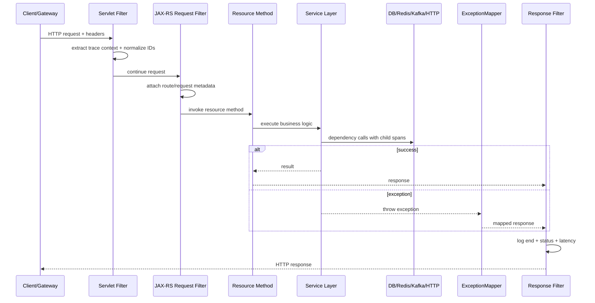

# Cheatsheet Observability Part 030 — JAX-RS and Servlet Instrumentation

> Fokus part ini: memahami bagaimana request HTTP di aplikasi **Java/JAX-RS/Jakarta REST** diinstrumentasi dari boundary Servlet/JAX-RS sampai resource method, exception mapping, response, logs, metrics, traces, dan context cleanup. Tujuannya adalah membuat setiap request production dapat dijelaskan: masuk dari mana, endpoint apa, berapa lama, gagal di mana, status apa, dependency mana yang lambat, dan evidence apa yang tersedia.

---

## 1. Core Mental Model

JAX-RS/Servlet instrumentation adalah instrumentation di HTTP entry point aplikasi Java.

Instrumentation ini harus menjawab:

- request masuk endpoint apa;
- route template apa, bukan raw path high-cardinality;
- method HTTP apa;
- status response apa;
- latency total berapa;
- exception apa yang terjadi;
- span status error atau ok;
- request punya trace ID/correlation ID apa;
- dependency call mana yang terjadi di bawah request;
- request berakhir normal, timeout, aborted, atau streaming;
- log request start/end bisa dikaitkan dengan trace.

Mental model:

```text
HTTP request
  ↓
Servlet container
  ↓
Servlet filter / auto instrumentation
  ↓
JAX-RS request filter
  ↓
Resource method
  ↓
Service layer
  ↓
Repository/client/messaging
  ↓
ExceptionMapper or normal response
  ↓
JAX-RS response filter
  ↓
HTTP response
```

Instrumentation yang baik tidak hanya membuat span. Ia menyatukan:

- trace span;
- request logs;
- HTTP metrics;
- error classification;
- MDC context;
- route template;
- safe request metadata;
- cleanup.

---

## 2. Servlet vs JAX-RS Layer

Servlet dan JAX-RS sering berada dalam satu request lifecycle, tetapi scope-nya berbeda.

| Layer | Scope | Observability use |
|---|---|---|
| Servlet container | Low-level HTTP lifecycle | root HTTP/server span, raw request/response metadata |
| Servlet filter | Framework-agnostic filter | early context extraction, MDC setup, security/request metadata |
| JAX-RS request filter | Jakarta REST resource lifecycle | route/resource context, endpoint semantics |
| Resource method | Business entry point | domain attributes, command/query intent |
| ExceptionMapper | Error-to-response mapping | error classification, span status, error log |
| JAX-RS response filter | Final response stage | latency/status/end log/cleanup |

Auto-instrumentation sering menangkap Servlet/JAX-RS span otomatis. Manual instrumentation tetap berguna untuk:

- route template correctness;
- domain attributes;
- custom error code;
- correlation ID normalization;
- audit context;
- business key;
- safe logs;
- custom metrics.

Rule:

> Jangan membuat span manual yang menduplikasi span auto-instrumentation tanpa alasan jelas.

---

## 3. Request Lifecycle Diagram



A request may fail at any stage. Instrumentation must still produce useful evidence even when:

- authentication fails before resource method;
- validation fails in request filter;
- dependency call times out;
- ExceptionMapper maps error response;
- client disconnects;
- response streaming fails after headers are sent;
- container cancels async request.

---

## 4. Goals of JAX-RS/Servlet Instrumentation

Minimum goals:

1. Create/continue server span.
2. Extract propagation headers.
3. Normalize request/correlation ID.
4. Populate MDC.
5. Emit request start/end logs.
6. Emit HTTP request metrics.
7. Use route template as endpoint dimension.
8. Set span status based on actual outcome.
9. Record exception safely.
10. Propagate context to downstream calls.
11. Avoid PII/body leakage.
12. Clear context after request.

Good instrumentation answers:

```text
Which endpoint is failing?
Which status class increased?
Which route became slow?
Which dependency dominates latency?
Which deployment version introduced regression?
Which tenant or business flow is impacted?
Did the request fail before or after resource method?
Was the failure mapped to expected business error or unexpected 500?
```

---

## 5. Request Span Design

Server span represents inbound HTTP request handling.

Recommended span name:

```text
HTTP {method} {route_template}
```

Example:

```text
HTTP POST /quotes/{quoteId}/submit
```

Avoid raw path span names:

```text
HTTP POST /quotes/Q-123456789/submit
```

Why raw path is bad:

- high-cardinality traces;
- poor aggregation;
- expensive backend indexes;
- inconsistent dashboard grouping;
- potential business ID leakage.

Useful span attributes:

```text
http.request.method=POST
http.route=/quotes/{quoteId}/submit
http.response.status_code=202
url.scheme=https
server.address=quote-api
service.name=quote-order-service
deployment.environment=prod
service.version=1.42.0
```

Potential custom safe attributes:

```text
app.request_id=...
app.correlation_id=...
app.business_flow=quote-submit
app.error_code=QUOTE_VALIDATION_FAILED
```

Be careful with:

- raw URL;
- query string;
- user ID;
- order ID;
- quote ID;
- tenant ID;
- request body;
- authorization headers.

These may be useful in logs/audit but risky as trace attributes depending on backend policy.

---

## 6. Route Template Is Critical

Route template is one of the most important HTTP observability fields.

Good:

```text
/quotes/{quoteId}/submit
/orders/{orderId}/cancel
/customers/{customerId}/quotes
```

Bad:

```text
/quotes/Q-100001/submit
/orders/O-200002/cancel
/customers/C-300003/quotes
```

Why route template matters:

- metrics aggregate correctly;
- latency percentiles are meaningful;
- dashboards remain small;
- alerting avoids cardinality explosion;
- traces are grouped by endpoint;
- support can still use business key in logs/audit.

Internal verification:

- Does JAX-RS/Jersey instrumentation capture route template?
- Are nested resource paths represented correctly?
- Are sub-resource locators handled?
- Are query params excluded or sanitized?
- Are 404 routes represented safely?
- Are wildcard routes normalized?

---

## 7. Servlet Filter Responsibility

Servlet filter runs early and is useful for framework-agnostic setup.

Typical responsibilities:

- start timer;
- extract context;
- resolve request ID;
- resolve correlation ID;
- capture safe client metadata;
- populate MDC;
- call downstream chain;
- record status/latency;
- cleanup MDC/context.

Conceptual example:

```java
public class ObservabilityServletFilter implements Filter {
    @Override
    public void doFilter(ServletRequest req, ServletResponse res, FilterChain chain)
            throws IOException, ServletException {

        HttpServletRequest request = (HttpServletRequest) req;
        HttpServletResponse response = (HttpServletResponse) res;
        long startNanos = System.nanoTime();

        try {
            String requestId = resolveRequestId(request);
            String correlationId = resolveCorrelationId(request);

            MDC.put("request_id", requestId);
            MDC.put("correlation_id", correlationId);

            chain.doFilter(req, res);
        } finally {
            long durationMs = (System.nanoTime() - startNanos) / 1_000_000;
            log.info("http_request_completed status={} duration_ms={}",
                    response.getStatus(), durationMs);
            MDC.clear();
        }
    }
}
```

Production note:

- avoid body logging;
- avoid raw query logging unless sanitized;
- ensure cleanup after exceptions;
- be careful if response status changes after filter returns;
- async requests need special handling.

---

## 8. JAX-RS Request Filter Responsibility

`ContainerRequestFilter` is closer to JAX-RS resource semantics.

Useful responsibilities:

- attach request context to JAX-RS properties;
- capture resource/matched URI info when available;
- enforce correlation convention;
- reject invalid propagation metadata if policy requires;
- add domain-level request classification;
- record request start event.

Example conceptual filter:

```java
@Provider
@Priority(Priorities.AUTHENTICATION)
public class ObservabilityRequestFilter implements ContainerRequestFilter {
    @Context
    UriInfo uriInfo;

    @Override
    public void filter(ContainerRequestContext ctx) {
        String method = ctx.getMethod();
        String path = uriInfo.getPath();

        ctx.setProperty("observability.startNanos", System.nanoTime());
        MDC.put("http_method", method);
        MDC.put("http_path", sanitizePath(path));
    }
}
```

Caveat:

- matched resource template may not be available at earliest filter priority;
- security filters may run before route matching;
- framework-specific APIs may be needed to get route template;
- do not use raw path as metric endpoint label.

---

## 9. JAX-RS Response Filter Responsibility

`ContainerResponseFilter` can record final status and latency.

Example conceptual filter:

```java
@Provider
public class ObservabilityResponseFilter implements ContainerResponseFilter {
    @Override
    public void filter(ContainerRequestContext request, ContainerResponseContext response) {
        Long startNanos = (Long) request.getProperty("observability.startNanos");
        long durationMs = startNanos == null
                ? -1
                : (System.nanoTime() - startNanos) / 1_000_000;

        String route = resolveRouteTemplate(request);
        int status = response.getStatus();

        log.info("request_end method={} route={} status={} duration_ms={}",
                request.getMethod(), route, status, durationMs);
    }
}
```

Response filter should:

- use status code, not exception assumption;
- use route template where possible;
- record duration;
- add response size if safely available;
- avoid logging body;
- ensure MDC still exists when logging;
- avoid cleanup before end log is emitted.

---

## 10. ExceptionMapper and Span Status

`ExceptionMapper` translates Java exception to HTTP response.

It is a critical observability point.

Example mapping:

| Exception type | HTTP status | Span status | Log level |
|---|---:|---|---|
| ValidationException | 400 | usually unset/error depends policy | INFO/WARN |
| AuthenticationException | 401 | error or unset depends policy | WARN/security event |
| AuthorizationException | 403 | error | WARN/security event |
| NotFoundException | 404 | usually unset if expected | INFO |
| DomainConflictException | 409 | expected business error | INFO/WARN |
| DependencyTimeoutException | 503/504 | error | ERROR |
| Unexpected RuntimeException | 500 | error | ERROR |

Example conceptual mapper:

```java
@Provider
public class GenericExceptionMapper implements ExceptionMapper<Throwable> {
    @Override
    public Response toResponse(Throwable ex) {
        ErrorResponse error = classify(ex);

        Span current = Span.current();
        current.recordException(ex);
        current.setAttribute("app.error_code", error.code());

        if (error.isUnexpected() || error.isDependencyFailure()) {
            current.setStatus(StatusCode.ERROR, error.code());
            log.error("request_failed error_code={} status={}", error.code(), error.status(), ex);
        } else {
            log.info("request_rejected error_code={} status={}", error.code(), error.status());
        }

        return Response.status(error.status()).entity(error.safeBody()).build();
    }
}
```

Important:

- not every 4xx needs ERROR log;
- expected domain rejection is not the same as system failure;
- unexpected 500 must have stack trace and correlation fields;
- span status should reflect failure semantics, not only HTTP code mechanically;
- error response body must be safe.

---

## 11. HTTP Metrics from Instrumentation

JAX-RS instrumentation should emit metrics such as:

```text
http.server.request.duration
http.server.request.count
http.server.error.count
http.server.active_requests
```

Recommended dimensions:

```text
method
route_template
status_code or status_class
service
environment
```

Use carefully:

```text
tenant_category
traffic_class
region
version
```

Avoid high-cardinality labels:

```text
request_id
trace_id
span_id
user_id
quote_id
order_id
raw_path
raw_query
error_message
```

Metric design:

- latency should be histogram/timer;
- request count should be counter;
- active request should be gauge;
- status should usually be grouped by code or class;
- route template is allowed, raw path is not;
- version label can help release debugging but may increase series count.

---

## 12. Request Start and End Logs

Request start log is useful for:

- proving request entered service;
- identifying long-running in-flight requests;
- debugging request cancellation;
- correlating with edge logs.

Request end log is useful for:

- status;
- latency;
- route;
- error code;
- response size;
- service version;
- trace/correlation ID.

Example start:

```text
request_start method=POST route=/quotes/{quoteId}/submit correlation_id=... trace_id=...
```

Example end:

```text
request_end method=POST route=/quotes/{quoteId}/submit status=202 duration_ms=183 correlation_id=... trace_id=...
```

Avoid:

```text
Request body: {full quote payload...}
```

For high-volume endpoints, request start logs may be sampled or disabled if end logs plus traces/metrics are sufficient. But critical mutation endpoints often benefit from clear start/end evidence.

---

## 13. Client IP and User Agent

Client metadata is useful but risky.

Possible fields:

```text
client.ip
user_agent.original
http.request.header.x_forwarded_for
```

Concerns:

- `X-Forwarded-For` can be spoofed unless trusted proxy chain is enforced;
- user agent can be high-cardinality and noisy;
- IP may be personal data depending on policy;
- raw headers may contain sensitive values;
- edge logs may be better source for client network data.

Recommended approach:

- trust only sanitized client IP from gateway/ingress policy;
- store full user agent only if approved and useful;
- avoid metric labels from user agent/IP;
- mask or omit where privacy policy requires;
- use edge logs for detailed network debugging.

---

## 14. Header Logging Strategy

Headers are dangerous.

Never log directly:

```text
Authorization
Cookie
Set-Cookie
X-Api-Key
Proxy-Authorization
Session headers
CSRF token
```

Potentially useful safe headers:

```text
traceparent
x-request-id
x-correlation-id
x-forwarded-for after sanitization
content-type
accept
user-agent with policy
```

Header logging strategy:

- allowlist, not denylist;
- sanitize values;
- limit length;
- never log all headers by default;
- separate debug-only temporary logging with approval;
- ensure temporary logging expires.

---

## 15. Body and Query Parameter Logging

Body logging is usually high risk.

Risks:

- PII leakage;
- secrets leakage;
- commercial data leakage;
- huge log volume;
- performance overhead;
- legal/compliance exposure;
- duplicate data already stored in DB/audit.

Query parameter logging is also risky because URLs often contain:

- tokens;
- emails;
- account IDs;
- customer identifiers;
- search terms;
- commercial filters.

Safer strategy:

- log route template;
- log payload size;
- log validation error code;
- log schema/version;
- log safe business event/audit event;
- log selected allowlisted fields only if approved.

---

## 16. Async Request Handling

Servlet/JAX-RS async request can outlive the original request thread.

Risks:

- MDC cleared before async completion;
- span ended too early;
- latency measured incorrectly;
- exception happens after response lifecycle point;
- response filter not enough for async completion;
- streaming responses fail after status is committed.

For async:

- capture context before async handoff;
- make context current in async callback;
- end span on actual completion;
- log completion/failure in callback;
- clear MDC after async completion;
- record timeout/cancel separately.

Conceptual flow:

```text
request thread extracts context
  ↓
async task captures context
  ↓
request thread returns
  ↓
async callback restores context
  ↓
response completes or fails
  ↓
span/log/metric finalized
```

---

## 17. Streaming Response Instrumentation

Streaming response is special because status may be sent before full work completes.

Examples:

- file download;
- large export;
- server-sent events;
- chunked response;
- long polling;
- report generation stream.

Instrumentation concerns:

- request duration may mean time-to-first-byte or full stream duration;
- error after headers are sent may not change HTTP status;
- client disconnect should be observable;
- bytes sent may be useful;
- long streams can distort latency histograms;
- timeout behavior must be explicit.

Recommended:

- separate metrics for normal REST request and streaming endpoints if needed;
- log stream start/end/failure;
- avoid logging streamed content;
- include route template and correlation ID;
- record client disconnect if detectable;
- document how latency is measured.

---

## 18. Resource Method Span Strategy

Auto-instrumentation may already create server span. Creating extra span per resource method can be useful, but also noisy.

Use resource method span when:

- route handler contains meaningful orchestration;
- you need business operation naming;
- you need separation between HTTP handling and domain command;
- you need attributes such as `business_flow=quote-submit`.

Avoid resource method span when:

- it duplicates server span exactly;
- it adds no new diagnostic value;
- it creates excessive span volume;
- attributes are unsafe/high-cardinality;
- it confuses trace hierarchy.

Better pattern:

```text
HTTP POST /quotes/{quoteId}/submit
  └── QuoteSubmissionCommand
      ├── validate quote
      ├── DB update quote
      ├── publish QuoteSubmitted
      └── start approval workflow
```

But only if these spans help debugging and are sampled/controlled appropriately.

---

## 19. Auto-Instrumentation vs Manual Instrumentation

Auto-instrumentation is good for standard boundaries:

- Servlet;
- JAX-RS/Jersey;
- JDBC;
- HTTP clients;
- Kafka clients;
- Redis clients;
- common executors;
- logging correlation.

Manual instrumentation is needed for:

- business operation spans;
- custom route resolution;
- custom error code attributes;
- domain lifecycle events;
- audit context;
- queue/message wrapper abstractions;
- custom retry/DLQ logic;
- internal framework code not covered by agent.

Decision rule:

| Question | Prefer |
|---|---|
| Is this standard framework boundary? | Auto instrumentation |
| Is this domain/business operation? | Manual instrumentation |
| Is current trace missing critical context? | Manual safe attributes |
| Is span duplicate/noisy? | Remove or avoid |
| Is instrumentation inconsistent across services? | Shared library/platform standard |

---

## 20. OpenTelemetry Integration Points

Typical Java/JAX-RS setup:

```text
Java service
  ↓
OpenTelemetry Java agent or SDK
  ↓
Servlet/JAX-RS instrumentation
  ↓
JDBC/HTTP/Kafka/Redis instrumentation
  ↓
OTLP exporter
  ↓
Collector
```

Important runtime configuration:

```text
service.name
service.version
deployment.environment
otel.exporter.otlp.endpoint
otel.propagators
sampling config
resource attributes
log correlation setting
```

Production caution:

- local/dev config may not match Kubernetes/prod;
- service name must be stable;
- version must come from build/deployment metadata;
- propagator must match ecosystem standard;
- sampling must not hide critical failures;
- collector endpoint must be reachable and resilient.

---

## 21. Logging and MDC Integration

JAX-RS instrumentation must align logs and traces.

Log fields expected:

```text
trace_id
span_id
request_id
correlation_id
method
route
status
duration_ms
error_code
service
environment
version
```

Good request end log:

```text
level=INFO message=request_end method=POST route=/quotes/{quoteId}/submit status=202 duration_ms=183 trace_id=... correlation_id=...
```

Bad request end log:

```text
level=INFO message="Done /quotes/Q-123/submit"
```

Why bad:

- raw path leaks business key;
- no latency;
- no status;
- no trace/correlation ID;
- no endpoint aggregation;
- weak incident value.

MDC cleanup must happen after final request/end/error logs are emitted.

---

## 22. Error Classification in HTTP Instrumentation

Instrumentation should distinguish:

- expected client error;
- expected domain rejection;
- authentication/authorization failure;
- dependency failure;
- timeout;
- rate limit;
- circuit breaker open;
- unexpected server failure.

Example error fields:

```text
error.code=DEPENDENCY_TIMEOUT
error.category=dependency
error.retryable=true
http.response.status_code=504
```

Do not use raw exception message as metric label.

Good metric labels:

```text
error_category=dependency
error_code=DEPENDENCY_TIMEOUT
status_class=5xx
route=/quotes/{quoteId}/submit
```

Bad metric labels:

```text
error_message="Timeout calling http://10.1.2.3/customer/12345 after 2891ms"
```

---

## 23. Dependency Correlation from Request Span

The request span should reveal dependency latency.

Good trace shape:

```text
HTTP POST /quotes/{quoteId}/submit [250ms]
  ├── PostgreSQL UPDATE quote [45ms]
  ├── Redis GET pricing-cache [8ms]
  ├── HTTP POST customer-service /eligibility [120ms]
  └── Kafka publish QuoteSubmitted [12ms]
```

This allows incident responder to ask:

- is request slow because of DB?
- is Redis degraded?
- is downstream HTTP timing out?
- is Kafka publish blocking?
- is CPU/JVM saturation causing all spans to be slow?

If request span has no child spans, check:

- auto-instrumentation disabled;
- unsupported client library;
- context not current;
- manual wrapper hides standard client;
- sampling drops child spans;
- collector/backend filtering.

---

## 24. Kubernetes and Deployment Metadata

JAX-RS instrumentation should include resource metadata that helps release/debugging.

Useful attributes/log fields:

```text
service.name
service.version
deployment.environment
k8s.namespace.name
k8s.pod.name
k8s.container.name
k8s.deployment.name
cloud.provider
cloud.region
```

Why:

- identify bad rollout;
- compare pod versions;
- find single bad pod;
- correlate with restart/OOMKilled;
- diagnose region-specific issue;
- link trace to Kubernetes events.

Do not manually invent these differently per service if collector/platform can enrich them consistently.

---

## 25. Failure Modes

Common JAX-RS/Servlet instrumentation failure modes:

1. No server spans for inbound requests.
2. Raw path used instead of route template.
3. 404/exception paths not instrumented.
4. ExceptionMapper maps 500 but span status remains OK.
5. Expected 4xx logged as ERROR causing noise.
6. Request end log missing when exception occurs.
7. MDC cleared before response filter logs.
8. Async request span ends before actual completion.
9. Streaming failure not visible.
10. Body/header logging leaks sensitive data.
11. HTTP metrics use high-cardinality labels.
12. Route labels differ across services for same endpoint style.
13. Health check traffic pollutes latency/error metrics.
14. Readiness probe failures are mixed with user traffic.
15. Auto and manual spans duplicate each other.
16. Client disconnects are invisible.
17. Gateway request ID not propagated to app log.
18. Version/resource attributes missing.

---

## 26. Debugging Workflow for HTTP Request Issues

When an endpoint is failing or slow:

1. Open service health dashboard.
2. Identify route, status class, latency percentile, and time window.
3. Check recent deployment/config markers.
4. Open traces for slow/error requests.
5. Inspect request span route/status/duration.
6. Inspect child spans for DB/Redis/Kafka/RabbitMQ/HTTP.
7. Search logs by trace ID/correlation ID.
8. Check ExceptionMapper logs/error code.
9. Compare edge access log and application request log.
10. Check Kubernetes pod restart/OOM/throttling.
11. Check dependency dashboard.
12. Determine blast radius: all routes, one route, one tenant, one version, one pod, one dependency.
13. Capture evidence before mitigation.

---

## 27. Privacy and Security Concerns

JAX-RS instrumentation is close to raw user input. That makes it dangerous.

Never capture by default:

- request body;
- response body;
- authorization header;
- cookies;
- session tokens;
- API keys;
- passwords;
- raw query strings;
- full URLs with sensitive query params;
- PII fields;
- commercial payload;
- SQL parameters.

Safer alternatives:

- route template;
- payload size;
- schema version;
- validation error code;
- business event name;
- safe business status;
- redacted/masked allowlisted fields;
- audit log in controlled storage.

Security rule:

> Observability metadata must not become an ungoverned copy of production data.

---

## 28. Performance and Cost Concerns

Instrumentation overhead sources:

- too many spans;
- too many attributes;
- high-cardinality route/path labels;
- body capture;
- synchronous logging;
- expensive route resolution;
- huge MDC maps;
- debug logging on hot path;
- per-request allocation pressure;
- unbounded exception stack traces in high-error loops.

Cost controls:

- use route template;
- sample high-volume traces;
- avoid request/body/header dumps;
- limit attributes;
- avoid high-cardinality labels;
- log only meaningful request events;
- classify error codes instead of raw messages;
- separate health/probe traffic;
- aggregate status class when enough.

---

## 29. Internal Verification Checklist

Cek di internal CSG/team:

- apakah JAX-RS/Servlet auto-instrumentation aktif;
- framework yang dipakai: Jersey, RESTEasy, Servlet container, atau custom stack;
- apakah route template tertangkap dengan benar;
- apakah raw path pernah dipakai sebagai metric label/span name;
- apakah request start/end log tersedia;
- apakah trace ID/span ID masuk ke logs;
- apakah gateway request ID masuk ke aplikasi;
- apakah correlation ID dinormalisasi;
- apakah ExceptionMapper mengatur error code/log/span status;
- apakah expected 4xx tidak menjadi ERROR noise;
- apakah unexpected 500 punya stack trace dan correlation ID;
- apakah request body/header/query logging dibatasi;
- apakah sensitive headers di-redact;
- apakah async request diinstrumentasi sampai completion;
- apakah streaming endpoint punya observability khusus;
- apakah health/readiness/liveness traffic dipisahkan dari user traffic;
- apakah service version/deployment metadata ada di traces/logs/metrics;
- apakah child spans DB/Redis/HTTP/Kafka/RabbitMQ muncul di trace;
- apakah latency histogram memakai route template;
- apakah dashboard bisa filter by endpoint/status/version;
- apakah alert menggunakan route/status/latency yang actionable;
- apakah PR template meminta observability review untuk endpoint baru;
- apakah integration test memastikan log/trace/metric emission.

---

## 30. PR Review Checklist

Saat review endpoint JAX-RS baru atau perubahan HTTP behavior:

- Apakah endpoint punya route template yang stabil?
- Apakah request/response logging aman dan cukup?
- Apakah log tidak mencetak body/header sensitif?
- Apakah error mapping jelas?
- Apakah expected error tidak menjadi ERROR noise?
- Apakah unexpected error punya stack trace dan error code?
- Apakah metric route/status/latency akan tercatat?
- Apakah metric labels tidak high-cardinality?
- Apakah trace punya child spans untuk dependency utama?
- Apakah outbound call tetap propagate context?
- Apakah correlation/business key masuk log/audit jika relevan?
- Apakah endpoint baru perlu dashboard panel atau alert?
- Apakah endpoint mutation perlu audit event?
- Apakah health/probe behavior tidak mengganggu SLO?
- Apakah performance overhead instrumentation wajar?

---

## 31. Production Readiness Checklist

Endpoint/service siap production jika:

- server span tersedia;
- route template benar;
- request metrics tersedia;
- request logs memiliki trace/correlation ID;
- error code konsisten;
- ExceptionMapper aman;
- sensitive data tidak bocor;
- dependency spans terlihat;
- dashboard dapat menunjukkan health endpoint;
- alert dapat membedakan symptom utama;
- version/deployment metadata tersedia;
- Kubernetes/pod metadata dapat dikorelasikan;
- runbook menjelaskan cara debug endpoint failure;
- tests menjaga propagation dan logging contract.

---

## 32. Summary

JAX-RS/Servlet instrumentation adalah fondasi observability untuk HTTP-facing Java service.

Instrumentation yang baik membuat request production dapat dijelaskan dari beberapa sudut:

- trace menunjukkan causal path;
- metric menunjukkan trend dan impact;
- log menunjukkan detail operasional;
- error mapping menunjukkan failure semantics;
- audit menunjukkan business/security evidence;
- dashboard dan alert mengubah signal menjadi action.

Prinsip final:

> Instrument HTTP entry point dengan route template, context propagation, safe logs, correct metrics, meaningful spans, error classification, and strict privacy discipline. Endpoint yang tidak observable adalah production risk.
