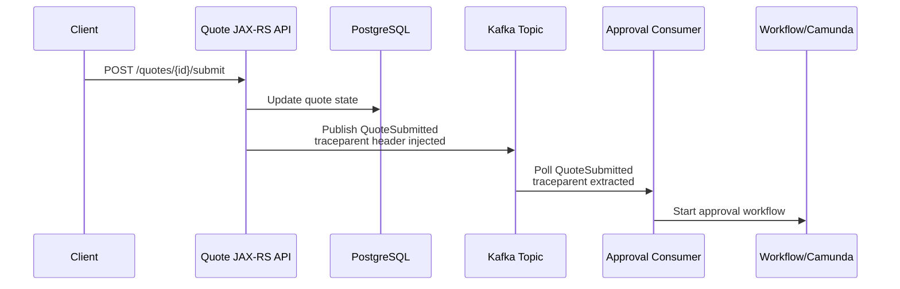

# Cheatsheet Observability Part 033 — Kafka Instrumentation

> Fokus part ini: memahami bagaimana **Kafka producer dan consumer** di aplikasi **Java/JAX-RS** harus diinstrumentasi agar event publishing, event consumption, consumer lag, retry, DLQ, duplicate event, event age, processing latency, dan trace continuity dapat dianalisis saat production incident. Kafka instrumentation bukan sekadar melihat topic/partition/offset, tetapi membangun bukti causal dari request bisnis sampai asynchronous side effect.

---

## 1. Core Mental Model

Kafka instrumentation adalah observability untuk boundary asynchronous.

Dalam request synchronous, caller menunggu response. Dalam Kafka, producer dan consumer dipisahkan oleh topic, partition, offset, retention, consumer group, broker, retry behavior, dan processing lifecycle.

Flow umum di sistem Java/JAX-RS:

```text
HTTP request
  ↓
JAX-RS resource method
  ↓
Service layer
  ↓
Database transaction
  ↓
Kafka producer publishes event
  ↓
Kafka broker stores event
  ↓
Consumer group polls event
  ↓
Consumer handler processes event
  ↓
Database / Redis / HTTP / RabbitMQ / Camunda side effect
  ↓
Offset commit / retry / DLQ
```

Kafka instrumentation harus menjawab:

- event apa yang dipublish;
- dari request atau business operation mana event berasal;
- apakah publish berhasil atau gagal;
- topic/partition/offset mana yang terlibat;
- berapa lama event menunggu sebelum diproses;
- consumer group mana yang tertinggal;
- apakah processing gagal, retry, atau masuk DLQ;
- apakah duplicate event terjadi;
- apakah trace context tetap tersambung dari HTTP ke consumer;
- apakah message key/header aman dari PII/secrets;
- apakah backlog berdampak ke order/quote lifecycle.

Kafka observability bukan hanya broker dashboard. Untuk production debugging, Anda butuh kombinasi:

- producer logs;
- producer metrics;
- producer spans;
- broker/topic metrics;
- consumer lag metrics;
- consumer processing metrics;
- consumer logs;
- consumer spans;
- DLQ/retry metrics;
- business state metrics;
- audit/business event correlation.

---

## 2. Kafka Is Not Just a Dependency

Kafka sering diperlakukan seperti dependency biasa, padahal sifatnya berbeda dari HTTP/database.

| Aspect | HTTP dependency | Kafka dependency |
|---|---|---|
| Caller waits? | Usually yes | Usually no |
| Failure visibility | Immediate response/error | Often delayed |
| Ordering | Per request | Per partition/key |
| Retry | Client-side, synchronous or bounded | Producer retry, consumer retry, reprocessing, DLQ |
| Correlation | Request/trace ID | Trace ID + message ID + event ID + business key |
| Latency | Call duration | Publish latency + queue/event age + processing latency |
| Impact | Request failure/degradation | Delayed business state, backlog, stale projection |

A Kafka issue may not break the HTTP request immediately.

Example:

```text
POST /quotes/{id}/submit returns 200.
Kafka event publishing succeeds.
Consumer processing silently falls behind.
Approval workflow is not triggered for 45 minutes.
Customer sees quote stuck in SUBMITTED.
```

If only HTTP metrics are monitored, the service looks healthy. Observability must include asynchronous consequence.

---

## 3. Kafka Instrumentation Boundaries

Kafka instrumentation has four major boundaries.

| Boundary | Main question | Primary signals |
|---|---|---|
| Producer | Did we publish the right event? | producer span, publish metric, producer log |
| Broker/topic | Is Kafka accepting and storing events? | broker/topic metrics, produce error, partition availability |
| Consumer group | Are consumers keeping up? | consumer lag, poll metrics, rebalance metrics |
| Consumer handler | Did processing succeed? | consumer span, processing metric, error log, retry/DLQ signal |

Do not stop at producer success.

Producer success only means:

```text
The event was accepted according to producer acknowledgement configuration.
```

It does not mean:

```text
The business process completed.
The consumer processed it.
The downstream system accepted it.
The order moved to the next state.
```

---

## 4. Producer Span Design

A producer span represents publish operation.

Typical span name:

```text
Kafka publish <topic>
```

or:

```text
messaging.publish quote-events
```

Useful attributes:

| Attribute | Example | Notes |
|---|---:|---|
| messaging.system | kafka | Low cardinality |
| messaging.operation | publish | Low cardinality |
| messaging.destination.name | quote-events | Topic name |
| messaging.kafka.partition | 12 | If known |
| messaging.kafka.message.key_hash | sha256-prefix | Prefer hash, not raw key |
| event.type | quote.submitted | Business event type |
| event.schema.version | 3 | Useful during schema evolution |
| service.name | quote-service | Resource-level ideally |
| deployment.environment | prod | Resource-level ideally |
| business.domain | quote-management | Low cardinality |

Avoid attributes like:

- raw customer ID;
- raw account ID;
- raw quote ID if high cardinality backend cannot handle it;
- raw message payload;
- raw authorization token;
- full exception message as label if it explodes cardinality.

For debugging, put sensitive/high-cardinality values in logs only if policy allows, and never as metric labels.

---

## 5. Producer Log Design

Producer logs should record operational facts around event publishing without dumping payload.

Good producer INFO log for important business event:

```json
{
  "timestamp": "2026-07-11T10:15:30.123Z",
  "level": "INFO",
  "event.name": "kafka.publish.succeeded",
  "service.name": "quote-service",
  "topic": "quote-events",
  "event.type": "quote.submitted",
  "event.schema.version": "3",
  "partition": 12,
  "offset": 902133,
  "correlation_id": "corr-7f3a",
  "trace_id": "4bf92f3577b34da6a3ce929d0e0e4736",
  "quote_id": "Q-12345",
  "tenant_id": "tenant-a",
  "duration_ms": 18
}
```

Good producer ERROR log:

```json
{
  "level": "ERROR",
  "event.name": "kafka.publish.failed",
  "topic": "quote-events",
  "event.type": "quote.submitted",
  "correlation_id": "corr-7f3a",
  "trace_id": "4bf92f3577b34da6a3ce929d0e0e4736",
  "quote_id": "Q-12345",
  "error.type": "org.apache.kafka.common.errors.TimeoutException",
  "error.message.safe": "Kafka producer send timed out",
  "retryable": true
}
```

Bad producer log:

```text
sent kafka message
```

Also bad:

```text
sent payload={...entire quote with customer data, token, price details...}
```

Producer log must support debugging without becoming data leakage.

---

## 6. Producer Metrics

Producer metrics should show health and behavior across time.

Minimum application-level producer metrics:

| Metric | Type | Labels | Purpose |
|---|---|---|---|
| kafka_producer_publish_total | counter | topic, event_type, result | Publish throughput and failure rate |
| kafka_producer_publish_duration_seconds | histogram | topic, event_type | Publish latency distribution |
| kafka_producer_publish_error_total | counter | topic, error_type | Error trend |
| kafka_producer_record_size_bytes | histogram | topic, event_type | Detect oversized events |
| kafka_producer_retry_total | counter | topic, error_type | Detect broker/network instability |

Be careful with labels:

```text
Good labels:
- topic
- event_type
- result
- error_type
- environment

Risky labels:
- quote_id
- order_id
- customer_id
- request_id
- raw error message
- message key
```

Quote/order IDs are useful for logs/traces/audit, but dangerous as metric labels.

---

## 7. Producer Acknowledgement and Observability

Kafka producer acknowledgement affects what publish success means.

Common conceptual modes:

| Acknowledgement intent | Observability concern |
|---|---|
| Fast but less durable | Need publish loss risk awareness |
| Leader acknowledged | Need broker/replica risk awareness |
| Stronger durability via required acknowledgements | Higher latency, better durability evidence |

As a senior engineer, do not review producer logs without asking:

- what is the acknowledgement setting;
- what is retry setting;
- what is delivery timeout;
- what is idempotent producer setting;
- whether send result includes topic/partition/offset;
- whether failures are surfaced to request/business transaction;
- whether outbox pattern is used for DB + Kafka atomicity.

Internal details must be verified in the codebase and platform config.

---

## 8. Transaction Boundary: DB Commit vs Kafka Publish

One major production risk is inconsistent state between database and Kafka.

Example unsafe sequence:

```text
1. Update quote status to SUBMITTED in PostgreSQL.
2. Commit transaction.
3. Publish QuoteSubmitted event to Kafka.
4. Kafka publish fails.
```

Result:

```text
Database says quote submitted.
Downstream consumers never receive event.
Approval process does not start.
```

Opposite unsafe sequence:

```text
1. Publish QuoteSubmitted event.
2. Update database status.
3. Database commit fails.
```

Result:

```text
Consumer may process an event for state that does not exist or was not committed.
```

Observability must expose this boundary.

Useful signals:

- database transaction span;
- Kafka publish span;
- outbox insert log/metric;
- outbox relay publish log/metric;
- reconciliation metric;
- missing event detector;
- business state aging metric;
- DLQ/retry metric.

If the architecture uses outbox, instrumentation should distinguish:

```text
business transaction writes outbox row
```

from:

```text
outbox relay publishes Kafka event
```

They are different failure domains.

---

## 9. Trace Context Propagation through Kafka

Trace continuity across Kafka requires context propagation in message headers.

Conceptual flow:

```text
HTTP root span
  ↓
Service/business span
  ↓
Kafka producer span
  ↓ trace context injected into Kafka headers
Kafka topic
  ↓ trace context extracted from Kafka headers
Kafka consumer span
  ↓
Consumer processing span
```

Mermaid view:



If propagation breaks, trace appears as two unrelated traces:

```text
Trace A: HTTP request → Kafka publish
Trace B: Kafka consume → workflow start
```

That makes incident reconstruction harder.

Internal verification checklist:

- verify `traceparent` injection into Kafka headers;
- verify extraction in consumer;
- verify custom correlation ID is also propagated;
- verify baggage policy;
- verify headers survive retry/DLQ path;
- verify test coverage for propagation.

---

## 10. Consumer Span Design

A consumer span represents receiving and processing a Kafka message.

Possible span names:

```text
Kafka consume <topic>
```

or:

```text
messaging.process quote-events
```

Useful attributes:

| Attribute | Example | Notes |
|---|---:|---|
| messaging.system | kafka | Low cardinality |
| messaging.operation | process | Consumer handler operation |
| messaging.destination.name | quote-events | Topic |
| messaging.kafka.consumer.group | approval-service | Consumer group |
| messaging.kafka.partition | 12 | Partition |
| messaging.kafka.offset | 902133 | Useful in trace/log, high cardinality caution |
| event.type | quote.submitted | Business event type |
| event.age_ms | 4700 | Time from event creation to processing |
| retry.attempt | 2 | Useful for retry debugging |
| dlq | false | If applicable |

Consumer span must include processing, not only polling.

Bad span model:

```text
poll batch took 10ms
```

Good span model:

```text
message processing took 850ms and failed due to downstream timeout
```

---

## 11. Consumer Log Design

Consumer logs need to show message identity, processing outcome, business key, and failure handling.

Good consumer start log:

```json
{
  "level": "INFO",
  "event.name": "kafka.consume.started",
  "topic": "quote-events",
  "partition": 12,
  "offset": 902133,
  "consumer_group": "approval-service",
  "event.type": "quote.submitted",
  "event_id": "evt-abc",
  "correlation_id": "corr-7f3a",
  "trace_id": "4bf92f3577b34da6a3ce929d0e0e4736",
  "quote_id": "Q-12345",
  "event_age_ms": 4700
}
```

Good consumer end log:

```json
{
  "level": "INFO",
  "event.name": "kafka.consume.succeeded",
  "topic": "quote-events",
  "partition": 12,
  "offset": 902133,
  "consumer_group": "approval-service",
  "event.type": "quote.submitted",
  "quote_id": "Q-12345",
  "duration_ms": 850,
  "side_effect": "approval_workflow_started"
}
```

Good consumer failure log:

```json
{
  "level": "ERROR",
  "event.name": "kafka.consume.failed",
  "topic": "quote-events",
  "partition": 12,
  "offset": 902133,
  "consumer_group": "approval-service",
  "event.type": "quote.submitted",
  "quote_id": "Q-12345",
  "retryable": true,
  "retry_attempt": 3,
  "next_action": "send_to_retry_topic",
  "error.type": "java.net.SocketTimeoutException",
  "error.message.safe": "Workflow API timeout"
}
```

Do not log entire event payload by default.

---

## 12. Consumer Metrics

Minimum consumer metrics:

| Metric | Type | Labels | Purpose |
|---|---|---|---|
| kafka_consumer_processed_total | counter | topic, consumer_group, event_type, result | Processing throughput and result |
| kafka_consumer_processing_duration_seconds | histogram | topic, consumer_group, event_type | Handler latency |
| kafka_consumer_error_total | counter | topic, consumer_group, error_type | Error rate |
| kafka_consumer_retry_total | counter | topic, consumer_group, reason | Retry behavior |
| kafka_consumer_dlq_total | counter | topic, consumer_group, event_type, reason | DLQ trend |
| kafka_consumer_event_age_seconds | histogram | topic, consumer_group, event_type | Queueing / staleness |
| kafka_consumer_lag | gauge | topic, consumer_group, partition? | Backlog indicator |

Use partition label carefully.

Partition-level lag is useful for diagnosis but can increase cardinality. It may belong in infrastructure/broker metrics rather than app-level metrics depending on backend cost.

---

## 13. Event Age vs Processing Latency

Do not confuse event age and processing latency.

| Signal | Meaning | Example |
|---|---|---|
| Publish latency | Time producer takes to send event | 20ms |
| Event age | Time between event creation and consumer start | 30 minutes |
| Processing latency | Time handler takes to process message | 900ms |
| End-to-end latency | Creation to business effect completion | 30m 900ms |

A consumer may process quickly but still be late:

```text
event_age = 45 minutes
processing_duration = 200ms
```

This means:

```text
Consumer handler is fast, but backlog/lag exists.
```

A consumer may be current but slow:

```text
event_age = 1 second
processing_duration = 20 seconds
```

This means:

```text
Handler or downstream dependency is slow.
```

Both have different mitigation.

---

## 14. Consumer Lag Is a Symptom, Not a Root Cause

Consumer lag means consumer group is behind topic end offset.

Possible causes:

- consumers down;
- consumer pods crashlooping;
- slow handler;
- downstream dependency timeout;
- database lock contention;
- too few partitions;
- too few consumer instances;
- rebalance storm;
- poison message blocking partition;
- batch size too large or too small;
- CPU throttling;
- GC pauses;
- network/broker issue;
- processing is intentionally paused.

Observability must help distinguish these.

Minimum correlation for lag incident:

```text
consumer lag ↑
consumer error rate ?
consumer processing duration ?
consumer retry rate ?
DLQ count ?
pod restarts ?
CPU throttling ?
JVM GC pause ?
downstream latency ?
DB lock wait ?
recent deployment ?
```

---

## 15. Retry and DLQ Instrumentation

Retry and DLQ paths must be first-class observable paths.

A retry event should answer:

- original topic;
- retry topic if used;
- event ID;
- correlation ID;
- original trace ID if policy allows;
- retry attempt;
- error category;
- next retry time if delayed retry;
- reason;
- whether retry is safe/idempotent.

A DLQ event should answer:

- what event failed;
- why it failed;
- how many attempts were made;
- whether failure is data issue, dependency issue, schema issue, or code bug;
- who owns the DLQ;
- how to replay;
- whether replay is safe;
- business impact.

Good DLQ log:

```json
{
  "level": "ERROR",
  "event.name": "kafka.message.sent_to_dlq",
  "source_topic": "quote-events",
  "dlq_topic": "quote-events-dlq",
  "event.type": "quote.submitted",
  "event_id": "evt-abc",
  "quote_id": "Q-12345",
  "consumer_group": "approval-service",
  "retry_attempt": 5,
  "failure.category": "schema_validation",
  "replay_safe": false,
  "owner": "internal-verification-required"
}
```

---

## 16. Duplicate Event Observability

Kafka consumers must often be idempotent.

Duplicates may happen due to:

- retry after processing but before offset commit;
- consumer rebalance;
- producer retry without idempotency;
- outbox relay retry;
- manual replay;
- DLQ replay;
- consumer crash after side effect;
- at-least-once delivery semantics.

Observability should include:

- event ID;
- idempotency key;
- duplicate detected counter;
- duplicate skipped log;
- idempotency store latency;
- replay marker;
- side effect deduplication result.

Example duplicate skip log:

```json
{
  "level": "INFO",
  "event.name": "kafka.message.duplicate_skipped",
  "topic": "quote-events",
  "event.type": "quote.submitted",
  "event_id": "evt-abc",
  "idempotency_key": "quote-submit-Q-12345-v7",
  "quote_id": "Q-12345",
  "reason": "already_processed"
}
```

Metric:

```text
kafka_consumer_duplicate_detected_total{topic,event_type,consumer_group}
```

Never use raw event ID as a metric label.

---

## 17. Schema Evolution Observability

Kafka systems fail when producers and consumers disagree on event shape.

Observable schema signals:

- event schema version;
- schema validation error;
- deserialization error;
- unknown field behavior;
- missing required field;
- incompatible version;
- producer version;
- consumer version;
- deployment marker.

Good deserialization failure log:

```json
{
  "level": "ERROR",
  "event.name": "kafka.deserialize.failed",
  "topic": "quote-events",
  "partition": 12,
  "offset": 902133,
  "consumer_group": "approval-service",
  "event.schema.version": "unknown",
  "error.type": "SchemaValidationException",
  "failure.category": "schema_incompatible",
  "next_action": "send_to_dlq"
}
```

Dashboard should show:

- deserialization error rate;
- schema validation failure rate;
- DLQ count by failure category;
- recent producer deployment;
- recent consumer deployment.

---

## 18. Batch Processing Observability

Consumers may process messages one by one or in batches.

Batch processing changes telemetry design.

Questions:

- did the whole batch fail;
- did one message fail;
- were successful messages committed;
- what is batch size;
- how long did batch processing take;
- how many records were processed;
- how many records failed;
- how many were retried;
- what offset range was included.

Useful fields:

```json
{
  "event.name": "kafka.batch.processed",
  "topic": "quote-events",
  "partition": 12,
  "offset_start": 902100,
  "offset_end": 902149,
  "batch_size": 50,
  "processed_count": 49,
  "failed_count": 1,
  "duration_ms": 4200
}
```

Trace design options:

| Option | Pros | Cons |
|---|---|---|
| One span per batch | Lower overhead | Harder per-message debugging |
| One span per message | Better detail | Higher cost/volume |
| Batch span + sampled message spans | Balanced | More complex |

For high-throughput systems, avoid tracing every message unless sampling/cost is understood.

---

## 19. Message Key Privacy

Kafka message keys often contain business identifiers.

Examples:

```text
quoteId
orderId
customerId
accountId
tenantId
```

Risks:

- key appears in logs;
- key appears in trace attributes;
- key appears in metrics labels;
- key appears in DLQ tooling;
- key leaks through support screenshots;
- key reveals tenant/customer relationships.

Safer patterns:

- log business key only if policy allows;
- hash message key in trace attribute;
- never use key as metric label;
- classify which identifiers are sensitive;
- mask or tokenize customer/account identifiers;
- keep payload out of routine logs.

Internal verification checklist:

- message key format;
- key sensitivity classification;
- allowed logging fields;
- DLQ access control;
- support/debug tooling behavior;
- masking/redaction implementation.

---

## 20. Kafka Header Design

Headers are where correlation and trace context usually live.

Common header categories:

| Header category | Examples | Purpose |
|---|---|---|
| Trace context | `traceparent`, `tracestate` | Distributed trace continuity |
| Correlation | `x-correlation-id`, `x-request-id` | Log/search correlation |
| Causation | `x-causation-id` | Causal chain |
| Event identity | `event-id`, `event-type`, `schema-version` | Event tracking |
| Tenant/business | tenant ID, domain key | Routing/debugging; privacy review required |
| Security | actor, auth context | High risk; avoid raw tokens |

Do not propagate everything.

Baggage/header bloat can cause:

- network overhead;
- storage overhead;
- privacy leakage;
- spoofing risk;
- inconsistent trust boundary.

Headers crossing service/team boundaries need governance.

---

## 21. Kafka Trace Topologies

Kafka traces can be modeled in different ways.

### Topology A — Linked producer and consumer spans

```text
HTTP span → producer span → consumer span → processing span
```

Best when context propagation is continuous.

### Topology B — Consumer starts new trace with link

```text
Trace A: HTTP → publish
Trace B: consume → process
Trace B links to producer context
```

Useful when asynchronous delay is long or trace backend models messaging as links.

### Topology C — No connection, only correlation ID

```text
Search logs by correlation_id/event_id
```

Fallback when tracing not integrated.

As a senior engineer, verify what model your backend/team uses. Do not assume visual trace behavior without checking actual traces.

---

## 22. Observability for Consumer Rebalancing

Rebalances can cause processing gaps and latency spikes.

Signals:

- rebalance count;
- partition assignment changes;
- consumer pause/resume;
- poll interval breaches;
- consumer group member count;
- pod restart correlation;
- processing duration spikes;
- lag spikes after rebalance.

Logs should indicate:

```json
{
  "event.name": "kafka.consumer.rebalanced",
  "consumer_group": "approval-service",
  "assigned_partitions": ["quote-events-0", "quote-events-1"],
  "revoked_partitions": ["quote-events-2"],
  "reason": "internal-verification-required"
}
```

Rebalance storms are often platform/runtime symptoms:

- CPU throttling;
- GC pauses;
- slow handler;
- max poll interval exceeded;
- network instability;
- deployment rolling restart;
- bad scaling settings.

---

## 23. Observability for Poison Messages

A poison message repeatedly fails and blocks progress, especially when partition ordering is preserved.

Symptoms:

- lag grows on one partition;
- same offset appears repeatedly in error logs;
- retry count grows;
- consumer processing duration pattern repeats;
- downstream side effect may be duplicated;
- DLQ count eventually grows if configured.

Signals needed:

- topic;
- partition;
- offset;
- event ID;
- event type;
- schema version;
- failure category;
- retry attempt;
- next action;
- idempotency result;
- replay safety.

Debugging question:

```text
Is this a bad event, bad code, bad schema, bad downstream dependency, or transient infrastructure issue?
```

---

## 24. Dashboard Design for Kafka Instrumentation

A useful Kafka service dashboard should have separate sections.

### Producer section

- publish rate by topic/event type;
- publish error rate;
- publish latency p50/p95/p99;
- producer retry count;
- record size distribution;
- recent deployment marker.

### Consumer section

- processed rate by topic/event type/result;
- processing latency p50/p95/p99;
- consumer error rate;
- retry count;
- DLQ count;
- duplicate detected count;
- event age p50/p95/p99.

### Lag section

- consumer lag by group/topic;
- lag by partition if needed;
- max lag;
- lag age if available;
- consumer pod health;
- rebalance count.

### Business section

- quote/order state aging;
- stuck orders/quotes;
- workflow not started;
- fulfillment delay;
- reconciliation mismatch.

Kafka dashboard is incomplete if it only shows broker health.

---

## 25. Alert Design for Kafka Paths

Good Kafka alerts are symptom/action oriented.

Examples:

| Alert | Good when | Avoid |
|---|---|---|
| Consumer lag high for critical topic | Lag implies business delay | Alerting on tiny lag for low-value topics |
| DLQ count increasing | Message loss/manual intervention risk | Paging on every single DLQ in low severity domain |
| Consumer processing error rate high | Handler broken or dependency down | Alerting on expected validation rejects |
| Event age SLO burn | Business freshness is violated | Only alerting on offset lag without impact |
| Producer publish failure high | Events not entering Kafka | Alerting on transient single retry |

Alert should include:

- topic;
- consumer group;
- event type if relevant;
- current lag/event age;
- dashboard link;
- runbook link;
- likely impact;
- owner;
- replay/DLQ instructions if applicable.

---

## 26. Failure Mode Catalog

| Failure mode | Primary signal | Debug path |
|---|---|---|
| Producer cannot publish | publish error metric/log/span | Check broker/network/auth/config |
| Producer timeout | publish latency/error | Check broker health, timeout config, network |
| Event published but not consumed | consumer lag/event age | Check consumer group health |
| Consumer down | lag + pod status | Check deployment/pods/logs |
| Consumer slow | processing latency | Check handler/downstream/JVM/DB |
| Poison message | repeated failure same offset | Check payload/schema/business validation |
| DLQ spike | DLQ metric/log | Classify failure category and replay safety |
| Duplicate processing | duplicate counter/log | Check idempotency and commit boundary |
| Trace broken | missing consumer parent/link | Check header propagation |
| Schema mismatch | deserialize/schema error | Check producer/consumer version and schema registry/process |
| Lag after deploy | deployment marker + lag | Check new consumer code/config/resource |

---

## 27. Production Debugging Flow

When business flow is delayed and Kafka may be involved:

```text
1. Identify business key: quote_id/order_id/event_id.
2. Search producer log: was event published?
3. Confirm topic/partition/offset.
4. Check consumer group lag for that topic.
5. Search consumer logs by event_id/correlation_id/business key.
6. Check consumer processing result.
7. Check retry/DLQ path.
8. Open trace from HTTP request to producer and consumer if available.
9. Check downstream dependency from consumer.
10. Reconstruct timeline.
11. Determine customer/business impact.
12. Choose mitigation: scale consumer, pause/replay, fix data, rollback, retry dependency, run reconciliation.
```

Do not jump directly to replay.

Replay without understanding idempotency and side effects can make incident worse.

---

## 28. Example Timeline Reconstruction

Incident:

```text
Approval workflows delayed for submitted quotes.
```

Evidence timeline:

```text
10:00 deployment of approval-service v2.17.3
10:03 consumer processing latency p95 increases from 300ms to 8s
10:05 consumer lag begins increasing on quote-events
10:08 downstream workflow API timeout increases
10:12 event age p95 reaches 7 minutes
10:15 customer support reports quote stuck in SUBMITTED
10:18 DLQ count remains zero, indicating messages are delayed but not permanently failing
10:25 rollback approval-service to v2.17.2
10:31 processing latency normalizes
10:45 lag drains
```

Likely interpretation:

```text
Consumer processing path degraded after deployment, probably due to workflow API client behavior, timeout config, retry behavior, or resource regression.
```

This conclusion requires multiple signals, not one graph.

---

## 29. Privacy and Security Concerns

Kafka telemetry may expose sensitive information through:

- topic names;
- event types;
- message keys;
- headers;
- payload logs;
- DLQ storage;
- trace attributes;
- error messages;
- replay tools;
- support dashboards.

Rules:

- never log full payload by default;
- never put secrets/tokens in headers;
- avoid raw customer/account IDs in metrics/traces;
- classify quote/order/tenant IDs according to policy;
- restrict DLQ access;
- ensure replay tooling logs are controlled;
- sanitize exception messages;
- review event schema for PII.

Audit and observability are related but not identical. Audit requires integrity and compliance semantics; Kafka operational logs do not automatically satisfy audit requirements.

---

## 30. Cost Concerns

Kafka instrumentation can create high telemetry volume.

Cost drivers:

- one span per message at high throughput;
- logging every consumed message at INFO;
- partition/offset labels in metrics;
- event ID/order ID labels;
- raw error message labels;
- large exception logs;
- high-cardinality topic/event type combinations;
- long retention for verbose consumer logs;
- DLQ payload storage.

Cost-aware strategies:

- sample normal message traces;
- always keep errors/DLQ traces;
- use event type not event ID as metric label;
- move detailed per-message info to logs with retention policy;
- use structured logs for search instead of high-cardinality metrics;
- aggregate low-value events;
- keep business-critical flows higher visibility.

---

## 31. Kafka Instrumentation PR Review Checklist

Ask these questions during PR review:

### Producer

- Is publish success/failure observable?
- Does log include topic, event type, correlation ID, trace ID, business key if allowed?
- Are topic/partition/offset captured when available?
- Is payload excluded or safely redacted?
- Is publish latency measured?
- Is publish failure surfaced correctly to caller/business flow?
- Is DB + Kafka consistency handled or at least observable?

### Consumer

- Is processing success/failure observable?
- Is event age measured?
- Is processing latency measured?
- Is retry/DLQ path observable?
- Is duplicate detection observable?
- Is idempotency behavior logged/metriced?
- Are deserialization/schema errors visible?

### Propagation

- Is trace context injected and extracted?
- Is correlation ID propagated?
- Are headers preserved across retry/DLQ?
- Are unsafe headers blocked?

### Metrics

- Are labels low cardinality?
- Are result/error labels bounded?
- Are topic/event_type labels governed?
- Are business IDs excluded from metric labels?

### Production readiness

- Is there a dashboard?
- Is there an alert for lag/DLQ/event age where business-critical?
- Is there a runbook for replay/DLQ?
- Is privacy reviewed?
- Is cost reviewed?

---

## 32. Internal Verification Checklist

Verify in the internal CSG/team environment:

### Kafka client and framework

- Which Java Kafka client/framework is used?
- Is Kafka used directly, through framework abstraction, or platform library?
- Is OpenTelemetry Java agent enabled?
- Is manual instrumentation added anywhere?
- Are producer/consumer interceptors used?

### Producer

- What topics does the service publish to?
- What event types are produced?
- What acknowledgement/retry/timeout/idempotency settings are configured?
- Are topic/partition/offset logged?
- Is outbox pattern used?
- Is outbox relay observable?

### Consumer

- What consumer groups exist?
- Which topics are consumed?
- Are batch or single-message consumers used?
- How are offsets committed?
- How are errors handled?
- How are retries implemented?
- Is DLQ used?
- Is replay supported?

### Context propagation

- Are `traceparent` and correlation headers injected into Kafka headers?
- Are they extracted by consumers?
- Are headers preserved through retry topics and DLQ?
- Are baggage headers allowed or restricted?
- Are spoofed headers handled at trust boundaries?

### Metrics and dashboards

- Is consumer lag visible?
- Is event age visible?
- Is processing latency visible?
- Is DLQ count visible?
- Is retry count visible?
- Is duplicate count visible?
- Are Kafka dashboards linked from service dashboards?

### Security/privacy

- Are payloads logged anywhere?
- Are message keys sensitive?
- Are headers sensitive?
- Who can access DLQ payloads?
- Are quote/order/customer identifiers allowed in logs?
- Are they allowed in traces?
- Are they forbidden as metric labels?

---

## 33. Practical Senior Engineer Heuristics

Use these heuristics:

```text
If Kafka is business-critical, monitor event age, not only consumer lag.
```

```text
If a consumer has side effects, idempotency must be observable.
```

```text
If DLQ exists but has no owner/runbook, it is not a safety mechanism; it is a hidden backlog.
```

```text
If a trace ends at producer and restarts at consumer, incident reconstruction will be slower.
```

```text
If message key or event ID is used as metric label, cost/cardinality risk is high.
```

```text
If payload logging is needed to debug, instrumentation design is probably weak or safe debug tooling is missing.
```

---

## 34. Anti-Patterns

Avoid:

- logging full Kafka payloads at INFO;
- treating producer success as business completion;
- alerting only on broker health but not consumer lag/event age;
- missing DLQ ownership;
- using raw quote/order/customer/request IDs as metric labels;
- losing correlation ID in consumer threads;
- retry loops without retry attempt logs;
- duplicate processing without idempotency telemetry;
- replay tooling without audit trail;
- batch consumer logs without offset range;
- tracing every high-volume event without sampling/cost review;
- hiding schema validation failures inside generic consumer exceptions.

---

## 35. Key Takeaways

Kafka instrumentation must make asynchronous work reconstructable.

A production-ready Kafka observability design connects:

```text
HTTP request
→ business operation
→ database transaction
→ Kafka publish
→ topic/partition/offset
→ consumer group lag
→ consumer processing
→ retry/DLQ/idempotency
→ downstream side effect
→ business state transition
```

For senior backend engineers, the key discipline is not adding more logs everywhere. It is designing bounded, correlated, privacy-safe, cost-aware signals that answer production questions quickly.

The most important questions:

- Was the event produced?
- Was it consumed?
- Was it processed successfully?
- Was it late?
- Was it duplicated?
- Was it retried or sent to DLQ?
- Did it cause the intended business state transition?
- Can we prove all of that with logs, metrics, traces, and audit/business signals?
