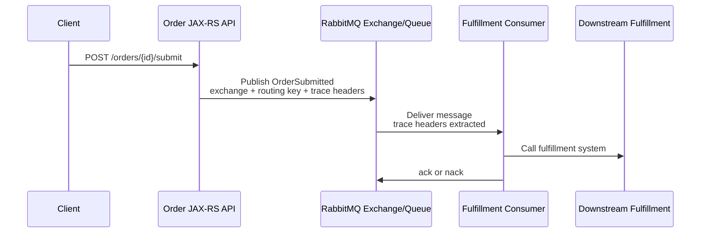

# Cheatsheet Observability Part 034 — RabbitMQ Instrumentation

> Fokus part ini: memahami bagaimana **RabbitMQ publishing dan consuming** di aplikasi **Java/JAX-RS** harus diinstrumentasi agar exchange routing, queue depth, message age, consumer processing, ack/nack, redelivery, retry, DLQ, dead-lettering, trace propagation, dan business impact bisa dianalisis saat incident production. RabbitMQ instrumentation harus menjelaskan bukan hanya “message terkirim”, tetapi apakah message diroute, dikonsumsi, diproses, di-ack, di-retry, atau menjadi backlog/fallout.

---

## 1. Core Mental Model

RabbitMQ instrumentation adalah observability untuk brokered messaging dengan routing semantics.

Flow umum:

```text
HTTP request
  ↓
JAX-RS resource method
  ↓
Service layer
  ↓
RabbitMQ publisher
  ↓
Exchange
  ↓ routing key / binding
Queue
  ↓
Consumer receives message
  ↓
Handler processes message
  ↓
ack / nack / reject / retry / DLQ
  ↓
Downstream side effect or business state transition
```

Kafka berpusat pada log topic/partition/offset. RabbitMQ berpusat pada exchange, queue, routing key, bindings, delivery, acknowledgement, redelivery, and dead-lettering.

RabbitMQ instrumentation harus menjawab:

- message dipublish ke exchange mana;
- routing key apa yang dipakai;
- apakah message berhasil diroute ke queue;
- queue mana yang menerima;
- seberapa lama message menunggu di queue;
- consumer mana yang memproses;
- apakah message di-ack, nack, reject, retry, atau DLQ;
- apakah redelivery loop terjadi;
- apakah prefetch/concurrency menyebabkan backlog;
- apakah trace/correlation context tersambung;
- apakah payload/header aman;
- apakah business state berubah sesuai ekspektasi.

---

## 2. RabbitMQ Is Routing-Oriented

RabbitMQ failure sering terjadi di routing dan acknowledgement boundary.

| Concept | Observability question |
|---|---|
| Exchange | Message dipublish ke exchange yang benar? |
| Routing key | Routing key cocok dengan binding? |
| Queue | Queue depth tumbuh? Consumer aktif? |
| Binding | Message bisa sampai queue yang diharapkan? |
| Ack | Consumer menyatakan message selesai? |
| Nack/reject | Message gagal dan ditangani benar? |
| Redelivery | Message diproses berulang? |
| DLX/DLQ | Message gagal diarahkan ke dead-letter path? |
| Prefetch | Consumer mengambil terlalu banyak message? |
| Message TTL | Message expired sebelum diproses? |

Jangan hanya memantau queue depth global. Queue depth perlu dikaitkan dengan queue purpose, consumer health, message age, and business impact.

---

## 3. RabbitMQ Instrumentation Boundaries

Empat boundary utama:

| Boundary | Main question | Primary signals |
|---|---|---|
| Publisher | Did we publish to the expected exchange/routing key? | publish span, publish log, publish metric |
| Broker routing | Did exchange route the message? | unroutable returns, broker metrics, confirms |
| Queue | Is the queue accumulating messages? | queue depth, message age, ready/unacked |
| Consumer | Did processing complete and ack? | consume span, handler metric, ack/nack log |

A message can fail at each boundary.

Example:

```text
Publisher succeeds locally but message is unroutable.
```

or:

```text
Message reaches queue but no consumer is active.
```

or:

```text
Consumer receives message but keeps failing and redelivering.
```

Each requires different telemetry.

---

## 4. Publisher Span Design

A publish span represents sending a message to RabbitMQ.

Possible span names:

```text
RabbitMQ publish <exchange>
```

or:

```text
messaging.publish order.exchange
```

Useful attributes:

| Attribute | Example | Notes |
|---|---:|---|
| messaging.system | rabbitmq | Low cardinality |
| messaging.operation | publish | Low cardinality |
| messaging.destination.name | order.exchange | Exchange name |
| messaging.rabbitmq.routing_key | order.submitted | Review cardinality/privacy |
| messaging.message.id | msg-abc | Trace/log only; not metric label |
| event.type | order.submitted | Low cardinality business event |
| event.schema.version | 2 | Useful for compatibility |
| correlation_id | corr-7f3a | Usually log/header; trace attribute if allowed |
| business.domain | order-management | Low cardinality |

Avoid span attributes that contain:

- full payload;
- raw token/header;
- full customer data;
- arbitrary routing key if unbounded;
- raw error message if it explodes cardinality.

---

## 5. Publisher Log Design

Good publish success log:

```json
{
  "level": "INFO",
  "event.name": "rabbitmq.publish.succeeded",
  "service.name": "order-service",
  "exchange": "order.exchange",
  "routing_key": "order.submitted",
  "message_type": "OrderSubmitted",
  "message_id": "msg-abc",
  "correlation_id": "corr-7f3a",
  "trace_id": "4bf92f3577b34da6a3ce929d0e0e4736",
  "order_id": "O-12345",
  "tenant_id": "tenant-a",
  "duration_ms": 12
}
```

Good publish failure log:

```json
{
  "level": "ERROR",
  "event.name": "rabbitmq.publish.failed",
  "exchange": "order.exchange",
  "routing_key": "order.submitted",
  "message_type": "OrderSubmitted",
  "message_id": "msg-abc",
  "correlation_id": "corr-7f3a",
  "order_id": "O-12345",
  "error.type": "java.io.IOException",
  "error.message.safe": "RabbitMQ publish failed",
  "retryable": true
}
```

Bad log:

```text
message sent
```

Bad secure logging:

```text
published payload={full order, account data, authorization token, pricing details}
```

Message body should not be logged by default.

---

## 6. Publisher Metrics

Minimum publisher metrics:

| Metric | Type | Labels | Purpose |
|---|---|---|---|
| rabbitmq_publish_total | counter | exchange, routing_key_class, message_type, result | Publish throughput/failure |
| rabbitmq_publish_duration_seconds | histogram | exchange, message_type | Publish latency |
| rabbitmq_publish_error_total | counter | exchange, error_type | Error trend |
| rabbitmq_unroutable_total | counter | exchange, routing_key_class | Routing/binding failure |
| rabbitmq_publisher_confirm_duration_seconds | histogram | exchange | Confirm latency if publisher confirms are used |

Use `routing_key_class` if raw routing keys can be high-cardinality.

Example:

```text
routing_key = order.submitted.tenant-123.region-9
```

This may be unsafe as a metric label.

Better:

```text
routing_key_class = order.submitted
```

---

## 7. Publisher Confirms and Return Handling

RabbitMQ publishing observability should verify whether the application uses publisher confirms and unroutable return handling.

Important cases:

| Case | Meaning | Required signal |
|---|---|---|
| Publish call succeeded | Client wrote message to broker connection | Publish log/span |
| Publisher confirm ack | Broker accepted message | Confirm metric/log |
| Publisher confirm nack | Broker did not accept message | Error log/metric |
| Unroutable return | Message could not be routed | Unroutable metric/log |

Without confirms/return handling, an app may believe publish succeeded while message is lost or unrouted depending on config.

Internal verification checklist:

- Are publisher confirms enabled?
- Are returned messages handled?
- Is mandatory flag used where appropriate?
- Are confirm nacks logged?
- Are unroutable messages counted?
- Is publish failure tied to business transaction?

---

## 8. Routing Observability

RabbitMQ routing is a first-class failure domain.

A routing issue may happen when:

- exchange name changed;
- binding missing;
- routing key typo;
- queue not declared;
- deployment creates inconsistent topology;
- tenant-specific routing key pattern changed;
- message TTL/expiration configured incorrectly;
- dead-letter exchange missing or misbound.

Signals:

- unroutable message count;
- broker return logs;
- topology drift signal;
- queue depth zero when messages expected;
- business state stuck;
- deployment/config change marker;
- DLQ missing expected messages.

Debugging question:

```text
Was the message published, routed, queued, delivered, processed, and acked?
```

Do not stop at “published”.

---

## 9. Trace Context Propagation through RabbitMQ

Trace context should be propagated in message headers.

Conceptual flow:

```text
HTTP request span
  ↓
Business operation span
  ↓
RabbitMQ publish span
  ↓ traceparent injected into message headers
Exchange/Queue
  ↓ traceparent extracted by consumer
RabbitMQ consume span
  ↓
Handler span
```

Mermaid view:



If trace context is missing, RabbitMQ splits the causal story:

```text
Trace A: HTTP request → publish
Trace B: consume → downstream call
```

A fallback correlation ID helps, but trace continuity is better for latency and dependency visualization.

---

## 10. Header Design

RabbitMQ headers often carry observability metadata.

Common headers:

| Header | Purpose |
|---|---|
| traceparent | W3C trace context |
| tracestate | Trace vendor/state context |
| x-correlation-id | Search/log correlation |
| x-causation-id | Causal relationship |
| message-id | Message identity |
| event-type | Business event/command type |
| schema-version | Compatibility/debugging |
| tenant-id | Tenant context; privacy review required |
| actor-id | Security/business context; privacy review required |

Do not propagate:

- authorization token;
- cookie;
- password;
- session ID;
- full user profile;
- arbitrary inbound headers;
- unbounded baggage.

Headers must cross trust boundaries deliberately.

---

## 11. Consumer Span Design

A consume span represents message delivery and handler processing.

Possible names:

```text
RabbitMQ consume <queue>
```

or:

```text
messaging.process fulfillment.queue
```

Useful attributes:

| Attribute | Example | Notes |
|---|---:|---|
| messaging.system | rabbitmq | Low cardinality |
| messaging.operation | process | Consumer processing |
| messaging.destination.name | fulfillment.queue | Queue name |
| messaging.rabbitmq.exchange | order.exchange | If available |
| messaging.rabbitmq.routing_key | order.submitted | Review cardinality |
| messaging.message.id | msg-abc | Trace/log only |
| messaging.rabbitmq.delivery_tag | 718 | Useful in logs/traces |
| messaging.rabbitmq.redelivered | true | Important for retry/debugging |
| event.type | order.submitted | Business event type |
| message.age_ms | 2500 | Queue delay |

Consumer span status should reflect processing outcome.

If message is nack/retried, span should not look successful.

---

## 12. Consumer Log Design

Good consume start log:

```json
{
  "level": "INFO",
  "event.name": "rabbitmq.consume.started",
  "queue": "fulfillment.queue",
  "exchange": "order.exchange",
  "routing_key": "order.submitted",
  "message_type": "OrderSubmitted",
  "message_id": "msg-abc",
  "delivery_tag": 718,
  "redelivered": false,
  "correlation_id": "corr-7f3a",
  "trace_id": "4bf92f3577b34da6a3ce929d0e0e4736",
  "order_id": "O-12345",
  "message_age_ms": 2500
}
```

Good consume success log:

```json
{
  "level": "INFO",
  "event.name": "rabbitmq.consume.succeeded",
  "queue": "fulfillment.queue",
  "message_type": "OrderSubmitted",
  "message_id": "msg-abc",
  "delivery_tag": 718,
  "order_id": "O-12345",
  "duration_ms": 830,
  "ack": true,
  "side_effect": "fulfillment_request_created"
}
```

Good consume failure log:

```json
{
  "level": "ERROR",
  "event.name": "rabbitmq.consume.failed",
  "queue": "fulfillment.queue",
  "message_type": "OrderSubmitted",
  "message_id": "msg-abc",
  "delivery_tag": 718,
  "redelivered": true,
  "order_id": "O-12345",
  "retryable": true,
  "next_action": "nack_requeue_false_to_dlx",
  "error.type": "java.net.SocketTimeoutException",
  "error.message.safe": "Fulfillment API timeout"
}
```

---

## 13. Ack, Nack, Reject, and Redelivery Observability

RabbitMQ consumer correctness depends heavily on acknowledgement behavior.

| Action | Meaning | Observability concern |
|---|---|---|
| ack | Message processed successfully | Confirm side effect completed before ack |
| nack requeue true | Message returned to queue | Redelivery loop risk |
| nack requeue false | Message rejected/dead-lettered if configured | DLQ path visibility |
| reject | Reject a single message | Need reason and next action |
| auto-ack | Message considered done on delivery | Loss risk if handler fails |

Instrumentation should expose:

- ack count;
- nack count;
- reject count;
- redelivery count;
- requeue count;
- DLQ count;
- processing failure reason;
- ack latency;
- side effect status before ack.

A classic bug:

```text
Consumer calls downstream service.
Downstream succeeds.
Consumer crashes before ack.
Message is redelivered.
Downstream side effect happens twice.
```

Required observability:

- idempotency key;
- duplicate side effect detection;
- redelivered flag;
- message ID;
- business key;
- handler outcome;
- ack status.

---

## 14. Consumer Metrics

Minimum consumer metrics:

| Metric | Type | Labels | Purpose |
|---|---|---|---|
| rabbitmq_consumer_processed_total | counter | queue, message_type, result | Processing throughput/outcome |
| rabbitmq_consumer_processing_duration_seconds | histogram | queue, message_type | Handler latency |
| rabbitmq_consumer_error_total | counter | queue, error_type | Error trend |
| rabbitmq_consumer_ack_total | counter | queue, message_type | Ack trend |
| rabbitmq_consumer_nack_total | counter | queue, message_type, reason | Failure/retry trend |
| rabbitmq_consumer_redelivery_total | counter | queue, message_type | Redelivery loop detection |
| rabbitmq_consumer_message_age_seconds | histogram | queue, message_type | Queue delay/freshness |
| rabbitmq_consumer_inflight | gauge | queue | Processing concurrency |

Broker/platform metrics should include:

- queue ready messages;
- unacked messages;
- publish rate;
- deliver/get rate;
- ack rate;
- consumer count;
- memory/disk alarms;
- connection/channel count;
- node health.

---

## 15. Queue Depth, Unacked, and Message Age

Queue depth alone is insufficient.

| Signal | Meaning | Common interpretation |
|---|---|---|
| Ready messages | Messages waiting in queue | Consumers behind or absent |
| Unacked messages | Delivered but not acked | Consumers processing slowly or stuck |
| Message age | How old waiting messages are | Business freshness risk |
| Consumer count | Active consumers | Deployment/connectivity health |
| Deliver rate | Broker delivers messages | Consumption flow |
| Ack rate | Consumers complete messages | Processing throughput |

Examples:

```text
ready high, unacked low
```

Likely:

```text
Not enough consumers, consumers down, or prefetch/concurrency too low.
```

```text
ready low, unacked high
```

Likely:

```text
Consumers received messages but are slow/stuck before ack.
```

```text
ready high, deliver rate high, ack rate low
```

Likely:

```text
Handlers are failing, timing out, or repeatedly nacking/requeueing.
```

---

## 16. Prefetch and Concurrency Observability

Prefetch controls how many unacked messages can be delivered to a consumer.

High prefetch can cause:

- one consumer hoards messages;
- unfair distribution;
- high unacked count;
- slow recovery after consumer failure;
- memory pressure;
- delayed redelivery.

Low prefetch can cause:

- underutilization;
- low throughput;
- queue depth buildup;
- excessive round trips.

Observability should show:

- consumer concurrency;
- prefetch setting;
- unacked per consumer if available;
- processing latency;
- ack rate;
- queue depth;
- pod CPU/memory;
- downstream latency.

Internal verification checklist:

- prefetch count per consumer;
- consumer concurrency settings;
- max threads/executors;
- backpressure behavior;
- interaction with downstream rate limits.

---

## 17. Retry and DLQ Instrumentation

RabbitMQ retry may be implemented in several ways:

- immediate requeue;
- delayed exchange/plugin;
- retry queues with TTL;
- application-level retry;
- dead-letter exchange;
- manual replay.

Each strategy needs telemetry.

Retry log should include:

- original exchange;
- original routing key;
- current queue;
- retry count;
- error category;
- next retry delay;
- redelivered flag;
- message ID;
- correlation ID;
- business key;
- next action.

DLQ log should include:

```json
{
  "level": "ERROR",
  "event.name": "rabbitmq.message.sent_to_dlq",
  "source_queue": "fulfillment.queue",
  "dead_letter_exchange": "fulfillment.dlx",
  "dead_letter_queue": "fulfillment.dlq",
  "message_type": "OrderSubmitted",
  "message_id": "msg-abc",
  "order_id": "O-12345",
  "retry_attempt": 5,
  "failure.category": "downstream_timeout",
  "replay_safe": "internal-verification-required"
}
```

DLQ without owner and replay policy is operational debt.

---

## 18. Redelivery Loop Detection

Redelivery loop happens when a message fails and is requeued repeatedly.

Symptoms:

- high redelivery count;
- same message ID appears repeatedly;
- unacked oscillates;
- queue throughput exists but business progress does not;
- consumer CPU high;
- downstream repeatedly called;
- logs show repeated same error.

Instrumentation:

```text
rabbitmq_consumer_redelivery_total{queue,message_type}
```

Structured log:

```json
{
  "event.name": "rabbitmq.redelivery.detected",
  "queue": "fulfillment.queue",
  "message_id": "msg-abc",
  "order_id": "O-12345",
  "redelivery_count_observed": 4,
  "last_error.type": "ValidationException",
  "next_action": "dead_letter"
}
```

Avoid infinite requeue for deterministic failures.

---

## 19. Message Age and Business Freshness

Message age is essential for business workflows.

Example:

```text
order.fulfillment.requested message waits 45 minutes before consumer starts.
```

HTTP service may still be healthy, but business process is delayed.

Message age can be calculated from:

- message creation timestamp header;
- event timestamp field;
- broker timestamp if available and reliable;
- application publish timestamp.

Metric:

```text
rabbitmq_consumer_message_age_seconds{queue,message_type}
```

Use message age for:

- freshness SLI;
- queue backlog severity;
- incident impact estimation;
- prioritizing queues;
- detecting consumer downtime.

---

## 20. Message Identity and Idempotency

RabbitMQ consumers often need idempotency because redelivery is possible.

Use:

- message ID;
- idempotency key;
- business key;
- operation version;
- deduplication store;
- side effect idempotency.

Signals:

- duplicate detected count;
- duplicate skipped log;
- idempotency store latency;
- side effect already exists log;
- redelivered flag;
- replay marker.

Example duplicate log:

```json
{
  "level": "INFO",
  "event.name": "rabbitmq.message.duplicate_skipped",
  "queue": "fulfillment.queue",
  "message_id": "msg-abc",
  "idempotency_key": "order-submit-O-12345-v3",
  "order_id": "O-12345",
  "reason": "side_effect_already_created"
}
```

Never use message ID or order ID as metric labels.

---

## 21. Message TTL and Expiration Observability

RabbitMQ messages may expire due to TTL.

TTL can be intentional:

```text
Do not process stale pricing calculation request after 10 minutes.
```

Or accidental:

```text
Fulfillment command expires before consumer recovers.
```

Signals:

- expired message count if available;
- DLQ reason/headers;
- message age distribution;
- queue depth vs consumer downtime;
- business state stuck;
- retry queue TTL behavior.

Debugging question:

```text
Did the message fail, wait, expire, dead-letter, or disappear due to TTL/policy?
```

Internal verification required because TTL/dead-letter behavior depends on queue policy and broker configuration.

---

## 22. Topology Observability

RabbitMQ topology includes:

- exchanges;
- queues;
- bindings;
- routing keys;
- dead-letter exchanges;
- dead-letter queues;
- policies;
- quorum/classic queue type if relevant;
- permissions;
- vhosts;
- users/connections/channels.

Topology drift can break messaging.

Observability should include:

- topology as code if possible;
- deployment validation;
- missing queue/exchange startup failure;
- binding mismatch detection;
- unroutable message alert;
- environment-specific topology diff;
- broker policy visibility.

In GitOps/Kubernetes environments, topology may be declared by manifests, Helm values, operator CRDs, or application startup code. Verify internal approach.

---

## 23. Dashboard Design for RabbitMQ Instrumentation

A useful RabbitMQ dashboard should have sections.

### Publisher section

- publish rate by exchange/message type;
- publish error rate;
- publisher confirm latency;
- unroutable count;
- publish duration;
- recent deployment marker.

### Broker/queue section

- ready messages by queue;
- unacked messages by queue;
- message age p95/p99;
- deliver rate;
- ack rate;
- consumer count;
- connection/channel count;
- broker memory/disk alarms.

### Consumer section

- processing rate;
- processing latency;
- error rate;
- ack/nack/reject count;
- redelivery count;
- inflight processing;
- DLQ count;
- duplicate detected count.

### Business section

- order/quote state aging;
- stuck fulfillment;
- fallout created;
- manual intervention backlog;
- workflow delay.

---

## 24. Alert Design for RabbitMQ Paths

Good alerts:

| Alert | Why it matters |
|---|---|
| Queue message age above SLO | Business freshness violation |
| Ready messages increasing on critical queue | Consumers behind/absent |
| Unacked messages high | Consumers stuck/slow before ack |
| DLQ count increasing | Manual intervention or data/code issue |
| Redelivery rate high | Retry loop or poison message |
| Unroutable messages > 0 | Routing/binding/config issue |
| Consumer count zero | No service processing queue |
| Broker memory/disk alarm | Broker delivery/publish risk |

Bad alerts:

- page on any non-zero queue depth for bursty queue;
- page on low-value retry queue backlog without business impact;
- alert on publisher retry once;
- alert without queue owner/runbook;
- alert on DLQ with no replay guidance.

Alert payload should include:

- queue;
- exchange/routing key if relevant;
- message age/current depth;
- consumer count;
- dashboard link;
- runbook link;
- business impact hint;
- owner/escalation.

---

## 25. Failure Mode Catalog

| Failure mode | Primary signal | Debug path |
|---|---|---|
| Publish failure | publish error log/metric | Check broker connectivity/auth/config |
| Unroutable message | return/unroutable metric | Check exchange/binding/routing key |
| Queue depth growing | ready messages/message age | Check consumers, rate, downstream |
| High unacked | unacked gauge | Check handler latency, stuck threads, prefetch |
| Consumer count zero | consumer count | Check deployment/connectivity/credentials |
| Redelivery loop | redelivery metric/log | Check poison message/retry policy |
| DLQ spike | DLQ metric/log | Classify failure and replay policy |
| Message expired | DLQ reason/message age | Check TTL and consumer downtime |
| Duplicate side effect | duplicate metric/log | Check ack timing/idempotency |
| Trace broken | missing parent/link | Check header injection/extraction |
| Broker alarm | memory/disk alarm | Check broker capacity and queue buildup |

---

## 26. Production Debugging Flow

When RabbitMQ may be involved in an incident:

```text
1. Identify business key: order_id/quote_id/message_id/correlation_id.
2. Search publisher logs: was message published?
3. Confirm exchange and routing key.
4. Check unroutable/return metrics.
5. Check target queue depth, unacked, consumer count, message age.
6. Search consumer logs by message_id/correlation_id/business key.
7. Check ack/nack/reject/redelivery behavior.
8. Check retry/DLQ path.
9. Open trace if context propagation exists.
10. Check downstream dependency called by consumer.
11. Determine whether message is delayed, stuck, failed, expired, or duplicated.
12. Choose mitigation: scale consumers, fix routing, pause/retry, replay DLQ, rollback deployment, fix data, run reconciliation.
```

Do not replay DLQ until idempotency and side effects are understood.

---

## 27. Example Incident Reconstruction

Incident:

```text
Orders are stuck before fulfillment.
```

Evidence:

```text
09:00 order-service deployment v4.12.1
09:03 publish rate normal
09:04 unroutable_total starts increasing for routing_key=order.submitted
09:05 fulfillment.queue ready depth remains flat
09:06 no consumer errors
09:08 business metric: orders in SUBMITTED aging rises
09:15 investigation finds routing key changed from order.submitted to orders.submitted
09:22 rollback deployed
09:25 unroutable_total stops increasing
```

Interpretation:

```text
This is not consumer failure. It is publisher routing regression caused by deployment/config change.
```

Required signals:

- publish log with routing key;
- unroutable metric/log;
- deployment marker;
- queue depth;
- business state aging.

---

## 28. Privacy and Security Concerns

RabbitMQ telemetry can leak sensitive data through:

- payload logs;
- headers;
- routing keys;
- queue names;
- DLQ payloads;
- exception messages;
- trace attributes;
- replay tooling;
- support screenshots.

Rules:

- do not log payload by default;
- do not propagate tokens/cookies/passwords;
- classify business identifiers;
- restrict DLQ access;
- sanitize error messages;
- avoid raw customer/account IDs in metric labels;
- review routing key patterns for tenant/customer leakage;
- audit replay actions where required.

A queue name can itself reveal business process. Treat operational metadata as sensitive when required by policy.

---

## 29. Cost Concerns

RabbitMQ instrumentation cost drivers:

- logging every message at INFO for high-volume queue;
- tracing every message without sampling;
- high-cardinality routing key labels;
- message ID/order ID labels;
- verbose exception logs during redelivery loop;
- DLQ payload retention;
- dashboards with expensive per-queue/per-consumer queries;
- long retention on debug logs.

Cost-aware strategy:

- keep metrics aggregated by queue/message type/result;
- log detailed per-message fields only where valuable;
- sample successful traces;
- always keep failure/DLQ/redelivery traces where feasible;
- avoid high-cardinality labels;
- cap debug logging duration;
- set retention by signal purpose.

---

## 30. RabbitMQ Instrumentation PR Review Checklist

### Publisher

- Is exchange logged and traced?
- Is routing key logged safely?
- Are publisher confirms used if required?
- Are unroutable returns handled?
- Are publish errors surfaced?
- Is publish latency measured?
- Is payload excluded/redacted?

### Routing/topology

- Are exchange/queue/binding changes reviewed?
- Is topology defined consistently across environments?
- Are DLX/DLQ bindings correct?
- Is routing key pattern bounded?
- Are topology changes tied to deployment/config metadata?

### Consumer

- Is processing success/failure observable?
- Are ack/nack/reject outcomes logged/metriced?
- Is redelivery visible?
- Is message age measured?
- Is idempotency visible?
- Is retry/DLQ path observable?
- Are side effects completed before ack?

### Propagation

- Are trace headers injected/extracted?
- Is correlation ID propagated?
- Are unsafe headers blocked?
- Are headers preserved through retry/DLQ?

### Production readiness

- Is there queue dashboard?
- Are critical queues alerted on message age or backlog?
- Is DLQ owned?
- Is replay documented?
- Is privacy reviewed?
- Is cost reviewed?

---

## 31. Internal Verification Checklist

Verify in the internal CSG/team environment:

### RabbitMQ usage

- Which RabbitMQ client/framework is used?
- Is messaging direct RabbitMQ, Spring abstraction, Jakarta/MicroProfile integration, or platform wrapper?
- Which services publish and consume?
- Which exchanges, queues, and routing keys exist?
- Which queues are business-critical?

### Publisher

- Are publisher confirms enabled?
- Is mandatory routing used where appropriate?
- Are returned/unroutable messages handled?
- Are publish errors logged and metriced?
- Are exchange/routing key/message type included in logs?
- Are publish spans emitted?

### Consumer

- Is manual ack used or auto-ack?
- What is prefetch setting?
- What is consumer concurrency?
- How are retries implemented?
- How is DLQ implemented?
- How is replay performed?
- Is redelivery count visible?
- Is idempotency implemented?

### Context propagation

- Are `traceparent` and correlation ID written to headers?
- Are they extracted by consumers?
- Are headers preserved through retry/DLQ?
- Is baggage allowed?
- Are sensitive headers filtered?

### Metrics and dashboards

- Is queue ready count visible?
- Is unacked count visible?
- Is message age visible?
- Is consumer count visible?
- Is ack/nack/redelivery visible?
- Is DLQ count visible?
- Is unroutable count visible?
- Is business state aging correlated?

### Security/privacy

- Are payloads logged?
- Are routing keys sensitive?
- Are queue names sensitive?
- Who can access DLQ payloads?
- Are replay actions audited?
- Are customer/account identifiers allowed in logs/traces?
- Are they banned from metric labels?

---

## 32. RabbitMQ vs Kafka Observability Differences

| Concern | Kafka | RabbitMQ |
|---|---|---|
| Main storage model | Topic log | Queue delivery |
| Main position marker | Offset | Delivery tag/message state |
| Backlog signal | Consumer lag | Ready messages/message age |
| In-flight signal | Less central | Unacked messages |
| Routing | Topic/partition/key | Exchange/routing key/bindings |
| Retry | Retry topic/DLQ/manual replay | Requeue/retry queue/DLX/DLQ |
| Duplicate reason | Offset commit/replay/rebalance | Redelivery/ack failure/requeue |
| Poison behavior | Partition blockage or retry/DLQ | Redelivery loop or DLQ |

Do not copy Kafka dashboards directly to RabbitMQ. The broker semantics differ.

---

## 33. Practical Senior Engineer Heuristics

Use these heuristics:

```text
If queue depth is high, ask whether messages are ready or unacked.
```

```text
If unacked is high, inspect consumer handler latency and downstream dependencies.
```

```text
If ready is high and consumer count is zero, this is deployment/connectivity/consumer availability issue.
```

```text
If redelivery is high, suspect poison message, retry loop, or non-idempotent side effect risk.
```

```text
If publishing succeeds but queue stays empty, inspect routing, bindings, and unroutable returns.
```

```text
If DLQ exists but nobody owns it, production risk is only postponed.
```

---

## 34. Anti-Patterns

Avoid:

- auto-ack for messages with important side effects unless loss risk is acceptable;
- logging full payloads;
- missing unroutable message handling;
- monitoring only queue depth, not unacked/message age;
- missing redelivery metrics;
- infinite requeue loops;
- DLQ without runbook;
- replay without idempotency review;
- routing key patterns with unbounded/high-cardinality business IDs;
- losing trace/correlation headers in consumers;
- alerting on any queue depth without understanding burst behavior;
- treating RabbitMQ as if it had Kafka offset semantics.

---

## 35. Key Takeaways

RabbitMQ instrumentation must make routing, queueing, delivery, processing, acknowledgement, retry, and dead-letter behavior visible.

A production-ready RabbitMQ observability design connects:

```text
HTTP/business operation
→ publish span/log/metric
→ exchange + routing key
→ queue depth/message age
→ consumer delivery
→ processing span/log/metric
→ ack/nack/reject/redelivery
→ retry/DLQ/replay
→ downstream side effect
→ business state transition
```

For senior backend engineers, the critical question is:

```text
Can we prove where the message is, what happened to it, whether it was processed once, and what business state it affected?
```

If the answer requires guessing, RabbitMQ instrumentation is not production-ready.
