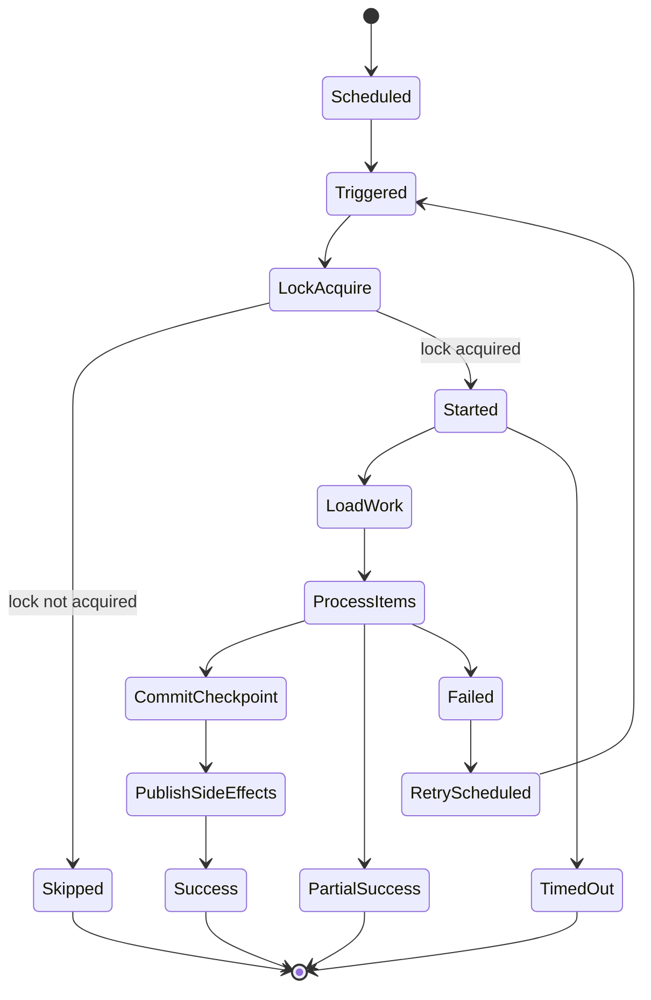

# Cheatsheet Observability Part 036 — Background Job and Scheduler Instrumentation

> Fokus part ini: memahami bagaimana **background job, scheduled task, batch processor, reconciliation job, retry worker, dan Kubernetes CronJob** harus diinstrumentasi agar job lifecycle, duration, status, retry, failure, lock, batch size, processed count, partial failure, scheduler drift, dan business outcome dapat dianalisis saat production incident. Job yang tidak punya observability adalah blind spot karena sering berjalan tanpa request HTTP dan tanpa user langsung yang melaporkan error.

---

## 1. Core Mental Model

Background job berbeda dari HTTP request.

HTTP request biasanya punya:

- user/client;
- request start/end;
- response status;
- latency expectation;
- trace root dari ingress;
- customer-visible result langsung.

Background job sering punya:

- schedule;
- batch window;
- cursor/checkpoint;
- distributed lock;
- retry;
- partial success;
- delayed business impact;
- no immediate caller;
- hidden failure until backlog/SLA breach.

Job instrumentation harus menjawab:

- job apa yang berjalan;
- kapan seharusnya berjalan;
- kapan benar-benar mulai;
- berapa lama berjalan;
- apakah selesai, gagal, timeout, dibatalkan, atau partial success;
- berapa item yang diproses;
- berapa item sukses/gagal/skipped/retried;
- apakah lock diperoleh;
- apakah job overlap dengan run sebelumnya;
- apakah checkpoint maju;
- apakah backlog berkurang;
- apakah hasil bisnis benar;
- apakah job aman untuk retry;
- apakah kegagalan job berdampak pada quote/order/fulfillment/reconciliation.

---

## 2. Background Job Types

Tidak semua job sama. Instrumentation mengikuti tipe job.

| Job type | Example | Key observability focus |
|---|---|---|
| Scheduled maintenance | cleanup expired records | duration, deleted count, failure |
| Reconciliation | compare order state vs downstream | mismatch count, correction result |
| Retry worker | retry failed fulfillment | retry count, success/failure, DLQ |
| Batch import/export | nightly catalog sync | batch size, throughput, partial failure |
| Poller | poll external system | poll latency, cursor, empty poll rate |
| Timeout scanner | find stuck approvals/orders | found count, action count, false positive |
| Cache warmer | preload quote/pricing data | warmed count, failure, cache hit impact |
| Message drain job | process backlog/DLQ | backlog reduction, poison messages |
| SLA monitor | detect aging tasks/orders | breach count, notification result |
| Kubernetes CronJob | platform scheduled container | pod status, start delay, exit code |

A generic metric like `job_failed_total` is not enough. You need job purpose, result, processed count, and business effect.

---

## 3. Job Lifecycle

Minimal lifecycle:

```text
scheduled
  ↓
triggered
  ↓
lock acquire
  ↓
started
  ↓
load work
  ↓
process items
  ↓
commit/checkpoint
  ↓
publish side effects
  ↓
finish success / partial / failed / cancelled / timed out
```

Mermaid view:



Each transition should have evidence in logs/metrics/traces where operationally relevant.

---

## 4. Job Identity and Naming

Every job needs stable identity.

Recommended fields:

| Field | Example | Notes |
|---|---:|---|
| job.name | order-reconciliation | Stable low-cardinality |
| job.type | reconciliation | scheduled/retry/batch/poller/etc. |
| job.run_id | run-20260711-010000-a1b2 | Unique per run; log/trace, not metric label unless controlled |
| job.schedule | cron:0 */5 * * * ? | Log/config, not high-card metric label |
| job.owner | quote-order-team | If allowed/standardized |
| job.version | 2026.07.11.1 | Useful after deployment |
| job.trigger | schedule/manual/retry/backfill | Low cardinality |
| job.window.start | 2026-07-11T01:00:00Z | For reconciliation/batch windows |
| job.window.end | 2026-07-11T01:05:00Z | Same |

Avoid names like:

```text
job.name=OrderReconciliationForTenantAQuote123
```

Use stable job name and separate business identifiers carefully in logs/traces.

---

## 5. Job Start and End Logs

Every meaningful job run should emit start and end logs.

Start log:

```json
{
  "level": "INFO",
  "event.name": "job.started",
  "job.name": "order-reconciliation",
  "job.type": "reconciliation",
  "job.run_id": "run-20260711-010000-a1b2",
  "job.trigger": "schedule",
  "job.window.start": "2026-07-11T01:00:00Z",
  "job.window.end": "2026-07-11T01:05:00Z",
  "service.name": "order-service",
  "deployment.version": "2026.07.11.1",
  "trace_id": "4bf92f3577b34da6a3ce929d0e0e4736"
}
```

End log:

```json
{
  "level": "INFO",
  "event.name": "job.finished",
  "job.name": "order-reconciliation",
  "job.run_id": "run-20260711-010000-a1b2",
  "job.status": "partial_success",
  "duration_ms": 183420,
  "items.scanned": 10000,
  "items.processed": 9980,
  "items.succeeded": 9900,
  "items.failed": 80,
  "items.skipped": 20,
  "mismatches.found": 120,
  "mismatches.corrected": 110,
  "checkpoint.updated": true,
  "next.cursor": "opaque-cursor-redacted",
  "trace_id": "4bf92f3577b34da6a3ce929d0e0e4736"
}
```

End logs are critical for timeline reconstruction.

---

## 6. Job Metrics

Core job metrics:

| Metric | Type | Labels | Purpose |
|---|---|---|---|
| job_runs_total | counter | job_name, status, trigger | Count job outcomes |
| job_duration_seconds | histogram | job_name, status | Runtime distribution |
| job_items_processed_total | counter | job_name, result | Throughput/outcome |
| job_items_failed_total | counter | job_name, error_type | Failure volume |
| job_lag_seconds | gauge/histogram | job_name | Schedule/backlog delay |
| job_lock_acquire_total | counter | job_name, result | Lock behavior |
| job_lock_wait_seconds | histogram | job_name | Contention |
| job_checkpoint_age_seconds | gauge | job_name | Stale checkpoint |
| job_backlog_items | gauge | job_name | Remaining work |
| job_retries_total | counter | job_name, reason | Retry pressure |

Good labels:

- `job_name` stable;
- `status=success|failed|partial_success|skipped|timeout|cancelled`;
- `trigger=schedule|manual|retry|backfill`;
- `result=success|failed|skipped|retry`;
- `error_type=timeout|validation|dependency|conflict|unknown`.

Bad labels:

- `job_run_id` on high-volume metrics;
- `order_id`;
- `quote_id`;
- raw cursor;
- raw exception message;
- tenant/user unless explicitly approved and cardinality-controlled.

---

## 7. Job Span Design

A job run can be represented as a root span if it is not part of an incoming trace.

Span name:

```text
Job order-reconciliation
```

Child spans:

```text
Acquire job lock
Load reconciliation candidates
Process reconciliation batch
Query PostgreSQL
Publish correction event
Update checkpoint
```

Useful span attributes:

```text
job.name=order-reconciliation
job.type=reconciliation
job.run_id=run-20260711-010000-a1b2
job.trigger=schedule
job.status=partial_success
items.processed=9980
items.failed=80
```

Use `job.run_id` in trace/log for debugging. Avoid using it as a metric label if it creates unbounded time series.

For high-volume item processing, do not create one span per item unless sampled or explicitly debugged. Prefer batch-level spans and item-level logs only for failures.

---

## 8. Batch Item Instrumentation

Batch jobs often process thousands or millions of items.

Bad approach:

```text
INFO processed item 1
INFO processed item 2
INFO processed item 3
...
```

This is expensive and noisy.

Better approach:

- log job start;
- log periodic progress at controlled interval;
- log item failures with safe identifiers;
- emit counters/histograms for item results;
- log job end summary;
- provide sample details or failure artifact if needed.

Progress log:

```json
{
  "level": "INFO",
  "event.name": "job.progress",
  "job.name": "order-reconciliation",
  "job.run_id": "run-20260711-010000-a1b2",
  "items.processed": 5000,
  "items.succeeded": 4975,
  "items.failed": 25,
  "elapsed_ms": 93000,
  "throughput_per_second": 53.7,
  "checkpoint.pending": true
}
```

Failure log:

```json
{
  "level": "WARN",
  "event.name": "job.item.failed",
  "job.name": "order-reconciliation",
  "job.run_id": "run-20260711-010000-a1b2",
  "item.type": "order",
  "order_id": "O-12345",
  "error.type": "DownstreamStateMismatch",
  "retryable": false,
  "action": "record_mismatch"
}
```

Only log item identifiers if allowed by policy.

---

## 9. Scheduler Drift and Start Delay

A scheduled job has two important times:

- scheduled time;
- actual start time.

Drift:

```text
scheduler_drift = actual_start_time - scheduled_time
```

Why drift matters:

- scheduler overloaded;
- pod unavailable;
- Kubernetes CronJob delayed;
- previous run still active;
- leader election issue;
- clock/timezone mismatch;
- thread pool saturated;
- application startup delayed.

Metrics:

```text
job_scheduler_drift_seconds_bucket{job_name="order-reconciliation"}
job_start_delay_seconds_bucket{job_name="order-reconciliation"}
job_missed_runs_total{job_name="order-reconciliation",reason="previous_run_active"}
```

Log:

```json
{
  "level": "WARN",
  "event.name": "job.scheduler.drift.detected",
  "job.name": "order-reconciliation",
  "scheduled_at": "2026-07-11T01:00:00Z",
  "started_at": "2026-07-11T01:07:30Z",
  "drift_seconds": 450,
  "reason": "previous_run_still_active"
}
```

---

## 10. Lock and Overlap Instrumentation

Many jobs need distributed lock to prevent overlapping runs.

Questions:

- Was lock acquired?
- Who holds the lock?
- How long did acquisition wait?
- Did job skip because another run is active?
- Did lock expire while job still running?
- Did two instances execute concurrently?

Metrics:

```text
job_lock_acquire_total{job_name="order-reconciliation",result="acquired"}
job_lock_acquire_total{job_name="order-reconciliation",result="skipped_already_running"}
job_lock_wait_seconds_bucket{job_name="order-reconciliation"}
job_overlap_detected_total{job_name="order-reconciliation"}
```

Lock log:

```json
{
  "level": "INFO",
  "event.name": "job.lock.acquire.succeeded",
  "job.name": "order-reconciliation",
  "job.run_id": "run-20260711-010000-a1b2",
  "lock.name": "job:order-reconciliation",
  "lock.ttl_ms": 900000,
  "wait_ms": 42
}
```

Do not log lock token/secret owner value if sensitive.

---

## 11. Retry Instrumentation

Jobs retry in multiple ways:

- retry whole job;
- retry failed item;
- retry failed page/batch;
- retry dependency call;
- retry via queue/DLQ;
- manual rerun/backfill.

Signals:

```text
job_retries_total{job_name="order-reconciliation",scope="item",reason="dependency_timeout"}
job_retry_exhausted_total{job_name="order-reconciliation",scope="item"}
job_manual_reruns_total{job_name="order-reconciliation",reason="incident_mitigation"}
```

Trace attributes:

```text
retry.attempt=3
retry.max=5
retry.reason=dependency_timeout
retry.scope=item
```

Failure mode:

```text
Retry hides persistent correctness failure.
```

A job that eventually succeeds after 5 retries may still indicate dependency degradation or bad data. Track retry pressure, not only final success.

---

## 12. Partial Failure Semantics

Batch jobs often complete partially.

Avoid binary status only:

```text
success / failed
```

Use richer status:

```text
success
partial_success
failed
timeout
cancelled
skipped
no_work
```

Partial success should include:

- processed count;
- success count;
- failure count;
- skipped count;
- retry scheduled count;
- checkpoint behavior;
- whether business SLA is still met;
- whether manual action is needed.

Example:

```json
{
  "event.name": "job.finished",
  "job.status": "partial_success",
  "items.total": 10000,
  "items.succeeded": 9900,
  "items.failed": 80,
  "items.skipped": 20,
  "retry.scheduled": 80,
  "manual_action.required": false,
  "slo.risk": "low"
}
```

Partial success without counters is not actionable.

---

## 13. Checkpoint and Cursor Observability

Pollers, importers, exporters, reconciliation jobs, and stream processors often use checkpoint/cursor.

Questions:

- What was the previous checkpoint?
- Did checkpoint advance?
- Was checkpoint committed before or after side effect?
- Can retry duplicate side effects?
- Is checkpoint stale?
- Was cursor reset manually?
- Is the cursor sensitive?

Metrics:

```text
job_checkpoint_age_seconds{job_name="catalog-sync"}
job_checkpoint_updates_total{job_name="catalog-sync",result="success"}
job_checkpoint_resets_total{job_name="catalog-sync",reason="manual_backfill"}
```

Logs should avoid raw cursor if it contains sensitive token or payload. Use safe summaries:

```json
{
  "event.name": "job.checkpoint.updated",
  "job.name": "catalog-sync",
  "job.run_id": "run-abc",
  "checkpoint.previous.safe": "2026-07-11T01:00:00Z",
  "checkpoint.next.safe": "2026-07-11T01:05:00Z",
  "checkpoint.updated": true
}
```

---

## 14. Reconciliation Job Observability

Reconciliation is common in quote/order/fulfillment systems.

It compares expected state with actual state.

Example:

```text
Internal order state says FULFILLMENT_STARTED.
Downstream system says order not received.
```

Key metrics:

```text
reconciliation_runs_total{job_name="order-reconciliation",status="success"}
reconciliation_items_scanned_total{job_name="order-reconciliation"}
reconciliation_mismatches_total{job_name="order-reconciliation",mismatch_type="missing_downstream"}
reconciliation_corrections_total{job_name="order-reconciliation",result="corrected"}
reconciliation_unresolved_total{job_name="order-reconciliation",reason="manual_review_required"}
```

Important logs:

- reconciliation started;
- mismatch detected;
- correction attempted;
- correction succeeded/failed;
- unresolved item created;
- reconciliation summary.

Reconciliation metrics are business observability, not only technical metrics.

---

## 15. Kubernetes CronJob Observability

If job runs as Kubernetes CronJob, observe Kubernetes layer too.

Signals:

- CronJob schedule;
- Job object created;
- Pod created;
- Pod start time;
- container exit code;
- pod phase;
- restart count;
- missed schedule;
- active deadline exceeded;
- backoff limit exceeded;
- successful/failed job history;
- concurrency policy;
- image version;
- resource usage.

Important Kubernetes fields:

```text
.spec.schedule
.spec.concurrencyPolicy
.spec.startingDeadlineSeconds
.spec.activeDeadlineSeconds
.spec.backoffLimit
.status.lastScheduleTime
.status.lastSuccessfulTime
```

Application telemetry should include the Kubernetes/deployment identity:

```text
k8s.namespace.name
k8s.pod.name
k8s.container.name
k8s.cronjob.name
k8s.job.name
service.version
container.image.digest
```

Internal verification should check whether these resource attributes are populated automatically by OTel/resource detector or platform standard.

---

## 16. Background Job Logging Levels

Suggested levels:

| Event | Level | Notes |
|---|---|---|
| job started | INFO | One per run |
| job finished success | INFO | One per run |
| no work found | INFO/DEBUG | Depends importance/frequency |
| progress summary | INFO | Controlled interval only |
| item validation failed expected | WARN/INFO | Depends business impact |
| retry scheduled | WARN/INFO | Depends volume/impact |
| partial success | WARN | Usually needs attention |
| dependency timeout | WARN/ERROR | Based on retry and impact |
| job failed | ERROR | Include run summary |
| checkpoint failed | ERROR | Correctness risk |
| lock not acquired due existing run | INFO/WARN | Depends expected behavior |
| overlap detected | ERROR | High correctness risk |

Do not emit DEBUG item logs in production unless temporary and controlled.

---

## 17. Job Error Taxonomy

Classify job failures.

| Error type | Example | Debug direction |
|---|---|---|
| dependency_timeout | DB/downstream timeout | Check dependency dashboard |
| dependency_unavailable | Kafka/RabbitMQ/Redis/HTTP down | Check dependency health |
| validation_error | item invalid | Check data quality/source |
| serialization_error | payload/schema issue | Check schema/version rollout |
| lock_failure | cannot acquire/release lock | Check Redis/DB lock mechanism |
| checkpoint_failure | cursor not updated | Check idempotency/retry risk |
| partial_commit_failure | some side effects committed | Check consistency/reconciliation |
| resource_exhaustion | memory/CPU/thread/pool | Check JVM/Kubernetes metrics |
| timeout | job exceeded deadline | Check batch size/dependency latency |
| configuration_error | missing secret/config | Check deployment/config change |
| permission_error | auth/access failure | Check secret/IAM/RBAC rotation |

Use stable `error_type` for metrics and dynamic details in safe logs.

---

## 18. Job Dashboard Design

A job dashboard should answer:

- Is the job running on schedule?
- Did it run recently?
- Did it succeed?
- How long did it take?
- Is duration increasing?
- How much work did it process?
- Is backlog increasing?
- Are failures concentrated by error type?
- Are retries increasing?
- Is checkpoint stale?
- Did recent deployment change behavior?
- Is business SLA at risk?

Recommended panels:

- latest job status by job name;
- job runs by status over time;
- duration p50/p95/p99 by job;
- scheduler drift;
- backlog/items pending;
- items processed/succeeded/failed/skipped;
- retry count;
- checkpoint age;
- lock acquire failure/overlap;
- dependency latency/error during job window;
- Kubernetes CronJob pod status/exit code;
- deployment markers.

---

## 19. Alerting Strategy for Jobs

Good job alerts:

- job did not run within expected window;
- job failed N times consecutively;
- job duration exceeds SLO/window;
- scheduler drift exceeds threshold;
- checkpoint age too old;
- backlog growing for sustained period;
- partial failure rate above threshold;
- reconciliation mismatch spike;
- lock overlap detected;
- idempotency/checkpoint finalization failure;
- Kubernetes CronJob backoff limit exceeded;
- active deadline exceeded;
- business SLA breach risk.

Bad alerts:

- one item failed in a large batch with normal retry;
- no-work job run marked as failure;
- every retry attempt pages engineer;
- CronJob pod completed successfully but alert fires because it terminated;
- alert without job name/runbook/dashboard.

Alert message should include:

- job name;
- last run time;
- status;
- duration;
- processed/failed count;
- backlog or checkpoint age;
- likely impact;
- dashboard link;
- runbook link;
- owner/escalation.

---

## 20. Runbook for Job Failure

A good job failure runbook should include:

1. Confirm job name and last run status.
2. Check whether this is missed run, failed run, partial success, or long-running job.
3. Check deployment/config changes before failure.
4. Check dependency health during job window.
5. Check job logs by `job.run_id`.
6. Check trace for job run if available.
7. Check processed/succeeded/failed/skipped counters.
8. Check checkpoint age and whether checkpoint advanced.
9. Check backlog and business SLA risk.
10. Check retry policy and retry exhaustion.
11. Check whether manual rerun/backfill is safe.
12. Check idempotency/duplicate side effect risk.
13. Apply mitigation: rerun, pause, increase resources, fix data, disable bad input, drain DLQ, rollback deployment.
14. Record incident evidence and missing telemetry.

Never rerun a job blindly unless idempotency and checkpoint semantics are understood.

---

## 21. Idempotency and Side Effect Safety

Background jobs often perform side effects:

- update database state;
- publish Kafka/RabbitMQ event;
- call downstream service;
- create fulfillment task;
- close fallout;
- update reconciliation result;
- send notification.

Instrumentation must show whether side effects are idempotent.

Questions:

- Is item processing idempotent?
- Is event publishing deduplicated?
- Is checkpoint committed before or after side effect?
- What happens after crash between side effect and checkpoint?
- Can rerun create duplicate order/action/event?
- Is there a business key/idempotency key?
- Is duplicate detection measured?

Signals:

```text
job_side_effects_total{job_name="order-reconciliation",side_effect="publish_correction_event",result="success"}
job_duplicate_side_effect_prevented_total{job_name="order-reconciliation"}
job_side_effect_ambiguity_total{job_name="order-reconciliation",reason="checkpoint_failed_after_publish"}
```

Side effect ambiguity should be visible because it creates reconciliation and customer-impact risk.

---

## 22. Timezone and Clock Issues

Scheduled jobs are vulnerable to time bugs.

Risks:

- server local timezone differs from expected timezone;
- daylight saving behavior, if relevant;
- cron expression interpreted differently;
- database timestamp and app timestamp mismatch;
- Kubernetes CronJob timezone behavior differs from app expectation;
- window boundary overlap or gap;
- scheduler drift miscalculated due clock skew;
- logs not in UTC.

Best practice:

- store/log timestamps in UTC;
- include scheduled time and actual start time;
- log window start/end explicitly;
- avoid ambiguous local date for reconciliation windows;
- test boundary conditions;
- verify platform timezone settings.

Job log without schedule/window timestamps is weak evidence.

---

## 23. Security and Privacy Concerns

Jobs often process bulk sensitive data. Avoid dumping data when failures happen.

Sensitive fields:

- customer data;
- user identifiers;
- account numbers;
- quote/order commercial terms;
- pricing details;
- tokens/API keys;
- raw payloads from downstream;
- full CSV/import row;
- cursor containing opaque token;
- error responses with sensitive details.

Rules:

- log counts and safe identifiers, not full payloads;
- mask or redact business identifiers according to policy;
- do not put raw payload into exception message;
- protect failure artifacts;
- apply retention/access controls;
- treat heap/thread dumps from job incident as sensitive.

Audit logging may be required for manual reruns/backfills because they can change business state.

---

## 24. Cost Concerns

Background jobs can produce huge telemetry volume.

Common cost traps:

- INFO log per item;
- span per item for million-item batch;
- raw item ID as metric label;
- error message as label;
- high-frequency progress logs;
- storing full failed payload in logs;
- duplicate logs from retries;
- debug logging enabled during backfill;
- separate time series per run ID.

Cost-aware strategy:

- emit summary logs;
- item logs only on failures or sampled debug;
- aggregate metrics by job name/status/error type;
- use trace sampling for normal runs;
- keep full traces for failed/slow runs if tail sampling supports it;
- store large failure artifacts in controlled storage, not logs;
- use short-term debug mode with expiry.

---

## 25. CPQ/Order Management Examples

| Job | Business risk | Required signal |
|---|---|---|
| quote-expiration-job | quotes remain valid too long or expire too early | expired count, skipped count, window, state transition audit |
| order-reconciliation | internal/downstream mismatch | mismatch count, corrected count, unresolved count |
| fulfillment-retry-worker | stuck fulfillment | retry count, retry exhausted, downstream error |
| approval-aging-scanner | approval SLA breach | aged task count, breach count, notification result |
| catalog-sync | stale product/pricing/config | import version, items updated, validation failure |
| fallout-cleanup | unresolved fallout hidden | closed count, skipped/manual review count |
| cancellation-timeout-job | cancellation stuck | timeout count, state transition result |
| cache-warmer | cold cache latency | warmed count, failure, later hit ratio |
| DLQ drain job | poison message risk | drained count, failed count, replay result |

Business job observability should connect technical status with lifecycle impact.

---

## 26. Common Anti-Patterns

### Anti-pattern: only log job started

If there is no end log, you cannot know if it completed.

### Anti-pattern: binary success/failure

Partial success is common and must be represented.

### Anti-pattern: no run ID

Without `job.run_id`, logs from overlapping/manual/retry runs are hard to separate.

### Anti-pattern: no checkpoint telemetry

A job can “succeed” but fail to advance checkpoint, causing duplicate work or stuck backlog.

### Anti-pattern: per-item INFO logs

This creates cost and noise while hiding summary insight.

### Anti-pattern: manual rerun without audit

Manual rerun/backfill can mutate business state and needs evidence.

### Anti-pattern: CronJob considered healthy because pod completed

The pod may complete with partial business failure unless application-level status is emitted.

### Anti-pattern: no scheduler drift metric

A delayed job can cause SLA breach even if it eventually succeeds.

---

## 27. Internal Verification Checklist

Gunakan checklist ini di codebase/team, bukan asumsi.

### Job inventory

- Job apa saja yang ada di service?
- Apakah job berjalan in-process scheduler, worker, queue consumer, Kubernetes CronJob, external scheduler, atau manual script?
- Apakah ada owner per job?
- Apakah job punya runbook?
- Apakah job mempengaruhi quote/order/fulfillment/approval/reconciliation?
- Apakah job critical untuk SLA/SLO?

### Job lifecycle telemetry

- Apakah setiap job punya `job.name` stabil?
- Apakah setiap run punya `job.run_id`?
- Apakah ada start log dan end log?
- Apakah duration metric tersedia?
- Apakah status memiliki `success`, `failed`, `partial_success`, `skipped`, `timeout`, `no_work`?
- Apakah processed/succeeded/failed/skipped counters tersedia?
- Apakah progress log dikontrol agar tidak spam?

### Scheduler and lock

- Apakah scheduled time dan actual start time dicatat?
- Apakah scheduler drift diukur?
- Apakah missed run terdeteksi?
- Apakah overlap dicegah dan terukur?
- Apakah lock acquire/wait/hold/release terlihat?
- Apakah lock TTL aman?

### Retry and checkpoint

- Apakah retry attempts diukur?
- Apakah retry exhaustion diukur?
- Apakah checkpoint/cursor age terlihat?
- Apakah checkpoint update success/failure dicatat?
- Apakah rerun/backfill aman dan terdokumentasi?
- Apakah side effect idempotency terukur?

### Kubernetes CronJob

- Apakah CronJob labels/annotations lengkap?
- Apakah pod exit code/status terlihat?
- Apakah activeDeadlineSeconds/backoffLimit/concurrencyPolicy dikonfigurasi?
- Apakah missed schedule terlihat?
- Apakah container image version/digest terlihat?
- Apakah resource request/limit cukup dan dimonitor?

### Dashboard/alert/runbook

- Apakah ada dashboard job?
- Apakah alert untuk missed run, repeated failure, duration, backlog, checkpoint age, partial failure, and SLA risk tersedia?
- Apakah alert punya runbook/dashboard/owner?
- Apakah runbook menjelaskan safe rerun/backfill?
- Apakah incident lama menunjukkan missing job telemetry?

### Security/privacy/cost

- Apakah job logs tidak membocorkan payload/PII/pricing/token?
- Apakah failure artifacts terlindungi?
- Apakah per-item logging dibatasi?
- Apakah metric labels low-cardinality?
- Apakah trace sampling menjaga failed/slow runs?
- Apakah manual rerun/backfill diaudit?

---

## 28. PR Review Checklist

Saat mereview PR yang menambah atau mengubah job, tanyakan:

- Apa job name stabilnya?
- Apa trigger-nya: schedule, manual, retry, backfill, queue?
- Apa business purpose dan failure impact?
- Apakah start/end log ada?
- Apakah `job.run_id` ada?
- Apakah duration/status/processed count metric ada?
- Apakah partial success dimodelkan?
- Apakah retry dan retry exhaustion terlihat?
- Apakah checkpoint/cursor semantics jelas?
- Apakah side effect idempotent?
- Apakah manual rerun aman?
- Apakah lock/overlap behavior benar?
- Apakah scheduler drift/missed run terukur?
- Apakah Kubernetes CronJob config benar jika applicable?
- Apakah logs aman dari PII/secrets/payload besar?
- Apakah metric labels tidak high-cardinality?
- Apakah dashboard/alert/runbook perlu diperbarui?
- Apakah audit dibutuhkan untuk manual job/backfill?

---

## 29. Key Takeaways

Background job instrumentation harus memperlakukan job sebagai lifecycle, bukan function call.

Prinsip utama:

- setiap job butuh stable `job.name` dan unique `job.run_id`;
- selalu ada start log, end log, duration, status, dan summary count;
- partial success harus eksplisit;
- scheduler drift, missed run, lock contention, overlap, retry, and checkpoint age harus terlihat;
- per-item logs harus dibatasi;
- batch metrics harus low-cardinality;
- side effect dan idempotency harus dipahami sebelum rerun;
- Kubernetes CronJob status tidak cukup tanpa application-level result;
- dashboard harus menunjukkan freshness, backlog, duration, failure, retry, and business impact;
- runbook harus menjelaskan safe rerun/backfill;
- manual backfill/rerun yang mengubah business state perlu audit evidence.

Job yang gagal diam-diam dapat menyebabkan quote tidak expire, order tidak terkirim, fulfillment stuck, reconciliation mismatch, SLA breach, atau customer impact yang baru terlihat berjam-jam kemudian. Observability job harus membuat kegagalan itu terlihat lebih awal.
