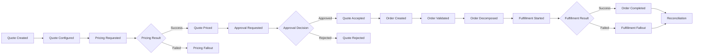

# Cheatsheet Observability Part 037 — Business Observability for CPQ/Order Management

> Fokus part ini: memahami bagaimana observability tidak berhenti pada CPU, memory, request latency, dan error rate. Untuk sistem CPQ/order management, observability harus bisa menjawab pertanyaan bisnis-operasional: quote mana yang stuck, approval mana yang aging, pricing mana yang gagal, order mana yang tidak terkirim ke fulfillment, fallout mana yang meningkat, cancellation/amendment mana yang gagal, dan reconciliation mana yang menemukan mismatch.

---

## 1. Core Mental Model

Technical observability menjawab:

- service sehat atau tidak;
- endpoint lambat atau tidak;
- dependency error atau tidak;
- pod restart atau tidak;
- query lambat atau tidak;
- consumer lag naik atau tidak.

Business observability menjawab:

- quote berhasil dibuat atau tidak;
- pricing berhasil atau tidak;
- approval berjalan atau stuck;
- order berhasil divalidasi atau gagal;
- order berhasil didekomposisi atau tidak;
- fulfillment dimulai atau tertahan;
- fallout dibuat, diproses, dan ditutup atau tidak;
- cancellation/amendment menghasilkan state yang benar atau tidak;
- lifecycle business entity sesuai SLA atau tidak;
- customer impact berasal dari kegagalan teknis apa;
- data antar sistem konsisten atau mulai divergen.

Dalam enterprise CPQ/order management, user sering tidak peduli apakah error-nya berasal dari PostgreSQL lock wait, Kafka consumer lag, RabbitMQ redelivery, Redis cache miss storm, Camunda failed job, atau downstream timeout. Mereka peduli bahwa quote tidak bisa diprice, order tidak submit, approval tidak jalan, atau fulfillment tertahan.

Business observability adalah jembatan antara **technical signal** dan **business consequence**.

---

## 2. Business Observability vs Technical Observability

| Dimension | Technical observability | Business observability |
|---|---|---|
| Unit of analysis | request, span, pod, queue, query | quote, order, approval, product, account, tenant, fallout |
| Primary question | what failed technically? | what business process is impacted? |
| Typical signal | logs, metrics, traces, infra events | business events, lifecycle metrics, audit logs, state aging |
| Dashboard audience | engineer, SRE, platform | engineer, support, operations, product, business owner |
| Alert example | HTTP 5xx > threshold | orders stuck in submitted state > threshold |
| Debugging focus | dependency, latency, resource, error | lifecycle, state transition, SLA, customer impact |

Keduanya tidak boleh dipisahkan total. Business observability tanpa technical drilldown hanya menunjukkan gejala. Technical observability tanpa business context membuat engineer tahu service error, tetapi tidak tahu dampaknya ke quote/order/customer.

---

## 3. CPQ/Order Management Flow as Observability Map

Sederhanakan flow CPQ/order management sebagai lifecycle yang bisa diamati:



Observability harus tersedia di setiap transition penting:

- event saat transition terjadi;
- log saat action diproses;
- metric untuk volume, error, latency, aging;
- trace untuk request/dependency path;
- audit untuk business/security/compliance action;
- dashboard untuk lifecycle funnel dan stuck state;
- alert untuk breach atau abnormal pattern.

---

## 4. The Business Signal Set

Business observability biasanya membutuhkan beberapa signal sekaligus.

| Signal | Fungsi |
|---|---|
| Business event | menyatakan aksi/lifecycle terjadi |
| Audit log | bukti siapa melakukan apa terhadap entity |
| Application log | evidence teknis saat action diproses |
| Metric | trend, rate, latency, error, aging, backlog |
| Trace | path eksekusi request/event/job |
| State snapshot | kondisi terkini entity |
| Reconciliation result | bukti konsistensi antar sistem |
| Dashboard | view operasional dan incident triage |
| Alert | deteksi abnormal condition yang actionable |

Contoh untuk `quote priced`:

- business event: `quote.priced`;
- audit event: actor/system changed pricing status;
- log: pricing request started/finished;
- metric: pricing request count, success, failure, duration;
- trace: JAX-RS endpoint → pricing service → DB/cache/downstream;
- dashboard: pricing success rate, p95 latency, failure reason;
- alert: pricing failures spike or pricing latency SLO burn.

---

## 5. Stable Business Identifiers

Business observability bergantung pada ID yang stabil.

Common IDs:

- `quote.id`;
- `quote.version`;
- `order.id`;
- `order.version`;
- `customer.id` atau account ID jika policy mengizinkan;
- `tenant.id`;
- `product.id` atau product family;
- `approval.id`;
- `fallout.id`;
- `process.instance.id`;
- `workflow.business.key`;
- `correlation.id`;
- `causation.id`;
- `trace.id`;
- `message.id`;
- `idempotency.key`.

Prinsip penting:

- ID bisnis boleh ada di log/audit jika sesuai policy internal;
- jangan jadikan high-cardinality ID sebagai metric label sembarangan;
- untuk metric, gunakan dimensi agregat seperti `lifecycle_stage`, `status`, `failure_category`, `channel`, `product_family`, `tenant_tier` jika diizinkan;
- untuk debugging individual entity, gunakan logs/traces/audit/search, bukan metric label high-cardinality;
- pastikan ID yang dipakai di HTTP, DB, Kafka/RabbitMQ, Camunda, dan audit bisa dihubungkan.

---

## 6. Quote Lifecycle Observability

Quote lifecycle biasanya memiliki beberapa event penting:

- quote created;
- quote configured;
- quote repriced;
- quote price failed;
- quote submitted for approval;
- quote approved;
- quote rejected;
- quote revised;
- quote accepted;
- quote expired;
- quote cancelled;
- quote converted to order.

Minimal observability untuk quote:

| Signal | Example |
|---|---|
| Metric | `quote_created_total`, `quote_pricing_failed_total`, `quote_approval_duration_seconds` |
| Log | quote operation start/end with quote ID, version, actor, result |
| Audit | who changed quote status, price, discount, approval decision |
| Trace | quote API request and dependency calls |
| Dashboard | quote funnel, stuck quote count, approval aging |
| Alert | quote approval aging spike, pricing failure spike |

Quote lifecycle harus diamati sebagai state machine, bukan kumpulan endpoint. Endpoint `POST /quotes/{id}/price` bisa sukses secara HTTP tetapi business result masih pending atau partial. Karena itu business result harus muncul sebagai signal eksplisit.

---

## 7. Pricing Observability

Pricing adalah area yang sering punya kompleksitas tinggi:

- catalog lookup;
- product configuration;
- discount rule;
- contract rule;
- tax/fee calculation;
- external pricing engine;
- cache usage;
- approval threshold;
- currency/region/tenant rule;
- fallback behavior.

Signal yang perlu dipikirkan:

- pricing request count;
- pricing success/failure count;
- pricing duration histogram;
- pricing failure category;
- pricing timeout count;
- pricing dependency latency;
- pricing cache hit/miss;
- quote repricing count;
- pricing rule evaluation error;
- pricing result version;
- pricing stale catalog/cache detection;
- manual override audit.

Failure modes:

| Failure mode | Detection signal |
|---|---|
| Pricing latency spike | pricing duration p95/p99, trace dependency span |
| Pricing rule error | failure category metric, exception log, audit if business override |
| Stale catalog/cache | version mismatch log, cache freshness metric, reconciliation check |
| Downstream pricing timeout | HTTP client metrics, trace span status, timeout logs |
| Incorrect discount | audit trail, business validation event, reconciliation |
| High pricing retry | retry metric, dependency error dashboard |

Pricing observability harus hati-hati dengan privacy/commercial sensitivity. Jangan log price breakdown penuh jika mengandung informasi sensitif, margin, discount, commercial agreement, atau customer-specific terms yang tidak boleh diakses luas.

---

## 8. Approval Observability

Approval flow membutuhkan observability karena failure-nya sering berupa aging/stuck, bukan crash.

Important questions:

- berapa quote menunggu approval;
- siapa/role mana yang harus approve;
- berapa lama aging per approval stage;
- approval mana yang melewati SLA;
- approval notification terkirim atau tidak;
- approval decision berhasil mengubah quote state atau tidak;
- approval loop terjadi atau tidak;
- delegated/impersonated approval diaudit atau tidak.

Metrics:

- `approval_requested_total`;
- `approval_decision_total{decision="approved|rejected|returned"}`;
- `approval_aging_seconds`;
- `approval_sla_breach_total`;
- `approval_notification_failed_total`;
- `approval_stage_active_count`;
- `approval_reassignment_total`.

Audit fields:

- actor;
- actor role;
- delegated actor jika ada;
- target quote;
- previous status;
- new status;
- decision;
- reason/comment metadata sesuai policy;
- timestamp;
- source channel;
- trace/correlation ID.

Approval observability harus bisa membedakan:

- user belum bertindak;
- notification gagal;
- workflow engine stuck;
- state transition gagal;
- authorization check menolak;
- downstream dependency lambat;
- duplicate decision event masuk;
- decision sukses tetapi UI belum refresh.

---

## 9. Order Lifecycle Observability

Order lifecycle biasanya lebih operationally critical karena dampaknya langsung ke fulfillment dan revenue.

Typical lifecycle:

```text
order created
  -> order submitted
  -> order validated
  -> order decomposed
  -> fulfillment requested
  -> fulfillment in progress
  -> fulfillment completed / failed
  -> fallout / manual intervention
  -> reconciliation
  -> closed
```

Observability goals:

- detect order stuck;
- detect validation failure spike;
- detect decomposition failure;
- detect fulfillment delay;
- detect fallout spike;
- detect duplicate order submission;
- detect inconsistent state across systems;
- reconstruct timeline for one order;
- estimate customer/business impact.

Core metrics:

- `order_created_total`;
- `order_submitted_total`;
- `order_validation_failed_total`;
- `order_decomposition_failed_total`;
- `order_fulfillment_requested_total`;
- `order_fulfillment_failed_total`;
- `order_fallout_created_total`;
- `order_state_active_count`;
- `order_state_aging_seconds`;
- `order_completion_duration_seconds`.

Critical logs:

- order submit request accepted;
- validation started/finished;
- decomposition started/finished;
- fulfillment message published;
- fulfillment acknowledgement received;
- downstream error mapped;
- fallout created;
- manual intervention performed;
- reconciliation mismatch detected.

---

## 10. Fulfillment Observability

Fulfillment often crosses system boundaries.

Signals must cover:

- request to fulfillment system;
- async event published;
- downstream acknowledgement;
- order item status;
- retry attempts;
- timeout waiting for response;
- fallout creation;
- manual correction;
- reconciliation result.

Technical dependencies may include:

- HTTP downstream service;
- Kafka topic;
- RabbitMQ queue;
- Camunda process;
- PostgreSQL order state;
- Redis lock/idempotency key;
- cloud managed integration service;
- NGINX/API gateway path.

Debugging one fulfillment issue should answer:

- did the order leave the order service;
- was the message/event published;
- was it consumed;
- did downstream accept it;
- did downstream reject it;
- did retry happen;
- was DLQ/fallout created;
- did state update persist;
- was customer/support notified;
- is reconciliation showing mismatch.

---

## 11. Fallout Observability

Fallout is not just an error. Fallout is a business-operational object.

A fallout record usually indicates:

- automated processing could not complete;
- manual intervention may be required;
- SLA/customer impact may exist;
- business state may be inconsistent;
- downstream dependency or data quality issue may exist.

Useful fallout dimensions:

- fallout type;
- failure category;
- source system;
- lifecycle stage;
- product family;
- customer segment if allowed;
- tenant or market if allowed;
- severity;
- owner queue;
- age bucket;
- retryable vs non-retryable;
- manual vs automatic resolution.

Metrics:

- `fallout_created_total`;
- `fallout_resolved_total`;
- `fallout_active_count`;
- `fallout_aging_seconds`;
- `fallout_auto_recovery_total`;
- `fallout_manual_resolution_total`;
- `fallout_reopened_total`.

Alerts should generally focus on symptoms:

- fallout active count spikes;
- high severity fallout count > threshold;
- fallout aging breach;
- fallout creation rate abnormal after deployment;
- fallout by source system spikes;
- fallout resolution rate drops.

---

## 12. Amendment and Cancellation Observability

Amendment and cancellation are dangerous because they modify existing business commitments.

Instrumentation must capture:

- original quote/order reference;
- amendment/cancellation request ID;
- reason category;
- actor/system initiator;
- current state before action;
- allowed transition check;
- downstream notification;
- compensation or reversal behavior;
- final state;
- audit trail;
- reconciliation result.

Failure modes:

| Failure mode | Observability need |
|---|---|
| Cancellation accepted but not propagated | event publish log, downstream ack metric, reconciliation |
| Amendment creates inconsistent item state | transition audit, state invariant check, DB consistency signal |
| Duplicate cancellation | idempotency key, duplicate event metric, audit trail |
| Cancel after fulfillment started | business rule log, rejection audit, state transition metric |
| Partial amendment failure | item-level summary count, fallout creation, compensation log |

Do not rely only on HTTP 200. For amendment/cancellation, the durable business state and downstream propagation matter more than request response status.

---

## 13. Reconciliation Observability

Reconciliation is a trust mechanism.

It answers:

- does our order state match downstream state;
- does fulfillment state match billing/provisioning state;
- did every published event result in expected downstream state;
- are there missing/duplicate/inconsistent records;
- did repair action succeed.

Core metrics:

- `reconciliation_run_total`;
- `reconciliation_duration_seconds`;
- `reconciliation_checked_total`;
- `reconciliation_matched_total`;
- `reconciliation_mismatch_total`;
- `reconciliation_repaired_total`;
- `reconciliation_repair_failed_total`;
- `reconciliation_checkpoint_age_seconds`.

Reconciliation logs should include:

- job/run ID;
- data source versions;
- window checked;
- record count summary;
- mismatch categories;
- repair result summary;
- checkpoint before/after;
- correlation to batch/job trace.

Avoid logging full sensitive payload for every mismatch. Store secure artifacts only if needed and access-controlled.

---

## 14. JAX-RS Touchpoints for Business Observability

In Java/JAX-RS services, business observability often starts at resource methods.

Common touchpoints:

- `POST /quotes` → quote created;
- `POST /quotes/{id}/price` → pricing requested/result;
- `POST /quotes/{id}/submit` → approval requested or quote submitted;
- `POST /quotes/{id}/accept` → order creation candidate;
- `POST /orders` → order created/submitted;
- `POST /orders/{id}/cancel` → cancellation requested;
- `POST /orders/{id}/amend` → amendment requested;
- `GET /orders/{id}` → read path debugging context;
- internal callback endpoint → downstream status update.

For each mutating endpoint, review:

- request context fields;
- actor/tenant/business key;
- idempotency key;
- validation result;
- state transition result;
- audit event;
- business event publish result;
- response code mapping;
- trace span attributes;
- metrics emitted;
- privacy-safe logging.

Read endpoints usually should not emit business events, but may still need access logs, latency metrics, cache metrics, auth/authz logs, and trace spans.

---

## 15. PostgreSQL and Persistence Visibility

Business observability depends on durable state.

PostgreSQL/MyBatis/JPA/JDBC concerns:

- business state table design;
- audit/history table;
- outbox table if event publishing is transactional;
- idempotency table;
- workflow/process correlation table;
- reconciliation checkpoint table;
- state transition constraints;
- optimistic locking/version column;
- transaction boundary;
- row lock/lock wait;
- slow query on lifecycle dashboards;
- index support for state aging queries.

Signals:

- state transition write latency;
- failed update due to optimistic lock;
- invalid transition reject count;
- outbox publish lag;
- pending outbox count;
- audit insert failure;
- transaction duration;
- lock wait/deadlock;
- reconciliation query latency.

A business dashboard that queries state aging must not create production database pressure. Prefer pre-aggregated metrics or safe read models where appropriate.

---

## 16. Kafka/RabbitMQ Business Event Observability

For CPQ/order management, async messages often represent business progression.

Event examples:

- `quote.created`;
- `quote.priced`;
- `quote.approval.requested`;
- `quote.approved`;
- `order.created`;
- `order.validated`;
- `order.decomposed`;
- `fulfillment.requested`;
- `fulfillment.failed`;
- `fallout.created`;
- `order.cancelled`;
- `reconciliation.mismatch.detected`.

For every event, verify:

- event ID;
- event type;
- schema version;
- aggregate ID;
- aggregate version;
- correlation/causation ID;
- trace context;
- producer service;
- timestamp;
- idempotency semantics;
- privacy classification;
- DLQ/retry behavior.

Business event observability must detect:

- event not published;
- event published but not consumed;
- event consumed but state not updated;
- event duplicated;
- event out of order;
- event schema incompatible;
- event stuck in DLQ;
- consumer lag delaying lifecycle.

---

## 17. Camunda/Workflow Business Observability

If workflow engine is used, business observability must map process state to business state.

Important relationships:

- `process.instance.id` ↔ `quote.id` or `order.id`;
- workflow activity ↔ lifecycle stage;
- failed job ↔ blocked business transition;
- incident ↔ business fallout candidate;
- human task ↔ approval aging;
- timer event ↔ SLA/timeout rule;
- message correlation ↔ external event arrival.

Signals:

- active process count by definition/activity;
- failed job count;
- incident count;
- human task aging;
- timer backlog;
- message correlation failure;
- process completion duration;
- business entity stuck in workflow state.

Workflow dashboard should not only show process engine health. It must show business process health.

---

## 18. Dashboard Design for Business Observability

Useful dashboard layers:

### Executive/business health

- quote volume trend;
- order volume trend;
- conversion rate;
- fulfillment success rate;
- fallout count;
- SLA breach count.

### Operational queue health

- approvals waiting;
- fallout active count;
- manual intervention backlog;
- reconciliation mismatch count;
- aging by stage.

### Engineering drilldown

- error rate by lifecycle stage;
- latency by business operation;
- dependency failure by business operation;
- Kafka/RabbitMQ lag by business event type;
- workflow incidents by activity;
- recent deployment markers.

### Incident view

- current impacted lifecycle stage;
- top failure categories;
- affected tenant/product/channel;
- active stuck entities;
- dependency status;
- traces/logs links.

Dashboard should be designed around questions, not data availability.

---

## 19. Business Alerts

Business alerts should be actionable and tied to ownership.

Examples:

- pricing failure rate above threshold;
- approval aging above SLA;
- order stuck in submitted/validated/decomposed state;
- fulfillment failure spike;
- fallout active count spike;
- reconciliation mismatch spike;
- outbox publish lag high;
- DLQ count for business-critical events high;
- order completion duration SLO burn;
- quote-to-order conversion abnormal drop.

Avoid alerts like:

- every single failed quote;
- every validation error if user-caused and expected;
- every transient downstream timeout if retry succeeds;
- every metric anomaly without runbook;
- business alert with no owner or no support action.

Business alerts should include:

- lifecycle stage;
- severity;
- affected scope;
- customer impact hint;
- dashboard link;
- runbook link;
- service/team owner;
- suggested first triage steps.

---

## 20. Business SLO Candidates

Not every business metric becomes an SLO. But several are useful candidates.

Possible SLOs:

- quote pricing completes within X seconds for Y% of requests;
- quote approval routing completes within X seconds;
- order submission accepted within X seconds;
- order validation completes within X seconds;
- fulfillment request published within X seconds after order submission;
- critical business events published within X seconds;
- reconciliation mismatch detection completes within X hours;
- fallout high-severity item triaged within X minutes/hours;
- order lifecycle completion within business-defined window.

Correctness SLOs may matter more than availability SLOs:

- percentage of orders with valid state transition sequence;
- percentage of events with matching aggregate version;
- percentage of reconciliation checks passing;
- percentage of manual corrections audited.

SLO design must be verified internally. Do not invent contractual SLA or customer-facing promise without product/business/legal context.

---

## 21. Production Debugging: One Order Example

Question: "Order ORD-123 is stuck. What happened?"

Good observability path:

1. Search by `order.id` in logs/audit.
2. Find `correlation.id` and `trace.id` from order creation/submission.
3. Open trace for submit/validate/decompose/fulfillment request.
4. Check order state transition history.
5. Check Kafka/RabbitMQ event publish/consume evidence.
6. Check Camunda process instance if workflow is involved.
7. Check DB update/lock/optimistic version failures.
8. Check downstream fulfillment response or timeout.
9. Check fallout record or DLQ.
10. Check reconciliation result.
11. Check recent deployment/config/catalog changes.
12. Determine customer impact and mitigation.

A system with mature business observability lets you reconstruct this timeline without redeploying code or manually querying random tables under pressure.

---

## 22. Failure Modes and Detection

| Failure mode | Detection |
|---|---|
| Quote pricing failures spike | pricing failure metric, trace dependency errors, pricing dashboard |
| Approval stuck | approval aging metric, workflow task aging, dashboard |
| Order submitted but not fulfilled | state aging, missing event, fulfillment dashboard, reconciliation |
| Event published but not consumed | consumer lag, missing consumed log/span, DLQ count |
| Duplicate order event | idempotency metric, duplicate event log, audit trail |
| Fallout spike after deployment | fallout metric + deployment marker |
| Reconciliation mismatch | mismatch metric, reconciliation logs, runbook |
| Cancellation not propagated | event publish/consume trace, downstream ack metric |
| Manual override not auditable | audit gap, policy violation finding |
| Business dashboard slow | DB query latency, dashboard query cost, read model issue |

---

## 23. Security and Privacy Concerns

Business observability often touches sensitive data.

Risks:

- PII in logs;
- commercial pricing details leaked;
- discount/margin exposed;
- account/customer data over-shared;
- approval comment logged raw;
- order payload logged fully;
- token/session/header leakage;
- audit logs accessible to too many users;
- trace attributes contain sensitive payload;
- metric labels include customer/order/user IDs.

Rules of thumb:

- log identifiers, not full payloads;
- mask or hash sensitive values where permitted;
- avoid raw body logging;
- classify business fields before telemetry;
- keep audit logs access-controlled;
- avoid high-cardinality sensitive labels;
- document exceptions;
- verify with security/privacy team.

---

## 24. Cost and Cardinality Concerns

Business observability can become expensive if every business ID becomes a metric dimension.

Bad metric labels:

```text
order.id
quote.id
user.id
request.id
correlation.id
raw_customer_name
raw_error_message
full_product_sku_when_high_cardinality
```

Safer labels:

```text
operation
lifecycle_stage
status
failure_category
channel
product_family
tenant_tier
region
workflow_activity
```

Use logs/traces/audit for entity-level drilldown. Use metrics for aggregate behavior.

---

## 25. Internal Verification Checklist

### Business lifecycle

- Apa lifecycle quote resmi?
- Apa lifecycle order resmi?
- Apa state terminal, retryable, manual intervention, dan stuck?
- Apa transition yang paling critical?
- Apa business SLA/SLO yang sudah disepakati?
- Apa entity key yang boleh muncul di telemetry?

### Logs/traces/correlation

- Apakah `quote.id` dan `order.id` muncul sebagai log field sesuai policy?
- Apakah `correlation.id`, `causation.id`, `trace.id`, dan `business.key` konsisten?
- Apakah transition penting punya start/end log?
- Apakah trace menghubungkan HTTP → DB → Redis → Kafka/RabbitMQ → workflow/downstream?
- Apakah failed business operation bisa dicari tanpa manual table spelunking?

### Metrics/dashboard

- Apakah ada lifecycle funnel dashboard?
- Apakah ada state aging dashboard?
- Apakah ada approval/fallout/reconciliation dashboard?
- Apakah metric labels aman dari cardinality explosion?
- Apakah dashboard punya deployment marker?
- Apakah dashboard punya drilldown ke logs/traces?

### Audit/compliance

- Apakah quote/order status transition diaudit?
- Apakah approval decision diaudit?
- Apakah amendment/cancellation/manual override diaudit?
- Apakah before/after value dicatat sesuai policy?
- Apakah audit access control benar?
- Apakah retention audit sesuai requirement?

### Messaging/workflow

- Apakah business events punya event ID, aggregate ID, schema version, correlation/causation ID?
- Apakah Kafka/RabbitMQ retry/DLQ terlihat?
- Apakah event publish memakai outbox atau mekanisme transactional yang jelas?
- Apakah workflow process instance terhubung ke quote/order ID?
- Apakah message correlation failure terlihat?

### Operations

- Apakah alert business-impact punya owner/runbook?
- Apakah support/operations tahu dashboard mana yang dipakai?
- Apakah incident notes lama menunjukkan missing business telemetry?
- Apakah reconciliation mismatch punya playbook?
- Apakah manual repair/rerun/backfill diaudit?

---

## 26. PR Review Checklist

Saat mereview PR yang mengubah CPQ/order flow, tanyakan:

- Entity business apa yang berubah?
- Lifecycle stage apa yang terdampak?
- Apakah ada state transition baru?
- Apakah transition tersebut perlu audit?
- Apakah operation punya metric success/failure/duration?
- Apakah failure category low-cardinality?
- Apakah log punya business key yang aman?
- Apakah trace span mencakup dependency penting?
- Apakah Kafka/RabbitMQ event membawa correlation/causation ID?
- Apakah idempotency behavior terlihat?
- Apakah duplicate/retry/fallout path terukur?
- Apakah dashboard perlu update?
- Apakah alert/SLO perlu update?
- Apakah PII/commercial sensitive data tidak masuk telemetry?
- Apakah cost/cardinality aman?
- Apakah runbook/debugging path jelas?

---

## 27. Key Takeaways

Business observability membuat engineer bisa menjawab **apa dampak teknis terhadap proses bisnis**.

Prinsip utama:

- treat quote/order/fallout/approval as observable lifecycle objects;
- jangan hanya mengandalkan HTTP status;
- state transition, event publish, workflow progress, and reconciliation harus terlihat;
- gunakan logs/traces/audit untuk entity-level debugging;
- gunakan metrics untuk aggregate rate, latency, error, aging, backlog, and breach;
- jangan jadikan quote/order/user/request ID sebagai metric label high-cardinality;
- audit log berbeda dari application log;
- business alert harus actionable dan punya owner/runbook;
- dashboard harus menunjukkan lifecycle health dan technical drilldown;
- privacy/commercial sensitivity harus dijaga sejak desain telemetry.

Senior backend engineer yang kuat di observability tidak hanya bertanya "service error apa?" tetapi juga "business lifecycle mana yang berhenti, entity mana yang terdampak, dan evidence apa yang membuktikannya?"
