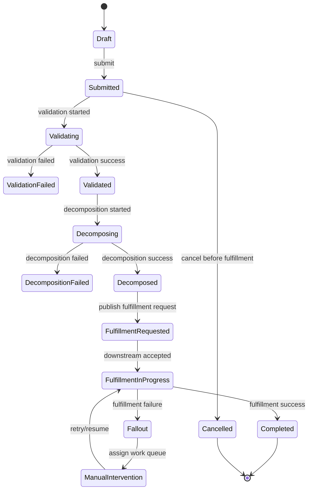

# Cheatsheet Observability Part 038 — Domain State and Lifecycle Observability

> Fokus part ini: memahami observability untuk domain state dan lifecycle. Dalam enterprise CPQ/order management, banyak incident bukan sekadar exception, melainkan entity yang masuk state salah, stuck terlalu lama, transition tidak terjadi, duplicate transition terjadi, event terlambat, workflow tidak bergerak, atau reconciliation menemukan state antar sistem tidak konsisten.

---

## 1. Core Mental Model

Domain lifecycle adalah sumber kebenaran operasional.

Untuk sistem seperti quote/order management, state entity bukan detail internal kecil. State adalah bukti:

- apakah proses bisnis berjalan;
- apakah user action berhasil;
- apakah downstream system menerima request;
- apakah workflow masih aktif;
- apakah manual intervention diperlukan;
- apakah SLA akan breach;
- apakah data konsisten antar sistem;
- apakah incident berdampak pada customer.

Observability lifecycle harus menjawab:

- entity ada di state apa;
- kapan masuk state tersebut;
- dari state mana transition terjadi;
- siapa/apa yang memicu transition;
- apakah transition valid;
- berapa lama entity berada di state itu;
- apakah state tersebut terminal, retryable, manual, atau stuck;
- apa event/trace/log/audit yang membuktikan transition;
- apakah downstream state sama;
- apakah transition gagal dan kenapa;
- apakah retry/compensation/reconciliation berjalan.

---

## 2. Why State Observability Matters

Banyak production issue terlihat seperti ini:

- "order submitted tapi tidak fulfilled";
- "quote sudah approved tapi UI masih pending";
- "approval task hilang";
- "cancellation berhasil di UI tapi downstream masih aktif";
- "Kafka consumer tidak error, tapi order stuck";
- "workflow process active, tapi tidak ada progress";
- "reconciliation menemukan mismatch";
- "support tidak tahu apakah aman melakukan manual retry".

Masalah seperti ini tidak selalu muncul sebagai HTTP 500 atau pod crash. Mereka muncul sebagai **lifecycle abnormality**.

Karena itu lifecycle observability harus menjadi first-class design concern.

---

## 3. State, Status, Stage, and Lifecycle

Istilah sering tercampur.

| Term | Meaning | Observability implication |
|---|---|---|
| State | kondisi durable entity | harus auditable dan queryable |
| Status | representasi ringkas state untuk UI/API | jangan selalu dianggap lengkap |
| Stage | fase proses bisnis | cocok untuk dashboard/funnel |
| Transition | perubahan dari state A ke B | harus punya evidence |
| Lifecycle | keseluruhan perjalanan entity | harus punya funnel, aging, and terminal state |
| Terminal state | state akhir | completion/failure/cancelled/expired |
| Retryable state | state yang bisa dicoba ulang | butuh retry count/age/limit |
| Manual intervention state | perlu manusia | butuh queue owner dan aging |
| Stuck state | state yang terlalu lama atau tidak valid | butuh detection/alert/runbook |

State observability bukan hanya menyimpan kolom `status`. Yang penting adalah memahami transition, timing, cause, and evidence.

---

## 4. Lifecycle Example

Contoh simplified order lifecycle:



Observability question for every arrow:

- what triggered it;
- who/what actor initiated it;
- what validation allowed it;
- what side effect happened;
- what event was published;
- what audit record exists;
- how long it took;
- what failure mode exists;
- what retry/compensation exists.

---

## 5. State Transition as Observable Event

Every important transition should emit or persist evidence.

Recommended transition evidence:

| Evidence | Purpose |
|---|---|
| Transition audit | durable proof of previous/new state and actor |
| Structured log | operational evidence for debugging |
| Metric counter | aggregate transition volume and failures |
| Duration metric | transition latency and SLA tracking |
| Trace span/event | causal path through dependencies |
| Business event | notify other systems/processes |
| DB history row | reconstruction and reconciliation |

Example fields for transition log/audit:

```json
{
  "event.name": "order.state_transition",
  "order.id": "ORD-123",
  "previous.state": "VALIDATED",
  "new.state": "DECOMPOSED",
  "transition.name": "decompose_order_success",
  "actor.type": "system",
  "actor.id": "order-service",
  "correlation.id": "...",
  "causation.id": "...",
  "trace.id": "...",
  "result": "success",
  "duration.ms": 183
}
```

For sensitive fields, use policy-approved identifiers and avoid payload dumps.

---

## 6. State Transition Metrics

Useful metrics:

```text
business_state_transition_total{entity="order", transition="validated_to_decomposed", result="success"}
business_state_transition_failed_total{entity="order", transition="validated_to_decomposed", failure_category="dependency_timeout"}
business_state_transition_duration_seconds{entity="order", transition="validated_to_decomposed"}
business_entity_active_count{entity="order", state="fulfillment_in_progress"}
business_entity_state_aging_seconds{entity="order", state="manual_intervention"}
business_invalid_transition_total{entity="order", from="completed", to="submitted", reason="terminal_state"}
```

Label discipline:

- OK: `entity`, `state`, `transition`, `result`, `failure_category`, `channel`, `product_family`, `tenant_tier` jika approved;
- risky: `order.id`, `quote.id`, `user.id`, `request.id`, `correlation.id`, raw error message;
- avoid labels that produce unbounded cardinality.

Entity-level debugging belongs to logs, traces, audit, and DB history, not metric labels.

---

## 7. Invalid Transition Observability

Invalid transition is often a strong correctness signal.

Examples:

- completed order moved back to submitted;
- cancelled order receives fulfillment success;
- quote approved after expiration;
- duplicate approval decision;
- fulfillment event arrives before order decomposition;
- cancellation requested after terminal fulfillment;
- retry applied to non-retryable state.

Observability for invalid transition:

- metric counter by entity, attempted transition, reason;
- WARN log for expected invalid business request;
- ERROR log if invalid transition indicates system/data corruption;
- audit if human/system attempted a meaningful business action;
- trace span status if triggered by request/event;
- reconciliation marker if state mismatch detected.

Avoid turning every user-caused invalid action into ERROR. The severity depends on whether it is expected validation behavior or production correctness risk.

---

## 8. Transition Latency

Transition latency measures how long a lifecycle step takes.

Examples:

- quote created → quote priced;
- pricing requested → pricing completed;
- approval requested → approval decision;
- order submitted → order validated;
- order validated → order decomposed;
- fulfillment requested → downstream accepted;
- fallout created → fallout resolved;
- reconciliation mismatch detected → repaired.

Latency can be measured in different scopes:

| Scope | Meaning |
|---|---|
| synchronous latency | one API/action duration |
| async processing latency | event produced to event consumed |
| lifecycle latency | state A entered to state B entered |
| queue latency | waiting before processing |
| human latency | waiting for approval/manual intervention |
| end-to-end latency | first business action to terminal state |

For business lifecycle, human and async latency are often more important than single request latency.

---

## 9. State Aging

State aging is one of the most important business observability signals.

State aging answers:

- how long has entity been in current state;
- which states accumulate backlog;
- which lifecycle stages are stuck;
- which owner queue is aging;
- whether SLA breach is near;
- whether recent deployment increased stuck entities.

Useful views:

- active count by state;
- p50/p95/max age by state;
- age buckets: `<15m`, `15m-1h`, `1h-4h`, `4h-24h`, `>24h`;
- state aging by owner queue;
- state aging by product/channel/tenant tier if approved;
- trend before/after deployment.

Alert examples:

- `order_state_aging_seconds{state="submitted"}` p95 above threshold;
- active `manual_intervention` count above threshold;
- no transition out of `fulfillment_requested` for N minutes;
- approval task age breaches business threshold.

---

## 10. Terminal, Retryable, Manual, and Stuck States

Not all states have the same operational meaning.

### Terminal states

Examples:

- completed;
- cancelled;
- rejected;
- expired;
- failed terminal.

Observability concern:

- ensure terminal states do not receive invalid transitions;
- verify terminalization is audited;
- ensure downstream state is consistent;
- exclude terminal states from active backlog unless needed.

### Retryable states

Examples:

- fulfillment_failed_retryable;
- pricing_timeout;
- publish_pending;
- downstream_unavailable.

Observability concern:

- retry count;
- retry age;
- next retry time;
- retry exhaustion;
- idempotency;
- duplicate side effects.

### Manual intervention states

Examples:

- fallout_open;
- awaiting_manual_review;
- approval_pending;
- data_correction_required.

Observability concern:

- queue owner;
- age;
- severity;
- assignment;
- resolution rate;
- audit trail.

### Stuck states

Stuck is often derived, not stored.

An entity is stuck when:

- it remains in state longer than expected;
- required event did not arrive;
- workflow activity did not progress;
- retry loop exhausted;
- dependency acknowledgement missing;
- no owner is assigned;
- state violates invariant.

---

## 11. Lifecycle Funnel

A lifecycle funnel shows entity progression across stages.

Example quote funnel:

```text
created -> configured -> priced -> approval_requested -> approved -> accepted -> order_created
```

Example order funnel:

```text
created -> validated -> decomposed -> fulfillment_requested -> completed
```

Dashboard questions:

- where do entities drop off;
- where do they wait longest;
- where do failures cluster;
- did a release change funnel conversion;
- is one product/channel/tenant tier affected;
- is fallout absorbing failures or hiding systemic issue.

Funnel metrics should be aggregated carefully. They should not require per-entity high-cardinality labels.

---

## 12. Business SLA and State Aging

Business SLA often maps naturally to lifecycle stages.

Examples:

- quote pricing should complete within X seconds/minutes;
- approval should be routed within X seconds;
- approval decision should occur within business-defined window;
- order validation should complete within X seconds;
- fulfillment request should be published within X seconds;
- fallout should be triaged within X hours;
- reconciliation mismatch should be detected within X hours.

Implementation pattern:

- define start state/time;
- define target state/time;
- record transition timestamps;
- compute duration;
- classify breach;
- emit metric;
- show dashboard;
- alert only when actionable;
- create audit/incident evidence if needed.

Do not invent SLA values in code without internal product/business/legal alignment.

---

## 13. Java/JAX-RS Lifecycle Touchpoints

JAX-RS endpoints usually trigger lifecycle transitions.

Examples:

| Endpoint action | Possible transition |
|---|---|
| `POST /quotes` | none → quote_created |
| `POST /quotes/{id}/price` | configured → pricing_requested/priced |
| `POST /quotes/{id}/submit` | priced → approval_requested |
| `POST /quotes/{id}/approve` | approval_pending → approved |
| `POST /orders` | none → order_created/submitted |
| `POST /orders/{id}/cancel` | active → cancellation_requested/cancelled |
| callback endpoint | fulfillment_requested → in_progress/completed/failed |

Instrumentation should capture:

- resource method name or route template;
- actor/tenant/business key;
- current state loaded;
- requested transition;
- validation result;
- state update result;
- audit write result;
- event publish result;
- response status;
- exception mapping;
- trace context.

Important nuance: A JAX-RS endpoint can return success before an async lifecycle completes. Make that explicit in telemetry: accepted vs completed are different business states.

---

## 14. PostgreSQL Persistence Pattern

A lifecycle-aware persistence model often needs more than one `status` column.

Useful structures:

- main entity table with current state;
- state transition history table;
- audit log table;
- outbox table;
- idempotency table;
- process correlation table;
- manual intervention/fallout table;
- reconciliation checkpoint/result table.

Observability fields:

- `created_at`;
- `updated_at`;
- `state_entered_at`;
- `previous_state`;
- `current_state`;
- `version`;
- `last_transition_reason`;
- `correlation_id`;
- `process_instance_id`;
- `last_event_id`;
- `retry_count`;
- `next_retry_at`;
- `owner_queue`.

Database failure modes:

- optimistic lock conflict;
- stale read;
- transaction rollback after event publish attempt;
- audit insert failure;
- outbox lag;
- deadlock during transition;
- missing index for state aging query;
- inconsistent current state and history.

---

## 15. Event-Driven State Transitions

In async systems, state transitions often occur from consumed events.

Event-driven transition must be observable across:

```text
producer state change
  -> event persisted/outboxed
  -> event published
  -> broker accepted
  -> consumer received
  -> consumer validated idempotency
  -> consumer applied state transition
  -> consumer emitted next event/audit/metric
```

Signals to verify:

- event ID;
- aggregate ID/version;
- correlation/causation ID;
- trace context;
- outbox status;
- publish latency;
- consumer lag;
- processing latency;
- duplicate event count;
- stale event rejection;
- invalid transition count;
- DLQ/retry metrics.

Out-of-order events should be treated as lifecycle correctness concern, not only messaging concern.

---

## 16. Camunda/Workflow State Mapping

Workflow state and domain state are related but not identical.

Example mapping:

| Workflow activity | Domain state |
|---|---|
| price quote task | pricing_requested |
| approval user task | approval_pending |
| order decomposition service task | decomposing |
| fulfillment wait state | fulfillment_requested |
| fallout handling task | manual_intervention |
| completion event | completed |

Observability risks:

- workflow activity progresses but domain state not updated;
- domain state updated but workflow stuck;
- message correlation fails;
- failed job not reflected as fallout;
- timer event fires but SLA metric missing;
- human task aging not visible in business dashboard.

Internal teams must verify which system is source of truth for each state.

---

## 17. Lifecycle Dashboard Design

A good lifecycle dashboard should include:

- active entity count by state;
- state aging distribution;
- transition rate;
- transition failure rate;
- invalid transition count;
- retryable state count;
- manual intervention count;
- terminal completion count;
- end-to-end lifecycle duration;
- fallout count;
- SLA breach count;
- recent deployment markers;
- drilldown to logs/traces/audit.

Dashboard anti-patterns:

- only showing total orders without state breakdown;
- showing average age but hiding p95/max;
- mixing terminal and active entities in backlog;
- no filter by lifecycle stage;
- no deployment/config marker;
- no link to runbook;
- direct expensive DB queries for every refresh;
- high-cardinality per-order dashboard panels.

---

## 18. Alerts for Lifecycle Problems

Good lifecycle alerts:

- active count in risky state above threshold;
- p95/max state age breaches threshold;
- transition failure rate high;
- invalid transition count abnormal;
- retry exhaustion count high;
- manual intervention backlog aging;
- no successful transition for business-critical flow;
- reconciliation mismatch count high;
- outbox publish lag high;
- workflow incident count by critical activity high.

Bad alerts:

- every normal validation reject;
- every user cancellation;
- every single manual intervention item;
- alert without owner;
- alert without runbook;
- alert on raw count without traffic context;
- alert on cause while symptom is already covered.

Lifecycle alerts should include:

- entity type;
- state/stage;
- threshold/window;
- customer/business impact hint;
- dashboard link;
- runbook link;
- owner/escalation;
- first queries to run.

---

## 19. Debugging Playbook: Stuck Order

When an order is stuck:

1. Identify current state and `state_entered_at`.
2. Check transition history.
3. Find correlation ID and trace ID for the transition that entered the state.
4. Check whether required event was published.
5. Check broker lag, retry, DLQ, and consumer logs.
6. Check workflow process instance/activity if applicable.
7. Check DB optimistic lock, transaction rollback, or lock wait.
8. Check downstream call status, timeout, and retry.
9. Check fallout/manual intervention record.
10. Check reconciliation result.
11. Compare with recent deployment/config/catalog changes.
12. Determine safe mitigation: retry, replay, repair, manual intervention, rollback, or escalation.

The core question is not only "where is the error?" but "which expected transition did not happen, and what evidence explains why?"

---

## 20. Correctness Concerns

Lifecycle observability must protect correctness.

Concerns:

- invalid transition accepted;
- duplicate transition applied;
- stale event overwrites newer state;
- terminal state modified;
- retry produces duplicate side effect;
- compensation changes wrong entity;
- audit missing for business-critical action;
- UI status diverges from backend state;
- workflow state diverges from domain state;
- reconciliation repair hides root cause;
- manual intervention not attributable.

Observability should detect correctness failures as first-class incidents, even when service availability is normal.

---

## 21. Performance Concerns

Lifecycle observability can harm performance if done carelessly.

Risks:

- synchronous audit write blocks critical path;
- transition history insert causes lock contention;
- state aging dashboard runs expensive table scan;
- per-transition logs too verbose;
- per-entity metric labels explode;
- trace spans too detailed for hot paths;
- workflow queries overload engine database;
- reconciliation scans too wide;
- report/dashboard competes with OLTP workload.

Mitigation:

- proper indexes for state/time queries;
- aggregate metrics instead of per-entity dashboard queries;
- async/outbox pattern where appropriate;
- safe retention and partitioning;
- low-cardinality labels;
- sampled traces with error/slow preservation;
- read model for operational dashboard;
- clear query ownership.

---

## 22. Security and Privacy Concerns

Lifecycle telemetry often includes business-sensitive information.

Be careful with:

- customer identifiers;
- account information;
- pricing/discount/margin;
- approval comments;
- contract terms;
- order payload;
- product configuration;
- user/actor identity;
- delegated/impersonated access;
- manual repair notes.

Recommended approach:

- store business-sensitive detail in access-controlled audit/domain tables;
- expose minimal safe identifiers in logs;
- avoid raw payload in traces/logs;
- classify telemetry fields;
- mask/redact sensitive fields;
- review access control for dashboards;
- verify retention policy;
- involve security/privacy team for audit design.

---

## 23. Cost and Cardinality Concerns

Lifecycle telemetry creates many tempting dimensions.

Avoid metric labels like:

- `order_id`;
- `quote_id`;
- `approval_id`;
- `fallout_id`;
- `process_instance_id`;
- `correlation_id`;
- `trace_id`;
- raw error message;
- raw path;
- raw customer/account name.

Prefer:

- `entity_type`;
- `state`;
- `transition`;
- `result`;
- `failure_category`;
- `stage`;
- `operation`;
- `channel`;
- `product_family`;
- `region`;
- `tenant_tier` if approved.

Logs, traces, audit, and domain history are better for per-entity investigation.

---

## 24. Internal Verification Checklist

### Domain model

- Apa daftar state resmi untuk quote/order/fallout/approval?
- Apa state terminal?
- Apa state retryable?
- Apa state manual intervention?
- Apa state yang dianggap stuck?
- Apa transition yang valid dan invalid?
- Apakah ada state machine diagram atau ADR?

### Persistence

- Di mana current state disimpan?
- Apakah ada transition history table?
- Apakah ada audit table?
- Apakah ada outbox/idempotency table?
- Apakah `state_entered_at` tersedia?
- Apakah optimistic locking/versioning digunakan?
- Apakah state aging query punya index aman?

### Telemetry

- Apakah setiap critical transition punya log?
- Apakah setiap critical transition punya metric?
- Apakah invalid transition diukur?
- Apakah state aging tersedia?
- Apakah trace dapat mengikuti transition dari HTTP/event/job?
- Apakah audit mencatat actor, action, previous/new state?
- Apakah correlation/causation ID konsisten?

### Messaging/workflow

- Apakah event carries aggregate ID/version?
- Apakah out-of-order event ditangani dan terlihat?
- Apakah duplicate event terlihat?
- Apakah Kafka/RabbitMQ DLQ/retry terhubung ke lifecycle state?
- Apakah Camunda process instance terhubung ke business key?
- Apakah workflow incident tercermin ke business observability?

### Dashboard/alert/SLO

- Apakah ada lifecycle funnel dashboard?
- Apakah ada state aging dashboard?
- Apakah active state count terlihat?
- Apakah manual intervention backlog terlihat?
- Apakah lifecycle alerts punya owner/runbook?
- Apakah business SLA/SLO dikaitkan dengan state timestamps?
- Apakah incident lama menunjukkan missing state telemetry?

### Security/cost

- Apakah state telemetry mengandung PII/commercial data?
- Apakah dashboard access control sesuai?
- Apakah audit retention sesuai?
- Apakah metric labels low-cardinality?
- Apakah dashboard query aman untuk production DB?

---

## 25. PR Review Checklist

Saat mereview perubahan lifecycle/state:

- Apakah state baru diperlukan atau bisa memakai state existing?
- Apakah transition valid dijelaskan?
- Apakah invalid transition ditolak dan terlihat?
- Apakah transition history/audit diperbarui?
- Apakah event yang dipublish membawa aggregate version?
- Apakah duplicate/stale event handling jelas?
- Apakah retry/compensation behavior aman?
- Apakah state aging/SLA terdampak?
- Apakah metric transition success/failure/duration ditambahkan?
- Apakah log memiliki business key aman?
- Apakah trace span menunjukkan transition dan dependency?
- Apakah dashboard/alert/runbook perlu update?
- Apakah migration/backfill state butuh observability khusus?
- Apakah cardinality/privacy aman?
- Apakah manual intervention path auditable?

---

## 26. Key Takeaways

Domain state dan lifecycle adalah salah satu signal observability paling penting untuk enterprise business systems.

Prinsip utama:

- modelkan lifecycle sebagai observable state machine;
- every critical transition needs evidence;
- state aging adalah signal kuat untuk stuck process;
- invalid transition adalah correctness signal;
- terminal/retryable/manual/stuck states punya observability need berbeda;
- business SLA sering dihitung dari transition timestamps;
- JAX-RS success tidak selalu berarti lifecycle completion;
- event-driven transition harus punya correlation, causation, aggregate version, and idempotency evidence;
- workflow state dan domain state harus bisa direkonsiliasi;
- metrics untuk aggregate, logs/traces/audit/history untuk entity-level investigation;
- privacy, cost, and cardinality harus dipikirkan sejak desain.

Senior engineer yang kuat dalam lifecycle observability mampu menjawab: "state apa yang seharusnya berubah, kapan, oleh siapa/apa, apakah valid, apakah persisted, apakah event keluar, apakah downstream bergerak, dan apa bukti production-nya?"
