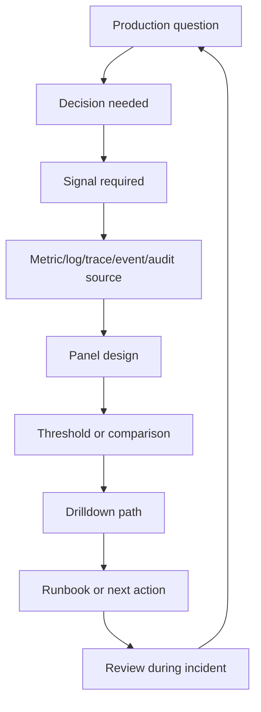
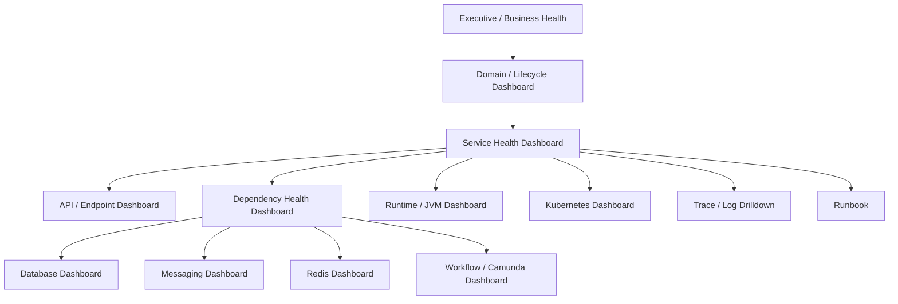
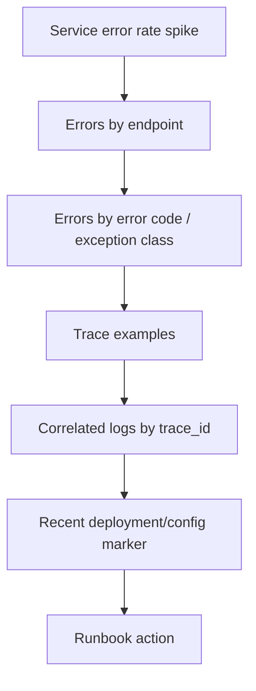
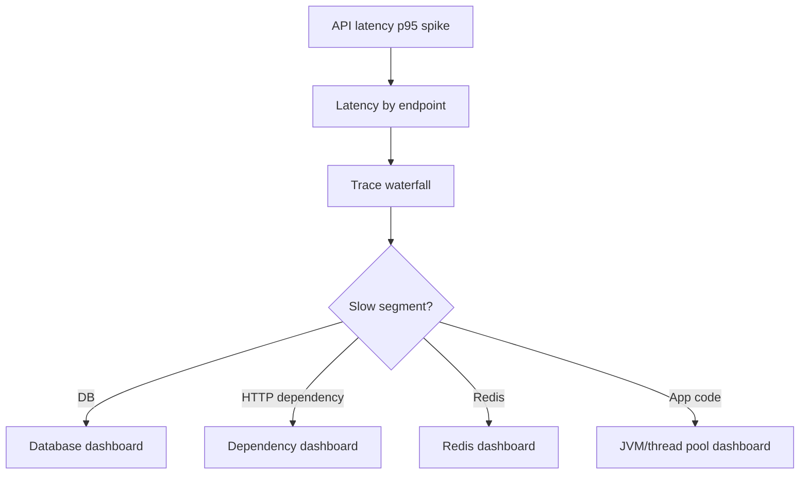
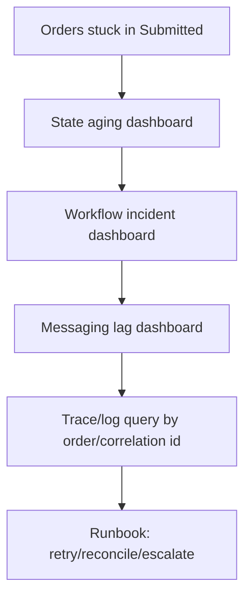

# Cheatsheet Observability Part 039 — Dashboard Design

> Fokus part ini: memahami dashboard sebagai alat menjawab pertanyaan production, bukan galeri chart. Dashboard yang baik mempercepat triage, memperjelas impact, mengurangi debat subjektif saat incident, dan membantu engineer berpindah dari gejala ke evidence.

---

## 1. Core Mental Model

Dashboard bukan tujuan akhir observability.

Dashboard adalah **interface untuk bertanya ke sistem produksi**.

Dashboard yang baik membantu menjawab:

- apakah service sehat;
- apakah customer impact sedang terjadi;
- apakah error/latency berasal dari service sendiri atau dependency;
- apakah masalah dimulai setelah deployment/config change;
- apakah queue/backlog sedang naik;
- apakah database/pool/thread/JVM mulai saturate;
- apakah business lifecycle stuck;
- apakah SLO sedang burn;
- apa langkah investigasi berikutnya.

Dashboard yang buruk hanya menampilkan banyak graph tanpa keputusan.

Rule praktis:

> Setiap panel harus punya pertanyaan, owner, tindakan, dan interpretasi.

Jika panel tidak membantu mengambil keputusan, panel itu kemungkinan noise.

---

## 2. Dashboard vs Query vs Alert vs Report

Jangan campur semua kebutuhan ke satu dashboard.

| Artifact | Purpose | Time horizon | Audience | Failure if misused |
|---|---|---:|---|---|
| Dashboard | interactive diagnosis and health view | now to recent history | engineer, SRE, ops | terlalu ramai, tidak actionable |
| Query | ad hoc investigation | variable | engineer | tidak reusable |
| Alert | interrupt engineer when action needed | near real-time | on-call | alert fatigue |
| Report | periodic explanation/status | weekly/monthly/quarterly | leadership/product | terlalu lambat untuk incident |
| Runbook | operational action guide | during incident | on-call | tidak terhubung ke evidence |

Dashboard bukan pengganti alert. Alert memberi tahu bahwa perlu aksi. Dashboard membantu memahami apa yang terjadi.

Dashboard bukan pengganti runbook. Dashboard memberi evidence. Runbook memberi langkah aksi.

---

## 3. The Dashboard Design Loop

Desain dashboard harus dimulai dari pertanyaan, bukan dari metric.



Contoh:

| Question | Decision | Signal | Panel |
|---|---|---|---|
| Are users impacted? | page/mitigate/escalate | error rate, latency, business failure count | service overview |
| Is this dependency-related? | route to dependency owner | downstream latency/error/timeout | dependency health |
| Did it start after release? | rollback/canary pause | deployment marker, version, error diff | release health |
| Are orders stuck? | operational intervention | state aging, stuck count, workflow incident | business lifecycle |
| Is the service overloaded? | scale/throttle/tune | CPU, memory, thread pool, queue, pool saturation | saturation view |

---

## 4. Dashboard Audience

Dashboard harus jelas untuk siapa.

| Audience | Needs | Wrong dashboard pattern |
|---|---|---|
| On-call engineer | fast triage and drilldown | too many business-only charts without technical evidence |
| Backend engineer | endpoint/dependency/runtime diagnosis | infra-only dashboard without code path context |
| SRE/platform | capacity, saturation, deployment, platform health | service-specific business panels only |
| Support/operations | affected customer/entity and workflow state | JVM/GC-only dashboard |
| Product/business | SLA, conversion, stuck flow, customer impact | low-level pod and connection pool panels |
| Security/compliance | audit/security events and access patterns | noisy operational logs without actor/action/target |

A single dashboard can serve multiple audiences only if it is intentionally layered.

---

## 5. Dashboard Hierarchy

Untuk enterprise Java/JAX-RS system, biasanya butuh hierarchy seperti ini:



Tingkat atas menjawab impact.

Tingkat bawah menjawab cause.

Dashboard yang hanya punya tingkat bawah membuat engineer tahu CPU naik, tetapi tidak tahu business impact.

Dashboard yang hanya punya tingkat atas membuat engineer tahu order stuck, tetapi tidak tahu mengapa.

---

## 6. Types of Dashboards

### 6.1 Service Dashboard

Menjawab:

- apakah service sehat;
- apakah request rate normal;
- apakah error rate naik;
- apakah latency memburuk;
- apakah saturation meningkat;
- apakah dependency error naik;
- apakah deployment baru menyebabkan regresi.

Cocok untuk:

- on-call engineer;
- backend engineer;
- service owner.

Akan dibahas lebih detail di Part 040.

---

### 6.2 Dependency Dashboard

Menjawab:

- apakah PostgreSQL lambat;
- apakah connection pool exhausted;
- apakah Redis eviction/latency naik;
- apakah Kafka/RabbitMQ backlog naik;
- apakah Camunda failed job meningkat;
- apakah downstream HTTP timeout meningkat.

Cocok untuk:

- incident triage;
- dependency owner discussion;
- capacity review.

Akan dibahas lebih detail di Part 041.

---

### 6.3 API Dashboard

Menjawab:

- endpoint mana paling lambat;
- endpoint mana paling error;
- endpoint mana paling banyak traffic;
- apakah status code tertentu naik;
- apakah API tertentu memburuk setelah release;
- apakah latency disebabkan payload size, dependency, DB, atau queue.

Untuk Java/JAX-RS, dashboard API harus memakai **route template**, bukan raw path.

Benar:

```text
POST /orders/{orderId}/submit
GET /quotes/{quoteId}
```

Berbahaya:

```text
POST /orders/ORD-123456/submit
GET /quotes/Q-98765
```

Raw path bisa menyebabkan cardinality explosion dan leaking business identifier.

---

### 6.4 Database Dashboard

Menjawab:

- pool active/idle/pending bagaimana;
- query latency naik di query mana;
- lock wait terjadi atau tidak;
- deadlock naik atau tidak;
- transaction duration memburuk atau tidak;
- database CPU/IO/storage pressure naik atau tidak.

Dashboard database harus menghubungkan:

```text
endpoint latency -> DB span/query latency -> connection pool wait -> PostgreSQL wait/lock/IO
```

Tanpa hubungan ini, engineer mudah salah menyimpulkan bahwa aplikasi lambat padahal pool menunggu koneksi, atau database lambat padahal thread pool aplikasi saturate.

---

### 6.5 Messaging Dashboard

Menjawab:

- Kafka consumer lag naik;
- RabbitMQ queue depth naik;
- message age naik;
- DLQ spike terjadi;
- retry meningkat;
- consumer processing latency naik;
- duplicate event meningkat;
- publish berhasil tapi consume tidak berjalan.

Dashboard messaging harus menampilkan **event age**, bukan hanya queue length.

Queue length 1.000 bisa normal jika consume rate tinggi. Message age 45 menit untuk order fulfillment event bisa kritis.

---

### 6.6 Kubernetes Dashboard

Menjawab:

- pod restart naik;
- readiness/liveness gagal;
- CPU throttling terjadi;
- memory mendekati limit;
- OOMKilled terjadi;
- node pressure mempengaruhi pod;
- HPA scale event terjadi;
- deployment availability turun.

Kubernetes dashboard tidak boleh menggantikan service dashboard. Pod running tidak berarti service benar-benar sehat.

---

### 6.7 Business Dashboard

Menjawab:

- berapa quote created/priced/approved/accepted;
- berapa order created/validated/decomposed/submitted/completed;
- berapa fallout created/resolved;
- approval aging bagaimana;
- order stuck di state mana;
- cancellation/amendment gagal di mana;
- lifecycle SLA breach meningkat atau tidak.

Business dashboard harus punya drilldown ke technical evidence.

Jika dashboard hanya berkata "orders stuck", engineer masih butuh:

- service mana yang gagal;
- dependency mana yang lambat;
- event mana yang tidak terkonsumsi;
- workflow mana yang incident;
- trace/log mana yang membuktikan failure.

---

### 6.8 Incident Dashboard

Menjawab saat incident:

- kapan mulai;
- apa symptom utama;
- service mana terdampak;
- dependency mana terdampak;
- customer/entity mana terdampak;
- perubahan terakhir apa;
- mitigation apa yang mungkin;
- apakah kondisi membaik setelah mitigation.

Incident dashboard biasanya lebih sempit dan tactical daripada general dashboard.

---

### 6.9 Executive Dashboard

Menjawab:

- apakah reliability target terpenuhi;
- apakah customer impact naik/turun;
- apakah incident berulang;
- apakah error budget burn;
- apakah SLA/SLO berisiko;
- apakah operational backlog meningkat.

Executive dashboard bukan tempat detail thread pool, GC, atau stack trace.

---

## 7. Dashboard Panel Anatomy

Setiap panel yang baik punya:

| Element | Why it matters |
|---|---|
| Title | menjelaskan pertanyaan, bukan nama metric mentah |
| Unit | ms, seconds, percent, count, rate |
| Time window | sesuai kebutuhan diagnosis |
| Aggregation | avg/p95/p99/rate/sum/max harus tepat |
| Breakdown | endpoint, status, dependency, version, pod, tenant jika aman |
| Threshold/SLO line | memberi konteks baik/buruk |
| Comparison | before/after deploy, current vs previous period |
| Annotation | deploy/config/incident marker |
| Drilldown link | logs, traces, runbook, detail dashboard |
| Owner | siapa yang bertanggung jawab |

Judul buruk:

```text
http_server_duration_seconds_bucket
```

Judul baik:

```text
API Latency p95 by Route Template
```

---

## 8. Dashboard Layout Strategy

Urutan panel harus mengikuti cara manusia melakukan triage.

Recommended layout:

1. **Impact summary**
   - service availability;
   - error rate;
   - latency;
   - affected business flow;
   - active alerts.

2. **Traffic and demand**
   - request rate;
   - message rate;
   - job rate;
   - business event rate.

3. **Failure and latency breakdown**
   - error by status/exception/domain code;
   - latency by endpoint;
   - dependency error/latency.

4. **Saturation**
   - JVM memory/GC;
   - CPU/memory;
   - thread pool;
   - connection pool;
   - queue/backlog.

5. **Recent changes**
   - deployment version;
   - config version;
   - feature flag;
   - migration marker.

6. **Drilldown**
   - trace examples;
   - log query links;
   - runbook links;
   - related dashboards.

Anti-pattern: menaruh 40 low-level infra charts sebelum error rate dan latency.

---

## 9. Time Window Discipline

Dashboard harus punya time window yang sesuai.

| Use case | Useful window |
|---|---:|
| active incident | 5m, 15m, 30m, 1h |
| deployment validation | 30m, 1h, 6h |
| daily operations | 24h |
| weekly reliability review | 7d, 14d |
| capacity trend | 30d, 90d |
| SLO/error budget | 7d, 28d, 30d |
| audit/compliance | depends on retention policy |

Kesalahan umum:

- memakai 24h window saat debugging spike 5 menit;
- memakai 5m window untuk trend kapasitas;
- memakai average harian untuk latency incident;
- tidak menampilkan deploy marker sehingga regresi tidak terlihat.

---

## 10. Aggregation Discipline

Aggregation yang salah bisa menyembunyikan incident.

| Signal | Bad aggregation | Better aggregation |
|---|---|---|
| Latency | average only | p50/p95/p99 + max if needed |
| Error | total count only | rate + breakdown by status/error code |
| Traffic | cumulative count | per-second/per-minute rate |
| Queue | current depth only | depth + age + consume rate |
| CPU | cluster avg only | service/pod max + throttling |
| Memory | avg only | working set + limit + OOM events |
| DB query | avg across all queries | p95 by operation/sanitized query class |
| Business lifecycle | total orders | count by state + aging |

Average is often useful for trend, but dangerous for tail latency and incident diagnosis.

---

## 11. Label and Dimension Discipline

Useful dimensions:

- service name;
- environment;
- region/site;
- endpoint template;
- HTTP method;
- status code class;
- dependency name;
- operation type;
- deployment version;
- pod/container;
- workflow name;
- state/stage;
- low-cardinality tenant tier if approved;
- business flow category.

Dangerous dimensions:

- request ID;
- trace ID;
- span ID;
- user ID;
- raw quote/order ID;
- raw URL path;
- raw SQL;
- raw error message;
- raw product/catalog ID if high-cardinality;
- arbitrary exception message;
- unbounded tenant/customer ID.

Rule:

> Use high-cardinality identifiers in logs/traces, not as metric/dashboard grouping labels unless explicitly approved.

---

## 12. Dashboard Drilldown Design

Dashboard should not be a dead end.

Each major panel should answer: "what do I click next?"

Example drilldown map:



For latency:



For business stuck state:



---

## 13. Dashboard as Incident Evidence

During incident, dashboard should help establish:

- start time;
- detection time;
- first symptom;
- affected service;
- affected endpoint;
- affected dependency;
- affected customer/business flow;
- error/latency magnitude;
- saturation level;
- deployment/config correlation;
- mitigation effect;
- recovery time.

If dashboard cannot help reconstruct timeline, it is incomplete for incident use.

---

## 14. Java/JAX-RS Dashboard Considerations

For Java/JAX-RS services, dashboard should include:

- request rate by method and route template;
- HTTP status code distribution;
- p50/p95/p99 latency by route template;
- exception count by exception category, not raw message;
- active request count;
- request queue/thread pool saturation;
- connection pool active/idle/pending;
- JVM heap/non-heap/direct memory;
- GC count and pause;
- CPU usage and throttling;
- pod restart/OOM/readiness/liveness;
- downstream HTTP dependency latency/error;
- PostgreSQL/Redis/Kafka/RabbitMQ/Camunda signal;
- version/deployment marker;
- trace/log drilldown.

JAX-RS-specific caution:

- use resource route template, not raw path;
- separate 4xx expected validation failure from unexpected 5xx;
- avoid grouping by user ID, request ID, quote ID, or order ID;
- include exception mapper outcome;
- include timeout/cancellation behavior if visible.

---

## 15. CPQ/Order Management Dashboard Considerations

For CPQ/order management, dashboard should include business lifecycle panels:

- quote created rate;
- quote priced rate;
- pricing failure count/rate;
- approval requested/approved/rejected counts;
- approval aging;
- quote accepted rate;
- order created rate;
- order validation failure rate;
- order decomposition failure rate;
- fulfillment request rate;
- fulfillment failure/fallout rate;
- cancellation/amendment failure rate;
- stuck order count by state;
- lifecycle SLA breach;
- reconciliation mismatch count.

But business panels should be connected to technical drilldown:

```text
business stuck state -> workflow incident -> message lag -> service error -> trace/log evidence
```

Without drilldown, business dashboard becomes complaint board, not engineering tool.

---

## 16. Dashboard Anti-Patterns

### 16.1 Wall of Graphs

Too many panels, no hierarchy, no decisions.

Symptom:

- on-call scrolls endlessly;
- no one knows which panel matters;
- incident room debates interpretation.

Fix:

- group by question;
- create overview + drilldown dashboards;
- remove unused panels;
- add thresholds and annotations.

---

### 16.2 Metric Name as Panel Title

Panel title exposes backend implementation instead of operational question.

Bad:

```text
jvm_gc_pause_seconds_sum
```

Better:

```text
GC Pause Time by Service Instance
```

---

### 16.3 Average-Only Dashboard

Average latency can hide p95/p99 pain.

If 99% of users are fine but 1% of high-value enterprise transactions are broken, average can look healthy.

Use percentiles, breakdowns, and business-impact views.

---

### 16.4 Raw Path Grouping

Grouping by raw URL path creates cardinality explosion and leaks identifiers.

Use route templates.

---

### 16.5 No Deployment Marker

Incident starts after release, but dashboard does not show version/config/deploy marker.

This increases time to mitigation.

---

### 16.6 No Drilldown

Dashboard shows error spike but no trace/log link.

Engineer must manually reconstruct query context.

Fix:

- include service/env/route/status/version labels;
- link to trace search;
- link to log query;
- link to dependency dashboard;
- link to runbook.

---

### 16.7 Dashboard That Lies by Omission

Example:

- service dashboard shows 2xx rate fine;
- business dashboard shows orders stuck;
- missing async consumer dashboard hides failure.

A dashboard can be technically accurate but operationally misleading if it omits async lifecycle.

---

## 17. Dashboard Correctness Concerns

Dashboard correctness requires:

- metric definitions are clear;
- label values are stable;
- route templates are normalized;
- counter resets are handled;
- rate windows are appropriate;
- percentiles are computed correctly;
- units are visible;
- timezone is consistent;
- deployment annotations are accurate;
- missing data is visible, not silently interpreted as zero;
- stale panels are detected;
- sampling is understood;
- retention supports investigation.

A beautiful dashboard with wrong aggregation is worse than no dashboard, because it gives false confidence.

---

## 18. Performance and Cost Concerns

Dashboard cost comes from:

- expensive queries;
- high-cardinality labels;
- too many panels auto-refreshing;
- long time windows with high-resolution data;
- joining logs/traces/metrics inefficiently;
- dashboard opened constantly on NOC screens;
- duplicate dashboards across teams;
- raw path/user/request/order label usage.

Cost-aware dashboard design:

- use low-cardinality dimensions for overview;
- use drilldown for high-cardinality investigation;
- avoid default long windows on high-resolution data;
- avoid panels nobody uses;
- review top expensive queries;
- define dashboard ownership;
- archive stale dashboards.

---

## 19. Security and Privacy Concerns

Dashboards can leak sensitive data if panels include:

- user IDs;
- customer IDs;
- quote/order IDs;
- raw URL path;
- raw query parameters;
- raw SQL;
- payload fragments;
- authorization header values;
- token/cookie-derived labels;
- error message containing PII.

Rules:

- dashboard labels should not expose sensitive identifiers;
- high-cardinality sensitive identifiers belong in controlled log/trace drilldown, not public overview panels;
- dashboard access should match data sensitivity;
- audit dashboard access if required;
- sanitize links to log queries.

---

## 20. Dashboard Review Checklist

Use this checklist when reviewing a dashboard:

- What production question does this dashboard answer?
- Who is the primary audience?
- What decision should the user make from it?
- Does it show impact before cause?
- Does it include traffic, errors, latency, and saturation?
- Does it show dependency health?
- Does it show deployment/config markers?
- Does it show business impact if relevant?
- Are route/path labels normalized?
- Are units visible?
- Are p95/p99 used where needed?
- Are thresholds/SLO lines visible?
- Are missing data and stale data detectable?
- Are panels grouped by triage flow?
- Are there too many panels?
- Are expensive/high-cardinality queries avoided?
- Are sensitive fields hidden?
- Are drilldowns to logs/traces/runbooks available?
- Is there an owner?
- Was this dashboard useful in a real incident?

---

## 21. Internal Verification Checklist

For CSG/team context, do not assume the observability stack. Verify:

- dashboard platform used internally;
- standard dashboard template, if any;
- service dashboard convention;
- dependency dashboard convention;
- business dashboard convention;
- dashboard ownership model;
- dashboard review cadence;
- required panels for production readiness;
- standard labels: service, env, region/site, version, team, route template;
- deployment marker integration;
- trace/log drilldown integration;
- runbook links;
- alert-to-dashboard links;
- SLO dashboard location;
- access control for sensitive dashboards;
- expensive dashboard/query reports;
- stale dashboard cleanup process;
- incident notes showing which dashboards were useful or misleading.

---

## 22. Senior Engineer Heuristics

A senior engineer should ask:

- What question does this dashboard answer?
- What decision does it support?
- What is the first panel I look at during incident?
- What would this dashboard miss?
- Does it distinguish service issue from dependency issue?
- Does it show customer/business impact?
- Does it show recent change markers?
- Does it lead to logs/traces/runbook?
- Does it hide tail latency or async failure?
- Does it create high-cardinality cost?
- Does it leak sensitive identifiers?
- Has it been validated during a real incident?

---

## 23. Key Takeaways

- Dashboard is a production question interface, not a chart collection.
- Start dashboard design from decision and audience, not available metrics.
- Overview dashboards should show impact first, then cause.
- Drilldown dashboards should connect metrics to traces, logs, dependencies, and runbooks.
- Java/JAX-RS dashboards need route template, status code, latency, errors, JVM, pool, dependency, and deployment context.
- CPQ/order dashboards need lifecycle, stuck state, aging, fallout, SLA, and reconciliation visibility.
- Dashboard quality is tested during incidents.
- Cost, privacy, cardinality, and correctness are design constraints, not afterthoughts.
