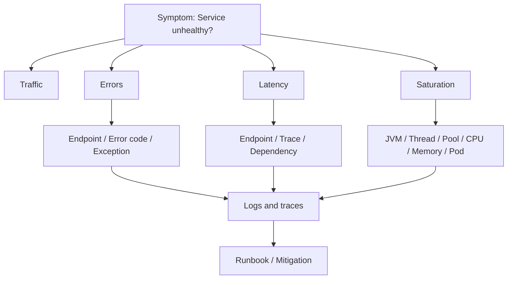
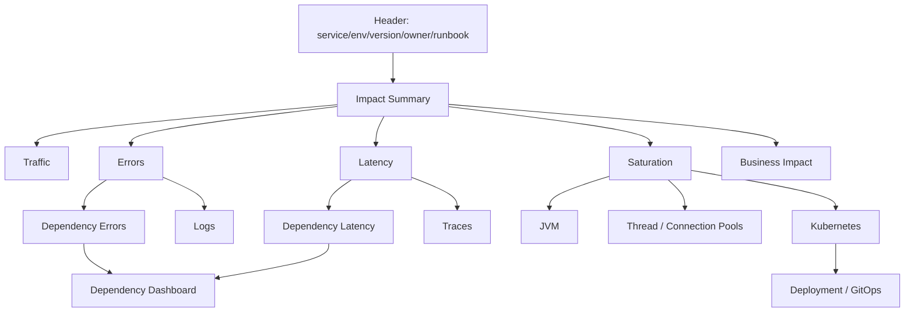
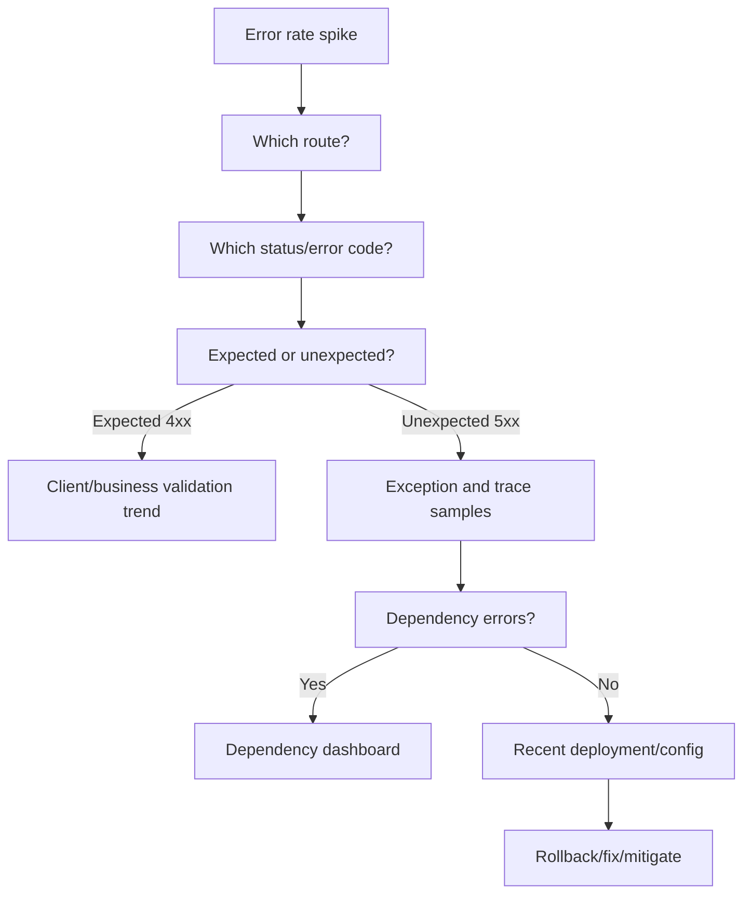
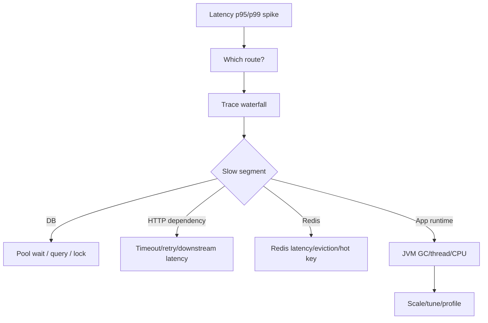
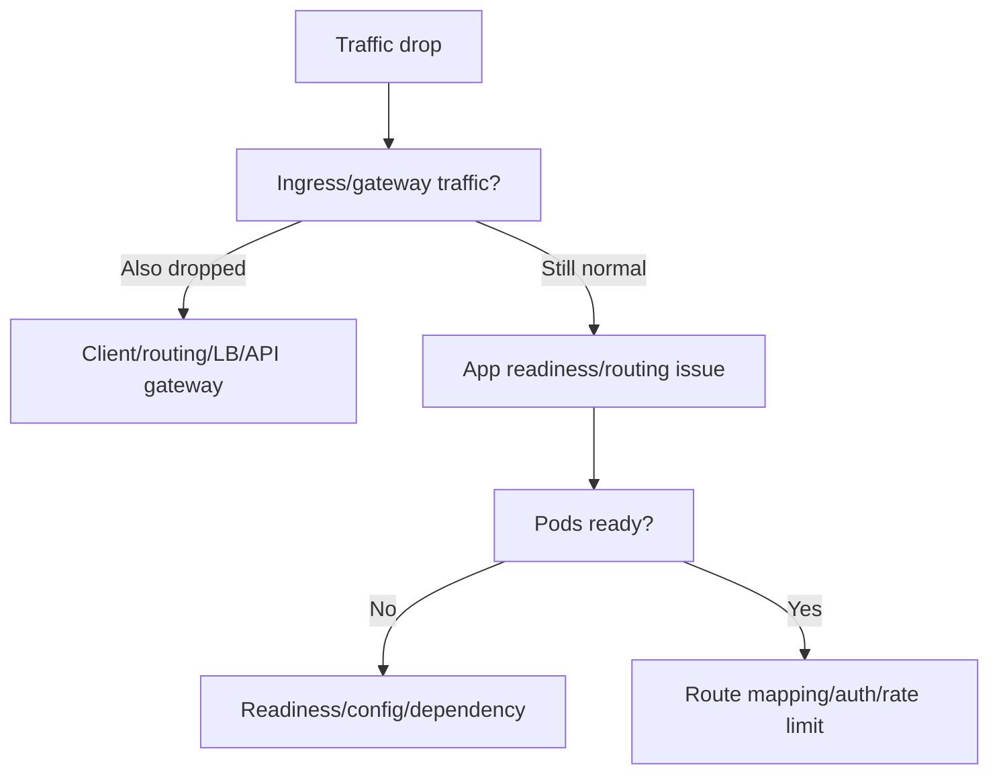
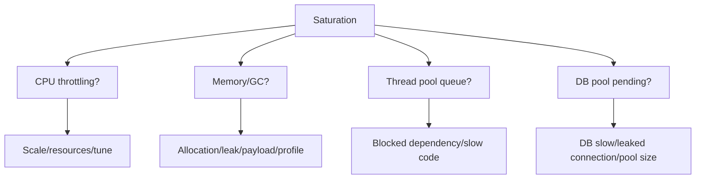
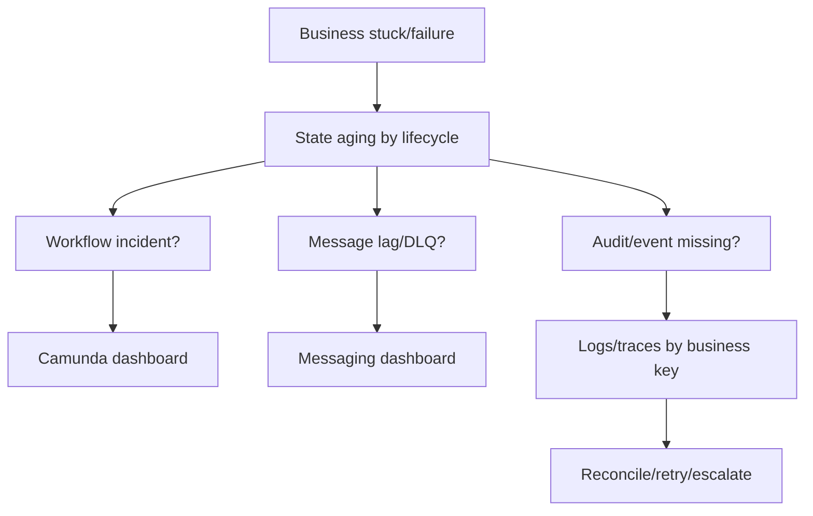

# Cheatsheet Observability Part 040 — Service Health Dashboard

> Fokus part ini: merancang service health dashboard yang bisa dipakai on-call/backend engineer untuk menjawab cepat: apakah service Java/JAX-RS sehat, apakah user terdampak, apakah masalah berasal dari aplikasi/dependency/runtime/platform, dan apa langkah investigasi berikutnya.

---

## 1. Core Mental Model

Service health dashboard adalah **cockpit utama** untuk satu service production.

Dashboard ini harus menjawab dalam beberapa menit:

- apakah service menerima traffic normal;
- apakah error rate naik;
- apakah latency naik;
- apakah saturation terjadi;
- apakah dependency error/latency naik;
- apakah JVM bermasalah;
- apakah pod/container bermasalah;
- apakah deployment/config baru berkorelasi;
- apakah issue berdampak ke business flow;
- apa drilldown berikutnya.

Service health dashboard bukan tempat semua metric dimasukkan.

Ia harus menjadi **triage map**.



---

## 2. Dashboard Purpose

A service health dashboard should support these decisions:

| Question | Decision |
|---|---|
| Is the service down or degraded? | page/escalate/mitigate |
| Is this customer impacting? | incident severity/customer comms |
| Is traffic abnormal? | capacity/throttle/investigate client |
| Is error rate abnormal? | rollback/fix/dependency escalation |
| Is latency abnormal? | isolate slow endpoint/dependency/resource |
| Is saturation present? | scale/tune/reduce load |
| Did it start after deployment? | rollback/canary pause/config revert |
| Is dependency failing? | route incident to dependency owner |
| Is it platform-related? | involve SRE/platform |
| Is business lifecycle impacted? | involve support/ops/domain owner |

If dashboard cannot support decisions like these, it is incomplete.

---

## 3. Recommended Layout

A practical service health dashboard layout:

1. **Service identity and current status**
2. **Impact summary**
3. **Traffic**
4. **Errors**
5. **Latency**
6. **Saturation**
7. **Dependency health**
8. **Runtime/JVM health**
9. **Kubernetes/deployment health**
10. **Business impact, if relevant**
11. **Drilldown links and runbooks**

This order matters. During incident, first understand impact, then cause.

---

## 4. Service Identity Panel

At the top, show identity metadata:

- service name;
- environment;
- region/site/cluster;
- namespace;
- owner/team;
- runtime version;
- application version;
- deployment version;
- commit SHA/build ID/image digest if available;
- current replica count;
- dashboard owner;
- runbook link;
- alert link;
- trace/log search link.

Why this matters:

- avoids debugging the wrong environment;
- helps correlate deployment with symptoms;
- helps escalation;
- helps incident notes;
- helps compare versions during canary/rollout.

Internal verification checklist:

- confirm what metadata is available in telemetry resource attributes;
- confirm whether deployment version is attached to metrics/logs/traces;
- confirm owner/team label convention;
- confirm runbook location;
- confirm environment/region naming.

---

## 5. Impact Summary Row

The first row should provide a quick answer: healthy or not?

Recommended panels:

| Panel | Meaning |
|---|---|
| Request rate | is the service receiving normal traffic? |
| Error rate | are requests failing? |
| Latency p95/p99 | are users waiting too long? |
| Availability/SLO burn | is reliability target being consumed? |
| Active alerts | are alerts firing? |
| Recent deployment marker | did change happen near symptom start? |
| Business failure count | are quote/order workflows impacted? |

Example operational interpretation:

| Observation | Likely meaning |
|---|---|
| traffic drops to zero | routing, ingress, gateway, client, deployment, or service down |
| traffic normal + error spike | app/dependency failure |
| traffic spike + latency spike | load/capacity/backpressure issue |
| latency spike without error | slow dependency, pool wait, thread saturation, lock wait |
| error spike after deployment | regression or config/migration issue |
| business failure spike without 5xx | async/workflow/domain lifecycle issue |

---

## 6. Traffic Panels

Traffic tells whether demand changed.

Recommended panels:

- request rate by HTTP method;
- request rate by route template;
- request rate by status code class;
- active requests;
- payload size distribution if available;
- top endpoints by throughput;
- ingress/gateway request rate if available.

For JAX-RS:

```text
method = POST
route_template = /orders/{orderId}/submit
status_class = 2xx | 4xx | 5xx
```

Avoid:

```text
path = /orders/ORD-123/submit
request_id = abc
user_id = 987
```

Traffic diagnosis:

| Pattern | Investigate |
|---|---|
| request rate drops | ingress, gateway, DNS, LB, deployment, readiness |
| request rate spikes | client retry storm, batch job, traffic shift, abuse |
| one endpoint spikes | consumer behavior, feature launch, runaway job |
| active request rises | slow processing, blocked threads, dependency wait |
| payload size rises | client change, large quote/order payload, serialization cost |

Internal verification checklist:

- confirm route template label exists;
- confirm raw path is not used as metric label;
- confirm method/status labels are normalized;
- confirm ingress/gateway traffic can be compared to app traffic;
- confirm active request metric exists.

---

## 7. Error Panels

Errors must distinguish expected failures from unexpected failures.

Recommended panels:

- error rate by status code class;
- 5xx rate by route template;
- 4xx rate by route template;
- error count by domain error code;
- error count by exception category;
- timeout count;
- retry exhausted count;
- dependency error count;
- validation failure count if business-relevant;
- auth/authz failure count if security-relevant.

Do not treat all 4xx as service failures.

For enterprise APIs:

| Error class | Interpretation |
|---|---|
| 400 validation | client/business input issue, may still be important |
| 401/403 | auth/authz/security/config issue |
| 404 | expected lookup failure or routing/resource issue |
| 409 | conflict/state/idempotency issue |
| 429 | throttling/rate limit/backpressure |
| 500 | unexpected application failure |
| 502/503/504 | gateway/upstream/service availability issue |

For JAX-RS, error panels should align with `ExceptionMapper` behavior.

If `ExceptionMapper` maps domain validation failure to 400, dashboard should not mark it as service outage unless rate or business impact is abnormal.

Internal verification checklist:

- confirm error code taxonomy;
- confirm exception mapping convention;
- confirm expected vs unexpected error separation;
- confirm retryable vs non-retryable error metric;
- confirm timeout metric exists;
- confirm 4xx/5xx are not mixed blindly;
- confirm error logs contain trace ID/correlation ID.

---

## 8. Latency Panels

Latency dashboard must show tail behavior.

Recommended panels:

- p50/p95/p99 latency overall;
- p95/p99 latency by route template;
- latency heatmap if available;
- slowest endpoints;
- request duration by status code class;
- downstream dependency latency;
- DB query/pool wait latency;
- queue/message processing latency if applicable;
- time in workflow state if business-relevant.

Avoid average-only latency.

| Latency pattern | Possible cause |
|---|---|
| p95 high, p50 normal | tail latency, dependency outliers, GC pauses, lock contention |
| all percentiles high | broad degradation, saturation, dependency slowdown |
| one endpoint high | code path, DB query, downstream call, payload issue |
| POST high only | write transaction, validation, publish event, workflow start |
| latency high + error low | slow but not failing dependency, pool wait, queueing |
| latency high after deployment | regression, config, migration, feature flag |

For Java/JAX-RS services, latency must be correlated with trace waterfall.

Dashboard should link from high-latency endpoint to trace examples.

Internal verification checklist:

- confirm histogram buckets are appropriate;
- confirm percentiles are computed correctly;
- confirm endpoint label is template-based;
- confirm latency includes/excludes queue time intentionally;
- confirm timeout and cancellation behavior are visible;
- confirm trace exemplars/drilldown exist if supported.

---

## 9. Saturation Panels

Saturation tells whether the service is running out of capacity.

Recommended saturation panels:

- CPU usage;
- CPU throttling;
- memory usage vs limit;
- JVM heap usage;
- JVM non-heap/metaspace/direct memory;
- GC pause and count;
- thread count;
- thread pool active/queue/rejection;
- HTTP server worker pool usage;
- DB connection pool active/idle/pending;
- Redis/HTTP client connection pool if available;
- file descriptor usage;
- pod restart/OOMKilled;
- request queue depth if available.

Saturation diagnosis:

| Pattern | Possible cause |
|---|---|
| CPU high, throttling high | CPU limit too low or workload spike |
| memory high, GC high | allocation pressure, leak, payload growth |
| heap stable, direct memory high | buffer/native memory issue |
| thread pool queue high | blocked dependency, insufficient workers, slow requests |
| DB pool pending high | pool exhausted, slow DB, leaked connection |
| active requests high | slow downstream, client retry, saturation |
| pod restarts | crash, OOM, failed probe, deployment instability |

Internal verification checklist:

- confirm thread pool metrics exist;
- confirm DB pool metrics exist;
- confirm CPU throttling is visible;
- confirm memory limit and usage are shown together;
- confirm JVM and container memory are not confused;
- confirm pod restart reasons are visible;
- confirm file descriptor metrics if relevant.

---

## 10. Dependency Health Row

A service health dashboard should include a compact dependency row, not full dependency detail.

Recommended panels:

- downstream HTTP error rate and latency by dependency;
- PostgreSQL connection pool and query latency summary;
- Redis latency/error summary;
- Kafka publish/consume error summary if service uses Kafka;
- RabbitMQ publish/consume error summary if service uses RabbitMQ;
- Camunda failed job/incident summary if service owns workflow logic;
- circuit breaker open/half-open count;
- retry rate;
- timeout rate.

Purpose:

- decide whether to drill into dependency dashboard;
- avoid blaming application code too early;
- identify cascading failure.

Example interpretation:

| App symptom | Dependency row shows | Likely next step |
|---|---|---|
| latency high | DB query latency high | DB dashboard / slow query |
| errors high | downstream 503 high | dependency owner / retry/circuit breaker |
| queue backlog | consumer processing latency high | messaging dashboard |
| order stuck | Camunda incident high | workflow dashboard |
| 5xx spike | Redis timeout high | Redis dashboard / failover check |

Internal verification checklist:

- confirm dependency names are standardized;
- confirm timeout/retry/circuit breaker metrics exist;
- confirm dependency spans are emitted;
- confirm service dashboard links to dependency dashboards;
- confirm dependencies are classified critical/non-critical.

---

## 11. Runtime/JVM Row

JVM panels should help answer whether Java runtime is contributing to degradation.

Recommended panels:

- heap used/max;
- non-heap/metaspace;
- direct memory if available;
- GC pause p95/max;
- GC count/rate;
- allocation rate if available;
- thread count;
- blocked/deadlocked thread count if available;
- class loading;
- process CPU;
- safepoint pause if available;
- JVM uptime/restart.

Do not isolate JVM panels from request panels.

Useful correlation:

```text
latency p99 spike + GC pause spike -> GC pressure likely
latency spike + thread count high + DB pool pending high -> blocked/waiting requests likely
pod restart + JVM uptime reset -> runtime restart affected availability
```

Internal verification checklist:

- confirm JVM metrics are collected for all pods;
- confirm GC algorithm is known;
- confirm heap max aligns with container memory;
- confirm direct memory visibility if Netty/NIO/client libraries use it;
- confirm thread dump procedure is documented;
- confirm JFR/profiling procedure if needed.

---

## 12. Kubernetes and Deployment Row

Service dashboard should show platform state relevant to service health.

Recommended panels:

- desired vs available replicas;
- pod readiness;
- pod restarts;
- restart reason;
- OOMKilled count;
- CPU usage vs request/limit;
- memory usage vs request/limit;
- CPU throttling;
- deployment rollout status;
- HPA desired/current replicas;
- recent Kubernetes events;
- ingress error/latency summary;
- deployment marker/version marker.

Interpretation:

| Pattern | Possible issue |
|---|---|
| replicas unavailable | rollout/probe/resource/scheduling issue |
| readiness failing | app startup/dependency/config issue |
| liveness restarts | deadlock/event loop/blocking/slow health check |
| OOMKilled | memory leak/limit too low/payload spike |
| CPU throttling | limit too low, CPU-heavy workload |
| version mismatch | partial rollout/canary/drift |

Internal verification checklist:

- confirm Kubernetes labels match service identity;
- confirm deployment version appears in telemetry;
- confirm pod restart reason is visible;
- confirm HPA events are visible;
- confirm ingress metrics can be correlated with app metrics;
- confirm GitOps deployment markers exist.

---

## 13. Business Impact Row

For CPQ/order management services, service health dashboard should include a small business impact row.

Recommended panels:

- quote/order request failure rate;
- pricing failure count;
- approval failure/aging;
- order validation/decomposition failure;
- fulfillment request failure;
- fallout creation spike;
- stuck order count by state;
- reconciliation mismatch count;
- business SLA breach count.

This prevents the common incident problem:

> Technical metrics look acceptable, but business flow is broken.

Example:

- HTTP 200 from submit endpoint;
- event publish fails silently;
- order remains in `Submitted`;
- customer sees no progress;
- service dashboard without business row looks healthy.

Internal verification checklist:

- confirm which business events the service owns;
- confirm state aging metrics exist;
- confirm stuck entity detection exists;
- confirm lifecycle SLA is defined;
- confirm dashboard does not expose raw customer/order identifiers;
- confirm drilldown goes to controlled logs/traces/audit.

---

## 14. Deployment Marker and Version Awareness

Every service health dashboard should show changes.

Useful markers:

- deployment timestamp;
- application version;
- commit SHA;
- build ID;
- image digest;
- config version;
- feature flag state;
- database migration version;
- canary start/end;
- rollback marker;
- incident marker.

Why:

- reduces mean time to suspicion;
- supports rollback decision;
- helps compare before/after;
- helps RCA evidence;
- avoids guessing.

Pattern:

```text
error rate stable -> deploy marker -> error spike starts -> version B only affected
```

This is often enough to choose rollback before deep root cause.

Internal verification checklist:

- confirm CI/CD emits deployment events;
- confirm dashboard displays deployment markers;
- confirm metrics/logs/traces include version labels;
- confirm feature flag changes are visible if relevant;
- confirm config changes are auditable.

---

## 15. Drilldown Links

Service health dashboard should link to:

- logs filtered by service/env/version;
- logs filtered by route/status/error code;
- trace search filtered by service/endpoint/error/latency;
- dependency dashboards;
- Kubernetes workload dashboard;
- JVM/profiling dashboard;
- business lifecycle dashboard;
- alert definition;
- runbook;
- recent deployment/CI/CD view;
- incident channel or incident process if applicable.

A dashboard without drilldown slows incident response.

---

## 16. Example Service Health Dashboard Structure



This structure keeps first-level triage clear while preserving drilldown.

---

## 17. Service Health Dashboard for Java/JAX-RS

Minimum recommended panels:

### HTTP/API

- request rate by route template;
- error rate by status class;
- 5xx rate by route template;
- p95/p99 latency by route template;
- active requests;
- request payload size if relevant;
- timeout/cancellation count.

### Error taxonomy

- domain validation errors;
- auth/authz errors;
- dependency errors;
- retry exhausted;
- unexpected exceptions;
- error code distribution.

### Runtime

- heap/non-heap/direct memory;
- GC pause/count;
- CPU usage/throttling;
- thread count;
- thread pool queue/rejection;
- connection pool active/idle/pending;
- file descriptors.

### Dependencies

- PostgreSQL latency/pool/slow query summary;
- Redis latency/error/cache hit/miss summary;
- Kafka/RabbitMQ publish/consume/lag summary;
- Camunda failed job/incident summary;
- downstream HTTP latency/error/timeout.

### Platform

- pod readiness;
- pod restart;
- OOMKilled;
- available replicas;
- HPA state;
- deployment marker;
- version label.

### Drilldown

- logs by trace ID/correlation ID;
- traces by route/error/latency;
- runbook;
- alert rule;
- dependency dashboard.

---

## 18. Common Diagnostic Paths

### 18.1 Error Rate Spike



---

### 18.2 Latency Spike



---

### 18.3 Traffic Drop



---

### 18.4 Saturation



---

### 18.5 Business Flow Broken but Technical Metrics Look Fine



---

## 19. Dashboard Failure Modes

### 19.1 Service Looks Healthy but Is Not

Possible causes:

- dashboard only tracks HTTP 5xx;
- async consumers broken;
- business state stuck;
- 200 response hides failed downstream side effect;
- metrics missing for background jobs;
- expected error category hides abnormal volume.

Fix:

- add business lifecycle panels;
- add queue/DLQ/consumer lag;
- add job metrics;
- add dependency outcome metrics;
- add state aging.

---

### 19.2 Dashboard Shows Red but No User Impact

Possible causes:

- alert threshold too sensitive;
- expected validation errors counted as service errors;
- synthetic test false positive;
- noisy low-priority endpoint;
- metric aggregation wrong;
- short window too volatile.

Fix:

- separate expected/unexpected errors;
- add traffic weighting;
- add business impact panel;
- tune window/threshold;
- connect to SLO.

---

### 19.3 Dashboard Cannot Explain Cause

Possible causes:

- no dependency row;
- no trace drilldown;
- no deployment marker;
- no runtime saturation panels;
- no log correlation;
- missing context propagation.

Fix:

- add dependency summaries;
- add trace/log links;
- add deployment annotations;
- fix correlation ID/trace ID propagation;
- add JVM/thread/pool panels.

---

## 20. Correctness Concerns

Service dashboard can mislead if:

- counters are not converted to rates;
- route label uses raw path;
- latency histogram buckets are wrong;
- average latency hides tail;
- 4xx and 5xx are mixed blindly;
- missing metric appears as zero;
- scrape failures are not visible;
- pod-level aggregation hides one bad pod;
- deployment version label is missing;
- timezones are inconsistent;
- sampling hides traces for failures;
- backend retention is too short.

Review dashboard correctness before trusting it in incident.

---

## 21. Performance and Cost Concerns

Service health dashboards can become expensive.

Risky patterns:

- high-cardinality labels in every panel;
- raw path grouping;
- user/order/request ID grouping;
- very long default time range;
- high refresh frequency;
- dozens of panels querying high-resolution data;
- duplicate dashboards per service with no owner.

Cost-aware choices:

- overview panels use low-cardinality labels;
- drilldown handles high-cardinality investigation;
- default time range fits incident use;
- expensive panels are moved to deeper dashboards;
- stale panels are removed;
- dashboard query cost is reviewed.

---

## 22. Security and Privacy Concerns

Service health dashboard must not expose:

- raw quote/order/customer identifiers;
- user identifiers unless explicitly approved;
- raw paths with IDs;
- query parameters;
- tokens/cookies/headers;
- raw SQL with values;
- raw exception messages containing sensitive data;
- payload fragments.

Safe practice:

- use route template;
- use error code/category;
- use sanitized operation name;
- use low-cardinality business category;
- put sensitive drilldown behind controlled access;
- align dashboard access with data sensitivity.

---

## 23. Service Health Dashboard Review Checklist

Use this checklist before declaring a service production-ready:

- Does the dashboard show service identity, env, owner, and version?
- Does it show request rate?
- Does it show error rate by status class?
- Does it separate expected and unexpected errors?
- Does it show p95/p99 latency?
- Does it show latency by route template?
- Does it show active requests?
- Does it show thread pool saturation?
- Does it show DB connection pool state?
- Does it show JVM heap, non-heap, GC, and CPU?
- Does it show CPU throttling and memory limit?
- Does it show pod restarts and readiness?
- Does it show dependency latency/error/timeout?
- Does it show deployment/config markers?
- Does it link to logs and traces?
- Does it link to dependency dashboards?
- Does it link to runbook?
- Does it show business impact if the service owns business lifecycle?
- Are labels low-cardinality and privacy-safe?
- Are units and thresholds visible?
- Are missing data and stale panels detectable?
- Has it been used or tested during incident/game day?

---

## 24. Internal Verification Checklist

For CSG/team context, verify rather than assume:

- standard service dashboard template;
- required production readiness panels;
- required labels/resource attributes;
- route template metric convention;
- status/error code taxonomy;
- expected vs unexpected error classification;
- trace/log drilldown pattern;
- dashboard platform and query language;
- deployment marker integration;
- CI/CD metadata labels;
- Kubernetes namespace/label convention;
- JVM metric collection approach;
- thread pool and connection pool metric availability;
- dependency naming convention;
- alert-to-dashboard link convention;
- runbook location;
- SLO dashboard integration;
- data access restrictions;
- dashboard ownership and review cadence;
- known dashboard gaps from past incidents.

---

## 25. Senior Engineer Heuristics

When reviewing a service health dashboard, ask:

- Can I decide in 2 minutes whether the service is degraded?
- Can I tell whether users/business flows are impacted?
- Can I separate traffic, error, latency, and saturation?
- Can I distinguish application issue from dependency issue?
- Can I see whether a deployment/config change happened?
- Can I drill from metric to trace/log evidence?
- Can I detect async/business lifecycle failures?
- Can I see one bad pod hidden by aggregate?
- Can I see tail latency, not just average?
- Can I avoid leaking sensitive identifiers?
- Can I explain each panel's purpose?
- Would this dashboard have helped in the last incident?

---

## 26. Key Takeaways

- Service health dashboard is the primary cockpit for one production service.
- It should start with impact, then traffic/errors/latency/saturation, then dependency/runtime/platform drilldown.
- Java/JAX-RS dashboards need route templates, exception mapping awareness, runtime/JVM visibility, pool metrics, and trace/log correlation.
- For CPQ/order management, service health must include business impact or lifecycle health where relevant.
- Deployment markers and version labels are essential for release-related incidents.
- Dashboard correctness, cost, cardinality, and privacy are core design constraints.
- A dashboard is only proven when it helps during a real incident or controlled game day.
