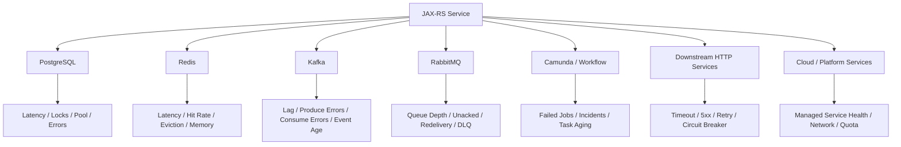
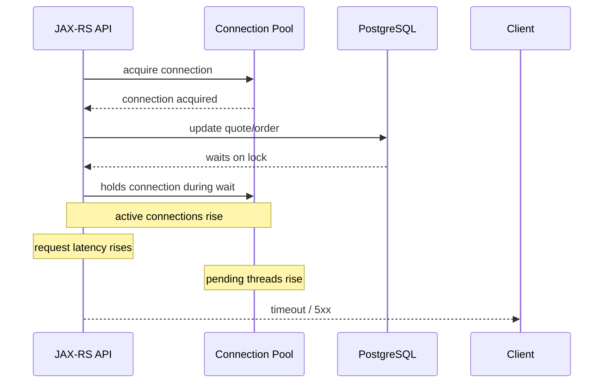
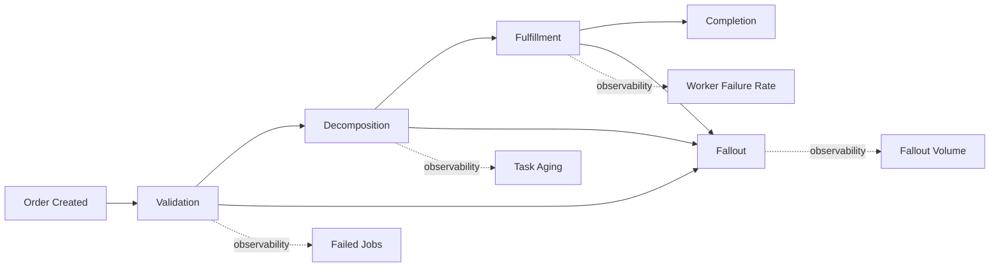
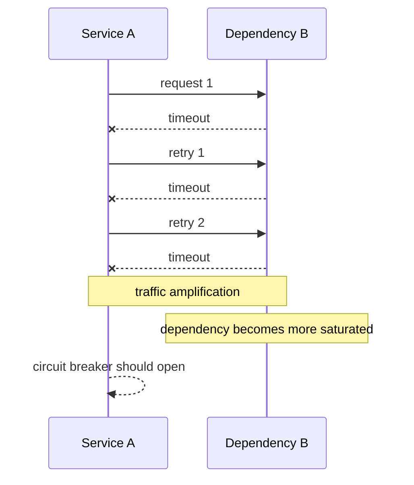
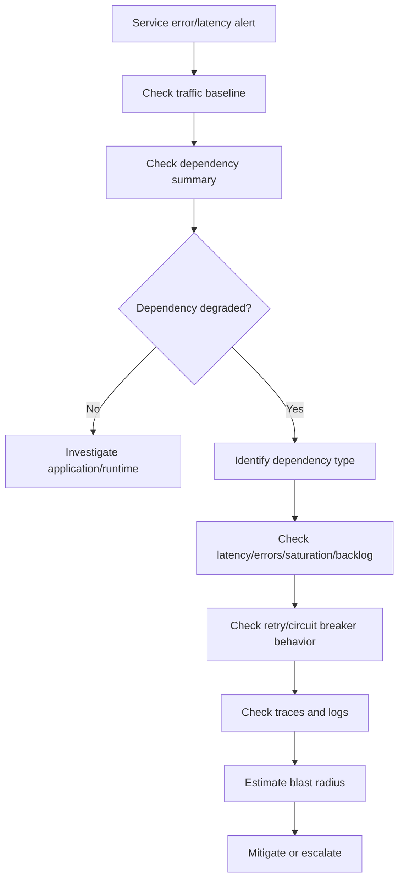

# Cheatsheet Observability Part 041 — Dependency Health Dashboard

> Fokus part ini: merancang dependency health dashboard yang membantu backend engineer membedakan apakah incident berasal dari service sendiri, PostgreSQL, Redis, Kafka, RabbitMQ, Camunda, downstream HTTP service, Kubernetes/network, atau cloud-managed dependency.

---

## 1. Core Mental Model

Dependency health dashboard adalah **peta kesehatan boundary eksternal** dari sebuah service.

Service Java/JAX-RS jarang gagal sendirian. Banyak incident terlihat sebagai error di API layer, tetapi sumbernya bisa berada di:

- PostgreSQL connection pool habis;
- query lambat karena lock;
- Redis latency naik atau eviction terjadi;
- Kafka consumer lag menumpuk;
- RabbitMQ queue depth meningkat;
- Camunda failed job/incident naik;
- downstream HTTP service timeout;
- cloud load balancer, managed DB, DNS, secret service, atau network path bermasalah.

Service health dashboard menjawab: **apakah service sehat?**

Dependency health dashboard menjawab: **apa yang service butuhkan agar tetap sehat, dan dependency mana yang sedang merusak service behavior?**



The key discipline: **do not debug dependency health from application error logs only**. Logs tell you a failure happened. Dependency dashboards tell you whether the dependency behavior changed systemically.

---

## 2. What This Dashboard Must Answer

A dependency dashboard should answer these questions quickly:

| Question | Why it matters |
|---|---|
| Which dependency is degraded? | Reduces search space during incident. |
| Is degradation isolated or systemic? | Determines escalation and blast radius. |
| Is the service failing because dependency is slow, unavailable, saturated, or returning wrong responses? | Different mitigation path. |
| Did dependency degradation begin before application errors? | Helps identify cause vs symptom. |
| Are retries making the problem worse? | Prevents retry storms. |
| Are queues absorbing load or hiding failure? | Prevents delayed incident discovery. |
| Is lag/backlog increasing or draining? | Determines recovery status. |
| Is there a customer/business lifecycle impact? | Guides severity and communication. |
| Is the dependency owned by another team/platform/vendor/cloud provider? | Determines escalation route. |

A dashboard that only shows dependency availability is not enough. Production systems fail by **latency, saturation, backlog, correctness drift, and partial failure**, not only by hard-down status.

---

## 3. Recommended Layout

A practical dependency health dashboard layout:

1. **Dependency map and owner table**
2. **Global dependency status summary**
3. **PostgreSQL health**
4. **Redis health**
5. **Kafka health**
6. **RabbitMQ health**
7. **Camunda/workflow health**
8. **Downstream HTTP health**
9. **Cloud/platform dependency health**
10. **Timeout/retry/circuit breaker behavior**
11. **Dependency error budget or SLO panels**
12. **Drilldown links: logs, traces, runbooks, service dashboards**

This dashboard is not a replacement for each platform dashboard. It is a **service-centric dependency view**.

For example, the PostgreSQL team may have a global DB dashboard. Your service still needs a panel showing how **your service** experiences that DB: pool wait, query latency, error count, transaction duration, and affected endpoints.

---

## 4. Dependency Inventory Panel

Start with a small table of dependencies.

| Dependency | Usage | Criticality | Owner | Failure impact | Runbook |
|---|---|---:|---|---|---|
| PostgreSQL | source of truth | Critical | DB/platform/backend | request failure, stale lifecycle, transaction rollback | DB runbook |
| Redis | cache/lock/idempotency | High | platform/backend | latency, duplicate processing, cache miss storm | Redis runbook |
| Kafka | async event stream | High | platform/event team | lag, delayed lifecycle, missed integration | Kafka runbook |
| RabbitMQ | command/task queue | High | platform/backend | queue buildup, redelivery loop, DLQ spike | RabbitMQ runbook |
| Camunda | workflow/process state | Critical | workflow/backend | stuck order/approval/fallout | Workflow runbook |
| Downstream service | API dependency | Varies | owning service team | timeout, degraded quote/order flow | downstream runbook |

This is not decoration. During incident, ownership clarity reduces delay.

Minimum fields:

- dependency name;
- dependency type;
- business criticality;
- owning team;
- escalation channel;
- runbook link;
- dashboard link;
- primary SLI;
- fallback/degraded-mode behavior;
- known failure modes.

---

## 5. Dependency Status Summary

The top of the dashboard should show a concise matrix:

| Dependency | Availability | Latency | Error Rate | Saturation | Backlog/Lag | Current Risk |
|---|---:|---:|---:|---:|---:|---|
| PostgreSQL | OK | Warning | OK | Warning | N/A | pool pressure |
| Redis | OK | OK | OK | OK | N/A | none |
| Kafka | OK | N/A | OK | N/A | Critical | consumer lag |
| RabbitMQ | OK | N/A | Warning | N/A | Warning | redelivery |
| Camunda | OK | Warning | Warning | N/A | Warning | failed jobs |
| Downstream pricing | Degraded | Critical | Critical | Unknown | N/A | timeout storm |

This summary should not be manually maintained. It should be derived from existing metrics/alerts if possible.

The goal is not perfect accuracy. The goal is fast triage.

---

## 6. PostgreSQL Health Panels

For Java/JAX-RS systems using JDBC, MyBatis, JPA, or direct SQL, PostgreSQL degradation often appears first as API latency.

### 6.1 Connection Pool Health

Track:

- active connections;
- idle connections;
- pending/waiting threads;
- max pool size;
- connection acquisition latency;
- connection timeout count;
- pool exhaustion events;
- connection creation failure;
- connection lifetime/max lifetime churn.

Useful questions:

| Signal | Question |
|---|---|
| Active near max | Is the service saturating the DB pool? |
| Pending threads > 0 | Are requests waiting for DB connections? |
| Acquisition latency rising | Is pool pressure causing request latency? |
| Timeout count rising | Are requests failing before SQL executes? |
| Idle connections zero | Is the pool undersized or DB too slow? |

For Java, this is often HikariCP or another DataSource pool. Do not only watch DB server metrics; watch **application-side pool experience**.

### 6.2 Query Latency

Track:

- query latency percentile;
- slow query count;
- query timeout count;
- endpoint-to-query correlation;
- repository/mapper operation name;
- transaction duration;
- rows scanned/affected if available;
- database error count by SQL state/category.

Avoid dashboard labels containing raw SQL with parameters. SQL statement visibility must be sanitized.

Good panel grouping:

- latency by operation name, not full SQL text;
- error by SQL state class;
- transaction duration by use case;
- slow query count by service and endpoint;
- lock wait indicator.

### 6.3 Locks and Transactions

Track:

- lock wait count;
- deadlock count;
- long-running transaction count;
- transaction age;
- blocked query count;
- active query count;
- idle-in-transaction count.

Common failure pattern:



This failure is not solved by blindly increasing pool size. Increasing pool size can increase DB pressure.

---

## 7. Redis Health Panels

Redis dependency health depends on usage pattern.

Redis as cache needs different panels from Redis as lock store, idempotency store, rate limiter, or stream.

### 7.1 Cache Panels

Track:

- cache hit ratio;
- cache miss ratio;
- command latency;
- command error count;
- key eviction count;
- expired key count;
- memory usage;
- connected clients;
- blocked clients;
- slowlog count.

Useful diagnosis:

| Symptom | Possible cause |
|---|---|
| Hit ratio drops | cache invalidation issue, cold cache, key mismatch |
| Redis latency rises | network issue, CPU pressure, slow command, large payload |
| Eviction rises | memory pressure, wrong maxmemory policy, oversized values |
| Miss storm | deployment restart, TTL too short, mass invalidation |
| Blocked clients | slow command or server-side blocking operation |

### 7.2 Lock, Idempotency, and Rate Limiter Panels

Track:

- lock acquire success/failure;
- lock wait duration;
- lock timeout;
- duplicate idempotency key count;
- idempotency store write/read errors;
- rate limiter allowed/blocked counts;
- rate limiter Redis error fallback behavior.

Do not label metrics by raw Redis key, user ID, request ID, order ID, or full idempotency key. Use operation names and low-cardinality outcome labels.

### 7.3 Redis Stream Panels

If Redis Streams are used:

- pending entries;
- consumer group lag;
- message age;
- claim count;
- delivery attempts;
- stream length;
- consumer active/inactive status.

Redis stream lag should be treated like queue lag: it can hide business delay even when API endpoints look healthy.

---

## 8. Kafka Health Panels

Kafka can degrade through producer errors, broker issues, consumer lag, processing failures, schema errors, or event age.

### 8.1 Producer Panels

Track:

- records sent rate;
- publish latency;
- send error count;
- retry count;
- request timeout count;
- record size;
- batch size;
- buffer availability;
- topic-level produce errors.

Production questions:

- Are quote/order events being published successfully?
- Is publish latency delaying request completion?
- Are producer retries hiding broker instability?
- Is a specific topic failing?
- Did record size increase after deployment?

### 8.2 Consumer Panels

Track:

- consumer lag;
- records consumed rate;
- processing latency;
- event age;
- commit latency;
- commit failure count;
- rebalance count;
- processing error count;
- retry count;
- DLQ count.

Consumer lag alone is insufficient. A service can have low lag but high processing latency if traffic is low. A service can have high lag but draining normally after a burst. Add **lag trend** and **event age**.

### 8.3 Kafka Failure Patterns

| Pattern | Dashboard evidence |
|---|---|
| Producer cannot publish | send errors, retries, timeout, broker/network errors |
| Consumer stuck | lag increasing, consume rate near zero, processing errors |
| Poison message | same partition lag, repeated failures, DLQ spike |
| Rebalance storm | rebalance count spike, processing interruption, lag oscillation |
| Slow consumer | processing latency rises, event age rises, lag rising slowly |
| Downstream dependency failure | consumer errors correlate with downstream HTTP/DB/Redis panels |

For CPQ/order management, delayed event processing can mean delayed fulfillment, fallout, reconciliation, notification, or lifecycle transition.

---

## 9. RabbitMQ Health Panels

RabbitMQ is often used for command queues, work queues, integration buffers, or task dispatch.

Track:

- queue depth;
- ready messages;
- unacked messages;
- publish rate;
- consume rate;
- ack rate;
- nack/reject rate;
- redelivery count;
- DLQ count;
- consumer count;
- channel/connection count;
- message age;
- queue memory/disk usage where available.

Important interpretation:

| Signal | Meaning |
|---|---|
| Ready messages rising | consumers too slow/downstream issue/load spike |
| Unacked rising | consumers received but not acking; processing stuck/slow |
| Redelivery rising | processing failure or ack/nack loop |
| DLQ rising | poison messages or invalid payloads |
| Publish > consume | backlog forming |
| Consume zero with ready > 0 | consumer unavailable or routing/permission issue |

For RabbitMQ, dashboard should separate:

- queue backlog;
- consumer health;
- redelivery behavior;
- DLQ behavior;
- broker/platform resource pressure.

Do not treat queue depth as harmless. Queue depth means work is delayed. In order management, delayed work can become SLA breach.

---

## 10. Camunda / Workflow Health Panels

Workflow dependency health is about process progress, not only technical uptime.

Track:

- active process instances;
- new process instance rate;
- completed process instance rate;
- failed job count;
- incident count;
- job executor backlog;
- timer backlog;
- external worker latency;
- external worker failure rate;
- message correlation failures;
- human task aging;
- process instance age;
- stuck process count;
- variable size warnings if available.

Business questions:

- Are approvals aging?
- Are orders stuck before fulfillment?
- Are fallout processes increasing?
- Are timers firing late?
- Are external workers failing?
- Are message correlations missing because correlation keys are wrong?
- Are incidents increasing after deployment?

Workflow health panels should be connected to business lifecycle panels, not isolated as platform status.



---

## 11. Downstream HTTP Health Panels

For downstream service calls, track from the caller perspective:

- request rate by dependency;
- error rate by dependency;
- latency percentiles by dependency and operation;
- timeout count;
- retry count;
- circuit breaker state;
- fallback count;
- downstream HTTP status code;
- connection pool usage;
- DNS/TLS/connection errors where available.

Good dimensions:

- dependency name;
- operation name;
- method;
- status code class;
- outcome;
- environment/region.

Dangerous dimensions:

- full URL with raw path;
- query string;
- customer ID;
- quote/order ID;
- request ID;
- token/user/session.

A common dashboard mistake is showing downstream 5xx but not timeout. Many dependency incidents manifest as timeouts rather than explicit 5xx responses.

---

## 12. Timeout, Retry, and Circuit Breaker Panels

Dependency dashboards must show **client-side control behavior**.

Track:

- timeout count;
- timeout rate;
- retry attempts;
- retry success after retry;
- retry exhausted;
- retry delay/backoff;
- circuit breaker open/half-open/closed state;
- circuit breaker rejection count;
- fallback count;
- bulkhead queue depth;
- bulkhead rejection count.

### Retry Storm Pattern



A retry that improves single request success may damage system stability under dependency degradation. Dashboard must expose retry amplification.

---

## 13. Cloud and Platform Dependency Panels

When service depends on AWS/Azure/cloud-managed systems, include platform health signals where relevant:

- managed database CPU/memory/storage/IOPS/connection count;
- managed Redis/cache CPU/memory/eviction/network;
- managed broker health;
- load balancer target health;
- API Gateway/APIM errors/latency/throttling;
- DNS resolution errors;
- secret/config service errors;
- object storage latency/error;
- IAM/auth service errors;
- cloud service health event;
- quota/throttling signals.

For hybrid or on-prem deployment, equivalent platform signals may come from internal monitoring, appliances, network telemetry, or platform dashboards.

Do not invent internal CSG platform details. Treat platform/cloud integration as an internal verification item.

---

## 14. Dependency Latency Budget

Not all latency belongs to the application.

For each key API or business transaction, break down latency budget:

| Segment | Example budget |
|---|---:|
| JAX-RS resource + validation | 50 ms |
| PostgreSQL queries | 150 ms |
| Redis cache/lock | 20 ms |
| Downstream pricing service | 300 ms |
| Kafka publish | 50 ms |
| Serialization/mapping | 30 ms |
| Total | 600 ms |

The exact numbers must be defined internally. The important point is the model.

Without dependency latency breakdown, teams argue from symptoms:

- “API is slow.”
- “DB is slow.”
- “Network is slow.”
- “Downstream is slow.”

With dependency health dashboard, you can show which segment consumed the latency budget.

---

## 15. Dependency Error Budget

Dependency error budget asks:

> How much dependency failure can this service tolerate before user-visible SLO is at risk?

Examples:

- Pricing service timeout budget;
- PostgreSQL connection timeout budget;
- Kafka publish failure budget;
- RabbitMQ DLQ growth budget;
- Camunda incident budget;
- Redis lock failure budget.

Do not confuse dependency SLO with service SLO.

Your service may be responsible for graceful degradation, retry/backoff, fallback, or clear error mapping even when dependency fails.

---

## 16. Java/JAX-RS Implementation View

A service-centric dependency dashboard is usually powered by:

- HTTP server metrics from JAX-RS/Servlet instrumentation;
- HTTP client metrics from Jersey Client/Feign/Java HTTP Client;
- JDBC/DataSource metrics;
- HikariCP metrics;
- Redis client metrics;
- Kafka producer/consumer metrics;
- RabbitMQ client metrics;
- Camunda/external worker metrics;
- OpenTelemetry spans;
- structured logs with correlation IDs;
- Kubernetes/cloud metrics.

### Recommended Application Metric Shape

Use low-cardinality dependency labels:

```text
outbound_request_duration_seconds{
  service="quote-order-api",
  dependency="pricing-service",
  operation="calculate-price",
  method="POST",
  status_class="5xx"
}
```

Avoid:

```text
outbound_request_duration_seconds{
  url="/price?customerId=123&quoteId=Q-999...",
  request_id="...",
  user_id="..."
}
```

The first supports aggregation. The second damages cost, privacy, and query performance.

---

## 17. Trace Drilldown

Dashboard panels should link to traces.

Useful trace drilldowns:

- slow endpoint trace;
- failed request trace;
- trace with DB span dominant;
- trace with downstream HTTP timeout;
- trace with Redis latency;
- trace with Kafka publish failure;
- trace with RabbitMQ consume failure;
- trace with workflow worker failure.

A dashboard without trace drilldown shows **what changed** but often not **where inside a request the time/error happened**.

A trace without dashboard shows one request but not whether it is systemic.

Use both.

---

## 18. Logs Drilldown

Dashboard should link to logs filtered by:

- service;
- environment;
- dependency;
- operation;
- error category;
- correlation ID;
- trace ID;
- deployment version;
- time window.

Example search intent:

```text
service = quote-order-api
AND dependency = pricing-service
AND outcome = timeout
AND timestamp BETWEEN incident_start AND incident_end
```

Log drilldown is especially useful for:

- exception detail;
- domain context;
- retry reason;
- fallback reason;
- audit/business key correlation;
- unsupported edge cases.

---

## 19. Dashboard Anti-Patterns

Avoid these anti-patterns:

| Anti-pattern | Why it hurts |
|---|---|
| One dashboard per technology only | Hard to see service-specific dependency impact. |
| Only platform metrics | Misses application-side experience. |
| Only application logs | Misses systemic dependency degradation. |
| Raw URL labels | Cardinality and privacy risk. |
| Queue depth without message age | Cannot assess business delay. |
| Lag without consume rate | Cannot tell if backlog is draining. |
| Error rate without timeout count | Misses dependency slowness. |
| Retry count hidden | Retry storm invisible. |
| No owner/runbook | Slows escalation. |
| No deployment markers | Hard to correlate with changes. |
| No business impact panel | Severity becomes guesswork. |

---

## 20. Incident Debugging Flow

When service health dashboard shows degradation, use dependency dashboard like this:



Key rule: do not escalate to a dependency owner with only “our service is failing.” Escalate with evidence:

- time window;
- impacted operation;
- error/latency trend;
- trace/log examples;
- dependency metric panel;
- affected business flow;
- whether retry/circuit breaker amplified issue.

---

## 21. CPQ / Order Management Examples

### Example 1 — Pricing Dependency Degraded

Symptoms:

- quote calculation endpoint latency increases;
- downstream pricing service timeout count rises;
- retry count rises;
- circuit breaker opens;
- quote priced event rate drops.

Dashboard should show:

- API latency by endpoint;
- pricing dependency latency/error;
- retry/circuit breaker state;
- affected quote lifecycle metric;
- traces for slow pricing calls.

### Example 2 — Kafka Consumer Lag Delays Order Lifecycle

Symptoms:

- API creation succeeds;
- order processing delayed;
- Kafka consumer lag grows;
- event age increases;
- fulfillment started metric drops.

Dashboard should show:

- topic lag;
- event age;
- consume rate;
- processing errors;
- downstream failure inside consumer if any;
- business state aging.

### Example 3 — PostgreSQL Lock Causes API Timeout

Symptoms:

- order amendment endpoint times out;
- DB transaction duration rises;
- lock wait rises;
- connection pool active count reaches max;
- pending connection count rises.

Dashboard should show:

- pool pressure;
- lock wait;
- long transaction;
- slow query;
- endpoint latency;
- trace dominated by DB span.

---

## 22. Internal Verification Checklist

Verify internally:

- dependency inventory for each Java/JAX-RS service;
- owner/team/escalation mapping for each dependency;
- service-specific PostgreSQL panels;
- connection pool metrics and acquisition latency;
- slow query and lock wait visibility;
- Redis cache/lock/idempotency/rate limiter panels;
- Kafka producer/consumer lag/event age/DLQ panels;
- RabbitMQ queue depth/unacked/redelivery/DLQ panels;
- Camunda process incident/failed job/task aging panels;
- downstream HTTP dependency latency/error/timeout/retry panels;
- circuit breaker/bulkhead/fallback metrics;
- cloud-managed service metrics;
- log drilldown links;
- trace drilldown links;
- runbook links;
- dependency SLO/error budget definitions;
- dashboard owner and review cadence;
- known incident examples mapped to dashboard evidence.

---

## 23. PR Review Checklist

When reviewing PRs that add or change dependency calls, ask:

- Is the dependency named consistently in metrics/traces/logs?
- Is operation name low-cardinality and stable?
- Are timeout and retry metrics emitted?
- Is circuit breaker state observable?
- Are dependency errors mapped cleanly?
- Are request IDs/correlation IDs propagated?
- Are trace spans created or auto-instrumented correctly?
- Are sensitive values excluded from labels, logs, and span attributes?
- Does the dashboard need a new panel?
- Does the alerting model need adjustment?
- Is there a runbook for failure?
- Is there a fallback or degraded-mode behavior?
- Is customer/business impact observable?

---

## 24. Production Readiness Checklist

Before a service is considered production-ready, it should have:

- dashboard panel for each critical dependency;
- dependency latency and error rate;
- timeout and retry visibility;
- backlog/lag visibility for async dependency;
- connection pool visibility for DB;
- trace drilldown for slow/failed dependency calls;
- log drilldown for dependency errors;
- owner/runbook for each dependency;
- alert policy for critical degradation;
- known safe escalation path;
- privacy-safe labels/attributes;
- cardinality-safe metric design.

---

## 25. Key Takeaways

- Dependency dashboard is service-centric, not technology-centric.
- Application-side dependency experience is often more important than platform uptime.
- Latency, backlog, retry, and saturation are as important as error rate.
- Async systems can hide failure until business lifecycle delay becomes visible.
- Retry/circuit breaker behavior must be visible, or mitigation becomes guesswork.
- Every dependency panel should have a drilldown path to logs, traces, owner, and runbook.
- For CPQ/order management, dependency health must connect to quote/order lifecycle impact.
