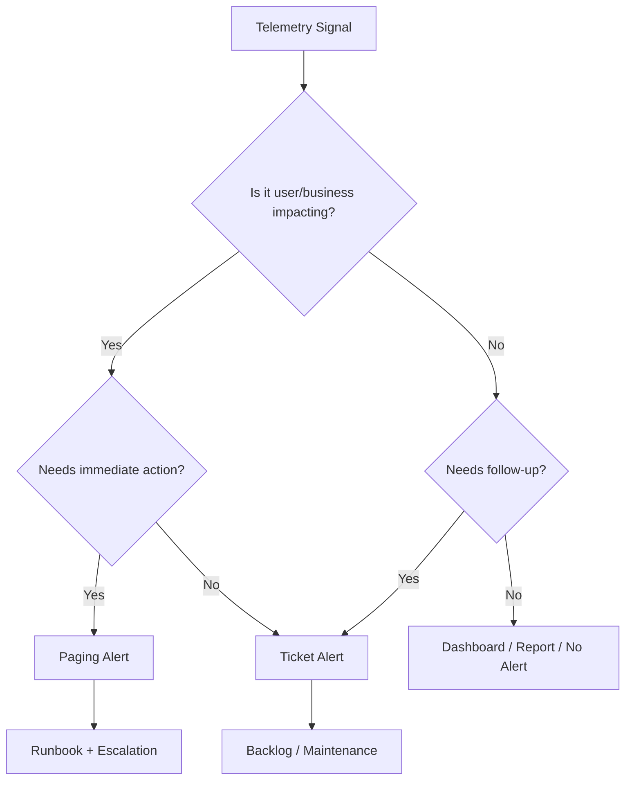
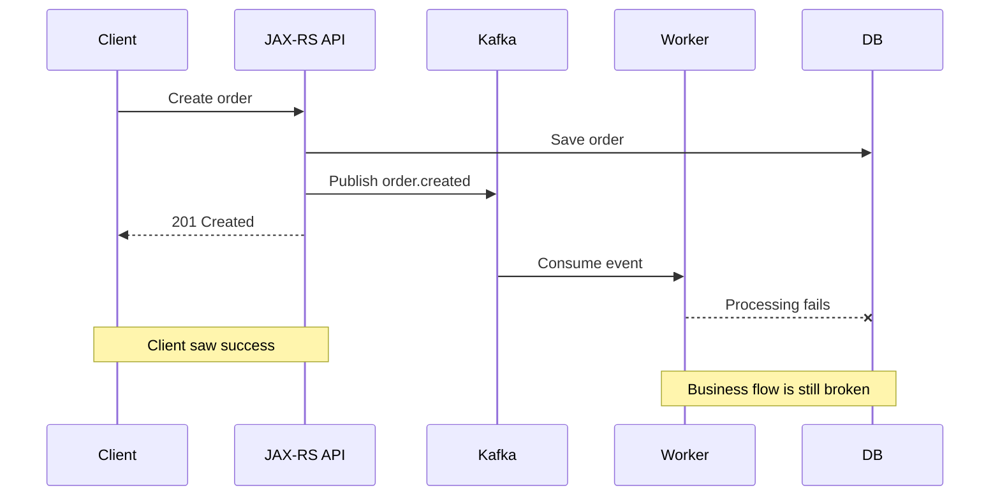
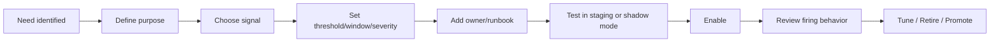
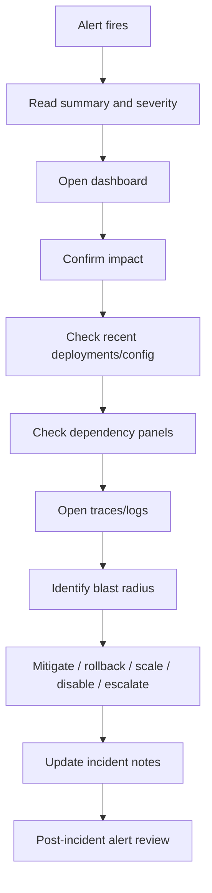

# Cheatsheet Observability Part 042 — Alerting Foundation

> Fokus part ini: memahami alert sebagai mekanisme aksi production, bukan sekadar notifikasi metric abnormal. Alert yang baik harus symptom-aware, actionable, owned, severity-aware, runbook-ready, dan cukup sensitif tanpa menciptakan alert fatigue.

---

## 1. Core Mental Model

Alert adalah **permintaan kepada manusia atau sistem untuk mengambil tindakan**.

Alert bukan:

- semua metric yang naik;
- semua log error;
- semua exception;
- semua anomaly;
- semua dashboard panel yang berubah warna.

Alert harus menjawab:

> “Ada kondisi production yang butuh aksi dalam jangka waktu tertentu. Siapa yang harus bertindak, seberapa cepat, dan apa langkah awalnya?”



Alerting is not about maximizing detection. It is about optimizing **reliable response**.

---

## 2. Alert Purpose

A production alert should exist for one of these reasons:

| Purpose | Example |
|---|---|
| Protect user experience | API error rate exceeds SLO. |
| Protect business workflow | Order fulfillment backlog exceeds threshold. |
| Protect data correctness | Reconciliation mismatch appears. |
| Protect security posture | Suspicious authentication failure spike. |
| Protect platform stability | Pod crash loop or DB pool exhaustion. |
| Protect reliability budget | SLO burn rate too high. |
| Trigger operational follow-up | Disk usage trending toward limit. |

If an alert does not map to a clear purpose, it probably should not page anyone.

---

## 3. Alert vs Dashboard vs Log Search

Not every signal deserves an alert.

| Tool | Best for |
|---|---|
| Alert | Forces attention and action. |
| Dashboard | Situational awareness and triage. |
| Log search | Detailed evidence and examples. |
| Trace search | Request-level causality and latency breakdown. |
| Report | Trend, governance, capacity planning. |
| Ticket | Non-urgent remediation. |

A common failure is converting every useful dashboard panel into an alert. That creates noise, not reliability.

---

## 4. Symptom-Based vs Cause-Based Alerts

### 4.1 Symptom-Based Alert

A symptom-based alert fires on user-visible or business-visible degradation.

Examples:

- API availability drops;
- API latency SLO burns too fast;
- quote creation error rate rises;
- order fulfillment lifecycle stuck rate rises;
- consumer lag causes event age beyond business threshold;
- checkout/quote/pricing synthetic journey fails.

Symptom alerts are usually better for paging because they represent impact.

### 4.2 Cause-Based Alert

A cause-based alert fires on a likely internal cause.

Examples:

- DB connection pool pending threads > 0;
- JVM heap usage high;
- Redis evictions increase;
- Kafka consumer lag increases;
- pod restarts spike;
- circuit breaker opens.

Cause alerts are useful, but can be noisy if they do not imply impact.

### 4.3 Practical Rule

Use symptom-based alerts for paging. Use cause-based alerts for:

- enrichment;
- routing;
- tickets;
- early warning;
- dashboard context;
- lower-severity notification.

Exception: if a cause reliably predicts imminent outage and requires immediate action, it can page.

---

## 5. Paging Alert, Ticket Alert, and Info Alert

### 5.1 Paging Alert

A paging alert interrupts someone now.

Use it when:

- user/business impact is active or imminent;
- immediate action can reduce impact;
- the alert has an owner;
- a runbook exists;
- the alert is rare enough to preserve trust.

Examples:

- elevated 5xx burn rate for critical API;
- order lifecycle processing stopped;
- PostgreSQL pool exhaustion causing request failures;
- Kafka event age above critical threshold for fulfillment topic;
- all pods unavailable.

### 5.2 Ticket Alert

A ticket alert creates follow-up work.

Use it when:

- issue is not immediately customer impacting;
- trend is concerning;
- remediation can happen during business hours;
- there is no need to wake someone.

Examples:

- log volume increased 30% after deployment;
- dashboard panel has stale metric;
- Redis memory trending upward;
- alert false positive rate too high;
- SLO burn was minor and recovered.

### 5.3 Info Alert

Info alerts should be rare. Many teams should avoid them entirely.

Use dashboard annotations or deployment markers instead of noisy info alerts.

Examples of better alternatives:

- deployment marker on dashboard;
- Slack notification for release completed;
- daily reliability report;
- weekly cost report.

---

## 6. Severity Model

Severity is not only technical severity. It combines:

- customer impact;
- business impact;
- data correctness risk;
- security/compliance risk;
- blast radius;
- urgency;
- reversibility;
- confidence.

Example severity model:

| Severity | Meaning | Expected response |
|---|---|---|
| SEV1 | Major customer/business impact, critical production flow broken | page immediately, incident commander, broad escalation |
| SEV2 | Significant degradation or partial outage | page owning team, triage quickly |
| SEV3 | Limited impact or degraded non-critical function | ticket or business-hours response |
| SEV4 | Maintenance/improvement/no immediate impact | backlog |

Internal severity definitions must be verified. Do not invent company policy.

---

## 7. Thresholds

Thresholds define when signal becomes alert.

Bad threshold:

```text
CPU > 80% for 1 minute
```

This may be noisy and not user-impacting.

Better threshold:

```text
API p95 latency above SLO for 10 minutes
AND request volume above minimum traffic floor
```

Better still:

```text
Latency SLO burn rate exceeds allowed error budget consumption
```

### Threshold Dimensions

When designing thresholds, consider:

- absolute threshold;
- relative baseline;
- time window;
- minimum traffic floor;
- severity mapping;
- business criticality;
- environment;
- maintenance windows;
- expected batch windows;
- dependency behavior;
- alert flapping risk.

---

## 8. Alert Window

Alert window determines how long a condition must hold before firing.

Short windows detect fast incidents but can be noisy.

Long windows reduce noise but delay detection.

| Window | Good for | Risk |
|---|---|---|
| 1–2 minutes | hard outage, pod unavailable, no traffic | noisy for transient spikes |
| 5–10 minutes | API error/latency degradation | may miss very fast failures |
| 30–60 minutes | backlog, capacity, slow burn | late detection |
| Multi-window | SLO burn rate | more complex |

Use time windows based on user impact and remediation urgency.

---

## 9. Burn Rate Alerts

Burn rate measures how quickly error budget is being consumed.

Instead of alerting on raw error rate, SLO-based alerting asks:

> “Are we consuming our allowed failure budget too quickly?”

Example:

- SLO: 99.9% availability over 30 days;
- error budget: 0.1%;
- high burn rate: current failures would exhaust budget quickly if sustained.

Burn rate alerts are useful because they connect telemetry to reliability targets.

Typical approach:

- fast burn alert for severe, fast-moving incidents;
- slow burn alert for sustained degradation;
- multiple windows to reduce false positives.

Do not copy burn-rate formulas blindly. Verify internal SLO platform, traffic profile, and business tolerance.

---

## 10. Minimum Traffic Floor

Low-traffic services need special care.

If a service receives 2 requests and 1 fails, error rate is 50%. That may not justify a page.

Use minimum traffic floors for ratio alerts:

```text
error_rate > threshold
AND request_count > minimum_count
```

For critical low-volume workflows, use event-specific alerts instead:

- no successful order completion for X minutes during expected processing window;
- reconciliation job failed;
- DLQ count increased;
- specific synthetic journey failed repeatedly.

---

## 11. Alert Noise

Alert noise is any alert that does not deserve the response it requests.

Common noise sources:

- threshold too sensitive;
- missing traffic floor;
- alert based on cause without impact;
- alert fires during deployment;
- alert fires during expected batch job;
- duplicate alerts from multiple layers;
- flaky synthetic check;
- dependency alert and service alert page different teams without deduplication;
- alert without owner;
- alert without runbook;
- alert that resolves before anyone can act.

Noise destroys trust. Once engineers stop trusting alerts, real incidents are missed.

---

## 12. Alert Fatigue

Alert fatigue is not just annoyance. It is a reliability risk.

Symptoms:

- engineers ignore alerts;
- alerts are auto-muted without review;
- on-call spends more time acknowledging than fixing;
- same alert fires repeatedly without action;
- incident starts with “this alert always fires”; 
- runbooks are stale;
- no one owns alert cleanup.

Alert fatigue must be treated as an operational defect.

Good teams review:

- top noisy alerts;
- alerts with no action taken;
- alerts that fire outside business impact;
- alerts that did not fire during incidents;
- alerts without runbook;
- alerts with wrong severity.

---

## 13. Alert Ownership

Every alert needs an owner.

Owner means:

- responsible for triage;
- responsible for runbook;
- responsible for threshold tuning;
- responsible for false positive review;
- responsible for retiring stale alert;
- responsible for escalation path.

An alert without owner is operational debt.

For dependency alerts, ownership can be tricky:

- service owner owns symptom alert;
- dependency owner owns dependency cause alert;
- platform team owns platform health alert;
- security team owns security alerts;
- domain/business ops may own business process alerts.

The dashboard and alert message should make ownership explicit.

---

## 14. Alert Label and Annotation Discipline

Alert metadata matters.

Useful labels:

- service;
- environment;
- region/site;
- severity;
- team/owner;
- dependency;
- operation;
- SLO name;
- alert category;
- runbook ID.

Useful annotations:

- summary;
- impact statement;
- suspected area;
- first triage steps;
- dashboard link;
- log search link;
- trace search link;
- runbook link;
- escalation path.

Bad alert message:

```text
High error rate
```

Better alert message:

```text
quote-order-api is burning availability error budget for POST /quotes.
5xx rate is above threshold for 10m in prod-eu.
Check service health dashboard, recent deployment marker, and downstream pricing dependency panel.
```

---

## 15. Java/JAX-RS Alert Candidates

For Java/JAX-RS service, common alert candidates include:

### 15.1 API Alerts

- high 5xx rate;
- high 4xx anomaly for critical endpoint;
- p95/p99 latency above SLO;
- no traffic when traffic is expected;
- sudden traffic spike beyond capacity;
- request timeout rate;
- endpoint-specific failure for critical business operation.

### 15.2 JVM Alerts

Use carefully. JVM alerts should usually support triage, not always page.

- repeated OOMKilled;
- heap near limit with GC pressure;
- long GC pauses affecting latency;
- thread deadlock detected;
- thread pool exhaustion;
- CPU throttling sustained;
- file descriptor exhaustion.

### 15.3 Dependency Alerts

- DB pool acquisition timeout;
- DB lock wait causing request failures;
- Redis error/latency affecting cache/lock/idempotency;
- Kafka consumer lag/event age beyond business threshold;
- RabbitMQ queue age/depth beyond threshold;
- Camunda incident/failed job spike;
- downstream HTTP timeout/error rate;
- circuit breaker open for critical dependency.

### 15.4 Business Alerts

- quote pricing failure rate;
- approval aging threshold breached;
- order stuck state count;
- fulfillment not progressing;
- fallout volume spike;
- reconciliation mismatch;
- cancellation/amendment failure rate.

Business alerts are powerful but must be carefully owned and severity-mapped.

---

## 16. Alerting for Async Systems

Async systems require different alert logic.

A request can succeed while downstream processing fails later.

Alert on:

- event age;
- consumer lag;
- DLQ growth;
- processing failure rate;
- retry exhaustion;
- stuck lifecycle state;
- workflow task aging;
- no successful processing over expected window.

Do not rely only on API success rate for async business flows.



Alerting must follow the lifecycle beyond the initial HTTP response.

---

## 17. Alert Deduplication

The same incident can trigger many alerts:

- service 5xx high;
- latency high;
- DB pool exhausted;
- pod CPU high;
- downstream timeout high;
- SLO burn high.

Without deduplication, on-call receives alert storm.

Deduplication strategies:

- group by service/environment/severity;
- route symptom alert as primary;
- attach cause alerts as context;
- suppress child alerts when parent incident active;
- use alert correlation in incident tooling;
- include dependency label for grouping;
- define paging hierarchy.

The goal is not to hide data. The goal is to avoid multiple pages for one operational reality.

---

## 18. Alert Suppression and Maintenance Windows

Suppression should be explicit and auditable.

Use suppression for:

- planned maintenance;
- deployment windows when expected;
- known dependency outage with active incident;
- noisy alert under active tuning;
- non-production environments.

Avoid indefinite silencing.

Every suppression should have:

- owner;
- reason;
- expiration;
- related ticket/incident;
- scope;
- review.

Silent failure because an alert was muted permanently is a governance failure.

---

## 19. Alert Correctness Concerns

Alert correctness means the alert represents reality accurately enough to drive action.

Failure modes:

| Failure mode | Example |
|---|---|
| False positive | Alert fires without meaningful impact. |
| False negative | Incident occurs but alert does not fire. |
| Wrong severity | Ticket-level issue pages engineer. |
| Wrong owner | Alert goes to team that cannot act. |
| Wrong scope | One pod issue appears as service outage. |
| Wrong label | Alert points to wrong endpoint/dependency. |
| Wrong window | Alert fires too early or too late. |
| Wrong aggregation | Regional issue hidden by global average. |

Alert review should include both alerts that fired and alerts that failed to fire.

---

## 20. Alerting and Privacy

Alert payloads often go to chat, incident tools, email, SMS, or mobile push.

Do not include:

- PII;
- access tokens;
- authorization headers;
- session IDs;
- raw request bodies;
- raw query strings with sensitive data;
- customer commercial data;
- full order/quote identifiers unless policy allows.

Use links to restricted dashboards/logs instead of embedding sensitive details in alert text.

Security-sensitive alerts must also be routed carefully.

---

## 21. Alerting and Cost

Alerts can increase observability cost indirectly:

- high-cardinality alert labels;
- expensive queries evaluated frequently;
- log-based alerts over massive volumes;
- per-customer/per-request alert series;
- many duplicate alert rules;
- synthetic checks too frequent;
- trace queries used as alert source.

Cost-aware alerting means:

- use pre-aggregated metrics where possible;
- avoid high-cardinality labels;
- choose sane evaluation intervals;
- use recording rules or equivalent where appropriate;
- periodically review expensive alert queries.

---

## 22. Alert Lifecycle

Alerts need lifecycle management.



Do not create alert rules and forget them.

Alert lifecycle should include:

- design;
- review;
- test;
- rollout;
- tuning;
- incident learning;
- retirement.

---

## 23. Internal Verification Checklist

Verify internally:

- alerting platform/tool used by the team;
- paging policy;
- severity definitions;
- escalation path;
- alert ownership model;
- alert naming convention;
- label/annotation standards;
- runbook requirement;
- dashboard link requirement;
- SLO/burn-rate alert support;
- maintenance/suppression policy;
- alert review cadence;
- top noisy alerts;
- alerts that fired during recent incidents;
- incidents where alert did not fire;
- business alerts for quote/order lifecycle;
- dependency alerts for PostgreSQL/Redis/Kafka/RabbitMQ/Camunda/downstream services;
- security/privacy rules for alert payloads;
- cost of alert queries.

---

## 24. PR Review Checklist

When reviewing changes that affect alerting, ask:

- What user/business symptom does this alert represent?
- Is it paging, ticket, or informational?
- Who owns it?
- What action should the responder take?
- Is there a runbook?
- Is there a dashboard link?
- Does it have a minimum traffic floor?
- Is the time window appropriate?
- Is severity correct?
- Could it create duplicate alerts?
- Could it fire during deployment or batch windows?
- Does it expose sensitive data?
- Does it use high-cardinality labels?
- Is it tested or shadowed before paging?
- How will false positives be reviewed?

---

## 25. Alert Design Mini-Checklist

A production alert should have:

- clear purpose;
- clear owner;
- clear severity;
- clear action;
- clear threshold/window;
- clear impact statement;
- dashboard link;
- runbook link;
- log/trace drilldown link where useful;
- deduplication/grouping behavior;
- suppression policy;
- privacy-safe payload;
- review cadence.

If one of these is missing, the alert may still be useful, but it is incomplete.

---

## 26. Common Alert Anti-Patterns

| Anti-pattern | Better approach |
|---|---|
| Alert on every ERROR log | Alert on user impact or error budget burn. |
| Alert on CPU alone | Alert on saturation plus latency/error impact. |
| Page on all dependency errors | Page on critical dependency impact or SLO burn. |
| No traffic floor | Add minimum request/event volume. |
| Raw customer/order labels | Use low-cardinality operation/outcome labels. |
| Alert without runbook | Add runbook or make it ticket-only. |
| Permanent mute | Use expiring suppression with owner. |
| Cause alerts page multiple teams | Use symptom primary plus cause enrichment. |
| Dashboard panel becomes alert automatically | Define action and severity first. |
| Alert never reviewed | Add review cadence and retirement process. |

---

## 27. Production Debugging Flow from Alert

When an alert fires:



If the alert does not tell the engineer where to begin, the alert is under-designed.

---

## 28. CPQ / Order Management Alert Examples

### Quote Pricing Error Budget Burn

Signal:

- quote pricing endpoint error rate;
- pricing downstream timeout;
- quote priced event rate drops.

Severity depends on:

- customer impact;
- quote creation criticality;
- workaround availability;
- affected tenant/region;
- duration.

### Order Fulfillment Stuck

Signal:

- orders in `FULFILLMENT_STARTED` state aging beyond threshold;
- fulfillment worker failure rate;
- Kafka/RabbitMQ lag;
- Camunda incidents.

This may not show as API 5xx. It still deserves alerting if business SLA is at risk.

### Approval Aging

Signal:

- approvals pending beyond expected time;
- human task queue aging;
- notification failure;
- workflow timer backlog.

This may be ticket-level or paging depending on business criticality.

---

## 29. Key Takeaways

- Alert exists to trigger action, not to report every anomaly.
- Symptom-based alerts are usually better paging alerts than cause-based alerts.
- Cause-based alerts are valuable as context, tickets, or early warnings.
- Severity must reflect customer/business impact, urgency, and reversibility.
- Alert noise is reliability debt.
- Every alert needs owner, runbook, dashboard, severity, and review cadence.
- Async business flows need alerts beyond HTTP success rate.
- SLO burn-rate alerting connects telemetry to reliability promises.
- Alert payloads must be privacy-safe and cardinality-safe.
- Alerts should improve after every incident.
