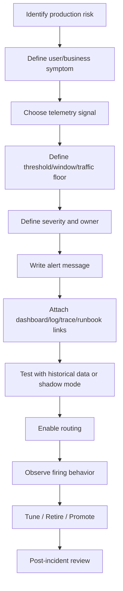
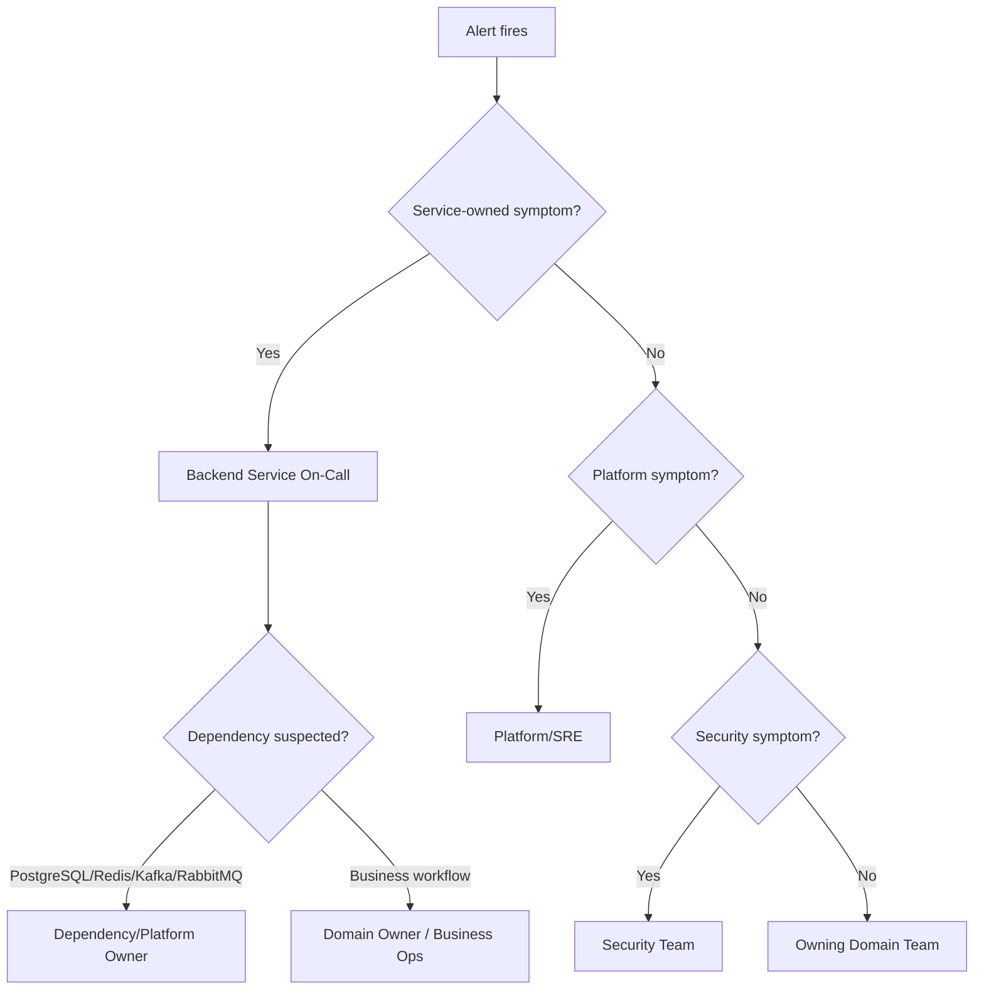

# Cheatsheet Observability Part 043 — Alert Design and Runbooks

> Fokus part ini: mengubah alert dari “notifikasi metric abnormal” menjadi **operational contract** yang jelas: siapa yang merespons, apa dampaknya, dashboard mana yang dibuka, query mana yang dipakai, tindakan awal apa yang aman, kapan eskalasi, dan bagaimana alert dievaluasi setelah incident.

---

## 1. Core Mental Model

Alert yang baik adalah **entry point ke proses incident/debugging**.

Alert harus mengurangi waktu untuk menjawab:

- apa yang rusak;
- siapa yang terdampak;
- seberapa parah;
- sejak kapan;
- di service/dependency mana;
- apakah ada deployment/config change;
- apa langkah mitigasi pertama;
- siapa yang harus dieskalasi;
- bukti apa yang harus dikumpulkan.

Alert buruk hanya berkata:

```text
High error rate
```

Alert baik berkata:

```text
quote-order-api availability SLO is burning for POST /quotes in prod-eu.
5xx rate is above threshold for 10 minutes with traffic above minimum floor.
Likely areas: pricing downstream timeout, DB pool wait, recent deployment.
Start with service dashboard, trace search by route, and runbook QO-API-AVAILABILITY.
```

Alert design is incident design.

---

## 2. Alert as an Operational Contract

Sebuah alert adalah kontrak antara telemetry system dan responder.

Kontrak itu berisi:

| Contract element | Question answered |
|---|---|
| Condition | Kapan alert fire? |
| Impact | Kenapa ini penting? |
| Owner | Siapa yang harus bertindak? |
| Severity | Seberapa cepat harus direspons? |
| Scope | Service, endpoint, region, tenant group, dependency mana? |
| Evidence | Signal apa yang mendukung alert? |
| Runbook | Langkah awal apa yang aman? |
| Escalation | Kapan dan ke siapa harus naik? |
| Resolution | Apa definisi pulih? |
| Review | Bagaimana alert dituning setelah kejadian? |

Tanpa kontrak ini, alert menjadi noise atau puzzle.

---

## 3. Alert Design Lifecycle



Alert tidak selesai saat rule dibuat. Alert selesai jika ia terbukti membantu response nyata.

---

## 4. Good Alert Properties

Alert production-grade harus punya kualitas berikut:

| Property | Meaning |
|---|---|
| Actionable | Ada tindakan awal yang jelas. |
| Owned | Ada team/service owner yang accountable. |
| Impact-aware | Menjelaskan user/business impact. |
| Severity-aware | Response urgency sesuai dampak. |
| Scoped | Menyebut service, endpoint, dependency, environment, region. |
| Evidence-backed | Berbasis metric/log/trace yang reliable. |
| Deduplicated | Tidak membuat storm untuk satu incident. |
| Privacy-safe | Tidak memuat PII/secrets/raw payload. |
| Cost-aware | Tidak memakai query mahal atau label high-cardinality. |
| Reviewable | Bisa dituning dari firing history dan incident review. |

Jika alert tidak actionable, biasanya lebih cocok menjadi dashboard panel, ticket, atau report.

---

## 5. Alert Message Anatomy

Alert message harus dibaca oleh engineer yang mungkin:

- sedang on-call;
- belum familiar dengan service;
- baru bangun tidur;
- berada di incident bridge;
- perlu mengambil keputusan cepat.

Struktur pesan alert yang baik:

```text
[Severity] [Environment] [Service] [Symptom]

Impact:
What changed:
Scope:
Current evidence:
Likely first checks:
Runbook:
Dashboard:
Escalation:
```

Contoh:

```text
[SEV2] [prod-eu] quote-order-api availability degradation

Impact:
POST /quotes is returning elevated 5xx. Quote creation may fail for customers.

What changed:
5xx burn rate exceeded threshold for 10m. Traffic floor satisfied.

Scope:
service=quote-order-api, route=POST /quotes, region=eu, environment=prod

Current evidence:
request_rate=240/min, error_rate=6.2%, p95_latency=2.8s

Likely first checks:
1. Open service health dashboard.
2. Check recent deployment markers.
3. Check downstream pricing and PostgreSQL pool panels.
4. Search traces for failed POST /quotes.

Runbook:
QO-RB-001 API Availability Burn

Escalation:
Backend on-call -> Platform/SRE if Kubernetes or DB pool issue -> Domain owner if business workflow impact unclear.
```

---

## 6. Alert Summary vs Detail

Alert summary harus pendek dan tegas.

Detail boleh panjang, tetapi harus terstruktur.

Bad summary:

```text
API issue
```

Better summary:

```text
quote-order-api POST /quotes is burning availability SLO in prod-eu
```

Bad detail:

```text
Please check logs.
```

Better detail:

```text
Start with service health dashboard. Confirm error scope by route/status. Then inspect traces with http.route=POST /quotes and status=ERROR. Check recent deployment/config markers and pricing dependency timeout panel.
```

---

## 7. Labels and Annotations

Alert labels are for routing, grouping, and filtering.

Alert annotations are for human explanation.

### 7.1 Recommended Labels

Use stable, low-cardinality labels:

- `service`;
- `environment`;
- `region` or `site`;
- `team`;
- `severity`;
- `category`;
- `slo`;
- `route_template`;
- `dependency`;
- `operation`;
- `platform`.

Avoid high-cardinality labels:

- `request_id`;
- `trace_id`;
- `span_id`;
- `user_id`;
- `order_id`;
- `quote_id`;
- raw URL path;
- raw error message;
- raw SQL;
- raw message key.

### 7.2 Recommended Annotations

Useful annotations:

- `summary`;
- `impact`;
- `current_value`;
- `threshold`;
- `window`;
- `dashboard_url`;
- `runbook_url`;
- `log_query`;
- `trace_query`;
- `owner`;
- `escalation_path`;
- `first_steps`;
- `known_false_positive_conditions`.

Annotations can include links and instructions. Labels should remain clean and stable.

---

## 8. Dashboard Link Discipline

Every actionable alert should link to the right dashboard.

Not just “Grafana home” or “monitoring portal”.

Good dashboard link behavior:

- scoped to service;
- scoped to environment;
- scoped to region/site;
- includes alert time range;
- includes deployment markers;
- includes dependency panels;
- includes logs/traces drilldown where supported.

A useful alert should reduce click-path length.

Bad:

```text
Dashboard: https://monitoring.example.com
```

Better:

```text
Dashboard: Service Health / quote-order-api / prod-eu / last 1h
```

Internal tooling may generate links differently. Verify actual dashboard URL conventions.

---

## 9. Log and Trace Drilldown Links

For Java/JAX-RS systems, alert should often include query hints.

Example log query dimensions:

```text
service="quote-order-api"
environment="prod"
level="ERROR"
http.route="POST /quotes"
correlation_id exists
```

Example trace query dimensions:

```text
service.name="quote-order-api"
http.route="POST /quotes"
span.status="ERROR"
time_range="alert window +/- 15m"
```

Example dependency trace query:

```text
service.name="quote-order-api"
db.system="postgresql"
db.operation="SELECT"
span.duration > 1s
```

Do not embed sensitive examples with real customer data in alert text.

---

## 10. Runbook as Response Interface

Runbook is not documentation for documentation’s sake.

Runbook is the **response interface** between alert and engineer.

A runbook should answer:

- What does this alert mean?
- What is the likely impact?
- What should I check first?
- What dashboards should I open?
- What logs/traces should I query?
- What safe mitigations exist?
- What actions are dangerous?
- When should I escalate?
- How do I know it recovered?
- What evidence should I preserve for RCA?

If the runbook does not change responder behavior, it is not useful.

---

## 11. Minimal Runbook Template

```md
# Runbook: <Alert Name>

## Purpose
Explain what production risk this alert represents.

## Impact
Describe possible customer/business/system impact.

## Scope
Service, endpoint, region, dependency, workflow, environment.

## First Checks
1. Open dashboard X.
2. Check recent deployment/config changes.
3. Check dependency panels.
4. Inspect logs/traces using query Y.

## Common Causes
- Cause 1
- Cause 2
- Cause 3

## Safe Mitigations
- Rollback deployment
- Disable feature flag
- Scale worker
- Pause/retry consumer
- Increase pool only if approved
- Escalate to dependency owner

## Dangerous Actions
- Deleting messages without replay plan
- Restarting all pods without understanding queue processing
- Increasing timeout blindly
- Enabling DEBUG logs globally in production

## Escalation
Who to contact and when.

## Recovery Criteria
Metric/log/trace/business signal that confirms recovery.

## Evidence for RCA
What screenshots, queries, IDs, timelines, deployment markers, and incident notes to preserve.

## Known False Positives
Document known noisy conditions and how to distinguish them.

## Related Dashboards / Queries / Docs
Links.
```

---

## 12. Runbook for Java/JAX-RS API Alert

For a JAX-RS API availability or latency alert, runbook should include:

### First Checks

- service health dashboard;
- route-level request rate/error/latency;
- status code distribution;
- recent deployment marker;
- pod restart/OOMKilled;
- JVM heap/GC/thread pool;
- DB connection pool;
- downstream HTTP dependency;
- Kafka/RabbitMQ publishing failure;
- Redis latency/error;
- trace samples for failing requests;
- error logs grouped by error code/exception type.

### Safe Mitigations

- rollback recent deployment;
- disable problematic feature flag;
- reduce traffic if gateway supports it;
- scale horizontally if saturation-bound;
- fail open/closed based on business rule;
- escalate to DB/platform/dependency owner.

### Dangerous Actions

- raising thread pool limit without understanding DB pool;
- increasing timeout without checking retry amplification;
- enabling full body logging;
- clearing caches blindly;
- replaying messages without idempotency validation.

---

## 13. Runbook for Dependency Alert

Dependency alert runbook should distinguish:

- dependency is unhealthy;
- service integration is misconfigured;
- timeout is too aggressive;
- retry policy is amplifying load;
- pool saturation is local;
- network path is degraded;
- specific route/operation is affected;
- downstream changed contract;
- auth/credential/config expired.

For PostgreSQL:

- connection pool active/idle/pending;
- slow query;
- lock wait;
- deadlock;
- transaction duration;
- connection errors;
- migration/deployment marker.

For Redis:

- latency;
- evictions;
- memory;
- blocked clients;
- command rate;
- cache hit/miss;
- key privacy issue in logs.

For Kafka/RabbitMQ:

- lag/queue depth;
- event age;
- retry/DLQ;
- unacked messages;
- redelivery loop;
- poison message;
- consumer deployment status.

---

## 14. Runbook for Async Business Flow Alert

Async business flow alert is different from API alert.

A customer may receive `201 Created`, but the order may later get stuck.

Runbook should include:

- business lifecycle dashboard;
- stuck state count;
- state aging distribution;
- Kafka/RabbitMQ lag/queue age;
- worker failure rate;
- DLQ/retry count;
- Camunda failed jobs/incidents;
- reconciliation output;
- audit event presence;
- idempotency/duplicate event signal;
- replay procedure;
- manual intervention path.

Example alert:

```text
Orders are aging in FULFILLMENT_STARTED beyond business threshold.
API availability may look healthy. Check fulfillment worker, message lag, Camunda incidents, and downstream fulfillment dependency.
```

---

## 15. Customer Impact Hint

Alert should help responder estimate impact quickly.

Useful impact hints:

- affected endpoint;
- affected workflow;
- affected region/site;
- affected tenant group if allowed;
- request volume;
- error count;
- order/quote count if policy allows;
- business SLA at risk;
- duration;
- whether workaround exists.

Avoid exposing raw sensitive customer identifiers in alert payload.

Better:

```text
Impact: Quote creation may fail for customers in prod-eu. About 6% of POST /quotes requests failed during the last 10m.
```

Not ideal:

```text
Customer ABC Corp quote 981273981 failed with payload ...
```

Put sensitive drilldown behind access-controlled dashboard/log tools.

---

## 16. Escalation Path

Escalation path should be explicit.

Typical routing model:



Do not invent internal escalation policy. Verify actual team routing and on-call ownership.

---

## 17. Alert Routing

Routing should use stable labels.

Common routing dimensions:

- service owner;
- environment;
- severity;
- region/site;
- alert category;
- dependency owner;
- security domain;
- business domain.

Routing anti-patterns:

- route by raw error message;
- route by customer ID;
- route by request ID;
- route all alerts to one shared noisy channel;
- route dependency symptom to service team only;
- route service symptom to platform team only;
- no routing for non-production noise.

---

## 18. Alert Deduplication Design

Deduplication must be designed, not accidental.

A single DB outage may trigger:

- API 5xx alert;
- latency alert;
- DB pool alert;
- Kafka consumer failure alert;
- workflow stuck alert;
- SLO burn alert;
- pod restart alert.

Dedup strategy:

- group by `environment`, `service`, `severity`, `category`;
- make symptom alert primary;
- attach cause alerts as context;
- suppress lower-severity alerts during major incident;
- avoid paging multiple teams for same symptom unless needed;
- include dependency label for correlation;
- use incident tool grouping if available.

The goal is fewer pages, not less evidence.

---

## 19. Alert Suppression

Suppression should be intentional and time-bound.

Good suppression metadata:

- owner;
- reason;
- start time;
- end time;
- affected alerts;
- related deployment/ticket/incident;
- approval if required;
- review after expiration.

Bad suppression:

```text
Mute this forever because it is noisy.
```

Better:

```text
Suppress alert QO-API-LATENCY for staging only until 2026-07-15 due to load-test noise. Owner: platform-observability. Ticket: OBS-1234.
```

Permanent suppression is usually alert debt, not a fix.

---

## 20. False Positive Handling

False positive means alert requested more urgency than reality required.

Do not just silence it. Classify why it fired.

Common causes:

| Cause | Fix |
|---|---|
| Missing traffic floor | Add minimum volume condition. |
| Window too short | Increase window or use multi-window. |
| Cause alert without impact | Downgrade to ticket or dashboard. |
| Expected batch behavior | Add schedule-aware logic. |
| Deployment noise | Add deployment-aware suppression or threshold. |
| Bad aggregation | Segment by region/route/dependency. |
| Flaky synthetic probe | Require multiple failures or multi-region confirmation. |
| Wrong severity | Reclassify and update routing. |

False positives should become tuning work.

---

## 21. False Negative Handling

False negative means incident happened but alert did not fire.

This is often more dangerous than false positive.

Ask:

- Was the signal missing?
- Was the threshold too loose?
- Was the time window too long?
- Was the metric wrong?
- Was traffic below floor?
- Was sampling hiding the issue?
- Was the failure in async lifecycle not API layer?
- Was the dashboard showing it but no alert existed?
- Was alert suppressed?
- Was routing broken?

Every incident review should include:

> “Which alert should have fired earlier?”

---

## 22. Testing Alerts

Alert rules should be tested where possible.

Testing approaches:

- replay historical metric data;
- use staging environment;
- shadow mode without paging;
- synthetic failure injection;
- canary alert rule;
- validate dashboard/runbook links;
- validate routing labels;
- validate suppression behavior;
- validate no sensitive data in payload.

For Java/JAX-RS service:

- simulate 5xx spike;
- simulate latency spike;
- simulate DB pool wait;
- simulate downstream timeout;
- simulate Kafka/RabbitMQ backlog;
- simulate Redis latency;
- simulate pod restart/OOMKilled;
- simulate trace/log missing correlation.

---

## 23. Alert Review Cadence

Alerts need scheduled review.

Review should look at:

- top noisy alerts;
- alerts with no action taken;
- alerts without runbook;
- alerts without owner;
- alerts with stale dashboard links;
- alerts with wrong severity;
- alerts that fired during maintenance;
- alerts that did not fire during incident;
- alerts with expensive queries;
- alerts with privacy risk;
- alerts for retired service/endpoint;
- alert fatigue feedback from on-call.

Review is not bureaucracy. It is how alerting remains trustworthy.

---

## 24. Runbook Drift

Runbooks drift when:

- service architecture changes;
- dependency changes;
- dashboard URLs change;
- metric names change;
- team ownership changes;
- deployment process changes;
- mitigation procedure changes;
- incident learnings are not captured.

Runbook drift is dangerous because it creates false confidence.

Runbook should be updated after:

- major incident;
- new alert;
- service ownership change;
- telemetry schema change;
- dependency migration;
- platform migration;
- SLO change;
- release process change.

---

## 25. Alert Design for SLO Burn

SLO burn alerts need extra clarity.

They should mention:

- SLO name;
- SLI being violated;
- burn rate;
- time window;
- error budget remaining if available;
- affected service/route/workflow;
- impact statement;
- dashboard link;
- runbook link;
- severity mapping.

Bad:

```text
High burn rate
```

Better:

```text
quote-order-api availability SLO fast-burn alert.
POST /quotes 5xx failures are consuming error budget too quickly over 5m and 1h windows.
This may affect quote creation. Start with QO API Availability dashboard and trace failed requests.
```

---

## 26. Alert Design for Business Workflow

Business workflow alerts should avoid being too technical.

Example fields:

- workflow name;
- lifecycle state;
- aging threshold;
- stuck count;
- expected completion time;
- affected business capability;
- downstream process at risk;
- owning team;
- business ops contact if needed.

Example:

```text
Order fulfillment aging threshold breached.
42 orders have been in FULFILLMENT_STARTED longer than 30 minutes in prod.
Check fulfillment worker, message lag, Camunda incidents, and downstream fulfillment API.
```

Business alerts need strong ownership. Otherwise engineers see them as ambiguous operational noise.

---

## 27. Alert Design for Data Correctness

Some alerts are not about availability or latency.

They protect correctness:

- reconciliation mismatch;
- duplicate event processing;
- missing audit event;
- invalid state transition;
- outbox event not published;
- order status inconsistent across systems;
- stale read beyond freshness target;
- workflow completed without required side effect.

Correctness alerts need careful severity mapping.

A small mismatch may be ticket-level. A billing/order correctness issue may be SEV-level.

---

## 28. Alerting and Privacy

Alert payloads can travel to:

- chat;
- email;
- mobile push;
- SMS;
- incident tools;
- third-party notification systems.

Therefore alert payload should not contain:

- PII;
- access tokens;
- cookies;
- authorization headers;
- full request/response bodies;
- raw query strings;
- raw SQL with parameters;
- customer commercial terms;
- unrestricted quote/order identifiers unless policy allows.

Use privacy-safe summaries and restricted drilldown links.

---

## 29. Alerting and Cost

Alert queries can be expensive.

Cost risks:

- frequent log scans;
- high-cardinality metric labels;
- per-tenant alert rules;
- per-endpoint unbounded labels;
- raw path labels;
- trace-query-based alerts;
- synthetic checks too frequent;
- duplicate rules for same symptom;
- alert evaluations over long retention windows.

Cost controls:

- alert on metrics, not raw logs, when possible;
- pre-aggregate expensive signals;
- use recording rules or equivalent;
- avoid high-cardinality labels;
- define evaluation intervals intentionally;
- review expensive alerts.

---

## 30. Internal Verification Checklist

Verify internally:

- alerting platform used by team;
- alert rule storage location;
- alert ownership convention;
- label/annotation standard;
- severity model;
- paging vs ticket routing;
- runbook template;
- dashboard link convention;
- log/trace drilldown convention;
- escalation path;
- maintenance window/suppression process;
- deduplication/grouping behavior;
- false positive review process;
- false negative review process;
- alert review cadence;
- SLO burn-rate alert support;
- business workflow alert ownership;
- security/privacy policy for alert payload;
- cost review for alert queries;
- historical incidents where alert helped;
- historical incidents where alert failed;
- top noisy alerts;
- stale alerts for retired endpoints/services.

---

## 31. PR Review Checklist

When reviewing a PR that adds or changes alerting, ask:

- What production risk does this alert represent?
- Is the alert symptom-based, cause-based, or business-flow-based?
- Is it paging, ticket, or informational?
- Who owns it?
- Is severity justified?
- What is the impact statement?
- Is the threshold/window correct?
- Is there a traffic floor where needed?
- Is the aggregation correct by service/route/region/dependency?
- Is there a runbook link?
- Is there a dashboard link?
- Are log/trace drilldown hints available?
- Does routing use stable labels?
- Could it duplicate another alert?
- Could it fire during expected batch/deployment windows?
- Is suppression behavior defined?
- Does it expose sensitive data?
- Does it use high-cardinality labels?
- Is query cost acceptable?
- How will the alert be tested?
- How will false positives be reviewed?

---

## 32. Common Anti-Patterns

| Anti-pattern | Better approach |
|---|---|
| Alert without runbook | Add runbook or make it non-paging. |
| Alert says “check logs” | Provide concrete log/trace query hints. |
| Alert with no owner | Assign service/team ownership before enabling. |
| Alert on cause only | Prefer symptom alert for paging, cause as context. |
| No dashboard link | Link directly to scoped dashboard. |
| Raw customer data in alert | Use privacy-safe summary and restricted link. |
| High-cardinality labels | Use stable route/operation/dependency labels. |
| Permanent mute | Use expiring suppression with owner and reason. |
| Runbook never updated | Add post-incident runbook review. |
| All alerts same severity | Map severity to impact, urgency, and reversibility. |

---

## 33. Practical Alert Design Checklist

A production alert is ready when it has:

- clear condition;
- clear impact;
- clear owner;
- clear severity;
- clear scope;
- clear action;
- clear dashboard link;
- clear runbook link;
- clear escalation path;
- clear grouping/dedup behavior;
- privacy-safe payload;
- cardinality-safe labels;
- acceptable query cost;
- test or shadow validation;
- review plan.

If an alert cannot meet these, it may still be useful as a dashboard panel or ticket, but it should not page.

---

## 34. Key Takeaways

- Alert design is incident-response design.
- Alert message must reduce cognitive load during pressure.
- Runbook is the response interface for the alert.
- Labels route and group alerts; annotations explain them to humans.
- Every alert needs owner, severity, impact statement, dashboard, and runbook.
- Business workflow alerts are essential for async CPQ/order management flows.
- False positives create fatigue; false negatives create blind spots.
- Alert payloads must be privacy-safe and cost-aware.
- Every serious incident should improve at least one alert, dashboard, runbook, or SLO.
