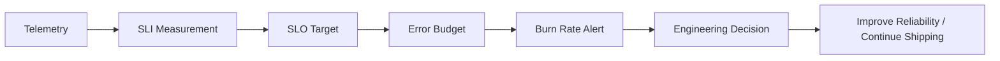
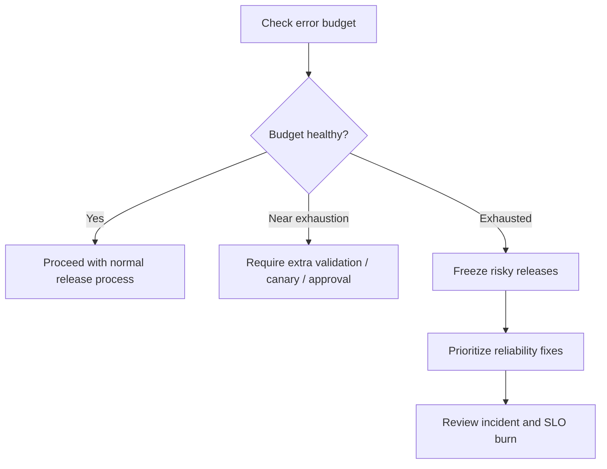

# Cheatsheet Observability Part 044 — SLI, SLO, SLA, and Error Budget

> Fokus part ini: memahami reliability target dari sudut pandang senior backend engineer. SLI/SLO/SLA/error budget bukan sekadar istilah SRE; ini adalah cara mengubah telemetry menjadi keputusan engineering: kapan harus page, kapan harus rollback, kapan harus freeze release, kapan harus memperbaiki reliability, dan kapan error masih dalam toleransi bisnis.

---

## 1. Core Mental Model

Observability menjawab:

> “Apa yang sedang terjadi di production?”

SLO menjawab:

> “Apakah production cukup baik menurut janji reliability yang kita pilih?”

Error budget menjawab:

> “Berapa banyak kegagalan yang masih boleh terjadi sebelum kita harus mengubah prioritas engineering?”



SLO bukan tentang mencapai 100%. SLO adalah tentang memilih batas reliability yang meaningful, measurable, dan economically sane.

---

## 2. Definitions

### 2.1 SLI — Service Level Indicator

SLI adalah ukuran reliability yang dihitung dari telemetry.

Examples:

- percentage of successful HTTP requests;
- percentage of requests below latency threshold;
- percentage of orders completed within SLA window;
- percentage of Kafka events processed before max age;
- percentage of reconciliation jobs without mismatch;
- percentage of audit events persisted successfully.

SLI is measurement.

### 2.2 SLO — Service Level Objective

SLO adalah target untuk SLI.

Examples:

```text
99.9% of POST /quotes requests should complete successfully over 30 days.
95% of quote pricing requests should complete under 800ms over 7 days.
99% of order.created events should be processed within 5 minutes over 30 days.
```

SLO is engineering objective.

### 2.3 SLA — Service Level Agreement

SLA adalah komitmen formal, biasanya eksternal atau contractual.

SLA bisa memiliki konsekuensi legal, financial, commercial, or contractual.

Do not invent SLA from internal SLO. Verify with product, legal, customer contract, and internal policy.

### 2.4 Error Budget

Error budget adalah jumlah failure yang diperbolehkan oleh SLO.

If SLO is `99.9%`, error budget is `0.1%`.

If service receives 10,000,000 valid requests in a 30-day window, allowed bad requests are:

```text
10,000,000 * 0.001 = 10,000 bad requests
```

Error budget is permission to fail within a controlled boundary.

---

## 3. SLI vs Metric

Metric is raw or aggregated telemetry.

SLI is a carefully defined reliability measurement.

| Metric | Possible SLI |
|---|---|
| HTTP request count by status | Successful request ratio. |
| HTTP latency histogram | Percentage below latency threshold. |
| Kafka consumer lag | Percentage of events processed before max age. |
| Camunda incident count | Workflow completion success ratio. |
| DB query latency | Dependency latency contribution to API SLO. |
| Reconciliation mismatch count | Correctness success ratio. |

Not every metric is an SLI. SLI should represent user/business-relevant reliability.

---

## 4. Why SLO Exists

Without SLO, teams argue using vague language:

- “API is slow.”
- “Errors are high.”
- “System is unstable.”
- “This incident was bad.”
- “We need more reliability.”

With SLO, the discussion becomes measurable:

- which user journey is affected;
- which SLI is violated;
- how much error budget remains;
- whether alert should page;
- whether release velocity should slow;
- whether reliability work should be prioritized;
- whether the service is meeting customer/business expectations.

SLO turns observability into engineering governance.

---

## 5. Good SLI Properties

A good SLI is:

| Property | Meaning |
|---|---|
| User-relevant | Measures something users/business care about. |
| Measurable | Can be computed from reliable telemetry. |
| Bounded | Has clear numerator and denominator. |
| Owned | A team can improve it. |
| Actionable | Violation leads to engineering decision. |
| Stable | Not overly sensitive to noise. |
| Comparable | Can be tracked over time. |
| Auditable | Definition can be reviewed and explained. |

Bad SLI:

```text
CPU should be low.
```

Better SLI:

```text
99.5% of quote creation requests should return non-5xx within 1 second over 30 days.
```

CPU may explain failure, but it rarely represents user-visible reliability directly.

---

## 6. Request-Based vs Window-Based SLI

### 6.1 Request-Based SLI

Request-based SLI measures good events divided by total valid events.

Formula:

```text
SLI = good_events / valid_events
```

Example:

```text
good = HTTP requests with status < 500 and latency < 1s
total = all valid HTTP requests to POST /quotes
```

This is useful for APIs.

### 6.2 Window-Based SLI

Window-based SLI measures good time windows divided by total windows.

Example:

```text
A 1-minute window is good if p95 latency < 1s and error rate < 1%.
SLO = 99% good windows over 30 days.
```

This is useful when request volume is uneven or batch-oriented.

### 6.3 Event-Based SLI

Event-based SLI is useful for async systems.

Example:

```text
good = order.created events processed successfully within 5 minutes
total = valid order.created events published
```

For CPQ/order management, event-based and workflow-based SLIs are often more meaningful than pure HTTP SLIs.

---

## 7. Availability SLO

Availability SLO measures whether operations succeed.

API availability example:

```text
99.9% of valid POST /quotes requests return non-5xx over 30 days.
```

Important design choices:

- Which endpoints are included?
- Are 4xx counted as failure?
- Are client cancellations counted?
- Are validation errors counted?
- Are dependency timeouts counted?
- Are retries counted once or multiple times?
- Are internal calls included?
- Is denominator traffic-filtered?

For JAX-RS service, define availability by route template, not raw path.

Good label:

```text
http.route="POST /quotes"
```

Dangerous label:

```text
http.target="/quotes/quote-123/customer/abc"
```

---

## 8. Latency SLO

Latency SLO measures whether operations complete within acceptable time.

Example:

```text
95% of quote pricing requests complete under 800ms over 7 days.
```

Design choices:

- p95, p99, or request ratio below threshold?
- end-to-end latency or service-only latency?
- include downstream dependency time?
- include queue time?
- include client network time?
- include retries?
- separate read/write endpoints?
- separate synchronous and async workflows?

For production alerting, ratio-based latency SLI is often more SLO-friendly than percentile-only thinking:

```text
good = requests with latency <= 1s
total = valid requests
SLI = good / total
```

Percentiles are useful on dashboards, but SLO math usually needs good/bad event classification.

---

## 9. Correctness SLO

Correctness SLO measures whether the system produced the right outcome.

This is harder than availability and latency, but often more important in enterprise systems.

Examples:

```text
99.99% of accepted orders must have a corresponding order audit event.

99.9% of completed fulfillment workflows must end in a valid terminal state.

99.99% of reconciliation checks must match expected quote/order state.
```

Correctness SLIs need domain evidence:

- audit logs;
- state transition records;
- reconciliation results;
- workflow completion state;
- idempotency records;
- outbox/inbox tables;
- business event stream.

Availability says “request succeeded”. Correctness says “the system did the right thing”.

---

## 10. Freshness SLO

Freshness SLO measures whether data or processing is up to date.

Examples:

```text
99% of order status updates should be visible to downstream consumers within 2 minutes.

99% of catalog updates should be reflected in quote pricing within 10 minutes.

99% of Kafka events should have event_age < 5 minutes when consumed.
```

Freshness is critical for:

- event-driven systems;
- cache invalidation;
- catalog-driven pricing;
- search indexes;
- reporting projections;
- workflow state propagation;
- integration with downstream systems.

Freshness failures may not produce API errors, but they create stale business decisions.

---

## 11. Durability SLO

Durability SLO measures whether accepted data is not lost.

Examples:

```text
100% of accepted quote creation commands must persist quote record or return failure.

99.999% of committed outbox events must be published or remain retryable.

100% of audit events for critical business actions must be persisted.
```

Durability concerns:

- database commit;
- transaction boundary;
- outbox pattern;
- message broker publish confirm;
- retryable failure;
- DLQ handling;
- audit persistence;
- backup/restore;
- reconciliation.

For business-critical systems, durability target may be stricter than latency target.

---

## 12. Queue Lag and Event Age SLO

Queue lag alone is not always business meaningful.

Better SLO often uses event age or processing deadline.

Kafka example:

```text
99% of order.created events are consumed and processed within 5 minutes over 30 days.
```

RabbitMQ example:

```text
99% of fulfillment task messages are acknowledged successfully within 2 minutes of publish time.
```

Metric candidates:

- consumer lag;
- queue depth;
- event age;
- message age;
- processing latency;
- retry count;
- DLQ count;
- successful processing count;
- failed processing count.

For business SLO, event age is often more intuitive than raw lag.

---

## 13. Workflow Completion SLO

Workflow completion SLO is important for Camunda/human workflow/domain lifecycle.

Examples:

```text
99% of automatic order validation workflows complete within 10 minutes.

95% of approval tasks are completed or escalated within 1 business day.

99.5% of fulfillment workflows reach terminal state within 30 minutes after order submission.
```

Design choices:

- start event;
- end event;
- terminal states;
- excluded states;
- manual intervention handling;
- business calendar vs wall-clock time;
- retry behavior;
- SLA pause/resume logic;
- tenant/customer segmentation if allowed.

Workflow SLO should match business lifecycle, not just engine uptime.

---

## 14. SLA vs SLO Boundary

SLO is internal engineering target.

SLA is formal agreement.

Never assume:

```text
Internal SLO == Customer SLA
```

SLA may include:

- contractual uptime;
- support response time;
- maintenance windows;
- exclusions;
- penalties;
- region/customer-specific terms;
- reporting obligations;
- legal/commercial definitions.

As a backend engineer, treat SLA as externally governed. Verify with product, legal, customer success, support, or internal reliability documentation.

---

## 15. Error Budget

Error budget is the allowed unreliability.

Formula:

```text
error_budget = 1 - SLO_target
```

For `99.9%` SLO:

```text
error_budget = 0.1%
```

If total valid requests = 20,000,000 per 30 days:

```text
allowed_bad_events = 20,000,000 * 0.001 = 20,000
```

If bad events already = 15,000:

```text
remaining_budget = 5,000 bad events
```

Error budget connects reliability to release decision.

---

## 16. Error Budget Policy

Teams may use error budget to guide decisions:

| Budget state | Possible decision |
|---|---|
| Healthy budget | Continue feature delivery. |
| Burning faster than expected | Investigate reliability risk. |
| Nearly exhausted | Prioritize reliability fixes. |
| Exhausted | Freeze risky releases or require approval. |
| Repeatedly exhausted | Architecture or operational investment needed. |

Do not invent internal policy. Verify whether the organization uses error budget formally.

Even without formal policy, error budget thinking helps engineering trade-offs.

---

## 17. Burn Rate

Burn rate measures how quickly the error budget is being consumed.

Informal interpretation:

```text
burn_rate = current_failure_rate / allowed_failure_rate
```

If allowed failure rate is `0.1%` and current failure rate is `1%`:

```text
burn_rate = 1.0 / 0.1 = 10x
```

A 10x burn means the service is consuming error budget 10 times faster than planned.

Burn rate alerts are useful because they combine:

- severity;
- duration;
- SLO target;
- actual failure rate;
- reliability impact.

---

## 18. Fast Burn vs Slow Burn

Fast burn alert:

- detects severe impact quickly;
- shorter window;
- pages on-call;
- used for active incident.

Slow burn alert:

- detects sustained degradation;
- longer window;
- may create ticket or lower-severity page;
- used for trend or chronic reliability issue.

Example:

| Alert type | Meaning |
|---|---|
| Fast burn | Error budget could be exhausted quickly if issue continues. |
| Slow burn | Error budget is being consumed too fast over longer period. |

Multi-window alerts reduce noise by requiring short-term and longer-term evidence.

---

## 19. SLO and Alerting Relationship

Alerting should not be detached from SLO.

Bad alert:

```text
error_rate > 5% for 1m
```

Better alert:

```text
availability SLO burn rate exceeds paging threshold over 5m and 1h windows
```

Why better:

- tied to reliability promise;
- less arbitrary;
- supports severity mapping;
- easier to explain to incident stakeholders;
- aligns with error budget policy.

Not every alert must be SLO-based, but critical user-facing paging alerts should often be SLO-aware.

---

## 20. SLO for Java/JAX-RS API

Example service: `quote-order-api`.

### Availability SLI

```text
good = valid requests to critical routes with HTTP status < 500
total = valid requests to critical routes
SLI = good / total
```

Routes:

- `POST /quotes`;
- `GET /quotes/{id}`;
- `POST /orders`;
- `GET /orders/{id}`;
- `POST /orders/{id}/cancel`;
- `POST /orders/{id}/amend`.

### Latency SLI

```text
good = valid POST /quotes requests completed under 1s
total = valid POST /quotes requests
```

### Error Classification

Usually count as bad:

- 5xx;
- timeout;
- dependency failure mapped to server error;
- unhandled exception;
- request canceled due to server slowness if measurable.

Usually not counted as service failure:

- validation 400;
- unauthorized 401;
- forbidden 403;
- not found 404 for invalid client request;
- business rejection that is expected domain behavior.

But this must be defined internally.

---

## 21. SLO for PostgreSQL Dependency

Database dependency can have internal objectives.

Examples:

```text
99% of quote_order_api database pool acquisitions complete under 50ms.

99% of critical quote queries complete under 200ms.

0 critical transaction deadlocks causing order submission failure per 30 days.
```

Be careful: DB SLO should not replace user-facing SLO.

DB SLO explains cause. API/business SLO expresses impact.

Useful supporting SLIs:

- pool wait success;
- query latency;
- lock wait time;
- transaction duration;
- deadlock count;
- connection errors;
- slow query count.

---

## 22. SLO for Kafka/RabbitMQ Processing

Async SLO should model business progress, not only broker health.

Kafka example:

```text
99% of order.created events are processed successfully within 5 minutes.
```

RabbitMQ example:

```text
99% of fulfillment task messages are acked successfully within 2 minutes.
```

Bad events may include:

- processing failure;
- event age beyond threshold;
- DLQ after retry exhaustion;
- poison message not isolated;
- duplicate event causing invalid transition;
- missing downstream side effect.

Supporting metrics:

- consumer lag;
- event age;
- queue depth;
- retry count;
- DLQ count;
- processing latency;
- success/failure count.

---

## 23. SLO for Redis-Backed Behavior

Redis itself may be dependency, but business SLO should reflect behavior.

Examples:

```text
99.9% of idempotency checks complete successfully under 50ms.

99% of cache lookups for catalog pricing complete under 20ms or safely fall back.

99.99% of distributed lock acquisition attempts either acquire or fail safely without duplicate processing.
```

Redis SLO concerns:

- cache miss fallback;
- stale cache;
- lock safety;
- idempotency correctness;
- rate limiter behavior;
- eviction impact;
- Redis latency;
- timeout fallback policy.

A Redis outage should be measured by user/business impact, not only Redis ping failure.

---

## 24. SLO for Camunda/Workflow

Workflow SLO should track lifecycle outcome.

Examples:

```text
99% of automated order validation processes complete within 10 minutes.

99.5% of fulfillment workflows reach terminal state within 30 minutes.

95% of approval human tasks are acted on or escalated within 1 business day.
```

Key details:

- start timestamp;
- terminal state definition;
- retry state definition;
- manual intervention state;
- excluded suspended/canceled processes;
- business calendar;
- incident state;
- timer backlog;
- correlation failure;
- worker failure.

Workflow SLOs are usually domain-owned, not purely platform-owned.

---

## 25. CPQ / Order Management SLO Examples

### Quote Creation Availability

```text
99.9% of valid quote creation requests return successful or expected domain response over 30 days.
```

### Quote Pricing Latency

```text
95% of quote pricing operations complete under 1 second over 7 days.
```

### Approval Freshness

```text
99% of approval notifications are emitted within 2 minutes after approval-required state is reached.
```

### Order Submission Correctness

```text
99.99% of accepted order submissions create exactly one order record and one required audit event.
```

### Fulfillment Progress

```text
99% of orders entering FULFILLMENT_STARTED reach terminal or manual-intervention state within 30 minutes.
```

### Reconciliation Correctness

```text
99.99% of daily quote/order reconciliation checks complete without unexplained mismatch.
```

These are examples. Internal definitions must be verified against actual domain model and business expectations.

---

## 26. What Makes SLO Hard

SLOs are hard because definitions expose ambiguity.

Questions that must be resolved:

- What is a valid request?
- What is a successful response?
- Are business rejections failures?
- Are user mistakes excluded?
- Are dependency outages counted against this service?
- Are retries counted once or multiple times?
- Is timeout client-side or server-side?
- Is async processing part of request success?
- Is partial fulfillment acceptable?
- Does manual intervention pause the clock?
- Are maintenance windows excluded?
- Are internal/test tenants excluded?

Weak definitions create misleading SLOs.

---

## 27. SLO Data Quality

SLO is only as good as telemetry quality.

Data quality risks:

| Risk | Consequence |
|---|---|
| Missing route template | Raw path cardinality explosion or wrong aggregation. |
| Wrong status code mapping | Expected domain rejection counted as failure. |
| Missing latency buckets | Cannot evaluate threshold accurately. |
| Missing event timestamp | Cannot compute freshness/event age. |
| Sampling hides failures | SLI undercounts bad events. |
| Inconsistent service labels | SLO misses traffic. |
| Clock skew | Duration and freshness wrong. |
| Duplicate events | SLI denominator inflated. |
| Retry counted incorrectly | Failure ratio distorted. |

Before trusting SLO, validate measurement pipeline.

---

## 28. SLO Dashboard

SLO dashboard should show:

- SLO target;
- current SLI;
- error budget remaining;
- burn rate;
- good/bad event counts;
- trend over objective window;
- fast/slow burn alerts;
- top failing routes/dependencies;
- deployment markers;
- incident markers;
- recent changes;
- drilldown to logs/traces.

SLO dashboard should answer:

> “Are we meeting our reliability objective, and what is consuming the budget?”

---

## 29. SLO Review

SLO should be reviewed periodically.

Review questions:

- Did the SLO represent real user/business pain?
- Did alerting fire at the right time?
- Was the SLO too strict or too loose?
- Did teams understand the definition?
- Was error budget policy followed?
- Were failures correctly classified?
- Did telemetry quality affect the result?
- Did the SLO drive useful engineering work?
- Are new endpoints/workflows missing SLO coverage?
- Is the SLO still aligned with business priority?

SLO review keeps reliability targets honest.

---

## 30. SLO and Release Decisions

Error budget can guide release risk.

Example policy pattern:



This does not mean feature work always stops.

It means reliability risk becomes explicit.

Verify whether the organization uses formal release gates based on SLO/error budget.

---

## 31. SLO and Architecture Decisions

SLO should influence architecture.

Examples:

| SLO pressure | Possible architecture response |
|---|---|
| Latency SLO missed | Reduce synchronous dependency calls, cache safely, optimize query. |
| Availability SLO missed | Add fallback, circuit breaker, bulkhead, retry discipline. |
| Freshness SLO missed | Scale consumers, partition better, improve backpressure. |
| Correctness SLO missed | Strengthen transaction/outbox/idempotency/reconciliation. |
| Workflow SLO missed | Improve worker reliability, timer handling, escalation process. |
| Durability SLO missed | Revisit commit/publish boundary and audit persistence. |

SLO reveals which architectural property matters most.

---

## 32. SLO and Dependency Ownership

A service can depend on systems owned by other teams.

Still, user-facing SLO usually belongs to the service/product capability.

Dependency owners should provide supporting objectives:

- DB availability/latency;
- broker availability/lag;
- Redis latency/error;
- gateway availability;
- Kubernetes platform availability;
- downstream API SLO.

Service team uses dependency SLOs as diagnostic context, but customer impact still needs capability-level SLO.

---

## 33. SLO and Security/Privacy

SLO telemetry must avoid leaking sensitive data.

Do not use labels like:

- customer name;
- user ID;
- quote ID;
- order ID;
- raw path;
- raw query string;
- raw error message;
- token/session/cookie;
- commercial terms.

For SLO breakdowns, prefer:

- route template;
- operation type;
- environment;
- region;
- dependency;
- outcome class;
- workflow state;
- low-cardinality tenant tier if approved.

SLO dashboards may be visible broadly, so privacy discipline matters.

---

## 34. SLO and Cost

SLO measurement can be expensive if poorly designed.

Cost risks:

- high-cardinality labels;
- per-customer SLO series;
- per-order or per-quote metrics;
- long retention high-resolution metrics;
- log-based SLO over massive logs;
- trace-based SLO from sampled traces;
- too many route-specific SLOs;
- duplicate SLOs across tools.

Cost-aware design:

- use metrics for SLO where possible;
- pre-aggregate good/bad events;
- use route templates;
- define only critical SLOs;
- avoid high-cardinality dimensions;
- use logs/traces for diagnosis, not primary SLO calculation unless platform supports it reliably.

---

## 35. Internal Verification Checklist

Verify internally:

- whether the team has formal SLOs;
- SLO document location;
- SLI definitions;
- SLA boundaries and contractual obligations;
- error budget policy;
- SLO dashboard location;
- burn-rate alert rules;
- objective windows;
- severity mapping from SLO burn;
- route/workflow coverage;
- denominator/numerator definitions;
- 4xx/5xx classification rules;
- timeout/retry counting rules;
- async event processing SLOs;
- queue lag/event age thresholds;
- workflow completion SLOs;
- correctness/reconciliation SLOs;
- audit event completeness targets;
- dependency SLOs;
- SLO data quality checks;
- telemetry labels used for SLO;
- privacy rules for SLO dashboards;
- cost of SLO metrics/queries;
- release policy tied to error budget;
- incident review process for SLO misses.

---

## 36. PR Review Checklist

When reviewing changes that affect SLO or reliability measurement, ask:

- Does this change affect critical user/business journey?
- Which SLI could move?
- Does it change success/failure classification?
- Does it introduce new endpoint/operation needing SLO coverage?
- Does it introduce async processing beyond HTTP success?
- Does it change timeout/retry behavior?
- Does it change dependency path?
- Does it change error mapping?
- Does it change latency profile?
- Does it change state transition or workflow completion?
- Does it need new business correctness metric?
- Does telemetry still expose route template and status?
- Are labels cardinality-safe?
- Are SLO dashboards updated?
- Are burn-rate alerts still valid?
- Does runbook mention this flow?
- Does release risk depend on current error budget?

---

## 37. SLO Design Checklist

A useful SLO should define:

- user/business capability;
- SLI type;
- numerator;
- denominator;
- exclusions;
- target;
- objective window;
- threshold if latency/freshness;
- data source;
- owner;
- dashboard;
- alerting rule;
- error budget policy;
- review cadence;
- privacy constraints;
- cost constraints;
- known limitations.

If numerator and denominator are unclear, the SLO is not ready.

---

## 38. Common Anti-Patterns

| Anti-pattern | Better approach |
|---|---|
| SLO because “SRE says so” | Tie SLO to user/business capability. |
| CPU/memory as user SLO | Use as supporting metric, not primary SLI. |
| 100% target everywhere | Use realistic target and error budget. |
| Raw p95 dashboard as SLO | Define good/bad events and objective window. |
| Count all 4xx as failure | Classify expected client/domain errors carefully. |
| Ignore async lifecycle | Add event/workflow SLO. |
| Ignore correctness | Add reconciliation/audit/state SLO where needed. |
| Per-customer high-cardinality SLO | Use approved segmentation or reports. |
| SLO without alert | Add burn-rate alert or explain why not. |
| SLO without owner | Assign accountable service/domain owner. |
| SLO never reviewed | Add periodic review and incident learning loop. |

---

## 39. Practical Example: From Metric to SLO

Raw metrics:

```text
http.server.request.duration
http.server.request.count
http.server.errors.count
```

Candidate SLI:

```text
valid POST /quotes requests that return non-5xx and complete under 1s
/
valid POST /quotes requests
```

Candidate SLO:

```text
99.5% over rolling 30 days
```

Alert:

```text
Fast burn when quote creation SLO burns too quickly over short and long windows.
```

Runbook:

```text
Check service health, recent deployment, pricing dependency, PostgreSQL pool, traces for POST /quotes, and error code distribution.
```

Decision:

```text
If budget nearly exhausted, prioritize reliability fix or rollback risky release.
```

This is the chain from telemetry to engineering action.

---

## 40. Key Takeaways

- SLI is measurement; SLO is target; SLA is formal agreement; error budget is allowed failure.
- SLO should represent user/business reliability, not just infrastructure health.
- Availability and latency SLOs are common, but correctness, freshness, durability, queue lag, and workflow completion matter deeply in enterprise systems.
- Error budget turns reliability into explicit trade-off.
- Burn-rate alerts connect telemetry to urgency.
- Async CPQ/order management needs event and lifecycle SLOs, not only HTTP SLOs.
- SLO definitions must be precise: numerator, denominator, exclusions, window, target, and owner.
- Bad telemetry creates misleading SLOs.
- SLOs should influence alerting, release decisions, architecture, and incident review.
