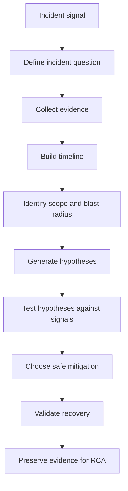
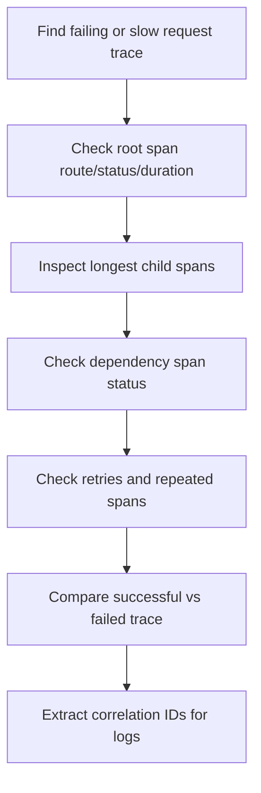
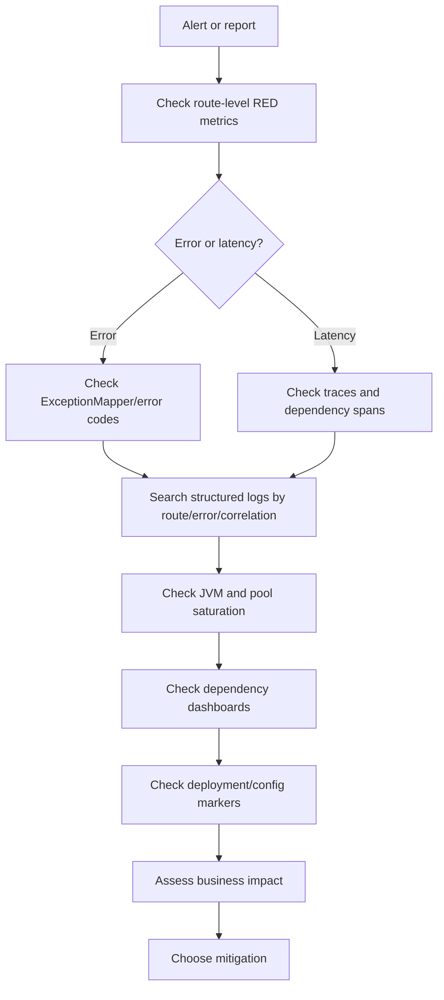
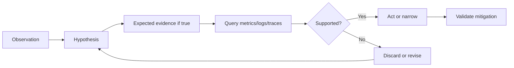

# Cheatsheet Observability Part 045 — Incident Debugging with Observability

> Fokus part ini: menggunakan observability untuk menjawab pertanyaan incident secara sistematis: **apa yang rusak, sejak kapan, di mana scope-nya, siapa yang terdampak, apa perubahan terakhir, signal mana yang membuktikan hipotesis, dan mitigasi apa yang paling aman**.

---

## 1. Core Mental Model

Incident debugging bukan sekadar mencari error log.

Incident debugging adalah proses membangun **evidence-backed timeline** dari beberapa signal:

- metrics untuk melihat gejala, scope, dan trend;
- logs untuk melihat event dan detail error;
- traces untuk melihat request path dan latency breakdown;
- audit logs untuk melihat aksi manusia atau perubahan bisnis/security;
- deployment markers untuk melihat perubahan code/config/runtime;
- platform signals untuk melihat Kubernetes, node, cloud, network, dan dependency health;
- business signals untuk melihat customer impact.

Observability yang baik mempercepat jawaban, bukan memperbanyak data mentah.



Production debugging yang matang selalu dimulai dari pertanyaan yang benar.

---

## 2. The First Incident Questions

Saat alert fire atau ada laporan user, jangan langsung lompat ke root cause.

Jawab dulu pertanyaan dasar ini:

| Question | Why it matters | Primary signals |
|---|---|---|
| Apa symptom utama? | Menghindari debugging terlalu lebar. | Alert, service dashboard, error metric |
| Sejak kapan terjadi? | Membatasi search window. | Metrics timeline, deployment marker, logs |
| Siapa/apa yang terdampak? | Menentukan severity dan blast radius. | Business metrics, route/tenant/region metrics |
| Apakah masih terjadi? | Menentukan urgency. | Live metrics, recent logs, traces |
| Apakah ada perubahan baru? | Recent change sering menjadi trigger. | Deployment marker, config changes, feature flags |
| Apakah dependency degrade? | Membedakan app vs dependency issue. | Dependency dashboards, client spans, timeout metrics |
| Apakah mitigasi aman tersedia? | Mengurangi impact lebih cepat dari RCA. | Runbook, rollback signal, feature flag state |

Debugging buruk dimulai dengan “cek semua log”.

Debugging baik dimulai dengan “pertanyaan mana yang belum terjawab?”.

---

## 3. Incident Debugging Is Not RCA

Incident debugging bertujuan **mengembalikan service atau mengurangi impact**.

RCA bertujuan **memahami penyebab dan mencegah pengulangan**.

Perbedaan praktis:

| Area | Incident debugging | RCA |
|---|---|---|
| Goal | Restore or mitigate | Explain and prevent recurrence |
| Time pressure | High | Lower |
| Evidence standard | Enough to act safely | Enough to support conclusion |
| Output | Mitigation, rollback, workaround, escalation | Root cause, contributing factors, corrective actions |
| Risk | Acting without enough evidence | Overfitting narrative after the fact |

Saat incident berjalan, jangan terjebak mencari root cause sempurna jika customer impact masih berjalan.

---

## 4. Incident Evidence Hierarchy

Tidak semua evidence memiliki kekuatan yang sama.

| Evidence type | Strength | Notes |
|---|---|---|
| Direct user/customer impact metric | Very high | Best for severity and business scope. |
| SLO burn/error budget signal | Very high | Links symptoms to reliability target. |
| Request RED metrics by route/status | High | Good for service symptom. |
| Distributed traces with failed spans | High | Good for causal path and latency breakdown. |
| Structured logs with correlation ID | High | Good for detailed event sequence. |
| Deployment/config marker | High | Good trigger evidence, not root cause alone. |
| Dependency dashboard | Medium-high | Needs correlation with service symptoms. |
| Raw exception count | Medium | Useful but often noisy. |
| Individual log line without correlation | Low-medium | Useful as hint, weak as proof. |
| Anecdotal report | Low | Important input, not enough alone. |

A strong incident narrative combines multiple signal types.

Example:

```text
At 10:14, POST /quotes 5xx rate increased from 0.2% to 8%.
At 10:15, p95 latency increased from 450ms to 3.1s.
At 10:15, traces show pricing-service client spans timing out.
At 10:16, pricing-service dashboard shows DB pool pending connections rising.
At 10:17, deployment marker shows pricing-service v2026.07.11-18 deployed.
```

This is evidence.

A single line saying `NullPointerException` is only a clue.

---

## 5. Incident Window Selection

The first practical decision is search window.

Bad window:

```text
Search all logs from the last 24 hours.
```

Better window:

```text
Start from 15 minutes before the first metric deviation until now.
Then widen only if the trigger may be earlier.
```

Recommended windows:

| Scenario | Initial window | Widen when |
|---|---:|---|
| Alert fired now | -30m to now | Metric trend began earlier |
| Customer report with timestamp | timestamp -30m to +30m | User retry history spans longer |
| Deployment suspicion | deploy time -30m to +2h | Gradual degradation |
| Batch job issue | job scheduled start -1h to now | Job backlog from prior run |
| Queue lag | lag start -1h to now | Producer spike started earlier |
| Data inconsistency | first observed bad entity -24h to now | Need lifecycle/audit reconstruction |

Timeboxing prevents query cost explosion and cognitive overload.

---

## 6. Timeline Reconstruction

A timeline is the backbone of incident debugging.

Minimum timeline fields:

| Field | Example |
|---|---|
| Timestamp | 2026-07-11T10:14:22Z |
| Signal | metric/log/trace/audit/deployment/platform |
| Entity | service, route, pod, topic, queue, tenant, order |
| Observation | p95 latency crossed 2s |
| Evidence link/query | dashboard panel, trace ID, log query |
| Confidence | high/medium/low |

Example timeline:

| Time | Signal | Observation | Interpretation |
|---|---|---|---|
| 10:10 | Deployment | quote-order-api v42 deployed | Possible trigger |
| 10:12 | Metric | POST /quotes p95 latency rising | Symptom starts |
| 10:13 | Trace | Pricing dependency span dominates latency | Downstream bottleneck |
| 10:14 | Log | TimeoutException on pricing call | Confirms dependency timeout |
| 10:15 | Metric | Retry count increases 5x | Retry amplification |
| 10:16 | Business | Quote creation success drops | Customer impact |
| 10:18 | Mitigation | Feature flag disables enrichment call | Impact reduced |

A timeline should separate observation from interpretation.

---

## 7. Signal Selection by Incident Question

Different questions need different signals.

| Incident question | Best signal | Supporting signal |
|---|---|---|
| Is the service failing? | RED metrics | Logs, traces |
| Is latency caused by DB? | Trace DB spans | DB metrics, slow query logs |
| Is dependency timing out? | HTTP client spans | Timeout metrics, dependency dashboard |
| Is Kafka backlog growing? | Consumer lag | Consumer logs, processing latency |
| Are RabbitMQ messages stuck? | Queue depth/unacked | Consumer logs, redelivery count |
| Is Redis causing degradation? | Redis command latency | Cache hit/miss, slowlog |
| Is Kubernetes killing pods? | Pod restart/OOMKilled | JVM memory, container metrics |
| Did a deployment trigger it? | Deployment markers | Version labels, config audit |
| Is customer impact real? | Business metrics | Error metrics, support tickets |
| Is data corrupted? | Audit/domain events | DB records, lifecycle traces |

Using the wrong signal causes false confidence.

---

## 8. Metrics-First Triage

Metrics are usually the first incident triage tool because they show shape and scope.

Start with:

- request rate;
- error rate;
- latency percentiles;
- saturation;
- dependency error rate;
- deployment markers;
- business success rate.

For a Java/JAX-RS API:

```text
service=quote-order-api
route=POST /quotes
status_class=5xx
environment=prod
region=eu
```

Key metric questions:

1. Did traffic change?
2. Did error rate change?
3. Did latency change?
4. Did saturation change?
5. Did dependency latency/errors change?
6. Did the symptom start after deploy/config change?
7. Is it isolated to one route, tenant, region, pod, or version?

Metric shape matters:

| Shape | Likely meaning |
|---|---|
| Sudden spike after deploy | Code/config/regression trigger likely |
| Gradual increase | Resource leak, backlog, capacity pressure |
| Periodic spike | Scheduled job, batch, cron, traffic pattern |
| Single pod abnormal | Pod/node/local resource issue |
| All pods abnormal | Dependency/platform/traffic issue |
| One route abnormal | Endpoint-specific dependency or code path |
| One tenant abnormal | Data/config/domain-specific issue |

---

## 9. Logs for Event Evidence

Logs answer “what happened inside the service?”.

For incident debugging, log search should use identifiers:

- `trace_id`;
- `correlation_id`;
- `request_id`;
- `tenant_id`;
- `actor_id` when safe;
- `quote_id` / `order_id` / business key when safe;
- endpoint route;
- error code;
- dependency name;
- job name;
- message ID / event ID.

Avoid raw broad searches:

```text
ERROR quote
```

Prefer structured queries:

```text
service="quote-order-api"
environment="prod"
route="POST /quotes"
level="ERROR"
error.code="PRICING_TIMEOUT"
@timestamp >= incident_start
```

Logs should answer:

- what operation started;
- what operation failed;
- what dependency was called;
- what error category occurred;
- whether retry happened;
- whether fallback happened;
- what correlation ID connects the event;
- whether the operation was business-successful or technically only HTTP-successful.

---

## 10. Traces for Causal Path and Latency Breakdown

Traces answer “where did this request spend time and where did failure propagate?”.

For HTTP API incidents, inspect traces by:

- route template;
- status code;
- span status;
- latency percentile;
- error attribute;
- dependency span duration;
- service version;
- tenant segment if allowed and low-cardinality;
- deployment window.

Trace investigation pattern:



A single trace is not enough for impact, but it is excellent for causal detail.

Use traces to compare:

| Compare | Insight |
|---|---|
| Successful vs failed request | Code path or dependency difference |
| Fast vs slow request | Latency source |
| Old version vs new version | Regression signal |
| One tenant vs others | Data/config-specific issue |
| One region vs another | platform/network/cloud scope |

---

## 11. Audit Logs and Domain Events During Incidents

Audit logs are useful when incidents involve:

- wrong user action;
- unexpected permission change;
- quote/order state transition;
- manual override;
- approval/rejection action;
- configuration change;
- impersonation/delegation;
- security-sensitive access;
- compliance evidence.

Domain events are useful when incidents involve lifecycle flow:

- quote created but not priced;
- quote approved but order not created;
- order decomposed but fulfillment not started;
- fulfillment failed but fallout not created;
- cancellation requested but no downstream event;
- amendment stuck in intermediate state.

Audit/domain events answer a different question than logs:

```text
Did the business action happen, who caused it, and what state changed?
```

Application logs answer:

```text
What did the service execute while processing the action?
```

Do not substitute one for the other.

---

## 12. Recent Change Analysis

Many incidents are triggered by change.

Recent change does not always mean root cause, but it is a high-value hypothesis.

Check:

- application deployment;
- image digest;
- commit SHA;
- library upgrade;
- database migration;
- configuration change;
- feature flag change;
- Kubernetes manifest change;
- secret rotation;
- certificate update;
- cloud resource change;
- queue/topic config change;
- scaling policy change;
- firewall/WAF/routing change;
- cron schedule change.

Recent change analysis needs markers.

Minimum deployment marker fields:

| Field | Why |
|---|---|
| service | Scope of change |
| environment | Avoid prod/non-prod confusion |
| region/cluster | Scope by platform |
| version | Compare old vs new |
| commit SHA | Link to code diff |
| image digest | Immutable runtime identity |
| build ID | Link to pipeline |
| config version | Detect config-only change |
| migration version | Link DB schema changes |
| feature flag state | Detect runtime behavior changes |

If deployment markers are missing, incident debugging becomes archaeology.

---

## 13. Blast Radius Analysis

Blast radius is the scope of impact.

Dimensions:

| Dimension | Examples |
|---|---|
| Environment | prod, staging |
| Region | eu, us, apac |
| Service | quote-order-api, pricing-service |
| Route | POST /quotes, GET /orders/{id} |
| Tenant | specific tenant group if allowed |
| Customer segment | enterprise, reseller, internal |
| Business flow | quote creation, approval, fulfillment |
| Dependency | PostgreSQL, Redis, Kafka, RabbitMQ, Camunda |
| Version | v42 only, canary only |
| Pod/node | one pod, one node pool |

Blast radius questions:

1. Is impact global or localized?
2. Is it all endpoints or one route?
3. Is it all tenants or one tenant/config group?
4. Is it one deployment version?
5. Is it synchronous API, async processing, or workflow?
6. Is the user impact failure, delay, duplicate, or data inconsistency?

Blast radius drives severity.

---

## 14. Customer Impact Analysis

Technical symptoms are not enough.

Customer impact asks:

- Are users unable to create quotes?
- Are orders stuck or delayed?
- Are approvals blocked?
- Are fulfillments failing?
- Are cancellations/amendments delayed?
- Are prices wrong, stale, or missing?
- Are duplicate events causing duplicate actions?
- Is there data inconsistency requiring reconciliation?

Technical metric:

```text
POST /quotes 5xx = 6%
```

Business impact:

```text
Quote creation success dropped from 99.7% to 92.1% for enterprise tenants in EU.
Estimated 180 quote attempts failed in 25 minutes.
```

Good observability lets engineering speak in customer impact, not only system internals.

---

## 15. Mitigation-Oriented Debugging

During an incident, the best next action is often not “find root cause”.

It is:

- rollback;
- disable feature flag;
- scale out;
- drain bad pod;
- restart stuck consumer;
- pause producer;
- increase consumer replicas;
- disable non-critical enrichment;
- bypass cache;
- fail open/fail closed depending on business/security rule;
- reroute traffic;
- increase timeout only if safe;
- stop retry storm;
- trigger reconciliation;
- escalate to dependency owner.

Mitigation must be evidence-backed.

Bad mitigation:

```text
Restart everything.
```

Better mitigation:

```text
Only pods running version v42 show elevated 5xx.
Rollback quote-order-api to v41 and monitor POST /quotes 5xx, p95 latency, and quote creation success for 15 minutes.
```

---

## 16. Java/JAX-RS Incident Debugging Path

For Java/JAX-RS service incidents, use this path:



Service-local checks:

- route-level error rate;
- route-level latency;
- status code distribution;
- exception category;
- error response mapping;
- thread pool usage;
- connection pool pending count;
- JVM heap/GC;
- CPU throttling;
- request concurrency;
- pod restarts;
- version skew.

---

## 17. PostgreSQL / Database Incident Debugging

Database-related symptoms:

- endpoint latency increase;
- DB spans dominate trace duration;
- connection pool pending count increases;
- active connections near max;
- slow query count increases;
- lock wait increases;
- deadlock appears;
- transaction duration increases;
- rows affected unexpectedly high/low;
- CPU/IO saturation at DB layer.

Debugging questions:

1. Is latency from pool wait or query execution?
2. Are only some queries slow?
3. Is there lock contention?
4. Did a migration or index change happen?
5. Is there long transaction blocking others?
6. Did traffic shape change?
7. Is ORM/MyBatis generating unexpected SQL?
8. Is DB overloaded or is application misusing it?

Signals:

| Symptom | Signals |
|---|---|
| Pool exhaustion | pending connections, active/idle, timeout logs |
| Slow query | query latency, DB spans, slow query logs |
| Lock wait | PostgreSQL lock metrics, transaction age |
| Deadlock | DB logs, error codes, app exception logs |
| Bad migration | deployment/migration markers, query plans |

---

## 18. Kafka/RabbitMQ Incident Debugging

Messaging incidents often appear as delay, duplicate, or missing business progress.

Kafka checks:

- consumer lag by topic/partition/group;
- producer error rate;
- publish latency;
- consumer processing latency;
- rebalance events;
- retry count;
- DLQ count;
- event age;
- duplicate event count;
- trace propagation via headers.

RabbitMQ checks:

- queue depth;
- unacked messages;
- redelivery rate;
- publish/consume rate;
- consumer count;
- ack/nack logs;
- DLQ growth;
- message age;
- queue latency;
- routing key/exchange behavior.

Debugging questions:

1. Are producers publishing faster than consumers process?
2. Are consumers failing and retrying?
3. Is there a poison message?
4. Is processing slow due to downstream dependency?
5. Are messages redelivered because ack fails?
6. Is DLQ growing silently?
7. Is business state stuck because an event was not consumed?

---

## 19. Redis Incident Debugging

Redis symptoms:

- cache miss spike;
- Redis latency spike;
- command timeout;
- eviction increase;
- memory near max;
- hot key behavior;
- lock acquisition failure;
- rate limiter false rejection;
- idempotency key missing/expired;
- stream pending entries increase.

Debugging questions:

1. Is Redis slow or is application overusing Redis?
2. Did cache hit ratio drop after deployment?
3. Are keys expiring earlier than expected?
4. Is eviction causing stale DB pressure?
5. Is lock contention blocking business flow?
6. Did key naming/cardinality explode?
7. Did a Redis failover happen?

Privacy warning:

Do not expose raw Redis keys in high-cardinality metrics or traces if keys contain tenant/user/order identifiers.

---

## 20. Camunda / Workflow Incident Debugging

Workflow incidents are often hidden because HTTP requests may succeed while process progress fails later.

Signals to check:

- process instance count;
- active process count;
- failed jobs;
- incident count;
- worker failure rate;
- worker latency;
- task aging;
- timer backlog;
- message correlation failures;
- stuck state duration;
- human task queue age;
- variable payload size.

Debugging questions:

1. Did process start?
2. Did process reach expected activity?
3. Is it waiting for external message?
4. Is worker failing repeatedly?
5. Is timer backlog delaying progress?
6. Is human approval aging beyond SLA?
7. Is correlation key wrong or missing?
8. Is variable size or data shape causing failure?

Business debugging must include workflow state, not only API status.

---

## 21. Kubernetes and Platform Incident Debugging

Platform symptoms can masquerade as application bugs.

Check:

- pod restart count;
- container restart reason;
- OOMKilled;
- readiness/liveness failures;
- CPU throttling;
- memory pressure;
- node pressure;
- image pull failures;
- HPA scaling events;
- service endpoint availability;
- ingress errors;
- DNS failures;
- network policy changes;
- secret/config mount failures.

Common patterns:

| Platform signal | Possible impact |
|---|---|
| CPU throttling | Latency increase without code change |
| OOMKilled | Intermittent 5xx, lost in-memory state |
| Readiness failure | Traffic removed from pod |
| Liveness failure | Restart loop amplifies incident |
| Node pressure | Multiple unrelated pods degrade |
| HPA lag | Saturation during traffic spike |
| ConfigMap change | Behavior changes without deploy marker if not tracked |

---

## 22. Cloud Incident Debugging

Cloud/on-prem/hybrid systems need platform and network context.

Check:

- load balancer 5xx/target health;
- API gateway/APIM errors;
- WAF blocks;
- private endpoint status;
- DNS resolution;
- certificate expiration;
- managed DB health;
- managed broker health;
- cloud service health events;
- object storage latency/errors;
- IAM/secret/config service failures;
- cross-region connectivity;
- VPN/private link degradation.

Cloud observability matters because the application may be correct while the platform path is broken.

---

## 23. Incident Hypothesis Loop

Do not collect evidence randomly. Use a hypothesis loop.



Example:

```text
Observation:
POST /quotes latency p95 increased after deployment.

Hypothesis:
New version performs additional pricing HTTP call.

Expected evidence:
Traces from new version show an extra pricing-service span.
Old version traces do not.
Pricing dependency latency correlates with root span duration.

Action:
Compare traces by service.version.
```

This prevents confirmation bias.

---

## 24. Common Incident Debugging Anti-Patterns

| Anti-pattern | Why dangerous | Better approach |
|---|---|---|
| Start with random log search | Slow and biased | Start with metrics scope and timeline |
| Treat latest error as root cause | Recency bias | Check first symptom and causal path |
| Debug one pod only | Misses global scope | Compare pod/version/region |
| Ignore business impact | Severity may be wrong | Check success/funnel/lifecycle metrics |
| Assume deployment caused it | Correlation is not causation | Compare version-specific metrics/traces |
| Restart everything | Destroys evidence and may worsen impact | Preserve evidence, targeted mitigation |
| Overfocus on app logs | Misses platform/dependency issue | Check platform and dependency dashboards |
| No correlation IDs | Broken reconstruction | Use trace/request/business IDs |
| No timeline | Chaotic narrative | Build timeline from signals |
| Jump to RCA during active impact | Delays mitigation | Restore first, RCA later |

---

## 25. Production-Safe Debugging Discipline

During incident, debugging itself can cause harm.

Avoid:

- enabling DEBUG globally in production for long periods;
- dumping full request/response bodies;
- querying broad high-cardinality logs without window;
- running expensive DB queries on production primary;
- taking heap dump without memory/storage/security plan;
- restarting pods without preserving logs/traces;
- manually changing data without audit trail;
- increasing timeout/retry without considering retry storm;
- exposing PII in shared incident channels.

Safe debugging principles:

1. Limit scope.
2. Preserve evidence.
3. Prefer read-only inspection.
4. Use structured identifiers.
5. Avoid leaking sensitive data.
6. Document actions with timestamps.
7. Validate mitigation with metrics.

---

## 26. Incident Debugging Template

Use this template during incident notes:

```md
## Incident Debugging Notes

### Current symptom
- Alert/report:
- First observed:
- Current status:

### Scope
- Environment:
- Region/cluster:
- Service:
- Route/business flow:
- Tenant/customer segment:
- Version/pod/node:

### Customer/business impact
- Impacted operation:
- Estimated failed/delayed count:
- SLA/SLO impact:

### Timeline
| Time | Signal | Observation | Evidence | Confidence |
|---|---|---|---|---|

### Recent changes
- Deployment:
- Config:
- Feature flag:
- Migration:
- Platform/cloud:

### Hypotheses
| Hypothesis | Evidence for | Evidence against | Next check |
|---|---|---|---|

### Mitigation
- Action:
- Owner:
- Time:
- Expected effect:
- Validation metric:

### Evidence to preserve for RCA
- Dashboards:
- Log queries:
- Trace IDs:
- Audit events:
- Deployment/config records:
```

---

## 27. Internal Verification Checklist

Use this checklist in the CSG/team context without assuming the internal stack:

### 27.1 Observability stack

- What log platform is used?
- What metric backend is used?
- What tracing backend is used?
- Is OpenTelemetry used directly, via agent, or via platform wrapper?
- Is there an OpenTelemetry Collector?
- Are dashboards standardized by service/team?
- Are alert rules stored as code?
- Are runbooks linked from alerts?

### 27.2 Incident process

- Where are incident notes written?
- Is there an incident commander role?
- Who owns severity declaration?
- How is customer impact estimated?
- How are mitigation actions recorded?
- How is RCA created and tracked?
- Are telemetry gaps tracked as action items?

### 27.3 Service-level evidence

- Are route-level RED metrics available?
- Are logs structured and queryable?
- Is `trace_id` present in logs?
- Is `correlation_id` propagated across HTTP and messaging?
- Are deployment markers visible on dashboards?
- Are service version labels attached to metrics/traces/logs?
- Are business keys logged safely where needed?

### 27.4 Dependency evidence

- PostgreSQL: pool wait, active/idle/pending, slow query, lock wait, deadlock.
- Kafka: producer errors, consumer lag, processing latency, DLQ.
- RabbitMQ: queue depth, unacked, redelivery, DLQ, message age.
- Redis: hit/miss, latency, eviction, memory, slowlog.
- Camunda/workflow: failed jobs, incidents, task aging, stuck process.
- Kubernetes: restarts, readiness/liveness, OOMKilled, CPU throttling.
- Cloud: LB/API gateway errors, managed service health, network events.

### 27.5 Safety and privacy

- Are incident queries safe from PII leakage?
- Are request/response bodies excluded or masked?
- Are secrets/tokens/cookies redacted?
- Are heap/thread dumps governed?
- Are incident channels allowed to contain customer data?
- Who approves production debugging that may expose sensitive data?

---

## 28. PR Review Checklist

When reviewing changes that affect production debugging, ask:

- Does the change add or remove important observability signals?
- Are new failure modes observable?
- Are errors categorized and mapped to stable error codes?
- Are logs structured and correlated?
- Are metrics low-cardinality and meaningful?
- Are traces continuous across HTTP/messaging/executor boundaries?
- Are deployment/config/version labels preserved?
- Are sensitive fields masked?
- Is there a dashboard or alert impact?
- Is there a runbook update if behavior changes?
- Does this change affect incident mitigation or rollback?

---

## 29. Practical Exercises

1. Pick one production-like endpoint and reconstruct its normal request flow using metrics, logs, and traces.
2. Take one historical incident and rebuild its timeline from telemetry only.
3. Compare a successful and failed trace for the same route.
4. Identify one alert and verify whether it points to the right dashboard/runbook.
5. Find one service where deployment markers are missing or incomplete.
6. Find one dependency where latency is not visible from the service dashboard.
7. Create a blast-radius table for one hypothetical quote creation outage.
8. Review whether business impact can be estimated from current telemetry.

---

## 30. Key Takeaways

- Incident debugging is evidence construction under time pressure.
- Metrics show shape and scope; logs show event detail; traces show causal path; audit/domain events show business/action evidence.
- Timeline reconstruction is the core skill.
- Recent change is a strong hypothesis, not proof.
- Blast radius and customer impact determine severity.
- Mitigation should be targeted, reversible, and validated with telemetry.
- Good observability reduces both MTTR and the quality gap between incident response and RCA.
- Missing telemetry is a production risk, not a cosmetic defect.
