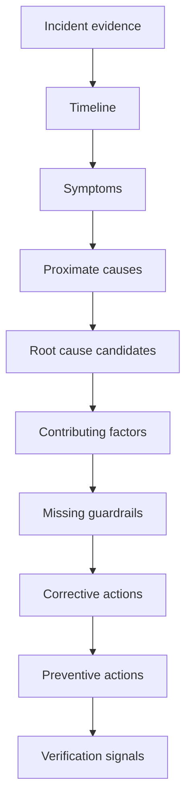

# Cheatsheet Observability Part 046 — Root Cause Analysis Signals

> Fokus part ini: mengubah RCA dari cerita “sepertinya karena X” menjadi analisis berbasis **observable evidence**. RCA yang baik membedakan symptom, trigger, proximate cause, root cause, contributing factor, missing guardrail, missing telemetry, corrective action, dan preventive action.

---

## 1. Core Mental Model

RCA bukan mencari siapa yang salah.

RCA adalah proses menjawab:

```text
Kenapa sistem mengizinkan kegagalan ini terjadi, berdampak, dan tidak terdeteksi atau tidak termitigasi lebih cepat?
```

Observability berperan dalam RCA sebagai:

- bukti timeline;
- bukti scope impact;
- bukti causal chain;
- bukti trigger;
- bukti guardrail yang gagal atau hilang;
- bukti telemetry yang hilang;
- bukti bahwa corrective action nanti bisa diverifikasi.



RCA tanpa observability biasanya menjadi narasi, bukan analisis.

---

## 2. RCA Vocabulary

Gunakan istilah dengan disiplin.

| Term | Meaning | Example |
|---|---|---|
| Symptom | Observable external/internal sign that something is wrong | POST /quotes 5xx increased |
| Impact | Business/customer effect | Quote creation failed for EU customers |
| Trigger | Event that started or exposed the failure | Deployment v42 enabled new pricing call |
| Proximate cause | Immediate technical cause of symptom | Pricing HTTP client timed out |
| Root cause | Deeper system reason that allowed failure | Timeout/retry policy caused thread starvation under dependency slowness |
| Contributing factor | Condition that amplified or delayed detection | Missing circuit breaker dashboard, retry count not alerted |
| Missing guardrail | Control that should have prevented/limited issue | No canary SLO gate |
| Missing telemetry | Evidence that was absent during debugging | No trace propagation to Kafka consumer |
| Corrective action | Fix the found defect or gap | Add bounded retry with jitter and circuit breaker |
| Preventive action | Reduce class of future failures | Add PR checklist for outbound dependency resilience and telemetry |

Bad RCA collapses these into one line:

```text
Root cause: pricing service timeout.
```

Better RCA separates layers:

```text
Symptom: quote-order-api POST /quotes 5xx increased.
Proximate cause: pricing-service HTTP calls timed out.
Root cause: new pricing enrichment path made synchronous dependency calls without bounded retry/circuit breaker and saturated request threads when pricing latency degraded.
Contributing factor: alert fired on 5xx only after 15 minutes; no burn-rate alert for route-level quote creation failure.
Missing telemetry: retry count and client connection pool wait were not visible on the service dashboard.
```

---

## 3. RCA Is About Systems, Not Blame

A production system fails because multiple conditions align.

Avoid person-centered RCA:

```text
Engineer forgot to add a timeout.
```

Prefer system-centered RCA:

```text
The outbound HTTP client wrapper did not enforce default timeout/circuit breaker settings, and PR review did not include an observability/resilience checklist for new dependencies.
```

The second statement leads to scalable improvement.

---

## 4. Evidence Standard for RCA

Each RCA claim should point to evidence.

| Claim type | Required evidence |
|---|---|
| Symptom happened | Metrics/dashboard/logs/alert history |
| Impact happened | Business metrics, customer reports, failed transaction count |
| Trigger happened | Deployment/config/audit marker |
| Dependency failed | Dependency metrics, client spans, timeout logs |
| Retry storm happened | Retry metrics/logs/traces, traffic amplification |
| Pool exhausted | Pool metrics, timeout errors, thread dumps if needed |
| Workflow stuck | Process metrics, incidents, task aging, domain state |
| Detection was delayed | Alert timeline, metric availability, notification records |
| Telemetry was missing | Incident notes showing evidence gap, dashboard/log/trace absence |
| Action fixed issue | Recovery metrics after mitigation/fix |

If evidence cannot support the claim, mark it as hypothesis.

---

## 5. Timeline as RCA Backbone

Incident timeline should survive the heat of the incident and become RCA evidence.

RCA timeline should include:

- first customer impact;
- first technical symptom;
- first alert;
- first human acknowledgement;
- first mitigation;
- recovery time;
- deployment/config/audit events;
- dependency/platform events;
- key investigative discoveries;
- false leads when important;
- telemetry gaps encountered.

Example:

| Time | Event | Evidence | RCA relevance |
|---|---|---|---|
| 10:00 | Deployment v42 completed | CI/CD marker | Trigger candidate |
| 10:06 | Pricing latency p95 increased | dependency dashboard | External condition |
| 10:08 | Quote API latency increased | service metrics | Symptom starts |
| 10:09 | Retry count increased | logs/traces | Amplification |
| 10:13 | 5xx crossed alert threshold | alert history | Detection |
| 10:17 | On-call acknowledged | incident record | Response time |
| 10:22 | Feature flag disabled | config audit | Mitigation |
| 10:25 | Error rate recovered | metrics | Recovery |
| 10:40 | Missing retry metric identified | incident notes | Observability gap |

Timeline prevents “we think it started around…” ambiguity.

---

## 6. Symptom vs Cause

Symptoms are what you observe.

Causes are what generated those symptoms.

Examples:

| Symptom | Not necessarily cause |
|---|---|
| 5xx rate increased | Could be dependency, app bug, auth failure, DB issue |
| Latency increased | Could be CPU, DB, Redis, downstream, queue, GC |
| Consumer lag increased | Could be slow consumer, poison message, broker issue, downstream failure |
| Pod restarted | Could be OOM, liveness misconfig, node issue, crash loop |
| Queue depth increased | Could be producer spike or consumer failure |
| SLO burn alert fired | Symptom of reliability target violation, not root cause |

RCA must not call the alert itself the root cause.

Bad:

```text
Root cause: high latency.
```

Better:

```text
Symptom: high latency.
Proximate cause: DB connection pool wait time increased.
Root cause: new endpoint code opened long transactions while making outbound calls, holding DB connections longer than expected.
```

---

## 7. Trigger vs Root Cause

Trigger is the event that exposed the failure.

Root cause is the deeper reason the system failed.

| Trigger | Possible root cause |
|---|---|
| Deployment | Missing regression test, unsafe default, unbounded retry |
| Traffic spike | Capacity model wrong, autoscaling lag, saturation not alerted |
| Dependency slowdown | Missing timeout/circuit breaker/fallback |
| Config change | No config validation, no audit marker, no canary |
| DB migration | Query plan regression, missing index validation |
| Certificate rotation | Missing expiry alert, poor secret reload behavior |
| Tenant data shape | Invalid domain invariant, insufficient validation |

If you say “deployment caused it”, ask:

```text
What about the deployment caused it, and why did our system not catch or limit it?
```

---

## 8. Proximate Cause vs Root Cause

Proximate cause is close to the symptom.

Root cause is deeper and more structural.

Example chain:

```text
Symptom:
POST /orders p95 latency increased to 8s.

Proximate cause:
Database queries waited for connections.

Root cause:
A new code path held DB transactions open while waiting on RabbitMQ publish confirms, causing connection pool exhaustion under normal traffic.

Contributing factors:
- No metric for transaction duration by operation.
- No alert on connection pool pending count.
- Trace spans did not show transaction boundary.
- PR review did not flag outbound call inside transaction.
```

The deeper cause points to better prevention.

---

## 9. Contributing Factors

Contributing factors are conditions that made the incident worse, longer, harder to detect, or harder to mitigate.

Common contributing factors:

- missing dashboard;
- missing alert;
- noisy alert causing delayed response;
- no runbook;
- missing owner;
- weak deployment marker;
- missing trace/log correlation;
- insufficient sampling;
- high-cardinality metric dropped by backend;
- no business impact metric;
- no feature flag rollback path;
- unbounded retry;
- no circuit breaker;
- stale dependency documentation;
- unclear escalation path.

Contributing factors are not excuses. They are improvement opportunities.

---

## 10. Missing Guardrails

Guardrails are controls that prevent, detect, limit, or recover from failures.

| Guardrail type | Examples |
|---|---|
| Prevention | validation, contract test, timeout defaults, config validation |
| Detection | alert, SLO burn, anomaly dashboard, synthetic test |
| Limitation | rate limit, circuit breaker, bulkhead, retry budget, backpressure |
| Recovery | rollback, feature flag, replay, reconciliation, failover |
| Evidence | structured logs, traces, audit logs, deployment markers |
| Governance | PR checklist, ADR, ownership, runbook standard |

RCA should ask:

1. Which guardrail failed?
2. Which guardrail was missing?
3. Which guardrail existed but was not visible?
4. Which guardrail was ignored because it was noisy?
5. Which guardrail should be added without creating excessive complexity?

---

## 11. Missing Telemetry as RCA Finding

Missing telemetry may not be the root cause of the incident, but it can be a root cause of slow diagnosis.

Examples:

| Missing telemetry | Impact during incident |
|---|---|
| Missing correlation ID in logs | Could not connect API error to downstream call |
| Missing deployment marker | Trigger identification delayed |
| Missing client latency metric | Dependency bottleneck unclear |
| Missing retry count | Retry storm not visible |
| Missing queue message age | Backlog impact unclear |
| Missing business success metric | Customer impact underestimated |
| Missing audit log | Could not prove who changed config |
| Missing trace across Kafka | Async causal chain broken |
| Missing pool wait metric | DB pool exhaustion misdiagnosed |

Telemetry gaps should become tracked action items.

Do not write RCA like:

```text
Need better monitoring.
```

Write:

```text
Add route-level POST /quotes business success metric and alert when quote creation success rate burns SLO for 5m/30m windows. Current dashboard only shows HTTP 5xx and misses domain-level failures returned as 200 with business error code.
```

---

## 12. RCA Signal Matrix

Use this matrix to connect RCA dimensions to observability signals.

| RCA dimension | Logs | Metrics | Traces | Audit | Events | Platform |
|---|---|---|---|---|---|---|
| Symptom | Error logs | RED/SLO metrics | Failed spans | Usually no | Business event failures | LB/K8s/cloud errors |
| Trigger | Config/deploy logs | Version change marker | service.version | Change audit | Schema/event version | Deployment/cloud events |
| Proximate cause | Exception/error codes | Dependency/pool metrics | Slow/error spans | Sometimes | Failed event flow | Resource pressure |
| Root cause | Detailed execution clues | Trend/shape | Causal path | Human/config action | Lifecycle chain | Runtime/platform cause |
| Impact | Business logs | Business metrics | Request examples | Customer actions | Quote/order lifecycle | Regional availability |
| Contributing factors | Missing fields | Missing panels | Broken trace | Missing audit | Missing domain events | Missing platform signals |

RCA quality improves when multiple signal types agree.

---

## 13. Java/JAX-RS RCA Patterns

Common RCA patterns in Java/JAX-RS services:

### 13.1 Exception mapping gap

Symptom:

```text
500 rate increased for validation-like failures.
```

Root pattern:

```text
New domain exception was not mapped in ExceptionMapper, causing expected business validation errors to become 500 responses.
```

Evidence:

- error logs with exception class;
- route-level 5xx metric;
- traces with span status ERROR;
- response body/error code analysis;
- PR diff adding new exception.

Preventive action:

- exception taxonomy test;
- ExceptionMapper coverage test;
- stable error code convention;
- metric by error category.

### 13.2 Missing timeout

Symptom:

```text
Latency and active request count increased.
```

Root pattern:

```text
Outbound HTTP client had no bounded timeout, causing request threads to wait under dependency slowness.
```

Evidence:

- HTTP client spans long duration;
- active request/thread pool metrics increased;
- dependency latency dashboard;
- timeout config absent in code/config.

Preventive action:

- default timeout wrapper;
- PR checklist for new dependencies;
- client latency/timeout metrics;
- circuit breaker dashboard.

### 13.3 Transaction boundary mistake

Symptom:

```text
DB pool exhausted after release.
```

Root pattern:

```text
Code held DB transaction open while calling downstream service or broker, increasing connection hold time.
```

Evidence:

- pool pending count;
- transaction duration metric;
- traces showing DB transaction around outbound call;
- code diff;
- slow query/lock data.

Preventive action:

- transaction boundary review;
- integration test;
- transaction duration instrumentation;
- architecture guideline.

---

## 14. PostgreSQL/MyBatis/JPA RCA Patterns

| Pattern | Symptom | Evidence | Preventive action |
|---|---|---|---|
| N+1 query | Latency increases with entity count | Traces show many similar DB spans | Query review, fetch strategy tests |
| Missing index | Query latency spike after feature | slow query log, plan regression | migration checklist, index validation |
| Lock contention | Timeouts/deadlocks | lock wait metrics, DB logs | shorter transactions, lock ordering |
| Pool exhaustion | 5xx/timeout under traffic | pending connections, pool timeout logs | pool sizing, transaction duration metric |
| ORM flush surprise | Unexpected write latency | JPA/Hibernate logs/traces | explicit transaction and flush review |
| SQL parameter leakage | Sensitive data in logs | log samples | SQL sanitization/redaction |

RCA should include both application behavior and database behavior.

---

## 15. Messaging RCA Patterns

### 15.1 Kafka consumer lag

Possible root causes:

- consumer processing slowed;
- downstream dependency degraded;
- partition skew;
- rebalance storm;
- poison message retry loop;
- consumer replicas insufficient;
- batch size/config changed.

Evidence:

- lag by partition/group;
- processing latency;
- consumer error logs;
- retry/DLQ metrics;
- trace spans for consumer handler;
- deployment markers.

### 15.2 RabbitMQ redelivery loop

Possible root causes:

- message handler fails before ack;
- nack/requeue policy causes infinite loop;
- downstream call fails;
- poison message not routed to DLQ;
- consumer prefetch too high;
- idempotency failure.

Evidence:

- redelivery count;
- unacked messages;
- queue depth;
- DLQ growth;
- ack/nack logs;
- message age;
- consumer traces.

### 15.3 Duplicate event side effects

Possible root causes:

- producer retry without idempotency;
- consumer not idempotent;
- message dedup key missing;
- event ID not persisted;
- transaction/outbox boundary issue.

Evidence:

- duplicate event IDs;
- business audit records;
- idempotency store metrics;
- outbox logs;
- consumer processing logs.

---

## 16. Redis RCA Patterns

| Pattern | Symptom | Evidence | Preventive action |
|---|---|---|---|
| Cache stampede | DB load spike after cache expiry | cache miss spike, DB QPS spike | jittered TTL, request coalescing |
| Eviction storm | Data reload, latency spike | eviction count, memory max | sizing, TTL policy, memory alerts |
| Hot key | Redis CPU/latency spike | command latency, key distribution if safe | sharding, local cache, key design |
| Lock leak | Business operation stuck | lock metric, TTL, logs | lock TTL, fencing token, cleanup |
| Idempotency expiry too short | Duplicate processing | idempotency misses, duplicate events | retention aligned to retry window |
| Raw key telemetry | Cost/privacy issue | high-cardinality labels/traces | key masking, label governance |

---

## 17. Camunda / Workflow RCA Patterns

Workflow RCA must consider both technical execution and business lifecycle.

Common patterns:

| Pattern | Symptom | Evidence | Preventive action |
|---|---|---|---|
| Message correlation failure | Process stuck waiting | correlation failure logs, process state | correlation key standard/test |
| Failed job retry exhausted | Incident count increases | failed job metrics, job logs | worker error taxonomy, retry policy |
| Human task aging | Approval SLA breach | task age metrics, audit logs | escalation rules, aging alerts |
| Timer backlog | Delayed process progress | timer backlog metrics | capacity tuning, timer dashboard |
| Variable payload too large | Worker/process failure | engine logs, payload metrics | variable size limits, external storage |
| State mismatch | Order/quote inconsistent | domain events, audit logs, DB state | reconciliation and state transition tests |

RCA should include business state, not only engine error.

---

## 18. Kubernetes / Platform RCA Patterns

| Pattern | Symptom | Evidence | Preventive action |
|---|---|---|---|
| CPU throttling | Latency without app error | CPU throttling metrics | requests/limits tuning, load test |
| OOMKilled | intermittent failures | restart reason, memory graph | heap sizing, memory leak analysis |
| Bad readiness | traffic to unready app or no traffic | readiness failures, endpoint state | probe design review |
| Liveness too aggressive | restart loop | liveness events, app startup logs | probe thresholds, startup probe |
| HPA lag | saturation during spike | HPA events, CPU/QPS graph | scale policy, concurrency limits |
| Node pressure | multiple services affected | node metrics/events | workload placement, capacity planning |
| Config mount issue | startup failure | pod events, config version | config validation, rollout test |

Platform root causes often require platform/SRE collaboration.

---

## 19. Alerting and Detection RCA

Every RCA should ask:

1. Did alert fire?
2. Did it fire early enough?
3. Was it routed to the right owner?
4. Was the severity correct?
5. Was the alert actionable?
6. Did it link to dashboard/runbook?
7. Was it noisy before the incident?
8. Did alert suppression hide it?
9. Was the SLO/SLI definition appropriate?
10. Did business impact appear before technical alert?

Detection failure examples:

| Detection issue | RCA finding |
|---|---|
| No alert | Missing SLO/burn or symptom alert |
| Late alert | Window/threshold too slow |
| Wrong alert owner | Ownership metadata wrong |
| Too many alerts | Dedup/grouping absent |
| Alert ignored | Alert fatigue due to false positives |
| Business impact missed | Only technical 5xx observed, domain failure returned 200 |

---

## 20. Corrective vs Preventive Actions

Corrective action fixes this incident's concrete issue.

Preventive action reduces future class of incidents.

| RCA finding | Corrective action | Preventive action |
|---|---|---|
| Missing timeout | Add timeout to pricing client | Enforce default timeout wrapper for all HTTP clients |
| Missing metric | Add retry count metric | Add observability checklist to PR template |
| No dashboard panel | Add pool pending panel | Standardize service dashboard template |
| Bad config caused outage | Fix config | Add config validation and canary rollout |
| Manual change untracked | Restore config | Require audit log for production config changes |
| Trace broken across Kafka | Propagate headers | Add integration test for context propagation |

Avoid weak actions:

```text
Be more careful.
Improve monitoring.
Investigate further.
```

Prefer testable actions:

```text
Add alert: quote_creation_success_rate burn over 5m/30m for prod routes, with runbook link and owner label. Validate using replayed incident data before enabling paging.
```

---

## 21. Verification Signals for Actions

Every action should have a verification signal.

| Action | Verification signal |
|---|---|
| Add timeout | Client timeout metric/log shows bounded failure within configured limit |
| Add circuit breaker | Circuit breaker state metric visible and alertable |
| Add metric | Metric appears in dashboard with correct labels and cardinality |
| Add trace propagation | End-to-end trace crosses HTTP → Kafka/RabbitMQ → consumer |
| Add audit log | Audit event records actor/action/target/before-after |
| Add SLO alert | Historical replay or shadow mode shows correct firing behavior |
| Add dashboard | Incident simulation can answer target questions within minutes |
| Add runbook | On-call dry run completes triage steps |
| Add config validation | Invalid config rejected before production rollout |

No verification signal means the action may not actually reduce risk.

---

## 22. RCA Template

Use a structured RCA template:

```md
# RCA: <incident title>

## Summary
- What happened:
- Customer/business impact:
- Duration:
- Severity:
- Services affected:

## Timeline
| Time | Event | Evidence | Notes |
|---|---|---|---|

## Impact
- Affected operations:
- Affected tenants/customers/regions:
- Failed/delayed transaction count:
- SLO/SLA impact:

## Symptoms
- Observable symptoms:
- First symptom timestamp:
- Alert timestamp:

## Trigger
- Deployment/config/platform/business event:
- Evidence:

## Proximate cause
- Immediate technical cause:
- Evidence:

## Root cause
- System-level cause:
- Evidence:

## Contributing factors
- Factor:
- Evidence:
- Impact on detection/mitigation:

## Missing guardrails
- Prevention:
- Detection:
- Limitation:
- Recovery:
- Evidence:

## Missing telemetry
- Missing signal:
- How it affected debugging:
- Proposed telemetry improvement:

## What worked well
- Signals/tools/processes that helped:

## What did not work well
- Signals/tools/processes that delayed response:

## Actions
| Action | Type | Owner | Due date | Verification signal |
|---|---|---|---|---|
```

---

## 23. RCA Quality Checklist

A good RCA:

- separates symptom, impact, trigger, proximate cause, root cause, and contributing factors;
- cites concrete evidence;
- includes timeline with timestamps;
- explains why detection/mitigation took as long as it did;
- identifies missing guardrails;
- identifies missing telemetry;
- avoids blaming individuals;
- avoids vague actions;
- assigns owners and due dates;
- defines verification signals;
- checks privacy/security implications;
- checks cost/cardinality implications of new telemetry;
- updates runbooks/dashboards/alerts if needed.

A weak RCA:

- says “root cause unknown” without evidence gaps;
- says “human error”;
- says “monitoring should improve”;
- has no timeline;
- has no customer impact estimate;
- has actions with no owner;
- has actions that cannot be verified;
- ignores telemetry failures discovered during incident.

---

## 24. Internal Verification Checklist

Use this in the CSG/team context without inventing internal standards.

### 24.1 RCA process

- Where are RCAs documented?
- What incidents require RCA?
- Who approves RCA quality?
- Are RCA actions tracked in backlog?
- Are action owners and due dates required?
- Are completed actions verified?
- Are recurring incident patterns reviewed?

### 24.2 Evidence sources

- Are incident timelines preserved?
- Are dashboard snapshots or links stored?
- Are log queries recorded?
- Are trace IDs recorded?
- Are deployment/config/audit markers recorded?
- Are customer impact estimates recorded?
- Are mitigation actions timestamped?

### 24.3 Observability gaps

- Are missing telemetry items tracked?
- Are missing dashboards tracked?
- Are missing/late/noisy alerts tracked?
- Are trace breaks tracked?
- Are correlation ID gaps tracked?
- Are business metric gaps tracked?
- Are privacy/cost risks of new telemetry reviewed?

### 24.4 Governance

- Does PR review include observability readiness?
- Does ADR include observability impact?
- Are runbooks updated after RCA?
- Are alerts reviewed after incident?
- Are SLOs adjusted when they do not reflect user impact?
- Are platform/SRE/security/backend teams included when needed?

---

## 25. Senior Engineer RCA Review Questions

When reviewing an RCA, ask:

1. What was the first user-impacting symptom?
2. What was the first internal technical symptom?
3. What evidence supports the stated root cause?
4. What evidence disproves alternative hypotheses?
5. Did recent change analysis include code, config, data, platform, cloud, and traffic?
6. Did the incident expose missing telemetry?
7. Did detection fail, delay, or route incorrectly?
8. Was mitigation safe and validated?
9. Could this happen again in another service?
10. Are actions specific, owned, due, and verifiable?
11. Do actions increase telemetry cost/cardinality/privacy risk?
12. Should this become a standard, test, dashboard, alert, or runbook update?

Senior-level RCA review is less about finding a clever cause and more about improving the operating system of engineering.

---

## 26. Practical Exercises

1. Take one historical incident and classify all statements into symptom, impact, trigger, proximate cause, root cause, contributing factor, missing guardrail, and missing telemetry.
2. Rewrite a vague action like “improve monitoring” into three specific actions with verification signals.
3. Pick one service and identify three RCA findings that would be hard to prove because telemetry is missing.
4. Review one alert and determine whether it would support RCA evidence or only incident detection.
5. Simulate an incident where Kafka consumer lag grows and write a causal timeline with metrics, logs, traces, and business impact.
6. Review one PR and ask what RCA evidence would exist if the new code failed in production.

---

## 27. Key Takeaways

- RCA is not blame; it is system learning.
- Symptom, trigger, proximate cause, root cause, and contributing factors must be separated.
- Every RCA claim should be tied to evidence.
- Missing telemetry is a legitimate RCA finding when it delays diagnosis or hides impact.
- Corrective actions fix the immediate defect; preventive actions reduce the future class of failures.
- Every action needs a verification signal.
- The best RCAs improve code, architecture, telemetry, alerting, runbooks, process, and engineering judgment.
