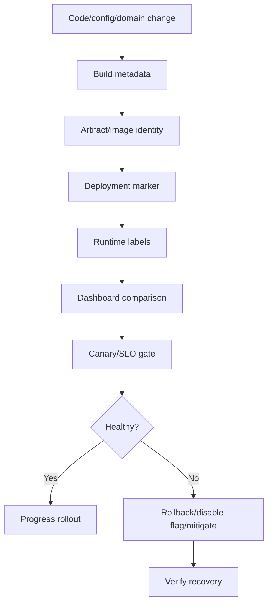

# Cheatsheet Observability Part 047 — Observability for Releases and Deployments

> Fokus part ini: membuat setiap perubahan production dapat dilihat, dibandingkan, diverifikasi, dan di-rollback secara aman. Dalam incident, pertanyaan pertama sering bukan “bug-nya di mana?”, tetapi **apa yang berubah, kapan berubah, siapa/apa yang terdampak, dan apakah rollback/disable flag akan mengurangi impact?**

---

## 1. Core Mental Model

Release observability adalah kemampuan menghubungkan perubahan production dengan perubahan signal.

Perubahan production dapat berupa:

- code deployment;
- container image baru;
- library upgrade;
- configuration change;
- feature flag change;
- database migration;
- schema change;
- routing/ingress change;
- Kubernetes manifest change;
- Helm values change;
- scaling policy change;
- secret/certificate rotation;
- cloud resource change;
- queue/topic/exchange binding change;
- workflow definition change;
- job schedule change.

Observability release yang buruk membuat engineer bertanya:

```text
Ada deployment tadi? Versi mana yang live? Config-nya berubah? Migration jalan? Flag mana yang aktif?
```

Observability release yang baik membuat dashboard langsung menjawab:

```text
At 14:07, quote-api moved from version 2026.07.11-42 to 2026.07.11-43.
At 14:08, POST /quotes p95 latency increased from 480ms to 2.4s.
At 14:09, pricing-client timeout rate increased from 0.1% to 7%.
At 14:09, canary instance showed 5xx burn rate above threshold.
Rollback target is image digest sha256:...
Feature flag new-pricing-path was enabled for tenant segment A.
```



Release observability is not decoration. It is production control.

---

## 2. Why Release Observability Exists

Most production incidents involve change.

Not every change is a code deployment. A system can degrade because of:

| Change type | Example | Observable consequence |
|---|---|---|
| Code | New validation logic in quote creation | 4xx/5xx increase by endpoint |
| Dependency | HTTP client library upgrade | timeout behavior changes |
| Config | connection pool size reduced | pool pending rises, latency increases |
| Feature flag | new pricing path enabled | affected tenants/routes degrade |
| DB migration | index dropped or column migration | slow queries, lock wait, deadlock |
| Schema | event payload version changed | consumer deserialization error |
| Kubernetes | memory limit reduced | OOMKilled, restart loop |
| Cloud | load balancer setting changed | 502/504 or routing anomaly |
| Workflow | new BPMN/process definition | failed jobs, stuck tasks |
| Messaging | new topic partitioning/routing key | consumer lag or queue depth rises |

The point of release observability is not proving deployment caused the issue. The point is narrowing the timeline and hypothesis space quickly.

Recent change is a strong debugging clue, not automatic root cause.

---

## 3. Release Metadata That Should Exist

Every running instance should expose enough identity to answer:

```text
What exactly is running here?
```

Minimum recommended release identity:

| Metadata | Purpose | Common location |
|---|---|---|
| `service.name` | Identify service | OTel resource, logs, metrics, labels |
| `service.version` | Identify deployed application version | OTel resource, logs, dashboard |
| `deployment.environment` | prod/stage/dev | OTel resource, log fields, labels |
| `git.commit.sha` | Link runtime to source | build metadata, deployment annotation |
| `build.id` | Link runtime to CI build | image label, app info endpoint |
| `container.image.name` | Identify artifact | Kubernetes, OTel resource |
| `container.image.tag` | Human-readable image tag | Kubernetes, dashboard |
| `container.image.digest` | Immutable artifact identity | Kubernetes, registry, dashboard |
| `config.version` | Identify active config | log startup, app info, labels |
| `migration.version` | Identify DB schema state | migration table, startup log |
| `feature.flag.snapshot` | Identify feature behavior | flag audit/event, debug endpoint with controls |

Avoid relying only on image tags such as `latest` or mutable tags. For debugging, immutable identity matters.

Bad:

```text
version=latest
```

Better:

```text
service.version=2026.07.11.43
git.commit.sha=9fd2a1c
build.id=quote-api-main-1842
container.image.digest=sha256:...
config.version=quote-api-prod-20260711-02
```

---

## 4. Deployment Markers

A deployment marker is an event rendered on charts and searchable in logs/events.

It answers:

```text
What changed at this timestamp?
```

Deployment markers should appear on:

- service health dashboard;
- route/API dashboard;
- dependency dashboard;
- SLO/burn rate dashboard;
- incident dashboard;
- release comparison dashboard.

A useful deployment marker includes:

| Field | Why it matters |
|---|---|
| service | Which service changed |
| environment | Which environment changed |
| namespace/cluster | Where it changed |
| old version | Enables comparison |
| new version | Enables suspected version identification |
| commit SHA | Links to code diff |
| build ID | Links to CI artifacts |
| image digest | Immutable artifact proof |
| deploy strategy | rolling/canary/blue-green |
| actor/system | Human or pipeline identity |
| start/end time | Rollout timing |
| result | success/failure/partial/rolled back |

Example deployment event:

```json
{
  "event.type": "deployment.completed",
  "service.name": "quote-api",
  "deployment.environment": "prod",
  "k8s.namespace.name": "quote-order",
  "previous.version": "2026.07.11.42",
  "service.version": "2026.07.11.43",
  "git.commit.sha": "9fd2a1c",
  "build.id": "quote-api-main-1842",
  "container.image.digest": "sha256:abc...",
  "deployment.strategy": "canary",
  "deployment.result": "success",
  "timestamp": "2026-07-11T14:07:31Z"
}
```

This is not just audit. It is operational evidence.

---

## 5. Runtime Version Labels

Deployment marker tells when change happened.

Runtime labels tell which version produced a signal.

Logs, metrics, and traces should carry release identity at an appropriate level.

### Logs

Structured logs should include:

```json
{
  "service.name": "quote-api",
  "service.version": "2026.07.11.43",
  "deployment.environment": "prod",
  "git.commit.sha": "9fd2a1c",
  "trace_id": "...",
  "correlation_id": "...",
  "message": "quote creation failed"
}
```

### Metrics

Be careful with version labels on metrics.

Useful:

```text
http.server.request.duration{service="quote-api", route="/quotes", status_class="5xx", version="2026.07.11.43"}
```

Risky when too granular:

```text
http.server.request.duration{pod="quote-api-7f4d...", image_digest="sha256:...", commit="...", route="..."}
```

Version labels can increase cardinality. Usually keep them bounded and retire old versions quickly.

### Traces

Trace resource attributes should identify service version:

```text
service.name=quote-api
service.version=2026.07.11.43
deployment.environment=prod
```

This lets failed traces be filtered by version.

---

## 6. Startup Logs Are Release Evidence

Every service startup should emit one structured startup event.

It should answer:

```text
What binary/config/environment did this instance start with?
```

Recommended startup log fields:

| Field | Purpose |
|---|---|
| service.name | Service identity |
| service.version | App version |
| git.commit.sha | Source identity |
| build.id | CI identity |
| java.version | Runtime compatibility |
| jvm.vendor | Runtime differences |
| deployment.environment | Environment |
| config.version | Config identity |
| active.profiles | Runtime mode |
| otel.enabled | Telemetry enabled/disabled |
| db.migration.version | Schema compatibility |
| feature.flag.provider | Flag source |
| kafka.client.version | Messaging dependency clue |
| jdbc.driver.version | DB driver clue |

Example:

```json
{
  "event.type": "application.startup",
  "service.name": "quote-api",
  "service.version": "2026.07.11.43",
  "git.commit.sha": "9fd2a1c",
  "build.id": "quote-api-main-1842",
  "java.version": "17.0.12",
  "deployment.environment": "prod",
  "config.version": "quote-api-prod-20260711-02",
  "db.migration.version": "V20260711_02",
  "otel.enabled": true
}
```

Do not log secrets or full environment dumps.

---

## 7. Config Change Observability

Many incidents are config incidents.

Config changes should be observable as first-class events:

- connection pool size changed;
- timeout changed;
- retry count changed;
- cache TTL changed;
- queue consumer concurrency changed;
- endpoint URL changed;
- feature flag changed;
- rate limit changed;
- circuit breaker threshold changed;
- logging level changed.

Config change event should include:

| Field | Purpose |
|---|---|
| config.key | What changed |
| old.value | Previous value, masked if sensitive |
| new.value | New value, masked if sensitive |
| actor/system | Who/what changed it |
| service/environment | Scope |
| rollout segment | tenant/region/cluster if applicable |
| reason/change ticket | Operational traceability |
| effective time | When behavior changed |

Security rule:

```text
Never log full secret value, token, password, certificate private key, or sensitive endpoint credential.
```

For secrets, log metadata only:

```json
{
  "event.type": "config.changed",
  "config.key": "pricing.client.timeout_ms",
  "old.value": "1000",
  "new.value": "3000",
  "actor": "deployment-pipeline",
  "change.ticket": "CHG-12345"
}
```

---

## 8. Feature Flag Observability

Feature flags are runtime behavior changes. Treat them like deployments.

A flag change should produce:

- audit event;
- operational event;
- dashboard annotation;
- ability to filter metrics/traces/logs by affected cohort when safe;
- rollback/disable instruction in runbook.

Key design question:

```text
Can we tell whether the failing request used the old path or new path?
```

For Java/JAX-RS service, useful fields:

| Field | Use |
|---|---|
| `feature_flag.new_pricing_path=true` | Debug behavior path |
| `flag.variant=treatment` | Experiment/canary analysis |
| `flag.rule=tenant-segment-a` | Impact scope |
| `flag.evaluation.reason=targeting_match` | Why request used path |

Be careful with labels.

Good for logs/traces:

```text
feature_flag.new_pricing_path=true
```

Risky as metric labels if many flags or many variants:

```text
http_requests_total{flag_a="...", flag_b="...", flag_c="..."}
```

Use flag labels only for a small set of release-critical flags.

---

## 9. Database Migration Observability

Database migrations can break application behavior even when service deployment looks healthy.

Migration observability should answer:

- which migration ran;
- when it started and ended;
- how long it took;
- whether it locked tables;
- whether it changed indexes;
- whether it was backward/forward compatible;
- whether application version expects that schema;
- whether slow queries increased after migration.

Migration event fields:

```json
{
  "event.type": "database.migration.completed",
  "database.system": "postgresql",
  "migration.version": "V20260711_02",
  "migration.name": "add_quote_price_index",
  "duration_ms": 18420,
  "result": "success",
  "deployment.environment": "prod"
}
```

High-risk migration signals:

| Signal | Possible issue |
|---|---|
| lock wait spike | blocking migration |
| transaction duration spike | long-running DDL/DML |
| slow query spike | missing/changed index |
| deadlock increase | migration and app writes conflict |
| connection pool pending | DB blocked or saturated |
| query plan regression | changed statistics/index |

For PostgreSQL, release dashboard should show DB health around deployment window.

---

## 10. Messaging and Event Schema Release Observability

Microservices often fail after deployment because event contracts changed.

Observe:

- event schema version;
- producer version;
- consumer version;
- topic/queue/exchange/routing key;
- deserialization error count;
- DLQ count;
- consumer lag;
- redelivery count;
- message age;
- incompatible payload rate.

Useful log/event fields:

```json
{
  "event.type": "message.consume.failed",
  "messaging.system": "kafka",
  "messaging.destination.name": "quote.events",
  "event.name": "QuotePriced",
  "event.schema.version": "3",
  "producer.service.version": "pricing-service@2026.07.11.43",
  "consumer.service.version": "order-api@2026.07.11.17",
  "error.type": "SchemaCompatibilityException"
}
```

Release question:

```text
Did producer and consumer versions overlap safely during rolling deployment?
```

For Kafka/RabbitMQ releases, always check:

- compatibility during mixed-version deployment;
- idempotency when retrying after rollback;
- DLQ behavior if new payload is rejected;
- event replay safety;
- header propagation compatibility.

---

## 11. Kubernetes Release Observability

In Kubernetes, deployment health is not just “image deployed”.

Observe:

| Signal | What it tells you |
|---|---|
| rollout status | Whether deployment completed |
| pod readiness | Whether pods can receive traffic |
| pod restarts | Crash/restart loop after deploy |
| image digest | Exact artifact running |
| replica availability | Capacity during rollout |
| HPA status | Scaling reaction |
| OOMKilled | Resource regression |
| CPU throttling | CPU limit regression |
| events | Scheduling, probe, image pull issues |
| configmap/secret checksum | Config rollout trigger |
| node placement | Zone/node-specific failures |

Kubernetes labels/annotations should help answer:

```text
Which version, commit, Helm release, Argo CD app, and config checksum produced this pod?
```

Useful metadata:

```yaml
metadata:
  labels:
    app.kubernetes.io/name: quote-api
    app.kubernetes.io/version: 2026.07.11.43
    app.kubernetes.io/part-of: quote-order
  annotations:
    git.commit.sha: "9fd2a1c"
    build.id: "quote-api-main-1842"
    container.image.digest: "sha256:abc..."
    config.checksum: "2b4f..."
```

Internal naming standards must be verified with the team/platform convention.

---

## 12. Canary Release Observability

Canary without observability is just slower risk.

A canary needs objective comparison between baseline and candidate.

Minimum canary signals:

- request rate;
- error rate;
- p95/p99 latency;
- dependency timeout rate;
- JVM memory/GC;
- pod restart;
- business conversion or workflow completion;
- queue lag if event flow changes;
- audit/security anomaly if behavior changes user actions.

Canary should compare:

```text
candidate version vs stable version
same route
same tenant/segment when possible
same traffic window
same dependency context
```

Canary decision matrix:

| Observation | Decision |
|---|---|
| candidate 5xx rate materially higher | stop rollout |
| candidate p95/p99 latency materially higher | pause and investigate |
| candidate dependency timeout higher | check outbound client/config |
| candidate pod restarts/OOMKilled | rollback or resource fix |
| candidate business failure higher | disable feature/rollback |
| no meaningful traffic | extend canary or route test traffic |

Bad canary:

```text
Deploy to 5% and wait 10 minutes without defined success criteria.
```

Good canary:

```text
Deploy to 5%, require error rate < baseline + threshold, p95 < SLO target, no pod restarts, no critical business failure, and no burn-rate alert before expanding.
```

---

## 13. Blue-Green Release Observability

Blue-green reduces rollback complexity but increases routing and state consistency concerns.

Observe:

- active color/version;
- traffic split;
- health of inactive environment;
- DB schema compatibility;
- cache compatibility;
- session/token compatibility;
- message producer/consumer compatibility;
- routing switch timestamp;
- rollback route timestamp.

Critical question:

```text
Can both blue and green safely operate against the same database, cache, broker, and external dependencies?
```

If not, blue-green can create hidden corruption or mixed behavior.

Signals to compare:

| Area | Signal |
|---|---|
| API | status code, latency, route error rate |
| DB | slow queries, locks, schema compatibility |
| Cache | hit ratio, serialization errors |
| Messaging | DLQ, lag, deserialization errors |
| Workflow | failed jobs, stuck process |
| Business | state transition failure, order stuck |

---

## 14. Rollback Observability

Rollback is a production action and must be observable.

A rollback should emit:

- rollback started;
- rollback completed/failed;
- previous bad version;
- restored version;
- actor/system;
- reason;
- linked incident/change;
- verification outcome.

Rollback is not always safe.

Rollback risk examples:

| Change | Rollback risk |
|---|---|
| DB migration | old code may not work with new schema |
| event schema | consumers may already receive new payload |
| cache serialization | old code may not read new cache value |
| workflow definition | in-flight process instances may follow new path |
| feature flag | partial data already created through new path |
| external API call | downstream side effects already happened |

Rollback signal must include recovery validation:

```text
After rollback, did error rate recover?
Did latency recover?
Did queue lag stop growing?
Did stuck orders stop increasing?
Did customer-impact metric recover?
```

Rollback without verification is only an action, not mitigation proof.

---

## 15. Release Health Dashboard

A release health dashboard should answer:

```text
Is the new version healthier, worse, or equivalent to the previous version?
```

Recommended panels:

| Panel | Purpose |
|---|---|
| deployment markers | show change points |
| version distribution | see mixed-version rollout |
| request rate by version | confirm traffic reaches new version |
| error rate by version | detect regression |
| latency by version | detect performance regression |
| top failing routes | locate impact |
| dependency timeout by version | detect outbound issue |
| JVM/pod health by version | detect runtime issue |
| DB slow query/lock around deploy | detect migration issue |
| queue lag/DLQ around deploy | detect async contract issue |
| business KPI by version/flag | detect domain impact |
| rollback marker | verify recovery |

Dashboard anti-patterns:

- only showing global aggregate, hiding bad canary;
- no version labels;
- no deployment marker;
- no route breakdown;
- no dependency panel;
- no business impact panel;
- no rollback verification panel.

---

## 16. Java/JAX-RS Release Observability

For Java/JAX-RS applications, release observability should connect to request lifecycle.

At minimum:

- access log includes service version;
- application logs include service version;
- traces include service version as resource attribute;
- metrics allow version comparison during rollout;
- startup log emits build/config identity;
- exception logs include route template and version;
- JAX-RS filters preserve correlation and trace context;
- health/info endpoints expose safe build metadata;
- deployment marker appears in service dashboard.

Example safe info endpoint shape:

```json
{
  "service": "quote-api",
  "version": "2026.07.11.43",
  "commit": "9fd2a1c",
  "build": "quote-api-main-1842",
  "environment": "prod",
  "startedAt": "2026-07-11T14:07:04Z"
}
```

Do not expose secrets, internal credentials, full env vars, or sensitive topology details.

---

## 17. PostgreSQL/MyBatis/JPA/JDBC Release Concerns

Release observability must cover data access behavior.

Common release regressions:

| Regression | Signal |
|---|---|
| N+1 query introduced | query count per request increases |
| missing index | slow query latency increases |
| transaction widened | transaction duration increases |
| pool size config changed | pending connections increase |
| ORM flush behavior changed | DB writes increase unexpectedly |
| migration lock | lock wait increases |
| query parameter change | query plan regression |
| batch size changed | DB CPU/IO spike |

For MyBatis/JPA/JDBC, connect:

```text
endpoint version -> trace -> DB span -> SQL fingerprint -> PostgreSQL metric -> slow query log
```

Avoid logging raw SQL parameters if they contain PII, commercial data, account identifiers, tokens, or request bodies.

---

## 18. Kafka/RabbitMQ/Redis/Camunda Release Concerns

### Kafka/RabbitMQ

Release must be observable across mixed producer/consumer versions.

Check:

- event schema version;
- message header propagation;
- DLQ rate;
- deserialization failure;
- consumer lag;
- retry count;
- duplicate event handling;
- idempotency key behavior.

### Redis

Release can break cache compatibility.

Check:

- cache hit/miss shift;
- serialization/deserialization errors;
- TTL changes;
- key naming changes;
- lock acquisition failures;
- rate limiter behavior;
- idempotency key compatibility.

### Camunda/workflow

Release can affect in-flight process instances.

Check:

- process definition version;
- failed jobs;
- incident count;
- stuck task aging;
- message correlation failure;
- variable schema compatibility;
- worker version compatibility.

---

## 19. AWS/Azure Release Observability

Cloud changes can behave like releases.

Observe changes to:

- load balancer;
- API Gateway/APIM;
- WAF rule;
- DNS/private endpoint;
- managed database parameter;
- managed broker configuration;
- storage policy;
- secret/config service;
- identity/access policy;
- autoscaling rule;
- network security group/firewall.

Cloud release evidence should include:

| Signal | Why it matters |
|---|---|
| cloud audit logs | who/what changed resource |
| load balancer logs | routing and 5xx/4xx changes |
| WAF logs | blocked requests after rule change |
| managed DB metrics | DB parameter or capacity impact |
| cloud service health | provider-side incident |
| IaC/GitOps diff | intended infrastructure change |

Do not assume application deployment is the only change source.

---

## 20. Failure Modes

| Failure mode | Typical evidence | Debugging move |
|---|---|---|
| deployment succeeded but app fails | startup log, pod restart, 5xx spike | compare version and logs |
| config regression | config change marker, latency/error spike | compare old/new config |
| DB migration regression | slow query/lock spike | inspect migration and DB metrics |
| canary hidden by aggregate | global OK, candidate bad | split metrics by version/cohort |
| feature flag bad cohort | errors only for enabled segment | filter by flag/tenant/route |
| event schema incompatibility | DLQ/deserialization spike | compare producer/consumer versions |
| rollback incomplete | mixed version remains | check version distribution |
| runtime resource regression | OOMKilled/CPU throttling | compare requests/limits and JVM metrics |
| cloud routing regression | 502/504 at edge | inspect LB/gateway/ingress logs |
| telemetry missing after deploy | missing logs/spans/metrics | check instrumentation/config change |

---

## 21. Debugging Release Regression

Use this order:

1. Identify exact first bad timestamp.
2. Overlay deployment/config/flag/migration markers.
3. Compare before vs after metrics.
4. Split by version, route, tenant/segment, region, and pod if safe.
5. Inspect traces for failed/slow requests.
6. Check dependency health around same window.
7. Check Kubernetes pod/restart/resource signals.
8. Check DB migration and slow query signals.
9. Check messaging lag/DLQ for async impact.
10. Decide mitigation: rollback, disable flag, scale, config revert, traffic shift, or dependency escalation.
11. Verify recovery with the same symptom metric.

Good debugging statement:

```text
The regression started 3 minutes after quote-api 2026.07.11.43 reached 50% traffic. Error rate is isolated to POST /quotes for tenants using new-pricing-path. Traces show pricing-client timeout; dependency dashboard does not show global pricing outage. Disabling the flag should reduce impact faster than full rollback.
```

---

## 22. Correctness, Performance, Security, Cost, and Operational Concerns

### Correctness

- version labels must represent actual running artifact;
- deployment markers must not be delayed or missing;
- rollback marker must represent completed rollback, not requested rollback;
- feature flag evaluation must be tied to actual request behavior;
- DB migration version must match actual schema state.

### Performance

- release labels on high-volume metrics can increase cardinality;
- startup logging should not block app startup;
- feature flag logging per request can create log volume spikes;
- trace attributes should be bounded.

### Security/privacy

- do not expose full config or secrets;
- do not log token/certificate/private endpoint credentials;
- restrict access to deployment/audit data if it reveals sensitive topology;
- feature flag targeting may reveal tenant/customer segmentation.

### Cost

- version labels increase metric series count;
- deployment dashboards with high-cardinality labels are expensive;
- debug logs during rollout can spike ingestion;
- trace sampling may need temporary increase for canary only.

### Operational

- deployment metadata must be automated;
- manual release notes are not enough;
- rollback must have observable verification;
- release health dashboard must be known before incident;
- canary gates must have explicit pass/fail criteria.

---

## 23. PR Review Checklist

Ask these questions when reviewing release-impacting changes:

- Does this change add or modify release metadata?
- Can we identify the version producing logs, metrics, and traces?
- Will deployment markers appear in dashboards?
- Does this change affect config, feature flags, migrations, or event schemas?
- Is there a safe rollback path?
- Is rollback unsafe because of DB/schema/cache/event/workflow side effects?
- Are canary success criteria defined?
- Are affected routes/dependencies/business flows visible?
- Does this change require dashboard or alert updates?
- Are metric labels bounded and cost-safe?
- Are sensitive config values masked?
- Is there a runbook entry for mitigation?

---

## 24. Internal Verification Checklist

Verify internally with CSG/team before assuming details:

- release strategy: rolling, canary, blue-green, manual, GitOps-driven;
- deployment tool and metadata source;
- standard service version naming;
- whether deployment markers exist in dashboards;
- standard build ID, commit SHA, and image digest exposure;
- standard Kubernetes labels/annotations;
- whether `/info` or equivalent endpoint exists;
- whether service.version exists in logs, metrics, traces;
- config version tracking;
- feature flag platform and audit trail;
- DB migration tool and migration dashboard;
- rollback process and rollback risk policy;
- canary gate criteria;
- release health dashboard;
- CI/CD pipeline integration with observability backend;
- incident examples where deployment/config/flag caused issue;
- ownership of release observability gaps.

---

## 25. Practical Mastery Exercise

Pick one service and answer:

```text
For the last production deployment:
1. What exact version was deployed?
2. What commit and build produced it?
3. What image digest is running now?
4. What config version is active?
5. Did any feature flag change near deployment time?
6. Did any DB migration run?
7. Can you see the deployment marker on service dashboard?
8. Can you split errors/latency by old vs new version?
9. Can you find a trace from the new version?
10. Can you prove rollback recovered the symptom if rollback happened?
```

If any answer requires asking someone manually, that is an observability gap.

---

## 26. Key Takeaways

- Release observability connects production behavior to exact change identity.
- Deployment marker tells when change happened; runtime label tells which version emitted a signal.
- Feature flags, config changes, migrations, and cloud changes are releases too.
- Canary without objective metrics is not a safety mechanism.
- Rollback without recovery verification is not proof of mitigation.
- Senior engineers should review release observability as part of production readiness, not after incident.
