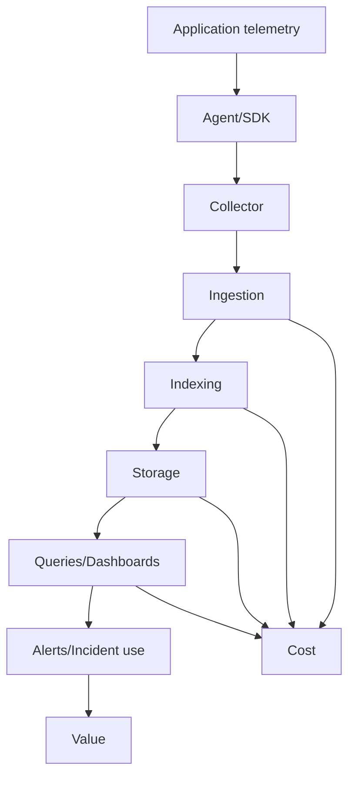

# Cheatsheet Observability Part 048 — Observability Cost Management

> Fokus part ini: mengelola biaya observability tanpa membuat production menjadi gelap. Observability yang baik bukan mengirim semua data. Observability yang baik adalah mengirim **signal yang cukup benar, cukup lengkap, cukup murah, dan cukup cepat** untuk menjawab pertanyaan production.

---

## 1. Core Mental Model

Observability memiliki biaya.

Biaya itu muncul di beberapa titik:

- telemetry generation di aplikasi;
- CPU/memory/network overhead;
- agent/collector processing;
- ingestion ke backend observability;
- storage hot/cold/archive;
- indexing;
- query execution;
- dashboard refresh;
- alert evaluation;
- retention;
- audit/compliance preservation;
- operational time untuk merawat noise.

Cost management bukan berarti mengurangi signal sembarangan.

Cost management berarti:

```text
Preserve high-value evidence.
Reduce low-value noise.
Control cardinality.
Set retention by use case.
Sample intelligently.
Prevent accidental telemetry explosions.
```



The goal is not lowest cost. The goal is best evidence-per-cost.

---

## 2. The Observability Cost Equation

A simple model:

```text
Observability cost = volume × cardinality × retention × query/index complexity × backend pricing model
```

Different signal types have different cost drivers.

| Signal | Main cost driver | Common explosion source |
|---|---|---|
| Logs | bytes ingested + indexed fields + retention | debug logs, stack traces, request/response bodies |
| Metrics | time series cardinality + scrape interval + retention | user/request/order ID labels, raw path labels |
| Traces | span volume + attributes + sampling + retention | tracing every request with many spans |
| Profiles | sample frequency + storage + symbol processing | always-on profiling with broad retention |
| Audit logs | retention + immutability + access controls | high-volume business actions retained too long in hot storage |
| Dashboards | query cost + refresh frequency | many panels over long windows/high-cardinality filters |
| Alerts | rule evaluation cost + operational noise | low-quality thresholds and high-cardinality grouping |

A cheap signal that no one can use is still waste.

An expensive signal that prevents long outages may be worth it.

---

## 3. Cost vs Visibility Trade-off

Do not optimize cost in isolation.

Use this decision model:

| Question | Interpretation |
|---|---|
| Does this signal answer a real production question? | If no, remove or reduce. |
| Is it used in dashboard, alert, incident, RCA, audit, or capacity planning? | If no, justify retention or remove. |
| Can the same question be answered by cheaper aggregation? | Prefer metric over high-volume logs when suitable. |
| Does reducing it hide rare critical failures? | Avoid blind sampling. |
| Can it be retained hot for short time and archived cold later? | Split retention by use case. |
| Is it high-cardinality by accident? | Fix labels/fields. |
| Is it high-cost only during debug mode? | Add bounded temporary debug controls. |

Good cost management is not:

```text
Turn off tracing because it is expensive.
```

Good cost management is:

```text
Sample normal successful traces, retain all error/slow/business-critical traces, reduce noisy span attributes, and use tail sampling at collector when available.
```

---

## 4. Log Volume Cost

Logs are often the largest cost source because they are easy to add and hard to control.

Major log volume drivers:

- INFO log inside loops;
- DEBUG enabled in production;
- repeated stack traces;
- retry logs per attempt at WARN/ERROR;
- logging full request/response body;
- logging large payloads/events;
- logging SQL with parameters;
- verbose framework logs;
- noisy health check/access logs;
- high-frequency background job logs;
- logging every message consumed from Kafka/RabbitMQ;
- logging every Redis command.

### Bad logging cost pattern

```java
for (OrderLine line : order.getLines()) {
    log.info("Processing line {} for order {} payload={}", line.getId(), order.getId(), line);
}
```

Problems:

- high cardinality business identifiers;
- potentially large payload;
- unbounded volume based on order size;
- may leak commercial data;
- often not needed for normal operations.

### Better pattern

```java
log.info("Order line processing completed orderId={} lineCount={} failedLineCount={} durationMs={}",
    orderId,
    lineCount,
    failedLineCount,
    durationMs
);
```

For failed lines, log bounded details only:

```java
log.warn("Order line processing failed orderId={} lineId={} errorCode={} retryable={}",
    orderId,
    lineId,
    errorCode,
    retryable
);
```

---

## 5. Log Event Value Classification

Classify logs by value.

| Log type | Value | Retention/cost strategy |
|---|---|---|
| request start/end summary | high | keep structured, avoid body |
| unexpected exception | high | keep stack trace, deduplicate where possible |
| business state transition | high | keep as event/audit depending purpose |
| security event | high | retain according to policy |
| audit event | very high | immutable/longer retention if required |
| retry attempt | medium | aggregate or sample after threshold |
| debug trace | low unless active incident | disabled or temporary scoped enablement |
| health check access log | low | sample/drop/route separately |
| successful per-message log | often low | prefer metrics and sampled logs |
| full payload log | risky | avoid except controlled secure debug path |

A log should earn its ingestion cost.

Ask:

```text
What incident question does this log answer that cannot be answered cheaper?
```

---

## 6. Structured Log Field Cost

Structured logging improves queryability but can increase indexing cost.

Not every field needs to be indexed.

Field categories:

| Category | Example | Index? |
|---|---|---|
| routing/search key | service, environment, level, route, status | usually yes |
| correlation | trace_id, correlation_id, request_id | usually yes |
| bounded dimension | error_code, dependency_name, event_type | usually yes |
| business key | quote_id, order_id | depends on policy/use case |
| high-cardinality detail | raw URL, user ID, raw error message | usually no or restricted |
| sensitive data | token, password, PII | do not log |
| payload | request/response body | avoid or protect heavily |

Cost mistake:

```text
Index every JSON field by default.
```

Better:

```text
Define indexed fields explicitly based on incident, audit, and operational search needs.
```

---

## 7. Metric Cardinality Cost

Metric cost often explodes due to labels.

A metric time series is created for each unique combination of labels.

Example:

```text
http_server_requests_total{
  service="quote-api",
  method="POST",
  route="/quotes/{id}",
  status="500"
}
```

This is bounded.

Dangerous:

```text
http_server_requests_total{
  service="quote-api",
  method="POST",
  path="/quotes/Q-982173912",
  user_id="u-123456",
  request_id="req-abc",
  error_message="timeout after 1023ms to pricing tenant A"
}
```

This creates unbounded series.

### Cardinality multiplication

```text
series_count = routes × methods × status_codes × tenants × versions × pods × regions × extra_labels
```

Even bounded labels can multiply.

Example:

```text
50 routes × 5 methods × 8 status codes × 100 tenants × 20 pods = 4,000,000 series
```

This is why tenant label policy matters.

---

## 8. High-Cardinality Label Risk Table

| Label | Risk | Safer alternative |
|---|---|---|
| `request_id` | unique per request | use logs/traces, not metric label |
| `trace_id` | unique per trace | use exemplars if supported, not label |
| `user_id` | high cardinality + privacy | logs/audit with access control |
| `order_id` | high cardinality | logs/audit/search field, not metric label |
| `quote_id` | high cardinality | logs/audit/search field |
| raw `path` | unbounded | route template |
| raw `error.message` | unbounded | error code/class |
| SQL statement with params | unbounded + sensitive | SQL fingerprint |
| cache key | unbounded + sensitive | key pattern/hash/category |
| Kafka message key | high cardinality + privacy | key type/hash if necessary |
| tenant ID | medium/high depending tenants | evaluate policy; maybe allow top-level only |

Rule of thumb:

```text
Metrics are for aggregation. Logs/traces/audit are for individual identity.
```

---

## 9. Trace Volume Cost

Traces can become expensive when every request creates many spans.

Trace volume drivers:

- high request throughput;
- auto-instrumentation creates many spans;
- DB calls inside loops;
- Redis command per key;
- Kafka/RabbitMQ batch messages with per-message spans;
- background jobs processing large batches;
- verbose span events;
- large attributes;
- always-on 100% sampling;
- long retention.

Trace value is high because it gives causal path and latency breakdown.

But not every successful fast request must be retained.

Useful retention priority:

| Trace category | Retain priority |
|---|---|
| error traces | very high |
| slow traces | very high |
| SLO-violating traces | very high |
| business-critical transaction traces | high |
| canary/new release traces | high during rollout |
| rare endpoint traces | medium-high |
| normal fast high-volume success traces | low-medium |

This naturally leads to sampling strategy, which is covered deeper in Part 049.

---

## 10. Sampling as Cost Control

Sampling reduces volume. It also creates blind spots if done badly.

Common approaches:

| Sampling type | Benefit | Risk |
|---|---|---|
| head sampling | cheap, early decision | may drop error before knowing outcome |
| tail sampling | keeps error/slow traces | requires collector/backend support and buffering |
| probabilistic sampling | simple | may miss rare failure |
| error-biased sampling | preserves failures | needs error classification |
| latency-biased sampling | preserves slow requests | requires duration decision |
| business-critical sampling | preserves important transactions | needs domain tagging |
| debug sampling | temporary deep visibility | must be bounded and authorized |

Cost-safe sampling principle:

```text
Sample normal success aggressively. Preserve abnormal, slow, error, canary, and business-critical paths.
```

Do not sample audit logs in a way that violates compliance requirements.

---

## 11. Retention Cost

Retention should match use case.

Not every telemetry type needs the same retention.

| Use case | Typical retention need |
|---|---|
| live incident response | minutes to days, hot storage |
| post-incident RCA | days to weeks |
| trend/capacity planning | weeks to months, aggregated metrics |
| audit/compliance | months/years depending policy |
| security investigation | policy-driven, often longer |
| debug logs | short and scoped |
| raw traces | shorter than metrics/logs in many systems |
| aggregate SLO metrics | longer for reliability trend |

Retention strategy:

```text
Hot storage for fast incident search.
Cold storage/archive for compliance or long-term investigation.
Aggregated metrics for long-term trend.
Raw high-volume details for short windows.
```

Bad strategy:

```text
Keep all raw debug logs for 1 year.
```

Better strategy:

```text
Keep operational logs hot for 14-30 days, audit logs according to compliance, high-volume debug logs for hours/days only, and long-term aggregates for trend.
```

Exact retention must follow internal policy.

---

## 12. Dashboard Query Cost

Dashboards can be expensive even if telemetry volume is reasonable.

Cost drivers:

- too many panels;
- long time range by default;
- high refresh frequency;
- unbounded label filters;
- regex over high-cardinality labels;
- expensive log queries on every dashboard refresh;
- joining many sources dynamically;
- panels no one uses;
- per-tenant dashboards generated without governance.

Dashboard cost rules:

| Rule | Reason |
|---|---|
| Default to short operational windows | production triage usually starts recent |
| Use pre-aggregated metrics for overview | cheaper than log scans |
| Drill down only when needed | avoid expensive always-on queries |
| Avoid regex on high-cardinality labels | slow and costly |
| Separate executive vs incident dashboards | different query needs |
| Remove stale panels | stale dashboard still costs attention and sometimes query load |

An incident dashboard should be fast under pressure.

Slow dashboards are operational risk.

---

## 13. Alert Cost and Noise Cost

Alert cost is not only backend evaluation cost.

The largest alert cost is human attention.

Noisy alerts create:

- alert fatigue;
- slower incident response;
- ignored pages;
- unnecessary escalations;
- context switching;
- bad trust in observability;
- hidden real incidents.

Cost-aware alerting means:

- page on symptoms, not every cause;
- group/deduplicate related alerts;
- use burn-rate alerts for SLOs;
- avoid per-pod pages unless directly actionable;
- avoid alerts without runbooks;
- review noisy alerts regularly;
- route ticket-level alerts separately from paging alerts.

An alert that fires often and requires no action is expensive noise.

---

## 14. Java/JAX-RS Cost Hotspots

Common application-level cost sources:

| Area | Cost risk | Control |
|---|---|---|
| JAX-RS request logging | high-volume access logs | structured summary, no body, sample health checks |
| Exception logging | repeated stack traces | log once at boundary, deduplicate retry noise |
| MDC fields | excessive context fields | keep bounded core fields |
| HTTP client spans | span explosion for high-throughput calls | sampling and dependency aggregation |
| JDBC spans | many spans in loops | optimize query pattern, sample/aggregate carefully |
| Redis spans | per-command high volume | avoid key labels, sample normal success |
| Kafka consumer logs | per-message success logs | metrics for success, logs for failures/summary |
| Background jobs | per-item logs | batch summary + bounded failure details |
| Debug logging | huge ingestion spikes | temporary scoped enablement with expiry |

For JAX-RS services, a common mistake is logging full request and response bodies “for debugging”.

That creates:

- high cost;
- PII leakage;
- latency overhead;
- storage retention risk;
- noisy incident search.

Use targeted safe debug capture only with approval and expiry.

---

## 15. PostgreSQL/MyBatis/JPA/JDBC Cost Concerns

Database observability can be expensive if raw SQL and parameters are logged carelessly.

Cost and risk drivers:

- SQL parameter logging;
- large query plans in logs;
- per-row logs;
- transaction debug logs;
- ORM bind value logs in production;
- high-cardinality SQL labels;
- query text as metric label.

Better patterns:

| Need | Better signal |
|---|---|
| slow query detection | slow query metric/log with fingerprint |
| query type aggregation | SQL fingerprint or operation name |
| request-to-query correlation | trace span with sanitized statement |
| pool exhaustion | pool metrics |
| lock contention | DB lock metrics/logs |
| failed query detail | error code + SQL state + sanitized operation |

Do not put raw SQL with user input into metric labels.

---

## 16. Kafka/RabbitMQ/Redis/Camunda Cost Concerns

### Kafka/RabbitMQ

Avoid logging every successful message at INFO.

Prefer:

- consume rate metric;
- processing latency histogram;
- error count by error code;
- DLQ count;
- lag/queue depth;
- sampled trace for successful flows;
- detailed log only for failures or bounded summaries.

### Redis

Avoid labels/fields with raw keys.

Prefer:

- command type;
- key pattern/category;
- cache name;
- hit/miss metric;
- latency histogram;
- slowlog for expensive commands.

### Camunda/workflow

Avoid logging every variable or full process payload.

Prefer:

- process definition key/version;
- process instance ID only if policy allows;
- task aging metric;
- failed job count;
- incident count;
- correlation failure logs;
- audit/event for state transitions.

---

## 17. OpenTelemetry Collector as Cost Control Point

The collector can help manage cost before telemetry reaches backend.

Possible controls:

| Collector capability | Cost role |
|---|---|
| batch processor | reduces export overhead |
| memory limiter | protects collector stability |
| attributes processor | drops/renames risky attributes |
| resource processor | normalizes service metadata |
| filter processor | drops low-value telemetry |
| probabilistic sampler | reduces trace volume |
| tail sampling | preserves important traces |
| routing | sends high-value telemetry to right backend |
| transform | normalizes fields and reduces duplication |

Collector policy examples:

```text
Drop health check traces.
Keep all error traces.
Keep all traces above latency threshold.
Drop sensitive headers from span attributes.
Limit noisy instrumentation attributes.
```

Internal collector capabilities and allowed processors must be verified with platform/SRE.

---

## 18. Cost Guardrails

Cost guardrails prevent accidental explosions.

Recommended guardrails:

- telemetry budget per service/team;
- top log volume dashboard;
- top metric cardinality dashboard;
- top expensive dashboard queries;
- alert on sudden ingestion spike;
- alert on sudden series count spike;
- PR checklist for new metrics/logs/traces;
- disallowed metric label list;
- sensitive log field scanner;
- debug logging expiry mechanism;
- retention policy by signal type;
- ownership for each dashboard/alert/metric namespace.

Example ingestion spike alert:

```text
Log ingestion for quote-api increased >3x compared with same time window yesterday for 30 minutes.
```

This is an observability incident: the telemetry system itself may become expensive or degraded.

---

## 19. Cost-Aware Signal Design Patterns

### Pattern 1 — Summary log + metric + trace sample

For high-volume success flows:

- use metrics for count/latency;
- use sampled traces for path shape;
- use summary logs for batch/request completion;
- use detailed logs for failure only.

### Pattern 2 — Error code instead of raw message

Bad metric:

```text
order_failures_total{error_message="Timeout after 1032ms waiting for pricing tenant A"}
```

Better:

```text
order_failures_total{error_code="PRICING_TIMEOUT", retryable="true"}
```

### Pattern 3 — Route template instead of raw path

Bad:

```text
path="/quotes/Q-12345/items/I-999"
```

Better:

```text
route="/quotes/{quoteId}/items/{itemId}"
```

### Pattern 4 — Event summary instead of full payload

Bad:

```text
payload={...large quote/order object...}
```

Better:

```text
eventName=QuotePriced schemaVersion=3 itemCount=12 totalAmountBucket=large
```

### Pattern 5 — Temporary debug window

Debug mode should include:

- scope: service/route/tenant/correlation ID;
- expiry time;
- actor/change ticket;
- sensitive field protection;
- volume limit;
- automatic revert.

---

## 20. Failure Modes

| Failure mode | Evidence | Mitigation |
|---|---|---|
| log volume spike | ingestion dashboard, top logger | reduce level, sample/drop noisy source |
| metric cardinality explosion | series count spike | remove high-cardinality labels |
| trace backend overloaded | span ingestion spike | sampling/filtering, drop noisy spans |
| dashboard slow during incident | query latency, timeout | simplify panels, pre-aggregate |
| debug left enabled | DEBUG volume sustained | expiry/revert, alert on debug volume |
| PII logged | scanner/security alert | stop source, purge per policy, incident process |
| audit hot storage too costly | audit volume/retention | tiered retention, immutable archive |
| tenant label explosion | high series by tenant | aggregate or allowlist top tenants |
| health check log noise | top route log volume | drop/sample health logs |
| retry storm log noise | repeated WARN/ERROR | aggregate retry logs, log terminal failure |

---

## 21. Debugging an Observability Cost Spike

Use this flow:

1. Identify which signal spiked: logs, metrics, traces, profiles, dashboards, or alerts.
2. Identify source service/team/environment.
3. Identify whether spike started after deployment/config/debug change.
4. For logs: find top logger, level, event type, route, exception class.
5. For metrics: find top metric namespace and label cardinality.
6. For traces: find top service/span name/route and sampling behavior.
7. For dashboards: find expensive queries and refresh frequency.
8. For alerts: find noisy rules and grouping keys.
9. Decide immediate mitigation: lower log level, disable debug, drop/filter field, reduce sampling, pause dashboard refresh, fix label.
10. Add preventive guardrail: PR checklist, alert, linter, collector rule, dashboard owner review.

Cost spike analysis is incident debugging for the observability platform.

---

## 22. Cost vs Correctness Concerns

Reducing telemetry can break correctness of debugging.

Examples:

| Optimization | Risk |
|---|---|
| drop all successful traces | cannot compare success vs failure path |
| sample logs randomly | may lose exact failure event |
| remove tenant dimension entirely | cannot assess tenant blast radius |
| remove version label | cannot debug canary regression |
| shorten retention too much | RCA loses evidence |
| drop audit details | compliance evidence incomplete |
| aggregate too early | hides route-specific failure |
| remove stack traces | slows root cause analysis |

Cost optimization must preserve required questions:

```text
Can we still detect the problem?
Can we still scope impact?
Can we still correlate logs/traces/metrics?
Can we still prove audit/security events?
Can we still perform RCA after retention window?
```

---

## 23. Security and Privacy Cost Interaction

Security/privacy and cost often align.

Not logging sensitive data reduces:

- breach risk;
- retention burden;
- access-control complexity;
- storage volume;
- purge complexity;
- compliance exposure.

But security controls can also add cost:

- immutable audit retention;
- restricted search backend;
- encryption;
- longer security log retention;
- access audit logs;
- data loss prevention scanning.

Cost decision must not override compliance requirements.

For sensitive telemetry:

```text
Minimize collection.
Mask/redact at source where possible.
Restrict access.
Set policy-driven retention.
Audit access.
```

---

## 24. Operational Ownership

Every high-cost telemetry source should have an owner.

Ownership questions:

- Who owns this metric namespace?
- Who owns this dashboard?
- Who owns this alert rule?
- Who approves new indexed log fields?
- Who reviews high-cardinality labels?
- Who can enable debug logging?
- Who pays or is accountable for telemetry budget?
- Who decides retention exceptions?
- Who handles PII leakage in telemetry?

Without ownership, observability cost becomes everyone’s problem and no one’s responsibility.

---

## 25. PR Review Checklist

When reviewing instrumentation/logging changes, ask:

- Is this signal needed for a known production question?
- Is the signal already available elsewhere?
- Is the metric label set bounded?
- Are route/path labels templated?
- Are request/user/order/quote IDs avoided as metric labels?
- Are sensitive fields excluded or masked?
- Could this log fire inside a loop or high-volume path?
- Could retry behavior create log spam?
- Could this span be emitted per item/message/Redis key?
- Is debug logging temporary and scoped?
- Is retention appropriate for the signal type?
- Is the dashboard query cost acceptable?
- Does this change require collector filtering or sampling update?
- Does this preserve enough evidence for incident and RCA?

---

## 26. Internal Verification Checklist

Verify internally with CSG/team before assuming details:

- observability backend pricing/cost model;
- log ingestion dashboard;
- metric cardinality dashboard;
- trace volume dashboard;
- retention policy by signal type;
- audit retention/compliance policy;
- indexed log fields policy;
- allowed/disallowed metric labels;
- tenant label policy;
- debug logging policy and expiry mechanism;
- OpenTelemetry Collector filtering/sampling capabilities;
- top noisy services/loggers/metrics;
- top expensive dashboards/queries;
- cost ownership per team/service;
- alert on telemetry ingestion spike;
- process for approving high-cost telemetry;
- PII/secret scanning for logs;
- incident history involving telemetry cost or backend overload.

---

## 27. Practical Mastery Exercise

Pick one production service and answer:

```text
1. What is its average daily log volume?
2. What are its top 10 log event types by volume?
3. Which logger produces the most data?
4. Which metrics have the highest cardinality?
5. Are any labels unbounded?
6. What percentage of traces are retained?
7. Are error/slow traces preserved better than normal success traces?
8. Which dashboards query the most data?
9. What telemetry is retained hot vs cold?
10. Which signal could be reduced without hurting incident debugging?
11. Which signal is expensive but must stay because it protects reliability/audit/security?
```

If no one can answer these, observability cost is unmanaged.

---

## 28. Key Takeaways

- Observability cost is driven by volume, cardinality, retention, indexing, query patterns, and human attention.
- Cost optimization must preserve production evidence.
- Logs are expensive when verbose; metrics are expensive when cardinality explodes; traces are expensive when everything is retained blindly.
- High-value signals should be protected; low-value noise should be reduced.
- Sampling, retention, collector filtering, and label governance are cost controls.
- Senior engineers should treat observability cost as architecture and production readiness concern, not only platform billing concern.
