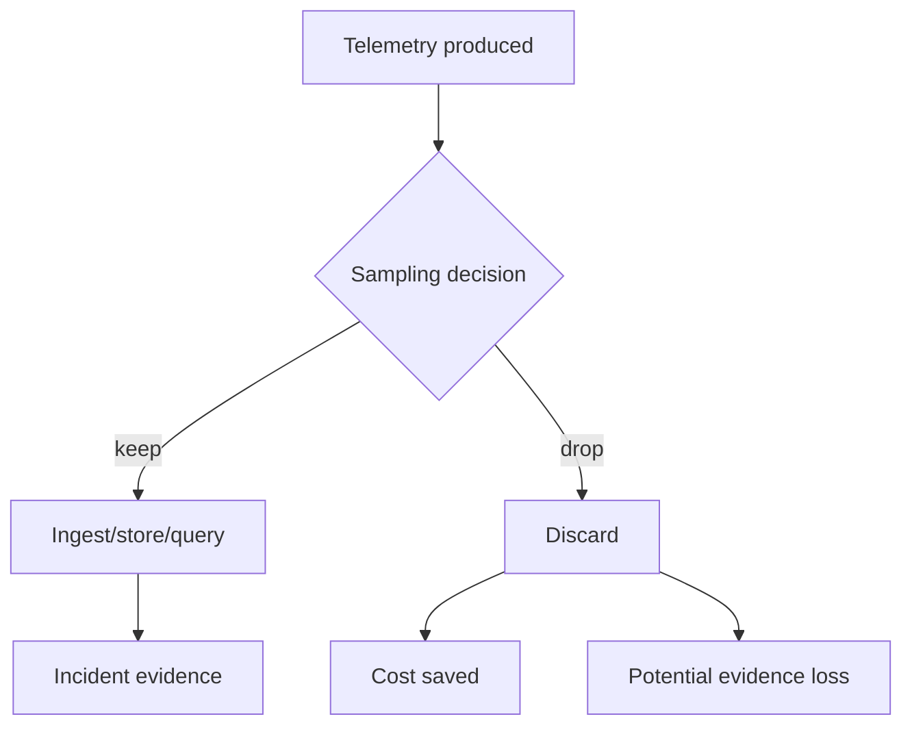
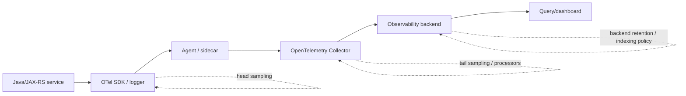
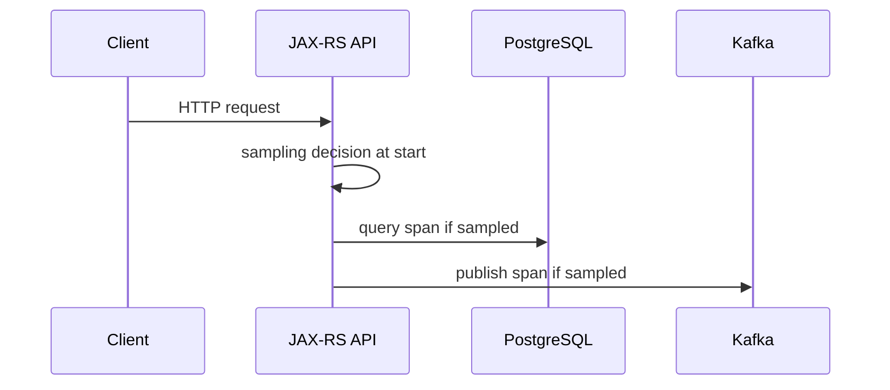
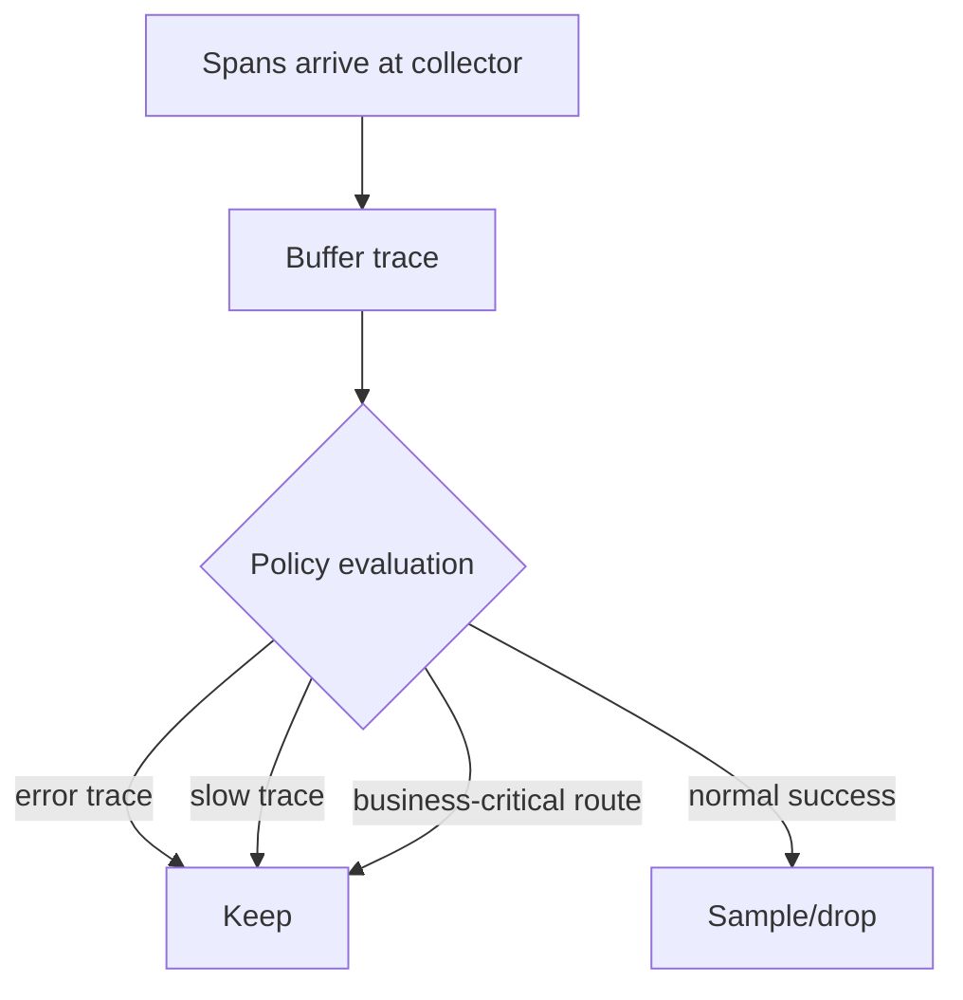
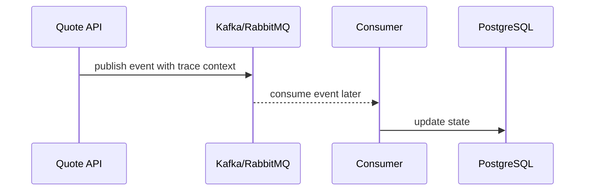

# Cheatsheet Observability Part 049 — Sampling Strategy

> Fokus part ini: memahami sampling sebagai **evidence selection strategy**, bukan sekadar cost reduction. Sampling yang buruk membuat incident tidak bisa direkonstruksi. Sampling yang baik menurunkan biaya sambil tetap mempertahankan error, slow transaction, business-critical transaction, dan trace yang berguna untuk debugging.

---

## 1. Core Mental Model

Sampling adalah proses memilih sebagian telemetry untuk dikirim, disimpan, atau diindeks.

Sampling diperlukan karena:

- traffic production besar;
- log volume mahal;
- trace volume sangat besar;
- span attributes bisa membesar;
- backend observability punya batas ingestion/storage/query;
- tidak semua successful request punya nilai debugging yang sama;
- beberapa signal lebih bernilai saat error atau latency tinggi.

Tetapi sampling berbahaya jika dilakukan tanpa disiplin.

Sampling yang buruk:

```text
Drop random telemetry until cost goes down.
```

Sampling yang baik:

```text
Preserve critical evidence.
Reduce repetitive success noise.
Bias retention toward errors, latency, rare paths, and business-critical flows.
Make sampling behavior visible and reviewable.
```



The engineering question is not:

```text
What percentage should we sample?
```

The better question is:

```text
Which production questions must remain answerable after sampling?
```

---

## 2. What Can Be Sampled

Sampling can apply to several signal types.

| Signal | Sampling style | Typical use |
|---|---|---|
| Logs | rate sampling, keyed sampling, event-class sampling | reduce repeated low-value logs |
| Traces | head sampling, tail sampling, parent-based sampling | reduce successful trace volume |
| Metrics | usually not sampled; aggregated instead | metrics should remain statistically stable |
| Profiles | interval/sample frequency control | reduce profiling overhead |
| Audit logs | usually not sampled | audit evidence must be complete by policy |
| Events | usually not sampled if business-critical | event stream correctness matters |
| Access logs | sample/drop health checks or static noise | reduce edge log volume |

Important rule:

```text
Do not sample audit logs unless policy explicitly allows it.
```

For CPQ/order systems, business events such as quote approval, order submission, cancellation, amendment, fallout creation, and fulfillment failure often require complete or near-complete evidence.

---

## 3. Sampling Is Not the Same as Aggregation

Sampling drops individual records.

Aggregation summarizes many records into a lower-cardinality signal.

Example:

```text
10,000 successful request logs
```

Can become:

```text
http.server.request.duration histogram by service, route, method, status_code
```

That is aggregation, not sampling.

Prefer aggregation when you only need trends.

Prefer sampling when you still need representative individual examples.

Prefer full retention when you need complete evidence.

| Need | Better approach |
|---|---|
| count requests | counter/histogram, not log sampling |
| inspect example failed payload metadata | keep failed logs/traces |
| audit who changed quote status | complete audit log |
| debug rare latency outlier | tail sampling or slow trace retention |
| reduce health check noise | drop/sample health access logs |
| understand per-tenant reliability | low-cardinality tenant aggregation only if allowed |

---

## 4. Sampling Decision Points

Sampling can happen in multiple places.



### Application-level sampling

Pros:

- reduces CPU/network early;
- can use application context;
- useful for logs.

Cons:

- hard to change globally;
- may drop before collector can evaluate full trace;
- dangerous if business context is incomplete.

### SDK/agent sampling

Pros:

- standard for tracing;
- can be configured per service;
- cheap.

Cons:

- often head-based;
- cannot know final latency/error at request start.

### Collector sampling

Pros:

- centralized;
- supports richer policies;
- tail sampling can decide after seeing spans.

Cons:

- requires buffering;
- increases collector memory;
- collector failure can lose telemetry.

### Backend sampling/retention

Pros:

- easy to tune operationally;
- no app change.

Cons:

- ingestion cost already paid;
- not useful for reducing network/collector cost.

---

## 5. Log Sampling

Log sampling reduces repeated log events.

It should be used for repetitive, low-value, high-volume logs.

Good candidates:

- health check access logs;
- repeated retry attempt logs;
- successful per-message processing logs;
- repetitive validation failures with same error code;
- noisy framework logs;
- high-frequency cache hit logs;
- background job progress logs inside loops.

Bad candidates:

- audit logs;
- security events;
- unexpected exceptions;
- payment/order/quote state transitions;
- data correction events;
- manual override events;
- permission changes;
- DLQ events;
- irreversible actions;
- first occurrence of a new error.

### Bad log sampling pattern

```java
if (random.nextDouble() < 0.01) {
    log.error("Order submission failed orderId={} errorCode={}", orderId, errorCode, ex);
}
```

This can drop the only evidence for a customer-impacting failure.

### Better pattern

```java
log.error("Order submission failed orderId={} errorCode={} retryable={} correlationId={}",
    safeOrderRef,
    errorCode,
    retryable,
    correlationId,
    ex
);
```

Then sample only repeated low-value success/noise events:

```java
if (sampler.allow("order-line-success", orderId)) {
    log.info("Order line processed sample=true orderIdHash={} lineCount={} durationMs={}",
        hashForDebug(orderId),
        lineCount,
        durationMs
    );
}
```

Note: do not hash sensitive identifiers casually without internal approval. Hashes can still be sensitive if reversible by dictionary or joined with other data.

---

## 6. Log Sampling Types

### 6.1 Random rate sampling

Keeps a fixed percentage of events.

Example:

```text
Keep 1% of successful request summary logs.
```

Pros:

- simple;
- cheap;
- good for uniform noise.

Cons:

- can miss rare but important cases;
- not stable per entity;
- bad for debugging one customer/order.

### 6.2 Keyed deterministic sampling

Samples based on a stable key.

Example:

```text
Keep logs when hash(correlation_id) modulo 100 == 0.
```

Pros:

- all sampled events for same key can stay together;
- better for reconstructing a sampled transaction.

Cons:

- bad key choice can leak or bias;
- high-cardinality key still must not become a metric label;
- may exclude an important customer/entity consistently.

### 6.3 Event-class sampling

Samples by event type.

Example:

```text
health_check_access_log: 0.1%
request_success_summary: 5%
validation_error: 100%
unexpected_exception: 100%
security_event: 100%
audit_event: 100%
```

This is usually better than one global sampling rate.

### 6.4 Burst-aware sampling

Allows the first N events, then samples repeated events.

Useful for:

- retry storms;
- repeated timeout logs;
- repeated DLQ logs;
- repeated validation errors from same client.

Goal:

```text
Keep enough evidence to understand the burst, not every identical record.
```

---

## 7. Trace Sampling

Trace sampling decides which distributed traces are retained.

A trace may contain many spans:

- HTTP server span;
- JAX-RS resource span;
- service layer span;
- JDBC span;
- Redis span;
- Kafka/RabbitMQ producer span;
- downstream HTTP client span;
- background consumer span.

Retaining every trace in high-traffic systems can be expensive.

But dropping the wrong traces destroys debugging value.

---

## 8. Head Sampling

Head sampling decides early, usually when the root span starts.



Pros:

- low overhead;
- simple;
- widely supported;
- avoids collecting spans that will be dropped.

Cons:

- cannot know final error or latency;
- may drop failed/slow requests if decision is random;
- weak for rare incident debugging.

Head sampling is acceptable for normal successful high-volume traffic.

It is risky for:

- low-volume critical endpoints;
- order submission;
- quote approval;
- payment-like commercial actions;
- asynchronous failure paths;
- rare timeout chains;
- long-running workflows.

---

## 9. Parent-Based Sampling

Parent-based sampling follows the upstream decision.

If incoming request is sampled, downstream spans stay sampled.

If incoming request is not sampled, downstream may not sample.

Pros:

- keeps trace continuity;
- avoids broken traces;
- simple for microservices.

Cons:

- if the entry service drops the trace, downstream evidence may disappear;
- can propagate bad sampling decisions;
- external traffic may arrive with unexpected sampling flags.

Important boundary rule:

```text
Trust propagation headers only according to internal boundary policy.
```

At public ingress, sampling decisions from external clients may need to be ignored or normalized.

---

## 10. Tail Sampling

Tail sampling decides after observing the trace or enough spans.



Tail sampling can keep:

- error traces;
- high-latency traces;
- traces with specific status codes;
- traces from critical endpoints;
- traces containing retry/DLQ spans;
- traces containing specific span attributes;
- traces from low-volume services;
- representative successful traces.

Pros:

- much better debugging value;
- can preserve failures and outliers;
- can encode business-aware policies.

Cons:

- collector needs memory/buffering;
- delayed decisions;
- more complex to operate;
- collector overload can drop telemetry;
- requires careful policy testing.

Tail sampling is often the right production strategy for mature systems, but only if collector reliability is treated seriously.

---

## 11. Sampling Policy Hierarchy

A practical hierarchy:

```text
1. Always keep audit/security/compliance-required events.
2. Always keep unexpected errors and failed business-critical transitions.
3. Always keep slow traces above meaningful latency thresholds.
4. Always keep traces with retry exhaustion, DLQ, timeout, or circuit breaker open.
5. Keep critical low-volume endpoints at high rate or 100%.
6. Sample normal successful high-volume endpoints.
7. Drop or heavily sample known low-value noise.
```

Example policy table:

| Telemetry class | Suggested strategy |
|---|---|
| audit event | 100%, no sampling unless policy allows |
| security event | 100% or policy-defined retention |
| unexpected exception | 100% |
| validation error | often 100% aggregate + sampled examples |
| 5xx trace | 100% |
| 4xx trace | depends on endpoint and reason |
| slow request trace | 100% above threshold |
| order submission trace | high or 100% depending volume/policy |
| quote search success trace | sampled |
| health check access log | drop/sample heavily |
| debug log | temporary, bounded, scoped |

---

## 12. Error-Biased Sampling

Error-biased sampling preserves traces/logs with error signals.

Keep telemetry when:

- HTTP status is 5xx;
- span status is error;
- exception was recorded;
- downstream dependency returned error;
- retry exhausted;
- message moved to DLQ;
- workflow incident created;
- invalid state transition occurred;
- security violation occurred;
- audit action failed.

Failure mode:

```text
Only sampling explicit ERROR logs while missing WARN-level degradation.
```

Some important failures are not logged as ERROR:

- timeout retried successfully;
- circuit breaker half-open;
- consumer lag increasing;
- cache hit ratio collapse;
- state aging;
- SLA freshness breach;
- PostgreSQL lock wait;
- queue delay.

Error-biased sampling must be combined with latency, saturation, and business-critical policies.

---

## 13. Latency-Biased Sampling

Latency-biased sampling preserves slow traces.

Useful thresholds:

- endpoint-specific p95/p99 expectation;
- SLO threshold;
- dependency timeout threshold;
- queue/message age threshold;
- workflow task aging threshold;
- customer-facing timeout threshold.

Bad threshold:

```text
Keep traces slower than 5 seconds for all endpoints.
```

Why bad?

- 300 ms may be slow for search/autocomplete;
- 5 seconds may be acceptable for async submission;
- one global threshold hides endpoint-specific degradation.

Better:

```text
Keep traces when duration > endpoint-specific SLO threshold.
```

For Java/JAX-RS services:

| Endpoint type | Sampling concern |
|---|---|
| quote search | preserve slow query/cache traces |
| quote price calculation | preserve CPU/dependency-heavy traces |
| order submit | preserve full critical path |
| approval action | preserve state transition and audit evidence |
| reconciliation job trigger | preserve job outcome and downstream spans |
| health endpoint | heavily sample/drop |

---

## 14. Business-Critical Sampling

Business-critical sampling keeps telemetry for important business flows even if technically successful.

Examples in CPQ/order management:

- quote creation;
- quote pricing;
- quote approval/rejection;
- quote acceptance;
- order submission;
- order validation;
- order decomposition;
- fulfillment start/failure;
- fallout creation;
- cancellation request;
- amendment request;
- manual override;
- reconciliation mismatch.

Do not assume:

```text
Successful request means low debugging value.
```

A successful request can still create downstream business inconsistency.

For business-critical flows, sampling should consider:

- volume;
- customer impact;
- audit requirements;
- regulatory/commercial sensitivity;
- ability to reconstruct from audit/event store;
- privacy risk;
- retention requirement.

---

## 15. Per-Service Sampling

Different services need different rates.

| Service type | Sampling guidance |
|---|---|
| high-volume read API | sample successful traces more aggressively |
| low-volume critical command service | keep more traces |
| workflow orchestrator | preserve incidents and long-running transitions |
| event consumer | preserve failed/retried/DLQ processing |
| cache-heavy service | sample cache successes, keep errors/latency |
| edge/API gateway | sample normal access logs, keep anomalies |
| background reconciliation | keep job summaries and mismatches |

Avoid global sampling rates that ignore service role.

A `1% trace sampling everywhere` policy can be disastrous for low-volume critical services.

---

## 16. Per-Endpoint Sampling

Endpoint behavior matters.

Better route labels:

```text
GET /quotes/{quoteId}
POST /quotes
POST /quotes/{quoteId}/approve
POST /orders/{orderId}/submit
GET /health
```

Poor route labels:

```text
GET /quotes/Q-123456
POST /orders/O-999999/submit
```

Sampling strategy by endpoint:

| Endpoint | Successful trace | Error trace | Slow trace |
|---|---:|---:|---:|
| `/health` | drop/heavy sample | keep if unexpected | maybe keep |
| `GET /quotes/{id}` | sample | keep | keep |
| `POST /quotes` | high keep | keep | keep |
| `POST /quotes/{id}/approve` | high/100% | keep | keep |
| `POST /orders/{id}/submit` | high/100% | keep | keep |
| admin/debug endpoint | policy-dependent | keep | keep |

Sampling config should use route templates, not raw paths.

---

## 17. Sampling Across Async Boundaries

Async systems complicate sampling.

A synchronous trace may publish a Kafka/RabbitMQ message, then processing continues later.



Questions:

- Should the consumer trace follow producer trace?
- What if producer trace was not sampled?
- Should failed consumer processing be kept even if producer was not sampled?
- Should DLQ traces always be kept?
- Should event age influence sampling?

Recommended principles:

```text
Consumer failures should be observable even when producer trace was not sampled.
DLQ/retry exhaustion should be retained.
High event age should bias trace retention.
Business-critical events should have stronger retention.
```

Do not let parent-based sampling hide consumer failures.

---

## 18. Sampling and Logs/Traces Correlation

Sampling can break the expected relationship between logs and traces.

Possible states:

| Log exists | Trace exists | Interpretation |
|---|---|---|
| yes | yes | ideal for debugging |
| yes | no | trace was sampled out or propagation failed |
| no | yes | logs sampled/missing or log level too low |
| no | no | blind spot |

Operationally, error logs should usually include:

- trace ID;
- span ID;
- correlation ID;
- request ID;
- business key where allowed;
- error code;
- route/template;
- service/version.

Even if trace is sampled out, the trace ID in logs can still help identify correlation gaps or sampling decisions.

---

## 19. Sampling and Metrics

Metrics are usually aggregated, not sampled.

Do not sample request counters randomly unless you understand the statistical impact.

Bad:

```text
Only increment request_total for 10% of requests.
```

This corrupts rate, error rate, SLO, burn rate, and capacity planning.

Better:

```text
Record all request metrics with bounded labels.
Sample logs/traces for successful requests.
```

Metric volume should be controlled by:

- label governance;
- route templating;
- histogram bucket discipline;
- scrape interval;
- retention policy;
- metric lifecycle management;
- dropping unused metrics;
- avoiding high-cardinality dimensions.

---

## 20. Debug Sampling

Sometimes production debugging needs temporary extra telemetry.

Debug sampling should be:

- scoped;
- time-bounded;
- approved when sensitive;
- visible;
- reversible;
- audited if needed.

Possible scopes:

- service;
- endpoint;
- tenant;
- correlation ID;
- request ID;
- feature flag;
- environment;
- canary version;
- specific error code.

Dangerous debug pattern:

```text
Enable DEBUG globally in production for several days.
```

Better pattern:

```text
Enable extra telemetry for one service, one route, one hour, excluding payload/body and sensitive headers.
```

Debug telemetry must still obey privacy rules.

---

## 21. Sampling Risk Model

Sampling introduces several risks.

| Risk | Example | Mitigation |
|---|---|---|
| missing rare error | failed order trace dropped | keep all errors |
| missing slow request | head sampling dropped latency outlier | tail sampling for slow traces |
| biased evidence | only successful traces retained | error/latency/business policies |
| broken async visibility | producer not sampled, consumer failure hidden | keep consumer failures independently |
| audit gap | audit event sampled | no sampling for audit |
| misleading incident analysis | sampled logs look like lower volume | use metrics for counts |
| privacy leak | debug sampling includes payload | redaction and approval |
| cost explosion | tail sampling buffer too large | collector capacity planning |
| inconsistent service policy | service A samples differently from B | governance and review |

A sampling strategy must be documented because it changes what evidence exists.

---

## 22. Sampling Failure Modes

### 22.1 The incident trace was sampled out

Symptom:

```text
Error log has trace_id, but trace backend has no trace.
```

Possible causes:

- head sampling dropped trace;
- collector dropped spans;
- backend retention expired;
- wrong environment/service attribute;
- trace ID not propagated to backend;
- backend search window incorrect;
- span export failed.

Debug steps:

1. Search logs by trace ID and correlation ID.
2. Check sampler config for service/version.
3. Check collector drop metrics.
4. Check exporter errors.
5. Check trace backend retention.
6. Check whether route/error should have been retained.
7. Add sampling rule if this class of incident should be retained.

### 22.2 Successful flows are invisible

Symptom:

```text
Only errors have traces; no baseline success examples exist.
```

Problem:

- hard to compare normal vs abnormal;
- dependency latency baseline missing;
- performance tuning lacks evidence.

Mitigation:

- keep small representative success sample;
- keep more for critical endpoints;
- keep baseline traces after releases.

### 22.3 Sampling hides tenant/customer impact

Symptom:

```text
Metrics show error spike but sampled traces do not include impacted tenant/customer segment.
```

Mitigation:

- use metrics for aggregate impact;
- avoid user/order labels in metrics;
- use controlled tenant dimension only if allowed;
- use logs/audit/business reports for entity-level investigation;
- consider temporary scoped debug telemetry with approval.

### 22.4 Tail sampling overload

Symptom:

```text
Collector CPU/memory rises, spans dropped, traces incomplete.
```

Mitigation:

- reduce buffer duration;
- scale collector;
- reduce span volume;
- add memory limiter;
- tune batch processor;
- simplify policies;
- monitor collector self-telemetry.

---

## 23. Java/JAX-RS Sampling Design

For a Java/JAX-RS service, sampling strategy should account for:

- request route template;
- HTTP method;
- status code;
- exception mapping;
- business operation;
- tenant/customer context if allowed;
- deployment version;
- feature flag;
- downstream dependency calls;
- async publish/consume boundaries;
- job execution context.

Example request classification:

```text
route = POST /orders/{id}/submit
operation = order_submit
businessCritical = true
status = 500
latencyMs = 2300
retryExhausted = false
```

Sampling decision:

```text
keep trace = true
keep error log = true
keep audit/business event = true according to policy
record metrics = true
```

Example low-value request:

```text
route = GET /health
status = 200
latencyMs = 3
```

Sampling decision:

```text
keep trace = false or very low sample
access log = drop or heavy sample
record health metric = yes if useful
```

---

## 24. Sampling and Privacy

Sampling does not solve privacy.

A sampled sensitive log is still a privacy incident.

Do not rely on:

```text
Only 1% of payload logs are retained.
```

That is still unacceptable if payload contains secrets, PII, credentials, tokens, or commercial sensitive information.

Privacy controls must happen before sampling:

```text
redact/mask/avoid sensitive data first;
then sample only allowed fields.
```

Sensitive data examples:

- Authorization header;
- Cookie;
- session ID;
- API key;
- password;
- token;
- full customer name/email/phone/address;
- raw quote/order payload;
- pricing/commercial terms;
- payment-like data;
- internal credentials;
- database connection strings.

---

## 25. Sampling and SLOs

SLO calculation should not depend on sampled traces/logs.

SLOs should be based on reliable metrics or authoritative event data.

Bad:

```text
Availability SLO = percentage of sampled traces without error.
```

Better:

```text
Availability SLO = all request metrics by route/status or load balancer/API gateway metrics.
```

Traces support SLO debugging.

Metrics measure SLO compliance.

Logs/audit provide evidence.

---

## 26. Sampling Review Questions

Ask these before accepting a sampling strategy:

1. Which telemetry classes are never sampled?
2. Are audit/security events protected?
3. Are 5xx/error traces always retained?
4. Are slow traces retained by endpoint-specific thresholds?
5. Are business-critical flows retained at higher rate?
6. Can consumer failures be retained even if producer trace was dropped?
7. Are successful baseline traces still available?
8. Are health checks and noisy low-value logs reduced?
9. Is sampling visible in documentation and dashboards?
10. Are collector/backend drop rates monitored?
11. Does sampling affect SLO correctness?
12. Does sampling create privacy risk through debug modes?
13. Can sampling be changed safely during incident?
14. Are sampling rules tested after deployment?

---

## 27. PR Review Checklist

When reviewing code or config that changes sampling:

- [ ] Does it define what is sampled and what is never sampled?
- [ ] Does it preserve unexpected errors?
- [ ] Does it preserve slow traces?
- [ ] Does it preserve business-critical transactions?
- [ ] Does it avoid sampling audit logs?
- [ ] Does it avoid corrupting metrics?
- [ ] Does it document per-service/per-endpoint policy?
- [ ] Does it use route templates instead of raw paths?
- [ ] Does it avoid sensitive debug sampling?
- [ ] Does it account for async Kafka/RabbitMQ consumers?
- [ ] Does it account for background jobs?
- [ ] Does it monitor collector/backend drops?
- [ ] Does it include rollback instructions?
- [ ] Does it explain cost vs evidence trade-off?

---

## 28. Internal Verification Checklist

Verify internally before relying on sampling assumptions:

- [ ] What is the default trace sampling rate per environment?
- [ ] Is sampling configured in app, agent, collector, backend, or multiple layers?
- [ ] Is parent-based sampling enabled?
- [ ] Is tail sampling used anywhere?
- [ ] Are 5xx traces always retained?
- [ ] Are slow traces retained?
- [ ] Are critical business endpoints retained at higher rates?
- [ ] Are Kafka/RabbitMQ consumer failures retained independently?
- [ ] Are DLQ/retry-exhausted traces retained?
- [ ] Are audit/security logs excluded from sampling?
- [ ] Are health check logs dropped/sampled?
- [ ] Are collector drop metrics monitored?
- [ ] Are exporter failures monitored?
- [ ] Is sampling policy documented?
- [ ] Can sampling be adjusted during incident?
- [ ] Who approves debug telemetry changes?
- [ ] What privacy rules apply to temporary debug sampling?
- [ ] Are sampling changes reviewed by SRE/platform/security when needed?

---

## 29. Senior Engineer Heuristics

Use these heuristics:

```text
Metrics count everything.
Traces explain selected executions.
Logs provide event evidence.
Audit records accountable actions.
Sampling should not break those roles.
```

```text
Never let cost optimization remove the only evidence for customer-impacting failures.
```

```text
Sampling successful noise is healthy.
Sampling rare failures is dangerous.
```

```text
If an incident would require this data, either keep it or prove another signal answers the same question.
```

```text
Sampling policy is part of production architecture, not a backend config detail.
```

---

## 30. Common Anti-Patterns

- One global sampling rate for every service.
- Sampling errors randomly.
- Sampling audit logs.
- Using traces as SLO source of truth.
- Dropping all successful traces.
- Ignoring async consumer failures when producer trace was dropped.
- Sampling based on raw path or high-cardinality field.
- Enabling global DEBUG logs instead of scoped debug sampling.
- Not monitoring collector drop metrics.
- Not documenting sampling policy.
- Treating sampling as a vendor cost setting rather than an engineering decision.

---

## 31. Summary

Sampling is a control mechanism for cost and volume, but it changes what evidence exists during incident debugging.

A strong sampling strategy:

- keeps all required audit/security evidence;
- keeps errors and slow traces;
- keeps business-critical flows at higher rate;
- preserves async failure visibility;
- avoids corrupting metrics;
- reduces low-value success noise;
- is visible, documented, testable, and reviewable;
- can be safely adjusted during incident;
- balances cost reduction with production evidence quality.

The next part goes deeper into one of the biggest reasons observability systems become expensive or unusable: **high cardinality and label governance**.
