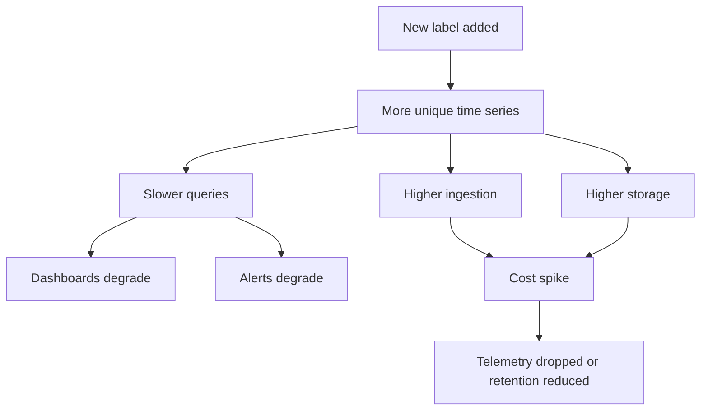

# Cheatsheet Observability Part 050 — High Cardinality and Label Governance

> Fokus part ini: memahami cardinality sebagai salah satu risiko terbesar dalam metrics, traces, logs indexing, dashboards, alerts, dan observability cost. High cardinality bukan sekadar masalah biaya; ia bisa membuat backend observability lambat, alert rusak, dashboard misleading, dan incident debugging menjadi lebih sulit.

---

## 1. Core Mental Model

Dalam observability, cardinality adalah jumlah kombinasi unik dari nilai dimension/label/tag.

Untuk metrics, satu time series biasanya ditentukan oleh:

```text
metric_name + label_key/value combinations
```

Contoh:

```text
http.server.request.duration{
  service="quote-api",
  method="POST",
  route="/quotes/{quoteId}/approve",
  status_code="200",
  environment="prod"
}
```

Itu satu kombinasi series.

Jika Anda menambahkan `quote_id`, jumlah series bisa naik mengikuti jumlah quote.

```text
http.server.request.duration{
  service="quote-api",
  method="POST",
  route="/quotes/{quoteId}/approve",
  status_code="200",
  quote_id="Q-100001"
}
```

Jika ada 2 juta quote, Anda dapat menciptakan jutaan series.

That is cardinality explosion.

---

## 2. Why Cardinality Matters

High cardinality menyebabkan:

- ingestion cost meningkat;
- storage membengkak;
- query lambat;
- dashboard timeout;
- alert evaluation mahal;
- backend observability overload;
- retention dipersingkat karena biaya;
- engineer kehilangan trust pada dashboard;
- incident debugging melambat;
- SLO calculation bisa terganggu;
- platform team harus drop metric secara paksa.

Cardinality adalah architectural concern.

Bukan sekadar dashboard concern.



---

## 3. Labels, Tags, and Dimensions

Different tools use different words:

- label;
- tag;
- dimension;
- attribute;
- field.

Conceptually, they are values used to group, filter, aggregate, or search telemetry.

In metrics, labels are especially sensitive because every unique combination can create a new time series.

In traces, attributes can also cause storage/index cost issues when indexed.

In logs, structured fields can become expensive if indexed with high-cardinality values.

Therefore:

```text
Not every useful debug field should become a metric label.
Not every log field should be indexed.
Not every span attribute should be searchable.
```

---

## 4. Low Cardinality vs High Cardinality

### Low-cardinality examples

Usually safe:

- service name;
- environment;
- region;
- availability zone;
- HTTP method;
- route template;
- status code class;
- exact status code;
- error code from bounded enum;
- exception class;
- dependency name;
- database system;
- Kafka topic;
- RabbitMQ queue;
- deployment version, if bounded;
- feature flag state, if bounded.

### High-cardinality examples

Usually unsafe as metric labels:

- request ID;
- trace ID;
- span ID;
- session ID;
- user ID;
- account ID;
- quote ID;
- order ID;
- message ID;
- event ID;
- idempotency key;
- raw URL path;
- raw query string;
- error message text;
- SQL statement;
- Redis key;
- IP address;
- user agent;
- email address;
- phone number;
- container ID if too volatile;
- pod name in long-retention service metrics;
- Kafka offset;
- RabbitMQ delivery tag.

Rule:

```text
Identifiers that are unique per request/entity/message usually do not belong in metric labels.
```

They may belong in logs, traces, or audit records with privacy controls.

---

## 5. Cardinality Multiplication

Cardinality multiplies across labels.

Example:

```text
service: 20 values
route: 100 values
status_code: 10 values
tenant: 500 values
version: 30 values
```

Potential series:

```text
20 × 100 × 10 × 500 × 30 = 300,000,000 series
```

Not every combination will exist, but the risk is clear.

Each new label must be reviewed in combination with existing labels.

Bad review question:

```text
Is this label useful?
```

Better review question:

```text
Is this label useful enough to justify its cardinality multiplied by every other label?
```

---

## 6. Java/JAX-RS Route Cardinality

One of the most common mistakes is using raw path as a label.

Bad:

```text
path="/quotes/Q-123456/approve"
path="/quotes/Q-123457/approve"
path="/quotes/Q-123458/approve"
```

Good:

```text
route="/quotes/{quoteId}/approve"
```

In JAX-RS/Jakarta REST, prefer route templates derived from resource mapping rather than raw URI.

Example:

```java
@Path("/quotes/{quoteId}/approve")
public Response approveQuote(@PathParam("quoteId") String quoteId) {
    // metric label should use route template, not actual quoteId
}
```

Metric label:

```text
route="/quotes/{quoteId}/approve"
```

Log field may include safe business reference if policy allows:

```text
quoteId="Q-123456"
```

But metric label should not.

---

## 7. Request ID, Trace ID, and Span ID Risk

These identifiers are extremely high-cardinality.

They are good for correlation.

They are bad as metric labels.

Use them in:

- logs;
- trace context;
- span context;
- incident search;
- support evidence;
- audit link fields if allowed.

Do not use them in:

- metrics labels;
- alert grouping labels;
- dashboard group-by dimensions;
- long-retention indexed aggregations.

Bad metric:

```text
http.server.request.duration{trace_id="abc123..."}
```

Good log:

```json
{
  "level": "ERROR",
  "message": "Order submission failed",
  "traceId": "abc123",
  "correlationId": "corr-789",
  "orderId": "O-100001",
  "errorCode": "DOWNSTREAM_TIMEOUT"
}
```

The log is searchable evidence.

The metric remains aggregatable.

---

## 8. User ID and Account ID Risk

User/account identifiers can be high-cardinality and sensitive.

Risks:

- cost explosion;
- privacy exposure;
- unauthorized segmentation;
- metric backend becomes a user activity store;
- dashboards can leak customer behavior;
- retention may conflict with privacy policy.

Usually avoid:

```text
user_id as metric label
email as log field
account_id as unapproved indexed field
```

Possible alternatives:

- use bounded user type/role;
- use customer segment if approved;
- use tenant tier if approved;
- use region/market/channel if approved;
- use logs/audit for entity-level lookup under access controls;
- use temporary scoped debug telemetry with approval.

---

## 9. Tenant ID Trade-off

Tenant ID is tricky.

It may be operationally valuable in multi-tenant systems, but it can be high-cardinality and sensitive.

Questions before using `tenant_id` as a label:

1. How many tenants exist today?
2. How many tenants can exist in 12–24 months?
3. Is tenant ID sensitive or customer-identifying?
4. Is the metric backend approved for tenant-level data?
5. Will tenant label be combined with route/status/version/region?
6. Is this needed for SLO, alerting, customer support, or capacity?
7. Can we use tenant tier/segment instead?
8. Is retention compliant?
9. Who can query tenant-level telemetry?
10. Is there an alternative business reporting source?

Possible strategies:

| Strategy | Use case | Risk |
|---|---|---|
| no tenant label | global service health | hides tenant-specific impact |
| tenant tier label | segment-level health | lower detail |
| top-N tenant dashboard | targeted operations | requires governance |
| tenant ID in logs only | support/debug | search cost/access control |
| temporary tenant debug telemetry | incident support | approval and privacy required |
| separate customer impact system | business reporting | integration complexity |

Do not casually add tenant ID to every metric.

---

## 10. Quote ID and Order ID Risk

In CPQ/order management, quote/order IDs are essential debugging keys.

But they are usually bad metric labels.

Use quote/order ID in:

- audit logs;
- business event records;
- structured logs when allowed;
- trace attributes if not indexed broadly or if policy allows;
- support tools;
- customer-impact analysis;
- reconciliation reports.

Avoid quote/order ID in:

- request latency metric labels;
- error counter labels;
- histogram labels;
- alert grouping;
- dashboard group-by;
- high-retention metric series.

Bad:

```text
order_submit_total{order_id="O-123"}
```

Good:

```text
order_submit_total{service="order-api", result="failed", error_code="VALIDATION_FAILED"}
```

Good log/audit:

```json
{
  "eventType": "ORDER_SUBMIT_FAILED",
  "orderId": "O-123",
  "correlationId": "corr-456",
  "errorCode": "VALIDATION_FAILED",
  "actorId": "user-789"
}
```

Metric answers:

```text
How many order submissions failed by reason?
```

Log/audit answers:

```text
What happened to this specific order?
```

Different signal, different job.

---

## 11. Error Message Label Risk

Error messages are often high-cardinality.

Bad:

```text
error_message="Timeout after 3000ms calling customer 12345 at 2026-07-11T12:00:01"
```

This can create unique labels for each occurrence.

Use bounded error codes instead.

Good:

```text
error_code="DOWNSTREAM_TIMEOUT"
exception_type="SocketTimeoutException"
dependency="pricing-service"
```

Put detailed message in logs, with redaction.

Do not use dynamic exception messages as metric labels.

---

## 12. SQL, Redis Key, Kafka Offset, and Message ID Risk

### SQL statement

Bad label:

```text
sql="select * from orders where id = 'O-123'"
```

Better:

```text
db_operation="select"
db_table="orders"
statement_name="find_order_by_id"
```

Even sanitized SQL can be high-cardinality if generated dynamically.

### Redis key

Bad label:

```text
redis_key="quote:Q-123456:pricing:detail"
```

Better:

```text
redis_key_pattern="quote:{quoteId}:pricing:detail"
operation="get"
```

### Kafka offset

Bad label:

```text
offset="987654321"
```

Better:

```text
topic="quote-events"
partition="3"
consumer_group="quote-processor"
```

Offset belongs in logs/traces when needed, not metric labels.

### Message ID

Message ID is high-cardinality.

Use it for correlation in logs/traces, not metrics.

---

## 13. Cardinality and Histograms

Histograms are powerful but can multiply series.

A histogram with labels creates time series per bucket per label combination.

Example:

```text
http.server.request.duration_bucket{route, method, status_code, le}
```

If you add tenant, version, error code, and dependency, series count can explode.

Review histogram labels aggressively.

Good histogram label set:

```text
service, environment, route, method, status_code
```

Maybe acceptable depending scale:

```text
region, deployment_version
```

Usually dangerous:

```text
user_id, request_id, order_id, raw_path, error_message
```

Histogram bucket count also matters.

Too many buckets × too many labels = expensive metrics.

---

## 14. Cardinality and Alerts

High-cardinality labels can break alerting.

Bad alert grouping:

```text
group by request_id
```

This creates one alert per request.

Bad alert grouping:

```text
group by order_id
```

This creates customer-impact noise and can leak identifiers.

Better alert grouping:

```text
group by service, environment, route, severity
```

For dependency alerts:

```text
group by service, dependency, error_code
```

For business alerts:

```text
group by business_operation, result, region or segment if approved
```

Alert labels should support routing and deduplication, not maximum detail.

---

## 15. Cardinality and Dashboards

Dashboards should present stable aggregations.

Dangerous dashboard filters:

- request ID;
- trace ID;
- order ID;
- quote ID;
- raw URL;
- user ID;
- session ID;
- exact error message;
- full user agent;
- client IP.

Useful dashboard filters:

- environment;
- service;
- route template;
- dependency;
- status code;
- error code;
- region;
- version;
- business operation;
- tenant tier/segment if approved.

Entity-level debugging should usually start from logs/traces/audit/search tooling, not metric dashboards.

---

## 16. Cardinality and Logs

Logs are not immune to cardinality.

Structured log fields can be indexed.

High-cardinality indexed log fields increase:

- indexing cost;
- storage cost;
- query cost;
- access-control risk;
- privacy risk.

Possible approach:

| Field | Store | Index? |
|---|---|---|
| service | yes | yes |
| environment | yes | yes |
| level | yes | yes |
| timestamp | yes | yes |
| traceId | yes | often yes |
| correlationId | yes | often yes |
| requestId | yes | maybe yes depending cost |
| orderId/quoteId | yes if allowed | maybe restricted |
| raw payload | usually no | no |
| errorCode | yes | yes |
| errorMessage | yes | maybe no or limited |
| user email | avoid | no |

Indexing policy is part of observability governance.

---

## 17. Cardinality and Traces

Span attributes can be high-cardinality too.

Avoid broadly indexed span attributes like:

- request ID;
- user ID;
- quote ID;
- order ID;
- SQL statement with values;
- Redis key;
- message ID;
- raw URL;
- raw user agent;
- raw error message.

Use semantic, bounded attributes when possible:

- service name;
- route template;
- HTTP method;
- status code;
- dependency name;
- messaging system;
- topic/queue;
- db.system;
- db.operation;
- exception type;
- business operation;
- result category.

For entity IDs, use policy-driven attributes and understand whether the trace backend indexes them.

---

## 18. Cardinality Budget

A cardinality budget defines acceptable label growth.

Example budget questions:

- How many unique routes can a service expose?
- How many status code labels are expected?
- How many dependency labels are allowed?
- Are version labels kept for all versions or current versions only?
- Is region/zone required?
- Is tenant label allowed?
- What is the maximum expected time series count per service?
- What happens when service exceeds its budget?

A practical service budget might include:

```text
request metrics:
  labels allowed: service, environment, route, method, status_code
  labels forbidden: request_id, user_id, order_id, quote_id, raw_path, error_message

dependency metrics:
  labels allowed: service, environment, dependency, operation, result, error_code
  labels forbidden: SQL value, Redis key, message_id, offset
```

---

## 19. Label Allowlist and Denylist

Governance should define allowed and forbidden labels.

### Example allowlist

```text
service
environment
region
route
method
status_code
error_code
exception_type
dependency
operation
result
messaging_system
topic
queue
consumer_group
job_name
workflow_type
state
business_operation
```

### Example denylist

```text
request_id
trace_id
span_id
session_id
user_id
email
phone
quote_id
order_id
message_id
event_id
idempotency_key
raw_path
raw_query_string
sql_statement
redis_key
error_message
authorization_header
cookie
api_key
password
token
```

A denylist is not enough.

New risky fields appear constantly.

Use review discipline.

---

## 20. Business Dimension Governance

Business dimensions are valuable but risky.

Examples:

- product family;
- sales channel;
- market;
- region;
- customer segment;
- tenant tier;
- quote type;
- order type;
- approval type;
- fulfillment type;
- fallout reason;
- state;
- business operation.

These are often better than raw entity IDs.

Good:

```text
quote_operation_total{operation="approve", result="success", quote_type="new-sale"}
```

Risky:

```text
quote_operation_total{quote_id="Q-123", customer_id="C-999"}
```

Business labels should be:

- bounded;
- documented;
- meaningful;
- stable;
- privacy-approved;
- useful for dashboard/alert/SLO;
- reviewed for cardinality growth.

---

## 21. Detecting Cardinality Explosions

Symptoms:

- observability bill spike;
- metric backend ingestion spike;
- dashboard slow or failing;
- alert evaluation lag;
- backend drops time series;
- query timeout;
- service metric disappears;
- platform team complains about one metric;
- retention shortened unexpectedly;
- label value count grows rapidly.

Detection methods:

- top metrics by series count;
- top labels by unique values;
- top services by ingestion volume;
- top dashboards by query cost;
- top log fields by index cardinality;
- trace attribute cardinality reports;
- collector/backend self-metrics;
- CI/static checks for metric label additions;
- PR review for instrumentation changes.

---

## 22. Cardinality Incident Playbook

When cardinality explosion happens:

1. Identify the expensive metric/log field/span attribute.
2. Find recent deployment/config/instrumentation change.
3. Identify new label or dynamic value source.
4. Determine whether backend is dropping data.
5. Disable or relabel the high-cardinality dimension.
6. Preserve debugging evidence through logs/traces if needed.
7. Backfill dashboard/alert queries to use safe labels.
8. Add test/review rule to prevent recurrence.
9. Document the decision in governance notes.

Emergency mitigation options:

- drop label at collector/backend;
- aggregate away label;
- disable metric temporarily;
- reduce retention for affected noisy signal;
- patch instrumentation;
- roll back release;
- create explicit allowlist.

Do not only increase backend capacity unless the label is intentionally valuable and approved.

---

## 23. Java Instrumentation Review Example

Bad metric code:

```java
Timer.builder("quote.pricing.duration")
    .tag("quote_id", quoteId)
    .tag("customer_id", customerId)
    .tag("request_id", requestId)
    .register(meterRegistry)
    .record(duration);
```

Problems:

- quote ID is high-cardinality;
- customer ID may be sensitive;
- request ID is unique per request;
- every quote/customer/request creates new series;
- dashboard and alert aggregation become impossible.

Better:

```java
Timer.builder("quote.pricing.duration")
    .tag("service", serviceName)
    .tag("operation", "price_quote")
    .tag("result", result)
    .tag("error_code", boundedErrorCode)
    .register(meterRegistry)
    .record(duration);
```

Add entity-level evidence to logs/audit if allowed:

```java
log.info("Quote pricing completed quoteId={} result={} durationMs={} correlationId={}",
    quoteId,
    result,
    durationMs,
    correlationId
);
```

---

## 24. Route Template Enforcement

A Java/JAX-RS observability stack should enforce route template labels.

Bad:

```java
String path = requestContext.getUriInfo().getRequestUri().getPath();
metrics.timer("http.server.duration", "path", path);
```

Good:

```java
String routeTemplate = resolveMatchedTemplate(requestContext);
metrics.timer("http.server.duration", "route", routeTemplate);
```

Internal implementation depends on framework:

- Jersey;
- RESTEasy;
- Servlet filters;
- JAX-RS request context;
- OpenTelemetry instrumentation;
- API gateway route mapping.

The principle is stable:

```text
Use matched route template, not raw request path.
```

---

## 25. Label Lifecycle

Labels should have lifecycle governance.

Before adding a label:

- define purpose;
- estimate cardinality;
- define allowed values;
- identify owner;
- identify dashboards/alerts using it;
- review privacy;
- review cost;
- document retention;
- plan removal if unused.

After adding a label:

- monitor series count;
- check dashboard performance;
- check alert behavior;
- verify value distribution;
- review after release;
- remove if unused.

Labels should not live forever by accident.

---

## 26. Correct Signal Placement

Use the right signal for the right detail.

| Need | Best signal |
|---|---|
| service-level rate/error/latency | metrics |
| dependency latency breakdown | traces + metrics |
| specific request debugging | logs + trace |
| specific order/quote history | audit/business event/log |
| customer impact aggregate | business metric/report |
| state transition evidence | audit/event/log |
| SLO compliance | metrics/authoritative event data |
| root cause timeline | logs + metrics + traces + deployment markers |
| entity-level support lookup | controlled log/audit/search tool |

Do not force metrics to answer entity-level questions.

That is how cardinality explosions start.

---

## 27. Label Governance Review Questions

Ask these during PR/ADR review:

1. What question does this label answer?
2. Is that question for metrics, logs, traces, audit, or dashboard search?
3. What is the maximum expected unique value count?
4. Can this label contain PII or sensitive business data?
5. Is it bounded by enum or unbounded string?
6. Does it multiply existing labels dangerously?
7. Is it needed for alert routing or just debugging?
8. Could it be a log field instead of a metric label?
9. Could it be aggregated into category/tier/type?
10. Does it use route template instead of raw path?
11. Is it stable across releases?
12. Is it documented in telemetry standards?
13. Will dashboards/alerts depend on it?
14. Who owns cleanup if cardinality grows?

---

## 28. PR Review Checklist

- [ ] No request ID/trace ID/span ID as metric labels.
- [ ] No user ID/email/session ID as metric labels.
- [ ] No quote ID/order ID/message ID as metric labels.
- [ ] No raw path or raw query string labels.
- [ ] No dynamic error message labels.
- [ ] No SQL statement/Redis key labels with values.
- [ ] Route labels use templates.
- [ ] Error labels use bounded error codes or exception classes.
- [ ] Business labels are bounded and approved.
- [ ] Tenant labels are reviewed for cardinality/privacy.
- [ ] Histogram labels are minimal.
- [ ] Alert grouping labels are low-cardinality.
- [ ] Dashboard filters are stable.
- [ ] New labels have documented purpose and owner.
- [ ] Cost/cardinality impact is considered.

---

## 29. Internal Verification Checklist

Verify in internal systems:

- [ ] What metric backend is used?
- [ ] What is the current label naming convention?
- [ ] Is there a metric label allowlist/denylist?
- [ ] Are raw paths present in HTTP metrics?
- [ ] Are request IDs or trace IDs present in metrics?
- [ ] Are quote/order IDs present in metrics?
- [ ] Are user/customer/tenant IDs used as labels?
- [ ] If tenant ID is used, is it approved and bounded?
- [ ] Which metrics have highest time series count?
- [ ] Which labels have highest unique value count?
- [ ] Which dashboards are slow due to high-cardinality queries?
- [ ] Which alerts group by too many dimensions?
- [ ] Are span attributes indexed with high-cardinality values?
- [ ] Are structured log fields indexed safely?
- [ ] Is there collector/backend relabeling to drop unsafe labels?
- [ ] Is cardinality checked in PR/CI?
- [ ] Who owns metric governance?
- [ ] Are cardinality incidents documented?

---

## 30. Senior Engineer Heuristics

Use these heuristics:

```text
IDs belong in logs/traces/audit. Categories belong in metrics.
```

```text
A label must be useful after aggregation. If it is only useful for one entity lookup, it probably is not a metric label.
```

```text
Every new metric label is multiplied by every existing label.
```

```text
Route templates are safe. Raw paths are usually dangerous.
```

```text
Error codes are safe when bounded. Error messages are dangerous.
```

```text
Tenant ID is not automatically wrong, but it is never casual.
```

```text
The best way to debug one order is not to create one time series per order.
```

---

## 31. Common Anti-Patterns

- Adding request ID as a metric label.
- Adding trace ID as a metric label.
- Adding quote/order ID as a metric label.
- Using raw URL path instead of route template.
- Using dynamic exception message as `error` label.
- Adding tenant ID without cardinality/privacy review.
- Adding user/account ID to dashboards.
- Grouping alerts by high-cardinality identifiers.
- Indexing every structured log field.
- Indexing every span attribute.
- Creating histograms with too many dimensions.
- Treating observability backend as an entity search database.
- Not deleting unused metrics/labels.
- Discovering cardinality only after the bill spikes.

---

## 32. Summary

High cardinality is one of the most damaging observability failure modes.

A strong label governance model:

- keeps metrics aggregatable;
- keeps dashboards fast;
- keeps alerts deduplicated;
- keeps costs controlled;
- prevents privacy leakage;
- separates entity-level debugging from aggregate monitoring;
- uses logs/traces/audit for high-cardinality identifiers;
- uses metrics for bounded categories;
- reviews every new label as an architectural decision.

The next part moves into the boundary between orchestration and diagnosis: **health checks vs observability**.
