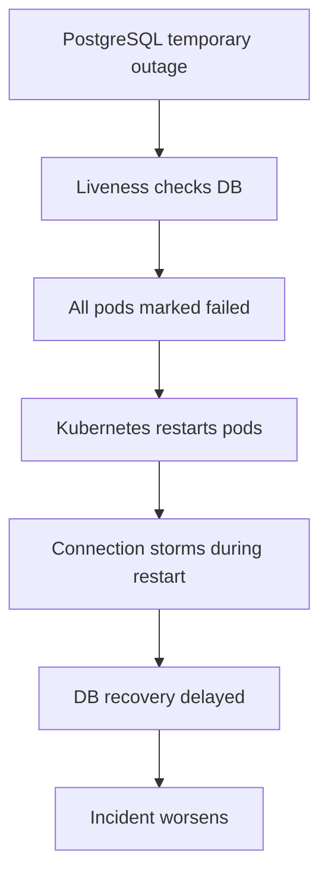
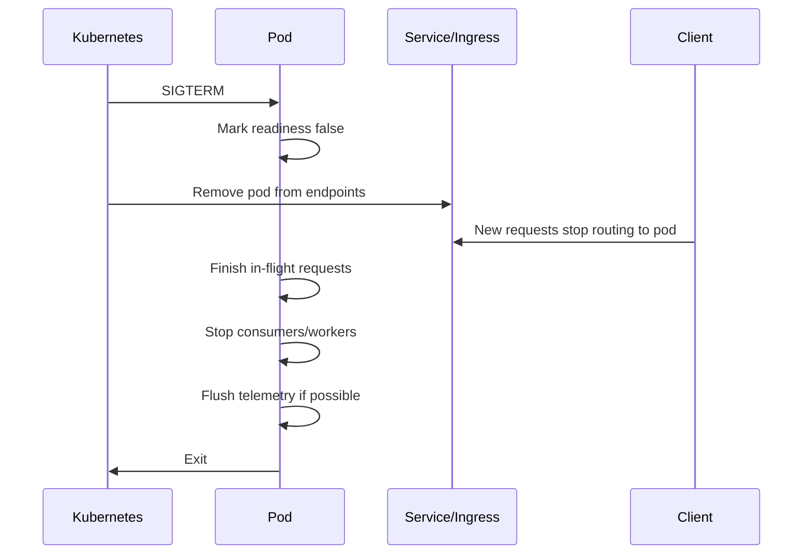

# Cheatsheet Observability Part 051 — Health Checks vs Observability

> Fokus part ini: memahami perbedaan antara **health checks** dan **observability**. Health check menjawab pertanyaan sempit: "apakah instance ini boleh menerima traffic atau perlu direstart?" Observability menjawab pertanyaan luas: "apa yang sedang terjadi, kenapa terjadi, siapa terdampak, dan apa tindakan aman berikutnya?"

---

## 1. Core Mental Model

Health check adalah control signal.

Observability adalah evidence system.

Keduanya berhubungan, tetapi tidak sama.

Health check dipakai oleh orchestrator, load balancer, ingress, deployment controller, synthetic monitor, atau platform automation untuk mengambil keputusan cepat.

Observability dipakai engineer untuk diagnosis, debugging, capacity planning, alerting, SLO evaluation, audit analysis, dan incident response.

```text
Health check question:
Should this process/pod receive traffic or be restarted?

Observability question:
What is happening inside and around this service, why, how bad is it, and what should we do?
```

Jika health check terlalu dangkal, service bisa terlihat sehat padahal rusak.

Jika health check terlalu dalam, service bisa terlihat tidak sehat karena dependency sementara lambat, lalu Kubernetes melakukan restart massal dan memperparah incident.

The skill is not "add `/health` endpoint".

The skill is designing the right control signal for the right automation boundary.

---

## 2. Why Health Checks Exist

Health checks ada karena platform butuh signal sederhana untuk decision otomatis.

Contoh decision:

- container sudah siap menerima traffic atau belum;
- pod harus dikeluarkan dari service endpoint atau tidak;
- process stuck dan harus direstart atau tidak;
- deployment rollout boleh lanjut atau harus ditahan;
- instance di load balancer harus dianggap healthy atau unhealthy;
- synthetic probe harus memicu alert atau tidak.

Tanpa health check, platform hanya tahu container process hidup.

Process hidup tidak berarti service benar-benar dapat melayani request.

Contoh process hidup tetapi service tidak usable:

- thread pool exhausted;
- DB connection pool exhausted;
- application stuck saat startup partial;
- config critical gagal dimuat;
- migration belum selesai;
- Redis client deadlock;
- Kafka consumer thread mati;
- JAX-RS app context belum fully initialized;
- service hanya menjawab `/health` tetapi semua endpoint bisnis gagal.

---

## 3. Health Signal Is Not Telemetry Signal

Health endpoint biasanya deliberately simple.

Telemetry signal deliberately rich.

| Concern | Health Check | Observability Telemetry |
|---|---|---|
| Primary user | Platform automation | Engineer/SRE/support |
| Output | Healthy/unhealthy/degraded | Logs, metrics, traces, events, audit |
| Decision | Route traffic, restart, rollout | Diagnose, mitigate, improve |
| Granularity | Low | High |
| Cost | Very low | Variable |
| Failure tolerance | Must be robust | Can be richer and more detailed |
| Risk | Bad automation decision | Missing or misleading evidence |

Health check should not become a mini dashboard.

Dashboard should not become an orchestrator control plane.

---

## 4. Common Health Endpoints

A Java/JAX-RS service may expose several endpoints:

```text
/health
/health/live
/health/ready
/health/startup
/health/dependencies
/metrics
```

Not all systems use these exact names.

In some frameworks, health checks are exposed through MicroProfile Health, Spring Boot Actuator, custom JAX-RS resources, servlet endpoints, or platform-specific probes.

Internal verification checklist:

- verify actual endpoint names;
- verify which endpoints Kubernetes probes call;
- verify which endpoint load balancer calls;
- verify whether health endpoints are public, private, or internal-only;
- verify whether health endpoints require authentication;
- verify whether health endpoint responses include sensitive data.

---

## 5. Liveness Probe

Liveness answers:

```text
Should this container be restarted?
```

A liveness probe should detect process-level unrecoverable failure.

Good liveness checks:

- JVM process can respond;
- application event loop or servlet container is not fully stuck;
- critical internal runtime is not deadlocked;
- service is not in a fatal self-declared broken state.

Bad liveness checks:

- checking PostgreSQL availability;
- checking Redis availability;
- checking Kafka availability;
- checking every downstream HTTP dependency;
- checking external identity provider;
- checking a business transaction path;
- checking slow deep dependency with short timeout.

Why?

Because dependency failure should usually not cause every pod to restart.

If DB is down and every service liveness fails, Kubernetes may restart all pods repeatedly.

That creates additional load, destroys warm caches, increases startup traffic, and makes recovery harder.



Liveness should be conservative.

Restart is a destructive action.

---

## 6. Readiness Probe

Readiness answers:

```text
Should this pod receive traffic now?
```

Readiness can be stricter than liveness.

A pod may be alive but not ready.

Examples:

- startup not complete;
- config not loaded;
- schema migration dependency not ready;
- local cache not warmed if cache is required before serving;
- DB connection pool cannot establish minimum connectivity;
- service is draining;
- application is overloaded and intentionally refusing new traffic;
- critical dependency unavailable for this service's main function.

Readiness failure removes pod from service endpoints.

It should not necessarily restart the pod.

Readiness is useful for:

- startup gating;
- rollout safety;
- graceful shutdown;
- dependency-aware traffic routing;
- overload shedding.

But readiness can also be dangerous.

If readiness depends on a shared dependency and all pods fail readiness at once, the service may disappear completely from the load balancer.

This may be correct for some services and wrong for others.

Design question:

```text
When this dependency is degraded, is it safer to receive traffic and return controlled errors, or safer to remove this pod from rotation?
```

---

## 7. Startup Probe

Startup answers:

```text
Is the application still starting, or has startup failed permanently?
```

Startup probe is useful for Java services with slow initialization:

- classpath scanning;
- dependency injection initialization;
- JAX-RS resource registration;
- connection pool initialization;
- cache warmup;
- migration validation;
- workflow engine initialization;
- OTel agent startup;
- large config load;
- cold JVM behavior.

Without startup probe, liveness may kill a slow-starting container too early.

This creates crash loops.

```text
Startup probe protects slow initialization.
Liveness protects stuck runtime after startup.
Readiness controls traffic eligibility.
```

---

## 8. Shallow Health Check

A shallow health check validates the service process itself.

Example checks:

- process can answer HTTP;
- JAX-RS runtime is initialized;
- application state is not fatal;
- main executor is not terminated;
- service is not in shutdown mode.

Shallow checks are usually good for liveness.

Example response:

```json
{
  "status": "UP",
  "service": "quote-api",
  "version": "2026.07.11-abc123",
  "time": "2026-07-11T10:15:30Z"
}
```

Avoid returning:

- secrets;
- full config;
- connection strings;
- usernames;
- internal hostnames if endpoint is externally reachable;
- dependency credentials;
- tenant data;
- stack traces.

---

## 9. Deep Health Check

A deep health check validates dependencies or business capability.

Example checks:

- PostgreSQL connectivity;
- Redis ping;
- Kafka broker metadata;
- RabbitMQ connection;
- Camunda engine query;
- downstream HTTP dependency;
- cloud secret/config service;
- object storage access;
- identity provider reachability.

Deep checks are useful, but usually not for liveness.

They may be appropriate for:

- readiness;
- synthetic monitoring;
- dependency diagnostics;
- smoke tests;
- operational runbooks;
- deployment verification.

Deep check risk:

- amplifies dependency outage;
- causes thundering herd of probe traffic;
- masks partial degradation behind one boolean;
- causes false unhealthy due to transient network issues;
- leaks dependency details;
- introduces expensive recurring traffic;
- turns health endpoint into a dependency scanner.

Good pattern:

```text
Separate shallow liveness from deeper readiness/diagnostic checks.
```

---

## 10. Dependency Health Is Contextual

Not every dependency is equally critical for every endpoint.

Example quote service:

- PostgreSQL may be required for most write operations;
- Redis cache may be optional for some reads;
- Kafka may be required for async event emission;
- RabbitMQ may be required for a subset of workflow tasks;
- Camunda may be required for approval workflow;
- pricing service may only affect pricing endpoints;
- document service may only affect quote PDF generation.

A global readiness check that fails when any dependency is down may be too coarse.

Better thinking:

```text
Dependency criticality should be mapped to service capability.
```

Capability-oriented health may expose:

```json
{
  "status": "DEGRADED",
  "capabilities": {
    "quote_read": "UP",
    "quote_create": "UP",
    "quote_price": "DEGRADED",
    "quote_approve": "DOWN"
  }
}
```

However, exposing this externally may reveal too much.

Use it carefully.

---

## 11. Health Status Vocabulary

Common statuses:

- `UP`;
- `DOWN`;
- `DEGRADED`;
- `STARTING`;
- `OUT_OF_SERVICE`;
- `UNKNOWN`.

For Kubernetes probes, the most important result is often HTTP status:

- success status means healthy;
- non-success status means failure.

For human-facing diagnostic endpoints, richer status can help.

But avoid ambiguous mapping.

Bad:

```text
HTTP 200 with body status DOWN
```

Some systems accept this, but many probes only look at HTTP status.

Be explicit about how probe tools interpret responses.

---

## 12. Health Check Timeouts

Health checks must be fast and bounded.

Bad health check:

```text
/ready waits 30 seconds for PostgreSQL, 30 seconds for Redis, 30 seconds for Kafka
```

This can exhaust servlet threads during dependency incidents.

Health check design rules:

- use short timeouts;
- avoid unbounded blocking;
- avoid expensive queries;
- avoid lock acquisition;
- avoid large payloads;
- avoid remote calls in liveness;
- cache dependency check results briefly if needed;
- expose check duration as metric;
- log repeated probe failure carefully, not on every probe.

---

## 13. Health Check and Thread Pool Starvation

A health endpoint may report healthy while real endpoints are broken if it uses a separate lightweight path.

Example:

- `/health` responds from a small dedicated handler;
- application request executor is exhausted;
- real API requests time out;
- health remains green.

This creates false healthy.

Countermeasures:

- monitor request latency and error rate;
- monitor active requests;
- monitor thread pool saturation;
- monitor queue depth;
- include saturation metrics in dashboards;
- alert on symptoms, not only health endpoint.

Health check is not enough.

---

## 14. Health Check and Database Pool Exhaustion

A common issue:

```text
Application can answer /health, but all business endpoints fail because DB pool is exhausted.
```

Should readiness fail when DB pool is exhausted?

Maybe.

But the exact rule matters.

Possible signals:

- active connections near max;
- pending connection waiters;
- connection acquisition timeout;
- pool validation query failure;
- DB unavailable;
- long transactions holding connections;
- slow query saturation.

Readiness should not perform expensive DB queries.

A lightweight connectivity check may be okay, but pool saturation should primarily be metric/alert/dashboard signal.

---

## 15. Health Check and Messaging Systems

Kafka/RabbitMQ health is tricky.

A REST API may still serve reads while Kafka publishing is down.

But if the API promises durable event emission as part of transaction correctness, broker outage may make write path unsafe.

Design questions:

- Is messaging required for synchronous user response correctness?
- Is outbox pattern used?
- Can events be persisted and published later?
- Does broker unavailability cause data loss, delayed propagation, or request failure?
- Should readiness fail or should business write endpoint return controlled 503/409/202?

Health check cannot answer all of this alone.

The implementation pattern determines the health semantics.

Internal verification checklist:

- verify whether outbox pattern exists;
- verify Kafka/RabbitMQ publish failure behavior;
- verify DLQ/retry strategy;
- verify whether readiness checks broker connectivity;
- verify whether broker degradation has alert and dashboard panels.

---

## 16. Health Check and Redis

Redis may be used for different roles:

- optional cache;
- required cache;
- distributed lock;
- idempotency store;
- rate limiter;
- session store;
- stream processor.

A Redis outage has different severity depending on role.

If Redis is optional cache, readiness should usually not fail.

If Redis is idempotency store for critical write operations, some endpoints may be unsafe without it.

If Redis is rate limiter, outage policy matters:

- fail open;
- fail closed;
- degraded fallback;
- local limiter fallback.

Health checks must reflect actual correctness constraints.

---

## 17. Health Check and Camunda/Workflow

Workflow engine health is not just connectivity.

Possible failure modes:

- engine reachable but workers stopped;
- job executor disabled;
- failed job backlog rising;
- incident count rising;
- timer backlog growing;
- message correlation failing;
- process instances stuck;
- human tasks aging beyond SLA.

A simple `/ready` check cannot represent workflow health.

Use metrics and dashboards for workflow health.

Use synthetic or smoke tests for key process journeys where appropriate.

Use health check only for narrow process-level readiness if needed.

---

## 18. Health Check Anti-Patterns

### Anti-pattern 1: Liveness checks every dependency

This causes restart storms during dependency incidents.

### Anti-pattern 2: Readiness always green

This sends traffic to pods that cannot serve business requests.

### Anti-pattern 3: Health endpoint returns huge diagnostic payload

This leaks information and increases probe cost.

### Anti-pattern 4: Health endpoint performs write operation

A probe should not mutate business state.

### Anti-pattern 5: Health check depends on slow external service without timeout

This can exhaust server threads.

### Anti-pattern 6: Health check logs every probe

High-frequency probes can generate huge log volume.

### Anti-pattern 7: Health check is the only alert

A green health endpoint does not imply good user experience.

### Anti-pattern 8: Health response reveals internals publicly

Dependency names, hostnames, versions, and config details may be sensitive.

### Anti-pattern 9: Health endpoint uses a different execution path from real traffic

This can create false healthy.

### Anti-pattern 10: No startup probe for slow Java service

This causes premature liveness failure and crash loops.

---

## 19. Health Check Observability

Health checks themselves need observability.

Useful metrics:

```text
health.check.invocations
health.check.duration
health.check.failures
health.check.status
health.check.component.status
k8s.probe.failures
k8s.pod.readiness
k8s.pod.restarts
```

Useful log events:

- health status transition from UP to DOWN;
- health status transition from DOWN to UP;
- readiness disabled due to graceful shutdown;
- startup probe exceeded expected time;
- dependency check timeout after state change.

Avoid logging every successful health probe.

Log state changes, not noise.

---

## 20. Health Check and Graceful Shutdown

During shutdown, readiness should usually turn false before process exits.

Sequence:



Important observability points:

- log shutdown start;
- log readiness transition;
- metric in-flight requests;
- stop accepting new work;
- stop Kafka/RabbitMQ consumers safely;
- flush telemetry within bounded time;
- avoid losing final error logs/traces.

---

## 21. Health Check and Rolling Deployment

Readiness controls rollout safety.

Bad readiness can cause:

- traffic routed too early;
- pods killed too early;
- deployment stuck;
- rollout proceeds despite broken app;
- canary passes despite hidden dependency failure.

Minimum release observability:

- startup duration;
- readiness transition time;
- pod availability;
- endpoint error rate after rollout;
- latency after rollout;
- dependency error rate after rollout;
- deployment marker;
- version label.

Health check is one gate, not the whole release signal.

---

## 22. Health Check for Java/JAX-RS Implementation

Typical implementation options:

- custom JAX-RS resource;
- servlet endpoint;
- MicroProfile Health;
- framework health extension;
- sidecar health proxy;
- platform-provided probe adapter.

A custom JAX-RS endpoint can look conceptually like this:

```java
@Path("/health/ready")
public class ReadinessResource {

    private final ReadinessService readinessService;

    @GET
    @Produces(MediaType.APPLICATION_JSON)
    public Response ready() {
        HealthStatus status = readinessService.check();
        int httpStatus = status.isReady() ? 200 : 503;
        return Response.status(httpStatus)
            .entity(status.safeResponse())
            .build();
    }
}
```

Design notes:

- `safeResponse()` must not leak secrets;
- check must be bounded;
- dependency checks must have small timeouts;
- expensive checks should be cached or avoided;
- response should be deterministic;
- endpoint should not mutate state;
- endpoint should have clear access policy.

---

## 23. Kubernetes Probe Design

Example conceptual probe design:

```yaml
startupProbe:
  httpGet:
    path: /health/startup
    port: 8080
  failureThreshold: 30
  periodSeconds: 10

livenessProbe:
  httpGet:
    path: /health/live
    port: 8080
  periodSeconds: 10
  timeoutSeconds: 2
  failureThreshold: 3

readinessProbe:
  httpGet:
    path: /health/ready
    port: 8080
  periodSeconds: 5
  timeoutSeconds: 2
  failureThreshold: 2
```

This is not a universal config.

Tune based on:

- JVM startup time;
- cold start behavior;
- GC pause behavior;
- pod CPU limits;
- service criticality;
- traffic pattern;
- dependency behavior;
- deployment strategy;
- graceful shutdown time.

Internal verification checklist:

- verify actual probe paths;
- verify timeout and failureThreshold;
- verify startup time under cold conditions;
- verify readiness behavior during DB outage;
- verify liveness behavior during dependency outage;
- verify graceful shutdown behavior;
- verify probe logs are not noisy.

---

## 24. Health Checks and SLO

Health check uptime is not the same as user-visible availability.

A service can have:

```text
/health = 100% green
API success rate = 92%
P95 latency = 8 seconds
Order submission failure = 15%
```

Therefore, SLOs should usually be based on user-facing or business-facing SLIs, not health endpoint success alone.

Better SLI examples:

- percentage of valid quote creation requests that succeed;
- percentage of order submission requests completed below latency threshold;
- percentage of workflow tasks completed within SLA;
- percentage of pricing requests with correct and fresh response;
- queue lag below acceptable threshold.

Health checks support operation.

SLOs measure reliability experience.

---

## 25. Health Checks vs Synthetic Monitoring

Health check asks:

```text
Is this component ready/alive?
```

Synthetic monitoring asks:

```text
Can a user-like journey or API scenario succeed from a probe location?
```

Synthetic checks may include:

- authentication;
- API gateway path;
- network route;
- business validation;
- dependency calls;
- expected response semantics;
- regional access.

A system can pass health checks but fail synthetic journey.

Example:

- app pod healthy;
- ingress route misconfigured;
- authentication provider fails;
- WAF blocks request;
- DNS points to wrong endpoint;
- API gateway policy rejects traffic.

Synthetic monitoring catches outside-in failures.

Health check catches inside/platform control failures.

---

## 26. Failure Mode Table

| Failure mode | Health check behavior | Better observability signal |
|---|---|---|
| JVM deadlock | Liveness may fail if endpoint cannot respond | Thread metrics, deadlock detection, thread dump |
| PostgreSQL down | Readiness may fail if DB is critical | DB metrics, pool metrics, error rate, traces |
| Redis optional cache down | Readiness may stay up | Cache hit/miss, Redis latency/error, fallback logs |
| Kafka broker down | Depends on outbox/write semantics | Producer errors, outbox backlog, consumer lag |
| Ingress misroute | Pod health green | Edge logs, synthetic check, 404/502 metrics |
| WAF blocks valid traffic | Pod health green | WAF logs, synthetic check, client error spike |
| Thread pool exhausted | Health may be false green | Active request, queue size, latency, saturation |
| Bad deployment config | Startup/readiness may fail | Deployment markers, config version, pod events |
| PII leak in health response | Health may be green | Security review, endpoint access logs, scanning |
| Slow endpoint only for one route | Health green | Per-route latency metrics, traces, logs |

---

## 27. Production Debugging Workflow

When service health is red:

1. Identify which health signal failed.
2. Check whether it is liveness, readiness, startup, synthetic, or load balancer health.
3. Check whether failures are per pod, per node, per zone, per version, or global.
4. Check recent deployment/config/migration changes.
5. Check pod events: restarts, OOMKilled, readiness failures.
6. Check application logs around health status transitions.
7. Check metrics: request error rate, latency, saturation, pool usage.
8. Check dependency metrics.
9. Check traces for failing request path.
10. Decide whether mitigation is rollback, scale, dependency failover, traffic shift, config change, or feature disablement.

Do not stop at:

```text
Health check is failing.
```

Ask:

```text
What automation is reacting to this failure, and is that reaction helping or hurting?
```

---

## 28. Design Rules

Use these rules as default guidance:

```text
Liveness should be shallow.
Readiness may be dependency-aware but must be bounded.
Startup should protect slow initialization.
Deep health should not trigger destructive automation unless intentionally designed.
Health response should be safe to expose to its intended audience.
Health endpoints should not become noisy log generators.
Health checks should be complemented by metrics, logs, traces, alerts, and synthetic checks.
SLOs should not be based only on /health.
```

---

## 29. PR Review Checklist

When reviewing health check changes, ask:

- Which automation consumes this health signal?
- Is this liveness, readiness, startup, synthetic, or diagnostic?
- What happens when it fails?
- Does failure restart the pod, remove traffic, page someone, or only show diagnostics?
- Is the check shallow or deep?
- Are dependency checks bounded by timeout?
- Could this cause restart storm?
- Could this remove all pods during dependency outage?
- Could this return healthy while business endpoints fail?
- Does the response leak sensitive info?
- Does it log every probe?
- Does it create excessive dependency traffic?
- Does it behave correctly during graceful shutdown?
- Does it behave correctly during startup?
- Does it include version/build information safely?
- Is there dashboard/alert coverage beyond the health endpoint?

---

## 30. Internal Verification Checklist

For your service/team, verify:

- actual health endpoint names;
- Kubernetes liveness/readiness/startup probe configuration;
- load balancer or ingress health check configuration;
- API gateway health check behavior;
- whether probes require auth or are network-restricted;
- health response payload and sensitive information risk;
- whether liveness checks dependencies;
- whether readiness checks dependencies;
- startup duration under cold JVM and low CPU;
- graceful shutdown readiness transition;
- probe timeout/failure threshold/period settings;
- pod restart history caused by health failures;
- readiness failure history during dependency incidents;
- health check logging volume;
- health check metrics;
- relationship between health checks and deployment rollout;
- relationship between health checks and SLO/alerting;
- existing runbook for probe failure;
- known incidents where health checks made things worse;
- standards from SRE/platform team.

---

## 31. Summary

Health checks are necessary but dangerous when misunderstood.

They are not full observability.

They are automation control signals.

A senior backend engineer must know:

- what each health endpoint means;
- who consumes it;
- what happens when it fails;
- whether it is shallow or deep;
- whether it can amplify incidents;
- whether it reflects real service capability;
- how it relates to metrics, traces, logs, dashboards, alerts, synthetic checks, and SLOs.

The strongest systems separate concerns cleanly:

```text
Liveness: should this process be restarted?
Readiness: should this pod receive traffic?
Startup: is slow startup still acceptable?
Synthetic: can a user-like journey succeed?
Telemetry: what is happening and why?
SLO: are users receiving acceptable reliability?
```

That separation prevents health checks from becoming either useless or dangerous.
