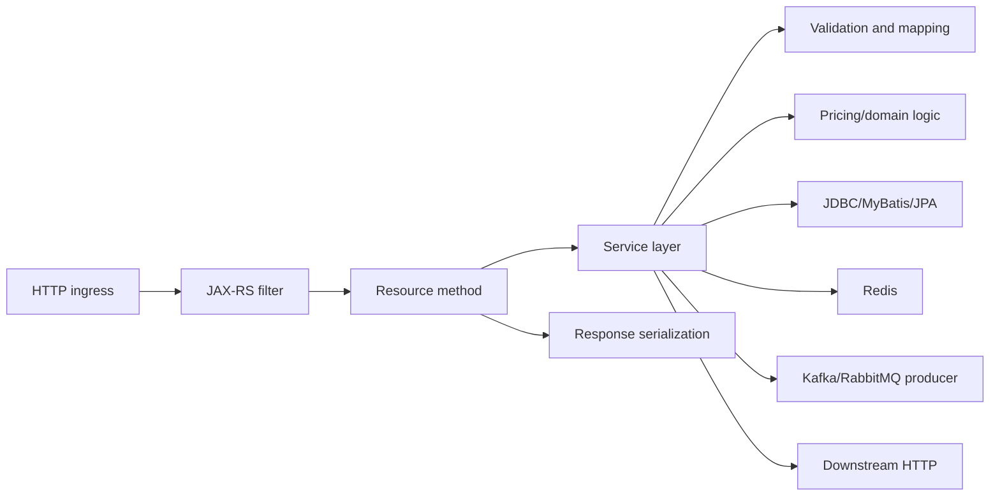
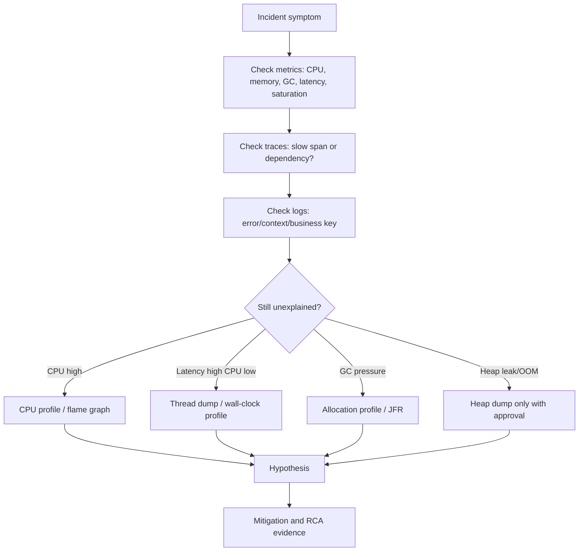

# Cheatsheet Observability Part 053 — Profiling and Continuous Profiling

> Fokus part ini: memahami profiling sebagai signal observability tambahan ketika logs, metrics, dan traces belum cukup menjawab **kenapa Java service lambat, CPU tinggi, memory naik, thread macet, allocation berlebihan, atau latency muncul tanpa error yang jelas**.

---

## 1. Core Mental Model

Logs menjawab:

```text
Apa event yang terjadi?
```

Metrics menjawab:

```text
Seberapa sering, seberapa besar, seberapa cepat, seberapa parah?
```

Traces menjawab:

```text
Request ini menghabiskan waktu di mana?
```

Profiling menjawab:

```text
CPU, memory, allocation, lock, thread, dan runtime time sebenarnya habis di fungsi apa?
```

Profiling bukan pengganti logs, metrics, dan traces.

Profiling adalah alat untuk menjelaskan masalah runtime yang tidak cukup terlihat dari signal biasa.

Contoh:

```text
Symptom:
API latency naik dari p95 300 ms menjadi 2.5 s.

Metrics:
CPU tinggi, GC pause naik.

Trace:
Tidak terlihat dependency lambat.

Profiling:
CPU habis di JSON serialization + excessive object allocation.
```

Tanpa profile, engineer bisa salah menyalahkan database, network, atau Kafka.

---

## 2. Why Profiling Exists

Di production Java/JAX-RS system, banyak masalah tidak muncul sebagai exception.

Beberapa masalah hanya muncul sebagai:

- CPU tinggi;
- latency naik;
- throughput turun;
- GC pause panjang;
- heap naik perlahan;
- direct memory naik;
- thread pool penuh;
- request stuck;
- lock contention;
- excessive allocation;
- serialization bottleneck;
- regex/backtracking issue;
- logging overhead;
- metrics cardinality overhead;
- cache deserialization overhead;
- ORM hydration overhead;
- TLS/compression overhead;
- class loading anomaly;
- safepoint pressure.

Logs mungkin normal.

Traces mungkin hanya menunjukkan span aplikasi lambat tanpa menjelaskan line/function penyebabnya.

Metrics hanya menunjukkan symptom.

Profiling memberi evidence internal runtime.

---

## 3. Profiling vs Monitoring vs Tracing

| Concern | Monitoring/Metrics | Tracing | Profiling |
|---|---|---|---|
| Unit utama | Time series | Request/span | Runtime stack/function |
| Pertanyaan | Apakah sistem sehat? | Request lambat di span mana? | CPU/memory/time habis di method mana? |
| Granularity | Aggregated | Per request/sample request | Per stack sample/allocation/thread |
| Best for | Alerting, trend, SLO | Distributed latency | Runtime bottleneck |
| Risiko | Cardinality/cost | Sampling/cost/privacy | Overhead/dump privacy |
| Output | Chart | Trace waterfall | Flame graph/profile/dump |

Profiling sering dipakai setelah metrics/traces mempersempit area masalah.

```text
Metrics -> ada symptom
Trace -> lokasi kasar
Profile -> penyebab runtime detail
```

---

## 4. Profiling Signal Types

Profiling bukan satu signal tunggal.

Ada beberapa jenis profile:

| Signal | Pertanyaan utama |
|---|---|
| CPU profile | CPU habis di method mana? |
| Wall-clock profile | Waktu elapsed habis di mana, termasuk blocking/waiting? |
| Allocation profile | Object allocation terbesar dari mana? |
| Memory/heap profile | Object apa yang menahan heap? |
| Lock profile | Thread menunggu lock apa? |
| Thread dump | Thread sedang apa saat ini? |
| Heap dump | Object graph dan retained memory seperti apa? |
| JFR recording | Event runtime JVM apa yang terjadi? |
| Flame graph | Stack mana yang paling mahal secara visual? |
| Continuous profile | Bagaimana profile berubah dari waktu ke waktu? |

Setiap jenis profile punya use case dan risiko berbeda.

---

## 5. CPU Profile

CPU profile menunjukkan stack yang menggunakan CPU.

Useful untuk:

- CPU usage tinggi;
- request latency naik tanpa dependency lambat;
- serialization/deserialization bottleneck;
- expensive validation;
- inefficient mapping DTO/entity;
- excessive logging formatting;
- regex issue;
- crypto/compression overhead;
- hot loop;
- inefficient collection usage;
- JSON processing overhead;
- ORM hydration overhead;
- cache serialization overhead.

Contoh diagnosis:

```text
Symptom:
CPU service quote-api naik ke 90%.

Trace:
DB spans normal.
Redis spans normal.
HTTP downstream normal.

CPU profile:
35% in ObjectMapper serialization
20% in BigDecimal pricing calculation
15% in log JSON encoder

Likely issue:
Large payload + expensive calculation + excessive INFO logs.
```

CPU profile menjawab apakah service benar-benar busy atau hanya waiting.

---

## 6. Wall-Clock Profile

CPU profile tidak selalu cukup.

Jika thread banyak menunggu lock, I/O, condition, sleep, atau blocking queue, CPU profile bisa terlihat kecil.

Wall-clock profile melihat elapsed time.

Useful untuk:

- request stuck;
- lock contention;
- blocking external call;
- thread waiting;
- synchronized bottleneck;
- queue wait;
- connection pool wait;
- thread pool starvation;
- Kafka/RabbitMQ consumer blocked;
- scheduler job stuck.

Contoh:

```text
CPU low
Latency high
Thread count high

Wall-clock profile:
Many request threads waiting on HikariPool.getConnection()

Root direction:
Connection pool exhaustion, not CPU problem.
```

---

## 7. Allocation Profile

Allocation profile menunjukkan dari mana object dibuat.

Di Java, high allocation rate dapat memicu GC pressure meskipun heap tidak leak.

Useful untuk:

- GC frequency tinggi;
- young GC spike;
- latency jitter;
- CPU habis untuk allocation/GC;
- excessive DTO mapping;
- repeated string concatenation;
- JSON parsing overhead;
- ORM entity hydration;
- unnecessary collection copy;
- logging message allocation;
- metrics label allocation;
- large batch processing.

Contoh:

```text
Metric:
Allocation rate naik tajam setelah release.

Allocation profile:
Large temporary List<OrderLineDto> created per request.

Trace:
Endpoint /orders/{id}/summary slower at p95.

Fix direction:
Avoid full object graph hydration; stream/select projection.
```

Allocation profile membantu membedakan:

```text
Memory pressure karena allocation churn
vs
Memory pressure karena leak/retained objects
```

---

## 8. Memory Profile and Heap Dump

Memory profile atau heap dump digunakan ketika ingin memahami object yang bertahan di heap.

Useful untuk:

- suspected memory leak;
- heap terus naik;
- old-gen pressure;
- OOMKilled;
- cache tidak pernah evict;
- static map leak;
- ThreadLocal leak;
- classloader leak;
- unbounded queue;
- large payload retained;
- process variable/object retained terlalu besar;
- batch job menahan seluruh dataset.

Namun heap dump berisiko tinggi.

Heap dump dapat berisi:

- PII;
- token;
- password;
- authorization header;
- cookie;
- customer data;
- quote/order payload;
- commercial data;
- internal config;
- secrets;
- database result data.

Rule utama:

```text
Heap dump adalah sensitive artifact, bukan file debug biasa.
```

Jangan upload heap dump ke lokasi tidak terkontrol.

Jangan share lewat chat/email umum.

Jangan simpan tanpa retention policy.

---

## 9. Thread Dump

Thread dump adalah snapshot semua thread dan stack saat itu.

Useful untuk:

- deadlock;
- request stuck;
- thread pool exhaustion;
- blocked threads;
- waiting threads;
- high thread count;
- scheduler/job stuck;
- consumer not processing;
- connection pool wait;
- lock contention;
- blocked logging appender;
- stuck shutdown;
- stuck startup.

Thread states yang penting:

| State | Arti debugging |
|---|---|
| RUNNABLE | Sedang running atau ready; bisa CPU-bound atau native/blocking nuance |
| BLOCKED | Menunggu monitor lock |
| WAITING | Menunggu tanpa timeout |
| TIMED_WAITING | Menunggu dengan timeout, sleep, poll, atau timed wait |
| TERMINATED | Selesai |

Contoh pattern:

```text
Many HTTP worker threads:
TIMED_WAITING at com.zaxxer.hikari.pool.HikariPool.getConnection

Meaning:
Request threads menunggu DB connection.
```

Contoh deadlock:

```text
Thread A holds lock quoteCache and waits orderLock
Thread B holds orderLock and waits quoteCache
```

Thread dump biasanya lebih aman daripada heap dump, tetapi tetap dapat mengandung:

- path;
- class name internal;
- query fragments;
- thread names with tenant/request info;
- stack info sensitive secara security.

---

## 10. Flame Graph

Flame graph adalah visualisasi stack sample.

Cara membaca umum:

```text
Lebar frame = total sample/time/cost yang masuk ke stack tersebut.
Tinggi frame = kedalaman call stack.
Frame lebar = kandidat bottleneck.
```

Flame graph membantu melihat:

- hot method;
- hot call path;
- library bottleneck;
- repeated serialization;
- logging overhead;
- lock/wait profile;
- allocation hot path;
- CPU wasted in framework glue;
- hidden overhead dari instrumentation.

Mental model:

```text
Trace tells which span is slow.
Flame graph tells what code inside that span is expensive.
```

---

## 11. Java Flight Recorder Awareness

Java Flight Recorder atau JFR adalah mekanisme recording event JVM yang cocok untuk diagnosis production jika dikonfigurasi dengan aman.

JFR dapat menangkap event seperti:

- CPU samples;
- allocation events;
- garbage collection;
- safepoints;
- thread park/block;
- socket I/O;
- file I/O;
- class loading;
- exceptions;
- monitor enter;
- method profiling;
- heap statistics;
- JVM information.

JFR berguna karena relatif production-oriented dibanding banyak teknik profiling berat.

Namun tetap perlu policy:

- kapan boleh dijalankan;
- siapa boleh menjalankan;
- berapa durasi recording;
- overhead profile yang diizinkan;
- storage location;
- retention;
- redaction/handling;
- incident attachment policy;
- apakah allowed di regulated environment.

---

## 12. Async Profiler Awareness

Async profiler sering dipakai untuk CPU, allocation, lock, dan wall-clock profiling pada JVM.

Manfaat:

- overhead relatif rendah;
- menghasilkan flame graph;
- dapat melihat native + Java stack;
- berguna untuk CPU dan allocation bottleneck;
- sering lebih akurat untuk beberapa kasus dibanding profiler tradisional.

Namun dalam enterprise production, penggunaan tool seperti ini harus diverifikasi:

- apakah tersedia di image/container;
- apakah allowed oleh security/platform policy;
- apakah membutuhkan privilege tertentu;
- apakah kompatibel dengan kernel/runtime/container;
- apakah bisa dipakai di node production;
- bagaimana artifact disimpan;
- bagaimana akses dibatasi.

Internal team mungkin punya tool standar lain.

Jangan mengasumsikan async profiler tersedia atau disetujui.

---

## 13. Continuous Profiling

Continuous profiling adalah pengumpulan profile secara terus-menerus atau periodik dengan overhead rendah.

Tujuannya:

- melihat perubahan runtime setelah deployment;
- menemukan CPU hotspot sebelum incident;
- melihat memory allocation trend;
- membandingkan version A vs B;
- menemukan regression;
- memahami cost per endpoint/job;
- mendeteksi slow creep;
- mendukung performance engineering;
- memberi evidence historis ketika incident sudah lewat.

Perbedaan dengan profiling manual:

| Concern | Manual Profiling | Continuous Profiling |
|---|---|---|
| Trigger | Saat investigasi | Selalu/periodik |
| Coverage | Terbatas waktu | Historis |
| Risk | Lebih intrusive jika salah | Harus low overhead by design |
| Use case | Deep dive incident | Regression, baseline, trend |
| Cost | Artifact ad hoc | Storage/query ongoing |

Continuous profiling sangat berguna ketika incident transient.

```text
Jika incident terjadi jam 02:00 dan sudah pulih jam 02:15,
manual profiling jam 09:00 tidak lagi melihat penyebabnya.

Continuous profile dapat menunjukkan apa yang terjadi saat window incident.
```

---

## 14. Profiling in Java/JAX-RS Request Lifecycle

Untuk Java/JAX-RS backend, profiling bisa dipakai di beberapa titik:



Hotspot umum:

- request body deserialization;
- validation rules;
- DTO/entity mapping;
- pricing calculation;
- large collection processing;
- SQL result mapping;
- JSON response serialization;
- structured logging encoder;
- trace/log enrichment;
- metrics label generation;
- compression;
- auth token verification.

Trace waterfall mungkin hanya menunjukkan:

```text
quote-api internal processing = 1.8s
```

Profile dapat memecahnya menjadi:

```text
600 ms pricing calculation
450 ms response serialization
300 ms object mapping
200 ms logging encoder
250 ms miscellaneous allocation/GC
```

---

## 15. Profiling Database-Heavy Paths

Database observability biasanya dimulai dari:

- query latency metric;
- slow query log;
- connection pool metric;
- query span;
- database dashboard.

Namun profiling tetap berguna ketika DB terlihat normal tetapi endpoint lambat.

Kemungkinan penyebab di aplikasi:

- ORM hydration terlalu besar;
- N+1 query tersembunyi;
- MyBatis mapping mahal;
- result set terlalu besar;
- DTO projection buruk;
- business post-processing mahal;
- transaction terlalu panjang karena aplikasi CPU-bound;
- connection dipegang terlalu lama setelah query selesai;
- lazy loading memicu query tambahan.

Debug pattern:

```text
DB query time: 80 ms
Endpoint latency: 2.1 s
Trace DB span: normal
CPU/allocation profile: heavy entity-to-DTO mapping + JSON serialization

Conclusion:
Masalah bukan database engine, tetapi application-side data processing.
```

---

## 16. Profiling Messaging and Background Consumers

Kafka/RabbitMQ consumer sering punya failure mode yang tidak terlihat dari HTTP dashboard.

Profiling berguna untuk:

- consumer lag naik tanpa error;
- message processing lambat;
- batch size terlalu besar;
- deserialization mahal;
- idempotency lookup mahal;
- deduplication structure memory-heavy;
- DLQ handling mahal;
- retry loop CPU-heavy;
- ack tertunda karena processing blocked;
- poison message memicu repeated expensive failure.

Untuk background jobs:

- reconciliation job lama;
- batch job OOM;
- scheduler drift;
- lock contention antar worker;
- memory retained selama batch;
- query result ditahan semua di memory;
- report generation CPU-heavy.

Observability combination:

```text
Consumer lag metric -> symptom
Trace/message span -> slow processing area
Profile -> expensive function/allocation/lock
Logs -> business key and failure context
```

---

## 17. Profiling Redis, Cache, and Serialization Paths

Redis latency metric bisa normal tetapi aplikasi tetap lambat karena:

- serialization/deserialization mahal;
- large cached object;
- compression/decompression overhead;
- key generation expensive;
- cache stampede protection lock contention;
- Lua script result processing;
- local cache memory pressure;
- JSON parsing repeated;
- cache miss path expensive.

Profile membantu membedakan:

```text
Redis server slow
vs
network slow
vs
client-side serialization slow
vs
application processing after cache read slow
```

Key privacy tetap penting.

Jangan memasukkan raw Redis key, customer ID, order ID, atau tenant-sensitive data ke profile label/metadata jika tool memungkinkan metadata enrichment.

---

## 18. Profiling Camunda/Workflow Paths

Workflow systems dapat terlihat lambat karena:

- worker code CPU-heavy;
- external task polling inefficient;
- process variable serialization mahal;
- variable payload terlalu besar;
- expression evaluation costly;
- retry loop;
- job acquisition contention;
- DB interaction dari engine;
- human task queries terlalu berat;
- incident handling batch expensive.

Profile berguna ketika:

```text
Failed job count tidak tinggi,
tetapi worker throughput turun dan backlog naik.
```

Investigasi perlu menggabungkan:

- process instance metrics;
- failed job/incident metrics;
- worker latency;
- DB metrics;
- JVM profile;
- thread dump;
- business key logs.

---

## 19. Production-Safe Profiling Principles

Profiling production harus dikontrol.

Prinsip utama:

1. Mulai dari signal paling ringan.
2. Batasi durasi profiling.
3. Batasi scope service/pod/node.
4. Gunakan sampling profiler jika memungkinkan.
5. Jangan mengambil heap dump tanpa approval/policy.
6. Jangan menjalankan profiler berat saat service sudah sangat degrade tanpa mitigasi.
7. Catat waktu profiling sebagai event investigasi.
8. Simpan artifact di lokasi aman.
9. Batasi akses artifact.
10. Hapus artifact sesuai retention.

Safe sequence:

```text
Metrics -> logs -> traces -> thread dump/JFR short recording -> deeper profile -> heap dump only if necessary and approved
```

Unsafe pattern:

```text
Production latency incident
Engineer langsung ambil heap dump besar dari pod regulated workload
Artifact dishare via channel umum
```

Itu bukan debugging matang.

Itu menciptakan risiko security/compliance baru.

---

## 20. Profiling Decision Matrix

| Symptom | First signals | Profiling signal | Likely evidence |
|---|---|---|---|
| CPU high | CPU metric, request rate, deployment marker | CPU profile/flame graph | Hot method/library |
| Latency high, CPU low | Trace, thread pool, pool metrics | Wall-clock profile, thread dump | Blocking/waiting/lock |
| GC pause high | JVM metrics, allocation rate | Allocation profile, JFR | Allocation hot path |
| Heap grows | Heap metric, GC, OOM events | Heap dump/memory profile | Retained object graph |
| Request stuck | Trace, active request, logs | Thread dump | Waiting/blocking stack |
| Consumer lag | Consumer metrics, logs | CPU/wall profile | Slow handler/deserialization |
| Job OOM | Job logs, memory metrics | Heap dump/allocation profile | Batch retention/unbounded collection |
| Post-release regression | Deployment marker, metrics | Continuous profile diff | New hotspot/regression |

---

## 21. Profiling and Deployment Regression

Profiling sangat kuat untuk release comparison.

Pertanyaan:

```text
Setelah release, apa yang menjadi lebih mahal?
```

Evidence yang perlu dibandingkan:

- CPU per endpoint;
- allocation rate per endpoint;
- GC pause;
- top stack frame before/after;
- serialization cost;
- DB mapping cost;
- logging cost;
- instrumentation overhead;
- feature flag path;
- config change impact.

Contoh:

```text
Before release:
Top CPU = pricing calculation 18%

After release:
Top CPU = audit event JSON serialization 31%

Likely regression:
Audit payload too large or emitted too frequently.
```

Profiling membantu menghindari RCA yang terlalu umum seperti "traffic naik" padahal ada code path baru yang mahal.

---

## 22. Profiling and Observability Overhead

Observability sendiri dapat menjadi sumber overhead.

Profile dapat menunjukkan overhead dari:

- excessive structured logging;
- JSON log encoder;
- synchronous appender;
- log masking regex mahal;
- metrics label construction;
- high-cardinality metric creation;
- tracing span enrichment berlebihan;
- baggage propagation overhead;
- large span attributes;
- audit event serialization;
- dashboard query side effects jika endpoint debug dipanggil sering;
- debug logging accidentally enabled.

Rule:

```text
Observability must improve production understanding without becoming the production bottleneck.
```

---

## 23. Security and Privacy Concerns

Profiling artifacts harus diperlakukan sebagai sensitive data.

### 23.1 Heap Dump Risk

Heap dump paling berisiko karena dapat berisi actual object values.

Potential leakage:

- user/customer data;
- quote/order details;
- pricing data;
- auth token;
- cookies;
- request/response body;
- secrets;
- DB credentials;
- API keys;
- tenant data;
- commercial contract terms.

### 23.2 Thread Dump Risk

Thread dump lebih rendah risikonya tetapi tetap bisa mengandung:

- SQL fragments;
- path/query string;
- class/package names;
- business key in thread name;
- internal endpoint names.

### 23.3 JFR/Profile Risk

JFR/profile dapat mengandung:

- class/method names;
- file paths;
- environment metadata;
- event payload depending on configuration;
- socket/file information;
- command line flags;
- system properties.

Security checklist:

- classify artifact sensitivity;
- restrict access;
- avoid external sharing;
- store in approved location;
- encrypt at rest if required;
- define retention;
- scrub if tooling supports it;
- record who accessed artifact;
- delete after investigation window.

---

## 24. Cost Concerns

Profiling cost muncul dari:

- runtime overhead;
- CPU overhead;
- memory overhead;
- storage of profiles;
- continuous profiling ingestion;
- query/index cost;
- engineer analysis time;
- incident artifact handling;
- long-term retention;
- duplicated profiles across many pods;
- profiling all services without prioritization.

Cost-aware strategy:

```text
Profile critical services first.
Profile representative pods.
Use low-overhead continuous profiling if approved.
Increase detail only during investigation.
Retain detailed profiles only as long as needed.
```

---

## 25. Correctness Concerns

Profiling can mislead.

Common traps:

### 25.1 Sampling Bias

A profile is a sample, not absolute truth.

Short profile window can miss intermittent issue.

### 25.2 Wrong Window

Profiling after incident may show normal behavior.

Always align profile time with symptom window.

### 25.3 Wrong Pod

In Kubernetes, only some pods may be affected.

Profile the pod with actual symptom.

### 25.4 CPU vs Wall-Clock Confusion

CPU profile may not show blocking wait.

High latency with low CPU needs wall-clock/thread dump.

### 25.5 Load Differences

Profile under different traffic mix may not represent incident.

### 25.6 Instrumentation Overhead Misread

Profiler may show observability library overhead, but root cause may be excessive signal design.

Do not blame the library before reviewing signal volume and configuration.

---

## 26. Kubernetes Profiling Considerations

In Kubernetes, profiling requires platform awareness.

Questions:

- Which pod is affected?
- Is CPU throttling happening?
- Is memory limit too low?
- Is pod being OOMKilled?
- Is profiling allowed inside container?
- Does container image include tooling?
- Can ephemeral debug container be used?
- Does security context allow required capability?
- How to copy artifact securely?
- How to avoid profiling wrong replica?
- How to correlate pod restart with profile window?

Useful metadata:

- namespace;
- pod name;
- container name;
- image digest;
- version;
- node;
- CPU/memory requests/limits;
- deployment revision;
- config version;
- trace/log correlation;
- incident time window.

---

## 27. Cloud and Hybrid Deployment Considerations

In AWS/Azure/on-prem/hybrid environments, profiling constraints differ.

Cloud concerns:

- managed runtime restrictions;
- node access policy;
- sidecar/agent availability;
- storage location;
- encryption;
- IAM/RBAC access;
- cross-region profile storage;
- data residency;
- network egress cost;
- integration with cloud monitoring;
- audit trail for artifact access.

On-prem concerns:

- stricter network boundaries;
- limited tool installation;
- customer-controlled environment;
- data extraction constraints;
- offline artifact review;
- support process approval;
- customer-specific security rules.

Hybrid concerns:

- profile collected in one environment may not be comparable to another;
- latency bottleneck may be network-bound, not CPU-bound;
- access paths and approvals differ;
- data residency may restrict artifact movement.

---

## 28. Incident Debugging Workflow with Profiling

A practical sequence:



Important: profiling should answer a specific question.

Bad:

```text
Let's profile everything.
```

Good:

```text
CPU is 95% on quote-api pods after release 2026.07.11.
DB spans are normal.
We need a 2-minute CPU profile from one affected pod during peak traffic.
```

---

## 29. Profiling Questions Senior Engineers Should Ask

Before profiling:

- What symptom are we explaining?
- What time window matters?
- Which service/pod/job/consumer is affected?
- What signals already exist?
- Is issue CPU-bound, memory-bound, blocking, or dependency-bound?
- What profiling artifact is minimally sufficient?
- Is production profiling allowed?
- What data sensitivity does artifact carry?
- Where will artifact be stored?
- Who can access it?
- How long will it be retained?
- What action will profile evidence enable?

After profiling:

- Does the profile align with metric/trace/log evidence?
- Was the sample window representative?
- Is hotspot root cause or symptom?
- Is the cost in business logic, framework, dependency client, or observability layer?
- Can mitigation be applied safely?
- What signal should be added to avoid profiling next time?

---

## 30. PR Review Checklist

When reviewing code likely to affect runtime performance or profiling evidence, ask:

- Does this change increase allocation rate?
- Does this change create large temporary collections?
- Does this change serialize/deserialize large payloads?
- Does this change increase logging volume or log payload size?
- Does this change add expensive masking/regex logic?
- Does this change add high-cardinality metrics?
- Does this change add span attributes with large values?
- Does this change hold DB connections longer?
- Does this change increase transaction duration?
- Does this change increase batch memory footprint?
- Does this change use unbounded queues/maps/caches?
- Does this change introduce blocking calls in request thread?
- Does this change affect Kafka/RabbitMQ consumer throughput?
- Does this change affect Redis serialization or key generation?
- Is there a way to observe performance regression after deployment?
- Is there a deployment marker/version label for comparison?

---

## 31. Internal Verification Checklist

Cek di internal CSG/team:

- Profiling tools apa yang approved untuk production?
- Apakah Java Flight Recorder boleh digunakan?
- Apakah async profiler atau continuous profiler tersedia?
- Apakah ada standard runbook untuk CPU high, GC high, OOM, stuck thread, dan consumer lag?
- Apakah thread dump boleh diambil dari production pod?
- Apakah heap dump boleh diambil? Dengan approval siapa?
- Di mana profiling artifacts boleh disimpan?
- Siapa yang boleh mengakses profiling artifacts?
- Berapa lama artifact disimpan?
- Apakah artifact diklasifikasikan sebagai sensitive?
- Apakah ada process untuk redaction atau secure transfer?
- Apakah Kubernetes environment mendukung ephemeral debug container?
- Apakah container image punya tooling minimal untuk diagnostics?
- Apakah profile bisa dikorelasikan dengan deployment version, pod, namespace, trace ID, dan incident window?
- Apakah continuous profiling tersedia di cloud/on-prem/hybrid deployment?
- Apakah customer/on-prem environment punya pembatasan data extraction?
- Apakah profiling pernah dipakai dalam incident RCA sebelumnya?
- Apakah ada known hotspot pada quote/order/pricing/fulfillment/workflow path?
- Apakah profiling overhead pernah diukur?
- Apakah security/privacy team punya aturan khusus untuk heap/thread/JFR artifact?

---

## 32. Common Anti-Patterns

### 32.1 Profiling Without a Question

Profiling tanpa hypothesis menghasilkan noise.

Selalu mulai dari pertanyaan spesifik.

### 32.2 Taking Heap Dump Too Early

Heap dump mahal dan sensitif.

Gunakan hanya jika memory/retained object question memang membutuhkan heap dump.

### 32.3 Profiling the Wrong Replica

Di Kubernetes, satu replica bisa bermasalah karena node, traffic skew, cache state, atau stuck request.

Profile affected pod.

### 32.4 Ignoring Time Window

Profile setelah incident selesai bisa memberi false reassurance.

### 32.5 Treating Profile as RCA Alone

Profile adalah evidence runtime.

RCA tetap butuh timeline, change history, logs, metrics, traces, and user impact.

### 32.6 Sharing Dumps Carelessly

Heap dump dan JFR bukan attachment biasa.

### 32.7 Blaming JVM Too Quickly

Banyak “JVM problem” sebenarnya:

- bad allocation design;
- unbounded data structure;
- poor query/result handling;
- excessive logging;
- bad cache policy;
- thread pool misuse;
- wrong container limits.

---

## 33. Field Guide: Which Artifact Should I Ask For?

| Situation | Ask for |
|---|---|
| CPU 90% and latency high | Short CPU profile/flame graph from affected pod |
| Latency high, CPU normal | Thread dump + wall-clock profile |
| GC pause high | JFR + allocation profile |
| Heap keeps growing | Memory trend first, heap dump only if approved |
| OOMKilled | Kubernetes events + memory metrics + heap dump if reproducible/approved |
| Consumer lag without errors | Consumer metrics + handler profile |
| Job stuck | Job logs + thread dump + job span/metrics |
| Post-release CPU regression | Before/after profile comparison |
| Suspected observability overhead | CPU/allocation profile with focus on logging/metrics/tracing stack |

---

## 34. Key Takeaways

Profiling is for runtime truth.

Use it when normal observability signals point to a problem but cannot explain internal cost.

The strongest debugging flow is:

```text
Metrics identify symptom.
Traces locate request/dependency area.
Logs provide context and business keys.
Profiles explain runtime cost.
```

For senior backend engineers, profiling maturity means:

- asking precise performance questions;
- choosing the least risky artifact;
- respecting production safety;
- protecting sensitive data;
- correlating profile with incident timeline;
- using profile evidence to improve code and observability.

Profiling should not be a panic button.

It should be a disciplined part of production debugging.
