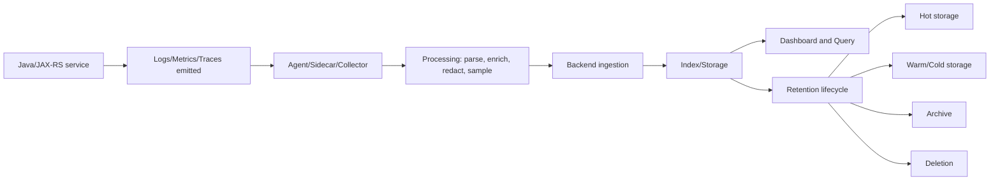

# Cheatsheet Observability Part 054 — Log/Metric/Trace Storage and Retention

> Fokus part ini: memahami bahwa telemetry tidak selesai saat log, metric, atau trace berhasil di-emit. Signal harus di-ingest, diproses, disimpan, diindeks, diamankan, dicari, diretensi, diarsipkan, dan dihapus dengan benar. Tanpa storage dan retention yang tepat, observability gagal saat incident, audit, compliance review, atau cost review.

---

## 1. Core Mental Model

Telemetry lifecycle:

```text
Emit -> collect -> transport -> process -> index -> store -> query -> retain -> archive/delete
```

Banyak engineer fokus hanya pada emit.

```text
"Service sudah log."
"Metric sudah expose."
"Trace sudah muncul."
```

Tetapi production observability membutuhkan pertanyaan lanjutan:

- Apakah signal berhasil masuk backend?
- Apakah field diindeks?
- Apakah query masih cepat saat incident?
- Apakah retention cukup untuk RCA?
- Apakah audit log disimpan cukup lama?
- Apakah sensitive data terlindungi?
- Apakah access control sesuai?
- Apakah cost ingestion dan storage terkendali?
- Apakah data bisa ditemukan setelah 7/30/90 hari?
- Apakah data dihapus sesuai policy?

Storage dan retention adalah bagian dari observability design, bukan urusan platform belaka.

---

## 2. Why Storage and Retention Matter

Telemetry berguna hanya jika tersedia ketika dibutuhkan.

Contoh failure:

```text
Incident terjadi Jumat malam.
RCA dilakukan Senin.
Trace retention hanya 24 jam.
Trace evidence hilang.
```

Contoh lain:

```text
Customer dispute muncul 60 hari setelah order amendment.
Application logs retention 14 hari.
Audit event tidak lengkap.
Tidak ada evidence siapa mengubah apa.
```

Storage/retention menentukan kemampuan:

- incident debugging;
- RCA;
- compliance evidence;
- audit investigation;
- customer support;
- security investigation;
- trend analysis;
- capacity planning;
- SLO review;
- release comparison;
- cost management.

---

## 3. Telemetry Storage Types

Tiap signal punya storage model berbeda.

| Signal | Storage shape | Query pattern | Retention pressure |
|---|---|---|---|
| Logs | Event documents/lines | Search/filter by fields/time | High volume |
| Metrics | Time series | Aggregate/rate/percentile over time | Cardinality-sensitive |
| Traces | Trace/span graph | Lookup trace, service map, latency waterfall | Volume/sampling-sensitive |
| Audit logs | Immutable business/security events | Entity/action/actor/time investigation | Compliance-sensitive |
| Profiles | Sampled runtime artifacts | Hotspot/time-window analysis | Artifact-sensitive |
| Health/synthetic | Time series + event history | Availability and endpoint checks | SLO-sensitive |

Do not assume one retention policy fits all signals.

---

## 4. Basic Lifecycle Diagram



A failure at any step can make observability disappear.

---

## 5. Log Storage

Log storage usually optimizes for search.

Common query patterns:

- find by timestamp window;
- find by service name;
- find by environment;
- find by trace ID;
- find by correlation ID;
- find by request ID;
- find by tenant ID if allowed;
- find by quote/order ID if allowed and governed;
- find by error code;
- find by endpoint;
- find by log level;
- find by deployment version;
- find by pod/container.

Log storage concerns:

- ingestion volume;
- parsing correctness;
- JSON schema drift;
- indexed fields;
- unindexed field query slowness;
- multiline stack trace handling;
- timestamp parsing;
- timezone consistency;
- duplicate logs;
- dropped logs;
- backpressure;
- retention tier;
- access control;
- sensitive field masking;
- cost per GB ingested/stored/searched.

Bad log storage design:

```text
All logs stored as raw text with inconsistent timestamp and no trace_id field.
```

Good log storage design:

```text
Structured JSON logs with standard indexed fields:
time, level, service, env, version, trace_id, span_id, correlation_id, request_id,
endpoint_template, http_status, error_code, tenant category, pod, namespace.
```

Sensitive fields still need policy.

---

## 6. Metric Storage

Metric storage optimizes for time series aggregation.

Common query patterns:

- request rate by service;
- error rate by endpoint;
- p95 latency by service/version;
- consumer lag by topic/group;
- connection pool saturation;
- JVM heap/GC trend;
- Redis hit ratio;
- DB lock wait trend;
- pod CPU throttling;
- SLO burn rate.

Metric storage concerns:

- cardinality;
- label governance;
- scrape interval;
- data resolution;
- downsampling;
- retention by resolution;
- stale series;
- missing samples;
- counter reset;
- histogram bucket strategy;
- label churn;
- aggregation correctness;
- remote write cost;
- dashboard query cost;
- alert query cost.

Metric retention usually has resolution tiers.

Example concept:

```text
Raw 15s samples: 7-14 days
Downsampled 1m: 30-90 days
Downsampled 5m/1h: 6-18 months
```

Do not copy this as internal policy.

Verify actual platform retention.

---

## 7. Trace Storage

Trace storage optimizes for request graph and latency investigation.

Common query patterns:

- find trace by trace ID;
- search slow traces;
- search error traces;
- service dependency graph;
- latency breakdown;
- span attribute filtering;
- compare endpoint latency traces;
- inspect downstream failure chain;
- sample representative traces;
- investigate async trace continuity.

Trace storage concerns:

- sampling rate;
- trace completeness;
- span volume;
- attribute size;
- attribute cardinality;
- retention duration;
- tail sampling policy;
- error/latency-biased retention;
- trace-to-log correlation;
- PII in span attributes;
- dropped spans;
- collector backpressure;
- backend query limits.

Trace retention is often shorter than log/metric retention because traces can be high volume.

This affects RCA.

```text
If trace retention is 24-72 hours,
incident process must capture important trace IDs quickly.
```

---

## 8. Audit Log Storage

Audit logs have different requirements from application logs.

Audit storage should support:

- immutability or tamper evidence;
- actor/action/target/time query;
- before/after evidence;
- business entity lookup;
- security investigation;
- compliance retention;
- access control;
- export/reporting;
- chain of custody where required;
- deletion policy aligned with regulation and contract.

Audit log cannot be treated as disposable debug logs.

Bad pattern:

```text
Audit events written only to normal app logs with 14-day retention.
```

Better pattern:

```text
Audit events stored in dedicated audit store or protected log stream,
with retention and access rules based on compliance/security policy.
```

For quote/order systems, audit storage may matter for:

- approval decision;
- price override;
- order amendment;
- cancellation;
- user impersonation;
- permission change;
- configuration/catalog change;
- manual fallout resolution;
- reconciliation action.

---

## 9. Hot, Warm, Cold, and Archive Storage

Storage tiers help balance cost and query speed.

| Tier | Purpose | Query speed | Cost | Example use |
|---|---|---|---|---|
| Hot | Recent incident/debugging | Fast | Highest | Last few days logs/traces |
| Warm | RCA/recent trend | Moderate | Medium | Last weeks/months searchable telemetry |
| Cold | Rare investigation | Slow | Lower | Older logs/audit data |
| Archive | Compliance/legal/history | Very slow/manual | Lowest | Long retention evidence |

Senior engineers should know which tier their data enters and when.

Important questions:

- When does data leave hot storage?
- Is warm/cold data still searchable?
- How long does restore take?
- Are indexes preserved?
- Are structured fields still queryable?
- Are archived audit logs tamper-evident?
- Who can restore data?
- What is restore cost?

---

## 10. Retention Policy Design

Retention should be based on use case.

| Use case | Signal | Retention driver |
|---|---|---|
| Real-time alerting | Metrics | SLO and alert window |
| Incident triage | Logs/traces/metrics | On-call investigation window |
| RCA | Logs/metrics/traces/deploy markers | Post-incident review delay |
| Customer support | Logs/audit/business events | Support SLA and dispute window |
| Compliance | Audit/security logs | Legal/regulatory/contract policy |
| Capacity planning | Metrics/profiles | Seasonal trend window |
| Release comparison | Metrics/profiles/log summaries | Deployment cadence |
| Security investigation | Security logs/audit/access logs | Security policy |

Bad retention policy:

```text
Keep everything forever.
```

Also bad:

```text
Delete everything after 7 days because storage is expensive.
```

Good retention policy:

```text
Keep the right signal, at the right resolution, for the right duration,
with the right access controls, at acceptable cost.
```

---

## 11. Retention and SLO/RCA

Retention must support operational processes.

If RCA normally happens 3-5 business days after an incident, trace retention of 24 hours creates evidence loss.

Options:

- extend trace retention;
- capture trace IDs during incident;
- export representative traces to incident record;
- use tail sampling to retain error/slow traces longer;
- keep aggregate metrics longer;
- keep deployment markers longer;
- keep structured incident logs longer;
- formalize evidence capture in runbook.

Ask:

```text
Can we still reconstruct an incident one week later?
```

If not, retention is not aligned with incident process.

---

## 12. Retention and Auditability

Audit retention is driven by business, legal, compliance, and security needs.

For CPQ/order management, audit may need to answer:

- Who changed the quote?
- Who approved the price?
- Who rejected the order?
- What was the previous value?
- What was the new value?
- When did the action happen?
- From where was it performed?
- Was delegation/impersonation involved?
- Which policy/rule/process allowed the action?
- Was the action later reversed?

Audit retention must be verified internally.

Do not assume application log retention equals audit retention.

---

## 13. Query Performance

Telemetry that exists but cannot be queried during incident is operationally weak.

Query performance depends on:

- indexed fields;
- time range;
- cardinality;
- field type consistency;
- partitioning/sharding;
- storage tier;
- query language skill;
- dashboard query design;
- aggregation complexity;
- retention tier;
- backend capacity;
- noisy tenants/services.

Bad query:

```text
Search all logs for "timeout" over 30 days across all namespaces.
```

Better query:

```text
service=quote-api
AND env=prod
AND endpoint_template=/quotes/{quoteId}/price
AND error_code=DOWNSTREAM_TIMEOUT
AND time between incident_start and incident_end
```

Structured logs make query performance and accuracy better.

---

## 14. Indexed Fields and Queryable Fields

Not every field should be indexed.

Indexing everything increases cost.

Indexing too little reduces debugging speed.

Candidate indexed fields:

- timestamp;
- service name;
- environment;
- namespace;
- pod;
- container;
- version;
- log level;
- trace ID;
- span ID;
- correlation ID;
- request ID;
- endpoint template;
- HTTP method;
- HTTP status;
- error code;
- exception class;
- dependency name;
- topic/queue;
- job name;
- process definition;
- action type;
- target entity type.

Sensitive/high-cardinality fields need governance:

- user ID;
- tenant ID;
- customer ID;
- quote ID;
- order ID;
- raw path;
- raw query string;
- error message;
- SQL statement;
- Redis key;
- message key;
- process variable value.

Do not blindly index business identifiers.

Use approved field policy.

---

## 15. Access Control

Observability data often contains sensitive information.

Access control should consider:

- production vs non-production access;
- log access by role;
- audit log access by role;
- security log access;
- customer/tenant data boundaries;
- on-call emergency access;
- break-glass process;
- query audit trail;
- export/download permissions;
- dashboard sharing;
- cross-team visibility;
- third-party/vendor access;
- customer environment constraints.

Important distinction:

```text
Can view dashboard
is not the same as
can query raw logs
is not the same as
can export audit logs
is not the same as
can download heap dump/profile artifacts.
```

---

## 16. Privacy and Data Minimization

Storage amplifies privacy risk.

A sensitive field emitted once may be copied into:

- log backend;
- archive;
- backup;
- dashboard cache;
- incident export;
- alert notification;
- ticket comment;
- data lake;
- external vendor system.

Therefore redaction should happen as early as possible.

Preferred order:

```text
Do not emit sensitive value.
If emitted, redact at application boundary.
If still present, redact in collector/processor.
If still present, restrict access and remediate.
```

Do not rely only on downstream redaction.

Application code must avoid logging secrets/PII by design.

---

## 17. Telemetry Storage and OpenTelemetry Collector

If OpenTelemetry Collector is used, it can influence storage outcomes.

Collector may:

- receive telemetry;
- batch data;
- limit memory;
- retry export;
- redact attributes;
- drop attributes;
- enrich resource metadata;
- sample traces;
- route signals to different backends;
- split pipelines by environment/service;
- transform names/attributes;
- control export protocol.

Collector failure can cause storage gaps.

Questions:

- What happens when backend is down?
- Are spans/logs/metrics dropped?
- Is retry configured?
- Is queue configured?
- Is memory limiter dropping data?
- Is batch size too large?
- Are processors removing needed fields?
- Are resource attributes consistent?
- Are errors visible from collector metrics/logs?

---

## 18. Dropped Telemetry

Telemetry may be dropped at many layers.

Possible drop points:

- application logger async queue;
- log file rotation;
- sidecar/agent buffer;
- OpenTelemetry SDK batch processor;
- collector memory limiter;
- collector queue overflow;
- backend rate limit;
- network issue;
- parser failure;
- invalid timestamp;
- payload too large;
- cardinality guardrail;
- sampling rule;
- retention expiration;
- index lifecycle transition;
- access restriction.

Debugging missing telemetry requires checking pipeline end to end.

```text
Missing in backend does not always mean not emitted.
```

---

## 19. Time and Timestamp Correctness

Storage depends on correct time.

Common issues:

- application timestamp timezone mismatch;
- container/node clock drift;
- backend ingestion time vs event time confusion;
- logs delayed by buffering;
- metric scrape timestamp mismatch;
- trace span timestamp skew across services;
- old logs ingested late;
- future timestamp rejected;
- dashboard time range wrong;
- daylight saving confusion in global teams.

Best practice:

- emit timestamps in UTC;
- use consistent field name;
- include timezone/offset where applicable;
- distinguish event time vs ingestion time;
- monitor clock drift;
- align incident timeline in UTC or agreed team standard.

---

## 20. Retention and Kubernetes

Kubernetes adds metadata and lifecycle complexity.

Important metadata:

- namespace;
- pod name;
- container name;
- node;
- deployment;
- replica set;
- image tag;
- image digest;
- app label;
- version label;
- Helm release;
- Argo CD app;
- environment;
- cluster name;
- region;
- availability zone.

Without Kubernetes metadata, logs become hard to use after pod restarts.

Problem:

```text
Pod was deleted after incident.
Logs only had hostname-like pod name.
No version, namespace, or deployment label.
```

Better:

```text
Logs enriched with service, namespace, pod, container, image_digest, version, cluster, env.
```

Retention must account for ephemeral infrastructure.

Pod logs must be shipped before pod deletion.

---

## 21. Retention in Cloud and Hybrid Environments

AWS/Azure/on-prem/hybrid deployments may have different retention constraints.

Cloud concerns:

- CloudWatch/Azure Monitor retention settings;
- Log Analytics workspace retention;
- regional storage;
- data residency;
- managed service logs;
- load balancer logs;
- WAF logs;
- cloud audit logs;
- storage lifecycle rules;
- encryption and key management;
- IAM/RBAC;
- egress cost;
- cross-account/subscription access;
- backup/archive policy.

Hybrid/on-prem concerns:

- customer-controlled retention;
- limited outbound telemetry;
- air-gapped or restricted environments;
- local log storage capacity;
- manual export process;
- customer-specific compliance;
- differing time sync;
- support access approval;
- delayed evidence retrieval.

Do not assume cloud and on-prem have same observability retention.

---

## 22. Storage Cost Model

Observability cost comes from several dimensions:

```text
Cost = ingestion + indexing + storage + query + retention + export + operational overhead
```

### 22.1 Log Cost Drivers

- log volume;
- average event size;
- stack trace volume;
- debug logs;
- duplicate logs;
- high-cardinality indexed fields;
- retention length;
- query frequency;
- archive restore.

### 22.2 Metric Cost Drivers

- number of time series;
- label cardinality;
- scrape interval;
- histogram bucket count;
- remote write volume;
- retention length;
- dashboard/alert query complexity.

### 22.3 Trace Cost Drivers

- request volume;
- span count per request;
- sampling rate;
- span attributes;
- event attributes;
- retention length;
- tail sampling cost;
- backend indexing.

### 22.4 Audit Cost Drivers

- event volume;
- retention duration;
- immutability controls;
- encryption;
- access audit;
- archive/export requirements;
- compliance reporting.

---

## 23. Cost-Aware Retention Patterns

Useful strategies:

### 23.1 Keep Aggregates Longer Than Raw Data

Raw logs/traces may be short retention.

Metrics and summaries can be longer retention.

```text
Raw traces: short
Service latency/error metrics: long
Incident representative trace IDs: stored in incident record
```

### 23.2 Downsample Metrics

Keep high-resolution metrics for recent debugging.

Keep lower-resolution metrics for trend.

### 23.3 Sample Traces Intelligently

Retain more error/slow/business-critical traces.

Sample successful low-risk traffic more aggressively.

### 23.4 Separate Audit from Debug Logs

Audit retention should not depend on debug log retention.

### 23.5 Avoid Indexing Unused Fields

Index fields that support real queries.

Do not index payload blobs.

### 23.6 Use Structured Summaries

For high-volume noisy events, emit counters/aggregates instead of every detail.

---

## 24. Storage Failure Modes

### 24.1 Data Not Emitted

Application does not produce signal.

### 24.2 Data Emitted but Not Collected

Agent/sidecar/collector misconfigured.

### 24.3 Data Collected but Dropped

Queue full, memory limiter, backend rate limit, sampling, parser rejection.

### 24.4 Data Stored but Not Searchable

Field not indexed, parsing failed, wrong type, wrong timestamp.

### 24.5 Data Searchable but Too Slow

Large time range, high-cardinality filter, inefficient query, overloaded backend.

### 24.6 Data Exists but Access Denied

RBAC/policy prevents investigator from seeing needed data.

### 24.7 Data Expired

Retention shorter than investigation need.

### 24.8 Data Corrupted or Inconsistent

Schema drift, timestamp issues, duplicate ingestion, wrong service labels.

---

## 25. Debugging Missing Telemetry

When signal is missing, ask:

```text
Was it emitted?
Was it collected?
Was it processed?
Was it exported?
Was it accepted by backend?
Was it indexed?
Was it retained?
Do I have permission to see it?
Am I querying the right time/service/env/field?
```

Practical checklist:

1. Check application config.
2. Check local stdout/log file if available.
3. Check agent/sidecar logs.
4. Check collector metrics/logs.
5. Check backend ingestion errors.
6. Check parser/schema errors.
7. Check timestamp/time range.
8. Check sampling rules.
9. Check retention policy.
10. Check RBAC/access.
11. Check environment/namespace/service labels.
12. Check whether dashboard uses different datasource.

---

## 26. Incident Evidence Capture

If retention is limited, incident process must capture evidence early.

Capture:

- incident start/end time;
- affected service/version;
- deployment marker;
- dashboard screenshots or links with time range;
- query links;
- trace IDs;
- representative log events;
- error codes;
- customer/tenant impact scope if allowed;
- dependency metrics;
- alert firing timeline;
- mitigation timestamp;
- related config changes;
- relevant audit events;
- known missing telemetry.

Do not copy sensitive raw data into incident notes unless policy allows it.

Prefer links to controlled systems when possible.

---

## 27. Java/JAX-RS Storage Implications

For Java/JAX-RS service, storage design should preserve:

- service name;
- environment;
- version;
- endpoint template;
- HTTP method;
- HTTP status;
- latency;
- error code;
- exception class;
- trace ID;
- span ID;
- correlation ID;
- request ID;
- actor/tenant context if allowed;
- business key if governed;
- pod/container metadata;
- deployment metadata.

Without these fields, production debugging becomes manual guessing.

Example useful query:

```text
service="quote-api"
env="prod"
endpoint_template="/quotes/{quoteId}/price"
http_status>=500
version="2026.07.11.4"
time="incident window"
```

This query only works if fields are structured and stored correctly.

---

## 28. PostgreSQL/MyBatis/JPA/JDBC Storage Implications

Database observability requires storing enough metadata without leaking sensitive SQL parameters.

Useful fields:

- datasource name;
- database system;
- operation type;
- sanitized statement shape;
- query latency;
- pool wait time;
- connection pool name;
- transaction duration;
- rows affected;
- error code;
- exception class;
- trace ID;
- endpoint/job/message context.

Risky fields:

- raw SQL with parameters;
- customer names;
- account IDs;
- quote/order details;
- commercial terms;
- full WHERE clause values;
- large result payload;
- DB credentials.

Retention of slow query evidence should align with incident/RCA process.

---

## 29. Kafka/RabbitMQ/Redis/Camunda Storage Implications

Messaging and workflow telemetry should preserve causal context.

Useful fields:

- topic/queue/exchange;
- consumer group;
- partition/offset if applicable;
- message ID;
- event type;
- retry count;
- DLQ reason;
- redelivery flag;
- process definition;
- process instance ID;
- job name;
- business key;
- event age;
- processing latency;
- trace/correlation ID.

Risky fields:

- raw message payload;
- message key if customer/business-sensitive;
- Redis key;
- process variable values;
- token/header values;
- full business document.

Storage must allow debugging async issues after original HTTP request has ended.

---

## 30. Dashboard and Alert Dependency on Storage

Dashboards and alerts depend on stored telemetry quality.

A dashboard can be misleading if:

- data source has shorter retention than dashboard time range;
- metric downsampling changes percentile interpretation;
- labels changed after deployment;
- log parser changed;
- traces are sampled differently;
- environment filter is wrong;
- stale series remains visible;
- missing data is rendered as zero;
- no-data condition is not alerted;
- query silently times out.

Alert can fail if:

- metric expired;
- scrape stopped;
- label changed;
- query too expensive;
- backend throttled;
- no-data is ignored;
- retention/downsampling affects burn rate.

Storage design is therefore part of alert correctness.

---

## 31. Governance Questions

Senior engineers should ask:

- What is the retention for logs, metrics, traces, audit logs, profiles?
- Which fields are indexed?
- Which fields are prohibited?
- Which fields are encrypted/masked/redacted?
- Who owns telemetry schema?
- Who approves retention changes?
- Who pays for ingestion/storage/query cost?
- How is cardinality monitored?
- How are dropped telemetry events detected?
- How are log parser/schema changes reviewed?
- How are audit logs protected?
- How do on-prem environments differ?
- How do we handle customer data deletion requests?
- How do we preserve evidence for incidents?
- How do we prevent dashboards from depending on short-retention data?

---

## 32. PR Review Checklist

When reviewing a change that emits or stores telemetry, ask:

- Does this add new log volume?
- Are new log fields structured?
- Are fields indexed only when needed?
- Does this add sensitive data to logs/spans/metrics?
- Does this add high-cardinality labels?
- Does this add large span attributes?
- Does this change metric names or labels used by dashboards/alerts?
- Does this change trace sampling behavior?
- Does this require retention change?
- Does this emit audit events to the correct storage path?
- Does this preserve trace/correlation ID in stored logs?
- Does this work in Kubernetes ephemeral pods?
- Does this work in AWS/Azure/on-prem/hybrid environments?
- Does this increase storage/query cost?
- Does this need platform/SRE/security review?
- Does this affect compliance retention?

---

## 33. Internal Verification Checklist

Cek di internal CSG/team:

- Apa log backend yang digunakan?
- Apa metric backend yang digunakan?
- Apa trace backend yang digunakan?
- Apa audit log storage yang digunakan?
- Berapa retention logs untuk prod/non-prod?
- Berapa retention metrics raw dan downsampled?
- Berapa retention traces?
- Berapa retention audit logs?
- Apakah profiling/JFR/heap/thread artifacts punya retention tersendiri?
- Field log apa yang wajib ada?
- Field apa yang indexed?
- Field apa yang dilarang karena PII/secret/commercial sensitivity?
- Apakah trace ID dan correlation ID searchable di log backend?
- Apakah deployment version/image digest searchable?
- Apakah Kubernetes metadata otomatis ditambahkan?
- Apakah collector/agent punya retry, queue, memory limiter, dan drop metrics?
- Apakah ada alert untuk telemetry ingestion failure?
- Apakah ada dashboard cost/cardinality?
- Apakah audit logs immutable atau tamper-evident?
- Siapa yang boleh melihat/export raw logs dan audit logs?
- Apakah on-prem/customer deployment punya retention berbeda?
- Apakah incident runbook meminta capture trace IDs sebelum retention habis?
- Apakah dashboard/alert query masih benar setelah downsampling?
- Apakah cloud logs seperti LB/WAF/audit logs diretensi sesuai kebutuhan?
- Apakah customer support membutuhkan lookup lebih lama daripada application log retention?

---

## 34. Common Anti-Patterns

### 34.1 Emit Everything, Retain Everything

Mahal, sulit dicari, dan meningkatkan privacy risk.

### 34.2 Retention Too Short for RCA

Evidence hilang sebelum review dilakukan.

### 34.3 Audit Logs Mixed with Debug Logs

Audit evidence mengikuti retention debug log dan bisa hilang.

### 34.4 Indexing High-Cardinality Fields Blindly

Backend menjadi mahal/lambat.

### 34.5 No Access Model

Semua engineer bisa melihat raw production logs, termasuk sensitive data.

### 34.6 Storage Without Query Design

Data ada tetapi tidak bisa ditemukan saat incident.

### 34.7 Dashboard Depends on Expired Data

Panel kosong atau misleading karena retention/downsampling.

### 34.8 No Telemetry Pipeline Monitoring

Collector/agent gagal, tetapi team tidak tahu signal dropped.

### 34.9 Treating Cloud Defaults as Policy

Default retention cloud service belum tentu sesuai incident/compliance need.

---

## 35. Practical Design Pattern

A mature service should have:

```text
1. Structured logs with standard searchable fields.
2. Metrics with governed labels and suitable retention/downsampling.
3. Traces sampled intentionally and correlated with logs.
4. Audit logs stored separately or protected with stronger retention/access.
5. Kubernetes/cloud metadata attached automatically.
6. Collector/agent pipeline monitored.
7. Sensitive fields blocked/redacted early.
8. Incident runbook that captures evidence before retention expires.
9. Dashboard/alert queries reviewed against retention and downsampling behavior.
10. Cost/cardinality reviewed regularly.
```

---

## 36. Key Takeaways

Telemetry storage and retention decide whether observability survives real operational pressure.

Strong observability is not only:

```text
Can the service emit logs, metrics, and traces?
```

It is also:

```text
Can the right people find the right evidence at the right time,
for the right duration,
with the right access control,
at acceptable cost,
without leaking sensitive data?
```

For senior backend engineers, storage and retention are architecture concerns.

They affect debugging speed, RCA quality, audit defensibility, compliance posture, dashboard correctness, alert reliability, and observability cost.
