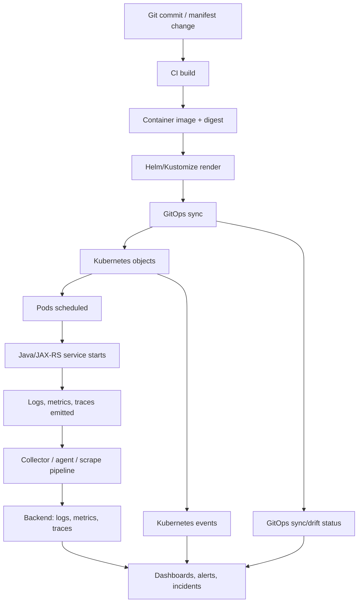
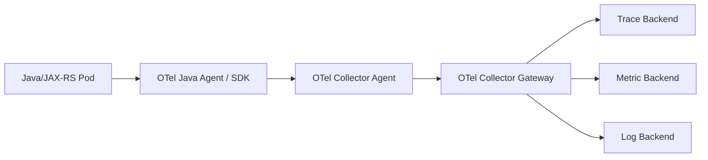

# Cheatsheet Observability Part 055 — Observability in Kubernetes and GitOps

> Fokus part ini: membuat Kubernetes dan GitOps menjadi bagian dari evidence observability. Service tidak cukup hanya emit logs, metrics, dan traces. Telemetry harus tahu `namespace`, `pod`, `deployment`, `container`, `image`, `version`, `commit`, `config`, `Helm release`, `Argo CD application`, dan status drift supaya incident dapat dikorelasikan dengan runtime state dan release state.

---

## 1. Core Mental Model

Dalam production Kubernetes, aplikasi Java/JAX-RS berjalan di dalam beberapa lapisan identitas:

```text
Java service
  -> container image
  -> pod
  -> ReplicaSet
  -> Deployment
  -> namespace
  -> cluster
  -> node
  -> Helm release / Kustomize app
  -> Argo CD application / GitOps source
  -> Git commit / config revision
```

Observability yang baik harus bisa menjawab:

- service apa yang error?
- pod mana yang error?
- deployment version apa?
- image digest apa?
- commit SHA apa?
- config revision apa?
- namespace dan cluster mana?
- node mana?
- apakah ada rollout baru?
- apakah GitOps sync berhasil?
- apakah live manifest drift dari Git?
- apakah metrics scrape berjalan?
- apakah OpenTelemetry Collector sehat?
- apakah logs dari pod tertentu hilang?

Tanpa metadata Kubernetes/GitOps, telemetry kehilangan konteks deployment.

---

## 2. Why Kubernetes Metadata Matters

Bayangkan dashboard menunjukkan error rate naik.

Tanpa metadata:

```text
service=quote-api
error_rate=18%
```

Dengan metadata:

```text
service=quote-api
env=prod
cluster=prod-apac-01
namespace=quote-order
deployment=quote-api
pod=quote-api-7fdc9d7f5c-lw29x
container=app
version=2026.07.11.3
image_digest=sha256:...
git_commit=8f91c2a
config_version=configmap-20260711-02
helm_release=quote-api
argocd_app=quote-order-prod
node=ip-10-42-17-31
```

Perbedaannya besar.

Dengan metadata lengkap, engineer bisa melihat:

- apakah error hanya terjadi pada satu pod;
- apakah error hanya pada version baru;
- apakah error muncul setelah config change;
- apakah error hanya di satu node;
- apakah rollout partial;
- apakah satu ReplicaSet masih menjalankan image lama;
- apakah GitOps sync memperkenalkan perubahan;
- apakah telemetry gap muncul karena scrape/collector issue.

Kubernetes observability bukan hanya CPU, memory, pod restart, dan OOMKilled.

Kubernetes observability juga tentang **identity, ownership, rollout evidence, and runtime-to-Git traceability**.

---

## 3. Kubernetes/GitOps Observability Lifecycle



Setiap edge di lifecycle ini bisa gagal.

Contoh:

- CI build menghasilkan image salah;
- image digest tidak cocok dengan manifest;
- Helm value salah;
- Argo CD sync gagal;
- pod start tetapi readiness gagal;
- service berjalan tetapi Prometheus tidak scrape;
- logs keluar stdout tetapi collector drop;
- OpenTelemetry exporter salah endpoint;
- dashboard tidak punya version label;
- alert tidak membedakan old version vs new version.

---

## 4. Kubernetes Object Metadata as Observability Contract

Labels dan annotations bukan dekorasi.

Dalam production observability, keduanya adalah kontrak metadata.

### Labels

Labels cocok untuk:

- grouping;
- selection;
- aggregation;
- dashboard filter;
- alert routing;
- ownership;
- app identity;
- service identity;
- environment identity;
- component identity.

Contoh label penting:

```yaml
metadata:
  labels:
    app.kubernetes.io/name: quote-api
    app.kubernetes.io/instance: quote-api-prod
    app.kubernetes.io/version: "2026.07.11.3"
    app.kubernetes.io/component: backend-api
    app.kubernetes.io/part-of: quote-order
    app.kubernetes.io/managed-by: Helm
    csg.example/team: quote-order
    csg.example/domain: cpq
    csg.example/environment: prod
```

> Gunakan prefix internal yang benar sesuai standard team. Jangan mengarang prefix CSG. Contoh `csg.example/*` di atas hanya placeholder.

### Annotations

Annotations cocok untuk metadata yang tidak dipakai sebagai selector langsung:

```yaml
metadata:
  annotations:
    git.commit: "8f91c2a..."
    git.repo: "quote-order/quote-api"
    build.id: "build-20260711-1842"
    image.digest: "sha256:..."
    config.version: "config-20260711-02"
    argocd.argoproj.io/tracking-id: "..."
    prometheus.io/scrape: "true"
    prometheus.io/path: "/metrics"
    prometheus.io/port: "8080"
```

Annotations cocok untuk traceability, tetapi jangan letakkan secret, token, password, customer data, atau sensitive commercial data di annotation.

---

## 5. Recommended Metadata Dimensions

Untuk observability, metadata minimal sebaiknya menjawab beberapa dimensi.

| Dimension | Example | Why it matters |
|---|---|---|
| Service | `quote-api` | Dashboard, alert routing, logs/traces grouping |
| Namespace | `quote-order-prod` | Multi-tenant/multi-env Kubernetes isolation |
| Environment | `prod`, `staging` | Prevent wrong-environment debugging |
| Cluster | `prod-apac-01` | Multi-cluster correlation |
| Version | `2026.07.11.3` | Release comparison |
| Git commit | `8f91c2a` | Code traceability |
| Image digest | `sha256:...` | Immutable runtime identity |
| Config version | `config-20260711-02` | Config change correlation |
| Deployment | `quote-api` | Workload-level health |
| Pod | `quote-api-...` | Per-instance debugging |
| Container | `app` | Multi-container pod clarity |
| Node | `node-17` | Node pressure correlation |
| Owner/team | `quote-order` | Alert routing and responsibility |
| Domain | `cpq`, `order` | Business/domain grouping |
| GitOps app | `quote-order-prod` | Sync/drift correlation |

Do not put high-cardinality business identifiers into Kubernetes labels.

Bad:

```yaml
labels:
  quoteId: Q-982341
  requestId: 01J...
```

Good:

```yaml
labels:
  app.kubernetes.io/name: quote-api
  app.kubernetes.io/part-of: quote-order
```

Business identifiers belong in logs/traces/audit events with governance, not Kubernetes selectors.

---

## 6. Kubernetes Resource Attributes in Telemetry

Logs, metrics, and traces should be enriched with Kubernetes resource attributes.

Useful fields:

```text
k8s.cluster.name
k8s.namespace.name
k8s.pod.name
k8s.pod.uid
k8s.container.name
k8s.deployment.name
k8s.replicaset.name
k8s.node.name
container.image.name
container.image.tag
container.image.id
service.name
service.version
service.namespace
deployment.environment.name
```

When these attributes exist, you can query:

```text
Show errors for quote-api version 2026.07.11.3 only.
Show traces from pods on node ip-10-42-17-31.
Show latency before vs after Argo CD sync.
Show log volume by namespace and deployment.
Show p95 latency grouped by container image digest.
```

Without these fields, debugging becomes manual guesswork.

---

## 7. Java/JAX-RS Service Metadata

A Java/JAX-RS service should expose runtime identity consistently across signals.

### In logs

```json
{
  "timestamp": "2026-07-11T12:15:31.112Z",
  "level": "ERROR",
  "service.name": "quote-api",
  "service.version": "2026.07.11.3",
  "deployment.environment.name": "prod",
  "k8s.namespace.name": "quote-order-prod",
  "k8s.pod.name": "quote-api-7fdc9d7f5c-lw29x",
  "trace_id": "4bf92f3577b34da6a3ce929d0e0e4736",
  "correlation_id": "corr-20260711-abc",
  "message": "Request failed during quote pricing"
}
```

### In metrics

```text
http.server.request.duration{
  service_name="quote-api",
  service_version="2026.07.11.3",
  deployment_environment="prod",
  k8s_namespace="quote-order-prod",
  http_route="/quotes/{quoteId}/price",
  http_method="POST",
  http_status_code="500"
}
```

Be careful: metric label naming depends on backend convention. Follow internal standard.

### In traces

```text
resource:
  service.name=quote-api
  service.version=2026.07.11.3
  deployment.environment.name=prod
  k8s.namespace.name=quote-order-prod
  k8s.pod.name=quote-api-7fdc9d7f5c-lw29x
  k8s.deployment.name=quote-api
```

The same identity should appear across logs, metrics, and traces.

---

## 8. Prometheus Scrape Observability

For metrics scraping, the key question is not only:

```text
Does /metrics exist?
```

The real questions:

- is the endpoint scraped?
- is the scrape target up?
- is scrape latency acceptable?
- is scrape interval correct?
- is the path correct?
- is service discovery selecting the pod/service?
- are labels attached correctly?
- are stale targets visible?
- are metric names stable?
- are high-cardinality labels controlled?
- does scrape fail after rollout?

Common patterns:

```yaml
annotations:
  prometheus.io/scrape: "true"
  prometheus.io/path: "/metrics"
  prometheus.io/port: "8080"
```

In many enterprise setups, annotations may be replaced by `ServiceMonitor`, `PodMonitor`, or platform-managed scraping.

### Internal verification checklist

- Does the team use annotations, ServiceMonitor, PodMonitor, or managed scrape?
- Are scrape labels consistent with service identity?
- Are metrics scraped from pod, service, or sidecar?
- Are failed scrape targets alerting?
- Are `/metrics` endpoints protected appropriately?
- Is scrape traffic allowed by network policy?
- Are staging/prod scrape configs consistent?

---

## 9. OpenTelemetry Collector Deployment in Kubernetes

Collector deployment mode affects reliability, resource usage, and metadata enrichment.

Common modes:

| Mode | Shape | Strength | Risk |
|---|---|---|---|
| Agent/DaemonSet | One collector per node | Local collection, node-level metadata | More pods/resources |
| Gateway/Deployment | Central collector service | Central processing/export control | Network hop, bottleneck risk |
| Sidecar | Collector per workload pod | Tight workload coupling | Operational overhead |
| Hybrid | Agent + gateway | Scalable and controllable | More config complexity |

### Common telemetry path



### Collector observability questions

- is the collector receiving telemetry?
- is the collector dropping telemetry?
- is memory limiter activated?
- is batch processor working?
- is exporter retrying?
- is backend endpoint reachable?
- is TLS/auth configured correctly?
- is queue full?
- is collector CPU throttled?
- is collector pod restarting?
- is RBAC sufficient for Kubernetes metadata enrichment?

Collector is part of production reliability.

A broken collector can create a false sense of system health.

---

## 10. Kubernetes Attributes Enrichment

For traces/logs/metrics to include Kubernetes metadata, the telemetry pipeline often needs Kubernetes metadata enrichment.

Expected enrichment examples:

```text
k8s.namespace.name=quote-order-prod
k8s.pod.name=quote-api-7fdc9d7f5c-lw29x
k8s.pod.uid=...
k8s.node.name=...
k8s.deployment.name=quote-api
k8s.container.name=app
```

Failure modes:

- collector lacks RBAC to read pod metadata;
- pod IP association fails;
- sidecar mode lacks processor support;
- collector deployed in wrong namespace;
- resource attributes overwritten incorrectly;
- service.name differs between app config and collector processor;
- labels are missing from manifests;
- telemetry backend drops resource attributes.

### Review rule

If a trace cannot answer **which pod/version produced this span**, Kubernetes enrichment is incomplete.

---

## 11. GitOps Observability

GitOps makes desired state explicit.

Observability should connect production behavior to GitOps state.

Important GitOps questions:

- what commit is deployed?
- what manifest rendered this deployment?
- was the sync successful?
- is the application healthy?
- is there drift between Git and cluster?
- did an automated sync happen recently?
- did a manual override happen?
- did rollback happen?
- did config change independently of image change?
- are all clusters/namespaces on the expected revision?

### GitOps drift as signal

Drift is not always an incident, but it is always relevant evidence.

Example:

```text
Error rate increased at 10:04.
Argo CD reports OutOfSync at 10:01.
Live deployment has config value not present in Git.
```

This changes the investigation path.

### GitOps metadata to carry

```text
git.repo
git.commit
git.branch
manifest.path
helm.chart
helm.chart.version
helm.release
values.revision
argocd.application
argocd.sync.status
argocd.health.status
config.version
secret.version reference
```

Do not expose sensitive values.

Only expose references, versions, hashes, and IDs.

---

## 12. Deployment Metadata and Release Correlation

Every production telemetry signal should be groupable by release identity.

Minimum release fields:

- service name;
- service version;
- image tag;
- image digest;
- Git commit SHA;
- build ID;
- deployment timestamp;
- config version;
- migration version if relevant;
- feature flag snapshot/version if available.

### Why image digest matters

Image tags can be mutable in weak release processes.

Image digest is immutable evidence.

During incident:

```text
version=2026.07.11.3
image_tag=quote-api:latest
```

is weaker than:

```text
version=2026.07.11.3
image_digest=sha256:6b2c...
git_commit=8f91c2a
build_id=build-20260711-1842
```

### Release marker dashboard panel

A service health dashboard should include deployment markers:

```text
10:00 deployment quote-api 2026.07.11.3
10:03 error rate increase
10:05 p95 latency increase
10:08 rollback
10:10 error rate recovery
```

Without markers, engineers waste time guessing what changed.

---

## 13. Kubernetes Events as Incident Evidence

Kubernetes events explain runtime transitions.

Useful events:

- FailedScheduling;
- Pulled/Pulling image;
- Failed image pull;
- BackOff;
- Unhealthy readiness/liveness;
- Killing container;
- OOMKilled;
- Evicted;
- ScalingReplicaSet;
- Node pressure;
- FailedMount;
- FailedAttachVolume.

Incident debugging should correlate application signal with events.

Example:

```text
09:58 new deployment started
09:59 pod scheduled
10:00 readiness probe failed
10:01 container restarted
10:02 error rate increased
10:03 HPA scaled up
```

Kubernetes events are often short-retention. Important events should be exported to log/event backend if required by incident process.

---

## 14. Pod-Level Runtime Signals

Pod-level signals are the bridge between app health and platform health.

| Signal | Common meaning | Debug question |
|---|---|---|
| Pod restart count | Crash or liveness failure | Did the app crash or get killed? |
| Container restart reason | OOMKilled, Error, Completed | Why did the container restart? |
| CPU usage | Workload demand | Is CPU saturated? |
| CPU throttling | Limit pressure | Is latency caused by throttling? |
| Memory usage | Heap/native growth | Is memory near limit? |
| OOMKilled | Memory limit exceeded | Was Java heap/container sizing wrong? |
| Readiness failure | Not ready for traffic | Did rollout send traffic too early? |
| Liveness failure | App considered dead | Is probe too aggressive? |
| Pending pod | Scheduling issue | Node capacity or constraint issue? |
| Evicted pod | Node pressure | Platform-level resource pressure? |

For Java services, CPU throttling and memory limit mismatch are common causes of confusing latency/error behavior.

---

## 15. Readiness, Liveness, and Startup Probe Observability

Probe failures must be observable.

Minimum fields/logs:

- probe endpoint;
- result;
- latency;
- dependency checked;
- failure reason;
- current application state;
- initialization progress;
- database connectivity if checked;
- cache/broker status if checked;
- build/version/config info.

Anti-pattern:

```text
Readiness failed.
```

Better:

```json
{
  "event": "readiness_check_failed",
  "service.name": "quote-api",
  "reason": "database_pool_not_initialized",
  "startup_phase": "warming_cache",
  "elapsed_ms_since_start": 41231,
  "k8s.pod.name": "quote-api-..."
}
```

Probe telemetry should not spam logs on every probe call. Aggregate or sample if needed.

---

## 16. Ingress Observability in Kubernetes

Ingress connects edge traffic to service pods.

Important signals:

- ingress request rate;
- ingress latency;
- upstream latency;
- upstream status;
- 4xx/5xx split;
- 499/client closed request;
- 502/503/504;
- TLS errors;
- route/path;
- backend service;
- ingress controller pod health;
- reload/config errors;
- request ID propagation;
- X-Forwarded-For handling.

For Java/JAX-RS debugging, ingress logs often answer:

- did the request reach the cluster?
- did it reach the service?
- did the client disconnect?
- did the ingress timeout before the app finished?
- did gateway route to the wrong backend?
- did canary routing send traffic to a bad version?

---

## 17. NetworkPolicy, Service, and DNS Observability

Kubernetes networking failures often look like application timeouts.

Signals to verify:

- service endpoints exist;
- endpoints match ready pods;
- DNS resolution works;
- NetworkPolicy allows traffic;
- egress policy allows downstream;
- service mesh sidecar is healthy if used;
- mTLS certificate is valid if used;
- connection reset/error rate;
- connection timeout;
- DNS latency/error metrics.

Example incident pattern:

```text
JAX-RS service logs downstream timeout.
HTTP client trace says connect timeout.
Kubernetes Service has zero ready endpoints.
Root cause is readiness failure in downstream deployment.
```

This cannot be solved from application logs alone.

---

## 18. Kubernetes Dashboard Design

A Kubernetes/GitOps dashboard should not be a random pod CPU page.

It should answer a set of operational questions.

### Service deployment view

- current version;
- current image digest;
- desired replicas;
- available replicas;
- unavailable replicas;
- rollout status;
- pod restarts;
- readiness failures;
- recent Kubernetes events;
- current GitOps sync status;
- last sync time;
- drift status;
- deployment markers.

### Runtime health view

- pod CPU usage;
- CPU throttling;
- memory usage;
- OOMKilled;
- JVM heap vs container memory;
- GC pause;
- active requests;
- request latency;
- error rate.

### Telemetry pipeline view

- Prometheus scrape status;
- collector pod health;
- collector dropped spans/logs/metrics;
- exporter retry count;
- log shipping error;
- trace ingestion rate;
- metric sample ingestion rate.

---

## 19. Alert Patterns

Good Kubernetes/GitOps alerts are symptom/action oriented.

Useful alert candidates:

- deployment unavailable;
- rollout stuck;
- pod restart rate high;
- OOMKilled detected;
- CPU throttling severe and latency rising;
- readiness failure sustained;
- liveness failure sustained;
- HPA maxed and latency rising;
- Prometheus scrape target down;
- OpenTelemetry Collector dropping telemetry;
- collector exporter failing;
- GitOps app out of sync for production workload;
- GitOps health degraded;
- desired vs available replica gap;
- ingress 5xx spike;
- ingress 504 spike.

Bad alert:

```text
CPU > 80% for 5 minutes
```

Better alert:

```text
quote-api p95 latency above SLO and CPU throttling > threshold for 10 minutes after deployment 2026.07.11.3
```

Best alert includes:

- service;
- namespace;
- environment;
- version;
- deployment;
- dashboard link;
- runbook link;
- likely customer impact;
- first triage steps.

---

## 20. Failure Modes

### 20.1 Missing Labels

Symptoms:

- dashboard cannot group by service/team;
- alert routes to wrong team;
- logs cannot be mapped to deployment;
- metrics appear under generic target.

Detection:

- label compliance dashboard;
- CI manifest lint;
- admission policy;
- periodic metadata audit.

Fix:

- enforce required labels in Helm/Kustomize templates;
- add CI validation;
- document internal label standard.

---

### 20.2 Broken Metrics Scrape

Symptoms:

- service appears healthy because no metrics arrive;
- alert does not fire;
- dashboard shows gaps;
- scrape target down.

Detection:

- scrape target health;
- missing series alert;
- `up == 0` equivalent;
- comparison between request logs and metric traffic.

Fix:

- correct scrape annotation/ServiceMonitor;
- fix port/path;
- fix network policy;
- fix metrics endpoint;
- verify scrape after deployment.

---

### 20.3 Collector Drop

Symptoms:

- traces missing during high traffic;
- logs missing from some pods;
- metrics delayed;
- collector pod CPU/memory high;
- exporter retry grows.

Detection:

- collector self-metrics;
- dropped telemetry counters;
- queue size;
- exporter failures;
- collector restarts.

Fix:

- tune batch/memory limiter;
- scale collector;
- fix backend endpoint;
- reduce telemetry volume;
- adjust sampling;
- check RBAC/network/TLS.

---

### 20.4 GitOps Drift

Symptoms:

- cluster state differs from Git;
- manual hotfix not reflected in repo;
- unexpected config in production;
- rollback unclear.

Detection:

- GitOps sync status;
- drift alert;
- manifest diff;
- deployment annotations.

Fix:

- reconcile Git as source of truth;
- document emergency override process;
- annotate manual changes;
- include drift in incident evidence.

---

### 20.5 Version Identity Mismatch

Symptoms:

- logs say one version;
- pod label says another;
- image tag is `latest`;
- trace resource has missing `service.version`;
- dashboard release comparison wrong.

Detection:

- compare app startup log, Kubernetes label, image digest, trace resource;
- check CI/CD metadata injection.

Fix:

- inject version from build pipeline;
- use immutable image digest;
- standardize `service.version`;
- validate at startup.

---

## 21. Production Debugging Flow

When a production issue happens in Kubernetes/GitOps environment:

```text
1. Check symptom: latency, error, availability, business impact.
2. Identify affected service/endpoint/tenant/business flow.
3. Filter by environment, cluster, namespace, service.
4. Compare versions: old vs new deployment.
5. Check deployment marker and GitOps sync timeline.
6. Check pod health: restarts, readiness, OOMKilled, throttling.
7. Check ingress/gateway signals.
8. Check dependency signals.
9. Check telemetry pipeline health.
10. Correlate logs/traces/metrics with Git commit/config/image digest.
11. Determine mitigation: rollback, scale, config revert, dependency failover, traffic shift.
```

Important: always check telemetry pipeline health before concluding the application is healthy.

No data can mean:

- no traffic;
- no problem;
- scrape failure;
- collector failure;
- query wrong;
- label changed;
- backend ingestion issue.

---

## 22. PR Review Checklist

When reviewing Kubernetes/GitOps changes, ask:

### Metadata

- Are required labels present?
- Are service/version/environment/team labels correct?
- Are annotations safe and non-sensitive?
- Is Git commit/build ID/image digest injected?
- Is config version visible?

### Metrics

- Is metrics endpoint exposed correctly?
- Is scrape config updated?
- Are labels stable and low-cardinality?
- Does dashboard still work after label changes?

### Tracing/logs

- Does `service.name` match platform naming?
- Does `service.version` match deployment version?
- Are Kubernetes resource attributes preserved?
- Does trace/log correlation survive rollout?

### Collector/agent

- Is OTel endpoint correct?
- Are collector resources adequate?
- Is collector RBAC sufficient?
- Are memory limiter/batch/exporter settings safe?
- Is telemetry sampling policy unchanged or reviewed?

### GitOps

- Is Argo/Flux/Kustomize/Helm configuration valid?
- Is sync wave/order correct?
- Is rollback path clear?
- Are manifest diffs understandable?
- Are drift implications understood?

### Operations

- Are readiness/liveness/startup probes safe?
- Are alerts updated?
- Are dashboards updated?
- Is runbook impacted?
- Is customer impact observable?

---

## 23. Internal Verification Checklist

> Gunakan checklist ini untuk berdiskusi dengan senior engineer, SRE/platform team, DevOps, security, dan backend team. Jangan menganggap nama tool atau standard internal sudah pasti.

### Kubernetes metadata

- Apa required labels internal untuk workload production?
- Apakah mengikuti standard Kubernetes recommended labels?
- Apakah ada custom labels untuk team, domain, service tier, criticality?
- Apakah label/annotation divalidasi di CI atau admission controller?
- Apakah environment/cluster/namespace/service naming konsisten?

### Deployment identity

- Bagaimana `service.version` ditentukan?
- Apakah Git commit SHA masuk ke manifest/log/trace?
- Apakah image digest dicatat?
- Apakah build ID dicatat?
- Apakah config version dicatat?
- Apakah migration version dicatat?
- Apakah feature flag state/version bisa dikorelasikan?

### GitOps

- Apakah team memakai Argo CD, Flux, Helm, Kustomize, atau tool lain?
- Apakah sync status masuk dashboard?
- Apakah drift status dipantau?
- Bagaimana emergency manual change dilakukan?
- Bagaimana rollback dilakukan?
- Apakah manifest source path mudah ditemukan dari service?

### Metrics scraping

- Apakah scrape memakai annotation, ServiceMonitor, PodMonitor, atau managed platform config?
- Apakah scrape failure punya alert?
- Apakah `/metrics` endpoint aman?
- Apakah scrape interval sesuai kebutuhan?
- Apakah label relabeling mengubah service identity?

### OpenTelemetry

- Apakah collector mode agent, gateway, sidecar, atau hybrid?
- Apakah Kubernetes metadata enrichment aktif?
- Apakah collector self-metrics dipantau?
- Apakah collector drop/exporter retry punya alert?
- Apakah sampling terjadi di app, agent, gateway, atau backend?
- Apakah resource attributes sesuai standard?

### Runtime health

- Apakah dashboard menampilkan pod restart, OOMKilled, readiness/liveness failure?
- Apakah CPU throttling dikorelasikan dengan latency?
- Apakah JVM heap dibandingkan dengan container memory limit?
- Apakah Kubernetes events disimpan cukup lama?
- Apakah node pressure terlihat?

### Security/privacy

- Apakah annotations/logs mengandung secret?
- Apakah `/metrics` endpoint bisa diakses publik?
- Apakah Kubernetes metadata mengandung customer-sensitive data?
- Apakah telemetry pipeline menggunakan TLS/auth?
- Siapa yang boleh melihat namespace/pod/log/trace data?

---

## 24. Senior Engineer Heuristics

Gunakan heuristik berikut:

1. **Every signal needs identity.** Tanpa service/version/cluster/namespace/pod, signal sulit dipakai.
2. **Every deployment needs evidence.** Tanpa marker, commit, image digest, dan config version, incident timeline lemah.
3. **Every telemetry pipeline needs observability.** Collector/scrape/log shipper juga bisa gagal.
4. **Every label has cost.** Label salah bisa merusak query, dashboard, alert, dan cardinality.
5. **Every GitOps drift is evidence.** Drift mungkin bukan root cause, tapi harus masuk timeline.
6. **Every probe failure needs reason.** `Unhealthy` tanpa context tidak cukup.
7. **Every rollback must be observable.** Jika rollback tidak terlihat di metrics/logs/traces, release observability belum matang.

---

## 25. Summary

Kubernetes dan GitOps observability menghubungkan tiga dunia:

```text
Application behavior
Runtime platform state
Git/deployment desired state
```

Service Java/JAX-RS yang production-ready harus bisa dikorelasikan dari:

```text
HTTP request -> trace/log/metric -> pod -> deployment -> image digest -> Git commit -> config version -> GitOps sync state
```

Jika rantai ini putus, incident debugging menjadi lambat dan penuh asumsi.

Part ini bukan tentang menghafal Kubernetes object. Intinya adalah memastikan runtime identity, deployment evidence, telemetry pipeline health, dan GitOps state tersedia sebagai evidence saat production behavior berubah.
