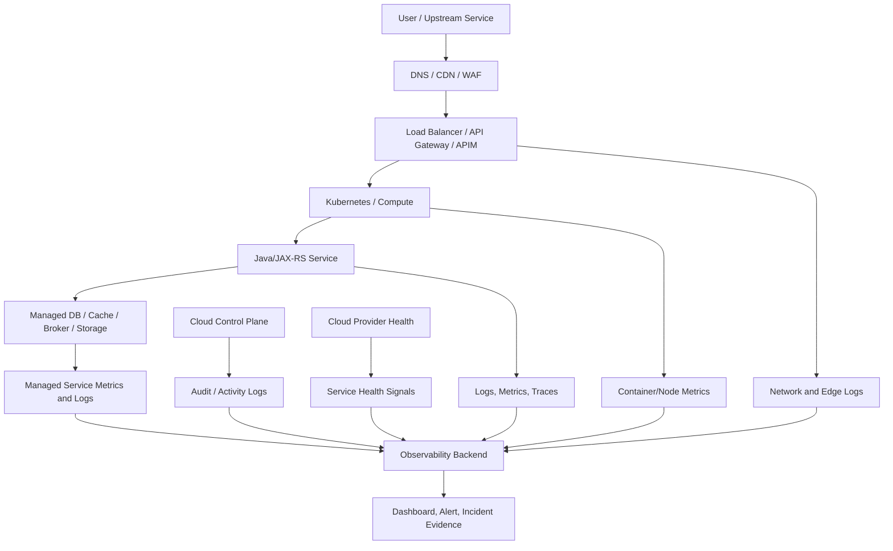

# Cheatsheet Observability Part 056 — Observability in AWS/Azure Cloud

> Fokus part ini: memahami cloud observability sebagai gabungan application telemetry, platform telemetry, managed service telemetry, network telemetry, security/audit telemetry, dan cloud health signal. Untuk enterprise Java/JAX-RS system, incident sering terlihat sebagai error aplikasi, tetapi penyebabnya bisa berada di load balancer, private endpoint, managed database, DNS, IAM, secret service, network rule, quota, cloud region, atau managed broker.

---

## 1. Core Mental Model

Cloud observability menjawab pertanyaan yang tidak bisa dijawab oleh aplikasi saja.

Application telemetry menjawab:

```text
Apa yang terjadi di service Java/JAX-RS?
```

Cloud telemetry menjawab:

```text
Apa yang terjadi pada platform tempat service berjalan?
Apa yang terjadi pada network path?
Apa yang terjadi pada managed dependencies?
Apa yang berubah di control plane?
Apa ada throttling, quota, regional issue, IAM/config change, atau managed service degradation?
```

Dalam AWS/Azure, observability perlu melihat beberapa plane:

```text
Application plane     -> logs, metrics, traces, audits from Java service
Container/compute     -> pod/container/VM/node health
Network plane         -> load balancer, WAF, NAT, DNS, private endpoint, gateway
Managed service plane -> database, cache, broker, storage, secrets, queues
Control plane         -> IAM/RBAC, deployment, config, scaling, audit events
Cloud health plane    -> region/service health and provider incidents
```

Incident senior-level biasanya membutuhkan korelasi antar plane.

---

## 2. AWS and Azure Are Not Just Hosting Providers

Jika Java/JAX-RS service berjalan di cloud, dependency production bisa mencakup:

- Kubernetes service seperti EKS/AKS;
- VM/compute node;
- load balancer;
- API Gateway atau Azure API Management;
- WAF;
- NAT gateway;
- DNS resolver;
- private endpoint/private link;
- managed PostgreSQL/RDS/Azure Database;
- managed Redis/cache;
- managed Kafka/RabbitMQ/broker equivalent;
- object storage;
- secrets/key management;
- identity and access system;
- log/metric/trace backend;
- cloud audit logs;
- cloud service health.

Observability harus menghubungkan semua ini ke application behavior.

---

## 3. Cloud Observability Lifecycle



Production debugging harus bergerak dari symptom ke plane yang benar.

---

## 4. CloudWatch and Azure Monitor Mental Model

Jangan menghafal tool sebagai tujuan.

Pahami peran masing-masing capability:

| Need | AWS-oriented concept | Azure-oriented concept | Engineering purpose |
|---|---|---|---|
| Metrics | CloudWatch Metrics | Azure Monitor Metrics | Time series for resources/services |
| Logs | CloudWatch Logs | Log Analytics / Azure Monitor Logs | Searchable event/log data |
| Alerts | CloudWatch Alarms | Azure Monitor Alerts | Notify/action on metric/log conditions |
| App APM | X-Ray / OTel backend / vendor APM | Application Insights / OTel backend / vendor APM | Traces, dependencies, app performance |
| Audit | CloudTrail | Azure Activity Log / Entra/Microsoft audit sources | Control-plane and security evidence |
| Containers | Container Insights / EKS telemetry | Container Insights / AKS telemetry | Cluster/pod/node observability |
| Service health | AWS Health | Azure Service Health | Provider-side health/degradation context |

Internal implementation may use vendor-neutral platforms instead of native tools.

The skill is the same: understand where each signal comes from and how to correlate it.

---

## 5. Cloud Resource Identity

Cloud observability depends on resource identity.

Minimum useful dimensions:

```text
cloud.provider = aws | azure
cloud.account.id / azure.subscription.id
cloud.region
cloud.availability_zone
resource.group / account/environment grouping
cluster.name
namespace
service.name
service.version
workload.name
instance.id / node.name / pod.name
vpc.id / vnet.name
subnet.id
load_balancer.name
api_gateway.name / apim.name
database.instance.name
cache.instance.name
broker.cluster.name
owner/team
environment
criticality
cost_center
```

Cloud tags matter for:

- cost attribution;
- ownership;
- alert routing;
- dashboard filtering;
- environment separation;
- security review;
- audit investigation.

Bad cloud observability:

```text
CPU high on unknown resource i-0abc...
```

Better:

```text
CPU throttling high on node pool for quote-order-prod / quote-api / prod-apac / owner=quote-order.
```

---

## 6. Application Telemetry vs Cloud Telemetry

A common incident mistake is treating cloud metrics and application metrics as substitutes.

They are complementary.

| Question | Application telemetry | Cloud telemetry |
|---|---|---|
| Is endpoint failing? | HTTP error rate by route | Load balancer 5xx/backend errors |
| Is request slow? | JAX-RS latency histogram, traces | LB target response time, network latency |
| Is DB slow? | JDBC span/query latency | Managed DB CPU/IO/locks/connections |
| Is cache slow? | Redis client latency, hit/miss | Managed cache CPU/memory/evictions/network |
| Is broker lagging? | consumer lag, processing latency | broker throughput, partitions/queues, disk/network |
| Is service unavailable? | health metrics/logs | pod/node/LB/gateway health |
| Did config change? | startup log/config version | cloud audit/activity log |
| Did IAM break? | auth/dependency error | IAM/RBAC/activity/audit logs |

Debugging improves when both sides are visible.

---

## 7. Load Balancer and Gateway Observability

Edge and gateway signals often explain failures before application telemetry sees them.

Important signals:

- request count;
- 4xx/5xx count;
- target/backend 5xx;
- gateway-generated 5xx;
- request latency;
- upstream/backend latency;
- timeout count;
- connection reset;
- TLS handshake failure;
- rejected connections;
- target health;
- route/path/API operation;
- client IP or anonymized source;
- user agent;
- request ID/correlation ID propagation;
- WAF block decision;
- rate limit decision.

### Debugging split

```text
LB 5xx high, app 5xx normal
  -> gateway/LB/upstream routing/target health issue likely

App 5xx high, LB target 5xx high
  -> app or dependency failure likely

LB latency high, app latency normal
  -> network/gateway/client-side/queueing issue likely

App latency high, DB spans high
  -> database/dependency issue likely
```

Always distinguish:

- client error;
- gateway error;
- target/app error;
- dependency error;
- network timeout;
- WAF/rate limit block.

---

## 8. WAF and Security Edge Logs

WAF logs are operational and security evidence.

Useful fields:

- timestamp;
- request ID;
- source IP or anonymized source;
- country/region if allowed;
- host;
- path;
- method;
- rule ID;
- rule group;
- action: allow/block/count/challenge;
- matched condition;
- rate limit status;
- headers considered safe to log;
- correlation ID if propagated.

Use cases:

- sudden 403 spike;
- legitimate customer blocked;
- attack traffic spike;
- bot/rate-limit behavior;
- API gateway returning errors before app;
- security incident reconstruction.

Privacy warning: WAF logs can contain headers, query strings, and request metadata. Apply redaction and access control.

---

## 9. Private Endpoint, VPC/VNet, and Network Observability

Network failures often become Java timeout exceptions.

Cloud network signals to verify:

- VPC/VNet flow logs;
- subnet route table changes;
- network security group/security group changes;
- firewall deny logs;
- private endpoint/private link status;
- NAT gateway saturation;
- DNS resolver errors;
- TLS certificate errors;
- connection timeout;
- connection reset;
- packet drops;
- cross-zone/cross-region routing;
- service endpoint health.

### Common symptom mapping

```text
JAX-RS dependency call timeout
  -> check HTTP client timeout metrics
  -> check downstream app health
  -> check LB target health
  -> check security group/NSG/firewall
  -> check private endpoint/DNS
  -> check cloud audit logs for network rule change
```

Do not jump directly to application root cause.

---

## 10. Managed Database Observability

For PostgreSQL or managed database services, app telemetry and cloud DB telemetry must be joined.

Application side:

- JDBC query span;
- query latency;
- connection pool active/idle/pending;
- transaction duration;
- timeout count;
- error code;
- retry count;
- slow endpoint correlation.

Cloud/managed DB side:

- CPU utilization;
- memory;
- storage;
- IOPS;
- connections;
- lock waits;
- deadlocks;
- replication lag;
- backup/maintenance event;
- failover event;
- storage autoscaling event;
- network throughput;
- DB error logs if available.

### Debugging example

```text
Symptom: quote pricing endpoint p95 latency increased.
Application trace: JDBC span latency high.
Pool metric: pending connections increased.
Cloud DB metric: CPU and active connections high.
DB logs: lock wait spike after migration.
Likely cause: migration/query change caused lock contention.
```

Without cloud DB metrics, the team may blame Java thread pool or API layer incorrectly.

---

## 11. Managed Cache/Redis Observability

Application side:

- cache hit/miss;
- Redis command latency;
- timeout count;
- connection pool usage;
- lock acquisition latency;
- idempotency lookup latency;
- rate limiter deny count.

Cloud/managed cache side:

- CPU;
- memory usage;
- evictions;
- connected clients;
- blocked clients;
- replication lag;
- network throughput;
- command rate;
- failover event;
- maintenance event;
- keyspace stats if available;
- slowlog if available.

Debugging pattern:

```text
Cache miss ratio rises -> DB load rises -> endpoint latency rises -> error rate rises.
```

Dashboard should show this chain, not isolated panels.

---

## 12. Managed Broker and Queue Observability

For Kafka/RabbitMQ or managed messaging services, observe both producers/consumers and broker/platform.

Application side:

- publish latency;
- publish error;
- consumer processing latency;
- consumer lag;
- event age;
- retry count;
- DLQ count;
- duplicate event count;
- ack/nack/redelivery.

Cloud/broker side:

- broker CPU;
- broker memory;
- disk usage;
- partition/queue depth;
- network throughput;
- connection count;
- throttling;
- unavailable partitions/queues;
- replication status;
- maintenance/failover event.

Debugging pattern:

```text
Order fulfillment delayed.
Consumer lag high.
Consumer processing latency normal.
Broker ingress rate spiked.
Cloud broker throughput near limit.
```

This points to capacity/traffic issue rather than bad consumer code.

---

## 13. Object Storage Observability

Object storage can be part of CPQ/order workflows for documents, contracts, attachments, generated offers, exports, or reconciliation files.

Important signals:

- request count;
- error count;
- latency;
- 4xx/5xx;
- throttling;
- object size;
- upload/download failure;
- lifecycle transition;
- replication status;
- access denied;
- encryption/key errors;
- bucket/container policy changes;
- audit logs for object access if required.

Application logs should include safe object reference identifiers, not sensitive full content.

Avoid logging:

- pre-signed URLs;
- SAS tokens;
- object content;
- sensitive document names if policy forbids;
- customer-sensitive paths.

---

## 14. Secret and Configuration Service Observability

Secret/config failures are common but under-observed.

Signals:

- secret fetch success/failure;
- config fetch success/failure;
- latency;
- throttling;
- permission denied;
- key/secret version;
- rotation event;
- expired credential;
- missing environment variable;
- config reload success/failure;
- fallback/default config usage;
- cloud audit event for secret/config change.

Do not log secret values.

Log references and versions only:

```json
{
  "event": "secret_fetch_failed",
  "secret_name_hash": "sha256:...",
  "secret_version": "v17",
  "reason": "permission_denied",
  "service.name": "quote-api"
}
```

---

## 15. Cloud Audit Logs

Cloud audit logs answer:

```text
Who changed the platform?
What changed?
When?
Where?
Using which identity?
Was it automated or manual?
```

Important audit categories:

- IAM/RBAC policy changes;
- security group/NSG/firewall changes;
- load balancer/gateway changes;
- database configuration changes;
- secret/key access;
- secret/key rotation;
- Kubernetes cluster/admin actions;
- resource creation/deletion;
- scaling policy changes;
- alert rule changes;
- logging/monitoring config changes;
- WAF rule changes.

Incident timeline should include cloud audit events when relevant.

Example:

```text
10:01 security group updated
10:02 downstream timeout begins
10:03 JAX-RS service error rate rises
10:04 alert fires
```

Without audit logs, the team may spend hours debugging application code.

---

## 16. Cloud Service Health

Cloud providers can have regional or service-specific incidents.

Service health signals are not a replacement for app observability, but they are important context.

Questions:

- Is there a provider-side incident in the affected region?
- Is the managed service degraded?
- Is a maintenance window ongoing?
- Did failover occur?
- Is there a zone-level issue?
- Are multiple unrelated services affected at the same time?

Correlate service health with application impact.

Bad conclusion:

```text
Cloud provider had issue, so that was root cause.
```

Better conclusion:

```text
Provider issue affected managed DB in region X.
During that window, quote-api DB connection latency rose, pool pending increased, p95 API latency breached SLO, and order submission error rate increased for tenants in region X.
```

Evidence matters.

---

## 17. Cross-Cloud and Hybrid Observability

Enterprise systems may run across:

- AWS;
- Azure;
- on-prem;
- private cloud;
- customer-managed deployment;
- hybrid network;
- multiple regions;
- multiple clusters;
- active/passive or active/active topology.

Cross-cloud observability needs normalized dimensions:

```text
provider
region
account/subscription
environment
cluster
namespace
service
version
team
domain
customer/tenant category if allowed
```

Without normalization, dashboards become fragmented.

Example problem:

```text
AWS dashboard uses account_id.
Azure dashboard uses subscription_id.
On-prem dashboard uses datacenter.
Application dashboard uses environment only.
```

Senior-level design should provide common navigation.

```text
Customer impact -> region/provider -> service -> dependency -> runtime -> cloud resource -> audit event
```

---

## 18. Cloud Dashboards

A cloud observability dashboard should be layered.

### 18.1 Executive/service-impact layer

- availability;
- error rate;
- latency SLO;
- affected region/provider;
- affected product/domain;
- customer impact;
- active incidents.

### 18.2 Application layer

- Java/JAX-RS request rate/error/latency;
- dependency errors;
- trace latency breakdown;
- business flow metrics;
- version/deployment markers.

### 18.3 Platform layer

- cluster/node/pod health;
- container CPU/memory/throttling;
- autoscaling;
- ingress/gateway metrics;
- collector/log pipeline health.

### 18.4 Managed dependency layer

- DB health;
- Redis/cache health;
- broker health;
- object storage;
- secrets/config service;
- API gateway/APIM;
- WAF.

### 18.5 Control-plane/audit layer

- recent IAM/RBAC changes;
- network changes;
- DB config changes;
- secret/key changes;
- monitoring/alert changes;
- deployment/sync events.

---

## 19. Alerting in Cloud Context

Cloud alerts should avoid paging for raw infrastructure noise unless it maps to impact or imminent risk.

Good cloud alert design combines symptom and cause/context.

Poor alert:

```text
Database CPU > 85%
```

Better:

```text
quote-order-prod database CPU high AND quote-api DB latency p95 high AND API latency SLO burn active
```

Poor alert:

```text
Load balancer 5xx > threshold
```

Better:

```text
Public order API gateway-generated 5xx above threshold for 10 minutes, app target 5xx normal, likely gateway/LB issue. Check WAF/LB config and recent cloud audit events.
```

Alert should include:

- provider;
- region;
- environment;
- affected service;
- resource name;
- owner;
- dashboard link;
- runbook link;
- likely customer impact;
- first cloud checks;
- recent changes if available.

---

## 20. Security and Privacy Concerns

Cloud observability frequently touches sensitive data.

Risks:

- WAF logs capturing query strings;
- gateway logs capturing auth headers;
- object storage logs exposing object paths;
- audit logs showing identities and access patterns;
- trace attributes including customer IDs;
- logs containing tokens/SAS/pre-signed URLs;
- metrics labels containing tenant/user/resource IDs;
- dashboard access too broad;
- cross-environment log leakage;
- long retention for sensitive logs.

Rules:

- redact secrets and tokens;
- avoid logging full Authorization/Cookie headers;
- avoid logging pre-signed URLs/SAS tokens;
- treat audit logs as sensitive;
- apply least-privilege access;
- separate production and non-production observability access;
- use references/hashes for sensitive resource identifiers;
- review retention policy with security/compliance.

---

## 21. Cost Concerns

Cloud observability cost can grow quickly.

Cost drivers:

- log ingestion volume;
- verbose gateway/WAF logs;
- high-cardinality metrics;
- trace volume;
- long retention;
- cross-region data transfer;
- expensive log queries;
- duplicate export to multiple backends;
- collecting debug logs in production;
- overly frequent synthetic checks;
- managed service diagnostic logs enabled without filter;
- audit log archive and search cost.

Cost control should not blindly delete evidence.

Better approach:

- define hot/warm/cold retention tiers;
- sample high-volume traces intelligently;
- keep error/latency/business-critical traces;
- filter noisy logs;
- govern metric labels;
- downsample old metrics;
- archive audit logs according to compliance;
- review top cost services monthly;
- attach cost owner/team tags.

---

## 22. Failure Modes

### 22.1 Cloud Metrics Missing

Symptoms:

- dashboard panel empty;
- alert did not fire;
- resource exists but no metrics;
- metrics delayed.

Possible causes:

- diagnostic setting disabled;
- namespace/account/subscription mismatch;
- wrong region;
- IAM/RBAC missing;
- resource tag mismatch;
- managed service metric not enabled;
- query filters wrong;
- export pipeline broken.

Debug:

- verify resource identity;
- check raw cloud metric view;
- check export config;
- check permissions;
- check dashboard query labels.

---

### 22.2 Logs Too Noisy

Symptoms:

- high ingestion cost;
- slow queries;
- incident search polluted;
- retention reduced due to cost.

Possible causes:

- access logs too verbose;
- debug logs enabled;
- WAF logs unfiltered;
- repeated retry logs;
- health check logs not sampled;
- stack trace duplication;
- gateway logs duplicate app logs.

Fix:

- filter/sampling;
- structured fields;
- reduce duplicate logs;
- tune log levels;
- separate audit logs from operational logs;
- govern retention.

---

### 22.3 Network Change Causes App Failure

Symptoms:

- downstream timeouts;
- connection refused;
- sudden 5xx;
- no code deployment.

Possible causes:

- security group/NSG change;
- route table change;
- DNS change;
- private endpoint change;
- firewall/WAF rule change;
- certificate change.

Debug:

- check cloud audit logs;
- check network flow logs;
- check gateway/LB target health;
- check DNS/private endpoint status;
- correlate with application traces.

---

### 22.4 Managed Service Throttling

Symptoms:

- intermittent latency spike;
- retry count rises;
- app error rate rises;
- dependency error code indicates throttling/rate limit.

Possible causes:

- quota limit;
- provisioned capacity reached;
- burst exhausted;
- noisy neighbor or workload spike;
- scaling lag.

Debug:

- check managed service throttling metrics;
- check client retry metrics;
- check traffic spike;
- check quota and capacity config;
- check cost/performance tier.

---

### 22.5 Audit Gap

Symptoms:

- incident timeline missing platform changes;
- cannot prove who changed config;
- security review lacks evidence;
- compliance investigation blocked.

Possible causes:

- audit logs disabled;
- retention too short;
- logs stored in inaccessible account/subscription;
- insufficient permissions;
- audit not centralized;
- manual changes bypass process.

Fix:

- centralize audit logs;
- define retention;
- enforce access control;
- include audit logs in incident checklist;
- alert on critical control-plane changes.

---

## 23. Production Debugging Flow

When application symptoms appear in cloud:

```text
1. Confirm customer/service impact.
2. Check app RED metrics and traces.
3. Check deployment/version/config markers.
4. Check gateway/LB/APIM metrics and logs.
5. Check Kubernetes/container health.
6. Check managed DB/cache/broker metrics.
7. Check network path: DNS, private endpoint, security rules, NAT, flow logs.
8. Check cloud audit/activity logs for recent changes.
9. Check cloud provider service health.
10. Check telemetry pipeline health.
11. Determine mitigation: rollback, scale, failover, config revert, rule revert, traffic shift.
```

Important: if there was no application deployment, still check cloud control-plane changes.

Many incidents are caused by platform/config/network changes, not application code.

---

## 24. Java/JAX-RS Specific Cloud Observability

For Java/JAX-RS services, cloud context should appear in runtime telemetry.

Useful resource attributes/log fields:

```text
service.name
service.version
deployment.environment.name
cloud.provider
cloud.region
cloud.availability_zone
cloud.account.id / azure.subscription.id
k8s.cluster.name
k8s.namespace.name
k8s.pod.name
container.image.id
host.id / node.name
```

Useful application fields:

```text
http.route
http.method
http.status_code
client.address if policy allows
trace_id
span_id
correlation_id
business_key category
quote_id/order_id if policy allows and not as metric labels
error_code
dependency.name
dependency.type
dependency.region
```

Do not rely on cloud resource names alone.

Application-level names and cloud-level names must be connected through tags, labels, resource attributes, and dashboards.

---

## 25. Internal Verification Checklist

> Gunakan checklist ini untuk memverifikasi kondisi internal dengan SRE/platform/cloud/security/backend team. Jangan mengasumsikan CSG memakai tool tertentu tanpa konfirmasi.

### Cloud platform

- Apakah service berjalan di AWS, Azure, on-prem, atau hybrid?
- Region mana yang digunakan?
- Apakah ada multi-region failover?
- Apakah ada active/active atau active/passive topology?
- Bagaimana account/subscription/resource group dipetakan ke environment?

### Native monitoring

- Apakah CloudWatch digunakan?
- Apakah Azure Monitor digunakan?
- Apakah Log Analytics digunakan?
- Apakah Application Insights digunakan?
- Apakah ada vendor observability lain?
- Apakah telemetry dikirim ke satu backend terpusat?

### Logs

- Log apa saja yang dikumpulkan dari cloud resources?
- Apakah load balancer/gateway/WAF logs aktif?
- Apakah DB/cache/broker diagnostic logs aktif?
- Apakah logs di-redact?
- Apakah retention logs sesuai incident/compliance need?
- Apakah access production logs dibatasi?

### Metrics

- Metrics cloud apa yang wajib untuk service dashboard?
- Apakah managed DB/cache/broker metrics masuk dashboard?
- Apakah gateway/LB/APIM metrics masuk dashboard?
- Apakah cloud metrics bisa dikorelasikan dengan `service.name`?
- Apakah tags/labels konsisten?

### Traces/APM

- Apakah traces dikirim ke vendor-neutral backend, CloudWatch/X-Ray, Application Insights, atau platform lain?
- Apakah trace context melewati gateway/LB/APIM?
- Apakah managed dependency spans muncul?
- Apakah cloud resource metadata masuk trace resource attributes?

### Network

- Apakah flow logs tersedia?
- Apakah private endpoint/private link logs tersedia?
- Bagaimana DNS issue didiagnosis?
- Bagaimana security group/NSG/firewall changes diaudit?
- Apakah NAT gateway saturation dipantau?

### Audit/security

- Apakah CloudTrail/Azure Activity Log atau equivalent aktif?
- Berapa retention audit logs?
- Apakah IAM/RBAC changes alerting?
- Apakah secret/key access diaudit?
- Apakah WAF rule changes diaudit?
- Apakah monitoring/alert rule changes diaudit?

### Cloud health

- Apakah cloud provider health status masuk incident process?
- Siapa yang memonitor regional service health?
- Bagaimana provider incident dikorelasikan dengan customer impact?

### Cost

- Apa top observability cost driver?
- Apakah log ingestion cost per service terlihat?
- Apakah diagnostic logs difilter?
- Apakah high-cardinality metrics dari cloud/app terdeteksi?
- Apakah cross-region telemetry export dikenakan biaya signifikan?

---

## 26. PR and Architecture Review Checklist

When reviewing changes involving cloud resources:

### Resource identity

- Are tags complete?
- Is owner/team clear?
- Is environment clear?
- Is service mapping clear?
- Is criticality/tier clear?

### Observability

- Are metrics enabled?
- Are logs enabled where needed?
- Are diagnostic settings configured?
- Are dashboards updated?
- Are alerts updated?
- Is runbook updated?

### Security/privacy

- Are logs safe from secrets/PII/token leakage?
- Are WAF/gateway logs filtered?
- Is access control correct?
- Is audit logging enabled?
- Are secret/key actions traceable?

### Reliability

- Are dependency limits/quotas monitored?
- Is throttling visible?
- Is failover visible?
- Is region/zone impact visible?
- Is provider health included in incident triage?

### Cost

- Will this resource generate high log volume?
- Will metrics have high-cardinality dimensions?
- Is retention appropriate?
- Is cross-region export needed?
- Is there a cost owner?

---

## 27. Senior Engineer Heuristics

1. **Application error is not always application root cause.** Check cloud control plane, network, and managed dependencies.
2. **Every cloud resource needs ownership metadata.** Untagged resources are operational debt.
3. **Audit logs are incident evidence.** Keep them accessible and retained.
4. **Cloud dashboards must connect to service impact.** Resource health alone is not enough.
5. **Network telemetry explains many timeout incidents.** Do not debug only from stack traces.
6. **Managed services still need SLO thinking.** Dependency health affects your service SLO.
7. **Provider health is context, not automatic root cause.** Correlate with your own signals.
8. **Cost is part of observability design.** Collect enough evidence, not unlimited noise.

---

## 28. Summary

Cloud observability is the ability to connect:

```text
application symptom
  -> service telemetry
  -> container/Kubernetes state
  -> gateway/load balancer behavior
  -> managed dependency health
  -> network path
  -> control-plane changes
  -> cloud provider health
  -> customer/business impact
```

For enterprise Java/JAX-RS systems, cloud telemetry is not optional background noise. It is often the only evidence that explains why a request timed out, why a dependency failed, why traffic never reached the app, why a deployment behaved differently by region, or why an incident started without a code change.

The senior engineer skill is not knowing every AWS/Azure screen. The skill is knowing which plane can explain the symptom, which signal proves it, and how to correlate it with logs, metrics, traces, audit logs, dashboards, alerts, SLOs, and incident timelines.
