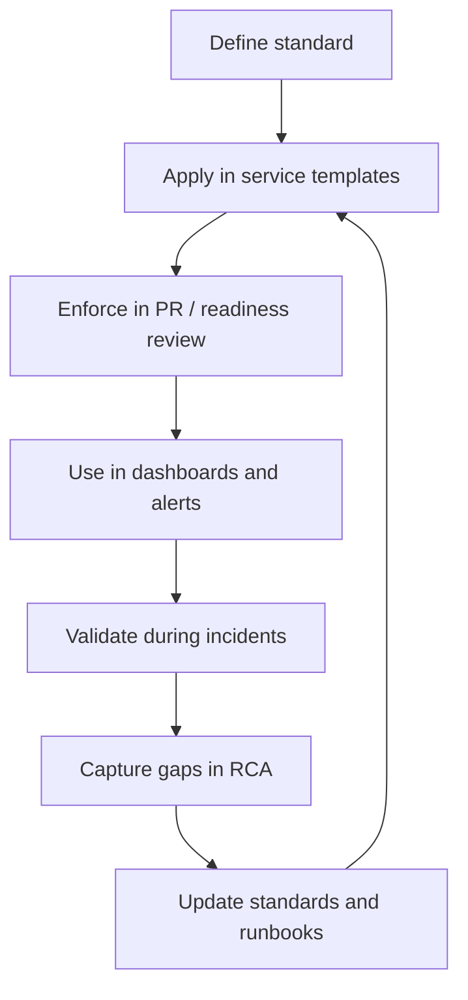

# Cheatsheet Observability Part 057 — Observability Governance

> Fokus part ini: memahami observability sebagai engineering governance, bukan sekadar kumpulan log, metrics, traces, dashboards, dan alerts yang dibuat per engineer secara ad hoc. Dalam enterprise Java/JAX-RS system, governance menentukan apakah telemetry bisa dipercaya lintas service, lintas team, lintas environment, dan lintas incident.

---

## 1. Core Mental Model

Observability governance adalah sistem aturan, ownership, review, dan lifecycle yang membuat telemetry tetap:

- konsisten;
- dapat dicari;
- dapat dikorelasikan;
- aman secara privacy/security;
- efisien secara biaya;
- berguna saat incident;
- tahan terhadap perubahan arsitektur;
- bisa dipakai oleh backend engineer, SRE/platform, support, security, compliance, dan product/domain team.

Tanpa governance, observability biasanya berubah menjadi:

```text
Setiap service punya nama metric sendiri.
Setiap team punya field log sendiri.
Trace context hilang di async boundary.
Dashboard sulit dibandingkan.
Alert noisy dan tidak punya owner.
Audit log bercampur dengan operational log.
PII bocor ke log.
Metric cardinality meledak.
Incident debugging bergantung pada orang yang kebetulan tahu sistem.
```

Governance bukan birokrasi. Governance adalah cara mengurangi entropy telemetry.

---

## 2. Why Governance Exists

Di sistem kecil, observability bisa tumbuh secara informal.

Di enterprise system, informal observability gagal karena:

- service banyak;
- team banyak;
- dependency banyak;
- environment banyak;
- deployment model bisa cloud, on-prem, atau hybrid;
- incident melibatkan beberapa boundary;
- compliance membutuhkan evidence;
- cost telemetry bisa signifikan;
- engineer baru harus bisa membaca signal tanpa tribal knowledge.

Governance menjawab pertanyaan seperti:

```text
Apa field log wajib untuk semua service?
Apa metric minimum untuk service Java/JAX-RS?
Apa label metric yang dilarang?
Apa format correlation ID?
Apa yang boleh masuk baggage?
Apa standard dashboard service health?
Alert mana yang boleh page engineer?
Siapa owner runbook?
Apa SLO wajib untuk critical service?
Berapa retention log audit?
Siapa boleh melihat log yang mengandung data sensitif?
Bagaimana PR instrumentation direview?
```

Jika pertanyaan ini tidak dijawab secara eksplisit, jawaban aktualnya akan tersebar di codebase, dashboard, Slack/email, incident notes, dan kebiasaan pribadi.

---

## 3. Governance Scope

Observability governance biasanya mencakup beberapa standard.

| Governance area | What it controls | Why it matters |
|---|---|---|
| Signal ownership | Siapa pemilik log/metric/trace/dashboard/alert | Menghindari orphaned telemetry |
| Naming convention | Nama metric, field log, span attribute, dashboard | Membuat query lintas service konsisten |
| Logging standard | Format, level, fields, redaction, exception policy | Membuat log berguna dan aman |
| Metric standard | Type, unit, labels, cardinality, lifecycle | Membuat metric benar dan murah |
| Trace standard | Span naming, attributes, propagation, sampling | Membuat trace dapat dibaca lintas service |
| Dashboard standard | Layout, audience, drilldown, ownership | Membuat dashboard actionable |
| Alert standard | Severity, routing, runbook, suppression | Mengurangi noise dan mempercepat response |
| SLO standard | SLI, target, window, burn rate | Menghubungkan reliability ke customer impact |
| Runbook standard | Triage, mitigation, escalation | Mengurangi cognitive load saat incident |
| Privacy standard | PII, secrets, masking, access control | Menghindari leakage dan compliance issue |
| Cost guardrail | Cardinality, retention, sampling, ingestion | Menjaga observability sustainable |
| Review process | PR, ADR, readiness review | Mencegah observability gap masuk production |

Senior backend engineer perlu melihat semua area ini sebagai satu sistem.

---

## 4. Signal Ownership

Setiap signal harus punya owner.

Owner bukan hanya orang yang membuat metric atau dashboard. Owner bertanggung jawab atas:

- definisi signal;
- correctness;
- naming;
- label/cardinality;
- privacy;
- dashboard usage;
- alert usage;
- runbook connection;
- lifecycle dan deprecation;
- perbaikan saat signal misleading.

Bad ownership:

```text
Metric ini dibuat dulu oleh engineer lama.
Tidak tahu masih dipakai siapa.
Alert masih aktif tapi tidak jelas owner-nya.
Dashboard ada tetapi tidak pernah dipakai saat incident.
```

Better ownership:

```text
service=quote-api
team=quote-order
owner=quote-order-backend
criticality=high
runbook=quote-api-service-health
slo=quote-api-availability-latency
```

Ownership harus terlihat di telemetry metadata, dashboard metadata, alert labels, dan service catalog.

---

## 5. Service Observability Contract

Setiap production service sebaiknya punya observability contract minimum.

Untuk Java/JAX-RS service, contract minimum bisa mencakup:

```text
Logs:
- structured JSON log
- timestamp UTC
- service.name
- service.version
- environment
- level
- logger
- message
- correlation_id / trace_id
- span_id when available
- request_id
- tenant_id when allowed
- actor_id when allowed and masked/hashed if needed
- business key when safe
- error.type / error.code / error.stack when needed

Metrics:
- request count by route template, method, status class/status code
- request latency histogram by route template and method
- error count by route template and error category
- active requests
- JVM memory and GC
- thread pool / executor saturation
- connection pool metrics
- dependency call latency/error/timeout/retry

Traces:
- inbound HTTP root/server span
- outbound HTTP client span
- database span with sanitized statement
- messaging producer/consumer span
- cache span where useful
- background job span
- trace ID correlated to logs

Dashboards:
- service health
- dependency health
- release/deployment view
- business/domain view if service owns lifecycle state

Alerts:
- symptom-based paging alert for severe user impact
- ticket alert for degradation/non-urgent issue
- runbook link
- owner and escalation path

SLO:
- availability or successful request SLI
- latency SLI for critical endpoint
- freshness/queue/workflow SLI if async critical path exists
```

Contract ini harus disesuaikan dengan internal standard team, bukan diasumsikan universal.

---

## 6. Naming Convention Governance

Naming convention membuat telemetry bisa dicari dan dibandingkan.

### 6.1 Metric naming

Metric name harus stabil, meaningful, dan tidak memasukkan dimension dinamis.

Bad:

```text
quote_123_latency
order_A1234_error_total
api_latency
count
process_time
```

Better:

```text
http.server.request.duration
http.server.request.count
quote.lifecycle.transition.count
order.fulfillment.duration
messaging.consumer.processing.duration
job.reconciliation.records.processed
```

Names should describe the thing being measured. Labels describe dimensions.

### 6.2 Log field naming

Standard field names should be consistent across services.

Example field groups:

```text
service.name
service.version
deployment.environment
trace.id
span.id
correlation.id
request.id
tenant.id
actor.id
http.method
http.route
http.status_code
error.type
error.code
error.message
business.entity_type
business.entity_id
business.action
db.system
messaging.system
messaging.destination
```

Avoid variants like:

```text
corrId
correlationId
correlation_id
x_correlation_id
Correlation-ID
```

unless a formal mapping exists.

### 6.3 Span naming

Span names should be low-cardinality.

Bad:

```text
GET /quotes/928371/items/9912
SELECT * FROM quote WHERE id = 928371
Process order ORD-9981
```

Better:

```text
GET /quotes/{quoteId}/items/{itemId}
DB query quote_by_id
process order lifecycle transition
```

Identifiers belong in attributes only when safe and only if they do not break privacy/cost rules.

---

## 7. Logging Standard

A logging standard should define at least:

- structured JSON or another machine-readable format;
- timestamp format and timezone;
- required common fields;
- log level semantics;
- exception logging policy;
- request/response logging policy;
- body/header/query parameter logging policy;
- sensitive field redaction;
- MDC/context propagation;
- audit vs operational log separation;
- async appender policy;
- runtime log level change policy;
- retention and access control expectations.

### Standard log event shape

```json
{
  "timestamp": "2026-07-11T10:15:30.123Z",
  "level": "INFO",
  "service.name": "quote-api",
  "service.version": "1.42.0",
  "deployment.environment": "prod",
  "trace.id": "4bf92f3577b34da6a3ce929d0e0e4736",
  "span.id": "00f067aa0ba902b7",
  "correlation.id": "corr-...",
  "request.id": "req-...",
  "logger": "com.example.quote.QuoteResource",
  "message": "Quote price calculation completed",
  "business.entity_type": "quote",
  "business.action": "price_calculated",
  "duration_ms": 240,
  "outcome": "success"
}
```

This is an example, not an internal CSG standard.

### Logging governance rule

Every log event should answer at least one operational question.

If it answers no question, it is noise.

If it leaks sensitive data, it is risk.

If it cannot be correlated, it is weak evidence.

---

## 8. Metric Standard

A metric standard should define:

- naming convention;
- metric type selection;
- units;
- base labels;
- allowed/disallowed labels;
- histogram bucket policy;
- cardinality limits;
- ownership;
- retention;
- dashboard/alert use;
- deprecation process.

### Metric design template

```text
Metric name:
Purpose:
Owner:
Type:
Unit:
Labels:
Allowed cardinality:
Aggregation expectation:
Dashboard usage:
Alert usage:
SLO usage:
Retention expectation:
Privacy/cost risk:
Deprecation plan:
```

### Common governance failure

```text
A metric is added for debugging one incident.
It includes request_id as a label.
It is never removed.
It creates millions of time series.
No dashboard uses it.
The backend cost increases.
```

Governance prevents temporary debugging metrics from becoming permanent cost leaks.

---

## 9. Trace Standard

A trace standard should define:

- propagator format;
- trusted inbound headers;
- span naming rules;
- required resource attributes;
- required HTTP attributes;
- database statement sanitization;
- messaging attributes;
- business attributes;
- baggage policy;
- sampling strategy;
- log-trace correlation;
- trace retention;
- trace access control.

### Required trace questions

A service trace should help answer:

```text
Where did the request enter?
Which endpoint handled it?
Which downstream calls happened?
Which call consumed most latency?
Which dependency failed?
Was the failure local or downstream?
Was retry involved?
Was async messaging involved?
Did trace context survive the async boundary?
Which logs belong to this trace?
```

### Baggage governance

Baggage is dangerous if unmanaged.

Do not put arbitrary data into baggage.

Baggage may propagate across service boundaries and can create:

- privacy risk;
- header bloat;
- spoofing risk;
- untrusted context contamination;
- accidental vendor/backend exposure.

Allowed baggage fields should be explicitly reviewed.

---

## 10. Dashboard Standard

Dashboard governance should prevent dashboard sprawl.

Every dashboard should declare:

```text
Purpose:
Audience:
Owner:
Service/domain:
Environment:
Criticality:
Data sources:
Refresh expectation:
Primary questions answered:
Drilldown links:
Related alerts:
Related runbooks:
Last reviewed:
```

### Dashboard types

| Dashboard type | Purpose |
|---|---|
| Service health | Is this service healthy now? |
| Dependency health | Are dependencies causing degradation? |
| Release health | Did a deployment/config/migration change break behavior? |
| Business lifecycle | Are quote/order processes moving correctly? |
| Incident dashboard | What is the current blast radius and mitigation progress? |
| Executive dashboard | What is the customer/business reliability posture? |

### Dashboard anti-patterns

- no owner;
- no environment filter;
- no deployment marker;
- raw path instead of route template;
- too many charts without hierarchy;
- panels with inconsistent time windows;
- charts that cannot be acted on;
- dashboards that duplicate but disagree;
- stale dashboard still linked from alerts;
- business dashboard built from non-authoritative technical metrics.

A good dashboard is a decision surface.

---

## 11. Alert Standard

Alert governance controls who gets interrupted and why.

Alert standard should define:

- severity levels;
- paging vs ticket vs informational;
- symptom-based preference;
- burn-rate policy;
- threshold review;
- alert labels;
- required annotations;
- runbook links;
- dashboard links;
- owner;
- escalation path;
- suppression/deduplication;
- false positive review;
- stale alert cleanup.

### Minimum alert metadata

```yaml
service: quote-api
environment: prod
severity: page
owner: quote-order-backend
slo: quote-api-availability
runbook: quote-api-5xx-burn-rate
dashboard: quote-api-service-health
customer_impact_hint: "Quote creation or pricing may fail"
```

### Bad alert

```text
High error count
```

### Better alert

```text
quote-api prod is burning availability error budget rapidly for POST /quotes and POST /quotes/{id}/price.
User-visible quote creation/pricing may be failing.
Start with service health dashboard, recent deployment markers, dependency error panels, and trace examples.
```

Alert text should reduce first-response ambiguity.

---

## 12. SLO Standard

SLO governance keeps reliability definitions consistent.

A useful SLO document should define:

- user journey or service boundary;
- SLI query;
- SLO target;
- measurement window;
- excluded events, if any;
- data source;
- owner;
- dashboard;
- burn-rate alert;
- escalation path;
- error budget policy;
- review cadence.

### SLO examples by system type

| System type | Possible SLI |
|---|---|
| JAX-RS API | successful requests / total valid requests |
| Pricing endpoint | p95/p99 latency under threshold |
| Async consumer | event processed within N minutes |
| Reconciliation job | completion success before deadline |
| Workflow engine | process reaches milestone within SLA |
| Order lifecycle | order not stuck beyond threshold |

Correctness SLO may matter more than availability for some enterprise workflows.

Example:

```text
It is not enough that the order API returns 200.
The order must reach the correct lifecycle state and emit the expected downstream event.
```

---

## 13. Runbook Standard

Runbooks should be operational, not decorative.

A runbook should include:

```text
Alert name:
Service/domain:
Severity:
Customer impact:
First checks:
Dashboards:
Log queries:
Trace queries:
Dependency checks:
Known causes:
Mitigation steps:
Rollback criteria:
Escalation path:
Safety warnings:
Post-incident notes:
```

### Good runbook property

A good runbook helps a competent engineer respond even if they are not the original feature author.

### Bad runbook property

```text
Check logs.
Check metrics.
Restart pod if needed.
```

This does not encode useful operational knowledge.

Better:

```text
If 5xx is concentrated on /quotes/{quoteId}/price, compare p95 latency with PostgreSQL query latency and pricing downstream timeout rate.
If deployment marker exists within 30 minutes, compare version label before/after.
If only one tenant is affected, check tenant-specific catalog/pricing configuration change before scaling service.
```

---

## 14. Privacy and Security Governance

Privacy/security rules should be embedded in observability standards, not handled after leakage occurs.

Governance should define:

- data classification;
- PII fields;
- secrets/token/header blacklist;
- allowed user/tenant identifiers;
- hashing/masking rules;
- body logging policy;
- query parameter policy;
- audit log access;
- dump/profile access;
- trace baggage policy;
- log retention by sensitivity;
- incident process for telemetry leakage.

### Sensitive fields commonly forbidden in logs

```text
Authorization
Cookie
Set-Cookie
access_token
refresh_token
password
secret
api_key
private_key
session_id
credit card/payment identifiers
raw customer personal data
commercially sensitive quote/order payloads
```

For CPQ/order systems, commercial data can be sensitive even if it is not classic PII.

Examples:

- negotiated price;
- discount rules;
- contract terms;
- customer account identifiers;
- product configuration;
- order fulfillment details.

---

## 15. Cost Guardrails

Observability cost governance should define limits and review triggers.

Cost drivers:

- log volume;
- debug logs left on;
- stack trace storms;
- metric cardinality;
- raw path labels;
- request/user/order IDs as metric labels;
- high trace sampling;
- long retention;
- duplicate telemetry pipelines;
- expensive dashboard queries;
- unbounded audit retention without archive strategy.

### Cost guardrail examples

```text
No request_id/user_id/order_id as metric label unless explicitly approved.
No raw HTTP path as metric label; use route template.
No DEBUG log in production by default.
No request/response body logging by default.
All new histograms must define bucket rationale.
All new high-volume logs must identify owner and retention.
Sampling changes require incident/debugging risk review.
```

Cost governance should preserve signal quality, not blindly reduce data.

---

## 16. Review Process

Observability governance must show up in engineering workflow.

Places to enforce review:

- PR template;
- architecture design review;
- ADR;
- production readiness review;
- release checklist;
- incident postmortem;
- SLO review;
- security/privacy review;
- cost review;
- dashboard/alert review cadence.

### PR review questions

```text
Does this change add a new failure mode?
Can we detect that failure mode?
Can we debug it without redeploying?
Are logs structured and correlated?
Are metrics named correctly with safe labels?
Does tracing survive service/message/job boundaries?
Is audit logging needed?
Could any telemetry leak sensitive data?
Could any label/cardinality cause cost explosion?
Should a dashboard or alert be updated?
Does the runbook need to change?
Does this impact an SLO?
```

A senior engineer should ask these questions before production asks them during an incident.

---

## 17. Governance Lifecycle

Observability standards need lifecycle management.



Governance is not static.

If incidents repeatedly reveal missing signal, the standard is incomplete.

If engineers repeatedly misuse a standard, the standard may be unclear, too costly, or not supported by tooling.

---

## 18. Platform Enablement vs Team Responsibility

Observability governance should not force every service team to reinvent everything.

Platform/SRE team may provide:

- logging library;
- standard JSON encoder;
- OpenTelemetry agent/config;
- collector deployment;
- service dashboard template;
- alert template;
- SLO query template;
- runbook template;
- security redaction library;
- CI checks;
- service catalog integration.

Service/backend team remains responsible for:

- domain-specific logs;
- business metrics;
- audit events;
- manual spans around important logic;
- dependency-specific context;
- correct labels;
- service runbooks;
- interpretation during incident;
- verifying telemetry in production.

The clean split:

```text
Platform provides the paved road.
Service team provides domain truth.
```

---

## 19. Governance for CPQ/Order Management Context

For CPQ/order systems, observability governance should include domain-specific standards.

Important business dimensions:

- quote lifecycle;
- order lifecycle;
- approval flow;
- pricing flow;
- product/catalog version;
- fulfillment stage;
- fallout reason;
- amendment/cancellation path;
- reconciliation result;
- tenant/account/customer boundary;
- integration partner/downstream system.

But not every dimension belongs everywhere.

Example:

```text
quote_id is useful as log/audit/trace attribute.
quote_id is usually dangerous as metric label.
```

Governance must distinguish:

| Data | Log | Metric label | Trace attribute | Audit |
|---|---|---|---|---|
| route template | yes | yes | yes | usually no |
| quote ID | maybe | usually no | maybe | yes |
| order ID | maybe | usually no | maybe | yes |
| tenant ID | depends | controlled | depends | often yes |
| actor ID | masked/controlled | no | rarely | yes |
| raw payload | usually no | no | no | maybe summarized |
| state transition | yes | yes, low-cardinality state labels | yes | yes |

This distinction is critical for privacy, cost, and debugging quality.

---

## 20. Governance Anti-Patterns

### 20.1 Governance as documentation only

A standard that is not reflected in templates, libraries, checks, or reviews will drift.

### 20.2 Tool-first governance

Choosing a vendor or backend does not create governance.

Governance is about semantics, ownership, lifecycle, privacy, cost, and usage.

### 20.3 Dashboard sprawl

Many dashboards do not mean good observability.

If engineers do not know which dashboard to use during incident, dashboard inventory is failing.

### 20.4 Alert sprawl

Many alerts do not mean better reliability.

Noisy alerts train engineers to ignore production.

### 20.5 Metric without owner

An ownerless metric becomes technical debt.

### 20.6 Audit as normal log

Audit logs must satisfy evidence requirements that normal logs often do not: integrity, retention, access control, completeness, and business semantics.

### 20.7 Blind cost cutting

Reducing telemetry without understanding incident/debugging impact creates future production risk.

---

## 21. Internal Verification Checklist

Gunakan checklist ini untuk verifikasi internal CSG/team. Jangan mengasumsikan standard sudah ada.

### 21.1 Standards and ownership

- Apakah ada observability standard resmi?
- Siapa owner standard tersebut?
- Apakah ada service catalog yang menghubungkan service, owner, dashboard, alert, runbook, dan SLO?
- Apakah setiap production service punya observability owner?
- Apakah dashboard/alert orphaned rutin dibersihkan?

### 21.2 Logging governance

- Apakah semua Java/JAX-RS service menggunakan structured logging?
- Apakah field log wajib distandardkan?
- Apakah log level semantics disepakati?
- Apakah exception logging policy jelas?
- Apakah body/header/query logging policy jelas?
- Apakah masking/redaction library tersedia?
- Apakah audit log dipisahkan dari operational log?

### 21.3 Metric governance

- Apakah metric naming convention tersedia?
- Apakah allowed/disallowed labels didefinisikan?
- Apakah cardinality dipantau?
- Apakah histogram bucket standard tersedia?
- Apakah metric owner dan lifecycle didefinisikan?
- Apakah metric baru direview untuk cost dan usefulness?

### 21.4 Trace governance

- Propagator apa yang dipakai?
- Apakah W3C trace context digunakan?
- Apakah trusted header boundary jelas?
- Apakah baggage policy tersedia?
- Apakah trace sampling policy terdokumentasi?
- Apakah SQL statement disanitasi?
- Apakah trace ID masuk ke log?

### 21.5 Dashboard and alert governance

- Apakah ada dashboard template untuk service health?
- Apakah setiap dashboard punya owner dan review date?
- Apakah alert wajib memiliki runbook link?
- Apakah severity mapping jelas?
- Apakah alert noisy direview rutin?
- Apakah paging alert berbasis symptom dan customer impact?

### 21.6 SLO and runbook governance

- Apakah critical service punya SLO?
- Apakah SLI query bisa diaudit?
- Apakah burn-rate alert digunakan?
- Apakah runbook diuji saat incident atau game day?
- Apakah runbook diupdate setelah RCA?

### 21.7 Privacy, security, and cost

- Apakah PII/secrets/token logging policy jelas?
- Apakah akses log/trace/audit dibatasi?
- Apakah retention policy berbeda untuk operational vs audit logs?
- Apakah telemetry cost dipantau per service/team?
- Apakah high-cardinality metric terdeteksi otomatis?
- Apakah debug logging production punya approval/expiry?

---

## 22. Senior Engineer Review Heuristics

Saat mereview perubahan observability, tanyakan:

```text
Apakah signal ini menjawab pertanyaan production yang nyata?
Apakah signal ini bisa dipercaya saat incident?
Apakah signal ini bisa dikorelasikan dengan signal lain?
Apakah nama dan labelnya konsisten dengan standard?
Apakah signal ini aman secara privacy/security?
Apakah biaya signal ini masuk akal?
Apakah ada owner?
Apakah ada dashboard/alert/runbook/SLO yang perlu ikut berubah?
Apakah telemetry ini masih berguna enam bulan lagi?
```

Jika jawaban banyak yang tidak jelas, perubahan observability belum matang.

---

## 23. Common Failure Modes

| Failure mode | Symptom | Governance gap |
|---|---|---|
| Missing correlation ID | Log tidak bisa dirangkai | Context standard lemah |
| Metric cardinality explosion | Backend metric mahal/lambat | Label governance lemah |
| Alert noisy | Banyak false positive | Alert review lemah |
| Dashboard misleading | Incident salah arah | Dashboard ownership lemah |
| Trace broken across Kafka/RabbitMQ | Async flow tidak terlihat | Propagation standard lemah |
| PII leaked | Security incident | Logging privacy standard lemah |
| Audit incomplete | Compliance evidence gagal | Audit governance lemah |
| SLO meaningless | Reliability discussion abstrak | SLO standard lemah |
| Runbook useless | Triage lambat | Runbook review lemah |
| Cost spike | Telemetry bill naik | Cost guardrail lemah |

---

## 24. Practical Implementation Sequence

Jika team belum punya governance matang, urutan realistis:

```text
1. Inventory current logs, metrics, traces, dashboards, alerts, SLOs, runbooks.
2. Identify critical production services and customer/business journeys.
3. Define minimum service observability contract.
4. Standardize log fields and correlation IDs.
5. Standardize RED metrics and route templating.
6. Standardize trace propagation and log-trace correlation.
7. Create service health dashboard template.
8. Review paging alerts and remove noise.
9. Add runbook requirement for paging alerts.
10. Define privacy and cardinality guardrails.
11. Add PR/ADR observability review questions.
12. Feed RCA findings back into standards.
```

Do not start by trying to standardize everything at once.

Start with the highest incident/debugging value.

---

## 25. Key Takeaways

- Observability governance reduces telemetry entropy.
- Governance is about semantics, ownership, lifecycle, security, cost, and incident usability.
- Every production signal should have purpose and owner.
- Standard naming makes cross-service debugging possible.
- Logging, metrics, tracing, dashboards, alerts, SLOs, and runbooks must be governed as one system.
- Privacy and cost are not afterthoughts.
- CPQ/order observability needs domain-specific governance because business identifiers are useful but risky.
- The best governance appears in templates, libraries, PR reviews, dashboards, alerts, and incident workflows.
- A senior backend engineer should treat missing telemetry as production risk.

---

## 26. What To Study Next

Lanjutkan ke:

```text
Part 058 — Testing Observability
```

Karena governance yang baik harus bisa diuji. Standard observability tidak cukup ditulis; harus divalidasi melalui unit test, integration test, local collector, test exporter, structured log assertion, metric assertion, trace propagation test, audit log test, dashboard validation, dan alert rule test.
