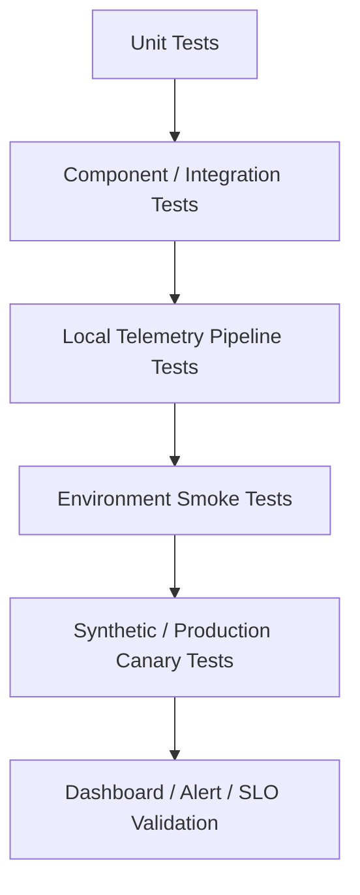

# Cheatsheet Observability Part 058 — Testing Observability

> Fokus part ini: memahami bahwa observability harus diuji seperti behavior production lainnya. Jika logging, metrics, tracing, audit, dashboards, alerts, dan SLO queries tidak divalidasi, maka sistem bisa terlihat “instrumented” tetapi gagal memberi evidence saat incident.

---

## 1. Core Mental Model

Observability testing menjawab pertanyaan:

```text
Apakah telemetry yang kita butuhkan benar-benar muncul ketika code berjalan?
Apakah field-nya benar?
Apakah context-nya tidak hilang?
Apakah metric type dan label-nya benar?
Apakah trace tersambung lintas boundary?
Apakah audit event lengkap?
Apakah redaction bekerja?
Apakah alert rule akan fire untuk kondisi yang tepat?
Apakah dashboard query membaca data yang benar?
```

Banyak team menguji business behavior tetapi tidak menguji evidence behavior.

Akibatnya:

```text
Feature berhasil secara functional test.
Tetapi saat production incident:
- correlation ID kosong;
- trace putus di Kafka consumer;
- metric tidak punya route template;
- audit event tidak mencatat actor;
- error log tidak punya error code;
- dashboard query salah label;
- alert tidak pernah fire;
- PII masuk ke log.
```

Observability testing mencegah silent telemetry failure.

---

## 2. What Counts as Observability Behavior

Telemetry adalah output sistem.

Output ini bisa dan perlu diuji.

| Signal | Testable behavior |
|---|---|
| Logs | event emitted, level, fields, redaction, correlation |
| Metrics | metric emitted, type, unit, labels, count/value, cardinality |
| Traces | span emitted, parent/child relation, attributes, status, propagation |
| Audit | actor/action/target/before/after/reason/time captured |
| Health | readiness/liveness/startup response correct |
| Dashboard | query references valid metric/label and answers intended question |
| Alert | rule fires for bad condition and stays quiet for normal condition |
| SLO | SLI query matches reliability definition |
| Collector | telemetry flows through receiver/processor/exporter safely |

The system is not production-ready if important telemetry cannot be validated.

---

## 3. Testing Pyramid for Observability

Observability tests should exist at multiple levels.



### Unit tests

Best for:

- log field construction;
- MDC/context setup;
- redaction/masking;
- metric label decision;
- audit event mapping;
- error taxonomy mapping.

### Integration tests

Best for:

- JAX-RS filter behavior;
- request/response logging;
- exception mapper telemetry;
- trace propagation;
- database instrumentation;
- Kafka/RabbitMQ headers;
- Redis client instrumentation;
- background job spans.

### Local telemetry pipeline tests

Best for:

- OpenTelemetry exporter behavior;
- collector receiver/processor/exporter config;
- attributes processor;
- resource enrichment;
- sampling behavior;
- redaction at collector layer.

### Environment smoke tests

Best for:

- deployed service emits telemetry;
- dashboards receive data;
- trace/log correlation works;
- metrics appear in backend;
- health probes behave correctly.

### Synthetic/canary tests

Best for:

- end-to-end journey health;
- route-specific availability;
- authenticated API flow;
- business lifecycle smoke;
- alert and SLO validation.

---

## 4. Unit Testing Structured Logs

Structured log tests verify that code emits useful, safe, queryable log events.

Testable properties:

- log level;
- message/event name;
- required fields;
- timestamp presence;
- service/environment context;
- request/correlation/trace IDs;
- business key presence when appropriate;
- error type/error code;
- no raw secret/PII;
- no unbounded payload;
- no duplicate stack trace.

### Example test intent

```text
Given quote pricing succeeds
When pricing completes
Then an INFO log event is emitted with:
- event = quote.pricing.completed
- quote_id present only if allowed by internal policy
- duration_ms present
- outcome = success
- correlation_id present
- no raw request body
```

### Avoid brittle log tests

Bad test:

```text
Assert exact full log line string.
```

Better test:

```text
Parse structured log as JSON and assert important fields.
```

Log tests should validate semantics, not formatting noise.

---

## 5. Testing Log Context and MDC

MDC/context tests are critical in Java services because context often breaks across filters, thread pools, async execution, and messaging consumers.

Test cases:

```text
Inbound request with X-Correlation-ID -> MDC contains correlation_id.
Inbound request without ID -> service generates request_id/correlation_id.
Response contains propagated request/correlation ID if required.
MDC is cleaned after request completes.
Second request does not inherit first request context.
Async executor task receives required context.
Background job creates new job context.
Kafka/RabbitMQ consumer extracts context from headers.
```

### MDC leak failure

A dangerous failure:

```text
Request A sets tenant_id=T1.
Thread returns to pool.
Request B uses same thread.
MDC cleanup failed.
Request B log incorrectly contains tenant_id=T1.
```

This is not merely a logging bug. It can become privacy, audit, and debugging risk.

---

## 6. Testing Redaction and Masking

Redaction should be tested as a first-class security behavior.

Test inputs should include:

- Authorization header;
- Cookie;
- Set-Cookie;
- access token;
- refresh token;
- password;
- API key;
- session ID;
- personal identifier;
- commercial quote/order payload;
- nested sensitive fields;
- case variations;
- unexpected field names.

### Test intent

```text
Given a request contains Authorization, Cookie, and sensitive JSON fields
When request logging executes
Then logs contain masked placeholders
And raw secret values are not present anywhere in captured log output
```

### Important rule

Do not only test happy-path field names.

Attackers and accidental leaks often come from unexpected nesting or alternate names:

```text
authToken
auth_token
accessToken
access_token
secretValue
clientSecret
```

---

## 7. Testing Error Logs

Error observability tests should verify that failures produce actionable evidence.

Test dimensions:

- expected vs unexpected error;
- validation error;
- authentication error;
- authorization error;
- dependency timeout;
- database constraint violation;
- optimistic locking conflict;
- retriable vs non-retriable failure;
- domain invalid transition;
- poison message;
- DLQ path;
- failed background job.

### Test intent

```text
Given downstream pricing service times out
When QuoteResource calls pricing
Then service returns mapped error response
And ERROR/WARN log contains:
- error.category = dependency_timeout
- dependency.name = pricing-service
- timeout_ms
- correlation_id
- trace_id
- quote business context if safe
- no token/request body
```

### Avoid

- asserting every stack trace line;
- logging same exception in five layers;
- treating expected validation failure as ERROR;
- swallowing error without structured event.

---

## 8. Testing Metrics

Metric tests verify that code emits correct metric names, types, labels, and values.

Testable properties:

- metric exists;
- type is correct;
- unit is correct;
- counter increments once;
- histogram/timer records duration;
- gauge changes as expected;
- labels are low-cardinality;
- label values use route templates, not raw paths;
- error category labels are bounded;
- tenant/user/request/order IDs are not used unless approved.

### Example test intent

```text
Given POST /quotes/{quoteId}/price succeeds
When request completes
Then http.server.request.duration records one value with labels:
- method=POST
- route=/quotes/{quoteId}/price
- status_code=200
- outcome=success
And no label contains raw quoteId.
```

### Metric test risk

Metrics are often asynchronous or buffered.

Tests may need to:

- use in-memory registry;
- flush registry;
- control clocks;
- avoid wall-clock assertions;
- avoid relying on exact timing values;
- assert bucket/count behavior rather than exact duration.

---

## 9. Testing Metric Cardinality

Cardinality should be tested explicitly for common mistakes.

Bad labels to catch:

```text
request_id
correlation_id
trace_id
span_id
user_id
actor_id
quote_id
order_id
raw_path
error_message
sql_statement
message_key
```

Not every one is always forbidden in every backend/signal, but they are high-risk as metric labels.

### Test intent

```text
Given many quote IDs call the same endpoint
When metrics are emitted
Then route label remains /quotes/{quoteId}
And no time series is created per quote ID.
```

For Java/JAX-RS, this often means validating route template extraction from resource metadata instead of using raw URI path.

---

## 10. Testing Trace Propagation

Trace propagation tests verify that trace context survives boundaries.

Boundaries to test:

- inbound HTTP to JAX-RS resource;
- JAX-RS resource to service layer;
- service layer to outbound HTTP client;
- service layer to JDBC/DataSource;
- service layer to Redis;
- service layer to Kafka producer;
- Kafka consumer to downstream call;
- RabbitMQ producer/consumer;
- background job;
- executor/thread pool;
- workflow/Camunda worker.

### Test intent

```text
Given an inbound request has W3C traceparent
When service publishes a Kafka event
Then produced record headers contain propagated trace context
And consumer span is linked/parented according to internal tracing standard
And logs in both producer and consumer contain trace_id.
```

### Common propagation failures

| Boundary | Failure |
|---|---|
| Executor | ThreadLocal context lost |
| Kafka/RabbitMQ | headers not copied |
| Retry/DLQ | causation lost |
| Background job | no root context created |
| ExceptionMapper | span status remains OK |
| Async response | server span ends too early |
| Manual instrumentation | wrong parent context |

---

## 11. Testing OpenTelemetry with Test Exporters

OpenTelemetry instrumentation can be tested by capturing emitted spans/metrics/logs in memory.

A good test exporter pattern:

```text
Run code under test.
Collect exported spans/metrics/logs.
Assert semantic properties.
Reset exporter between tests.
```

Testable span properties:

- span name;
- span kind;
- parent span ID;
- trace ID continuity;
- status;
- attributes;
- events;
- exception event;
- resource attributes;
- sampling behavior if configured.

### Span assertion example

```text
Expected spans:
- SERVER span: POST /quotes/{quoteId}/price
- CLIENT span: POST pricing-service /calculate
- CLIENT/INTERNAL span: DB query quote_by_id

Assertions:
- all spans share trace_id
- downstream span parent is server span or internal service span
- HTTP status attributes are present
- route template is low-cardinality
- no raw token/payload in attributes
```

Do not assert implementation-specific span count too aggressively if auto-instrumentation can change between versions.

Assert the spans that matter for debugging.

---

## 12. Testing Local Collector Pipeline

If telemetry flows through an OpenTelemetry Collector, test the pipeline behavior.

Collector tests should validate:

- receiver accepts telemetry;
- processors enrich or remove expected attributes;
- sensitive attributes are deleted/masked;
- resource attributes are added;
- batching does not drop data under normal load;
- memory limiter behavior is understood;
- exporter points to correct backend/environment;
- retry policy exists;
- sampling rules preserve error/latency/business-critical traces;
- pipeline failure is observable.

### Local test setup

Common pattern:

```text
Java service/test app
  -> OTLP exporter
  -> local OpenTelemetry Collector
  -> debug/logging exporter or test backend
```

This can be run in local Docker Compose or Testcontainers depending on team tooling.

### Collector config tests

A practical test can parse collector config and assert:

```text
receivers.otlp exists
processors.batch exists
processors.memory_limiter exists for production mode
exporters target expected endpoint for environment
sensitive attributes processor removes authorization/cookie/token fields
pipelines.traces include expected processors
pipelines.metrics include expected processors
pipelines.logs include expected processors
```

---

## 13. Testing Audit Logs

Audit log tests are different from normal log tests.

Audit events must be complete, durable, and semantically correct.

Testable audit properties:

- actor;
- action;
- target entity;
- target ID;
- timestamp;
- source/location;
- reason/comment when required;
- before value;
- after value;
- outcome;
- delegation/impersonation;
- correlation ID;
- immutability behavior;
- persistence guarantee;
- access control if testable.

### Audit test intent

```text
Given an approver approves a quote
When approval transition succeeds
Then audit event is persisted with:
- actor_id
- action=quote.approved
- target_type=quote
- target_id
- before_state=pending_approval
- after_state=approved
- correlation_id
- timestamp
- no raw sensitive payload beyond allowed audit policy
```

### Audit failure cases to test

- failed business action should create audit event or security event if required by policy;
- unauthorized attempt should be audited if policy requires;
- delegated action should record both original actor and effective actor;
- before/after values should reflect committed state, not pre-rollback state;
- duplicate retry should not create misleading duplicate audit record unless modeled explicitly.

---

## 14. Testing JAX-RS Request Telemetry

For JAX-RS/Jakarta REST, request telemetry often lives in filters and exception mappers.

Test cases:

```text
Request start log emitted.
Request end log emitted.
Latency field present.
Status code recorded.
Route template used.
Correlation/request ID extracted or generated.
Sensitive headers masked.
Query params masked where needed.
ExceptionMapper records error category and span status.
404/405 behavior is understood.
Async request does not lose context.
Streaming response telemetry is correct enough.
```

### Route template test

A common production-cost bug:

```text
route=/quotes/123
route=/quotes/456
route=/quotes/789
```

Correct:

```text
route=/quotes/{quoteId}
```

Test it directly.

---

## 15. Testing Database Observability

Database observability tests should validate visibility without leaking SQL parameters.

Testable properties:

- JDBC span emitted;
- DataSource/pool metrics emitted;
- query duration recorded;
- SQL statement sanitized;
- bind parameters not logged unless safely redacted and approved;
- transaction span exists for important operation;
- slow query path emits useful evidence;
- connection pool exhaustion emits metric/log;
- rollback/constraint violation maps to correct error category.

### Test intent

```text
Given quote lookup executes SELECT by ID
When repository method runs
Then DB span contains:
- db.system=postgresql
- db.operation=SELECT
- sanitized statement or query name
- no raw customer-sensitive parameter
And connection pool metrics are available.
```

For MyBatis/JPA/Hibernate, also verify whether framework-generated SQL is visible at the right level and safely sanitized.

---

## 16. Testing Messaging Observability

Messaging observability tests should verify both producer and consumer sides.

### Kafka/RabbitMQ producer tests

Assert:

- publish metric increments;
- publish span emitted;
- destination/topic/exchange/queue attribute present;
- trace context header propagated;
- message ID/event ID present;
- message key privacy respected;
- publish failure logged with correct category.

### Consumer tests

Assert:

- consume/processing metric recorded;
- processing span emitted;
- trace context extracted;
- event age recorded if timestamp exists;
- retry count recorded;
- DLQ path emits evidence;
- duplicate/idempotent processing emits bounded metric/log;
- ack/nack behavior visible for RabbitMQ.

### Test intent

```text
Given consumer receives event with trace headers and event_id
When processing fails with retryable dependency timeout
Then log/metric/trace show:
- event_id
- correlation_id
- retryable=true
- dependency name
- processing duration
- retry count
- trace continuity
```

---

## 17. Testing Redis Observability

Redis tests should validate useful cache/lock/idempotency signals without leaking keys.

Testable properties:

- command latency metric;
- cache hit/miss metric;
- key pattern masking;
- TTL behavior;
- lock acquire/release metrics;
- lock contention metric;
- idempotency hit/miss metric;
- rate limiter decision metric;
- Redis errors mapped to dependency error category.

### Test intent

```text
Given cache lookup for quote pricing result
When cache key contains tenant and quote identifiers
Then telemetry records cache outcome and command latency
But does not expose raw key as metric label or span attribute.
```

---

## 18. Testing Background Job Observability

Background jobs need explicit observability because no inbound HTTP request exists.

Testable properties:

- job root span created;
- job start/end log emitted;
- job duration metric recorded;
- job status recorded;
- processed count metric;
- failure count metric;
- retry count;
- lock acquisition/release;
- scheduler drift;
- batch size;
- partial failure summary;
- reconciliation mismatch summary.

### Test intent

```text
Given reconciliation job processes 100 records with 3 failures
When job completes partially
Then telemetry shows:
- job.name
- run_id
- status=partial_success
- processed_count=100
- failed_count=3
- duration
- failure categories
- correlation/run context
```

Avoid only testing success path. Jobs fail in partial, delayed, duplicate, and stuck modes.

---

## 19. Dashboard Validation

Dashboards are often not tested, but they should be validated.

Dashboard validation can include:

- query syntax validation;
- metric existence check;
- label existence check;
- environment filter check;
- route template label check;
- dashboard owner metadata;
- runbook/alert links;
- deployment marker panel;
- stale panel detection;
- sample data smoke test.

### Dashboard validation questions

```text
Does the service health dashboard work for prod and non-prod?
Do all panels return data for a known active service?
Are panels using current metric names?
Are labels consistent with governance?
Does dashboard link to logs/traces?
Do alert links open the right dashboard with useful filters?
```

Dashboard failure is a production readiness failure if responders rely on it during incident.

---

## 20. Alert Rule Testing

Alert rules should be tested for both fire and non-fire behavior.

Test cases:

```text
Normal traffic -> alert does not fire.
Error rate above threshold -> alert fires.
Latency above threshold -> alert fires.
Short spike below window -> alert does not fire if policy requires smoothing.
SLO burn rate severe -> page alert fires.
SLO burn rate slow -> ticket or lower severity alert fires.
Missing data -> behavior is intentional.
```

### Alert metadata validation

Every paging alert should have:

- owner;
- severity;
- environment;
- service/domain;
- runbook link;
- dashboard link;
- escalation path;
- customer impact hint;
- deduplication labels.

### Alert test anti-pattern

```text
Alert exists in config, therefore it works.
```

Better:

```text
Synthetic or replayed metric data proves the alert fires under the intended condition and remains quiet under normal condition.
```

---

## 21. SLO Query Validation

SLO queries are code-like artifacts.

They should be reviewed and validated.

Testable SLO properties:

- numerator and denominator match definition;
- excluded events are intentional;
- route filters are correct;
- status code classification is correct;
- latency threshold matches user expectation;
- time window is correct;
- missing data behavior is understood;
- burn rate calculation is correct;
- dashboard and alert use the same SLI source.

### Example SLO validation question

```text
Does availability SLI count only valid user requests,
or does it include health checks, synthetic checks, internal admin calls, and rejected bad client requests?
```

Bad SLOs create false confidence or false panic.

---

## 22. Testcontainers Observability Stack

For Java teams, Testcontainers can help run local dependencies and telemetry infrastructure.

Possible local stack:

```text
Java/JAX-RS service test
PostgreSQL container
Redis container
Kafka/RabbitMQ container
OpenTelemetry Collector container
Optional metric/log/trace test backend
```

Use it to validate:

- DB spans and pool metrics;
- Redis spans/metrics;
- Kafka/RabbitMQ propagation;
- collector pipeline;
- service resource attributes;
- dashboards/alerts where tooling supports test mode.

Do not overdo integration complexity for every PR.

Use targeted tests for high-risk telemetry behavior.

---

## 23. Synthetic Smoke Tests

Synthetic smoke tests validate deployed observability and behavior together.

Examples:

```text
Call health endpoint and verify readiness semantics.
Call critical quote creation endpoint in test environment.
Trigger pricing flow with test data.
Publish test event and verify consumer processing.
Run reconciliation dry-run.
Verify trace appears for synthetic request.
Verify logs include synthetic correlation ID.
Verify metrics update for route template.
Verify dashboard panels reflect the request.
```

Synthetic tests can catch environment-specific issues that unit/integration tests miss:

- collector endpoint misconfigured;
- scrape annotation missing;
- log parser broken;
- resource attributes missing;
- trace sampling too aggressive;
- dashboard environment filter wrong;
- alert routing misconfigured.

---

## 24. Observability Testing in CI/CD

Not all observability tests belong in the same pipeline stage.

| Stage | Good checks |
|---|---|
| Unit test | log/audit field mapping, redaction, metric label rules |
| Integration test | JAX-RS filters, exception mapper, DB/messaging propagation |
| Build validation | config parse, collector config lint, dashboard JSON/query lint |
| Deployment smoke | telemetry emitted in target environment |
| Post-deploy canary | dashboards/traces/metrics update after real request |
| Scheduled validation | synthetic journey and alert/SLO checks |

CI should fail fast on deterministic mistakes:

- forbidden metric labels;
- missing required log fields;
- redaction failure;
- invalid collector config;
- invalid dashboard query;
- missing runbook link in paging alert.

---

## 25. Production-Safe Testing

Testing observability in production must be controlled.

Safe approaches:

- synthetic tenant/account;
- test header/correlation ID;
- low-volume smoke request;
- read-only endpoint where possible;
- idempotent test action;
- explicit test data marker;
- no real customer payload;
- no alert spam;
- no uncontrolled debug logging;
- no forced dependency failure without change window.

Unsafe approaches:

```text
Turn DEBUG on globally.
Send real customer-like sensitive payload to test logging.
Trigger real outage to test alert without coordination.
Create high-cardinality load test in production.
Dump heap/thread data without privacy process.
```

Production observability validation must respect safety, privacy, and cost.

---

## 26. Internal Verification Checklist

Gunakan checklist ini untuk verifikasi internal CSG/team.

### 26.1 Testing strategy

- Apakah observability behavior diuji di unit/integration tests?
- Apakah ada test untuk structured logs?
- Apakah ada test untuk MDC/context propagation?
- Apakah ada test untuk redaction/masking?
- Apakah ada test untuk metric labels/cardinality?
- Apakah ada test untuk trace propagation across HTTP/Kafka/RabbitMQ/jobs?
- Apakah audit events diuji?

### 26.2 Java/JAX-RS telemetry

- Apakah request filter telemetry diuji?
- Apakah response filter telemetry diuji?
- Apakah ExceptionMapper telemetry diuji?
- Apakah route template extraction diuji?
- Apakah status code/error mapping diuji?
- Apakah async request/thread pool context diuji?

### 26.3 OpenTelemetry and collector

- Apakah test exporter digunakan?
- Apakah local collector bisa dijalankan?
- Apakah collector config divalidasi?
- Apakah sensitive attribute processor diuji?
- Apakah resource attributes diuji?
- Apakah sampling behavior diuji untuk error/latency/business-critical traces?

### 26.4 Dependency telemetry

- Apakah DB instrumentation diuji?
- Apakah SQL sanitization diuji?
- Apakah Kafka/RabbitMQ header propagation diuji?
- Apakah Redis key masking diuji?
- Apakah background job root span/log/metric diuji?
- Apakah retry/DLQ telemetry diuji?

### 26.5 Dashboard/alert/SLO

- Apakah dashboard queries divalidasi?
- Apakah alert rules punya test atau replay validation?
- Apakah paging alerts wajib punya runbook link?
- Apakah SLO queries direview seperti code?
- Apakah synthetic tests memvalidasi telemetry muncul di backend?

### 26.6 CI/CD and production readiness

- Apakah PR template menanyakan observability impact?
- Apakah build gagal jika forbidden label dipakai?
- Apakah deployment smoke memverifikasi telemetry?
- Apakah release dashboard menerima deployment marker?
- Apakah incident/RCA memasukkan observability test gap sebagai action item?

---

## 27. Common Failure Modes

| Failure mode | How testing catches it |
|---|---|
| Missing correlation ID | MDC/request filter test |
| Context leak across requests | MDC cleanup test |
| Trace broken after Kafka | producer/consumer propagation test |
| Raw path metric label | metric label assertion |
| PII logged | redaction test |
| Audit event incomplete | audit mapping test |
| Error logged at wrong level | error logging test |
| SQL parameters exposed | DB instrumentation sanitization test |
| Dashboard panel empty | query validation/smoke test |
| Alert never fires | alert rule replay test |
| SLO query wrong denominator | SLO query review/test |
| Collector drops telemetry | local collector pipeline test |
| Sampling hides all errors | sampling rule test |

---

## 28. Senior Engineer Review Heuristics

Saat mereview PR atau design, tanyakan:

```text
Apakah telemetry baru punya test?
Apakah failure path juga diuji, bukan hanya success path?
Apakah redaction diuji dengan data sensitif realistis?
Apakah metric labels diuji agar tidak high-cardinality?
Apakah trace propagation diuji across async boundary?
Apakah audit event diuji untuk completeness?
Apakah dashboard/alert/SLO config divalidasi?
Apakah local/prod smoke membuktikan telemetry sampai ke backend?
Apakah test terlalu brittle terhadap implementation detail?
Apakah test cukup kuat menangkap regression yang akan menyakitkan saat incident?
```

Observability test yang baik tidak mengunci semua detail kecil. Ia mengunci evidence yang dibutuhkan saat production failure.

---

## 29. Practical Implementation Sequence

Jika team belum punya observability testing, mulai dari risiko tertinggi.

```text
1. Tambahkan redaction tests untuk headers/body/fields sensitif.
2. Tambahkan structured log field tests untuk request/error/audit event penting.
3. Tambahkan metric label tests untuk route template dan forbidden labels.
4. Tambahkan trace propagation test untuk HTTP outbound.
5. Tambahkan propagation test untuk Kafka/RabbitMQ consumer jika async critical path ada.
6. Tambahkan audit log tests untuk lifecycle action penting.
7. Tambahkan local OTel test exporter untuk span assertions.
8. Tambahkan collector config validation.
9. Tambahkan dashboard query validation untuk service health dashboard.
10. Tambahkan alert rule validation untuk paging alerts.
11. Tambahkan synthetic smoke yang memverifikasi telemetry end-to-end di environment.
```

Mulai dari telemetry yang paling sering dibutuhkan saat incident.

---

## 30. Key Takeaways

- Observability adalah behavior yang bisa diuji.
- Jangan menunggu incident untuk mengetahui trace propagation rusak.
- Structured log, metric, trace, audit, dashboard, alert, dan SLO query punya correctness concern.
- Redaction dan cardinality harus diuji, bukan hanya direview manual.
- JAX-RS filters, ExceptionMapper, executors, messaging consumers, and background jobs are common context-loss points.
- OpenTelemetry test exporters and local collectors make telemetry tests practical.
- Dashboard and alert validation are part of production readiness.
- Testing observability reduces incident ambiguity and prevents silent telemetry regression.

---

## 31. What To Study Next

Lanjutkan ke:

```text
Part 059 — PR Review and Architecture Decision Checklist
```

Karena setelah observability bisa digovern dan diuji, langkah berikutnya adalah menjadikannya bagian eksplisit dari PR review, ADR, operational readiness review, dan architecture decision process.
