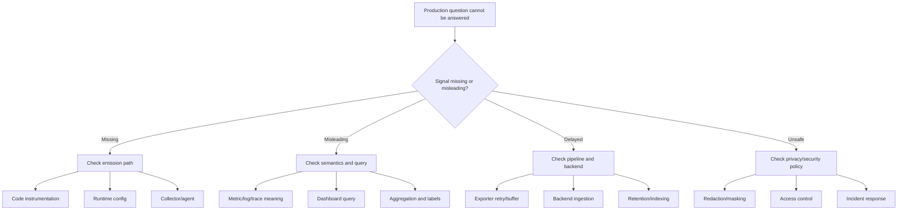

# Cheatsheet Observability Part 061 — Troubleshooting Playbook

> Fokus part ini: memberi playbook praktis untuk men-debug masalah observability itu sendiri. Saat incident, sering kali masalah utama bukan hanya service rusak, tetapi evidence rusak: log tidak muncul, trace putus, metric misleading, dashboard stale, alert noisy, SLO burn tidak bisa dijelaskan, atau sampling menyembunyikan request penting.

---

## 1. Core Mental Model

Observability juga bisa gagal.

Masalah production biasanya muncul dalam dua lapisan:

```text
Layer 1: the system is failing.
Layer 2: the evidence about the failure is incomplete, misleading, delayed, or unsafe.
```

Troubleshooting observability berarti menjawab pertanyaan ini:

```text
Apakah signal yang kita pakai benar-benar merepresentasikan realitas production?
```

Dalam Java/JAX-RS enterprise backend, observability failure bisa terjadi di banyak titik:

- JAX-RS filter tidak menulis request log;
- MDC tidak dibersihkan;
- correlation ID hilang saat masuk executor;
- trace context tidak diteruskan ke Kafka/RabbitMQ;
- metric label memakai raw path dan meledakkan cardinality;
- dashboard memakai query yang salah;
- alert threshold terlalu sensitif;
- log retention terlalu pendek;
- trace sampling membuang request error;
- audit log tidak mencatat before/after;
- body logging membocorkan data sensitif;
- timezone berbeda antar log source;
- deployment metadata tidak ikut masuk telemetry.

Tujuan playbook ini:

```text
Find evidence gaps before they become incident blockers.
```

---

## 2. Troubleshooting Flow

Gunakan alur ini saat observability terlihat salah.



Rule utama:

```text
Do not immediately add more telemetry.
First determine whether existing telemetry is absent, delayed, wrong, too noisy, too expensive, or unsafe.
```

---

## 3. Missing Logs

### Symptom

- Request terjadi, tetapi tidak ada application log.
- Error muncul di client, tetapi tidak ada exception log.
- Access log ada, tetapi service log tidak ada.
- Log hanya muncul di local, tidak di Kubernetes/cloud/on-prem production.
- Log hilang setelah deployment tertentu.

### Common root causes

- Logger level terlalu tinggi.
- Logger category/name salah.
- Appender/handler tidak aktif.
- JSON encoder gagal serialisasi.
- Async appender drop event saat buffer penuh.
- Container stdout/stderr tidak dikoleksi.
- Log collector/agent error.
- Kubernetes sidecar/daemonset tidak berjalan.
- Namespace/service label tidak cocok dengan collector filter.
- Log backend ingestion delay.
- Retention terlalu pendek.
- Query log salah environment/service/version.
- Request tidak mencapai aplikasi karena gagal di ingress/gateway.

### Java/JAX-RS checks

Periksa titik berikut:

- apakah `ContainerRequestFilter` menulis request start log;
- apakah `ContainerResponseFilter` menulis request end log;
- apakah `ExceptionMapper` menulis error log;
- apakah exception tertangkap dan dimakan tanpa log;
- apakah logger name sesuai package;
- apakah log level package di production berbeda dari local;
- apakah async appender configured dengan drop policy;
- apakah MDC field menyebabkan serialization error;
- apakah body/exception field terlalu besar dan dibuang oleh backend.

### Kubernetes/platform checks

```text
kubectl logs <pod>
```

Jika log muncul di `kubectl logs` tetapi tidak muncul di backend:

- masalah ada pada collector/agent/backend ingestion.

Jika log tidak muncul di `kubectl logs`:

- masalah ada pada application logging/runtime stdout-stderr.

Periksa:

- pod restart;
- container name;
- log collector daemonset;
- namespace selector;
- service labels;
- stdout/stderr configuration;
- log backend ingestion errors;
- dropped log counters if available.

### Production-safe debugging steps

1. Cari access/ingress log terlebih dahulu.
2. Ambil request ID/correlation ID/trace ID jika ada.
3. Cari application log berdasarkan service, environment, version, dan time window.
4. Perluas time window karena clock/ingestion delay.
5. Cek `kubectl logs` untuk pod/version yang menerima request.
6. Cek log collector health.
7. Cek perubahan deployment/config logging terakhir.
8. Jangan menaikkan log level global tanpa batas waktu dan approval internal.

### Anti-pattern

```text
"Tidak ada log, jadi tidak ada error."
```

Absence of evidence is not evidence of absence.

### Internal verification checklist

- Di mana log production dikumpulkan?
- Apakah semua service menulis ke stdout/stderr?
- Apakah ada async appender drop metric?
- Apakah request start/end log wajib?
- Apakah exception mapper selalu log unexpected error?
- Apakah log backend punya ingestion delay?
- Apakah retention cukup untuk incident/RCA?
- Apakah service labels konsisten dengan query dashboard?

---

## 4. Wrong Log Level

### Symptom

- INFO terlalu ramai.
- WARN dipakai untuk expected business validation.
- ERROR dipakai untuk retryable transient dependency failure yang sudah recovered.
- DEBUG aktif terus di production.
- Real outage hanya muncul sebagai INFO.
- Alert berbasis log terlalu noisy.

### Root cause pattern

Wrong log level biasanya berasal dari kebingungan antara:

```text
Developer interest vs operational significance.
```

Contoh:

```text
Business validation failed -> biasanya INFO atau audit/business event, bukan ERROR.
Dependency timeout causing user failure -> WARN/ERROR tergantung impact.
Retry attempt succeeded -> DEBUG/INFO depending policy, not always WARN.
Retry exhausted -> ERROR.
Security violation -> security event, may be WARN/ERROR depending policy.
```

### Decision rule

Gunakan pertanyaan berikut:

```text
Apakah manusia harus bertindak karena log ini?
Apakah log ini menunjukkan user impact?
Apakah ini expected domain outcome?
Apakah ini transient dan recovered?
Apakah ini security/compliance relevant?
Apakah volume log ini akan tinggi saat traffic normal?
```

### Review matrix

| Situation | Usually appropriate level | Notes |
|---|---:|---|
| Request completed successfully | INFO or no per-request app log if access log exists | Avoid duplicate noisy logs |
| Business validation failure | INFO/WARN depending impact | Do not treat normal rejection as system error |
| Authentication failure | INFO/WARN/security event | Watch brute-force volume |
| Authorization denied | WARN/security event | Include actor/target safely |
| Dependency timeout affecting user | WARN/ERROR | Include dependency, timeout, status, correlation |
| Retry attempt | DEBUG/INFO | Avoid retry spam |
| Retry exhausted | ERROR | Include final outcome and impact |
| Unexpected exception | ERROR | One canonical stack trace |
| Known not-found lookup | DEBUG/INFO | Avoid noisy WARN |
| PII redaction failure | ERROR/security | Treat as serious |

### Internal verification checklist

- Apakah ada log-level guideline internal?
- Apakah alert memakai ERROR count?
- Apakah ERROR rate mencerminkan user-impacting failure?
- Apakah expected business failures mencemari ERROR?
- Apakah DEBUG dapat dinaikkan sementara dengan TTL?
- Apakah runtime log-level change diaudit?
- Apakah logger package terlalu broad?

---

## 5. Missing Correlation ID

### Symptom

- Log request tidak bisa diikuti antar service.
- Request ID ada di ingress tetapi hilang di application log.
- Correlation ID ada di HTTP flow tetapi hilang di Kafka/RabbitMQ consumer.
- Async job log tidak punya business key.
- Trace ID tidak muncul di log.

### Common root causes

- Ingress/gateway tidak membuat atau meneruskan request ID.
- JAX-RS filter tidak membaca header correlation.
- Application membuat ID baru di setiap service tanpa mempertahankan inbound correlation.
- MDC tidak di-set sebelum log pertama.
- MDC tidak diteruskan ke executor/thread pool.
- Consumer tidak mengambil header event.
- Scheduler/job tidak membuat root correlation ID.
- Trace ID dan correlation ID dianggap hal yang sama tanpa standard jelas.

### Correlation identity model

Gunakan pemisahan ini:

```text
request_id       = identity untuk satu inbound request hop
correlation_id   = identity untuk end-to-end business/technical flow
causation_id     = identity untuk event/action yang menyebabkan action berikutnya
trace_id         = tracing identity from telemetry system
span_id          = operation unit within trace
business_key     = quote/order/process/customer-safe identifier
idempotency_key  = duplicate prevention identity
```

### Debugging steps

1. Ambil request dari ingress/access log.
2. Cek header inbound: `X-Request-ID`, `X-Correlation-ID`, `traceparent`, atau standard internal.
3. Cek JAX-RS filter apakah membaca dan menulis MDC.
4. Cek log pertama dalam request lifecycle.
5. Cek outbound HTTP client apakah meneruskan header.
6. Cek producer Kafka/RabbitMQ apakah menulis header correlation.
7. Cek consumer apakah membaca header dan memasukkan ke MDC/context.
8. Cek executor/job boundary.
9. Cek cleanup agar ID tidak bocor ke request lain.

### Failure mode: MDC leakage

Missing correlation ID bukan satu-satunya masalah.

Yang lebih berbahaya:

```text
Wrong correlation ID.
```

Ini bisa terjadi jika MDC tidak dibersihkan di thread pool.

Akibatnya:

- log request A terlihat sebagai request B;
- audit investigation misleading;
- incident timeline salah;
- privacy boundary bisa kacau.

### Internal verification checklist

- Apa header correlation standard internal?
- Siapa yang membuat request ID pertama kali?
- Apakah inbound external correlation dipercaya atau diganti?
- Apakah trace ID wajib masuk log?
- Apakah Kafka/RabbitMQ event header punya correlation/causation ID?
- Apakah executor propagation tersedia?
- Apakah MDC cleanup diuji?
- Apakah business key aman digunakan di log?

---

## 6. Broken Trace

### Symptom

- Trace hanya berisi satu service.
- Downstream HTTP call tidak muncul.
- Kafka/RabbitMQ consumer membuat trace baru, bukan child/linked trace.
- Database span hilang.
- Redis span terlalu banyak atau tidak ada sama sekali.
- Trace ID di log berbeda dari trace UI.

### Common root causes

- OpenTelemetry agent tidak terpasang pada service tertentu.
- Propagator tidak sama antar service.
- `traceparent` tidak diteruskan.
- Header dihapus oleh gateway/security middleware.
- Messaging instrumentation tidak membaca/menulis header.
- Manual instrumentation membuat root span baru secara salah.
- Async executor kehilangan context.
- Sampling membuang parent/child span.
- Collector pipeline drop spans.
- Backend query filter salah service/environment.

### Trace continuity checks

```text
Inbound HTTP root span exists?
JAX-RS route template captured?
Downstream HTTP child span exists?
JDBC/Redis spans attached to request span?
Kafka/RabbitMQ publish span exists?
Consumer processing span linked or child according to standard?
Errors mark span status correctly?
Trace ID appears in logs?
```

### OTel checks

- resource attributes: `service.name`, `service.version`, `deployment.environment`;
- propagator config: W3C trace context/baggage or internal standard;
- exporter endpoint;
- collector receiver;
- collector processor drop/filter rules;
- sampling policy;
- instrumentation agent version;
- manual span lifecycle;
- exception recording and span status.

### Async boundary caveat

Messaging trace relationship can be modeled differently:

```text
HTTP request -> producer span -> message -> consumer span
```

Depending standard, consumer may be:

- child of producer context;
- linked span;
- new root span with correlation ID.

Do not assume. Verify internal convention.

### Internal verification checklist

- Apakah semua service memakai propagator yang sama?
- Apakah gateway meneruskan `traceparent`?
- Apakah service mesh/ingress memodifikasi trace header?
- Apakah Kafka/RabbitMQ header propagation distandardkan?
- Apakah collector drop span karena sampling/filter?
- Apakah logs memiliki trace ID dan span ID?
- Apakah trace broken pada executor/background jobs?

---

## 7. Missing Metrics

### Symptom

- Dashboard panel kosong.
- Alert tidak pernah fire.
- Metric ada di local tetapi tidak di production.
- Service baru tidak muncul di monitoring.
- Endpoint tertentu tidak punya latency metric.
- Dependency call tidak punya error/timeout metric.

### Common root causes

- Metric tidak pernah diemit.
- Metric name berbeda dari dashboard query.
- Label service/environment tidak sesuai.
- Scrape annotation hilang.
- Port/path metrics endpoint salah.
- Prometheus/service monitor selector tidak match.
- Push/exporter config salah.
- Meter registry tidak initialized.
- Metric disabled oleh config.
- Backend retention expired.
- Dashboard query terlalu spesifik.

### Debug path

```text
Code emits metric? -> Runtime exposes metric? -> Collector/scraper reads metric? -> Backend stores metric? -> Query selects metric? -> Dashboard renders metric?
```

### Java/JAX-RS checks

- request metric generated by framework/middleware;
- endpoint template label is present;
- status code label is present;
- exception/error counter exists;
- histogram buckets configured;
- registry/exporter initialized;
- metric endpoint exposed;
- actuator/vendor endpoint protected but scrapeable internally;
- service labels consistent.

### Kubernetes checks

- pod labels;
- service labels;
- scrape annotation;
- ServiceMonitor/PodMonitor selector;
- network policy;
- metrics port;
- container port name;
- TLS/auth config;
- scrape errors.

### Internal verification checklist

- Apa backend metric internal?
- Apakah scrape atau push?
- Apakah service baru otomatis masuk monitoring?
- Apakah metric endpoint butuh auth?
- Apakah dashboard query memakai label standard?
- Apakah metric naming convention terdokumentasi?
- Apakah histogram bucket standard tersedia?

---

## 8. Metric Cardinality Explosion

### Symptom

- Metric backend lambat atau mahal.
- Query dashboard timeout.
- Ingestion cost naik drastis.
- Alert evaluation lambat.
- Metric series count naik setelah deployment.
- Label baru menyebabkan memory pressure di monitoring stack.

### Common root causes

Label berisi nilai yang hampir unik:

- request ID;
- trace ID;
- user ID;
- session ID;
- order ID;
- quote ID;
- raw URL path;
- full error message;
- SQL statement raw;
- message key;
- stack trace;
- tenant ID tanpa governance.

### Rule

```text
Metrics are for aggregation.
Logs/traces are for high-cardinality lookup.
```

Jika Anda ingin mencari satu request/order tertentu, gunakan log/trace, bukan metric label.

### Safe labels

Biasanya aman:

- service;
- environment;
- region;
- method;
- route template;
- status code class;
- dependency name;
- operation name;
- topic/queue name with governance;
- error code with bounded enum.

Berisiko:

- tenant/customer;
- quote/order/process instance;
- raw path;
- exception message;
- SQL text;
- message key.

### Emergency response

1. Identifikasi metric dan label yang meledak.
2. Stop emission via config/feature flag jika tersedia.
3. Rollback deployment jika explosion parah.
4. Drop/relabel di collector/backend jika memungkinkan.
5. Perbaiki label menjadi bounded/template.
6. Tambahkan cardinality test/review rule.

### Internal verification checklist

- Apakah ada cardinality dashboard?
- Apakah top expensive metrics terlihat?
- Apakah metric label policy melarang request ID/order ID/user ID?
- Apakah route memakai template, bukan raw path?
- Apakah tenant label diizinkan?
- Apakah collector punya drop/relabel guardrail?
- Apakah PR review mengecek cardinality?

---

## 9. Dashboard Misleading

### Symptom

- Dashboard menunjukkan service sehat, tetapi user impact terjadi.
- Dashboard menunjukkan error tinggi, tetapi tidak ada customer impact.
- Panel kosong dianggap zero.
- Average latency terlihat bagus, tetapi p95/p99 buruk.
- Dashboard tidak membedakan status code class.
- Deployment marker tidak ada.
- Dashboard memakai raw metric tanpa rate/aggregation yang benar.

### Common root causes

- Query salah aggregation.
- Counter tidak dikonversi menjadi rate.
- Average dipakai untuk latency tail.
- Error rate denominator salah.
- Panel filter salah environment/service/version.
- Missing data dirender sebagai zero.
- Endpoint label terlalu granular atau tidak ada.
- Dashboard stale tidak pernah direview.
- Dashboard dibuat untuk curiosity, bukan incident question.

### Dashboard correctness questions

```text
Apa pertanyaan yang dijawab panel ini?
Apa definisi numerator dan denominator?
Apakah panel menunjukkan rate atau raw count?
Apakah latency memakai p95/p99/histogram dengan benar?
Apakah missing data jelas terlihat?
Apakah query scoped ke environment yang benar?
Apakah ada deployment marker?
Apakah panel punya drilldown ke logs/traces?
```

### Incident dashboard minimum

- request rate;
- error rate;
- latency p50/p95/p99;
- saturation;
- dependency latency/error;
- JVM memory/GC;
- pod restarts;
- deployment version;
- recent deployment marker;
- top endpoints;
- logs/traces drilldown.

### Internal verification checklist

- Siapa owner dashboard?
- Kapan terakhir dashboard direview?
- Apakah dashboard dipakai saat incident nyata?
- Apakah panels punya description?
- Apakah missing data terlihat?
- Apakah dashboard link ada di alert?
- Apakah service/dependency/business dashboard dipisahkan?

---

## 10. Alert Noisy

### Symptom

- Alert sering fire tanpa action.
- On-call mengabaikan alert.
- Alert fire saat deployment normal.
- Alert duplicate dari banyak service/dependency.
- Alert berbasis cause terlalu banyak.
- Alert tidak punya runbook.
- Alert severity terlalu tinggi.

### Common root causes

- Threshold terlalu sensitif.
- Window terlalu pendek.
- Tidak ada burn-rate logic.
- Alert cause-based, bukan symptom/customer-impact based.
- Tidak ada suppression/deduplication.
- Tidak ada maintenance/deployment silence.
- Metric noisy atau low traffic tidak ditangani.
- Alert tidak punya owner.
- Alert tidak punya triage action.

### Alert triage rule

```text
A paging alert must imply urgent human action.
```

Jika tidak butuh urgent action:

- jadikan ticket;
- jadikan dashboard annotation;
- jadikan report;
- turunkan severity;
- gabungkan dengan alert lain;
- hapus.

### Noisy alert debugging steps

1. Hitung fire count 7/30 hari terakhir.
2. Tandai berapa yang actionable.
3. Cari false positive reason.
4. Periksa threshold/window.
5. Periksa low-traffic behavior.
6. Periksa duplicate alert chain.
7. Tambahkan runbook/action.
8. Ubah severity atau routing.
9. Review setelah perubahan.

### Internal verification checklist

- Apakah ada alert inventory?
- Apakah setiap paging alert punya owner?
- Apakah setiap alert punya runbook?
- Apakah false positive rate diketahui?
- Apakah alert suppression/dedup tersedia?
- Apakah deployment silence policy ada?
- Apakah severity mapping jelas?

---

## 11. Missing Alert

### Symptom

- User impact terjadi sebelum alert fire.
- Incident ditemukan oleh customer/support, bukan monitoring.
- Dashboard jelas menunjukkan error spike, tetapi tidak ada alert.
- SLO burn terjadi tanpa notification.
- Dependency outage tidak terdeteksi.

### Common root causes

- Tidak ada SLO/burn-rate alert.
- Alert berbasis infrastructure saja, bukan user symptom.
- Metric missing atau query salah.
- Threshold terlalu longgar.
- Window terlalu panjang.
- Service baru belum masuk alert rule.
- Alert disabled/silenced.
- Alert route salah team.
- Low-traffic edge case tidak ditangani.

### Missing alert analysis

Untuk setiap incident tanpa alert, jawab:

```text
Apa symptom pertama yang user rasakan?
Metric apa yang merepresentasikan symptom itu?
Apakah metric tersedia saat itu?
Apakah alert rule ada?
Apakah rule mengevaluasi dengan benar?
Apakah notification terkirim?
Apakah owner menerima alert?
Apakah runbook tersedia?
```

### Recommended alert classes

- availability/error-rate SLO burn;
- latency SLO burn;
- saturation causing user impact;
- dependency failure impacting service;
- queue lag/workflow aging breach;
- data correctness/reconciliation failure;
- security/privacy critical event;
- telemetry pipeline failure for critical services.

### Internal verification checklist

- Apakah post-incident review mencatat missing alert?
- Apakah service punya SLO alerts?
- Apakah queue/workflow lag punya alert?
- Apakah deployment regression punya canary alert?
- Apakah telemetry pipeline health di-alert?
- Apakah alert route ke team yang benar?

---

## 12. SLO Burn Unexplained

### Symptom

- Error budget burn tetapi dashboard tidak jelas penyebabnya.
- SLO alert fire tetapi logs/traces tidak menunjukkan issue jelas.
- Latency SLO burn hanya terjadi pada subset endpoint/tenant/region.
- Availability SLO burn dipengaruhi synthetic or health checks.

### Common root causes

- SLI definition terlalu broad.
- Numerator/denominator salah.
- Endpoint non-critical masuk SLO critical.
- Synthetic traffic dicampur dengan real traffic.
- Client errors dihitung sebagai server unavailability.
- Latency bucket kurang granular.
- Missing dimensions untuk breakdown.
- Sampling membuang traces relevant.
- Dashboard tidak punya SLO drilldown.

### Investigation flow

```text
SLO burn detected
  -> identify SLI query
  -> validate numerator/denominator
  -> segment by endpoint/status/region/version/dependency
  -> correlate with deployment/config/traffic
  -> inspect traces for slow/error samples
  -> inspect logs for canonical errors
  -> estimate customer/business impact
```

### SLO debugging questions

- Apakah SLI mengukur user-visible behavior?
- Apakah traffic internal masuk denominator?
- Apakah 4xx dihitung sebagai failure?
- Apakah timeout client/proxy dihitung?
- Apakah partial failure terlihat?
- Apakah queue/workflow delay masuk SLO yang tepat?
- Apakah burn berasal dari one endpoint or all endpoints?

### Internal verification checklist

- Apakah SLI query terdokumentasi?
- Apakah SLO dashboard punya drilldown?
- Apakah alert memakai burn-rate window?
- Apakah service version/deployment marker tersedia?
- Apakah synthetic dan real traffic dipisahkan?
- Apakah customer/business impact mapping tersedia?

---

## 13. Logs Too Expensive

### Symptom

- Ingestion cost naik.
- Storage cost naik.
- Log query lambat.
- Backend quota habis.
- Debug logs mendominasi volume.
- High-volume endpoint menghasilkan terlalu banyak per-request app logs.

### Common root causes

- Per-request INFO log terlalu detail.
- Body/payload logged.
- Retry loops menulis log per attempt.
- Stack trace duplicate di banyak layer.
- DEBUG aktif lama.
- High-cardinality fields indexed.
- Noisy health checks logged.
- Log sampling tidak ada.
- Retention terlalu panjang untuk operational logs.

### Cost reduction without losing evidence

Prioritas aman:

1. hapus duplicate logs;
2. turunkan log noisy expected path;
3. jangan log health check sukses;
4. gunakan structured field yang bounded;
5. sample high-volume success logs;
6. pertahankan error/audit/business-critical logs;
7. batasi stack trace ke canonical boundary;
8. pindahkan detail high-cardinality ke traces jika sesuai;
9. sesuaikan retention by log class.

### Do not reduce blindly

Jangan menghapus:

- audit log wajib;
- security relevant event;
- error boundary log;
- correlation IDs;
- business state transition evidence;
- incident-critical dependency failure logs.

### Internal verification checklist

- Apa top noisy logger?
- Berapa log volume per service/version?
- Apakah debug log aktif di production?
- Apakah health check success dilog?
- Apakah stack trace duplicate?
- Apakah log retention berbeda untuk audit/security/operational?
- Apakah cost dashboard tersedia?

---

## 14. PII or Secret Leaked into Logs

### Symptom

- Authorization header muncul di log.
- Cookie/session/token tercatat.
- Password/API key/secret muncul di exception or request body log.
- Customer personal/commercial data muncul di structured field.
- SQL parameter log berisi sensitive value.

### Immediate response

Treat as security/privacy incident according to internal process.

Minimum safe flow:

```text
Stop further leakage.
Preserve evidence securely.
Escalate to security/privacy owner.
Identify affected log stores and retention.
Restrict access if needed.
Purge or redact according to approved policy.
Patch source and add regression test.
Document root cause and prevention.
```

Do not casually paste leaked value into tickets/chats.

### Common root causes

- Body logging enabled.
- Header allowlist/denylist wrong.
- Exception includes raw request.
- SQL parameter logging enabled.
- Object `toString()` includes sensitive fields.
- Debug logs left active.
- Audit/business event captures too much payload.
- Redaction utility not applied consistently.

### Secure logging principles

- Prefer allowlist over denylist.
- Never log credentials, tokens, cookies, secrets.
- Mask personal/commercial sensitive values.
- Avoid raw payload logging.
- Avoid raw SQL parameter logging.
- Treat logs as broadly queryable production data.
- Apply access control and retention discipline.

### Internal verification checklist

- Apa sensitive data classification internal?
- Apakah log redaction library tersedia?
- Apakah headers/body/query params punya policy?
- Apakah SQL logging policy jelas?
- Apakah log access audited?
- Apakah purge/redaction process tersedia?
- Apakah secure logging tests ada?

---

## 15. Timezone Mismatch

### Symptom

- Incident timeline tidak konsisten.
- Access log timestamp berbeda dari application log.
- DB event terlihat terjadi sebelum request.
- Dashboard window tidak match log query.
- Audit investigation sulit karena timezone berbeda.

### Common root causes

- Local timezone dipakai di app log.
- DB timestamp menggunakan timezone berbeda.
- Cloud log backend menampilkan timezone UI user.
- Log field tanpa offset.
- Ingestion timestamp dipakai sebagai event timestamp.
- Container timezone berbeda dari host.
- Clock skew antar node.

### Rule

```text
Use UTC for machine telemetry.
Show local time only as presentation layer.
Always include timezone/offset in timestamp.
Distinguish event time from ingestion time.
```

### Debugging steps

1. Ambil satu request dengan known timestamp dari client/support.
2. Cari access log by broad time window.
3. Bandingkan event timestamp vs ingestion timestamp.
4. Cek app log timestamp format.
5. Cek DB timestamp semantics.
6. Cek dashboard timezone setting.
7. Cek node/pod clock sync if suspicious.

### Internal verification checklist

- Apakah log timestamp UTC?
- Apakah timestamp punya timezone offset?
- Apakah dashboard default timezone distandardkan?
- Apakah DB audit timestamp UTC?
- Apakah incident template mencatat timezone?
- Apakah NTP/clock sync dimonitor?

---

## 16. Sampling Hides the Issue

### Symptom

- Error terjadi tetapi trace tidak ditemukan.
- Slow request tidak punya trace sample.
- Business-critical transaction tidak terekam.
- Logs sampled sehingga rare failure hilang.
- RCA tidak punya representative trace.

### Common root causes

- Head sampling terlalu agresif.
- Sampling tidak error-biased.
- Tail sampling tidak dikonfigurasi.
- Per-endpoint sampling tidak mempertimbangkan criticality.
- Debug sampling tidak bisa diaktifkan sementara.
- Log sampling diterapkan ke error logs.
- Collector drop traces saat overload.

### Sampling safety rules

- Jangan sample audit logs.
- Jangan sample security-critical events tanpa policy.
- Jangan sample all error logs blindly.
- Prioritaskan traces untuk error, high latency, and business-critical flows.
- Gunakan tail sampling jika perlu keputusan berdasarkan outcome.
- Dokumentasikan risiko sampling.

### Debugging steps

1. Cek sampling rate service.
2. Cek head vs tail sampling.
3. Cek collector drop metrics.
4. Cek apakah error spans always sampled.
5. Cek latency-biased sampling.
6. Cek business-critical sampling rules.
7. Aktifkan temporary debug sampling jika internal process mengizinkan.

### Internal verification checklist

- Apakah sampling policy terdokumentasi?
- Apakah error traces retained?
- Apakah high-latency traces retained?
- Apakah business-critical quote/order flows punya sampling override?
- Apakah collector overload drop terlihat?
- Apakah debug sampling punya approval/TTL?

---

## 17. Broken Audit Evidence

### Symptom

- Tidak jelas siapa melakukan action.
- Audit log ada tetapi tidak menunjukkan before/after.
- Actor berbeda dari authenticated user karena delegation/impersonation tidak dicatat.
- Business transition terjadi tanpa audit event.
- Audit event tidak bisa dikorelasikan dengan request/trace.

### Common root causes

- Audit dianggap sama dengan application log.
- Audit event ditulis best-effort tanpa transaction semantics.
- Actor/target/action schema tidak standard.
- Before/after tidak dicatat.
- Delegation tidak dimodelkan.
- Audit storage mutable tanpa integrity control.
- Audit log tidak punya correlation ID/business key.

### Debugging questions

```text
Who performed the action?
On behalf of whom?
What entity changed?
What action occurred?
What was the previous value?
What is the new value?
Why was it allowed?
Which request/process caused it?
Can the evidence be modified?
Who can access the evidence?
```

### Internal verification checklist

- Apakah audit log schema distandardkan?
- Apakah audit storage immutable/append-only?
- Apakah before/after wajib untuk state change?
- Apakah delegation/impersonation dicatat?
- Apakah audit log punya correlation ID dan business key?
- Apakah audit retention sesuai compliance?
- Apakah audit access dikontrol dan diaudit?

---

## 18. Telemetry Pipeline Failure

### Symptom

- Semua service tiba-tiba kehilangan logs/metrics/traces.
- Collector CPU/memory tinggi.
- Exporter retry meningkat.
- Backend ingestion throttled.
- Traces delayed.
- Metrics gaps muncul di banyak dashboard.

### Common root causes

- Collector overload.
- Memory limiter dropping data.
- Exporter endpoint unavailable.
- Backend rate limit/quota.
- Network policy/DNS/TLS issue.
- Bad collector config deployment.
- High-cardinality explosion overwhelming backend.
- Log storm during incident.

### Pipeline health signals

- collector process health;
- receiver accepted/refused telemetry;
- processor dropped telemetry;
- exporter queue size;
- exporter retry count;
- exporter failed send;
- backend ingestion errors;
- scrape failures;
- log collector lag;
- memory limiter events.

### Internal verification checklist

- Apakah telemetry pipeline punya dashboard?
- Apakah collector punya alert?
- Apakah exporter failures terlihat?
- Apakah backend quota dimonitor?
- Apakah config change collector lewat GitOps review?
- Apakah ada rollback plan collector config?
- Apakah pipeline failure masuk incident process?

---

## 19. Production-Safe Observability Debugging Steps

Saat observability problem terjadi di production:

```text
1. Jangan langsung menaikkan verbosity global.
2. Jangan log payload sensitif untuk membuktikan hipotesis.
3. Jangan menambah high-cardinality metric saat incident.
4. Jangan mengubah alert routing tanpa owner.
5. Jangan purge evidence tanpa security/compliance approval.
6. Jangan percaya satu signal saja.
```

Safe sequence:

1. Rumuskan pertanyaan production.
2. Identifikasi signal yang seharusnya menjawab.
3. Tentukan apakah signal missing, delayed, wrong, noisy, expensive, atau unsafe.
4. Cek emission path dari code sampai backend.
5. Cek semantic correctness.
6. Cek pipeline health.
7. Cek query/dashboard/alert rule.
8. Cek privacy/security constraints.
9. Dokumentasikan gap.
10. Buat fix kecil yang terverifikasi.

---

## 20. Troubleshooting Decision Table

| Problem | First place to check | Likely fix |
|---|---|---|
| Missing app logs | `kubectl logs`, logger config, collector | Fix logging config or pipeline selector |
| Wrong log level | logger usage and alert mapping | Reclassify severity and update guideline |
| Missing correlation ID | JAX-RS filter, MDC, headers | Standardize propagation and cleanup |
| Broken trace | propagator, agent, collector, sampling | Align OTel config and propagation |
| Missing metric | registry/exporter/scrape/query | Fix metric emission or scrape config |
| Cardinality explosion | labels/dimensions | Remove unbounded labels |
| Misleading dashboard | query semantics | Fix aggregation, denominator, template labels |
| Noisy alert | threshold/window/actionability | Tune, suppress, dedup, or downgrade |
| Missing alert | SLI/SLO coverage | Add symptom-based alert |
| SLO burn unclear | SLI query and drilldown | Segment by endpoint/version/dependency |
| Log cost high | noisy logger and retention | Reduce duplicate/success/debug logs |
| PII leak | source log + access control | Stop leak, escalate, redact/purge by policy |
| Time mismatch | timestamp format/UI timezone | Standardize UTC and event time |
| Sampling blind spot | sampler config | Error/latency/business-biased sampling |
| Telemetry pipeline down | collector/exporter/backend | Fix pipeline capacity/config/connectivity |

---

## 21. PR Review Checklist for Troubleshooting Resilience

Saat mereview PR yang menyentuh observability, tanyakan:

### Logging

- Apakah log baru punya purpose jelas?
- Apakah level benar?
- Apakah structured fields konsisten?
- Apakah correlation ID ikut?
- Apakah business key aman?
- Apakah sensitive fields dihindari/masked?
- Apakah volume log wajar?

### Metrics

- Apakah metric type benar?
- Apakah unit jelas?
- Apakah labels bounded?
- Apakah raw path/request ID/order ID/user ID tidak jadi label?
- Apakah histogram bucket sesuai latency target?
- Apakah metric bisa dipakai dashboard/alert?

### Tracing

- Apakah span lifecycle benar?
- Apakah span status error benar?
- Apakah attributes sesuai semantic convention/internal standard?
- Apakah propagation across HTTP/messaging/executor aman?
- Apakah sampling tidak menyembunyikan critical flow?

### Dashboards/alerts

- Apakah signal baru masuk dashboard yang tepat?
- Apakah alert actionable?
- Apakah runbook tersedia?
- Apakah alert punya owner?
- Apakah false positive risk dipikirkan?

### Security/cost

- Apakah data sensitif aman?
- Apakah retention sesuai?
- Apakah telemetry volume diperkirakan?
- Apakah high-cardinality risk dicek?

---

## 22. Internal Verification Checklist

Gunakan checklist ini untuk menutup part troubleshooting:

- Cari 3 incident terakhir dan catat observability gap apa yang menghambat debugging.
- Cari 5 noisy alerts tertinggi dan evaluasi actionability.
- Cari 5 metric dengan cardinality tertinggi.
- Cari 5 logger dengan volume tertinggi.
- Ambil satu request sukses dan satu request gagal; ikuti dari ingress log sampai trace dan dependency metrics.
- Ambil satu Kafka/RabbitMQ event; cek correlation dan causation chain.
- Ambil satu quote/order state transition; cek log, metric, audit, dan business dashboard.
- Cek apakah dashboard utama punya deployment marker.
- Cek apakah trace ID ada di log.
- Cek apakah service version ada di log/metric/trace.
- Cek apakah observability pipeline punya health dashboard.
- Cek apakah PII/secret logging prevention diuji.
- Cek apakah onboarding/runbook menjelaskan cara mencari evidence.

---

## 23. Final Takeaway

Troubleshooting observability bukan aktivitas sekunder.

Untuk senior backend engineer, ini bagian dari production readiness.

Signal yang buruk membuat incident lebih lama, RCA lebih lemah, alert lebih noisy, cost lebih tinggi, dan risiko compliance/security lebih besar.

Prinsip akhirnya:

```text
A production system is only as debuggable as the evidence it emits.
A telemetry system is only useful if the evidence is correct, correlated, queryable, safe, affordable, and actionable.
```
