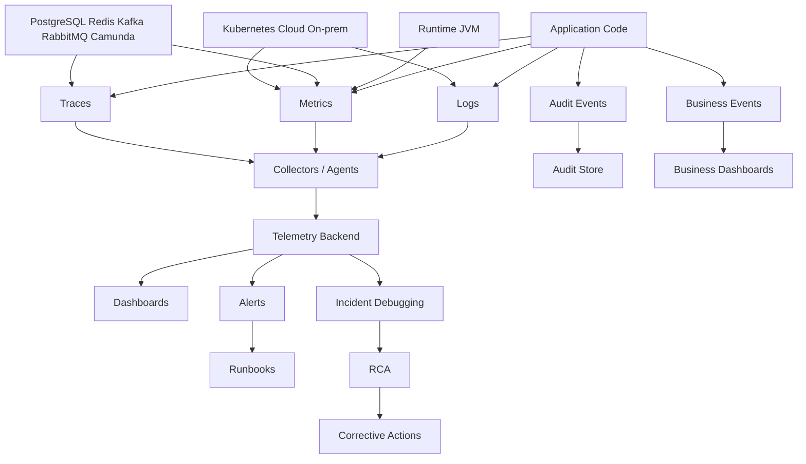

# Cheatsheet Observability Part 062 — Final Part: Observability Mastery Map for Senior Backend Engineer

> Fokus final part ini: merangkum seluruh seri menjadi mastery map. Tujuannya bukan menghafal istilah observability, tetapi mampu berpikir dan bertindak seperti senior backend engineer saat merancang, mereview, mengoperasikan, dan men-debug Java/JAX-RS enterprise production systems.

---

## 1. Final Mental Model

Observability adalah kemampuan sistem menjawab pertanyaan production tanpa deploy code baru.

Bukan sekadar:

```text
We have logs.
We have dashboards.
We have metrics.
We have tracing.
```

Tetapi:

```text
When something fails, can we reconstruct what happened, who/what was affected, why it happened, how far it spread, and what to do next?
```

Untuk Java/JAX-RS enterprise system, observability harus mengikuti flow nyata:

```text
Client / Partner / UI
  -> NGINX / Ingress / Gateway / Load Balancer
  -> JAX-RS / Servlet entry point
  -> Resource method
  -> Service layer
  -> Domain logic
  -> PostgreSQL via JDBC/MyBatis/JPA
  -> Redis
  -> Kafka / RabbitMQ
  -> Camunda / workflow
  -> Downstream service
  -> Kubernetes / Cloud / On-prem runtime
  -> Dashboard / Alert / Incident / RCA / Audit
```

Jika signal berhenti di tengah flow, debugging berhenti di tengah flow.

---

## 2. The Senior Engineer Observability Question Set

Saat melihat service, PR, dashboard, alert, or incident, senior engineer bertanya:

```text
What question does this signal answer?
Who uses it?
When is it used?
How is it correlated?
What failure mode does it reveal?
What failure mode does it hide?
What is its cost?
What is its privacy/security risk?
What action does it support?
```

Observability yang matang selalu punya hubungan jelas antara:

```text
Signal -> Question -> Decision -> Action -> Owner
```

Jika tidak ada action, kemungkinan signal itu noise.

Jika tidak ada owner, kemungkinan signal itu akan membusuk.

Jika tidak ada question, kemungkinan dashboard itu vanity.

---

## 3. Complete Observability Stack Map



Senior-level observability melihat seluruh chain, bukan hanya instrumentation di code.

Pertanyaan utamanya:

```text
Where is evidence produced?
Where is evidence transformed?
Where is evidence dropped?
Where is evidence queried?
Where is evidence trusted?
```

---

## 4. Logging Mastery Checklist

Logging yang baik bukan banyak log.

Logging yang baik adalah event evidence yang:

- structured;
- contextual;
- correlated;
- level-nya benar;
- aman dari data sensitif;
- volumenya wajar;
- mudah dicari;
- berguna saat incident.

### Must-have fields

Minimal structured log production biasanya mencakup:

```text
timestamp
level
message
logger
thread
service.name
service.version
deployment.environment
request_id
correlation_id
trace_id
span_id
tenant/customer safe identifier if allowed
actor_id if allowed
business_key if safe
operation
status
error.code
error.type
exception stack trace for canonical unexpected error
```

### Logging correctness questions

- Apakah log ini menjelaskan event, bukan sekadar string debugging?
- Apakah timestamp memakai UTC/offset jelas?
- Apakah log punya correlation ID?
- Apakah log punya trace ID jika tracing aktif?
- Apakah business key aman dan berguna?
- Apakah log level sesuai operational significance?
- Apakah exception dilog satu kali di boundary yang benar?
- Apakah sensitive data tidak bocor?
- Apakah log volume akan aman saat traffic tinggi?

### Red flags

```text
Raw request body in logs.
Authorization header in logs.
Exception swallowed without log.
Every retry attempt logged as ERROR.
Expected validation failure logged as ERROR.
Raw SQL parameters logged.
Request ID missing.
MDC not cleaned.
JSON field names inconsistent.
```

---

## 5. Structured Logging Mastery Map

Structured logging adalah kontrak antara application code dan manusia/tool yang men-debug production.

Desain field harus stabil.

Bad structured logging:

```json
{
  "msg": "something failed id=123 status bad"
}
```

Better structured logging:

```json
{
  "timestamp": "2026-07-11T12:00:00Z",
  "level": "ERROR",
  "message": "Failed to price quote",
  "service.name": "quote-service",
  "operation": "quote.pricing",
  "correlation_id": "...",
  "trace_id": "...",
  "quote_id": "safe-business-key",
  "error.code": "PRICING_TIMEOUT",
  "dependency.name": "pricing-service",
  "duration_ms": 2500
}
```

The mastery point:

```text
Structured logs should be queryable without parsing human prose.
```

### Field governance checklist

- Standard names exist.
- Required fields are enforced or tested.
- Sensitive fields are prohibited.
- Business fields are bounded and safe.
- Error fields are consistent.
- Service/version/environment fields are always present.
- Log schema changes are reviewed.

---

## 6. Correlation Mastery Checklist

Correlation is the spine of production debugging.

Without correlation, you have isolated fragments.

With correlation, you have a timeline.

### Identity taxonomy

```text
request_id       -> one request hop
correlation_id   -> end-to-end flow
causation_id     -> what caused this event/action
trace_id         -> distributed trace identity
span_id          -> operation identity inside trace
business_key     -> domain entity identity, e.g. quote/order/process
idempotency_key  -> duplicate prevention identity
message_id       -> message/event identity
process_id       -> workflow/process identity
```

### Senior review questions

- Which ID is generated at ingress?
- Which ID is trusted from external clients?
- Which ID is propagated to downstream HTTP?
- Which ID is propagated to Kafka/RabbitMQ headers?
- Which ID is used in audit logs?
- Which ID is safe for business search?
- Which ID must never become metric label?
- Is MDC cleaned on thread reuse?
- Do background jobs create or inherit correlation?

### Failure modes

- Missing correlation ID.
- Wrong correlation ID from MDC leakage.
- Trace ID not included in logs.
- New correlation ID created at every service.
- Async event loses causation chain.
- Business key exists in DB but not logs/audit.
- External spoofed correlation header trusted blindly.

---

## 7. Metrics Mastery Checklist

Metrics answer aggregate questions:

```text
How often?
How slow?
How many?
How saturated?
How much error?
How much backlog?
How fast is it burning error budget?
```

Metrics are not for per-request forensic lookup.

### Metric design checklist

For each metric:

- Purpose is clear.
- Owner is known.
- Type is correct: counter/gauge/histogram/summary/timer.
- Unit is explicit.
- Labels are bounded.
- Cardinality is controlled.
- Aggregation is meaningful.
- Retention is appropriate.
- Dashboard/alert usage is defined.
- Cost is acceptable.

### Service metric minimum

For a Java/JAX-RS service:

- request rate;
- error rate;
- latency histogram;
- status code distribution;
- endpoint template breakdown;
- active requests;
- thread pool usage;
- connection pool usage;
- JVM heap/non-heap;
- GC pause/count;
- CPU/memory/container throttling;
- dependency latency/error;
- pod restarts;
- deployment version.

### Cardinality red flags

Never casually use these as metric labels:

- request ID;
- trace ID;
- user ID;
- order ID;
- quote ID;
- session ID;
- raw path;
- full error message;
- SQL text;
- message key.

---

## 8. RED, USE, and Golden Signal Mastery

For service health:

```text
RED = Rate, Errors, Duration
```

For resource health:

```text
USE = Utilization, Saturation, Errors
```

For reliability operations:

```text
Golden signals = latency, traffic, errors, saturation
```

Senior-level usage:

- Use RED for request-serving services.
- Use USE for infrastructure/resource pools.
- Use golden signals for incident triage.
- Add business and dependency signals where technical health is insufficient.

Example:

```text
API latency looks normal,
but order completion is delayed.
```

This means service RED is insufficient. You need workflow/business lifecycle observability.

---

## 9. Tracing Mastery Checklist

Tracing answers causal path questions:

```text
Where did time go?
Which dependency failed?
Which service called which service?
Was the error local or downstream?
Did async event processing continue the flow?
Which span marks the actual failure?
```

### Trace quality checklist

- Root span exists for inbound HTTP.
- Route template captured, not raw path only.
- HTTP status captured.
- Exception marks span status correctly.
- Downstream HTTP spans exist.
- JDBC/Redis spans exist where useful.
- Kafka/RabbitMQ publish/consume spans or links exist.
- Background job spans exist.
- Resource attributes are correct.
- Trace ID is included in logs.
- Sampling preserves errors and high latency.

### Trace anti-patterns

```text
Every method becomes a span.
Span names include IDs.
SQL parameters leak into span attributes.
Consumer trace is always disconnected.
Span status remains OK after exception.
Trace exists but no logs include trace_id.
```

Tracing is not a replacement for logs or metrics.

It is the causal skeleton that connects them.

---

## 10. OpenTelemetry Mastery Map

OpenTelemetry is not just a library.

It is a model for instrumentation and telemetry movement.

### Components

```text
API                 -> code-level instrumentation contract
SDK                 -> runtime implementation and config
Auto-instrumentation -> zero/low-code instrumentation
Manual instrumentation -> business-specific spans/metrics/events
Resource            -> service/process/deployment identity
Exporter            -> sends telemetry out
Collector           -> receives, processes, samples, exports telemetry
Propagator          -> carries context across boundaries
Semantic conventions -> standard attribute names and meanings
```

### Senior review questions

- Is service identity correct?
- Is environment/version included?
- Is auto-instrumentation enough?
- Where is manual instrumentation required?
- Are semantic conventions followed?
- Is propagation consistent across HTTP and messaging?
- Does collector transform/drop sensitive attributes?
- Does sampling preserve critical flows?
- Are collector failures observable?

### Collector mastery

Collector is the control plane for telemetry movement.

Review:

- receivers;
- processors;
- exporters;
- pipelines;
- batch processor;
- memory limiter;
- attributes/resource processor;
- tail/head sampling;
- retry/backpressure;
- agent vs gateway deployment;
- telemetry pipeline dashboard.

---

## 11. Dashboard Mastery Checklist

A dashboard is not a wall of charts.

A dashboard is a decision surface.

### Dashboard question model

```text
Who is the audience?
What decision must they make?
What signal supports that decision?
What drilldown is needed?
What action follows?
```

### Dashboard types

- service health dashboard;
- dependency health dashboard;
- API dashboard;
- database dashboard;
- messaging dashboard;
- Kubernetes dashboard;
- business lifecycle dashboard;
- incident dashboard;
- release/canary dashboard;
- executive reliability dashboard.

### Correctness checklist

- Uses rate for counters.
- Uses p95/p99 for tail latency.
- Uses route template, not raw path.
- Shows missing data as missing, not zero.
- Separates environment/region/version.
- Has deployment markers.
- Has dashboard owner.
- Links to logs/traces/runbooks.
- Was validated during real incident or game day.

---

## 12. Alert Mastery Checklist

Alerts must be actionable.

A paging alert means:

```text
A human must take urgent action now.
```

### Alert design checklist

- Symptom-based when possible.
- Customer/user impact is clear.
- Severity is correct.
- Threshold/window are justified.
- Low-traffic behavior handled.
- Deduplication/suppression considered.
- Owner is known.
- Runbook link exists.
- Dashboard link exists.
- Escalation path exists.
- False positive history reviewed.

### Alert anti-patterns

```text
Alert fires but nobody knows what to do.
Alert fires for every dependency symptom and every service symptom separately.
Alert has no runbook.
Alert severity is always critical.
Alert is based on raw CPU only while users are fine.
Alert misses SLO burn.
```

Senior-level alerting is about reducing time to correct action, not increasing notification count.

---

## 13. SLO Mastery Checklist

SLO connects engineering telemetry to reliability promises.

### Key distinctions

```text
SLI = measured indicator
SLO = target for indicator
SLA = contractual/legal/business commitment
Error budget = allowed unreliability
```

### Good SLI characteristics

- user-visible;
- measurable;
- bounded;
- hard to game;
- aligned with business impact;
- supports alerting and review;
- has clear numerator and denominator.

### SLO dimensions beyond availability

- latency;
- correctness;
- freshness;
- durability;
- workflow completion;
- queue lag;
- reconciliation success;
- order/quote lifecycle completion.

### Senior SLO questions

- Does this SLO reflect what users/customers care about?
- Does it exclude irrelevant traffic?
- Are client errors handled correctly?
- Is burn-rate alerting configured?
- What happens when budget is exhausted?
- Are releases gated by reliability risk?

---

## 14. Auditability Mastery Checklist

Auditability is evidence of business/security actions.

It is not the same as debug logging.

### Audit event must answer

```text
Who did what, to what, when, where, why, and what changed?
```

### Audit fields

- actor;
- delegated actor / impersonation context;
- target entity;
- action;
- timestamp;
- source/system;
- business reason;
- before value;
- after value;
- correlation ID;
- business key;
- outcome;
- integrity/immutability metadata if applicable.

### Audit anti-patterns

```text
Audit stored only in normal app logs.
No before/after value.
No actor delegation info.
No business key.
No immutable storage.
No access control.
Audit event emitted outside transaction without consistency thinking.
```

For CPQ/order management, auditability is essential for quote approval, pricing change, order amendment, cancellation, fallout resolution, and manual intervention.

---

## 15. Security and Privacy Mastery Checklist

Observability can become a data leak.

Senior engineer must treat telemetry as production data.

### Never log casually

- password;
- token;
- cookie;
- authorization header;
- API key;
- secret;
- raw request body;
- sensitive query params;
- personal data;
- sensitive commercial data;
- raw SQL parameters;
- dump files without controls.

### Secure observability controls

- allowlist fields;
- redaction/masking library;
- sensitive header filtering;
- body logging ban or strict exception process;
- log access control;
- retention policy;
- audit access logging;
- secure dump/profiling process;
- PII leak incident response;
- tests for redaction.

### Senior question

```text
Would we be comfortable giving every log viewer access to this field?
```

If not, do not emit it or protect it explicitly.

---

## 16. Cost Mastery Checklist

Observability cost is not accidental.

It is created by design choices.

### Cost drivers

- log volume;
- metric cardinality;
- trace volume;
- sampling rate;
- retention duration;
- indexing strategy;
- dashboard query complexity;
- audit retention;
- debug log duration;
- high-cardinality labels;
- collector/backend capacity.

### Cost-quality trade-off

Bad cost cutting:

```text
Remove the only evidence needed for incident debugging.
```

Good cost control:

```text
Keep critical evidence, remove duplicate/noisy/unbounded telemetry.
```

### Senior cost review

- Are success logs sampled?
- Are error/audit/security logs retained?
- Are labels bounded?
- Are traces sampled intelligently?
- Are debug logs temporary with TTL?
- Are retention classes separated?
- Are dashboards efficient?
- Is cardinality monitored?

---

## 17. Incident Debugging Mastery Map

Incident debugging is evidence reconstruction.

### Standard flow

```text
1. Define symptom.
2. Establish time window.
3. Identify affected users/tenants/endpoints/business flows.
4. Check recent changes.
5. Inspect service health metrics.
6. Inspect dependency health.
7. Drill into traces.
8. Search correlated logs.
9. Check platform/Kubernetes/cloud signals.
10. Estimate blast radius.
11. Choose mitigation.
12. Preserve evidence for RCA.
```

### Evidence timeline

A good timeline includes:

- first known symptom;
- first alert;
- traffic change;
- deployment/config/migration change;
- first error spike;
- first latency spike;
- dependency symptom;
- mitigation action;
- recovery time;
- customer impact window;
- missing evidence.

### Senior behavior during incident

- Do not tunnel into one hypothesis too early.
- Correlate multiple signals.
- Separate symptom from cause.
- Prefer mitigation before perfect RCA.
- Preserve evidence.
- Communicate uncertainty clearly.
- Capture telemetry gaps.

---

## 18. RCA Mastery Map

RCA is not blame.

RCA is system learning.

### RCA structure

```text
Symptom
Customer/business impact
Timeline
Trigger
Proximate cause
Root cause
Contributing factors
Detection gap
Telemetry gap
Mitigation
Corrective actions
Preventive actions
Owner and due date
```

### Observability-specific RCA questions

- Which signal detected the issue?
- Which signal should have detected it but did not?
- Was alert actionable?
- Did dashboard mislead?
- Were logs correlated?
- Was trace complete?
- Did sampling hide evidence?
- Was business impact measurable?
- What telemetry needs to be added or fixed?

RCA quality depends on evidence quality.

---

## 19. Domain Observability Mastery for CPQ/Order Systems

Technical health is not enough.

In CPQ/order management, the system can be technically healthy while business flow is broken.

Examples:

```text
APIs return 200, but quotes are stuck awaiting approval.
Consumers are running, but orders are not reaching fulfillment.
Database is healthy, but reconciliation mismatches grow.
Workflow engine is available, but human tasks are aging.
```

### Domain signals to consider

- quote created;
- quote priced;
- quote approved/rejected;
- quote accepted;
- order created;
- order validated;
- order decomposed;
- fulfillment started/completed/failed;
- fallout created/resolved;
- cancellation requested/completed;
- amendment requested/completed;
- approval aging;
- order stuck;
- invalid state transition;
- reconciliation mismatch;
- manual intervention backlog.

### Senior question

```text
Can we observe business lifecycle degradation before customers escalate?
```

---

## 20. Platform Observability Mastery

Application observability must connect to platform reality.

### Kubernetes signals

- pod restart;
- OOMKilled;
- CPU throttling;
- memory pressure;
- readiness failure;
- liveness failure;
- deployment availability;
- HPA behavior;
- ingress errors;
- Kubernetes events.

### Cloud/on-prem signals

- load balancer metrics/logs;
- API gateway/APIM logs;
- WAF logs;
- managed DB/broker/cache metrics;
- object storage errors;
- secret/config service issues;
- network/private endpoint logs;
- cloud audit logs;
- service health advisories;
- on-prem node/network/storage constraints.

### Release/GitOps signals

- deployment marker;
- commit SHA;
- build ID;
- image digest;
- config version;
- migration version;
- feature flag state;
- Helm release;
- Argo CD application;
- GitOps drift.

Without platform metadata, incident debugging becomes guesswork.

---

## 21. Testing Observability Mastery

Observability should be tested.

### Testable observability behaviors

- structured log contains required fields;
- correlation ID is created and propagated;
- MDC is cleaned;
- trace context propagates through HTTP;
- message headers carry correlation/causation;
- metric emits with bounded labels;
- audit event is written for state change;
- sensitive fields are redacted;
- error span status is correct;
- local collector receives telemetry;
- alert rule evaluates expected condition.

### Senior mindset

```text
If breaking telemetry would hurt incident response, add a test or review gate.
```

---

## 22. PR Review Master Checklist

Use this for any PR that changes API, service logic, dependency call, async event, workflow, state transition, database access, or deployment config.

### Logging

- Are important state changes logged or audited?
- Are unexpected errors logged once at the correct boundary?
- Are log levels correct?
- Are fields structured?
- Is correlation included?
- Are sensitive fields excluded?

### Metrics

- Are service/dependency/business metrics updated?
- Are labels bounded?
- Is unit/type correct?
- Is cardinality safe?
- Is dashboard/alert impact understood?

### Tracing

- Is a useful span available at the operation boundary?
- Are downstream calls traced?
- Is context propagated across async boundaries?
- Are errors recorded correctly?
- Are attributes safe?

### Audit

- Does this change require audit evidence?
- Are actor/action/target/before/after captured?
- Is audit consistency considered?

### Dashboard/alert/SLO

- Does existing dashboard reflect this change?
- Is a new panel needed?
- Is alert threshold affected?
- Is SLO impacted?
- Is runbook updated?

### Platform/release

- Are service labels/annotations correct?
- Is deployment metadata present?
- Is feature flag/config/migration observable?
- Is rollback health measurable?

---

## 23. Architecture Decision Checklist

For ADRs involving observability:

```text
What production question motivates this decision?
What signal will answer it?
Where will the signal be emitted?
Where will it be stored?
Who owns it?
How will it be queried?
How will it be alerted?
What is the privacy risk?
What is the cost risk?
What is the cardinality risk?
What happens if the telemetry pipeline fails?
How will this be tested?
How will this be documented?
```

Architecture maturity is visible in how clearly these questions are answered.

---

## 24. Internal Verification Master Checklist

Because internal CSG/team details must not be invented, verify these directly.

### Stack and ownership

- Logging backend.
- Metrics backend.
- Tracing backend.
- Alerting tool.
- Dashboard tool.
- OpenTelemetry usage.
- Collector deployment mode.
- SRE/platform ownership.
- Service/team ownership.
- On-call process.

### Standards

- Logging standard.
- Metric naming standard.
- Trace propagation standard.
- Header correlation standard.
- Audit logging policy.
- Privacy/security logging policy.
- Dashboard standard.
- Alerting standard.
- SLO standard.
- Runbook template.
- Retention policy.
- Cost guardrail.

### Codebase

- JAX-RS filters.
- ExceptionMapper.
- HTTP client interceptors.
- JDBC/DataSource instrumentation.
- Kafka/RabbitMQ producer/consumer wrappers.
- Redis client instrumentation.
- Camunda/workflow hooks.
- Background job wrappers.
- MDC utilities.
- Redaction utilities.
- Metric registry setup.
- OpenTelemetry config.

### Runtime/platform

- Kubernetes labels/annotations.
- Prometheus scrape config or equivalent.
- Collector config.
- Helm/Argo CD config.
- CI/CD deployment metadata.
- Cloud monitoring config.
- Load balancer/gateway logs.
- WAF/private endpoint logs if relevant.
- Cloud audit logs.

### Operations

- Main service dashboard.
- Dependency dashboard.
- Business dashboard.
- Incident dashboard.
- Alert inventory.
- Runbook index.
- SLO document.
- Incident/RCA repository.
- Known observability gaps.
- Top noisy alerts.
- Top expensive metrics/loggers.

---

## 25. 30/60/90 Mastery Path Recap

### First 30 days

Goal:

```text
Understand production reality.
```

Focus:

- log format;
- request/correlation/trace search;
- dashboards;
- alerts;
- runbooks;
- incident history;
- service dependencies;
- internal standards.

### Days 31–60

Goal:

```text
Understand instrumentation conventions and failure modes.
```

Focus:

- JAX-RS filters;
- exception mapping;
- metrics registry;
- OpenTelemetry setup;
- propagation across HTTP/messaging;
- dependency dashboards;
- alert quality;
- SLO definitions;
- privacy/cost constraints.

### Days 61–90

Goal:

```text
Improve one real observability gap.
```

Good improvement examples:

- add missing correlation to async consumer;
- fix high-cardinality metric label;
- add runbook to noisy but important alert;
- add deployment marker to dashboard;
- add audit evidence for state transition;
- improve trace span status for exceptions;
- reduce duplicate error logs;
- add synthetic check for critical API journey.

---

## 26. Observability Maturity Levels

### Level 1 — Basic visibility

- Logs exist.
- Basic metrics exist.
- Some dashboards exist.
- Alerts exist but may be noisy.

Risk:

```text
Can see symptoms but cannot reconstruct causes reliably.
```

### Level 2 — Correlated debugging

- Logs include correlation/trace IDs.
- Metrics use bounded labels.
- Traces cross key service boundaries.
- Dashboards answer incident questions.

Risk:

```text
Business impact may still be unclear.
```

### Level 3 — Production operational readiness

- SLOs exist.
- Alerts are actionable.
- Runbooks are linked.
- Audit evidence is reliable.
- Release/deployment signals exist.
- Privacy/cost guardrails exist.

Risk:

```text
Continuous governance is required to prevent decay.
```

### Level 4 — Principal-level observability

- Observability is part of design/ADR/PR review.
- Business lifecycle observability exists.
- Incident/RCA improves telemetry.
- Cost and cardinality are actively governed.
- Teams can debug novel failure modes quickly.

Target:

```text
Production questions are answered with evidence, not guesswork.
```

---

## 27. The Final Senior Engineer Checklist

Before calling a service production-ready, ask:

### Can we observe request flow?

- Ingress/access logs exist.
- JAX-RS request logs exist.
- Trace root span exists.
- Logs include correlation and trace ID.
- Downstream calls are visible.

### Can we observe dependencies?

- PostgreSQL pool/query/lock/transaction signals exist.
- Redis cache/latency/memory/eviction signals exist.
- Kafka/RabbitMQ lag/depth/retry/DLQ signals exist.
- Camunda/workflow incident/aging signals exist.
- Downstream HTTP timeout/retry/circuit breaker signals exist.

### Can we observe business flow?

- Quote/order lifecycle events exist.
- State transitions are measurable/auditable.
- Stuck/aging states are visible.
- Fallout/reconciliation issues are visible.
- Business SLA/SLO indicators exist.

### Can we detect user impact?

- SLOs exist.
- Burn-rate alerts exist.
- Synthetic checks exist where needed.
- Customer impact can be estimated.
- Alert routing is correct.

### Can we debug incidents?

- Dashboards answer triage questions.
- Logs/traces/metrics correlate.
- Deployment markers exist.
- Config/migration/feature flag metadata exists.
- Runbooks exist.
- Incident evidence is retained.

### Can we trust telemetry?

- Timestamps are consistent.
- Labels are bounded.
- Sampling is understood.
- Missing data is visible.
- Collector/backend health is monitored.

### Can we protect data and cost?

- Sensitive data is not emitted.
- Redaction is tested.
- Log access is controlled.
- Retention is appropriate.
- Cardinality is monitored.
- Cost drivers are known.

---

## 28. Final Anti-Patterns to Avoid

```text
Adding logs instead of designing evidence.
Adding metrics without owning semantics.
Adding spans around every method.
Using request IDs as metric labels.
Treating audit logs as debug logs.
Treating dashboards as decoration.
Paging humans for non-actionable noise.
Optimizing observability cost by deleting critical evidence.
Trusting one signal during incident.
Ignoring telemetry gaps after RCA.
```

---

## 29. How to Keep Improving

Observability improves through feedback loops.

### After every incident

Ask:

- What did we detect first?
- What should we have detected first?
- Which signal was missing?
- Which signal was misleading?
- Which alert was noisy?
- Which dashboard helped?
- Which dashboard was unused?
- Which log/trace/metric would have shortened MTTR?
- Which telemetry was unsafe or too expensive?

### During every PR

Ask:

- Does this change affect production debugging?
- Does this change affect auditability?
- Does this change affect SLO/error budget?
- Does this change affect telemetry cost/cardinality?
- Does this change need dashboard/runbook update?

### During every design review

Ask:

- How will we know it works?
- How will we know it is failing?
- How will we know who is impacted?
- How will we debug partial failure?
- How will we reconstruct the timeline?
- How will we prove the business action happened?

---

## 30. Final Takeaway

Observability mastery for a senior backend engineer is not tool mastery.

It is production reasoning mastery.

The best engineers do not merely ask:

```text
Can I implement this feature?
```

They also ask:

```text
When this feature fails in production,
will we know what happened,
who was impacted,
why it happened,
how to mitigate it,
and how to prevent it next time?
```

That is the observability bar.

For enterprise Java/JAX-RS systems, especially CPQ/order management systems with PostgreSQL, Redis, Kafka, RabbitMQ, Camunda, Kubernetes, AWS/Azure, on-prem/hybrid deployment, and compliance-sensitive business workflows, this bar is not optional.

It is part of engineering correctness.

```text
Production readiness = functional correctness + operational evidence + safe observability + actionable response.
```

This is the final part of the series.
