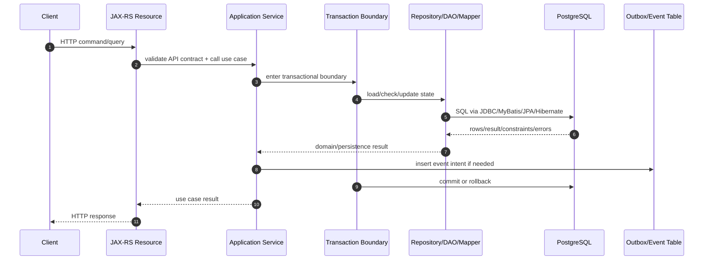

# Persistence Layer Foundation

## 1. Core Thesis

Persistence layer bukan sekadar tempat menaruh query, repository, mapper, atau entity. Persistence layer adalah **boundary yang mengubah intent aplikasi menjadi perubahan state yang durable, transactional, observable, dan bisa dipertanggungjawabkan**.

Dalam sistem enterprise Java/JAX-RS, terutama sistem CPQ, quote management, order management, quote-to-cash, catalog-driven architecture, dan telco BSS/OSS, persistence layer adalah salah satu titik paling mahal untuk salah. Bug di layer ini jarang hanya menjadi bug lokal. Ia bisa menjadi:

- data corruption,
- lost update,
- duplicate order,
- quote state tidak konsisten,
- harga historis salah,
- event Kafka/RabbitMQ tidak sesuai database,
- cache Redis stale,
- workflow Camunda bergerak berdasarkan state yang keliru,
- migration gagal saat deployment,
- endpoint lambat karena query tidak terlihat,
- incident production karena lock, pool exhaustion, atau bad query plan.

Karena itu, mindset yang benar bukan “bagaimana cara simpan object ke database”, tetapi:

> Bagaimana perubahan business state melewati boundary persistence secara eksplisit, benar secara transaksi, efisien secara query, aman secara security/privacy, dan mudah didiagnosis saat production bermasalah?

---

## 2. What Is Persistence Layer?

Persistence layer adalah lapisan yang bertanggung jawab untuk:

1. menerima intent dari application/service layer,
2. menerjemahkan intent menjadi operasi database,
3. menjaga mapping antara model aplikasi dan model database,
4. memastikan operasi terjadi di transaction boundary yang benar,
5. menangani error database/framework menjadi domain/application error,
6. menyediakan visibility untuk query, latency, lock, timeout, dan failure,
7. menjaga kontrak schema, migration, dan backward compatibility.

Persistence layer biasanya berisi beberapa bentuk komponen:

- repository,
- DAO,
- MyBatis mapper,
- JPA repository/entity manager usage,
- JDBC helper,
- transaction boundary,
- query object,
- command object,
- DTO projection,
- entity mapping,
- type converter/type handler,
- migration script,
- persistence test fixture,
- observability hook.

Yang penting: persistence layer bukan hanya code Java. Ia adalah gabungan dari:

- Java code,
- SQL,
- schema PostgreSQL,
- transaction configuration,
- connection pool,
- migration tool,
- test environment,
- production monitoring,
- operational runbook,
- team convention.

---

## 3. Why This Layer Exists

Tanpa persistence layer yang jelas, application/service layer akan langsung bergantung pada detail database. Akibatnya:

- business logic tersebar di query,
- query ownership kabur,
- transaction boundary tidak terlihat,
- domain invariant tidak jelas dijaga di mana,
- table tertentu dimutasi dari terlalu banyak tempat,
- migration sulit dilakukan tanpa breaking change,
- performance sulit didiagnosis,
- PR review menjadi debat style, bukan correctness.

Persistence layer ada untuk membuat perubahan data menjadi **terkontrol**.

Contoh sederhana:

```text
HTTP request: approve quote
Business intent: quote must move from DRAFT to APPROVED
Persistence concern:
- apakah quote masih DRAFT saat update?
- apakah user punya permission?
- apakah version cocok?
- apakah approval audit ditulis?
- apakah event outbox ditulis dalam transaksi yang sama?
- apakah optimistic lock dipakai?
- apakah query menyentuh tenant yang benar?
- apakah transaction commit sebelum event dipublish?
```

Kalau persistence layer hanya dianggap “save quote”, detail correctness tersebut mudah hilang.

---

## 4. Persistence Boundary

Persistence boundary adalah batas tempat application intent berubah menjadi durable database state.

Boundary yang sehat biasanya punya karakteristik berikut:

- Service layer menentukan use case dan transaction scope.
- Repository/DAO/mapper mengeksekusi operasi persistence yang spesifik.
- Entity/DTO/domain object tidak bocor sembarangan antar layer.
- SQL ownership jelas.
- Error database diterjemahkan menjadi domain/application error.
- Transaction boundary terlihat dan dapat di-review.
- Query yang mahal dapat diobservasi.
- Data invariant penting ditegakkan di database dan/atau domain layer.

Boundary yang buruk biasanya terlihat seperti:

- Resource/controller langsung memanggil mapper/entity manager.
- Satu method repository melakukan terlalu banyak use case.
- Query domain-critical tersebar di banyak class.
- JPA entity dikirim sebagai response DTO.
- MyBatis mapper dan JPA entity menulis table yang sama tanpa aturan.
- Transaction annotation ditempel di mana-mana tanpa reasoning.
- Query native disembunyikan tanpa test dan tanpa ownership.
- Migration mengubah schema tanpa update mapper/entity/test.

---

## 5. Java/JAX-RS Request Lifecycle and Persistence

Dalam aplikasi Java/JAX-RS, persistence biasanya muncul di tengah request lifecycle:



Beberapa konsekuensi penting:

1. **JAX-RS resource bukan tempat ideal untuk transaction logic.** Resource layer sebaiknya fokus pada HTTP contract: request parsing, response shape, status code mapping, auth context extraction, dan delegation.

2. **Application service biasanya tempat transaction boundary paling masuk akal.** Satu use case bisnis sebaiknya punya satu unit-of-work yang jelas.

3. **Repository/DAO/mapper tidak boleh diam-diam membuka transaction baru tanpa alasan.** Kalau setiap repository punya transaction sendiri, atomicity antar operasi menjadi kabur.

4. **Commit adalah boundary eksternal.** Setelah commit, state database berubah dan event/outbox/cache invalidation dapat diproses. Sebelum commit, state belum durable.

5. **External call di dalam transaction harus dicurigai.** Memanggil HTTP service, Kafka, RabbitMQ, Redis, atau workflow engine saat transaction database masih terbuka dapat memperpanjang lock dan menciptakan partial failure.

---

## 6. Core Vocabulary

### 6.1 Data Access Layer

Data access layer adalah area code yang berinteraksi langsung dengan database atau framework persistence. Ini bisa berupa JDBC code, MyBatis mapper, JPA repository, EntityManager wrapper, atau DAO.

Fokusnya adalah akses data, bukan orchestration use case.

### 6.2 Repository

Repository adalah abstraction yang biasanya mewakili collection-like access untuk aggregate/domain concept.

Contoh conceptual:

```java
Quote quote = quoteRepository.findById(quoteId);
quote.approve(actor);
quoteRepository.save(quote);
```

Repository cocok ketika domain model kuat dan aggregate lifecycle penting.

Namun repository bisa menjadi leaky abstraction jika menyembunyikan query kompleks seolah-olah semua operasi sama seperti collection in-memory.

### 6.3 DAO

DAO lebih dekat ke database access object. Ia biasanya lebih table/query-oriented daripada domain-oriented.

DAO cocok untuk operasi yang jelas berupa persistence access, terutama pada legacy system atau SQL-heavy modules.

### 6.4 Mapper

Dalam konteks MyBatis, mapper adalah interface/XML yang memetakan method Java ke SQL statement dan mapping result.

Mapper bersifat SQL-first. Ia tidak mengelola entity lifecycle seperti JPA.

### 6.5 Entity

Entity dapat berarti dua hal yang sering tercampur:

1. **Domain entity**: object yang punya identity dan behavior domain.
2. **JPA entity**: object yang dikelola persistence context dan dipetakan ke table.

Dalam beberapa codebase, JPA entity juga dipakai sebagai domain entity. Ini bisa valid, tetapi harus sadar trade-off: domain object menjadi terikat lifecycle Hibernate/JPA.

### 6.6 DTO

DTO adalah object transfer data antar boundary, misalnya API request/response atau projection query.

DTO seharusnya tidak punya lifecycle persistence. DTO tidak seharusnya diam-diam menjadi managed entity.

### 6.7 Domain Model

Domain model merepresentasikan konsep bisnis: Quote, Order, Product Offering, Price, Agreement, Customer, Workflow State.

Domain model fokus pada invariant dan behavior.

### 6.8 Persistence Model

Persistence model merepresentasikan bagaimana data disimpan: table, column, foreign key, join table, JSONB, audit column, version column, soft delete flag.

Persistence model fokus pada storage, query, constraint, migration, dan performance.

### 6.9 Query Model

Query model adalah model khusus untuk membaca data, sering berupa projection atau read model.

Query model tidak harus sama dengan domain model. Untuk report, search, dashboard, atau list page, query model sering lebih tepat daripada memuat aggregate penuh.

### 6.10 Source of Truth

Source of truth adalah tempat authoritative untuk state tertentu.

Di microservices, idealnya satu service/schema/table owner menjadi source of truth untuk satu data domain. Redis cache, Elasticsearch/read model, Kafka event, materialized view, atau API response bukan source of truth kecuali memang didesain demikian.

---

## 7. Repository vs DAO vs Mapper vs EntityManager

Tidak ada satu abstraction yang selalu benar. Yang penting adalah alignment dengan use case.

| Concern | Repository | DAO | MyBatis Mapper | JPA EntityManager |
|---|---|---|---|---|
| Mental model | Domain/aggregate access | Data access object | SQL-first mapping | Entity lifecycle/unit-of-work |
| Query visibility | Medium | High | High | Low to medium, tergantung logging |
| Domain modelling | Strong | Weak to medium | Weak to medium | Strong jika entity menjadi model domain |
| Complex SQL | Bisa bocor | Cocok | Sangat cocok | Native query mungkin, tapi visibility/trade-off perlu jelas |
| Lifecycle management | Manual atau via ORM | Manual | Manual | Managed by persistence context |
| Hidden behavior risk | Medium | Low | Low-medium | High jika tidak paham flush/dirty checking |
| PR review focus | Boundary dan invariant | SQL correctness | SQL + mapping | lifecycle + generated SQL |

Rule of thumb:

- Use case lifecycle-heavy, aggregate relationship jelas: JPA/Hibernate bisa cocok.
- Query kompleks, reporting, dynamic search, PostgreSQL-specific features: MyBatis sering lebih cocok.
- Path sangat kecil, performa kritikal, atau framework overhead tidak diinginkan: JDBC langsung bisa masuk akal.
- Jangan mencampur MyBatis dan JPA untuk write path yang sama tanpa governance ketat.

---

## 8. Persistence Layer and Transaction Boundary

Transaction boundary adalah salah satu keputusan paling penting di persistence layer.

Pertanyaan yang harus selalu muncul:

- Satu use case ini harus atomic terhadap operasi apa saja?
- Operasi database mana yang harus commit bersama?
- Apakah event outbox harus ditulis dalam transaction yang sama?
- Apakah audit trail harus rollback jika main update rollback?
- Apakah external call terjadi sebelum atau sesudah commit?
- Apakah read setelah write melihat state yang benar?
- Apakah ada lock yang ditahan terlalu lama?
- Apakah retry aman?

Contoh boundary yang sehat:

```text
approveQuote()
  transaction begin
    load quote with version
    validate state transition
    update quote status
    insert approval audit
    insert outbox event
  transaction commit
  async publisher publishes event from outbox
```

Contoh boundary yang berbahaya:

```text
approveQuote()
  transaction begin
    update quote status
    publish Kafka event directly
    call external billing API
    insert audit
  transaction commit
```

Masalahnya:

- Kafka publish bisa sukses lalu DB rollback.
- External API bisa timeout sementara DB lock masih ditahan.
- Retry bisa membuat duplicate side effect.
- Audit bisa tidak konsisten.

---

## 9. Persistence Layer and PostgreSQL

Persistence layer harus memahami PostgreSQL sebagai transactional database, bukan storage pasif.

Beberapa behavior PostgreSQL yang langsung memengaruhi design:

- MVCC membuat reader dan writer punya visibility rule tertentu.
- `READ COMMITTED` adalah default umum, tetapi tidak mencegah semua race.
- Unique constraint adalah correctness tool, bukan hanya index.
- Foreign key menjaga referential integrity tetapi bisa punya lock impact.
- `SELECT FOR UPDATE` menahan row lock sampai commit/rollback.
- Deadlock bisa terjadi karena urutan update berbeda antar transaction.
- `statement_timeout` dan `lock_timeout` bisa menggagalkan query yang terlalu lama.
- Query planner memilih plan berdasarkan statistics, index, cardinality, dan parameter.
- JSONB fleksibel tetapi bisa menjadi schema governance problem.
- Function/trigger bisa menyembunyikan business logic dari Java layer.

Persistence engineer yang kuat tidak hanya bertanya “method repository apa yang dipanggil?”, tetapi juga “SQL apa yang dieksekusi, lock apa yang diambil, index apa yang dipakai, dan constraint apa yang menjamin invariant?”

---

## 10. Persistence Layer in Microservices and Event-Driven Architecture

Dalam microservices, persistence layer tidak berhenti di database. Ia terhubung dengan event, read model, saga, inbox/outbox, cache, dan ownership antar service.

### 10.1 Database Ownership

Setiap service idealnya memiliki data yang ia tulis. Shared database antar service membuat coupling deployment, migration, security, dan transaction menjadi sulit.

### 10.2 Event Publication

Jika service menulis database dan mempublish event, ada dual-write problem:

```text
DB commit succeeded, event publish failed
DB write failed, event publish succeeded
process crashed between DB write and publish
```

Transactional outbox sering menjadi pola aman:

```text
same DB transaction:
  update business table
  insert outbox event
async publisher:
  read outbox
  publish to Kafka/RabbitMQ
  mark published
```

### 10.3 Read Model

Query lintas aggregate/service sering sebaiknya dibuat sebagai read model/projection, bukan join langsung ke table service lain.

### 10.4 Idempotency

Consumer event dan HTTP command harus tahan duplicate. Persistence layer biasanya menyediakan idempotency table, unique constraint, inbox table, atau state transition guard.

---

## 11. Persistence Layer in Kubernetes, Cloud, On-Prem, and Hybrid Deployment

Runtime deployment mengubah risk persistence layer.

Dalam Kubernetes:

- setiap pod punya connection pool sendiri,
- replica count memengaruhi total DB connection,
- rolling deployment bisa menciptakan connection storm,
- migration job harus dikontrol agar tidak jalan paralel sembarangan,
- readiness/liveness yang buruk bisa memperparah incident DB,
- secret rotation bisa memutus connection,
- network latency memengaruhi query round trip.

Dalam cloud-managed PostgreSQL:

- max connection dan instance size punya batas,
- storage/IOPS memengaruhi query latency,
- private endpoint/DNS bisa menjadi failure point,
- backup/restore policy memengaruhi recovery,
- parameter group/config bisa berbeda antar environment.

Dalam on-prem/hybrid:

- latency antar data center bisa signifikan,
- firewall/DNS/routing bisa menjadi sumber intermittent issue,
- maintenance window dan operational ownership perlu jelas,
- observability mungkin tidak seragam antar environment.

Persistence layer yang production-ready harus sadar topology.

---

## 12. Failure Modes

### 12.1 Boundary Failure

Gejala:

- Resource/controller langsung melakukan query.
- Domain logic masuk mapper XML.
- Repository method melakukan side effect eksternal.
- Entity dipakai sebagai API response.

Dampak:

- sulit test,
- sulit review,
- sulit refactor,
- security/privacy leakage,
- hidden transaction behavior.

### 12.2 Transaction Failure

Gejala:

- update sebagian commit, sebagian rollback,
- audit tidak konsisten,
- event terkirim untuk data yang rollback,
- lock ditahan terlalu lama,
- deadlock meningkat.

Dampak:

- inconsistent state,
- duplicate processing,
- incident concurrency,
- user melihat state salah.

### 12.3 Model Ownership Failure

Gejala:

- table sama dimutasi oleh banyak repository tanpa owner,
- MyBatis dan JPA sama-sama menulis aggregate yang sama,
- validation/audit/tenant filter tidak konsisten.

Dampak:

- stale state,
- lost update,
- inconsistent audit,
- tenant leakage,
- hard-to-debug production bug.

### 12.4 Query Visibility Failure

Gejala:

- endpoint lambat tetapi SQL tidak diketahui,
- JPA generated SQL tidak dilog,
- dynamic SQL sulit dibaca,
- no query count metrics.

Dampak:

- N+1 tidak terdeteksi,
- bad query plan terlambat diketahui,
- index ditambah secara trial-and-error,
- incident resolution lambat.

### 12.5 Migration Failure

Gejala:

- entity mengharapkan column baru tetapi migration belum jalan,
- mapper masih membaca column lama,
- rolling deployment gagal karena breaking schema change,
- backfill tidak idempotent.

Dampak:

- deployment failure,
- partial environment drift,
- data corruption,
- rollback sulit.

---

## 13. How to Detect Persistence Layer Problems

Gunakan signal berikut:

- SQL log dan parameterized query log.
- Slow query log PostgreSQL.
- Query count per request.
- Connection pool metrics: active, idle, pending, timeout.
- Transaction duration.
- Lock wait dan deadlock count.
- Error rate berdasarkan SQLState.
- Hibernate statistics jika memakai JPA/Hibernate.
- MyBatis mapper execution metrics jika tersedia.
- Migration checksum/status.
- Test failure pada integration/migration/concurrency tests.
- Incident note tentang duplicate update, stale read, atau inconsistent event.

Diagnosis awal yang baik biasanya menjawab:

```text
Use case apa?
Endpoint/job/event consumer mana?
Transaction boundary di mana?
Repository/mapper/entity mana?
SQL apa yang dijalankan?
Rows berapa?
Index apa yang dipakai?
Lock apa yang ditunggu?
Constraint apa yang dilanggar?
Apakah ada event/cache/outbox side effect?
Apakah ada retry?
```

---

## 14. How to Debug Persistence Failures

### 14.1 Debugging Slow Endpoint

1. Identifikasi endpoint/use case.
2. Ambil trace/log request.
3. Hitung query count.
4. Temukan query paling mahal.
5. Jalankan `EXPLAIN`/`EXPLAIN ANALYZE` di environment aman.
6. Cek index, join strategy, cardinality estimate.
7. Cek apakah N+1 terjadi.
8. Cek connection pool wait.
9. Cek lock wait.
10. Buat fix dengan test/regression evidence.

### 14.2 Debugging Inconsistent State

1. Identifikasi entity/table yang salah.
2. Cek semua write path ke table tersebut.
3. Cek transaction boundary.
4. Cek event/outbox/cache side effect.
5. Cek concurrent updates.
6. Cek audit/version columns.
7. Cek migration terbaru.
8. Cek apakah MyBatis/JPA mencampur same aggregate.
9. Reconstruct timeline dari logs dan audit.

### 14.3 Debugging Migration Failure

1. Cek migration status.
2. Cek checksum mismatch.
3. Cek deployment version yang berjalan.
4. Cek apakah app lama dan baru kompatibel dengan schema.
5. Cek DDL lock.
6. Cek data migration/backfill duration.
7. Cek rollback/roll-forward path.

---

## 15. Trade-Offs in Persistence Layer Design

| Decision | Benefit | Cost/Risk |
|---|---|---|
| Rich domain model with JPA | Aggregate lifecycle lebih natural | Hidden SQL, dirty checking surprise, N+1 |
| SQL-first with MyBatis | SQL jelas dan mudah dioptimasi | Mapping manual, lifecycle manual |
| Raw JDBC | Kontrol penuh dan overhead rendah | Boilerplate, error handling manual |
| Repository abstraction tebal | Domain code bersih | Query/performance bisa tersembunyi |
| Query repository/projection | Read path cepat dan jelas | Model tambahan harus dijaga |
| Database constraint heavy | Correctness kuat | Migration dan error mapping perlu disiplin |
| Trigger/function | Dekat dengan data, atomic | Hidden business logic, testing/observability sulit |
| Cache | Latency turun | Invalidation dan stale data risk |

Senior engineer tidak mencari “abstraction paling bersih” saja. Senior engineer mencari boundary yang benar untuk correctness, operasi, debugging, dan evolusi sistem.

---

## 16. Correctness Concerns

Persistence correctness berarti state akhir valid, walaupun ada concurrency, retry, timeout, partial failure, deployment, atau duplicate event.

Checklist correctness:

- Apakah invariant bisnis ditegakkan?
- Apakah database constraint mendukung invariant kritikal?
- Apakah update path mencegah lost update?
- Apakah optimistic/pessimistic locking diperlukan?
- Apakah transaction boundary mencakup semua write yang harus atomic?
- Apakah event/outbox ditulis dalam transaction yang sama?
- Apakah operation idempotent terhadap retry?
- Apakah read-after-write consistency dibutuhkan?
- Apakah tenant/security filter selalu diterapkan?
- Apakah soft delete/effective date selalu dihormati?
- Apakah migration kompatibel dengan versi aplikasi lama dan baru?

---

## 17. Performance Concerns

Performance persistence layer bukan hanya query cepat.

Perhatikan:

- jumlah query per request,
- query latency,
- index usage,
- join strategy,
- result size,
- serialization/deserialization cost,
- connection pool wait,
- transaction duration,
- lock wait,
- batch size,
- fetch size,
- memory pressure dari result besar,
- JPA persistence context size,
- MyBatis nested select,
- cache hit/miss,
- network round trip antar pod dan database.

Rule praktis:

> Jangan tuning dari opini. Tuning harus dimulai dari evidence: query plan, metrics, logs, trace, dan workload shape.

---

## 18. Security and Privacy Concerns

Persistence layer sering menjadi tempat data paling sensitif berada.

Risiko utama:

- SQL injection pada dynamic SQL,
- tenant leakage,
- over-broad database permission,
- sensitive data masuk log,
- PII dipakai di test fixture,
- encryption/tokenization tidak konsisten,
- audit trail tidak cukup,
- API DTO mengekspos field persistence internal,
- backup/export tidak mengikuti privacy policy.

Checklist awal:

- Gunakan parameter binding.
- Whitelist dynamic sort/filter field.
- Pisahkan migration user, app user, read-only user jika policy internal mengatur begitu.
- Redact parameter sensitif di log.
- Pastikan cache key tenant-aware.
- Jangan expose JPA entity langsung sebagai API response.
- Pastikan deletion/retention policy didukung schema dan job.

---

## 19. Observability Concerns

Persistence layer yang tidak observable akan lambat diperbaiki saat incident.

Minimal observability yang perlu dicari:

- SQL duration,
- slow query,
- query count,
- connection pool active/idle/pending,
- pool timeout,
- transaction duration,
- deadlock count,
- lock wait,
- statement timeout,
- error breakdown by SQLState/framework exception,
- migration status,
- outbox lag,
- cache hit/miss,
- endpoint-to-query trace correlation.

Observability yang baik menjawab:

```text
Request mana menjalankan query apa, berapa lama, dengan result size berapa, memakai connection berapa lama, dan gagal karena apa?
```

---

## 20. PR Review Checklist

Gunakan checklist ini untuk setiap PR yang menyentuh persistence layer.

### Boundary

- Apakah resource/controller tetap tipis?
- Apakah use case orchestration ada di service/application layer?
- Apakah repository/DAO/mapper punya ownership jelas?
- Apakah model API/domain/persistence tidak tercampur sembarangan?

### Transaction

- Apakah transaction boundary jelas?
- Apakah operasi yang harus atomic berada dalam transaction yang sama?
- Apakah external call terjadi di luar transaction jika memungkinkan?
- Apakah rollback semantics jelas?
- Apakah timeout/retry dipikirkan?

### Query

- Apakah SQL terlihat dan bisa di-review?
- Apakah query memakai index yang sesuai?
- Apakah pagination stabil?
- Apakah query result bisa terlalu besar?
- Apakah N+1 mungkin terjadi?

### Data Correctness

- Apakah invariant ditegakkan di domain/code/database?
- Apakah unique/check/foreign key constraint diperlukan?
- Apakah concurrent update aman?
- Apakah optimistic/pessimistic lock diperlukan?
- Apakah audit/version/timestamp konsisten?

### MyBatis/JPA Mixing

- Apakah PR mencampur MyBatis dan JPA untuk table/use case sama?
- Jika iya, apakah ada explicit flush/clear strategy?
- Apakah ada stale state/cache conflict risk?
- Apakah ownership write path jelas?
- Apakah test membuktikan mixed path aman?

### Migration

- Apakah migration backward-compatible?
- Apakah mapper/entity update sinkron dengan schema?
- Apakah backfill idempotent?
- Apakah rollback/roll-forward jelas?
- Apakah migration aman untuk rolling deployment?

### Security/Privacy

- Apakah parameter binding aman?
- Apakah dynamic SQL tidak injectable?
- Apakah tenant filter diterapkan?
- Apakah sensitive data tidak masuk log?
- Apakah permission database sesuai least privilege?

### Observability

- Apakah query baru bisa didiagnosis?
- Apakah metric/log cukup?
- Apakah slow path punya dashboard/alert?
- Apakah error mapping jelas?

---

## 21. Internal Verification Checklist

Gunakan ini saat mulai membaca codebase internal. Jangan mengasumsikan detail CSG/team tanpa verifikasi.

### Code Structure

- Di mana package repository berada?
- Di mana DAO atau mapper berada?
- Di mana JPA entity berada?
- Apakah ada naming convention untuk repository/mapper/entity/DTO?
- Apakah ada module boundary per domain/aggregate?
- Apakah ada shared persistence library?

### Framework Usage

- Apakah service memakai JDBC langsung, MyBatis, JPA/Hibernate, atau kombinasi?
- Apakah MyBatis mapper XML dipisah per domain/table/use case?
- Apakah JPA entity dipakai sebagai domain model atau persistence model saja?
- Apakah ada repository abstraction di atas mapper/entity manager?
- Apakah ada custom TypeHandler atau AttributeConverter?

### Transaction

- Framework apa yang mengelola transaction?
- Di layer mana transaction annotation/configuration ditempatkan?
- Apakah ada propagation convention?
- Apakah read-only transaction digunakan?
- Apakah ada transaction timeout?
- Apakah external calls dilakukan dalam transaction?

### PostgreSQL and Schema

- Di mana migration repository?
- Tool migration apa yang digunakan: Liquibase, Flyway, internal, atau lainnya?
- Bagaimana naming migration?
- Apakah schema per service/module?
- Apakah ada trigger/function/procedure?
- Apakah ada JSONB-heavy table?
- Apakah ada audit/version/tenant columns convention?

### MyBatis/JPA Coexistence

- Apakah table yang sama dipakai oleh MyBatis dan JPA?
- Apakah use case yang sama memakai keduanya?
- Apakah second-level cache Hibernate aktif?
- Apakah ada rule flush/clear saat mixing?
- Apakah ada ADR yang menjelaskan coexistence?

### Testing

- Apakah repository/mapper/entity diuji dengan PostgreSQL nyata/Testcontainers?
- Apakah migration diuji di CI?
- Apakah ada query regression test?
- Apakah ada concurrency/locking test?
- Apakah ada test untuk transaction rollback?

### Observability and Production

- Dashboard apa yang menunjukkan DB/pool/query metrics?
- Apakah slow query log tersedia?
- Apakah SQL log aman dari PII?
- Apakah incident notes persistence bisa dibaca?
- Siapa escalation contact: DBA, platform, SRE, backend owner?

---

## 22. Practical Exercise

Lakukan latihan ini pada codebase internal atau sample project:

1. Pilih satu endpoint command, misalnya approve/update/create.
2. Trace dari JAX-RS resource sampai database.
3. Catat:
   - resource class,
   - service/application method,
   - transaction boundary,
   - repository/DAO/mapper/entity,
   - SQL yang dijalankan,
   - table yang disentuh,
   - constraint yang relevan,
   - event/outbox/cache side effect,
   - error mapping,
   - observability signal.
4. Jawab:
   - apa source of truth untuk state tersebut?
   - siapa owner write path?
   - apa invariant paling penting?
   - apa failure mode paling mungkin?
   - bagaimana mendeteksinya di production?

Kalau latihan ini sulit dilakukan, kemungkinan persistence boundary di codebase belum cukup eksplisit atau dokumentasinya belum matang.

---

## 23. Summary

Persistence layer adalah boundary correctness, bukan sekadar folder repository.

Sebagai senior engineer, fokus utama bukan hanya “bagaimana query ditulis”, tetapi:

- siapa pemilik data,
- di mana transaction dimulai dan selesai,
- SQL apa yang benar-benar dieksekusi,
- invariant apa yang dijaga database,
- bagaimana concurrency ditangani,
- bagaimana migration aman dilakukan,
- bagaimana event/cache/read model tetap konsisten,
- bagaimana production failure dideteksi dan di-debug,
- bagaimana PR review mencegah data incident.

Part berikutnya membahas JDBC sebagai fondasi teknis semua data access framework Java: driver, connection, statement, result set, transaction, autocommit, batch, fetch size, generated key, SQLState, SQLException, dan resource lifecycle.
