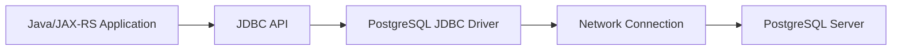
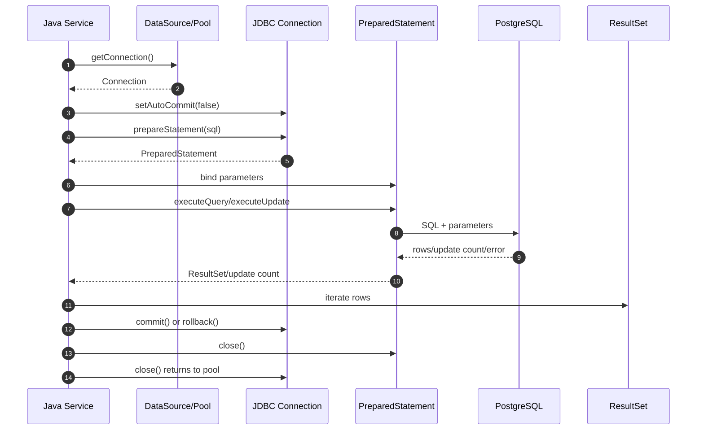

# JDBC Foundation

## 1. Core Thesis

JDBC adalah fondasi semua persistence framework Java.

MyBatis, JPA, Hibernate, connection pool, migration tool, dan banyak library database Java pada akhirnya tetap memakai konsep yang sama:

- `Driver`,
- `DataSource`,
- `Connection`,
- `PreparedStatement`,
- `CallableStatement`,
- `ResultSet`,
- commit/rollback,
- SQLException/SQLState,
- resource closing.

Karena itu, senior engineer tidak cukup hanya tahu annotation JPA atau mapper MyBatis. Ia harus bisa turun satu level ke JDBC mental model untuk memahami:

- kenapa connection pool habis,
- kenapa transaction tidak commit,
- kenapa query streaming menahan connection,
- kenapa autocommit berbahaya di use case multi-step,
- kenapa generated SQL tetap butuh PreparedStatement,
- kenapa SQLState penting untuk retry/error mapping,
- kenapa resource leak bisa menjadi production incident.

JDBC adalah primitive. Framework hanya menambahkan abstraction di atas primitive itu.

---

## 2. Why JDBC Exists

JDBC menyediakan standard API agar aplikasi Java bisa berbicara dengan database relasional tanpa menulis protocol database secara langsung.

Aplikasi tidak berbicara langsung ke PostgreSQL socket protocol di business code. Ia memakai JDBC driver PostgreSQL yang menerjemahkan call Java menjadi komunikasi database.

Secara konseptual:



JDBC menyederhanakan akses database, tetapi tidak menghilangkan tanggung jawab engineer terhadap:

- connection lifecycle,
- transaction lifecycle,
- SQL correctness,
- parameter binding,
- exception handling,
- type mapping,
- resource closing,
- performance behavior.

---

## 3. JDBC Mental Model

JDBC dapat dipahami sebagai pipeline:

```text
DataSource
  -> Connection
    -> PreparedStatement / CallableStatement
      -> execute
        -> ResultSet / update count / generated key
          -> map result
    -> commit / rollback
  -> close connection back to pool
```

Diagram lifecycle:



Hal penting: `connection.close()` pada pooled DataSource biasanya **bukan menutup socket fisik**, tetapi mengembalikan connection ke pool. Namun jika lupa close, pool bisa habis.

---

## 4. JDBC Driver

Driver adalah implementasi database-specific dari JDBC API.

Untuk PostgreSQL, driver bertanggung jawab pada:

- membuka koneksi ke PostgreSQL,
- mengirim SQL,
- mengikat parameter,
- menerima rows,
- melakukan type conversion,
- mengelola prepared statement behavior,
- mengekspos error sebagai `SQLException`,
- mengisi SQLState.

Yang perlu dipahami:

- JDBC API adalah standard Java.
- PostgreSQL JDBC driver adalah implementation.
- Behavior detail seperti JSONB mapping, array, timestamp, fetch size, server-side prepared statement, dan cursor bisa dipengaruhi driver.

Internal verification:

- cek versi PostgreSQL JDBC driver,
- cek apakah ada driver option khusus,
- cek compatibility dengan PostgreSQL server version,
- cek apakah framework menggunakan driver langsung atau lewat app server/container.

---

## 5. DataSource

`DataSource` adalah factory untuk mendapatkan `Connection`.

Dalam production, DataSource hampir selalu terhubung dengan connection pool seperti HikariCP atau equivalent.

Contoh conceptual:

```java
try (Connection connection = dataSource.getConnection()) {
    // use connection
}
```

Di enterprise service, application code biasanya tidak membuat connection via `DriverManager` secara manual. DataSource dikonfigurasi oleh framework/container dan mengelola:

- JDBC URL,
- username/password/secret,
- pool size,
- timeout,
- validation,
- lifecycle,
- metrics.

### Failure Mode

Jika DataSource salah dikonfigurasi:

- service gagal start,
- connection timeout,
- pool exhaustion,
- invalid credential,
- connection storm saat rolling deployment,
- environment mismatch,
- secret rotation failure.

---

## 6. Connection

`Connection` merepresentasikan session/koneksi logical ke database.

Melalui `Connection`, aplikasi bisa:

- membuat statement,
- mengatur autocommit,
- commit,
- rollback,
- mengatur isolation level,
- membuat savepoint,
- membaca metadata,
- mengatur read-only flag,
- mengatur schema jika diperlukan.

Contoh:

```java
try (Connection connection = dataSource.getConnection()) {
    connection.setAutoCommit(false);

    try {
        // execute SQL statements
        connection.commit();
    } catch (SQLException ex) {
        connection.rollback();
        throw ex;
    }
}
```

Dalam framework-managed transaction, application code sering tidak memanggil `commit()`/`rollback()` langsung. Framework melakukannya berdasarkan annotation/configuration.

Namun konsepnya tetap sama: framework mengatur JDBC connection di balik layar.

---

## 7. PreparedStatement

`PreparedStatement` adalah statement SQL dengan parameter binding.

Gunakan PreparedStatement untuk:

- mencegah SQL injection,
- memisahkan SQL template dari nilai parameter,
- membantu driver/database mengoptimalkan execution,
- menangani type binding.

Contoh benar:

```java
String sql = "select id, status from quote where id = ? and tenant_id = ?";

try (PreparedStatement statement = connection.prepareStatement(sql)) {
    statement.setObject(1, quoteId);
    statement.setString(2, tenantId);

    try (ResultSet rs = statement.executeQuery()) {
        while (rs.next()) {
            // map row
        }
    }
}
```

Contoh berbahaya:

```java
String sql = "select * from quote where id = '" + quoteId + "'";
```

Masalahnya:

- SQL injection,
- query sulit di-cache/prepare,
- escaping salah,
- logging sensitive data lebih rawan,
- review lebih sulit.

### Parameter Binding Rules

- Bind value dengan `?`, bukan string concatenation.
- Untuk dynamic sort column, jangan bind sebagai value; gunakan whitelist field.
- Untuk dynamic `IN`, generate placeholder sesuai jumlah value.
- Untuk JSONB/array PostgreSQL, pahami type binding driver.

---

## 8. CallableStatement

`CallableStatement` digunakan untuk memanggil stored procedure/function database.

Contoh conceptual:

```java
try (CallableStatement statement = connection.prepareCall("{ call recalculate_price(?) }")) {
    statement.setObject(1, quoteId);
    statement.execute();
}
```

Gunakan dengan hati-hati karena function/procedure dapat menyembunyikan business logic di database.

Review pertanyaan:

- Apakah procedure punya side effect?
- Apakah procedure ikut transaction caller?
- Apakah error database dipetakan dengan benar?
- Apakah procedure versioned lewat migration?
- Apakah ada integration test?
- Apakah observability cukup?

---

## 9. ResultSet

`ResultSet` merepresentasikan hasil query.

Contoh mapping manual:

```java
List<QuoteSummary> results = new ArrayList<>();

try (ResultSet rs = statement.executeQuery()) {
    while (rs.next()) {
        QuoteSummary summary = new QuoteSummary(
            rs.getObject("id", UUID.class),
            rs.getString("status"),
            rs.getBigDecimal("total_amount")
        );
        results.add(summary);
    }
}
```

Perhatikan:

- column name/alias harus jelas,
- null handling harus eksplisit,
- numeric precision harus aman,
- timestamp timezone harus dipahami,
- enum/string mapping harus divalidasi,
- JSONB/array membutuhkan mapping khusus,
- result besar tidak boleh dimuat seluruhnya tanpa alasan.

### Common ResultSet Mistakes

- Menggunakan column index saat query kompleks, lalu salah mapping setelah kolom berubah.
- Tidak mengecek null untuk primitive field.
- Mengambil semua rows untuk endpoint paginated.
- Tidak menutup ResultSet.
- Mapping timestamp tanpa memahami timezone.
- Mengabaikan duplicate column name pada join.

---

## 10. Transaction and Autocommit

Secara default, banyak JDBC connection berada dalam mode autocommit true. Artinya setiap SQL statement commit sendiri-sendiri.

```text
autocommit=true
  update quote status      -> commit
  insert audit record      -> commit
  insert outbox event      -> commit
```

Masalah: jika statement kedua atau ketiga gagal, statement pertama sudah durable.

Untuk use case multi-step, gunakan transaction eksplisit:

```text
autocommit=false
  update quote status
  insert audit record
  insert outbox event
  commit all together
```

Contoh:

```java
connection.setAutoCommit(false);

try {
    updateQuote(connection, command);
    insertAudit(connection, command);
    insertOutbox(connection, command);
    connection.commit();
} catch (SQLException ex) {
    connection.rollback();
    throw ex;
}
```

Dalam framework transaction, hal ini biasanya dilakukan oleh framework. Tetapi saat debugging, tetap pikirkan connection-level transaction.

### Review Checklist

- Apakah use case butuh atomic multi-statement?
- Apakah autocommit dimatikan oleh framework?
- Apakah rollback terjadi untuk exception yang benar?
- Apakah external side effect terjadi sebelum commit?
- Apakah connection dikembalikan dengan state bersih ke pool?

---

## 11. Savepoint

Savepoint memungkinkan rollback sebagian dalam transaction.

Contoh:

```java
Savepoint savepoint = connection.setSavepoint("before_optional_step");

try {
    runOptionalStep(connection);
} catch (SQLException ex) {
    connection.rollback(savepoint);
}

connection.commit();
```

Namun savepoint bukan pengganti design transaction yang jelas.

Risiko:

- flow menjadi sulit dipahami,
- partial rollback bisa menyembunyikan error,
- tidak semua framework propagation `NESTED` berarti sama secara runtime,
- side effect eksternal tidak ikut rollback.

Gunakan savepoint hanya jika benar-benar ada kebutuhan partial failure dalam satu transaction.

---

## 12. Batch

JDBC batch mengirim banyak operasi serupa secara lebih efisien.

Contoh:

```java
String sql = "insert into quote_item (quote_id, item_id, price) values (?, ?, ?)";

try (PreparedStatement statement = connection.prepareStatement(sql)) {
    for (QuoteItem item : items) {
        statement.setObject(1, item.quoteId());
        statement.setObject(2, item.itemId());
        statement.setBigDecimal(3, item.price());
        statement.addBatch();
    }

    int[] counts = statement.executeBatch();
}
```

Batch membantu mengurangi round trip, tetapi bukan free lunch.

Risiko:

- transaction terlalu besar,
- lock terlalu lama,
- memory pressure,
- partial failure handling kompleks,
- generated key handling lebih rumit,
- error message bisa sulit mengarah ke row tertentu.

Review batch:

- Apakah chunking diperlukan?
- Apakah retry idempotent?
- Apakah constraint violation pada satu row harus menggagalkan semua?
- Apakah ada timeout?
- Apakah lock impact dipahami?
- Apakah metrics batch duration tersedia?

---

## 13. Fetch Size and Large Result

Fetch size mengontrol bagaimana driver mengambil rows dari database.

Tanpa perhatian, query besar bisa:

- memuat semua rows ke memory,
- menahan connection lama,
- membuat response lambat,
- menyebabkan OOM,
- menghabiskan pool.

Contoh:

```java
try (PreparedStatement statement = connection.prepareStatement(sql)) {
    statement.setFetchSize(500);

    try (ResultSet rs = statement.executeQuery()) {
        while (rs.next()) {
            processRow(rs);
        }
    }
}
```

Untuk PostgreSQL, behavior cursor/fetch size dapat dipengaruhi autocommit dan driver. Secara umum, streaming result membutuhkan transaction terbuka dan connection tetap dipakai selama iterasi.

Pertanyaan review:

- Apakah result size dibatasi?
- Apakah endpoint benar-benar perlu streaming?
- Berapa lama connection dipegang?
- Apa timeout/cancellation behavior?
- Apakah processing row lambat?
- Apakah backpressure dipikirkan?

---

## 14. Generated Keys

Generated key sering dibutuhkan setelah insert.

Contoh:

```java
String sql = "insert into quote (tenant_id, status) values (?, ?)";

try (PreparedStatement statement = connection.prepareStatement(sql, Statement.RETURN_GENERATED_KEYS)) {
    statement.setString(1, tenantId);
    statement.setString(2, "DRAFT");
    statement.executeUpdate();

    try (ResultSet keys = statement.getGeneratedKeys()) {
        if (keys.next()) {
            long id = keys.getLong(1);
        }
    }
}
```

Dalam PostgreSQL, `RETURNING` sering lebih eksplisit:

```sql
insert into quote (tenant_id, status)
values (?, ?)
returning id
```

Review:

- Apakah ID dibuat oleh sequence, identity, UUID, atau aplikasi?
- Apakah batch insert membutuhkan generated keys?
- Apakah MyBatis/JPA mapping generated ID sesuai schema?
- Apakah generated key dipakai untuk outbox/audit dalam transaction yang sama?

---

## 15. SQLState and SQLException

`SQLException` membawa informasi error database. Salah satu field penting adalah SQLState.

SQLState membantu membedakan:

- unique violation,
- foreign key violation,
- check violation,
- deadlock,
- serialization failure,
- connection failure,
- timeout,
- syntax error.

Contoh conceptual:

```java
catch (SQLException ex) {
    String sqlState = ex.getSQLState();
    if (isUniqueViolation(sqlState)) {
        throw new DuplicateBusinessKeyException(ex);
    }
    if (isSerializationFailure(sqlState)) {
        throw new RetryablePersistenceException(ex);
    }
    throw ex;
}
```

Senior engineer harus peduli SQLState karena error handling yang benar menentukan:

- HTTP response,
- retry policy,
- user-facing message,
- alert severity,
- incident diagnosis.

### Retryable vs Non-Retryable

Biasanya perlu dibedakan:

- Retryable: serialization failure, deadlock, transient connection issue, lock timeout tertentu.
- Non-retryable: unique violation karena duplicate business key, foreign key violation, not null violation, check constraint violation.

Tetapi policy final harus mengikuti domain dan internal platform convention.

---

## 16. Resource Closing

JDBC resource harus ditutup.

Urutan resource:

```text
ResultSet -> Statement -> Connection
```

Gunakan try-with-resources:

```java
try (Connection connection = dataSource.getConnection();
     PreparedStatement statement = connection.prepareStatement(sql);
     ResultSet rs = statement.executeQuery()) {

    while (rs.next()) {
        // map row
    }
}
```

Jika transaction manual, biasanya connection lifecycle perlu dipisahkan agar commit/rollback eksplisit:

```java
try (Connection connection = dataSource.getConnection()) {
    connection.setAutoCommit(false);

    try {
        runStatements(connection);
        connection.commit();
    } catch (SQLException ex) {
        connection.rollback();
        throw ex;
    }
}
```

Failure jika resource tidak ditutup:

- connection leak,
- pool exhaustion,
- cursor leak,
- memory leak,
- transaction idle in transaction,
- lock ditahan terlalu lama.

---

## 17. JDBC as Foundation for MyBatis

MyBatis menyederhanakan JDBC dengan:

- mapper interface,
- XML/annotation SQL,
- parameter mapping,
- ResultMap,
- TypeHandler,
- SqlSession,
- transaction integration.

Tetapi secara mental:

```text
MyBatis mapper method
  -> build SQL
  -> get JDBC connection/session
  -> prepare statement
  -> bind parameters
  -> execute
  -> read ResultSet
  -> map rows
```

Karena itu, saat MyBatis error, debug tetap sering turun ke:

- SQL aktual,
- parameter binding,
- ResultSet mapping,
- JDBC type handler,
- transaction connection,
- SQLException/SQLState.

---

## 18. JDBC as Foundation for JPA/Hibernate

JPA/Hibernate menyembunyikan lebih banyak JDBC detail, tetapi tetap memakai JDBC.

Contoh Hibernate flow:

```text
entityManager.persist(entity)
  -> entity becomes managed
  -> Hibernate schedules insert
  -> flush occurs
  -> JDBC PreparedStatement created
  -> SQL executed
  -> transaction commits
```

JPA/Hibernate menambah konsep:

- persistence context,
- dirty checking,
- flush,
- entity lifecycle,
- generated SQL,
- first-level cache,
- batching,
- lazy loading.

Namun ketika query gagal, connection habis, lock timeout, deadlock, atau constraint violation terjadi, root cause tetap muncul di level JDBC/PostgreSQL.

---

## 19. JDBC in Java/JAX-RS Backend

Dalam JAX-RS service, JDBC biasanya tidak dipakai langsung di resource class. Flow yang lebih sehat:

```text
JAX-RS Resource
  -> Application Service
    -> Transaction boundary
      -> Repository/DAO/Mapper
        -> JDBC/MyBatis/JPA
          -> PostgreSQL
```

Direct JDBC di resource class biasanya smell karena:

- HTTP concern bercampur database concern,
- transaction boundary tidak jelas,
- error mapping tersebar,
- test sulit,
- query ownership kabur.

Namun JDBC langsung bisa valid untuk:

- health check database sederhana,
- migration/maintenance utility,
- highly optimized hot path,
- framework-independent low-level operation,
- special PostgreSQL operation yang sulit diekspresikan lewat ORM/mapper.

Syaratnya: tetap harus punya boundary, test, error mapping, dan observability.

---

## 20. PostgreSQL-Specific JDBC Awareness

Saat menggunakan PostgreSQL lewat JDBC, perhatikan:

### 20.1 UUID

Gunakan mapping yang konsisten antara PostgreSQL `uuid` dan Java `UUID`.

```java
UUID id = rs.getObject("id", UUID.class);
statement.setObject(1, id);
```

### 20.2 Timestamp

Pastikan convention timezone jelas:

- `timestamp without time zone`,
- `timestamp with time zone`,
- Java `Instant`, `OffsetDateTime`, `LocalDateTime`.

Bug timestamp sering muncul karena environment timezone berbeda.

### 20.3 JSONB

JSONB bisa dibaca sebagai string/object tergantung driver/helper. Pastikan mapping explicit dan tested.

### 20.4 Array

PostgreSQL array perlu mapping JDBC khusus. Jangan asumsikan otomatis cocok dengan Java collection.

### 20.5 RETURNING

PostgreSQL mendukung `RETURNING`, sangat berguna untuk insert/update yang perlu hasil.

### 20.6 Error Codes

PostgreSQL SQLState penting untuk exception mapping. Jangan hanya parse message string.

---

## 21. Transaction Boundary Impact

JDBC membuat transaction boundary terlihat secara eksplisit. Framework membuatnya terlihat secara konfigurasi/annotation. Tetapi prinsipnya sama.

Satu JDBC connection biasanya merepresentasikan satu transaction aktif pada satu waktu.

Implikasi:

- Semua statement dalam transaction harus memakai connection yang sama.
- Jika MyBatis dan JPA ikut transaction yang sama, keduanya harus terhubung ke transaction manager/DataSource yang sama.
- Jika connection berbeda, operasi mungkin tidak atomic bersama.
- Jika autocommit true, setiap statement commit sendiri.
- Jika transaction panjang, lock dan connection ditahan lama.

Pertanyaan senior-level:

```text
Apakah operasi ini benar-benar berada dalam transaction yang sama secara connection-level, atau hanya terlihat sama di code?
```

---

## 22. Microservices and Event-Driven Impact

JDBC sendiri tidak menyelesaikan distributed consistency.

Jika service melakukan:

```text
JDBC update PostgreSQL
Kafka publish
Redis cache update
RabbitMQ message
Camunda signal
```

maka JDBC transaction hanya melindungi database operation pada connection tersebut. Ia tidak otomatis mencakup Kafka/RabbitMQ/Redis/Camunda.

Karena itu pola seperti outbox/inbox/idempotency tetap diperlukan.

### JDBC and Outbox

JDBC sangat cocok untuk memahami outbox:

```text
connection.setAutoCommit(false)
  update business table
  insert outbox row
connection.commit()
```

Ini memberi atomicity antara business state dan event intent.

Event publication dilakukan setelah commit oleh publisher terpisah.

---

## 23. Kubernetes, Cloud, and Runtime Impact

JDBC connection adalah resource runtime. Di Kubernetes/cloud, jumlah connection tidak hanya ditentukan oleh code, tetapi oleh deployment topology.

Contoh:

```text
10 pods
maxPoolSize = 30
=> potensi 300 DB connections dari satu service
```

Jika banyak service terhubung ke PostgreSQL yang sama, total connection bisa melebihi limit database.

Failure mode:

- pool exhaustion,
- database max connection reached,
- rolling deployment connection spike,
- network timeout,
- DNS/private endpoint issue,
- secret rotation membuat old connection invalid,
- pod restart storm menyebabkan reconnect storm.

JDBC-level symptom sering berupa:

- `SQLTransientConnectionException`,
- timeout saat get connection,
- connection reset,
- authentication failure,
- socket timeout.

---

## 24. Failure Modes

### 24.1 Connection Leak

Cause:

- connection tidak ditutup,
- ResultSet/Statement tidak ditutup,
- streaming result tidak selesai,
- exception path tidak close.

Symptoms:

- pool active naik terus,
- pending threads naik,
- endpoint timeout,
- database connection count tinggi.

Debug:

- enable leak detection jika tersedia,
- cek stack trace connection acquisition,
- cek endpoint/job yang memegang connection lama,
- cek streaming/batch code.

### 24.2 Autocommit Mistake

Cause:

- multi-step write tanpa transaction,
- framework transaction tidak aktif,
- manual JDBC lupa set autocommit false.

Symptoms:

- partial data committed,
- audit/outbox missing,
- inconsistent state.

Debug:

- trace transaction boundary,
- cek connection autocommit,
- cek framework transaction logs,
- cek data timeline.

### 24.3 SQL Injection

Cause:

- string concatenation,
- dynamic ORDER BY tanpa whitelist,
- MyBatis `${}` misuse,
- raw SQL builder tidak aman.

Symptoms:

- security finding,
- unexpected query behavior,
- data leakage/destruction risk.

Debug:

- inspect query construction,
- cek parameter binding,
- add negative tests.

### 24.4 Result Mapping Bug

Cause:

- column alias ambigu,
- wrong type conversion,
- null into primitive,
- timestamp timezone mismatch,
- enum string mismatch.

Symptoms:

- wrong API response,
- domain state salah,
- runtime exception,
- subtle data corruption.

Debug:

- compare SQL result raw vs mapped object,
- add integration test,
- assert column alias/type/null behavior.

### 24.5 Transaction Timeout or Lock Wait

Cause:

- query lambat,
- lock conflict,
- transaction terlalu panjang,
- external call di dalam transaction.

Symptoms:

- timeout exception,
- rollback,
- deadlock,
- user latency spike.

Debug:

- inspect `pg_stat_activity`, `pg_locks`, slow query log,
- check transaction duration,
- check blocking query.

---

## 25. Detection and Debugging Checklist

Saat ada masalah JDBC/persistence, kumpulkan:

- endpoint/job/consumer yang terdampak,
- SQL yang dijalankan,
- parameter shape, bukan PII mentah,
- transaction boundary,
- connection pool metrics,
- active/idle/pending connection,
- PostgreSQL session state,
- lock wait/deadlock info,
- SQLState/error code,
- retry behavior,
- deployment version,
- migration status,
- recent schema/index changes.

Pertanyaan debugging:

```text
Apakah gagal saat acquire connection, execute SQL, read result, commit, atau close?
Apakah error retryable?
Apakah transaction rollback?
Apakah data partial committed?
Apakah connection dikembalikan ke pool?
Apakah query menunggu lock atau memang lambat?
Apakah framework menyembunyikan JDBC call di balik MyBatis/JPA?
```

---

## 26. Correctness Concerns

- Gunakan transaction eksplisit untuk multi-step write.
- Jangan mengandalkan application check saja untuk uniqueness; gunakan database constraint.
- Gunakan optimistic/pessimistic lock saat concurrent update bisa merusak invariant.
- Gunakan idempotency key/unique constraint untuk duplicate request.
- Pastikan outbox insert atomic dengan business update.
- Tangani SQLState constraint violation sebagai domain error yang benar.
- Jangan publish event sebelum database commit kecuali ada alasan kuat dan compensating logic.
- Jangan biarkan autocommit menyebabkan partial update.

---

## 27. Performance Concerns

- PreparedStatement mengurangi risiko injection dan membantu execution path.
- Batch mengurangi round trip tetapi perlu chunking.
- Fetch size membantu result besar tetapi bisa menahan connection lama.
- Query count lebih penting daripada micro-optimizing Java loop.
- Connection pool wait bisa terlihat seperti query lambat padahal bottleneck ada di pool.
- Transaction panjang memperpanjang lock dan connection usage.
- Generated keys dalam batch bisa mahal/kompleks.
- ResultSet mapping besar bisa menekan memory/GC.

---

## 28. Security and Privacy Concerns

- Selalu gunakan parameter binding.
- Jangan log full SQL dengan PII parameter mentah.
- Whitelist dynamic identifier seperti column sort.
- Gunakan least privilege DB user sesuai internal policy.
- Pisahkan app user dan migration user jika policy mengatur.
- Jangan expose database error mentah ke HTTP response.
- Pastikan tenant_id/security context ikut semua query yang membutuhkan.

---

## 29. Observability Concerns

Minimal observability JDBC/persistence:

- connection acquisition duration,
- pool active/idle/pending,
- SQL execution duration,
- transaction duration,
- commit/rollback count,
- SQLState/error breakdown,
- statement timeout,
- lock timeout,
- slow query log correlation,
- endpoint trace correlation.

Untuk framework di atas JDBC:

- MyBatis mapper execution metrics,
- Hibernate generated SQL/statistics,
- repository method timing,
- query count per request.

---

## 30. JDBC Review Checklist

Gunakan saat mereview kode JDBC langsung atau framework code yang turun ke JDBC.

### Connection

- Apakah connection diperoleh dari DataSource/pool yang benar?
- Apakah connection selalu ditutup?
- Apakah connection state dikembalikan bersih?
- Apakah timeout dikonfigurasi?

### Transaction

- Apakah autocommit sesuai?
- Apakah commit/rollback eksplisit dan aman?
- Apakah rollback terjadi pada exception path?
- Apakah transaction terlalu panjang?
- Apakah external call terjadi di dalam transaction?

### SQL

- Apakah memakai PreparedStatement?
- Apakah parameter binding aman?
- Apakah dynamic SQL aman dari injection?
- Apakah SQL bisa memakai index?
- Apakah pagination/result limit ada?

### Result Mapping

- Apakah column alias jelas?
- Apakah null handling aman?
- Apakah type conversion benar?
- Apakah timestamp timezone dipahami?
- Apakah JSONB/array mapping diuji?

### Batch/Streaming

- Apakah batch di-chunk?
- Apakah partial failure handling jelas?
- Apakah fetch size sesuai?
- Apakah streaming menahan connection terlalu lama?
- Apakah cancellation/timeout dipikirkan?

### Error Handling

- Apakah SQLState dipakai?
- Apakah retryable/non-retryable dibedakan?
- Apakah constraint violation dipetakan ke domain error?
- Apakah error detail tidak bocor ke client?

### Observability

- Apakah durasi query bisa dilihat?
- Apakah pool metric tersedia?
- Apakah SQL log aman?
- Apakah slow query bisa dikorelasikan dengan endpoint?

---

## 31. Internal Verification Checklist

Jangan mengasumsikan detail internal. Verifikasi hal berikut di codebase/team.

### Driver and DataSource

- Versi PostgreSQL JDBC driver.
- Di mana DataSource dikonfigurasi.
- Apakah memakai HikariCP atau pool lain.
- Konfigurasi JDBC URL dan driver options.
- Secret/credential source.

### Direct JDBC Usage

- Apakah ada kode JDBC langsung.
- Package/class mana yang memakai JDBC langsung.
- Apakah direct JDBC dipakai untuk hot path, maintenance, health check, migration helper, atau legacy code.
- Apakah direct JDBC punya tests.

### Transaction Management

- Apakah transaction manual atau framework-managed.
- Di mana autocommit dikendalikan.
- Apakah ada transaction timeout.
- Apakah isolation level custom dipakai.
- Apakah savepoint/NESTED transaction dipakai.

### Error Handling

- Apakah SQLState dipakai untuk error mapping.
- Apakah ada centralized exception mapper.
- Apakah unique violation dipetakan ke domain conflict.
- Apakah deadlock/serialization failure punya retry policy.

### PostgreSQL Types

- Mapping UUID.
- Mapping timestamp/timezone.
- Mapping JSONB.
- Mapping array.
- Mapping enum.
- Mapping numeric/decimal precision.

### Batch and Streaming

- Apakah ada batch JDBC.
- Apakah ada fetch size/cursor usage.
- Apakah ada endpoint export/streaming besar.
- Apakah ada timeout/cancellation handling.

### Observability

- Apakah connection pool metrics tersedia.
- Apakah JDBC/query duration terlihat.
- Apakah slow query log tersedia.
- Apakah SQL log redacted.
- Apakah leak detection aktif di environment tertentu.

---

## 32. Practical Exercise

Ambil satu query sederhana dari codebase atau buat sample.

1. Tulis versi raw JDBC dengan PreparedStatement.
2. Tambahkan transaction manual.
3. Tambahkan error handling SQLState.
4. Tambahkan try-with-resources.
5. Jalankan dengan PostgreSQL lokal/Testcontainers.
6. Simulasikan unique violation.
7. Simulasikan query result kosong.
8. Simulasikan rollback.
9. Cek connection tidak leak.
10. Bandingkan dengan implementasi MyBatis/JPA yang melakukan operasi sama.

Tujuan latihan bukan agar semua code ditulis raw JDBC, tetapi agar Anda bisa melihat primitive yang disembunyikan framework.

---

## 33. Summary

JDBC adalah layer paling penting untuk dipahami sebelum masuk MyBatis, JPA, Hibernate, transaction framework, connection pooling, dan PostgreSQL troubleshooting.

Yang harus melekat:

- DataSource memberi connection.
- Connection membawa transaction/session context.
- PreparedStatement menjaga parameter binding.
- ResultSet harus dibaca dan ditutup dengan benar.
- Autocommit menentukan atomicity statement.
- Commit/rollback menentukan durability perubahan.
- Batch dan fetch size memengaruhi round trip, memory, dan connection usage.
- SQLState adalah kunci error mapping dan retry.
- Resource leak dapat menjadi incident production.
- Semua framework persistence Java pada akhirnya tetap menyentuh konsep JDBC ini.

Part berikutnya membahas connection pooling dan DataSource secara lebih dalam: pool size, minimum idle, timeout, leak detection, validation, max lifetime, pool exhaustion, connection storm, dan pool sizing dalam Kubernetes/multiple services.
