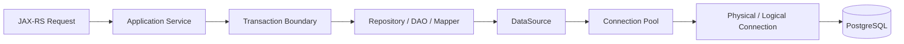
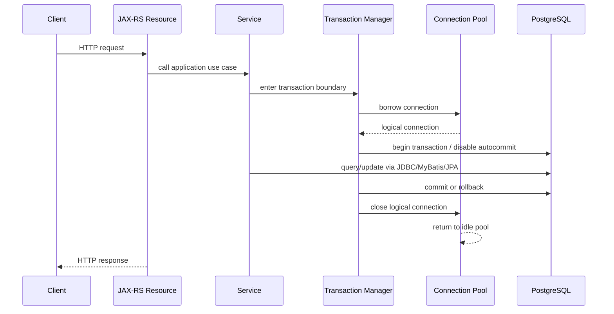
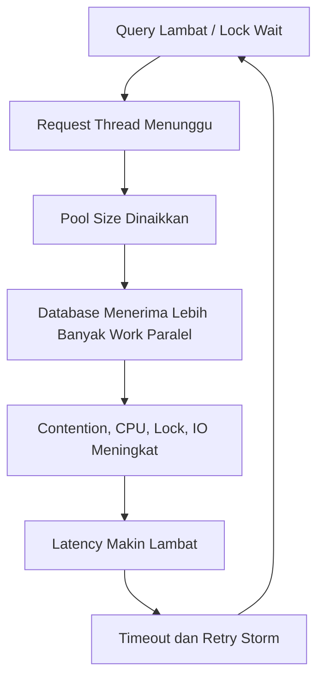
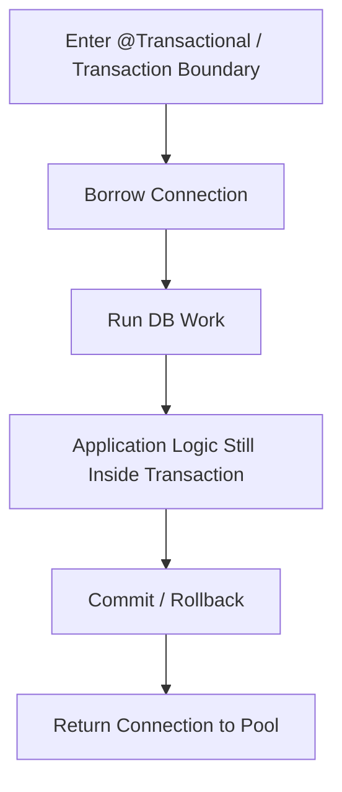
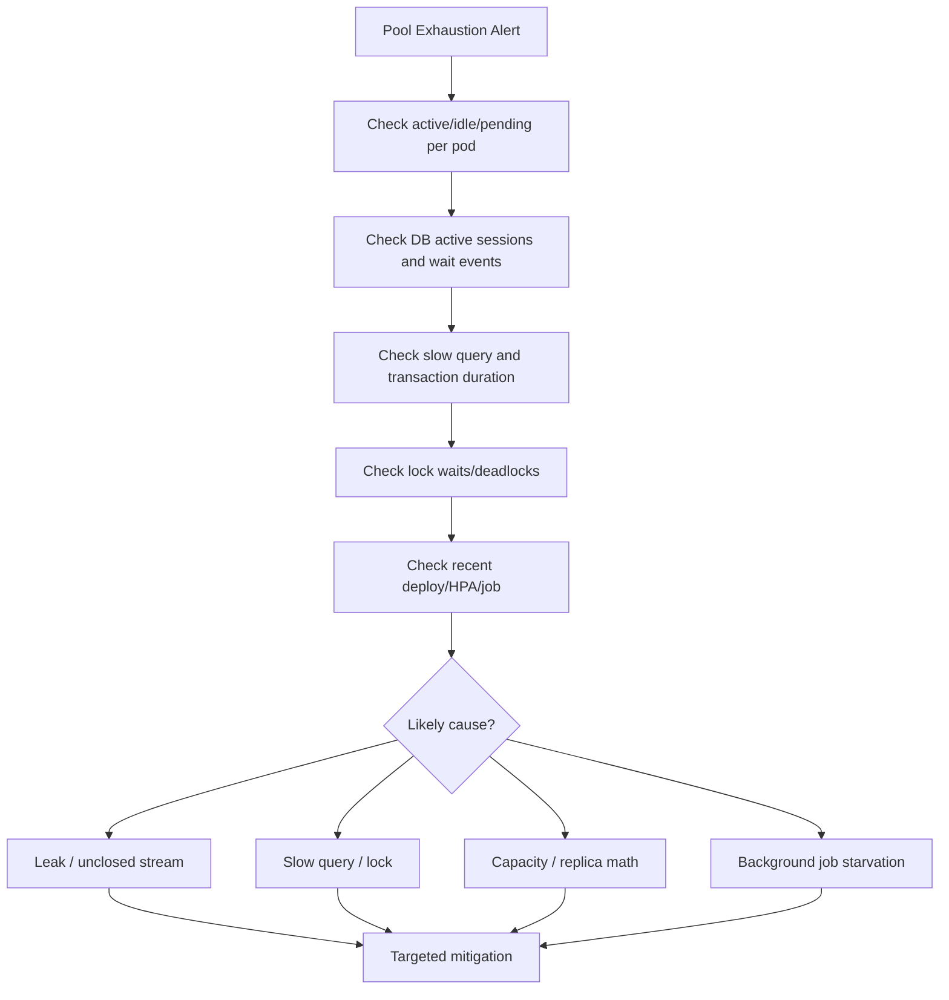

# Connection Pooling and DataSource

## 1. Core Thesis

Connection pool bukan detail konfigurasi minor. Dalam sistem Java/JAX-RS enterprise, connection pool adalah **resource governor** antara aplikasi dan PostgreSQL.

Jika persistence layer adalah boundary logic ke durable state, maka connection pool adalah **gerbang kapasitas runtime** untuk melewati boundary tersebut. Semua JDBC call, MyBatis mapper execution, JPA EntityManager query, Hibernate flush, migration job, health check, batch process, outbox publisher, dan reporting endpoint akhirnya membutuhkan connection.

Kesalahan umum engineer adalah menganggap pool size sebagai angka performa: “semakin besar semakin cepat”. Dalam production, pool size adalah angka koordinasi antara:

- jumlah pod/service instance,
- thread/request concurrency,
- durasi transaksi,
- latency database/network,
- max connection PostgreSQL,
- workload foreground dan background,
- connection reserved untuk migration/admin/monitoring,
- cloud/on-prem database limits,
- retry storm saat incident,
- rolling deployment behavior.

Pool yang terlalu kecil menyebabkan request menunggu connection. Pool yang terlalu besar dapat membunuh database melalui connection storm, context switching, memory overhead, lock amplification, dan queue tersembunyi di database.

Prinsip senior engineer:

> Connection pool bukan tempat menyelesaikan query lambat. Connection pool adalah mekanisme pembatas agar service tidak menghancurkan database saat load meningkat atau failure terjadi.

---

## 2. What Is DataSource?

`DataSource` adalah abstraction Java untuk mendapatkan database connection. Dalam aplikasi modern, code aplikasi jarang membuat connection langsung melalui `DriverManager`. Biasanya aplikasi meminta connection ke `DataSource`, lalu `DataSource` dikelola oleh connection pool.

Mental model:



Yang perlu dipahami:

- `DataSource` adalah pintu masuk aplikasi ke database.
- Connection pool menyediakan logical connection ke aplikasi.
- Logical connection biasanya membungkus physical connection.
- Saat `close()` dipanggil pada logical connection, connection dikembalikan ke pool, bukan selalu ditutup secara fisik.
- Transaction manager biasanya mengambil connection dari DataSource dan mengikatnya ke thread/request/transaction context.
- JDBC, MyBatis, dan JPA/Hibernate akhirnya bergantung pada DataSource yang sama atau setidaknya pada konsep yang sama.

Dalam sistem enterprise, DataSource sering tidak hanya satu. Ada kemungkinan:

- datasource utama read/write,
- datasource read replica,
- datasource migration,
- datasource reporting,
- datasource per tenant,
- datasource per bounded context,
- datasource untuk test.

Jangan mengasumsikan hanya ada satu DataSource sebelum memverifikasi codebase.

---

## 3. Why Connection Pool Exists

Membuka koneksi database bukan operasi gratis. Connection baru membutuhkan handshake, authentication, session setup, memory server-side, socket, dan resource database. Jika setiap request membuat connection baru, latency naik dan database cepat rusak di bawah traffic.

Connection pool menyelesaikan beberapa masalah:

1. **Reuse connection**  
   Connection yang sudah dibuka dipakai ulang.

2. **Bound concurrency ke database**  
   Pool membatasi jumlah operasi database paralel dari satu application instance.

3. **Fail fast saat database overload**  
   Daripada request menggantung tanpa batas, pool dapat memberi timeout saat connection tidak tersedia.

4. **Detect leak**  
   Pool dapat membantu mendeteksi connection yang dipinjam terlalu lama.

5. **Control lifecycle connection**  
   Pool mengelola idle timeout, max lifetime, validation, dan replacement.

6. **Runtime metrics**  
   Pool menyediakan metric active, idle, pending, timeout, dan usage.

Tetapi pool juga memperkenalkan failure mode baru:

- connection leak,
- pool exhaustion,
- connection storm,
- stale connection,
- timeout mismatch,
- starvation karena long transaction,
- background job mengambil semua connection,
- rolling deployment menggandakan connection sementara,
- replica count menyebabkan total connection melebihi database max.

---

## 4. Lifecycle of a Database Connection in a Java/JAX-RS Request

Lifecycle sederhana:



Dalam praktik, detailnya bergantung framework:

- Pada plain JDBC, code bisa borrow dan close connection langsung.
- Pada MyBatis, `SqlSession` biasanya menggunakan connection dari transaction manager atau DataSource.
- Pada JPA/Hibernate, EntityManager/Session memakai connection secara lazy atau saat query/flush.
- Pada framework transaction declarative, connection diikat ke transaction context.

Yang harus dijaga:

- connection harus kembali ke pool,
- transaction harus commit/rollback,
- ResultSet/Statement tidak menahan resource lebih lama dari perlu,
- streaming result tidak membuat connection tertahan tanpa kontrol,
- background job tidak menguasai pool foreground,
- timeout harus jelas di tiap layer.

---

## 5. Logical Connection vs Physical Connection

Engineer sering salah membaca `connection.close()` sebagai “menutup koneksi database”. Dalam pooling, `close()` pada connection yang dipinjam biasanya berarti:

> Saya selesai memakai connection ini; kembalikan ke pool.

Pool bisa memilih:

- mengembalikan physical connection ke idle pool,
- menutup physical connection jika sudah melewati max lifetime,
- mengganti connection jika invalid,
- melakukan cleanup state sebelum dipakai ulang.

State yang harus dibersihkan sebelum connection dipakai ulang:

- autocommit,
- isolation level,
- read-only flag,
- schema/search_path,
- session variables,
- prepared statement state tertentu,
- transaction state,
- warnings.

Jika aplikasi mengubah session-level setting dan tidak mengembalikannya, request berikutnya bisa menerima connection dengan state yang salah.

Contoh risiko:

- request A mengubah `search_path`, request B membaca schema salah,
- request A mengubah isolation level, request B mendapat isolation level lebih mahal,
- request A memulai transaction tapi tidak rollback, connection kembali dalam state buruk,
- request A menjalankan `SET LOCAL` di luar transaction yang tepat.

Senior review point:

> Jangan hanya cek query. Cek apakah query atau helper mengubah state connection/session.

---

## 6. Common Pool Configuration Concepts

Nama properti bisa berbeda tergantung pool implementation, tetapi konsepnya mirip.

### 6.1 Maximum Pool Size

Jumlah maksimum connection aktif/idle yang boleh dimiliki satu application instance.

Dampak:

- terlalu kecil: request menunggu connection,
- terlalu besar: database overload,
- terlalu besar di Kubernetes: total connection = max pool size × pod count × service count.

Rule of thumb bukan angka universal. Yang benar adalah menghitung berdasarkan workload, DB max connection, dan observability.

### 6.2 Minimum Idle

Jumlah connection idle minimum yang dijaga pool.

Dampak:

- terlalu tinggi: connection idle memboroskan slot database,
- terlalu rendah: cold traffic perlu membuka connection baru,
- pada banyak pod, minimum idle tinggi dapat menghabiskan connection meskipun traffic rendah.

Dalam Kubernetes, `minimumIdle = maximumPoolSize` pada banyak service bisa menyebabkan connection baseline sangat besar.

### 6.3 Connection Timeout

Waktu maksimum request menunggu connection dari pool.

Jika timeout terjadi, aplikasi biasanya mendapat exception sebelum query dikirim ke database.

Interpretasi production:

- pool penuh,
- connection leak,
- query/transaction terlalu lama,
- database lambat,
- background job menguasai pool,
- traffic spike,
- pod count naik tanpa DB capacity naik.

### 6.4 Idle Timeout

Berapa lama connection idle boleh bertahan sebelum ditutup.

Perlu diseimbangkan dengan:

- traffic pattern,
- database/network idle timeout,
- cloud load balancer/proxy timeout,
- min idle setting.

### 6.5 Max Lifetime

Umur maksimum physical connection sebelum diganti.

Penting karena:

- cloud database/proxy bisa memutus connection tua,
- credential rotation bisa membutuhkan connection baru,
- network path bisa berubah,
- server-side connection state bisa rusak.

Max lifetime sebaiknya lebih pendek dari timeout eksternal yang memutus connection secara paksa.

### 6.6 Leak Detection Threshold

Threshold untuk mencatat warning jika connection dipinjam terlalu lama.

Ini bukan pengganti observability transaction duration. Leak detection membantu menemukan code path yang tidak mengembalikan connection atau transaksi yang terlalu panjang.

### 6.7 Validation

Pool perlu tahu apakah connection masih valid.

Modern pool sering memakai driver-level validation. Query validasi manual seperti `SELECT 1` kadang tidak perlu jika driver/pool mendukung validasi efisien.

Yang penting:

- validation tidak boleh terlalu mahal,
- validation timeout harus masuk akal,
- stale connection harus dibuang.

---

## 7. HikariCP or Equivalent Mental Model

Banyak aplikasi Java modern memakai HikariCP atau pool equivalent. Nama pool spesifik harus diverifikasi internal, tetapi konsep review sama.

Contoh konfigurasi konseptual:

```yaml
persistence:
  datasource:
    jdbcUrl: jdbc:postgresql://db-host:5432/appdb
    username: app_user
    maximumPoolSize: 20
    minimumIdle: 5
    connectionTimeoutMs: 3000
    idleTimeoutMs: 600000
    maxLifetimeMs: 1800000
    leakDetectionThresholdMs: 30000
```

Jangan copy angka ini sebagai standard. Angka harus divalidasi terhadap:

- DB max connections,
- jumlah pod,
- jumlah service,
- workload peak,
- query latency,
- transaction duration,
- background jobs,
- migration jobs,
- operational reserve.

Konfigurasi pool harus diperlakukan sebagai kapasitas production, bukan default library.

---

## 8. Pool Sizing Mental Model

Formula pertama yang harus dihitung:

```text
Total possible app connections
= sum_over_services(maxPoolSize_per_pod × replica_count)
+ migration/admin/monitoring connections
+ operational reserve
```

Contoh konseptual:

```text
Service A: 10 pods × pool 20 = 200
Service B:  6 pods × pool 15 =  90
Service C:  4 pods × pool 10 =  40
Migration/admin/monitoring       =  20
Reserve                           =  30
Total possible                    = 380
```

Jika PostgreSQL `max_connections` efektif untuk workload aplikasi hanya 300, maka konfigurasi ini sudah bermasalah bahkan sebelum traffic nyata terjadi.

Tetapi sizing bukan hanya tidak boleh melebihi max connections. Terlalu banyak connection aktif juga dapat menurunkan throughput karena:

- database CPU context switching,
- lock contention,
- buffer/cache pressure,
- query planner/executor overhead,
- memory per backend connection,
- I/O contention,
- transaksi lambat menahan row lock lebih lama.

Pool size harus dipikirkan sebagai **parallelism budget**, bukan sebagai queue capacity.

---

## 9. Why Larger Pool Can Make System Slower

Saat endpoint lambat, reaksi buruk adalah menaikkan pool size. Ini hanya membantu jika bottleneck benar-benar karena connection terlalu sedikit sementara database masih punya headroom.

Jika bottleneck sebenarnya query lambat, lock wait, atau database CPU penuh, menaikkan pool size akan memperparah masalah:



Kenaikan pool size harus didukung evidence:

- active connections sering mencapai max,
- pending connection tinggi,
- DB CPU masih rendah/moderat,
- lock wait rendah,
- query latency normal,
- transaction duration normal,
- database masih punya connection dan memory headroom,
- endpoint bottleneck memang queue di pool.

Jika evidence tidak ada, tuning yang benar mungkin:

- memperbaiki query,
- menambah index,
- mengurangi transaction duration,
- memperbaiki N+1,
- memecah batch,
- membatasi concurrency background job,
- memperbaiki lock ordering,
- menambah read model,
- mengubah pagination.

---

## 10. Pool Exhaustion

Pool exhaustion terjadi ketika semua connection di pool sedang dipinjam dan request baru menunggu sampai connection timeout.

Gejala:

- HTTP latency naik tajam,
- error `connection timeout` dari pool,
- active connections = maximum pool size,
- pending threads/request naik,
- database mungkin terlihat idle atau busy tergantung penyebab,
- thread dump menunjukkan banyak thread menunggu connection,
- leak detection warning muncul,
- transaction duration meningkat.

Penyebab umum:

1. **Query lambat**  
   Connection tertahan lama karena query belum selesai.

2. **Transaction terlalu panjang**  
   Service melakukan banyak logic/external call di dalam transaction.

3. **Connection leak**  
   Code meminjam connection tetapi tidak mengembalikan.

4. **Streaming result tidak ditutup**  
   Cursor/ResultSet menahan connection.

5. **Batch job terlalu agresif**  
   Background job memakan semua slot.

6. **Database lock wait**  
   Query tampak “jalan” tetapi menunggu lock.

7. **DB/network slowdown**  
   Semua query menjadi lambat.

8. **Replica scaling tanpa DB sizing**  
   Pod bertambah, total connection bertambah.

9. **Retry storm**  
   Error menyebabkan client/service melakukan retry paralel.

Diagnosis harus membedakan pool exhaustion karena aplikasi menahan connection vs database lambat.

---

## 11. Connection Leak

Connection leak berarti connection dipinjam dari pool tetapi tidak dikembalikan tepat waktu atau sama sekali.

Pada JDBC manual, leak sering disebabkan oleh:

- tidak memakai try-with-resources,
- exception path tidak menutup resource,
- ResultSet/Statement/Connection lifecycle tidak jelas,
- connection disimpan di field/static,
- helper method membuka connection tanpa ownership jelas.

Pada MyBatis/JPA dengan transaction manager, leak lebih sering berupa:

- transaksi tidak selesai,
- stream/cursor tidak ditutup,
- EntityManager/session lifecycle salah,
- asynchronous work memakai resource transaction di luar scope,
- framework integration salah.

Contoh anti-pattern JDBC:

```java
Connection c = dataSource.getConnection();
PreparedStatement ps = c.prepareStatement("select * from quote where id = ?");
// exception sebelum close -> leak
```

Lebih aman:

```java
try (Connection c = dataSource.getConnection();
     PreparedStatement ps = c.prepareStatement("select * from quote where id = ?")) {
    ps.setLong(1, quoteId);
    try (ResultSet rs = ps.executeQuery()) {
        // map result
    }
}
```

Dalam code yang memakai transaction manager, jangan sembarang close connection yang bukan milik code tersebut. Ownership resource harus jelas.

---

## 12. Long Transaction as Hidden Pool Leak

Tidak semua “leak” adalah connection yang lupa ditutup. Banyak incident pool exhaustion disebabkan transaksi yang valid tetapi terlalu lama.

Contoh buruk:

```text
BEGIN
  SELECT quote
  call external pricing service
  call entitlement service
  update quote
  publish synchronous event
COMMIT
```

Selama external call berlangsung, connection dan transaction bisa tertahan. Jika banyak request melakukan hal sama, pool habis dan lock bisa bertahan lama.

Prinsip:

- Jangan melakukan external network call di dalam transaction kecuali benar-benar dipahami risikonya.
- Jangan menunggu message broker di dalam DB transaction.
- Jangan memproses file besar dalam satu transaction panjang.
- Jangan melakukan CPU-heavy transformation sambil menahan connection.
- Ambil connection sedekat mungkin dengan operasi DB, lepaskan secepat mungkin.

Dalam framework declarative transaction, hati-hati: annotation pada method besar dapat membuat seluruh method menjadi transaction boundary.

---

## 13. Transaction Boundary and Connection Ownership

Connection biasanya diikat ke transaction. Selama transaction aktif, connection tidak bisa dikembalikan ke pool karena commit/rollback belum terjadi.

Mental model:



Yang sering luput:

- walaupun query sudah selesai, connection masih tertahan sampai transaction selesai,
- JPA dapat menunda SQL sampai flush/commit,
- MyBatis query langsung jalan tetapi connection tetap transaction-bound,
- lazy loading JPA bisa memicu query belakangan di transaction yang sama,
- outbox insert harus dalam transaction yang sama dengan state change, tetapi publisher actual biasanya di luar transaction.

Review transaction boundary harus selalu menanyakan:

> Berapa lama connection ditahan, bukan hanya berapa lama query berjalan?

---

## 14. JDBC, MyBatis, JPA, and Pool Interaction

### 14.1 JDBC Direct

Code langsung meminjam connection dari DataSource.

Keunggulan:

- lifecycle eksplisit,
- mudah mengatur fetch size/batch/statement,
- overhead minimal.

Risiko:

- resource leak,
- transaction boundary manual salah,
- exception handling tersebar,
- duplicate boilerplate.

### 14.2 MyBatis

MyBatis memakai connection dari DataSource atau transaction manager melalui SqlSession.

Keunggulan:

- SQL eksplisit,
- mapping lebih rapi daripada JDBC manual,
- integrasi transaction bisa bersih.

Risiko:

- SqlSession lifecycle salah,
- cursor tidak ditutup,
- dynamic SQL lambat menahan connection,
- batch executor flush/commit semantics perlu dipahami.

### 14.3 JPA/Hibernate

Hibernate memakai connection melalui EntityManager/Session. Connection dapat dipinjam saat query/flush, tergantung connection handling mode dan transaction integration.

Keunggulan:

- unit-of-work,
- dirty checking,
- relationship mapping,
- lifecycle management.

Risiko:

- flush surprise,
- lazy loading menambah query,
- persistence context besar,
- connection tertahan selama transaction,
- generated SQL tidak terlihat jika logging buruk.

### 14.4 Mixing MyBatis and JPA

Jika MyBatis dan JPA memakai DataSource dan transaction manager yang sama, mereka bisa berada dalam transaction yang sama. Ini bukan otomatis aman.

Risiko utama:

- JPA persistence context menyimpan state lama,
- MyBatis update bypass dirty checking,
- JPA flush terjadi sebelum MyBatis query,
- second-level cache stale,
- ordering query/write tidak jelas,
- connection tetap sama tetapi model state berbeda.

Part khusus mixing akan membahas ini detail. Untuk part ini, cukup pahami bahwa pool/DataSource sharing hanya menyelesaikan **resource sharing**, bukan **state model consistency**.

---

## 15. Pool Sizing in Kubernetes

Dalam Kubernetes, setiap pod biasanya memiliki pool sendiri. Maka total connection meningkat linear terhadap replica count.

```text
Total connection budget per service = replicas × maxPoolSize
```

Jika autoscaling aktif, gunakan angka maksimum autoscale, bukan replica saat ini.

```text
Worst-case service connection = maxReplicas × maxPoolSize
```

Jika ada banyak service ke database yang sama:

```text
Worst-case DB connections = Σ(maxReplicas(service) × maxPoolSize(service)) + jobs + admin + monitoring + reserve
```

Failure mode Kubernetes-specific:

- rolling deployment membuat old pods dan new pods hidup bersamaan,
- HPA scale-out membuka banyak connection dalam waktu singkat,
- pod restart loop menyebabkan connection churn,
- readiness probe terlalu cepat menerima traffic sebelum pool stabil,
- migration job berjalan bersamaan dengan app pods,
- multiple namespaces/environment berbagi database,
- connection pool per pod tidak sadar global DB limit.

Senior review point:

> Konfigurasi pool tidak bisa direview tanpa melihat replica count, HPA, deployment strategy, dan database max connection.

---

## 16. Rolling Deployment and Connection Storm

Connection storm terjadi saat banyak pod membuka connection hampir bersamaan. Ini bisa terjadi ketika:

- deployment baru rollout,
- HPA scale-out,
- database failover lalu semua service reconnect,
- node restart,
- secret rotation memaksa reconnect,
- network partition pulih.

Dampaknya:

- PostgreSQL menerima banyak authentication/session setup,
- CPU spike,
- connection limit tercapai,
- aplikasi timeout saat startup,
- readiness gagal,
- retry memperparah storm.

Mitigasi:

- batasi maxUnavailable/maxSurge,
- gunakan startup/readiness probe yang masuk akal,
- hindari minimumIdle terlalu tinggi pada banyak pod,
- gunakan backoff reconnect,
- koordinasikan pool size dengan HPA max replicas,
- pisahkan migration job dari app startup jika migration berat,
- monitor connection churn.

---

## 17. Multiple Services Sharing One PostgreSQL

Dalam enterprise platform, satu PostgreSQL cluster/instance bisa melayani banyak service. Bahkan jika schema berbeda, connection dan resource database tetap dibagi.

Risiko:

- satu service dengan pool terlalu besar mengganggu service lain,
- batch job satu bounded context membuat DB CPU tinggi untuk semua,
- migration satu service menahan lock global/relasi yang berdampak luas,
- shared database membuat incident blast radius lebih besar,
- read-only/reporting query mengganggu write path.

Perlu governance:

- connection budget per service,
- resource ownership,
- slow query review,
- migration window/process,
- workload isolation,
- read replica strategy jika relevan,
- dashboard per service/user/application_name.

Internal verification harus mencari apakah PostgreSQL membedakan `application_name` per service. Ini sangat membantu observability.

---

## 18. Foreground vs Background Workload

Tidak semua database workload sama. JAX-RS request foreground dan background job memiliki kebutuhan berbeda.

Foreground request:

- latency-sensitive,
- user-facing,
- timeout pendek,
- harus dilindungi dari starvation.

Background job:

- batch/outbox/reconciliation/reporting,
- bisa besar dan lama,
- bisa retry,
- bisa dijadwalkan,
- bisa memakan connection banyak jika tidak dibatasi.

Anti-pattern:

- background job memakai pool yang sama tanpa concurrency limit,
- batch job parallelism lebih besar dari pool size,
- outbox publisher mengambil semua connection saat broker lambat,
- report export besar memblokir transaksi user.

Opsi desain:

- pool terpisah untuk background job,
- concurrency limiter per job,
- chunking,
- read replica untuk reporting,
- scheduled window,
- circuit breaker untuk publisher,
- backpressure.

---

## 19. Timeout Layering

Timeout harus konsisten di beberapa layer:

```text
HTTP client timeout
  > JAX-RS request timeout
    > transaction timeout
      > statement/query timeout
        > lock timeout
          > connection acquisition timeout
```

Ini bukan urutan absolut untuk semua sistem, tetapi prinsipnya:

- jangan biarkan query berjalan lebih lama dari request yang sudah gagal,
- jangan biarkan transaction menggantung setelah caller timeout,
- jangan biarkan lock wait tanpa batas,
- jangan biarkan connection wait terlalu lama sampai thread habis,
- jangan membuat retry terjadi saat operasi lama masih berjalan.

Timeout yang perlu diperiksa:

- connection acquisition timeout,
- socket/connect timeout JDBC,
- statement timeout PostgreSQL,
- lock timeout PostgreSQL,
- transaction timeout framework,
- JAX-RS/server request timeout,
- upstream client timeout,
- message consumer processing timeout,
- batch job timeout.

Failure mode umum:

- client timeout 5 detik, query masih berjalan 2 menit,
- transaction timeout tidak dikonfigurasi,
- lock wait tidak dibatasi,
- pool connection timeout terlalu tinggi sehingga thread menumpuk,
- retry membuat duplicate work karena idempotency tidak ada.

---

## 20. Connection Pool Metrics

Minimum metrics yang harus tersedia:

- active connections,
- idle connections,
- total connections,
- pending/waiting threads,
- connection acquisition time,
- connection timeout count,
- connection usage duration,
- connection creation count,
- connection close/eviction count,
- leak detection warning count,
- pool max/min config,
- per-pod metric,
- per-service aggregate.

Metrics ini harus dikorelasikan dengan:

- HTTP request rate,
- HTTP latency,
- error rate,
- transaction duration,
- slow query log,
- DB CPU/memory/IO,
- PostgreSQL active sessions,
- lock wait,
- deadlock count,
- deployment events,
- HPA scale events.

Dashboard yang hanya menampilkan DB CPU tanpa pool metrics tidak cukup untuk incident persistence layer.

---

## 21. Debugging Pool Exhaustion: Production-Safe Flow

Saat pool exhaustion terjadi, jangan langsung restart service atau menaikkan pool. Gunakan flow evidence-based.



Questions:

1. Apakah semua pod terkena atau hanya satu pod?
2. Apakah active connection = max pool size?
3. Apakah pending threads naik?
4. Apakah DB sessions aktif menjalankan query atau menunggu lock?
5. Query apa yang paling lama?
6. Transaction mana yang paling lama?
7. Ada deployment/HPA/job baru?
8. Ada spike traffic atau retry storm?
9. Ada leak detection warning?
10. Apakah background workload menguasai pool?

Mitigation harus sesuai penyebab:

- leak: fix lifecycle/close stream,
- slow query: tune query/index/plan,
- lock: perbaiki transaction/lock ordering/retry,
- background job: throttle/chunk/separate pool,
- capacity: adjust pool/replica/DB capacity dengan perhitungan,
- connection storm: rollout/backoff/readiness tuning.

---

## 22. PostgreSQL-Specific Considerations

PostgreSQL menggunakan process/backend per connection. Setiap connection membutuhkan resource server-side. Banyak connection idle pun tetap punya biaya.

Hal yang perlu diperhatikan:

- `max_connections` bukan target yang harus dipenuhi; itu batas keras.
- Connection aktif terlalu banyak bisa menurunkan throughput.
- Long transaction dapat mengganggu vacuum dan menyebabkan bloat.
- Idle in transaction sangat berbahaya.
- Lock wait bisa membuat connection terlihat aktif tetapi tidak melakukan progress.
- Statement timeout dan lock timeout harus membantu membatasi kerusakan.
- `application_name` membantu identifikasi service/pod.
- Read replica tidak menyelesaikan write pool pressure.
- Connection pooler eksternal seperti PgBouncer mungkin ada, tetapi behavior transaction/session pooling harus dipahami sebelum digunakan dengan JPA/MyBatis.

Internal verification checklist harus memastikan apakah ada DB proxy/pooler antara aplikasi dan PostgreSQL.

---

## 23. Connection Pooler External Awareness

Beberapa environment memakai pooler eksternal seperti PgBouncer atau cloud proxy. Jangan mengasumsikan tidak ada.

Jika ada pooler eksternal, beberapa behavior bisa berubah:

- session-level setting mungkin tidak aman pada transaction pooling,
- prepared statement behavior bisa berbeda,
- temporary table/session state berisiko,
- advisory lock session-level bisa bermasalah,
- connection count aplikasi tidak sama dengan backend connection PostgreSQL,
- monitoring perlu melihat pooler dan database.

JPA/Hibernate dan MyBatis bisa bergantung pada session behavior tertentu. Karena itu, penggunaan pooler eksternal harus diverifikasi dengan DBA/platform.

Internal verification checklist:

- Apakah ada PgBouncer/proxy?
- Mode pooler: session, transaction, atau statement?
- Apakah prepared statements kompatibel?
- Apakah aplikasi memakai session variables/search_path?
- Apakah advisory locks session-level digunakan?
- Apakah metrics pooler tersedia?

---

## 24. Read Replica and Read-Only DataSource

Beberapa sistem memakai read replica untuk query read-heavy. Ini dapat mengurangi beban primary, tetapi membawa correctness trade-off.

Risiko:

- replication lag,
- read-after-write inconsistency,
- transaction read/write split salah,
- query yang harus strong consistency diarahkan ke replica,
- cache/read model makin stale,
- failover behavior berbeda.

Jika ada read-only DataSource:

- repository harus jelas mana strong read dan eventual read,
- JAX-RS endpoint harus punya contract consistency,
- write transaction tidak boleh diam-diam membaca replica untuk keputusan penting,
- observability harus memisahkan primary vs replica latency/lag,
- tests harus mencakup stale read scenario jika relevan.

Untuk CPQ/quote/order, beberapa read bisa tolerate slight staleness, tetapi decision write path seperti submit order, price validation, state transition, dan idempotency biasanya membutuhkan strong consistency.

---

## 25. Security and Credential Rotation

Connection pool menyimpan connection yang sudah authenticated. Saat credential database dirotasi, connection lama mungkin tetap hidup sampai:

- max lifetime habis,
- pool evict connection,
- pod restart,
- database memutus connection,
- secret reload mechanism bekerja.

Hal yang perlu diverifikasi:

- apakah aplikasi mendukung secret rotation tanpa restart,
- apakah max lifetime membantu pergantian credential,
- apakah deployment restart diperlukan,
- apakah migration user berbeda dari app user,
- apakah read-only user terpisah,
- apakah credential muncul di logs,
- apakah TLS/SSL config dipakai sesuai policy.

Least privilege terkait pool:

- aplikasi tidak harus memakai migration user,
- read-only job sebaiknya tidak memakai write user jika tidak perlu,
- admin credential tidak boleh dipakai di runtime service,
- permission schema harus sesuai ownership.

---

## 26. Data Correctness Concerns

Connection pool tampak seperti infrastructure concern, tetapi ia memengaruhi correctness.

Correctness risk:

- transaction timeout tidak sinkron dengan request timeout,
- connection state bocor antar request,
- read-only flag tidak dikembalikan,
- isolation level berubah tanpa reset,
- session variable tenant/user bocor,
- transaction menggantung lalu rollback terlambat,
- retry karena timeout membuat duplicate write,
- pool exhaustion menyebabkan partial workflow gagal setelah DB commit tetapi sebelum event publish,
- background outbox publisher kekurangan connection sehingga event terlambat.

Karena itu, review pool harus bertanya:

- Apakah connection state aman dipakai ulang?
- Apakah transaction boundary menahan connection terlalu lama?
- Apakah timeout menghasilkan retry yang idempotent?
- Apakah pool starvation dapat membuat workflow/event consistency terganggu?
- Apakah tenant/security context tersimpan di DB session?

---

## 27. Performance Concerns

Pool memengaruhi performance melalui dua cara:

1. **Queueing sebelum database**  
   Request menunggu connection.

2. **Parallelism ke database**  
   Banyak connection aktif menjalankan query bersamaan.

Optimasi harus melihat kedua sisi:

- Jika pool queue tinggi dan database idle, pool mungkin terlalu kecil atau connection acquisition terlalu lambat.
- Jika pool queue tinggi dan database busy, masalah mungkin query/DB capacity.
- Jika active rendah tetapi latency tinggi, bottleneck mungkin bukan pool.
- Jika active tinggi terus tetapi throughput rendah, query/lock/transaction duration perlu dicek.
- Jika idle tinggi terus, pool mungkin oversized.

Jangan menilai pool dari satu metric. Gunakan korelasi.

---

## 28. Observability Concerns

Persistence observability minimal harus menjawab:

- Berapa connection aktif per pod?
- Berapa request menunggu connection?
- Berapa lama acquisition time?
- Query apa yang berjalan lama?
- Transaction mana yang lama?
- Apakah ada lock wait?
- Apakah ada idle in transaction?
- Apakah ada spike setelah deploy?
- Apakah background job menggunakan pool berlebihan?
- Apakah pool timeout meningkat sebelum HTTP 5xx?

Tambahkan correlation attributes jika memungkinkan:

- service name,
- pod name,
- environment,
- datasource name,
- route/endpoint,
- transaction/use case name,
- database user,
- PostgreSQL application_name.

SQL logging harus aman dari PII dan credential.

---

## 29. Microservices and Event-Driven Architecture Impact

Dalam microservices, pool exhaustion bukan hanya membuat endpoint gagal. Ia bisa mengganggu event-driven consistency:

- outbox tidak bisa dipublish karena tidak mendapat connection,
- inbox consumer gagal mencatat idempotency,
- Kafka/RabbitMQ consumer retry terus,
- saga step tertunda,
- compensation tidak berjalan,
- Camunda worker tidak bisa update state,
- reconciliation job backlog.

Desain perlu memisahkan dan membatasi workload:

- HTTP command path,
- message consumer,
- outbox publisher,
- reconciliation job,
- export/reporting,
- migration job.

Jika semuanya memakai pool yang sama, satu workload bisa membuat workload lain starving. Ini harus sadar desain, bukan accidental.

---

## 30. Kubernetes, AWS/Azure, On-Prem, and Hybrid Deployment

### Kubernetes

Perhatikan:

- replica count,
- HPA max replicas,
- readiness/liveness behavior,
- rolling deployment surge,
- migration job ordering,
- secret refresh,
- pod disruption,
- node restart.

### AWS/Azure Cloud PostgreSQL

Perhatikan:

- max connection berdasarkan instance size,
- failover behavior,
- connection reset,
- proxy/pooler,
- network latency,
- TLS requirement,
- maintenance window,
- parameter group/server parameter.

### On-Prem

Perhatikan:

- network path lebih bervariasi,
- firewall idle timeout,
- DBA-controlled connection limits,
- monitoring access berbeda,
- maintenance process internal.

### Hybrid

Perhatikan:

- latency antar data center/cloud,
- failover route,
- DNS caching,
- cross-region replication lag,
- secret/config drift.

Internal verification harus membedakan environment. Jangan mengasumsikan behavior local sama dengan production.

---

## 31. Review Checklist for Pool Configuration

Gunakan checklist ini saat review PR/config/deployment:

### Capacity

- Berapa `maximumPoolSize` per pod?
- Berapa `minimumIdle` per pod?
- Berapa max replicas service?
- Berapa total possible connection ke database?
- Apakah ada reserve untuk admin/migration/monitoring?
- Apakah ada service lain berbagi database?

### Timeout

- Berapa connection acquisition timeout?
- Berapa statement timeout?
- Berapa transaction timeout?
- Berapa lock timeout?
- Apakah timeout selaras dengan HTTP/client timeout?

### Lifecycle

- Apakah max lifetime cocok dengan DB/proxy timeout?
- Apakah idle timeout masuk akal?
- Apakah validation aman?
- Apakah leak detection aktif di environment yang tepat?

### Workload

- Apakah foreground dan background berbagi pool?
- Apakah batch job punya concurrency limit?
- Apakah outbox publisher dapat starving command path?
- Apakah reporting/export memakai pool yang sama?

### Kubernetes

- Apakah HPA diperhitungkan?
- Apakah rolling deployment surge diperhitungkan?
- Apakah startup membuka connection storm?
- Apakah migration job bisa overlap dengan app pods?

### Observability

- Apakah metrics pool tersedia per pod?
- Apakah alert pool timeout ada?
- Apakah acquisition latency terlihat?
- Apakah DB sessions bisa dipetakan ke service/pod?

---

## 32. Common Anti-Patterns

### 32.1 “Endpoint lambat, naikkan pool size”

Tanpa evidence, ini sering memperburuk database.

### 32.2 Pool size sama di semua service

Setiap service punya workload berbeda. Copy-paste config menghasilkan capacity mismatch.

### 32.3 Minimum idle terlalu tinggi di banyak pod

Database connection habis oleh idle connection.

### 32.4 Transaction mencakup external call

Connection tertahan sambil menunggu network service lain.

### 32.5 Background job tanpa throttle

Job internal membuat user-facing request gagal.

### 32.6 Tidak ada statement/lock timeout

Query/lock wait bisa menggantung terlalu lama.

### 32.7 Tidak ada pool metrics

Incident hanya terlihat sebagai HTTP 500/timeout tanpa root cause.

### 32.8 Session state bocor

Connection dipakai ulang dengan schema/isolation/tenant state yang salah.

### 32.9 MyBatis/JPA mixing dianggap aman karena DataSource sama

Shared DataSource tidak menyelesaikan stale persistence context atau cache conflict.

---

## 33. Internal Verification Checklist

Cek hal berikut di codebase, deployment, dan diskusi internal:

### DataSource and Pool

- Pool implementation apa yang digunakan?
- Di mana konfigurasi DataSource berada?
- Apakah ada lebih dari satu DataSource?
- Apakah ada read/write split?
- Apakah ada datasource untuk migration/job/reporting?
- Apakah DataSource dikelola framework atau manual?

### Pool Configuration

- `maximumPoolSize`
- `minimumIdle`
- connection timeout
- idle timeout
- max lifetime
- leak detection threshold
- validation behavior
- auto-commit default
- read-only default
- isolation default

### PostgreSQL Capacity

- PostgreSQL max connections.
- Connection reserved untuk admin/monitoring.
- Connection dari service lain.
- Cloud/on-prem connection limit.
- Apakah ada PgBouncer/proxy?
- Apakah `application_name` diset?

### Kubernetes and Deployment

- Replica count per service.
- HPA min/max replicas.
- Rolling deployment max surge/unavailable.
- Startup/readiness behavior.
- Migration job timing.
- Secret rotation behavior.

### Transaction and Workload

- Transaction annotation/configuration.
- Long transaction path.
- External call inside transaction.
- Batch job concurrency.
- Message consumer concurrency.
- Outbox publisher concurrency.
- Export/reporting endpoint behavior.

### Observability

- Pool active/idle/pending metrics.
- Acquisition latency.
- Pool timeout alert.
- Connection leak warnings.
- DB session dashboard.
- Slow query log.
- Lock wait/deadlock dashboard.
- Transaction duration metric.

### Incident History

- Pool exhaustion incident.
- Connection leak incident.
- DB max connection incident.
- Rolling deployment connection storm.
- Migration lock incident.
- Slow query causing pool starvation.
- Background job starving request path.

---

## 34. PR Review Questions

Saat PR menyentuh persistence, transaction, background job, atau config pool, tanyakan:

1. Apakah perubahan ini meningkatkan jumlah query per request?
2. Apakah transaction boundary makin panjang?
3. Apakah ada streaming/cursor yang perlu ditutup?
4. Apakah batch job punya concurrency limit?
5. Apakah connection pool cukup untuk workload baru?
6. Apakah total connection setelah scaling masih aman?
7. Apakah query baru bisa menahan lock lama?
8. Apakah timeout sudah masuk akal?
9. Apakah observability cukup untuk debugging?
10. Apakah perubahan ini aman saat rolling deployment?
11. Apakah MyBatis dan JPA memakai DataSource/transaction yang sama dengan behavior yang jelas?
12. Apakah ada risk session state bocor antar request?

---

## 35. Practical Heuristics

Beberapa heuristik yang berguna:

- Pool kecil dengan query cepat sering lebih sehat daripada pool besar dengan query lambat.
- Long transaction adalah musuh connection pool.
- Background job harus selalu punya concurrency budget.
- Pool timeout adalah symptom, bukan root cause final.
- Max pool size harus dikalikan replica count.
- Jangan tuning pool tanpa melihat DB wait events dan slow query.
- Jangan memakai pool size untuk menyembunyikan N+1.
- Jangan memakai connection pool sebagai queue utama sistem.
- Jangan simpan connection di field object.
- Jangan mengubah session state tanpa cleanup.
- Jangan menganggap local dev pool behavior mewakili production Kubernetes.

---

## 36. Mini Case Study: Quote Search Endpoint Lambat

Scenario:

- Endpoint search quote lambat saat traffic naik.
- Pool active selalu max.
- Pending connection naik.
- DB CPU 85%.
- Slow query log menunjukkan query search dengan dynamic filter dan large offset.
- Tidak ada leak warning.

Interpretasi:

- Root cause kemungkinan bukan pool terlalu kecil.
- Query search mahal dan menahan connection lama.
- Large offset memperburuk latency.
- Menambah pool bisa menambah parallel expensive query dan memperburuk DB CPU.

Aksi lebih tepat:

- inspect EXPLAIN ANALYZE,
- review index/filter,
- ubah pagination ke keyset/cursor jika cocok,
- limit dynamic sorting,
- tambahkan query regression test,
- pertimbangkan read model/search index jika domain membutuhkan,
- baru evaluasi pool setelah query cost turun.

---

## 37. Mini Case Study: Outbox Publisher Starves API

Scenario:

- Outbox publisher retry karena Kafka/RabbitMQ lambat.
- Publisher parallelism tinggi.
- Publisher dan API memakai pool sama.
- API command path mulai timeout menunggu connection.

Interpretasi:

- Background workload starving foreground path.
- Persistence consistency event-driven terganggu.
- Menaikkan pool bisa memperberat database.

Aksi lebih tepat:

- throttle publisher concurrency,
- gunakan separate pool jika perlu,
- batch publish dengan chunk kecil,
- gunakan backoff,
- prioritaskan command path,
- monitor outbox lag dan pool usage,
- pastikan idempotency/retry aman.

---

## 38. Summary

Connection pooling adalah salah satu tempat persistence engineering bertemu dengan runtime architecture. Ia bukan sekadar konfigurasi library. Ia menentukan berapa banyak operasi database yang boleh berjalan dari setiap pod, setiap service, dan seluruh platform.

Yang harus dikuasai:

- DataSource adalah boundary resource ke database.
- Pool size adalah concurrency budget, bukan magic performance knob.
- Total connection harus dihitung dengan replica count dan service count.
- Long transaction menahan connection bahkan saat query sudah selesai.
- Pool exhaustion adalah symptom yang perlu dikorelasikan dengan query, lock, transaction, job, dan deployment.
- Kubernetes/cloud membuat connection storm dan replica math menjadi penting.
- Observability pool harus ada sebelum incident terjadi.
- Shared DataSource MyBatis/JPA tidak otomatis menjamin state consistency.

Senior engineer tidak hanya bertanya “berapa pool size-nya?”, tetapi:

> Apakah connection budget, transaction duration, query cost, workload isolation, deployment topology, dan database capacity membentuk sistem yang stabil saat traffic, retry, migration, dan failure terjadi bersamaan?
