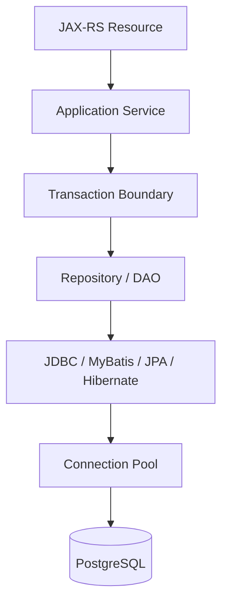
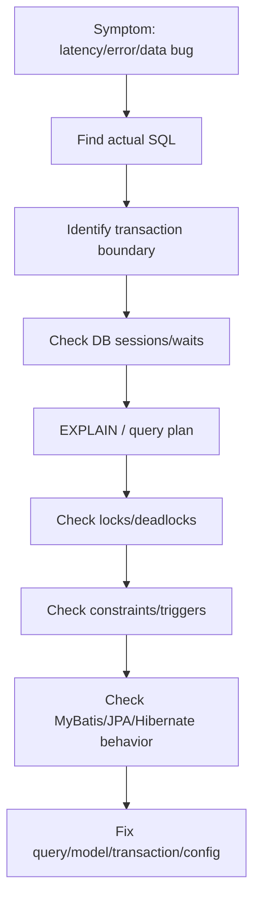

# PostgreSQL Behaviour for Persistence Engineers

## 1. Core Thesis

Persistence engineer tidak cukup hanya memahami JDBC, MyBatis, JPA, atau Hibernate. Semua abstraction itu akhirnya bernegosiasi dengan behavior PostgreSQL.

Banyak bug persistence layer yang terlihat seperti bug Java sebenarnya berakar pada database behavior:

- lost update,
- stale read,
- deadlock,
- serialization failure,
- unique constraint race,
- lock wait,
- bad query plan,
- missing index,
- vacuum impact,
- trigger side effect,
- JSONB query lambat,
- migration lock,
- statement timeout,
- idle transaction,
- N+1 yang menghancurkan pool.

PostgreSQL bukan storage pasif. Ia memiliki MVCC, transaction isolation, lock manager, query planner, constraint engine, trigger/function runtime, background vacuum, dan session-level behavior. Semua ini memengaruhi correctness dan performance aplikasi Java/JAX-RS.

Prinsip senior engineer:

> Framework persistence mengubah cara kita menulis akses data, tetapi PostgreSQL tetap menentukan aturan aktual tentang visibility, concurrency, lock, constraint, dan execution plan.

---

## 2. PostgreSQL in the Persistence Stack

Dalam aplikasi Java/JAX-RS, PostgreSQL berada di belakang beberapa lapisan:



Setiap lapisan bisa menyembunyikan detail, tetapi PostgreSQL tetap menerima:

- SQL statement,
- parameter,
- transaction begin/commit/rollback,
- isolation level,
- lock request,
- session setting,
- connection lifecycle.

Karena itu, saat debugging persistence issue, pertanyaan harus turun sampai database:

- SQL apa yang benar-benar dikirim?
- Transaction apa yang aktif?
- Row/table mana yang locked?
- Index apa yang dipakai?
- Plan apa yang dipilih?
- Constraint mana yang gagal?
- Trigger/function apa yang berjalan?
- Timeout mana yang menembak?

---

## 3. MVCC Mental Model

PostgreSQL menggunakan MVCC: Multi-Version Concurrency Control. Artinya, update tidak langsung menimpa row lama secara konseptual. PostgreSQL membuat versi row baru dan menjaga visibility berdasarkan snapshot transaction.

Mental model sederhana:

```text
Row logical: quote_id = 10

Version A: status = DRAFT      visible to older snapshot
Version B: status = SUBMITTED  visible to newer committed snapshot
```

MVCC memungkinkan reader dan writer tidak selalu saling blocking. Reader bisa membaca snapshot lama sementara writer membuat versi baru. Ini membantu concurrency, tetapi juga menghasilkan behavior yang harus dipahami:

- transaction melihat snapshot tertentu,
- update menghasilkan versi baru,
- row lama perlu dibersihkan vacuum,
- long-running transaction dapat menahan cleanup,
- visibility tergantung isolation level,
- conflict tetap mungkin pada update/lock/constraint.

MVCC bukan berarti tidak ada lock. Write tetap membutuhkan lock. Constraint dan DDL juga bisa membutuhkan lock.

---

## 4. Why MVCC Matters to Java Persistence

MVCC memengaruhi persistence layer dalam beberapa cara:

### 4.1 Stale Read

Service membaca data, service lain mengubah data, service pertama masih memakai snapshot atau entity state lama.

Pada JPA, stale state bisa diperparah oleh persistence context first-level cache. Walaupun database sudah berubah, managed entity tetap memegang state lama sampai refresh/clear atau transaction selesai.

Pada MyBatis, query baru biasanya membaca database lagi, tetapi dalam transaction isolation tertentu snapshot tetap bisa membuat visibility tidak berubah.

### 4.2 Long Transaction

Transaction panjang menahan snapshot lama. Dampaknya:

- vacuum tidak bisa membersihkan row lama tertentu,
- bloat meningkat,
- query plan/performance memburuk,
- lock ditahan lebih lama,
- connection pool tertahan.

### 4.3 Retry Semantics

Serialization failure dan deadlock harus diperlakukan sebagai retryable jika operasi idempotent atau retry logic benar. Tanpa retry strategy, concurrency bug muncul sebagai HTTP 500 sporadis.

### 4.4 Outbox/Event Consistency

State change dan outbox insert harus commit dalam transaction yang sama. MVCC menentukan kapan event row terlihat oleh publisher.

---

## 5. Transaction Isolation in PostgreSQL

Isolation level menentukan visibility dan anomaly yang mungkin terjadi. PostgreSQL umum memakai `READ COMMITTED` sebagai default, tetapi internal system harus diverifikasi.

### 5.1 Read Committed

Setiap statement melihat snapshot data committed pada awal statement tersebut. Dua SELECT dalam transaction yang sama bisa melihat hasil berbeda jika ada commit dari transaction lain di antaranya.

Dampak:

- baik untuk banyak OLTP workload,
- non-repeatable read mungkin terjadi,
- lost update harus dicegah dengan lock/version/constraint,
- MyBatis/JPA query kedua bisa melihat data baru, kecuali JPA first-level cache mengembalikan entity lama.

### 5.2 Repeatable Read

Transaction melihat snapshot yang konsisten sepanjang transaction.

Dampak:

- repeatable read lebih kuat,
- bisa menghindari non-repeatable read,
- serialization-like failure tertentu bisa terjadi,
- long transaction lebih berisiko terhadap stale decision.

### 5.3 Serializable

Isolation paling kuat, tetapi bisa menghasilkan serialization failure yang harus di-retry.

Dampak:

- cocok untuk invariant concurrency kompleks,
- butuh retry policy,
- throughput bisa turun jika conflict tinggi,
- aplikasi harus siap menerima error serialization.

Senior review point:

> Isolation level bukan pengganti modelling invariant. Ia harus dikombinasikan dengan lock, unique constraint, version column, retry, dan idempotency.

---

## 6. Row Locks

PostgreSQL mengambil row lock saat update/delete atau saat eksplisit memakai `SELECT ... FOR UPDATE`.

Contoh:

```sql
select *
from quote
where id = ?
for update;
```

Efek:

- transaction lain yang ingin update row sama akan menunggu,
- lock ditahan sampai commit/rollback,
- lock wait bisa menyebabkan endpoint lambat,
- lock ordering berbeda bisa menyebabkan deadlock.

Dalam Java:

- MyBatis dapat menulis SQL `FOR UPDATE` secara eksplisit.
- JPA dapat memakai `LockModeType.PESSIMISTIC_WRITE`.
- Hibernate akan menghasilkan SQL locking sesuai dialect/provider behavior.

Review point:

- Apakah lock benar-benar diperlukan?
- Apakah lock diambil sedekat mungkin dengan update?
- Apakah transaction setelah lock singkat?
- Apakah ada lock timeout?
- Apakah semua code path memakai urutan lock yang sama?

---

## 7. Lock Wait and Deadlock

### 7.1 Lock Wait

Lock wait terjadi saat transaction menunggu lock yang dipegang transaction lain.

Gejala:

- query terlihat running lama,
- DB CPU mungkin tidak tinggi,
- pool active penuh,
- endpoint timeout,
- PostgreSQL wait event menunjukkan lock,
- blocker transaction mungkin idle in transaction.

### 7.2 Deadlock

Deadlock terjadi ketika dua atau lebih transaction saling menunggu lock.

Contoh:

```text
T1 locks quote A, then wants quote B
T2 locks quote B, then wants quote A
```

PostgreSQL akan mendeteksi deadlock dan membatalkan salah satu transaction.

Aplikasi harus:

- menangani deadlock exception,
- menentukan apakah retry aman,
- memakai lock ordering konsisten,
- mengurangi transaction duration,
- menambah test concurrency untuk flow kritikal.

---

## 8. Unique Constraint Race

Unique constraint adalah alat correctness penting, tetapi race tetap harus dipahami.

Contoh idempotency/order creation:

```sql
create unique index uq_order_external_reference
on orders(external_reference);
```

Dua request paralel bisa sama-sama mengecek “belum ada”, lalu keduanya mencoba insert. Satu berhasil, satu gagal karena unique violation.

Anti-pattern:

```text
SELECT count(*) WHERE key = ?
if count == 0:
  INSERT
```

Pattern lebih aman:

- gunakan unique constraint sebagai final guard,
- tangani unique violation sebagai domain conflict/idempotency hit,
- gunakan `INSERT ... ON CONFLICT` bila cocok,
- pastikan transaction dan response behavior benar.

Dalam JAX-RS:

- unique violation bisa menjadi `409 Conflict`,
- idempotency duplicate bisa menjadi response replay,
- jangan bocorkan detail constraint internal.

---

## 9. PostgreSQL Constraints as Correctness Boundary

Database constraint bukan sekadar validasi tambahan. Ia adalah garis pertahanan terakhir untuk data correctness.

Constraint penting:

- `NOT NULL`,
- `UNIQUE`,
- `CHECK`,
- `FOREIGN KEY`,
- exclusion constraint untuk temporal/range use case,
- partial unique index untuk soft delete/tenant-specific uniqueness.

Application validation bisa gagal karena bug, race, atau bypass path. Constraint database tetap melindungi state durable.

Namun constraint juga punya operational cost:

- migration menambah constraint bisa lock/scan table,
- foreign key bisa memengaruhi delete/update performance,
- unique index bisa menjadi contention point,
- constraint error harus dimapping dengan benar.

Senior review point:

> Invariant penting harus punya database enforcement atau alasan eksplisit kenapa tidak bisa.

---

## 10. Query Planner Mental Model

PostgreSQL tidak menjalankan SQL secara literal baris demi baris seperti yang ditulis. Ia memilih execution plan berdasarkan statistics, index, cost estimate, parameter, dan query shape.

Plan bisa memilih:

- sequential scan,
- index scan,
- bitmap index scan,
- nested loop join,
- hash join,
- merge join,
- sort,
- aggregate,
- materialize,
- parallel execution.

Persistence engineer harus memahami bahwa dua query yang tampak mirip bisa punya cost sangat berbeda.

Contoh:

```sql
select *
from quote
where status = ?
order by created_at desc
limit 50;
```

Query ini membutuhkan index yang cocok dengan filter dan ordering. Tanpa index, ia bisa scan/sort banyak row.

---

## 11. EXPLAIN and EXPLAIN ANALYZE

`EXPLAIN` menunjukkan rencana eksekusi. `EXPLAIN ANALYZE` menjalankan query dan menunjukkan waktu aktual. Gunakan hati-hati di production karena query benar-benar dieksekusi.

Yang dicari:

- estimated rows vs actual rows,
- scan type,
- join strategy,
- sort memory/disk,
- index usage,
- filter after scan,
- loops,
- planning time,
- execution time.

Workflow debugging:

1. Ambil SQL aktual dari log/framework.
2. Ambil parameter representatif.
3. Jalankan EXPLAIN di environment aman.
4. Bandingkan estimated vs actual.
5. Cek index/statistics.
6. Cek apakah query shape bisa diubah.
7. Validasi dengan data volume realistis.

Jangan hanya melihat apakah index ada. Lihat apakah planner benar-benar memakainya.

---

## 12. Index Behaviour

Index membantu read, tetapi menambah cost write dan storage. Index bukan “tambahkan saja”.

Index berguna untuk:

- equality filter,
- range filter,
- ordering,
- join key,
- uniqueness,
- partial condition,
- expression query,
- JSONB lookup tertentu.

Risiko index:

- terlalu banyak index memperlambat insert/update/delete,
- index tidak dipakai karena query expression berbeda,
- composite index urutan kolom salah,
- index tidak membantu large low-selectivity query,
- index untuk dynamic filter sulit optimal,
- migration add index pada table besar bisa mahal,
- index drop bisa menghancurkan query lama.

Review query harus menghubungkan:

- WHERE,
- JOIN,
- ORDER BY,
- LIMIT,
- cardinality,
- data distribution,
- index definition.

---

## 13. JSONB

PostgreSQL JSONB sangat berguna untuk flexible attributes, metadata, integration payload, dan semi-structured data. Tetapi JSONB bukan alasan untuk mengabaikan modelling.

Kapan JSONB cocok:

- payload integration yang berubah-ubah,
- metadata non-core,
- attribute sparse,
- audit snapshot,
- read rarely / write mostly,
- schema evolution cepat dengan bounded query needs.

Kapan JSONB berbahaya:

- field sering dipakai filter/join/order,
- invariant penting tersembunyi di JSON,
- query kompleks tanpa index jelas,
- type validation lemah,
- ORM mapping tidak eksplisit,
- migration/backfill sulit,
- data privacy scanning sulit.

Dalam MyBatis:

- JSONB query bisa ditulis eksplisit,
- TypeHandler bisa map JSONB ke object/string,
- index/operator harus dipahami.

Dalam JPA/Hibernate:

- butuh mapping/custom type/provider feature,
- dirty checking object JSON bisa tricky,
- generated SQL untuk JSONB mungkin kurang natural,
- native query sering lebih realistis untuk JSONB-heavy use case.

---

## 14. Arrays and Enum Types

PostgreSQL mendukung array dan enum. Keduanya bisa berguna, tetapi punya trade-off.

### Array

Cocok untuk beberapa use case sederhana, tetapi hati-hati jika:

- butuh join/filter kompleks,
- butuh constraint per element,
- cardinality besar,
- update element sering,
- analytics/query intensif.

MyBatis biasanya lebih eksplisit untuk array binding/mapping. JPA/Hibernate perlu mapping provider-specific atau converter.

### Enum

PostgreSQL enum memberi constraint kuat di DB, tetapi evolusi enum perlu migration hati-hati.

Alternatif:

- text/varchar + check constraint,
- lookup/reference table,
- application enum + database constraint.

Review point:

- Apakah enum berubah sering?
- Apakah perlu backward compatibility saat deploy?
- Apakah JPA enum mapping pakai string atau ordinal?
- Hindari ordinal enum untuk persistence karena rawan rusak saat urutan berubah.

---

## 15. Functions, Procedures, and Triggers

PostgreSQL function/procedure/trigger bisa memindahkan logic ke database.

Kegunaan:

- audit trail,
- derived columns,
- constraint kompleks,
- data normalization,
- performance-critical operation,
- legacy integration,
- batch server-side logic.

Risiko:

- business logic tersembunyi dari Java code,
- sulit ditest jika tidak ada migration/test discipline,
- side effect tidak terlihat di MyBatis/JPA mapping,
- JPA persistence context stale setelah trigger mengubah column,
- error mapping lebih sulit,
- versioning logic database harus sinkron dengan deployment.

Jika trigger mengubah `updated_at`, `version`, audit fields, atau derived status, JPA entity yang sudah managed mungkin tidak tahu perubahan itu kecuali refresh atau mapping generation strategy tepat.

Review point:

> Trigger side effect harus didokumentasikan sebagai bagian dari persistence contract.

---

## 16. RETURNING Clause

PostgreSQL mendukung `RETURNING` untuk mengambil hasil insert/update/delete.

Contoh:

```sql
insert into quote(customer_id, status)
values (?, 'DRAFT')
returning id, created_at;
```

Kegunaan:

- generated id,
- timestamp dari database,
- version baru,
- computed/default column,
- upsert result.

MyBatis sangat cocok untuk SQL eksplisit dengan `RETURNING`. JDBC juga mendukung generated key pattern, tetapi `RETURNING` memberi kontrol lebih. JPA/Hibernate biasanya mengelola generated id/default melalui mapping, tetapi perlu dipahami kapan value tersedia di entity.

Correctness concern:

- apakah aplikasi memakai timestamp DB atau app server?
- apakah default DB terlihat di object Java?
- apakah version/audit field sinkron?

---

## 17. UPSERT and ON CONFLICT

`INSERT ... ON CONFLICT` berguna untuk idempotency, deduplication, counters, cache table, read model update, dan reference data.

Contoh:

```sql
insert into idempotency_record(idempotency_key, request_hash, status)
values (?, ?, 'PROCESSING')
on conflict (idempotency_key) do nothing;
```

Atau:

```sql
insert into product_read_model(product_id, payload, updated_at)
values (?, ?::jsonb, now())
on conflict (product_id)
do update set payload = excluded.payload, updated_at = now();
```

Risiko:

- conflict target salah,
- update tanpa WHERE menyebabkan stale event overwrite newer data,
- lost update jika upsert tidak membawa version/sequence,
- audit field tidak konsisten,
- JPA entity state tidak tahu MyBatis upsert,
- deadlock pada high contention key.

Review point:

- Apa idempotency/correctness invariant?
- Apakah upsert boleh overwrite?
- Apakah ada event ordering/version guard?
- Apakah `RETURNING` diperlukan?

---

## 18. SKIP LOCKED and Work Queues

`FOR UPDATE SKIP LOCKED` sering dipakai untuk polling worker/outbox/job queue.

Contoh:

```sql
select *
from outbox_event
where status = 'PENDING'
order by created_at
for update skip locked
limit 100;
```

Kegunaan:

- beberapa worker bisa mengambil row berbeda,
- row yang sedang diproses worker lain dilewati,
- mengurangi blocking.

Risiko:

- starvation row tertentu,
- ordering tidak absolut,
- stuck row butuh retry/reaper,
- transaction harus singkat,
- worker crash harus ditangani,
- visibility status harus jelas,
- idempotency publish tetap perlu.

Dalam MyBatis, pattern ini mudah ditulis eksplisit. Dalam JPA, bisa memakai native query atau lock hints, tetapi SQL eksplisit sering lebih jelas untuk queue-like behavior.

---

## 19. Advisory Locks

PostgreSQL advisory lock adalah lock berbasis key aplikasi, bukan row tertentu.

Kegunaan:

- serialize job tertentu,
- prevent duplicate scheduler,
- business-level lock,
- coarse-grained coordination.

Risiko:

- session-level advisory lock bisa bocor jika connection pooling tidak dipahami,
- transaction-level advisory lock lebih mudah dibatasi oleh transaction,
- key collision,
- deadlock jika multiple advisory lock tidak konsisten,
- observability lebih sulit daripada row lock.

Dalam pooled connection environment, sangat hati-hati dengan session-level advisory lock. Jika lock melekat ke session dan connection dikembalikan ke pool tanpa release, request lain bisa terdampak.

Internal verification:

- Apakah advisory lock digunakan?
- Transaction-level atau session-level?
- Bagaimana key dibentuk?
- Bagaimana release/timeout?
- Bagaimana monitoring?

---

## 20. Statement Timeout and Lock Timeout

Timeout adalah guardrail production.

### Statement Timeout

Membatasi durasi statement. Berguna untuk mencegah query runaway.

### Lock Timeout

Membatasi waktu menunggu lock. Berguna agar request tidak menggantung karena blocker.

Trade-off:

- timeout terlalu pendek menyebabkan false failure,
- timeout terlalu panjang membuat thread/connection tertahan,
- timeout harus sesuai endpoint/job type,
- retry harus aman,
- error mapping harus jelas.

Layering timeout harus dikaitkan dengan:

- JAX-RS request timeout,
- transaction timeout,
- connection pool timeout,
- client timeout,
- message consumer timeout.

Review point:

> Timeout tanpa idempotency/retry semantics bisa mengubah performance issue menjadi correctness issue.

---

## 21. Vacuum and Bloat Awareness

PostgreSQL vacuum membersihkan dead tuples dari MVCC. Persistence engineer tidak perlu menjadi DBA penuh, tetapi harus tahu behavior yang bisa mengganggu vacuum.

Penyebab bloat/cleanup tertahan:

- long-running transaction,
- idle in transaction,
- batch update besar,
- frequent update pada table besar,
- missing autovacuum tuning,
- replication slot issue,
- transaction snapshot lama.

Dampak ke aplikasi:

- query makin lambat,
- index/table membesar,
- planner estimate memburuk,
- storage meningkat,
- migration/backfill makin mahal.

Connection pool dan transaction boundary berhubungan langsung dengan vacuum: transaction panjang dari aplikasi dapat memperburuk database walaupun query individual tampak normal.

---

## 22. Prepared Statements and Parameter Sensitivity

JDBC/MyBatis/JPA memakai prepared statement atau parameterized query. Ini bagus untuk security dan performance, tetapi query planner bisa dipengaruhi parameter distribution.

Concern:

- parameter tertentu sangat selektif, parameter lain tidak,
- generic plan vs custom plan behavior,
- dynamic SQL menghasilkan banyak query shape,
- prepared statement caching di driver/pool/proxy bisa berinteraksi dengan PostgreSQL/proxy.

Praktisnya:

- Selalu gunakan parameter binding untuk user input.
- Untuk query lambat, analisis dengan parameter nyata.
- Jangan EXPLAIN hanya dengan nilai dummy yang tidak representatif.
- Dynamic SQL harus direview agar query shape tetap manageable.

---

## 23. PostgreSQL and JPA/Hibernate Generated SQL

Hibernate dapat menghasilkan SQL yang valid tetapi tidak selalu optimal.

Contoh risk:

- join terlalu banyak karena eager relationship,
- N+1 karena lazy loading,
- update semua column bukan changed column tergantung config,
- flush before query,
- pagination dengan fetch join bermasalah,
- bulk update membuat persistence context stale,
- sequence allocation strategy tidak optimal,
- implicit query dari dirty checking tidak terlihat.

Persistence engineer harus melihat generated SQL, bukan hanya JPQL/entity mapping.

Checklist:

- Aktifkan SQL logging aman di dev/test.
- Ambil SQL aktual untuk endpoint kritikal.
- EXPLAIN query generated Hibernate.
- Cek query count.
- Cek flush timing.
- Cek index support untuk generated WHERE/JOIN/ORDER BY.

---

## 24. PostgreSQL and MyBatis Explicit SQL

MyBatis memberi kontrol SQL lebih besar. Itu keuntungan sekaligus tanggung jawab.

Keuntungan:

- SQL terlihat,
- PostgreSQL feature mudah dipakai,
- query plan lebih mudah dikontrol,
- projection bisa presisi,
- reporting/complex query lebih natural.

Risiko:

- dynamic SQL injection jika `${}` salah,
- duplicate SQL antar mapper,
- ResultMap mismatch,
- manual optimistic locking lupa,
- tenant/soft delete filter lupa,
- SQL PostgreSQL-specific sulit portable,
- query besar sulit dipahami tanpa convention.

Review MyBatis harus selalu mencakup:

- SQL correctness,
- parameter binding,
- index/plan,
- transaction/lock behavior,
- mapping result,
- tenant/security/soft delete condition,
- test branch dynamic SQL.

---

## 25. PostgreSQL and JDBC Direct

JDBC langsung memberi kontrol paling eksplisit.

Cocok untuk:

- performance-critical low-level path,
- streaming besar,
- batch khusus,
- driver-specific behavior,
- minimal abstraction integration.

Risiko:

- boilerplate,
- resource leak,
- inconsistent exception mapping,
- transaction ownership manual,
- duplicate mapping logic,
- kurang convention.

Jika JDBC langsung dipakai, code review harus lebih ketat pada:

- try-with-resources,
- prepared statement,
- fetch size,
- batch handling,
- generated key/RETURNING,
- SQLState mapping,
- timeout,
- connection ownership.

---

## 26. PostgreSQL in Java/JAX-RS Request Lifecycle

Dalam JAX-RS service, PostgreSQL behavior memengaruhi response path.

Contoh mapping:

- unique violation → `409 Conflict` atau idempotency replay,
- foreign key violation → domain validation/internal consistency issue,
- lock timeout → `409/423/503` tergantung contract,
- statement timeout → `504/503` atau domain timeout,
- serialization failure → retry internal atau `503` jika exhausted,
- deadlock → retry internal atau `503`,
- no rows updated for version check → optimistic lock conflict.

Jangan expose raw SQL error ke client. Tetapi log internal harus cukup kaya untuk diagnosis:

- SQLState,
- constraint name,
- operation/use case,
- correlation id,
- transaction id jika ada,
- sanitized parameters,
- endpoint,
- retry count.

---

## 27. Microservices and Event-Driven Impact

PostgreSQL behavior juga memengaruhi Kafka/RabbitMQ/Camunda integration.

### Outbox

Outbox row baru terlihat setelah commit. Publisher yang polling tidak boleh membaca uncommitted state.

### Inbox/Idempotency

Unique constraint sering menjadi dedup guard. Race harus ditangani sebagai expected condition.

### Saga

State transition harus atomic dengan event/command record yang relevan.

### Read Model

Upsert read model harus memperhatikan event ordering agar event lama tidak overwrite event baru.

### Camunda/Workflow

Workflow step yang membaca database harus memahami transaction visibility dan commit timing. Jangan trigger workflow berdasarkan state yang belum committed.

---

## 28. Kubernetes/Cloud/On-Prem Considerations

PostgreSQL behavior tidak terlepas dari deployment topology.

### Kubernetes

- rolling deployment bisa menjalankan dua versi schema access,
- migration lock bisa memblokir pods,
- connection storm memperburuk DB,
- pod termination saat transaction aktif perlu ditangani,
- job/worker concurrency harus dibatasi.

### AWS/Azure PostgreSQL

- instance size menentukan CPU/memory/connection limit,
- failover dapat memutus connection,
- maintenance window memengaruhi availability,
- parameter setting bisa berbeda per environment,
- read replica lag penting untuk read path.

### On-Prem

- DBA policy mungkin berbeda,
- monitoring access perlu prosedur,
- network latency/firewall timeout bisa memengaruhi connection,
- migration process bisa lebih manual.

Hybrid deployment membuat asumsi latency dan failover harus diverifikasi per environment.

---

## 29. Failure Modes to Recognize

### 29.1 Lost Update

Dua request membaca value sama lalu update berdasarkan value lama. Cegah dengan optimistic lock, pessimistic lock, atomic SQL update, atau constraint.

### 29.2 Write Skew

Dua transaction masing-masing melihat kondisi valid, lalu commit membuat invariant global rusak. Cegah dengan serializable, lock, constraint, atau redesign invariant.

### 29.3 Deadlock

Dua transaction lock resource dalam urutan berbeda. Cegah dengan lock ordering dan transaction pendek.

### 29.4 Serialization Failure

Serializable/repeatable read conflict. Tangani dengan retry yang aman.

### 29.5 Unique Race

Check-then-insert tidak aman. Gunakan constraint/upsert dan mapping error benar.

### 29.6 Bad Query Plan

Planner memilih plan mahal karena statistics/index/query shape. Debug dengan EXPLAIN ANALYZE.

### 29.7 Migration Lock

DDL menahan lock dan memblokir traffic. Gunakan expand-contract dan migration strategy aman.

### 29.8 Stale JPA Entity After DB Trigger/MyBatis Update

Database berubah tetapi persistence context masih punya state lama. Gunakan refresh/clear atau hindari mixing unsafe.

### 29.9 JSONB Query Slow

Query pada JSONB field tanpa index/operator tepat. Review modelling/index.

### 29.10 Idle in Transaction

Connection menahan transaction tanpa progress. Bisa menahan lock/vacuum dan menghabiskan pool.

---

## 30. Debugging PostgreSQL-Related Persistence Failure

Flow umum:



Pertanyaan kunci:

1. SQL aktual apa yang dikirim?
2. Parameter aktual apa?
3. Transaction isolation apa?
4. Apakah ada lock wait?
5. Apakah query memakai index?
6. Apakah estimated rows jauh dari actual rows?
7. Apakah ada trigger/function side effect?
8. Apakah JPA persistence context stale?
9. Apakah MyBatis update bypass JPA entity?
10. Apakah timeout/retry/idempotency benar?

---

## 31. Trade-Offs

### PostgreSQL Feature Usage vs Portability

Menggunakan JSONB, RETURNING, UPSERT, SKIP LOCKED, advisory lock membuat solusi kuat di PostgreSQL tetapi mengurangi portability. Dalam enterprise system yang memang standard PostgreSQL, ini bisa acceptable jika didokumentasikan.

### Database Constraint vs Application Flexibility

Constraint meningkatkan correctness tetapi membuat migration dan data repair perlu disiplin.

### Locking Stronger vs Throughput

Pessimistic lock/serializable isolation bisa menjaga invariant tetapi menurunkan concurrency.

### SQL Explicitness vs ORM Productivity

MyBatis/native SQL memberi visibility, JPA memberi lifecycle abstraction. Pilihan harus berdasarkan use case.

### Trigger Logic vs Application Visibility

Trigger bisa menjaga consistency dekat data, tetapi menyembunyikan behavior dari code Java.

---

## 32. Correctness Concerns

Checklist correctness:

- Apakah invariant dijaga database atau hanya aplikasi?
- Apakah lost update dicegah?
- Apakah duplicate request dicegah unique constraint/idempotency?
- Apakah isolation level cukup?
- Apakah retry aman?
- Apakah lock ordering konsisten?
- Apakah JPA persistence context bisa stale?
- Apakah trigger/function side effect diketahui?
- Apakah soft delete/tenant/effective date selalu difilter?
- Apakah outbox/inbox commit semantics benar?

---

## 33. Performance Concerns

Checklist performance:

- Apakah query plan diketahui?
- Apakah index cocok dengan WHERE/JOIN/ORDER BY?
- Apakah query count terkendali?
- Apakah JSONB query di-index dengan benar?
- Apakah transaction terlalu panjang?
- Apakah lock wait terjadi?
- Apakah batch update terlalu besar?
- Apakah pagination memakai large offset?
- Apakah vacuum/bloat menjadi faktor?
- Apakah pool penuh karena query lambat?

---

## 34. Security and Privacy Concerns

PostgreSQL behavior juga memengaruhi security/privacy:

- SQL injection harus dicegah parameter binding.
- Dynamic SQL harus whitelist identifiers/sorting.
- Row-level security jika digunakan harus diuji dengan connection pool/session context.
- Sensitive data tidak boleh muncul di SQL logs.
- JSONB bisa menyimpan PII tersembunyi.
- Trigger/audit table bisa menyalin sensitive data.
- Backup/export/test data harus mengikuti policy.
- DB user permission harus least privilege.

Review point:

> Query benar secara syntax belum tentu aman secara tenant, privacy, dan auditability.

---

## 35. Observability Concerns

Observability PostgreSQL yang penting untuk persistence engineer:

- active sessions,
- wait events,
- lock waits,
- deadlocks,
- slow queries,
- query duration percentile,
- rows returned/affected,
- temporary file usage,
- index usage,
- cache hit ratio,
- transaction duration,
- idle in transaction,
- connection count per application_name,
- statement timeout count,
- error by SQLState.

Aplikasi harus menambahkan konteks:

- endpoint/use case,
- repository/mapper method,
- transaction name,
- correlation id,
- sanitized parameter category,
- retry count,
- tenant/customer context jika aman.

---

## 36. PR Review Checklist

Saat PR menyentuh query/schema/transaction, tanyakan:

1. SQL aktual apa yang akan dijalankan?
2. Apakah query punya index yang cocok?
3. Apakah perlu EXPLAIN untuk data volume production?
4. Apakah query bisa menyebabkan lock wait?
5. Apakah transaction boundary terlalu panjang?
6. Apakah isolation/locking strategy jelas?
7. Apakah constraint database menjaga invariant?
8. Apakah unique race ditangani?
9. Apakah JPA persistence context bisa stale?
10. Apakah MyBatis update bypass entity/cache?
11. Apakah trigger/function side effect ada?
12. Apakah JSONB/array/enum mapping aman?
13. Apakah migration backward-compatible?
14. Apakah timeout/retry/idempotency jelas?
15. Apakah SQL log aman dari PII?

---

## 37. Internal Verification Checklist

### PostgreSQL Runtime

- PostgreSQL version.
- Default transaction isolation.
- `statement_timeout`.
- `lock_timeout`.
- `idle_in_transaction_session_timeout` jika ada.
- `max_connections`.
- Autovacuum configuration awareness.
- Read replica availability/lag monitoring.
- PgBouncer/proxy usage.

### Schema and Constraints

- Core tables for quote/order/catalog.
- Primary/foreign keys.
- Unique constraints.
- Check constraints.
- Partial indexes.
- JSONB columns.
- Enum types.
- Array columns.
- Trigger/function/procedure definitions.

### Query and Index

- Top slow queries.
- Query plans for critical endpoints.
- Index usage stats.
- Large table scans.
- Dynamic search queries.
- Pagination queries.
- Reporting/export queries.

### Transaction and Locking

- Isolation level configuration.
- Pessimistic lock usage.
- Optimistic lock/version strategy.
- Deadlock incidents.
- Lock wait dashboard.
- Long-running transaction dashboard.
- Idle in transaction incidents.

### Framework Integration

- MyBatis mapper SQL using PostgreSQL-specific features.
- JPA/Hibernate dialect/configuration.
- Generated SQL visibility.
- Native query usage.
- Stored procedure/function call from Java.
- MyBatis + JPA same table/use case access.

### Migration and Operations

- Liquibase/Flyway usage.
- DDL lock strategy.
- Index creation policy.
- Backfill process.
- Rollback/roll-forward policy.
- Cloud/on-prem environment differences.
- DBA/platform escalation process.

---

## 38. Mini Case Study: Unique Race in Quote Submit

Scenario:

- Endpoint submit quote membuat order draft berdasarkan quote id.
- Code melakukan SELECT untuk cek order existing.
- Dua request submit datang hampir bersamaan.
- Keduanya melihat order belum ada.
- Keduanya insert.
- Duplicate order terjadi atau salah satu gagal tidak tertangani.

Solusi senior:

- Tambahkan unique constraint pada natural id/external reference/quote id sesuai invariant.
- Gunakan insert dengan conflict handling atau tangani unique violation.
- Pastikan response duplicate sesuai contract idempotency.
- Tambahkan concurrency test.
- Pastikan outbox event tidak double publish.

Lesson:

> Check-then-insert tanpa constraint bukan correctness strategy.

---

## 39. Mini Case Study: JPA Entity Stale After MyBatis Update

Scenario:

- Service memuat `QuoteEntity` via JPA.
- Dalam transaction yang sama, MyBatis mapper menjalankan update langsung ke table quote.
- Code kemudian membaca field dari managed entity.
- Field masih value lama karena persistence context JPA tidak otomatis tahu update MyBatis.

Risiko:

- response salah,
- decision bisnis salah,
- flush berikutnya bisa overwrite perubahan MyBatis,
- audit/event payload stale.

Mitigasi:

- hindari same-use-case mixed write,
- flush sebelum MyBatis read jika perlu,
- clear/refresh setelah MyBatis write jika benar-benar perlu,
- pisahkan read model/projection dari aggregate lifecycle,
- dokumentasikan ownership table/use case,
- tambahkan integration test.

Lesson:

> PostgreSQL sudah berubah, tetapi JPA persistence context bisa tetap hidup di masa lalu.

---

## 40. Mini Case Study: Migration Adds Index and Blocks Traffic

Scenario:

- Migration menambahkan index pada table besar saat deployment.
- DDL memegang lock lebih lama dari expected.
- Write path quote/order mulai timeout.
- Pool active penuh karena query menunggu lock.

Solusi senior:

- Pahami lock behavior DDL.
- Gunakan strategy index creation yang aman untuk table besar sesuai PostgreSQL/version/policy internal.
- Jalankan migration berat terpisah dari app rollout jika perlu.
- Monitor lock wait saat migration.
- Siapkan rollback/roll-forward plan.
- Test migration pada data volume realistis.

Lesson:

> Migration adalah production operation, bukan sekadar file SQL di repository.

---

## 41. Practical Heuristics

- Jangan percaya ORM abstraction sebelum melihat SQL aktual.
- Jangan percaya query cepat di dev tanpa data volume realistis.
- Jangan melakukan check-then-insert untuk invariant unik tanpa constraint.
- Jangan membuka transaction panjang untuk external call.
- Jangan memakai pessimistic lock tanpa lock timeout dan ordering jelas.
- Jangan memakai JSONB untuk field yang menjadi core relational invariant tanpa alasan kuat.
- Jangan memakai trigger tanpa dokumentasi side effect.
- Jangan menambah index tanpa melihat write cost dan migration impact.
- Jangan menganggap pool exhaustion sebagai masalah pool saja.
- Jangan menganggap read replica aman untuk read-after-write.
- Jangan mixing MyBatis update dan JPA managed entity tanpa refresh/clear/ownership policy.

---

## 42. Summary

PostgreSQL adalah bagian aktif dari persistence architecture. Ia menentukan visibility melalui MVCC, concurrency melalui locks dan isolation, correctness melalui constraints, performance melalui planner dan index, extensibility melalui JSONB/function/trigger, dan safety melalui timeout serta operational behavior.

Yang harus dikuasai:

- MVCC membuat reader/writer lebih concurrent tetapi membawa stale snapshot dan vacuum concerns.
- Isolation level memengaruhi visibility dan retry semantics.
- Row lock, deadlock, dan lock wait harus dipahami dari transaction boundary.
- Unique constraint adalah correctness guard terhadap race.
- Query planner dan index menentukan latency lebih dari bentuk code Java.
- JSONB, UPSERT, RETURNING, SKIP LOCKED, dan advisory lock powerful tetapi harus direview dengan trade-off.
- JPA/Hibernate generated SQL dan MyBatis explicit SQL sama-sama harus dianalisis di level PostgreSQL.
- Production debugging persistence harus turun sampai SQL, plan, lock, session, constraint, dan transaction.

Senior engineer yang kuat di persistence layer tidak hanya bertanya “framework apa yang dipakai?”, tetapi:

> Bagaimana PostgreSQL benar-benar melihat query, transaction, lock, constraint, dan data volume dari perubahan ini saat production traffic, deployment, retry, dan concurrency terjadi bersamaan?
